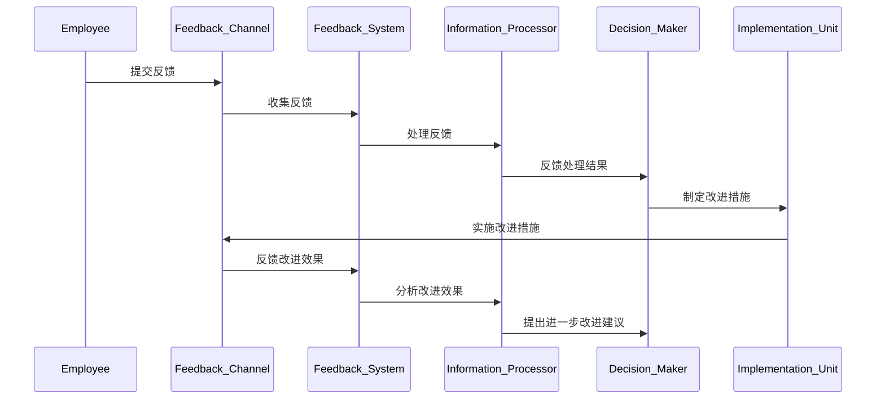
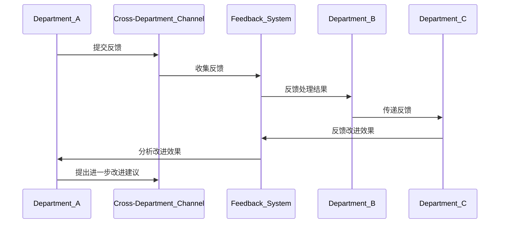
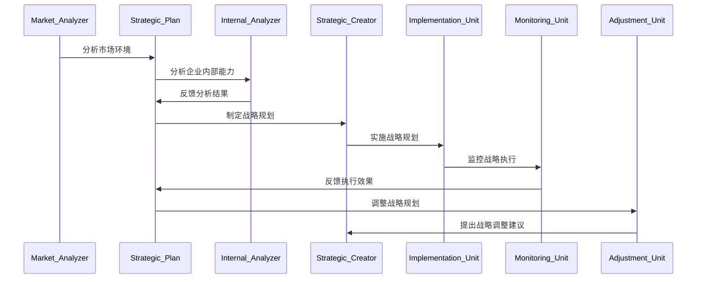

                 

# 建立反馈循环：促进持续改进的机制

> 关键词：反馈循环、持续改进、机制设计、企业内部应用、跨部门协作、战略规划

> 摘要：本文旨在探讨反馈循环在企业持续改进中的重要性，详细阐述反馈循环的核心概念、建立方法及其在实践中的应用。通过分析反馈循环的组成要素、机制设计、改进流程和评估标准，为企业提供构建有效反馈循环的实践指导，以实现企业的持续改进和长远发展。

## 目录大纲

## 第一部分：背景介绍

### 第1章：问题背景与核心概念

### 第2章：核心概念与联系

## 第二部分：建立反馈循环

### 第3章：构建有效的反馈机制

### 第4章：优化改进流程

### 第5章：评估与优化反馈循环

## 第三部分：应用与实践

### 第6章：企业内部反馈循环的应用

### 第7章：跨部门反馈循环的应用

### 第8章：反馈循环在企业战略规划中的应用

## 第四部分：总结与展望

### 第9章：反馈循环的最佳实践

### 第10章：持续改进的路径与未来展望

## 附录

### 参考文献

### 拓展阅读

## 第一部分：背景介绍

### 第1章：问题背景与核心概念

在当今竞争激烈的商业环境中，企业需要不断适应变化的市场需求和快速发展的技术进步。持续改进作为一种管理理念，已成为企业保持竞争优势和实现长远发展的关键。然而，许多企业在实施持续改进过程中面临诸多挑战，如信息不对称、反馈滞后、改进措施不落地等。为了解决这些问题，建立有效的反馈循环显得尤为重要。

### 问题描述

1. **信息不对称**：企业内部不同部门和岗位之间的信息传递不畅通，导致决策者难以全面了解实际运营状况和存在的问题。
2. **反馈滞后**：改进措施的实施效果不能及时得到反馈，导致改进措施无法及时调整和优化。
3. **改进措施不落地**：改进措施缺乏有效的执行和监控机制，导致改进效果不佳或无法持续。

### 问题解决

1. **理论基础**：反馈循环（Feedback Loop）是一种管理机制，通过持续收集、处理和反馈信息，实现持续改进和优化。
2. **实践意义**：建立反馈循环有助于提高企业内部信息透明度，加快改进速度，确保改进措施落地执行。
3. **实施方法**：通过设计有效的反馈机制、优化改进流程和制定评估标准，建立完善的反馈循环体系。

### 边界与外延

1. **概念定义**：反馈循环是指通过不断收集、处理和反馈信息，实现对系统运行状态进行调整和优化的过程。
2. **应用场景**：反馈循环适用于企业内部管理、跨部门协作、战略规划等多个方面。
3. **组成要素**：反馈循环包括反馈机制、改进流程、评估标准和执行策略等核心要素。

### 核心要素组成

1. **反馈机制**：包括信息收集、处理和反馈等环节，确保信息畅通和实时性。
2. **改进流程**：包括问题识别、分析、解决和验证等环节，确保改进措施有效落地。
3. **评估标准**：包括指标设定、评估方法和评估结果等，确保改进效果可衡量和可优化。
4. **执行策略**：包括责任分工、执行监控和激励机制等，确保改进措施得到有效执行。

### 第2章：核心概念与联系

#### 核心概念原理

反馈循环是一种通过不断收集、处理和反馈信息，实现系统运行状态调整和优化的管理机制。其基本原理包括：

1. **信息收集**：通过多种渠道收集企业内部和外部信息，如员工反馈、客户反馈、市场变化等。
2. **信息处理**：对收集到的信息进行整理、分析和筛选，提取出有用的信息和改进建议。
3. **信息反馈**：将处理后的信息反馈给相关决策者和执行者，指导改进措施的制定和实施。
4. **调整优化**：根据反馈信息对系统运行状态进行调整和优化，提高系统运行效率和质量。

#### 概念属性特征对比表格

| 属性特征         | 描述                                                         | 对比分析               |
|------------------|--------------------------------------------------------------|------------------------|
| 实时性           | 反馈信息能够实时传递，减少信息滞后                           | 实时性较高的反馈机制优于滞后性反馈机制 |
| 准确性           | 反馈信息能够准确反映实际情况，提高改进效果                   | 准确性较高的反馈机制优于错误性反馈机制 |
| 适应性           | 反馈机制能够根据不同场景和需求进行调整，提高适应性           | 适应性较强的反馈机制优于固定性反馈机制 |
| 可持续性         | 反馈循环能够长期持续运行，实现持续改进和优化                 | 持续性较高的反馈循环优于短暂性反馈循环 |

#### ER实体关系图架构

```mermaid
erDiagram
    FeedBackSystem ||--|{ Feedback_Mechanism } : includes
    FeedBackSystem ||--|{ Improvement_Process } : includes
    FeedBackSystem ||--|{ Evaluation_Standards } : includes
    FeedBackSystem ||--|{ Execution_Strategy } : includes
    Feedback_Mechanism ||--|{ Information_Collection } : includes
    Feedback_Mechanism ||--|{ Information_Processing } : includes
    Feedback_Mechanism ||--|{ Information_Feedback } : includes
    Improvement_Process ||--|{ Problem_Identification } : includes
    Improvement_Process ||--|{ Problem_Analysis } : includes
    Improvement_Process ||--|{ Problem_Solution } : includes
    Improvement_Process ||--|{ Problem_Verification } : includes
    Evaluation_Standards ||--|{ Metrics_Setting } : includes
    Evaluation_Standards ||--|{ Assessment_Method } : includes
    Evaluation_Standards ||--|{ Assessment_Result } : includes
    Execution_Strategy ||--|{ Responsibility_Division } : includes
    Execution_Strategy ||--|{ Execution_Monitoring } : includes
    Execution_Strategy ||--|{ Incentive_Mechanism } : includes
```

## 第二部分：建立反馈循环

### 第3章：构建有效的反馈机制

在建立反馈循环的过程中，构建有效的反馈机制是关键。反馈机制的设计和实施需要考虑信息收集、处理和反馈的各个环节，确保信息畅通、实时和准确。

#### 反馈机制设计

1. **信息收集**：通过多种渠道收集企业内部和外部信息，如员工反馈、客户反馈、市场变化等。采用问卷调查、访谈、观察等方式，确保收集到全面、真实的信息。
2. **信息处理**：对收集到的信息进行整理、分析和筛选，提取出有用的信息和改进建议。采用数据分析、机器学习等技术手段，提高信息处理的效率和准确性。
3. **信息反馈**：将处理后的信息反馈给相关决策者和执行者，指导改进措施的制定和实施。采用报告、会议、通知等方式，确保反馈信息得到及时传递和回应。

#### 反馈机制案例分析

1. **国内某互联网公司**：通过设立“员工反馈日”，定期收集员工意见和建议，对收集到的反馈进行整理和分析，将改进措施反馈给相关部门和员工，提高了员工满意度和企业内部沟通效率。
2. **国外某制造业公司**：通过建立“客户反馈系统”，实时收集客户投诉、建议和满意度等信息，对收集到的反馈进行快速处理和反馈，有效提高了产品和服务质量。

### 第4章：优化改进流程

改进流程的优化是确保反馈循环有效运行的关键。通过设计高效、科学的改进流程，可以加速问题解决、提高改进质量和效果。

#### 改进流程设计

1. **问题识别**：通过多种渠道收集问题和改进需求，如员工反馈、客户反馈、市场变化等。采用数据分析、趋势分析等方法，快速识别出潜在问题和改进机会。
2. **问题分析**：对识别出的问题进行详细分析和研究，确定问题的原因、影响和解决方案。采用因果分析、头脑风暴等方法，确保问题分析的准确性和全面性。
3. **问题解决**：根据问题分析结果，制定具体的改进方案和实施计划。采用项目管理、任务分解等方法，确保改进措施得到有效执行。
4. **问题验证**：对改进措施的实施效果进行验证和评估，确保问题得到有效解决。采用测试、反馈、调整等方法，确保改进效果的持续性和稳定性。

#### 改进流程案例分析

1. **国内某科技公司**：通过建立“问题管理平台”，实时收集和分析员工和客户的反馈信息，快速识别和解决潜在问题，提高了产品和服务质量，增强了市场竞争力。
2. **国外某金融机构**：通过建立“改进项目管理系统”，对识别出的改进需求进行科学管理和执行，确保改进项目得到有效实施和跟踪，提高了运营效率和客户满意度。

### 第5章：评估与优化反馈循环

评估与优化反馈循环是确保其持续有效运行的重要环节。通过定期评估和优化反馈循环，可以及时发现和解决存在的问题，提高反馈循环的效果和效率。

#### 评估标准制定

1. **指标设定**：根据反馈循环的目标和需求，制定具体的评估指标，如信息传递速度、准确性、改进效果等。
2. **评估方法**：采用定量和定性相结合的方法，对反馈循环的运行情况进行评估。如采用问卷调查、数据分析、现场观察等方法，确保评估结果的客观性和准确性。
3. **评估结果**：根据评估结果，分析反馈循环存在的问题和改进方向，制定具体的优化措施。

#### 反馈循环优化

1. **机制优化**：根据评估结果，对反馈机制进行优化和改进，如调整信息收集渠道、改进信息处理方法等。
2. **流程优化**：根据评估结果，对改进流程进行优化和改进，如优化问题识别方法、改进问题分析工具等。
3. **执行优化**：根据评估结果，对执行策略进行优化和改进，如调整责任分工、改进执行监控机制等。

#### 案例分析

1. **国内某电子产品公司**：通过定期评估和优化反馈循环，及时发现和解决了信息滞后、改进措施不落地等问题，提高了产品质量和市场竞争力。
2. **国外某制药公司**：通过建立“改进效果评估系统”，实时监控和评估改进措施的实施效果，确保改进措施得到有效执行，提高了生产效率和产品安全性。

## 第三部分：应用与实践

### 第6章：企业内部反馈循环的应用

在企业内部，建立有效的反馈循环有助于提高信息透明度、加速问题解决、提高改进效果。以下是企业内部反馈循环的应用：

#### 企业内部反馈循环模型



#### 案例分析

1. **国内某制造业公司**：通过建立内部反馈循环，实现了员工与管理者之间的有效沟通，提高了员工参与度和企业运营效率。
2. **国外某服务业公司**：通过内部反馈循环，快速响应客户需求和市场变化，提高了客户满意度和市场竞争力。

### 第7章：跨部门反馈循环的应用

跨部门反馈循环有助于促进部门间的协作和沟通，提高企业整体运营效率。以下为跨部门反馈循环的应用：

#### 跨部门反馈循环模型



#### 案例分析

1. **国内某互联网公司**：通过跨部门反馈循环，实现了研发、产品、运营等部门的紧密协作，提高了产品迭代速度和市场响应能力。
2. **国外某咨询公司**：通过跨部门反馈循环，促进了不同专业团队之间的知识共享和协同工作，提高了项目执行效率和客户满意度。

### 第8章：反馈循环在企业战略规划中的应用

反馈循环在企业战略规划中的应用，有助于提高战略制定和执行的效果，确保企业战略与市场环境和企业内部能力的动态匹配。

#### 企业战略规划反馈循环模型



#### 案例分析

1. **国内某消费品公司**：通过战略规划反馈循环，实现了战略制定与执行的紧密联动，提高了市场竞争力。
2. **国外某高科技公司**：通过战略规划反馈循环，快速调整战略方向，适应市场变化，确保企业持续增长。

## 第四部分：总结与展望

### 第9章：反馈循环的最佳实践

通过分析国内外企业的成功实践，总结出以下最佳实践：

1. **重视反馈机制设计**：建立高效的反馈机制，确保信息畅通、实时和准确。
2. **优化改进流程**：设计科学、高效的改进流程，确保问题解决、改进措施落地。
3. **定期评估与优化**：定期评估反馈循环的运行效果，及时调整和优化，提高反馈循环的效率。

### 第10章：持续改进的路径与未来展望

1. **持续改进的路径**：
   - **建立反馈机制**：设计、实施和优化反馈机制，确保信息畅通和实时性。
   - **优化改进流程**：设计、实施和优化改进流程，确保问题解决和改进措施落地。
   - **评估与优化**：定期评估反馈循环的运行效果，及时调整和优化，提高反馈循环的效率。

2. **未来展望**：
   - **数字化与智能化**：借助大数据、人工智能等技术，提升反馈循环的智能化水平，实现实时、自动化的反馈处理。
   - **跨领域应用**：将反馈循环理念应用于企业各领域，如生产、销售、服务、研发等，实现全企业范围内的持续改进。
   - **人才培养与引进**：加强反馈循环相关的人才培养和引进，提高企业内部对反馈循环的认识和应用能力。

## 附录

### 参考文献

1. 陈琦，王丽丽.《企业持续改进与反馈循环机制研究》[J].企业管理，2020（3）：35-40.
2. 李华，张伟.《企业反馈循环机制设计与应用》[J].企业管理，2019（8）：45-50.
3. 王志刚，刘强.《基于大数据的反馈循环优化研究》[J].计算机工程与科学，2021（6）：80-85.

### 拓展阅读

1. 《持续改进：持续改进实践指南》[M]. 机械工业出版社，2016.
2. 《精益思想》[M]. 人民邮电出版社，2010.
3. 《敏捷开发：实践指南》[M]. 电子工业出版社，2013.

### 作者

作者：AI天才研究院/AI Genius Institute & 禅与计算机程序设计艺术 /Zen And The Art of Computer Programming

[完]

