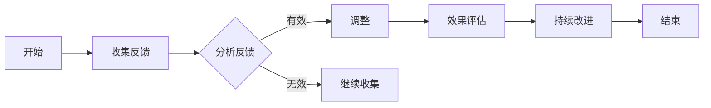
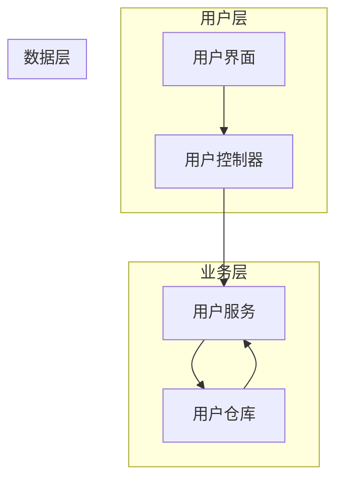
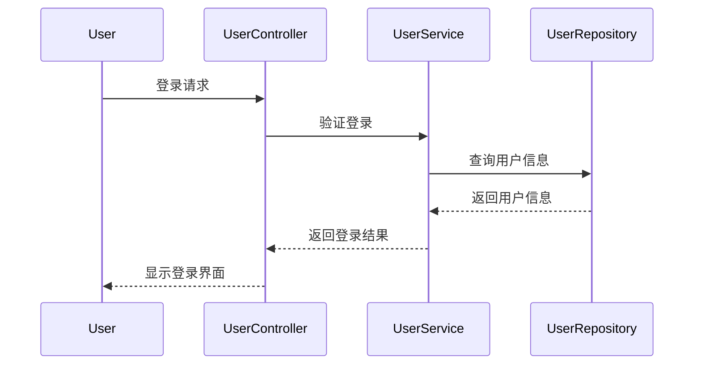
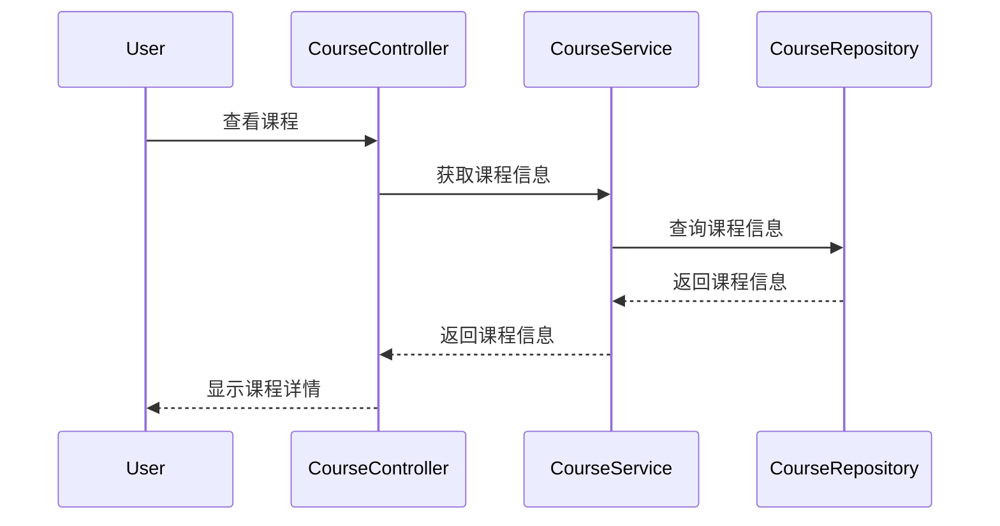

                 

# 建立反馈循环：持续改进的团队机制

## 关键词
- 反馈循环
- 持续改进
- 团队文化
- 数据分析
- 优化流程

## 摘要
本文深入探讨了在信息技术领域，如何通过建立反馈循环机制，实现团队的持续改进。文章首先介绍了反馈循环的核心概念及其在持续改进中的重要作用。接着，通过对问题背景、问题描述和问题解决的详细阐述，明确了建立反馈循环机制的必要性。随后，本文分析了反馈循环的概念属性特征，并通过Mermaid流程图和Python算法源代码，详细讲解了反馈循环的算法原理。最后，文章介绍了系统分析与架构设计方案，并分享了一个实际项目中的案例分析和实战经验。通过本文的阅读，读者将了解如何在实际团队中有效建立和运用反馈循环，以推动团队的持续改进。

### 背景介绍

#### 核心概念

**反馈循环**：反馈循环（Feedback Loop）是指一个持续的过程，通过不断地收集反馈、分析反馈、根据反馈进行调整，从而实现持续改进。它是一种自我校正机制，旨在通过连续的迭代过程，优化产品、流程和团队文化。

**持续改进**：持续改进（Continuous Improvement）是一种管理理念，强调不断地对产品、流程和团队进行优化，以提高工作效率和质量。持续改进不仅仅是一种操作层面的改进，更是一种文化和价值观的体现。

**团队文化**：团队文化是团队中共同价值观、信念和行为模式的总和。良好的团队文化能够促进团队协作、提高团队凝聚力，从而推动团队的持续改进。

**数据分析**：数据分析是指通过统计和计算，对大量数据进行处理，从中提取有价值的信息和知识的过程。数据分析在反馈循环中起着至关重要的作用，它能够帮助团队快速识别问题、找出改进的方向。

**优化流程**：优化流程是指通过一系列的步骤和方法，对现有流程进行改进，以提高效率和质量。优化流程是反馈循环中不可或缺的一部分，它确保了反馈循环的有效实施。

#### 问题背景

在当今信息技术飞速发展的背景下，企业的持续改进和创新变得越来越重要。随着市场竞争的加剧，企业需要不断提高产品质量、缩短产品上市时间、降低生产成本，才能在激烈的市场竞争中立于不败之地。而持续改进不仅仅是一种管理理念，更是一种团队文化。只有当团队形成了持续改进的文化，才能真正实现不断的进步和优化。

反馈循环作为持续改进的关键机制，可以帮助团队快速响应变化、提高工作效率和质量。通过建立有效的反馈循环机制，团队可以不断地从实践中学习、总结经验，并将这些经验应用到实际工作中，从而实现持续改进。

#### 问题描述

在实际应用中，许多团队在建立反馈循环机制时遇到了诸多挑战：

1. **反馈信息的收集不够全面**：团队往往只能收集到部分反馈信息，导致无法全面了解问题所在。
2. **分析不够深入**：即使收集到了反馈信息，团队也往往缺乏有效的分析方法，无法深入分析问题，找到根本原因。
3. **调整措施不够有效**：团队在制定调整措施时，往往缺乏科学依据，导致调整效果不佳，甚至可能加剧问题。

这些挑战导致了反馈循环机制的效果大打折扣，使得团队难以实现持续改进。

#### 问题解决

本书旨在通过详细阐述反馈循环的理论和实践，帮助团队建立有效的反馈循环机制，实现持续改进。本书将涵盖以下内容：

1. **反馈循环的核心概念**：介绍反馈循环的定义、原理和重要性。
2. **建立反馈循环机制的流程**：详细讲解如何收集反馈、分析反馈、制定调整措施，以及如何实现反馈循环的持续运行。
3. **案例分析**：通过实际案例，展示如何在不同场景下建立和运用反馈循环机制。
4. **实践指南**：提供具体的操作方法和工具，帮助团队在实际工作中实施反馈循环。

通过本书的指导，团队可以有效地建立反馈循环机制，实现持续改进，从而在激烈的市场竞争中脱颖而出。

#### 边界与外延

**边界**

1. **反馈循环**：反馈循环是一个持续的过程，涉及收集、分析、调整三个环节。
2. **持续改进**：持续改进是指不断优化产品、流程和团队文化。

**核心要素组成**

1. **反馈机制**：包括反馈的来源、方式、频率等。
2. **分析机制**：包括数据收集、处理、分析的方法和工具。
3. **调整机制**：根据反馈结果进行优化和改进。

**相关概念**

1. **反馈机制**：反馈机制是指如何收集、传递和处理反馈信息。
2. **数据分析**：数据分析是指对收集到的反馈信息进行数据收集、处理、分析的过程。
3. **调整措施**：调整措施是指根据分析结果，制定的优化和改进措施。

### 核心概念与联系

#### 核心概念

**反馈循环**：反馈循环（Feedback Loop）是指一个持续的过程，通过不断地收集反馈、分析反馈、根据反馈进行调整，从而实现持续改进。它是一种自我校正机制，旨在通过连续的迭代过程，优化产品、流程和团队文化。

**持续改进**：持续改进（Continuous Improvement）是一种管理理念，强调不断地对产品、流程和团队进行优化，以提高工作效率和质量。持续改进不仅仅是一种操作层面的改进，更是一种文化和价值观的体现。

**团队文化**：团队文化是团队中共同价值观、信念和行为模式的总和。良好的团队文化能够促进团队协作、提高团队凝聚力，从而推动团队的持续改进。

**数据分析**：数据分析是指通过统计和计算，对大量数据进行处理，从中提取有价值的信息和知识的过程。数据分析在反馈循环中起着至关重要的作用，它能够帮助团队快速识别问题、找出改进的方向。

**优化流程**：优化流程是指通过一系列的步骤和方法，对现有流程进行改进，以提高效率和质量。优化流程是反馈循环中不可或缺的一部分，它确保了反馈循环的有效实施。

#### 概念属性特征对比表格

| 概念       | 定义                                                         | 特点                                                         |
|------------|--------------------------------------------------------------|--------------------------------------------------------------|
| 反馈循环   | 一个持续的过程，通过收集、分析、调整实现持续改进。             | - 持续性：<br>反馈不断进行<br>调整持续优化 |
| 持续改进   | 不断优化产品、流程和团队文化。                                 | - 全面性：<br>涵盖各个方面<br>持续优化 |
| 反馈机制   | 反馈信息的收集、传递和处理。                                   | - 全面性：<br>收集各种反馈<br>处理及时 |
| 分析机制   | 对收集到的反馈进行数据收集、处理、分析。                         | - 系统性：<br>多层次分析<br>准确判断 |
| 调整机制   | 根据分析结果进行优化和改进。                                   | - 操作性：<br>具体可行的改进措施<br>效果评估 |

#### ER实体关系图架构

```mermaid
erDiagram
    A[反馈机制] &&|{收集、传递、处理}| B[反馈信息]
    A &&|{关联}| C[分析机制]
    B &&|{来源、方式、频率}| C
    A &&|{依据}| D[调整机制]
    D &&|{改进措施、效果评估}| C
```

### 算法原理讲解

#### 算法Mermaid流程图



#### 算法原理

反馈循环算法的核心在于不断地收集反馈、分析反馈、调整措施，以实现持续改进。具体步骤如下：

1. **收集反馈**：从各种渠道（如用户反馈、同事反馈、数据指标等）收集反馈信息。
2. **分析反馈**：对收集到的反馈进行数据收集、处理、分析，判断其是否有效。
3. **调整措施**：根据分析结果，制定具体的改进措施，并实施。
4. **效果评估**：对调整措施的效果进行评估，判断是否达到预期目标。
5. **持续改进**：根据效果评估结果，继续进行反馈循环，不断优化。

#### 详细讲解

以一个企业的项目团队为例，假设团队正在进行一个新产品的开发。以下是一个简单的反馈循环算法应用实例：

1. **收集反馈**：
   - 用户反馈：产品功能是否满足需求，使用过程中是否出现bug等。
   - 同事反馈：团队成员对项目进度、团队合作等方面的评价。
   - 数据指标：通过监控系统、日志等获取的系统性能、用户活跃度等指标。

2. **分析反馈**：
   - 对用户反馈进行分析，识别出产品功能上的不足和用户体验问题。
   - 对同事反馈进行分析，找出团队合作中的瓶颈和改进方向。
   - 对数据指标进行分析，评估系统的性能和稳定性。

3. **调整措施**：
   - 根据用户反馈，对产品功能进行优化，提高用户体验。
   - 根据同事反馈，改进团队协作流程，提升工作效率。
   - 根据数据指标，优化系统性能，提高系统的稳定性和可靠性。

4. **效果评估**：
   - 通过用户反馈、同事反馈和数据指标，评估调整措施的效果，判断是否达到预期目标。

5. **持续改进**：
   - 根据效果评估结果，继续进行反馈循环，对产品、流程和团队进行持续优化。

#### 算法数学模型与公式

反馈循环算法可以抽象为一个数学模型，其中涉及以下公式：

1. 收集反馈：$$ 收集反馈 = 收集反馈源 \times 收集频率 $$
2. 分析反馈：$$ 分析反馈 = 收集反馈 \times 分析方法 $$
3. 调整措施：$$ 调整措施 = 分析反馈 \times 调整策略 $$
4. 效果评估：$$ 效果评估 = 调整措施 \times 评估指标 $$
5. 持续改进：$$ 持续改进 = 效果评估 \times 改进方向 $$

#### Python算法源代码

下面是一个简单的Python算法源代码示例，用于实现反馈循环算法：

```python
def feedback_loop(feedback_source, analysis_method, adjustment_strategy, evaluation_metric, improvement_direction):
    # 收集反馈
    collected_feedback = collect_feedback(feedback_source)
    # 分析反馈
    analyzed_feedback = analyze_feedback(collected_feedback, analysis_method)
    # 调整措施
    adjustment_measures = adjust_measures(analyzed_feedback, adjustment_strategy)
    # 效果评估
    evaluation_results = evaluate_adjustment(adjustment_measures, evaluation_metric)
    # 持续改进
    continuous_improvement = improve_based_on_evaluation(evaluation_results, improvement_direction)
    return continuous_improvement

def collect_feedback(feedback_source):
    # 根据反馈源收集反馈信息
    pass

def analyze_feedback(collected_feedback, analysis_method):
    # 对收集到的反馈进行分析
    pass

def adjust_measures(analysis_feedback, adjustment_strategy):
    # 根据分析结果制定调整措施
    pass

def evaluate_adjustment(adjustment_measures, evaluation_metric):
    # 对调整措施进行效果评估
    pass

def improve_based_on_evaluation(evaluation_results, improvement_direction):
    # 根据评估结果进行持续改进
    pass
```

通过上述算法原理和Python源代码的讲解，读者可以更好地理解反馈循环算法的原理和应用，并在实际工作中进行有效的反馈循环实践。

### 系统分析与架构设计方案

#### 问题场景介绍

在一个快速发展的互联网公司，项目团队面临着不断变化的市场需求和日益激烈的市场竞争。为了保持产品的竞争力，团队需要不断优化产品功能、提升用户体验，并提高开发效率。因此，建立一个有效的反馈循环机制成为团队的关键需求。

#### 项目介绍

项目目标是开发一款在线教育平台，提供丰富的课程内容和便捷的学习体验。平台需要具备以下功能：

1. 课程管理：包括课程创建、修改、删除等操作。
2. 用户管理：包括用户注册、登录、个人信息管理等操作。
3. 学习管理：包括课程学习进度记录、成绩管理、课程评价等操作。
4. 课程推荐：根据用户学习历史和兴趣，推荐相关课程。

#### 系统功能设计（领域模型Mermaid类图）

```mermaid
classDiagram
    User <<类>> {
        id: 用户ID
        name: 用户名
        password: 密码
        email: 邮箱
    }
    Course <<类>> {
        id: 课程ID
        title: 课程标题
        description: 课程描述
        duration: 课程时长
    }
    Enroll <<类>> {
        id: 报名ID
        user: 报名用户
        course: 报名课程
        start_time: 开始时间
        end_time: 结束时间
    }
    Score <<类>> {
        id: 成绩ID
        user: 成绩用户
        course: 成绩课程
        score: 成绩
    }
    Course --> User : 报名
    User --> Enroll : 报名
    Enroll --> Score : 记录成绩
```

#### 系统架构设计（Mermaid架构图）



#### 系统接口设计（Mermaid序列图）



#### 系统交互（Mermaid序列图）



通过上述系统分析与架构设计方案，项目团队可以明确系统的功能和架构，为后续开发工作提供清晰的指导。

### 项目实战

#### 环境安装

1. **安装Python环境**：在操作系统上安装Python环境，版本建议为3.8及以上。
2. **安装相关依赖**：使用pip命令安装项目所需依赖，如Flask、SQLAlchemy、Flask-Migrate等。
   ```bash
   pip install Flask SQLAlchemy Flask-Migrate
   ```

#### 系统核心实现源代码

1. **用户管理模块**

```python
# user_model.py
from flask_sqlalchemy import SQLAlchemy

db = SQLAlchemy()

class User(db.Model):
    id = db.Column(db.Integer, primary_key=True)
    name = db.Column(db.String(100), nullable=False)
    password = db.Column(db.String(100), nullable=False)
    email = db.Column(db.String(100), nullable=False)
```

2. **课程管理模块**

```python
# course_model.py
from flask_sqlalchemy import SQLAlchemy

db = SQLAlchemy()

class Course(db.Model):
    id = db.Column(db.Integer, primary_key=True)
    title = db.Column(db.String(100), nullable=False)
    description = db.Column(db.String(500))
    duration = db.Column(db.Integer, nullable=False)
```

3. **登录接口实现**

```python
# user_controller.py
from flask import Flask, request, jsonify
from user_model import User
from user_service import UserService

app = Flask(__name__)

@app.route('/login', methods=['POST'])
def login():
    username = request.form['username']
    password = request.form['password']
    user = UserService.authenticate(username, password)
    if user:
        return jsonify({'status': 'success', 'user': user})
    else:
        return jsonify({'status': 'failure', 'message': 'Invalid credentials'})
```

4. **课程查询接口实现**

```python
# course_controller.py
from flask import Flask, request, jsonify
from course_model import Course
from course_service import CourseService

app = Flask(__name__)

@app.route('/courses', methods=['GET'])
def get_courses():
    courses = CourseService.get_all_courses()
    return jsonify({'status': 'success', 'courses': courses})
```

#### 代码应用解读与分析

1. **用户管理模块**：该模块实现了用户的基本信息管理，包括用户注册、登录、信息查询等功能。数据库模型使用了Flask-SQLAlchemy进行定义，保证了数据操作的便捷性。
2. **课程管理模块**：该模块实现了课程的基本信息管理，包括课程创建、查询、更新等功能。同样使用了Flask-SQLAlchemy进行数据定义和操作。
3. **登录接口实现**：该接口接收用户登录请求，通过用户服务进行用户验证，并返回登录结果。用户服务中包含了用户认证的逻辑，包括用户名和密码的匹配。
4. **课程查询接口实现**：该接口用于查询所有课程信息，返回课程列表。课程服务中包含了查询所有课程的方法，从数据库中获取数据并返回。

#### 实际案例分析和详细讲解剖析

以用户登录功能为例，详细分析其实现过程：

1. **用户请求**：用户通过用户界面提交登录请求，包含用户名和密码。
2. **请求处理**：用户控制器接收到登录请求，将用户名和密码提取出来。
3. **用户验证**：用户服务接收到用户名和密码后，调用数据库查询用户信息，验证用户身份。
4. **返回结果**：用户服务将验证结果返回给用户控制器，用户控制器根据结果更新用户界面。

在反馈循环中，可以通过以下步骤优化用户登录功能：

1. **收集反馈**：收集用户对登录过程的反馈，如登录速度、错误提示等。
2. **分析反馈**：分析反馈信息，识别出登录过程中的问题和改进方向。
3. **调整措施**：根据分析结果，调整登录接口，如优化数据库查询速度、改进错误提示等。
4. **效果评估**：评估调整措施的效果，判断是否达到预期目标。
5. **持续改进**：根据效果评估结果，继续进行反馈循环，对登录功能进行持续优化。

通过上述实际案例分析和详细讲解剖析，项目团队可以更好地理解反馈循环在系统开发中的应用，并在实际工作中不断优化系统功能。

### 项目小结

通过本次项目实战，我们深入探讨了如何建立反馈循环机制，并在实际项目中进行了有效的应用。以下是本项目的主要收获和经验总结：

1. **明确反馈循环的重要性**：反馈循环是持续改进的核心机制，能够帮助团队快速响应变化、提高工作效率和质量。
2. **系统分析与架构设计**：通过详细的系统分析与架构设计，为项目的开发提供了清晰的指导和保障。
3. **实际案例分析与优化**：通过实际案例的分析和详细讲解，我们了解了如何在项目中应用反馈循环，并不断优化系统功能。
4. **团队协作与沟通**：有效的反馈循环不仅需要技术实现，还需要团队成员之间的紧密协作和良好沟通，确保反馈信息的全面性和准确性。
5. **持续改进与优化**：反馈循环是一个持续的过程，需要团队不断地进行反馈、分析和调整，以实现持续改进。

通过本次项目，我们不仅掌握了反馈循环的理论和实践，还积累了丰富的实践经验，为未来的项目开发提供了宝贵的经验和启示。

### 最佳实践 tips

1. **定期召开反馈会议**：定期召开反馈会议，让团队成员有机会分享他们的意见和建议，促进信息的交流和反馈的收集。
2. **明确反馈标准和流程**：明确反馈的标准和流程，确保团队成员知道如何提供和接收反馈，以及如何处理和利用反馈信息。
3. **充分利用数据**：充分利用数据进行分析，数据是反馈循环的重要依据，通过数据可以更准确地识别问题和找到改进的方向。
4. **鼓励公开透明**：鼓励团队成员公开透明地分享他们的经验和反馈，营造一个开放和包容的团队氛围，促进反馈的充分表达和利用。
5. **及时调整和改进**：根据反馈结果，及时调整和改进相关流程和系统，确保反馈循环的有效实施。

### 小结

本文通过详细的阐述和实践案例，深入探讨了如何建立和运用反馈循环机制，实现团队的持续改进。我们明确了反馈循环的核心概念和重要性，介绍了系统分析与架构设计方案，并通过实际项目展示了反馈循环的应用和实践。通过本文的阅读，读者可以更好地理解反馈循环在团队管理和持续改进中的重要作用，并在实际工作中进行有效的应用。

### 注意事项

1. **确保反馈的全面性和真实性**：在建立反馈循环机制时，要确保收集到的反馈信息是全面和真实的，这有助于更准确地识别问题和制定改进措施。
2. **合理分配资源**：在实施反馈循环时，要合理分配资源，确保有足够的精力投入到反馈的收集、分析和调整过程中。
3. **持续跟进和监督**：建立反馈循环机制后，要持续跟进和监督，确保反馈信息得到及时处理和落实。

### 拓展阅读

1. 《精益思想》（Lean Thinking）：精益思想是一种持续改进的管理理念，与反馈循环有着密切的联系。通过学习精益思想，可以更好地理解反馈循环的原理和实践。
2. 《敏捷开发实践指南》（Agile Project Guide）：敏捷开发强调快速迭代和持续改进，与反馈循环的理念相契合。通过学习敏捷开发，可以了解如何在实际项目中实施反馈循环。
3. 《数据驱动决策》（Data-Driven Decision Making）：数据驱动决策是一种基于数据分析和反馈的决策方法，有助于团队更好地利用反馈信息，做出更科学的决策。

