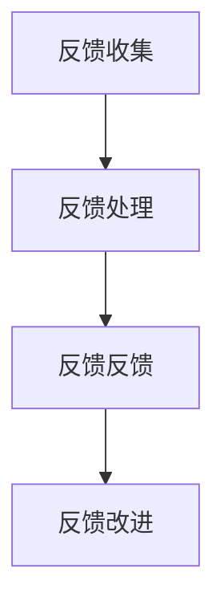
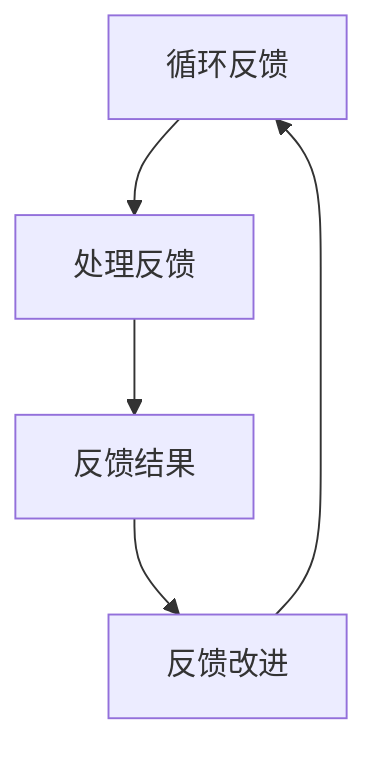
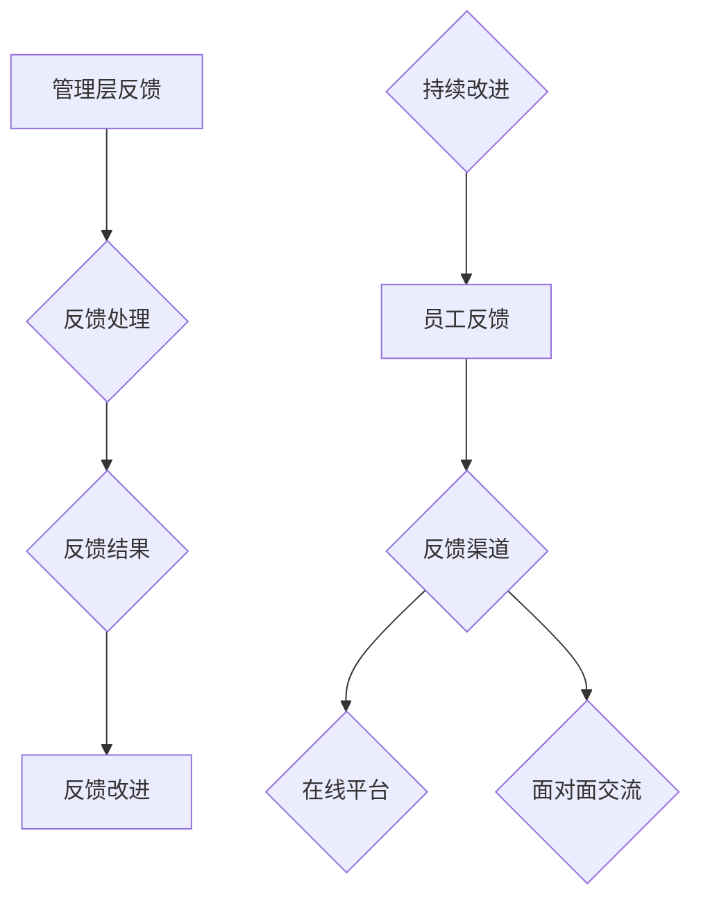

                 

**建立反馈文化：促进持续改进和学习**

关键词：反馈文化、持续改进、学习、组织文化

摘要：本文将探讨建立反馈文化的必要性和方法，详细阐述其在促进组织持续改进和学习中的重要作用。通过分析反馈文化的核心概念、构建和实施步骤，以及其在组织中的应用和效果评估，本文旨在为企业和组织提供一套完整的反馈文化构建指南，帮助他们在快速变化的市场环境中保持竞争优势。

----------------------------------------------------------------

## 第一部分：引言

### 1.1 问题背景

在当今快速发展的信息技术时代，企业面临着前所未有的竞争压力和市场变化。为了在激烈的市场竞争中脱颖而出，企业必须不断适应变化，持续改进和创新。然而，很多企业在这一过程中遇到了瓶颈。尽管他们投入了大量的资源和精力，但仍然难以实现预期的效果。这一现象背后的原因之一就是缺乏一个有效的反馈文化。

反馈文化是指组织内部对各种反馈（包括正面和负面的）持开放态度，并将其作为持续改进和学习的重要手段。在一个健康的反馈文化中，员工能够自由地表达自己的观点和意见，而管理层则能够倾听并采纳这些反馈，从而推动组织不断进步。

### 1.2 问题描述

企业在建立反馈文化过程中常常面临以下问题：

1. **反馈渠道不畅**：员工往往难以找到合适的渠道来表达自己的意见和建议。
2. **反馈机制不健全**：即使有反馈渠道，但反馈机制往往不够透明，无法确保反馈能够得到及时和有效的处理。
3. **反馈质量不高**：缺乏有效的反馈机制和工具，导致反馈内容往往不够具体和有针对性。
4. **反馈文化不成熟**：管理层对反馈的接受程度不高，甚至存在抵触情绪，从而阻碍了反馈文化的形成。

### 1.3 问题解决

要解决上述问题，企业需要从以下几个方面着手：

1. **建立透明的反馈渠道**：确保员工能够方便地提出反馈，并保证反馈能够得到及时和有效的处理。
2. **完善反馈机制**：建立一套完善的反馈机制，确保反馈的质量和有效性。
3. **提高反馈质量**：通过培训和指导，提高员工反馈的能力和意识。
4. **营造良好的反馈文化**：从管理层到普通员工，都需要树立正确的反馈观念，形成一个开放、包容的反馈文化。

### 1.4 边界与外延

反馈文化的建立是一个长期的过程，需要组织内部的共同努力。它不仅涉及到反馈渠道和机制的建设，还包括组织文化、管理风格、员工素养等多个方面。同时，反馈文化也不仅仅局限于企业内部，还可以扩展到与客户、合作伙伴等外部利益相关者的互动中。

### 1.5 概念结构与核心要素组成

反馈文化由以下几个核心要素组成：

1. **反馈渠道**：确保员工能够方便地提出反馈。
2. **反馈机制**：确保反馈能够得到及时和有效的处理。
3. **反馈质量**：提高反馈的内容和质量。
4. **反馈文化**：从组织文化和管理风格上支持反馈文化的形成。

在接下来的章节中，我们将详细探讨这些要素，并提供具体的实施方法和案例分析。

----------------------------------------------------------------

## 第二部分：核心概念与联系

### 2.1 反馈文化的定义

反馈文化是指组织内部对各种反馈（包括正面和负面的）持开放态度，并将其作为持续改进和学习的重要手段。在一个健康的反馈文化中，员工能够自由地表达自己的观点和意见，而管理层则能够倾听并采纳这些反馈，从而推动组织不断进步。

### 2.2 反馈文化的属性特征对比表

| 特征         | 解释                                                         |
| ------------ | ------------------------------------------------------------ |
| **开放性**   | 组织对反馈持开放态度，鼓励员工提出意见和建议。                 |
| **及时性**   | 反馈能够得到及时处理，确保问题得到及时解决。                   |
| **透明性**   | 反馈机制和结果对员工透明，增强员工的参与感和信任感。           |
| **针对性**   | 反馈内容具体、有针对性，有助于改进和优化。                     |
| **持续性**   | 反馈文化是持续性的，不仅仅关注短期效果，更注重长期发展。       |
| **包容性**   | 对不同意见和反馈持包容态度，鼓励多元化思维。                   |

### 2.3 反馈文化的ER实体关系图

以下是一个简单的ER实体关系图，展示了反馈文化中的主要实体及其关系：

```mermaid
erDiagram
  User ||--|{ Feedback }
  Manager ||--|{ Feedback }
  Project ||--|{ Feedback }
  Product ||--|{ Feedback }
```

在这个ER实体关系图中，User（员工）和Manager（经理）是反馈的主体，而Feedback（反馈）是反馈的内容。Project（项目）和Product（产品）则是反馈的对象。这种关系表明，员工和管理者可以针对项目或产品提出反馈，从而推动改进。

----------------------------------------------------------------

## 第三部分：反馈文化的原理

### 3.1 反馈循环模型

反馈循环模型是反馈文化的基础，它描述了反馈从提出到处理的整个流程。以下是一个简化的反馈循环模型：

1. **反馈收集**：员工或相关人员提出反馈。
2. **反馈处理**：管理层或相关人员对反馈进行分析和处理。
3. **反馈反馈**：将处理结果反馈给提出反馈的员工。
4. **反馈改进**：根据反馈结果进行改进，以优化流程或产品。

以下是一个用Mermaid绘制的反馈循环模型：



### 3.2 反馈机制的数学模型

为了更好地理解反馈机制，我们可以借助数学模型来进行分析。以下是一个简单的反馈机制的数学模型：

$$
改进率 = 反馈质量 \times 反馈响应速度
$$

其中，反馈质量和反馈响应速度是两个关键因素。反馈质量越高，改进效果越明显；反馈响应速度越快，问题解决得越及时。

### 3.3 反馈机制的mermaid流程图

以下是一个用Mermaid绘制的反馈机制流程图：



在这个流程图中，A表示提出反馈，B表示处理反馈，C表示反馈结果，D表示反馈改进。通过这个循环，组织能够不断优化自身的流程和产品。

### 3.4 反馈文化在组织中的核心作用

反馈文化在组织中的核心作用主要体现在以下几个方面：

1. **促进持续改进**：通过反馈，组织能够及时发现和解决问题，从而推动持续改进。
2. **提升员工参与度**：在一个开放和包容的反馈文化中，员工能够更加积极地参与组织的改进过程，提高工作满意度。
3. **优化决策过程**：通过收集和分析反馈，管理层能够更全面地了解组织的运行状况，从而做出更明智的决策。
4. **增强组织竞争力**：通过持续改进和创新，组织能够更好地适应市场变化，提高市场竞争力。

总之，反馈文化是组织持续发展的重要动力，它能够帮助组织在快速变化的市场环境中保持竞争优势。

----------------------------------------------------------------

## 第四部分：反馈文化的构建与实施

### 4.1 构建反馈文化的步骤

构建反馈文化是一个系统的过程，需要遵循以下步骤：

1. **制定反馈政策**：明确组织的反馈文化理念和目标，制定相应的政策和规定。
2. **建立反馈渠道**：确保员工能够方便地提出反馈，可以通过线上平台、面对面交流等方式。
3. **培训员工**：提高员工反馈的能力和意识，可以通过内部培训、研讨会等方式。
4. **完善反馈机制**：确保反馈能够得到及时和有效的处理，制定详细的反馈处理流程。
5. **营造良好氛围**：从管理层到普通员工，都要树立正确的反馈观念，形成一个开放、包容的反馈文化。
6. **持续改进**：根据反馈结果，不断优化反馈机制和文化，以适应组织发展的需要。

### 4.2 实施反馈文化的方法

实施反馈文化的方法包括以下几个方面：

1. **定期反馈会议**：定期组织反馈会议，让员工和管理层面对面交流，分享意见和建议。
2. **在线反馈平台**：建立在线反馈平台，方便员工随时提出反馈，并及时跟进处理结果。
3. **反馈培训**：定期开展反馈培训，提高员工反馈的能力和意识。
4. **奖励机制**：对提出有价值反馈的员工进行奖励，以激励更多员工参与反馈。
5. **反馈报告**：定期发布反馈报告，向全体员工展示反馈处理的结果和改进情况。

### 4.3 反馈文化的mermaid架构图

以下是一个用Mermaid绘制的反馈文化架构图：



在这个架构图中，A表示员工反馈，B表示反馈渠道，C表示在线平台，D表示面对面交流，E表示管理层反馈，F表示反馈处理，G表示反馈结果，H表示反馈改进，I表示持续改进。这个架构图清晰地展示了反馈文化的构建和实施过程。

### 4.4 反馈文化在组织中的实际应用

在组织实践中，反馈文化可以应用于以下几个方面：

1. **项目管理**：通过定期收集项目成员的反馈，及时发现和解决问题，优化项目管理流程。
2. **产品开发**：通过用户反馈，了解用户需求和使用情况，优化产品设计。
3. **员工培训**：通过反馈，了解员工的培训需求和效果，不断优化培训方案。
4. **组织变革**：通过反馈，了解组织的运行状况和员工需求，推动组织变革和优化。

总之，反馈文化是组织持续改进和学习的重要手段，它能够帮助组织在快速变化的市场环境中保持竞争优势。

----------------------------------------------------------------

## 第五部分：反馈文化在组织中的应用

### 5.1 反馈文化在企业管理中的应用

在企业管理中，反馈文化起着至关重要的作用。通过建立反馈机制，企业可以及时发现和解决管理中的问题，从而提高管理效率。以下是一些具体应用：

1. **员工绩效评估**：通过定期收集员工的绩效反馈，评估员工的工作表现，为晋升和薪酬调整提供依据。
2. **团队协作**：通过团队反馈，了解团队的工作状况和协作效果，优化团队结构和协作方式。
3. **决策支持**：通过管理层反馈，了解各部门的工作情况和需求，为决策提供有力支持。

### 5.2 反馈文化在员工培训与发展中的应用

在员工培训与发展中，反馈文化可以帮助员工提高技能和职业素养。以下是一些具体应用：

1. **培训需求分析**：通过收集员工的反馈，了解他们的培训需求和期望，制定个性化的培训计划。
2. **培训效果评估**：通过定期收集员工的反馈，评估培训效果，为培训改进提供依据。
3. **职业发展规划**：通过反馈，了解员工的职业发展需求和意愿，为他们提供合适的职业发展路径。

### 5.3 反馈文化在产品开发中的应用

在产品开发中，反馈文化可以帮助产品团队了解用户需求和使用情况，优化产品设计。以下是一些具体应用：

1. **用户反馈收集**：通过用户调研、问卷调查等方式，收集用户的反馈，了解用户的需求和使用体验。
2. **产品优化**：根据用户反馈，对产品进行优化和改进，提高产品的市场竞争力。
3. **迭代开发**：通过迭代开发和用户反馈，不断优化产品，实现产品的持续改进。

### 5.4 反馈文化在其他领域的应用

除了上述领域，反馈文化还可以应用于其他方面，如客户服务、市场营销等。通过建立反馈机制，企业可以更好地了解客户需求和市场变化，从而提高服务质量和市场竞争力。

总之，反馈文化在组织中的应用非常广泛，它能够帮助组织在各个领域实现持续改进和学习，从而提高组织的整体绩效和市场竞争力。

----------------------------------------------------------------

## 第六部分：反馈文化的效果评估与持续改进

### 6.1 反馈文化效果评估的指标

要评估反馈文化的效果，需要设定一系列指标，这些指标可以从不同维度反映反馈文化的实施效果。以下是一些关键指标：

1. **反馈数量**：评估反馈的总量，了解员工和管理层参与反馈的积极性。
2. **反馈处理速度**：评估反馈从提交到处理的时间，确保反馈能够得到及时处理。
3. **反馈质量**：评估反馈的内容和质量，确保反馈具有建设性和可操作性。
4. **改进效果**：评估基于反馈所进行的改进是否有效，以及改进的效果如何。
5. **员工满意度**：通过员工满意度调查，了解员工对反馈文化的满意度和参与度。
6. **组织绩效**：评估反馈文化对组织绩效的影响，如生产效率、产品质量、客户满意度等。

### 6.2 反馈文化效果评估的方法

效果评估的方法包括定量和定性两种：

1. **定量评估**：
   - **数据分析**：使用数据分析工具，对反馈数量、处理速度、质量等指标进行统计分析。
   - **关键绩效指标（KPI）**：设定具体的KPI，如每月反馈数量、平均处理时间等，定期进行跟踪和评估。

2. **定性评估**：
   - **员工访谈**：通过面对面访谈或问卷调查，了解员工对反馈文化的看法和体验。
   - **案例研究**：选择典型反馈案例，深入分析反馈的处理过程和效果。
   - **焦点小组**：组织焦点小组讨论，收集员工和管理层的反馈和建议。

### 6.3 反馈文化的持续改进策略

为了确保反馈文化的持续改进，组织可以采取以下策略：

1. **定期评估**：定期对反馈文化的效果进行评估，发现问题并及时调整。
2. **反馈改进**：根据评估结果，对反馈机制、流程和文化进行持续改进。
3. **员工参与**：鼓励员工积极参与反馈文化的建设和改进，提高他们的参与感和归属感。
4. **培训和指导**：定期组织培训和研讨会，提高员工对反馈文化的理解和实践能力。
5. **领导示范**：领导层要以身作则，积极参与反馈，树立良好的榜样。
6. **激励机制**：设立激励机制，奖励提出有价值反馈的员工，激发更多员工的积极性。

通过这些策略，组织可以不断优化反馈文化，实现持续改进和学习，从而提高组织的整体绩效和市场竞争力。

----------------------------------------------------------------

## 第七部分：案例分析

### 7.1 案例一：某公司的反馈文化实践

**背景**：
某公司是一家快速发展的科技公司，为了在激烈的市场竞争中保持领先地位，他们决定建立一套完整的反馈文化。

**问题描述**：
公司初期存在反馈渠道不畅、反馈质量不高等问题，导致反馈无法有效促进改进。

**问题解决**：
1. **建立反馈渠道**：公司建立了内部反馈平台，员工可以方便地提出反馈。
2. **完善反馈机制**：公司制定了详细的反馈处理流程，确保反馈能够得到及时和有效的处理。
3. **培训员工**：公司组织了多场反馈培训，提高员工的反馈能力。
4. **奖励机制**：对提出有价值反馈的员工进行奖励，提高员工参与度。

**结果**：
通过上述措施，公司的反馈数量大幅增加，反馈质量也得到显著提升，组织绩效明显改善。

### 7.2 案例二：某教育机构的反馈文化实践

**背景**：
某教育机构致力于提供高质量的教育服务，为了提高教学效果，他们决定引入反馈文化。

**问题描述**：
教育机构在初期缺乏有效的反馈机制，教师和学生的反馈无法得到及时处理。

**问题解决**：
1. **建立反馈渠道**：教育机构设立了在线反馈平台和面对面交流渠道，方便师生提出反馈。
2. **定期反馈会议**：教育机构定期组织反馈会议，让教师和学生面对面交流。
3. **反馈报告**：教育机构定期发布反馈报告，向全体师生展示反馈处理的结果和改进情况。
4. **培训教师和学生**：教育机构开展了多场反馈培训，提高师生对反馈文化的理解和实践能力。

**结果**：
通过引入反馈文化，教育机构的教学质量得到显著提高，师生满意度大幅提升。

### 7.3 案例分析与总结

通过上述两个案例可以看出，建立反馈文化对于组织的发展具有重要意义。有效的反馈文化能够促进持续改进和学习，提高组织的整体绩效。在实施反馈文化时，需要建立透明的反馈渠道、完善反馈机制、培训员工，并设立激励机制。同时，定期评估和持续改进也是确保反馈文化有效运行的关键。

总之，反馈文化是组织持续发展的强大动力，通过合理的设计和实施，组织可以更好地适应市场变化，保持竞争优势。

----------------------------------------------------------------

## 第八部分：最佳实践与拓展

### 8.1 最佳实践总结

在建立反馈文化的过程中，以下最佳实践值得借鉴：

1. **建立透明和开放的反馈渠道**：确保员工能够方便地提出反馈，并保证反馈能够得到及时和有效的处理。
2. **制定详细的反馈处理流程**：确保反馈的质量和有效性，让员工明确反馈的处理过程。
3. **培训员工和领导**：提高员工对反馈文化的理解和实践能力，同时领导要以身作则，积极参与反馈。
4. **设立激励机制**：鼓励员工积极参与反馈，提高反馈的质量和数量。
5. **定期评估和持续改进**：通过定期评估，发现问题并及时调整，确保反馈文化持续改进。

### 8.2 小结与注意事项

1. **确保反馈文化的系统性**：反馈文化不仅仅是一个环节，而是一个涉及组织各个层面的系统性工程。
2. **注重反馈的质量**：高质量的反馈能够有效促进改进，因此需要建立有效的反馈机制，提高反馈的质量。
3. **关注反馈的及时性**：及时反馈有助于问题的及时解决，避免问题积累。
4. **保持开放和包容的态度**：建立反馈文化需要从管理层到普通员工都持有开放和包容的态度。

### 8.3 拓展阅读

1. **《精益创业》**：作者埃里克·莱斯详细阐述了如何通过快速反馈和持续改进来创业，对建立反馈文化有很好的借鉴意义。
2. **《创新者的窘境》**：作者克莱顿·克里斯坦森分析了企业如何通过持续改进和创新来应对市场变化，对反馈文化的构建有启示作用。
3. **《敏捷开发》**：敏捷开发强调快速反馈和持续改进，对于希望建立反馈文化的组织有很好的参考价值。

通过学习和实践这些最佳实践，组织可以更好地建立和实施反馈文化，促进持续改进和学习，提高整体绩效和市场竞争力。

---

**作者：AI天才研究院/AI Genius Institute & 禅与计算机程序设计艺术 /Zen And The Art of Computer Programming**

本文旨在为企业和组织提供建立反馈文化的实用指南，帮助他们通过持续改进和学习在快速变化的市场环境中保持竞争优势。希望读者能够从中获得启发，并将其应用于实际工作中，推动组织的发展。

[本文完]

