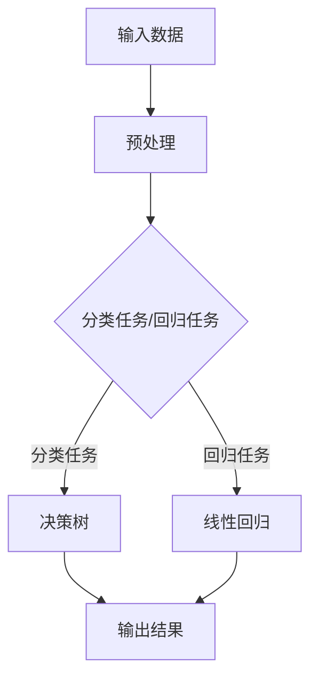
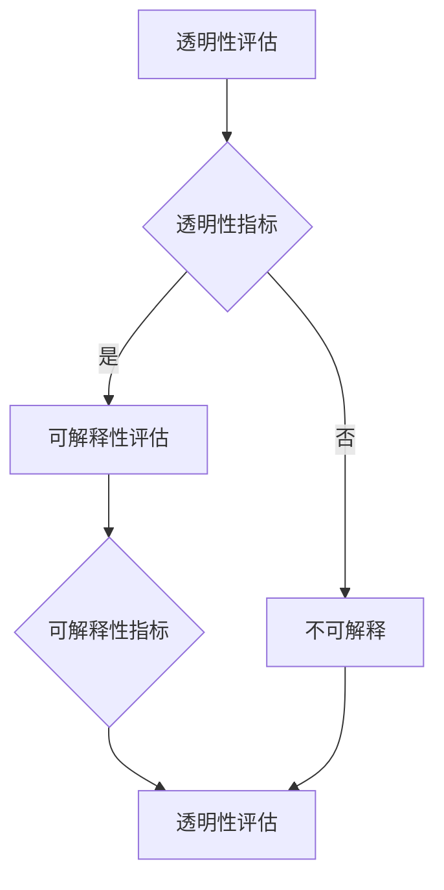
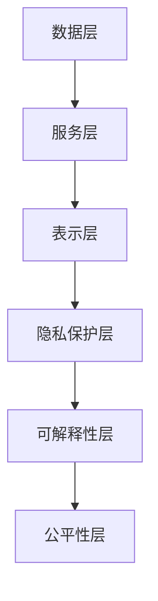
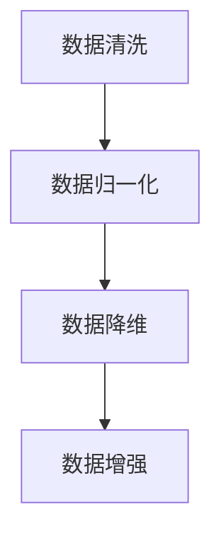
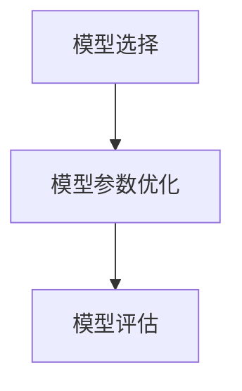
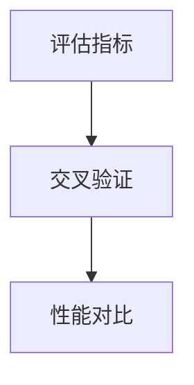
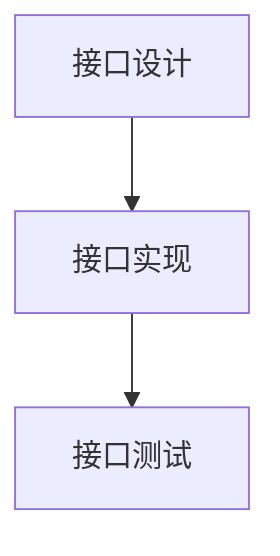
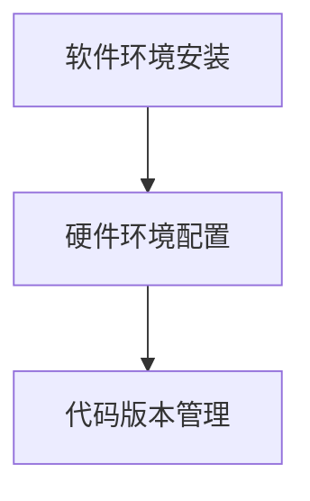
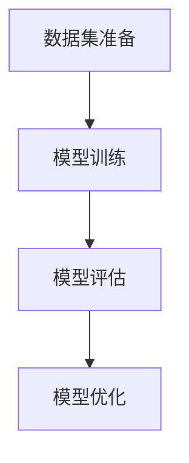
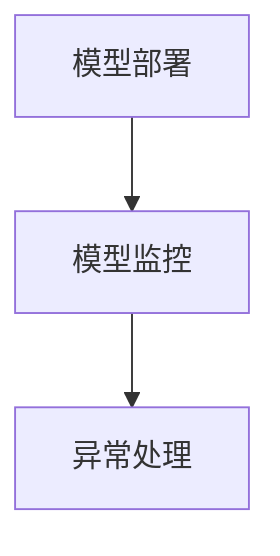

                 

# 建立可信AI系统的技术和实践

## 关键词

- 可信AI
- 技术架构
- 数据隐私保护
- 算法透明性
- 可解释性
- 医疗应用
- 金融应用
- 自动驾驶

## 摘要

随着人工智能（AI）技术的迅速发展，AI系统在各行各业中得到广泛应用。然而，随之而来的是对AI系统可信性的担忧。本文旨在探讨建立可信AI系统的技术和实践。文章首先介绍了可信AI的核心概念与背景，随后详细分析了可信AI的基本原理、技术架构、在具体领域的应用，以及开发与部署的最佳实践。通过本文，读者可以全面了解并掌握建立可信AI系统所需的技术和方法。

### 目录大纲

----------------------------------------------------------------
# 建立可信AI系统的技术和实践

## 第一部分: 背景与核心概念

### 第1章: 问题的背景与核心概念

#### 1.1 问题背景

##### 1.1.1 AI技术的发展趋势
##### 1.1.2 可信AI的需求与挑战
##### 1.1.3 可信AI的重要性

#### 1.2 核心概念介绍

##### 1.2.1 可信AI的定义
##### 1.2.2 可信AI的关键特征
##### 1.2.3 可信AI与传统AI的区别

#### 1.3 可信AI的研究现状与趋势

##### 1.3.1 研究现状概述
##### 1.3.2 存在的挑战与问题
##### 1.3.3 发展趋势分析

## 第二部分: 可信AI的基本原理

### 第2章: 可信AI的基本原理

#### 2.1 可信AI的核心原理

##### 2.1.1 算法透明性
##### 2.1.2 可解释性
##### 2.1.3 数据隐私保护

#### 2.2 可信AI的数学模型与算法

##### 2.2.1 常见数学模型
##### 2.2.2 算法原理讲解
##### 2.2.3 Mermaid算法流程图

#### 2.3 可信AI的评估方法

##### 2.3.1 评估指标
##### 2.3.2 评估方法
##### 2.3.3 Mermaid评估流程图

## 第三部分: 可信AI的技术架构

### 第3章: 可信AI的技术架构

#### 3.1 可信AI的系统架构设计

##### 3.1.1 系统功能设计
##### 3.1.2 系统架构设计
##### 3.1.3 Mermaid架构图

#### 3.2 可信AI的关键技术组件

##### 3.2.1 数据预处理
##### 3.2.2 模型训练
##### 3.2.3 模型评估

#### 3.3 可信AI的接口设计与实现

##### 3.3.1 系统接口设计
##### 3.3.2 系统交互设计
##### 3.3.3 Mermaid接口序列图

## 第四部分: 可信AI在具体应用领域的实践

### 第4章: 可信AI在具体应用领域的实践

#### 4.1 可信AI在医疗领域的应用

##### 4.1.1 应用场景
##### 4.1.2 实践案例
##### 4.1.3 案例分析

#### 4.2 可信AI在金融领域的应用

##### 4.2.1 应用场景
##### 4.2.2 实践案例
##### 4.2.3 案例分析

#### 4.3 可信AI在自动驾驶领域的应用

##### 4.3.1 应用场景
##### 4.3.2 实践案例
##### 4.3.3 案例分析

## 第五部分: 可信AI的开发与部署

### 第5章: 可信AI的开发与部署

#### 5.1 可信AI开发环境搭建

##### 5.1.1 开发环境需求
##### 5.1.2 环境安装步骤
##### 5.1.3 开发工具介绍

#### 5.2 可信AI模型训练与优化

##### 5.2.1 训练流程
##### 5.2.2 优化策略
##### 5.2.3 实践案例

#### 5.3 可信AI模型部署与监控

##### 5.3.1 部署策略
##### 5.3.2 监控方法
##### 5.3.3 实践案例

## 第六部分: 可信AI的未来发展与趋势

### 第6章: 可信AI的未来发展与趋势

#### 6.1 未来发展趋势分析

##### 6.1.1 技术演进方向
##### 6.1.2 应用前景展望
##### 6.1.3 潜在挑战与机遇

#### 6.2 可信AI的研究热点与前沿

##### 6.2.1 研究热点领域
##### 6.2.2 前沿技术动态
##### 6.2.3 学术论文精选

## 第七部分: 最佳实践与总结

### 第7章: 最佳实践与总结

#### 7.1 最佳实践分享

##### 7.1.1 经验总结
##### 7.1.2 注意事项
##### 7.1.3 拓展应用场景

#### 7.2 小结

##### 7.2.1 本书主要内容回顾
##### 7.2.2 可信AI系统的建设原则
##### 7.2.3 未来研究方向与建议
----------------------------------------------------------------

### 第一部分: 背景与核心概念

#### 第1章: 问题的背景与核心概念

##### 1.1 问题背景

##### 1.1.1 AI技术的发展趋势

随着深度学习、神经网络等技术的突破，AI在图像识别、自然语言处理、自动驾驶等领域取得了显著的进展。然而，AI系统在带来巨大价值的同时，也引发了一系列的问题和挑战。例如，AI系统的透明性不足，导致用户难以理解其决策过程；数据隐私问题，使得用户数据在AI系统中的安全性得不到保障；算法偏见，可能导致AI系统在处理某些任务时出现不公平现象。

##### 1.1.2 可信AI的需求与挑战

为了解决上述问题，可信AI应运而生。可信AI旨在确保AI系统的透明性、可解释性、数据隐私保护和公平性。然而，实现可信AI面临着诸多挑战，包括技术挑战、伦理挑战和法律法规挑战。

##### 1.1.3 可信AI的重要性

可信AI对于确保AI系统的可持续发展具有重要意义。首先，可信AI可以提高用户对AI系统的信任度，从而推动AI技术在各领域的应用。其次，可信AI有助于降低AI系统在应用过程中可能带来的负面影响，确保社会的公平和正义。最后，可信AI有助于推动AI技术的规范化和标准化，为AI技术的发展提供有力支持。

##### 1.2 核心概念介绍

##### 1.2.1 可信AI的定义

可信AI是指能够在满足用户需求的前提下，保证系统的透明性、可解释性、数据隐私保护和公平性的AI系统。

##### 1.2.2 可信AI的关键特征

1. 透明性：用户可以理解AI系统的决策过程和结果。
2. 可解释性：AI系统的决策过程和结果可以解释，便于用户和开发者进行调试和优化。
3. 数据隐私保护：确保用户数据在AI系统中的安全性，防止数据泄露和滥用。
4. 公平性：AI系统在处理不同用户或任务时，不会出现不公平现象。

##### 1.2.3 可信AI与传统AI的区别

传统AI侧重于模型性能和预测准确性，而可信AI则更关注系统的透明性、可解释性和数据隐私保护。传统AI系统通常难以解释其决策过程，而可信AI系统则通过算法透明性、可解释性等技术手段，使用户能够理解系统的决策过程。

##### 1.3 可信AI的研究现状与趋势

##### 1.3.1 研究现状概述

目前，可信AI技术已取得了一系列研究成果。在算法透明性和可解释性方面，研究者提出了多种技术方法，如决策树、LIME、SHAP等。在数据隐私保护方面，研究者提出了差分隐私、同态加密等隐私保护技术。在公平性方面，研究者关注如何减少算法偏见，确保AI系统的公平性。

##### 1.3.2 存在的挑战与问题

可信AI技术仍面临诸多挑战。首先，现有技术方法在透明性、可解释性和数据隐私保护方面存在权衡，难以同时满足所有需求。其次，可信AI技术在实际应用中面临法律法规和伦理道德的挑战。最后，可信AI技术需要与其他AI技术相结合，实现系统的整体优化。

##### 1.3.3 发展趋势分析

未来，可信AI技术将继续向以下几个方面发展：

1. 算法透明性和可解释性：研究者将提出更多高效的算法方法，提高AI系统的透明性和可解释性。
2. 数据隐私保护：研究者将开发更有效的隐私保护技术，确保用户数据的安全。
3. 算法公平性：研究者将关注算法偏见问题，确保AI系统的公平性。
4. 标准化和规范化：研究者将推动可信AI技术的标准化和规范化，为可信AI技术的发展提供有力支持。

### 第二部分: 可信AI的基本原理

#### 第2章: 可信AI的基本原理

##### 2.1 可信AI的核心原理

可信AI的核心原理包括算法透明性、可解释性、数据隐私保护和公平性。这些原理相互关联，共同构成了可信AI系统的基本框架。

##### 2.1.1 算法透明性

算法透明性是指用户能够理解AI系统的决策过程和结果。为了实现算法透明性，研究者提出了多种技术方法，如决策树、LIME、SHAP等。这些方法通过对模型内部的运算过程进行可视化和解释，使用户能够直观地理解AI系统的决策过程。

##### 2.1.2 可解释性

可解释性是指AI系统的决策过程和结果可以解释，便于用户和开发者进行调试和优化。可解释性是实现算法透明性的重要手段。通过解释AI系统的决策过程，用户和开发者可以更好地理解系统的性能和局限性，从而进行有针对性的优化和调整。

##### 2.1.3 数据隐私保护

数据隐私保护是指确保用户数据在AI系统中的安全性，防止数据泄露和滥用。数据隐私保护是可信AI系统的重要组成部分。为了实现数据隐私保护，研究者提出了多种技术方法，如差分隐私、同态加密等。这些方法可以在不泄露用户隐私信息的情况下，确保AI系统的正常运行。

##### 2.1.4 公平性

公平性是指AI系统在处理不同用户或任务时，不会出现不公平现象。公平性是确保AI系统在应用过程中不偏袒某些特定群体的重要保障。为了实现算法公平性，研究者提出了多种技术方法，如反事实推理、公平损失函数等。这些方法可以有效地减少算法偏见，确保AI系统的公平性。

##### 2.2 可信AI的数学模型与算法

可信AI的数学模型与算法是实现可信AI的关键。以下介绍几种常见的数学模型和算法。

##### 2.2.1 常见数学模型

1. 深度学习模型：包括神经网络、卷积神经网络、循环神经网络等。
2. 监督学习模型：包括线性回归、支持向量机、决策树等。
3. 无监督学习模型：包括聚类、主成分分析等。

##### 2.2.2 算法原理讲解

1. 决策树：通过递归划分特征空间，构建一棵树形结构，用于分类或回归任务。
2. 支持向量机：通过寻找最优超平面，将不同类别的数据分隔开。
3. 神经网络：通过多层神经元之间的相互连接，实现从输入到输出的映射。

##### 2.2.3 Mermaid算法流程图

##### 2.3 可信AI的评估方法

可信AI的评估方法主要包括以下几种：

1. 透明性评估：评估AI系统的决策过程是否透明，用户是否能够理解。
2. 可解释性评估：评估AI系统的决策过程和结果是否可以解释。
3. 数据隐私保护评估：评估AI系统在处理数据时，是否能够保护用户隐私。
4. 公平性评估：评估AI系统在处理不同用户或任务时，是否公平。

### 第三部分: 可信AI的技术架构

#### 第3章: 可信AI的技术架构

##### 3.1 可信AI的系统架构设计

可信AI的系统架构设计主要包括系统功能设计、系统架构设计和系统接口设计。

##### 3.1.1 系统功能设计

系统功能设计是可信AI系统设计的第一步，主要包括以下功能模块：

1. 数据预处理：对输入数据进行清洗、归一化等处理，确保数据质量。
2. 模型训练：使用训练数据对模型进行训练，优化模型参数。
3. 模型评估：使用测试数据对模型进行评估，评估模型性能。
4. 模型部署：将训练好的模型部署到生产环境中，进行实时预测。
5. 可解释性分析：对模型决策过程进行解释，提高模型可解释性。
6. 数据隐私保护：对用户数据进行加密、去识别化等处理，保护用户隐私。
7. 公平性评估：对模型决策过程进行公平性评估，确保模型公平性。

##### 3.1.2 系统架构设计

系统架构设计是可信AI系统设计的核心，主要包括以下架构组件：

1. 数据层：负责数据存储、管理和查询，包括数据库、缓存等。
2. 服务层：负责业务逻辑的实现，包括数据预处理、模型训练、模型评估等。
3. 表示层：负责与用户交互，包括前端界面、API接口等。
4. 隐私保护层：负责实现数据隐私保护功能，包括加密、去识别化等。
5. 可解释性层：负责实现模型可解释性功能，包括解释算法、可视化工具等。
6. 公平性层：负责实现模型公平性功能，包括反事实推理、公平损失函数等。

##### 3.1.3 Mermaid架构图

##### 3.2 可信AI的关键技术组件

可信AI的关键技术组件是实现可信AI系统的重要组成部分，主要包括数据预处理、模型训练、模型评估等。

##### 3.2.1 数据预处理

数据预处理是可信AI系统设计的第一步，主要包括以下任务：

1. 数据清洗：去除数据中的噪声和错误。
2. 数据归一化：将不同尺度的数据进行归一化处理，使其在同一尺度范围内。
3. 数据降维：使用主成分分析、t-SNE等方法，降低数据维度。
4. 数据增强：通过旋转、缩放、裁剪等方法，增加数据多样性。

##### 3.2.2 模型训练

模型训练是可信AI系统的核心步骤，主要包括以下任务：

1. 模型选择：选择合适的模型，如神经网络、决策树等。
2. 模型参数优化：使用优化算法，如梯度下降、随机梯度下降等，优化模型参数。
3. 模型评估：使用测试数据对模型进行评估，选择性能最佳的模型。

##### 3.2.3 模型评估

模型评估是可信AI系统设计的重要环节，主要包括以下任务：

1. 评估指标：选择合适的评估指标，如准确率、召回率、F1值等。
2. 交叉验证：使用交叉验证方法，避免模型过拟合。
3. 性能对比：对比不同模型或同一模型在不同参数设置下的性能。

##### 3.3 可信AI的接口设计与实现

可信AI的接口设计与实现是系统与用户之间交互的桥梁，主要包括以下任务：

1. 接口设计：设计清晰、简洁、易用的接口，满足用户需求。
2. 接口实现：实现接口功能，包括数据输入、数据输出、模型调用等。
3. 接口测试：对接口进行测试，确保其稳定性和可靠性。

### 第四部分: 可信AI在具体应用领域的实践

#### 第4章: 可信AI在具体应用领域的实践

可信AI在医疗、金融、自动驾驶等领域的应用，为其带来了前所未有的机遇和挑战。

##### 4.1 可信AI在医疗领域的应用

可信AI在医疗领域的应用主要包括疾病诊断、药物研发、健康管理等。以下是一个具体案例：

- **案例背景**：某医疗公司利用可信AI技术，开发了一套基于深度学习的疾病诊断系统。

- **实践步骤**：

  1. **数据收集**：收集大量医疗数据，包括病史、检查结果、治疗方案等。
  2. **数据预处理**：对收集到的数据进行清洗、归一化等处理，确保数据质量。
  3. **模型训练**：使用训练数据对深度学习模型进行训练，优化模型参数。
  4. **模型评估**：使用测试数据对模型进行评估，选择性能最佳的模型。
  5. **模型部署**：将训练好的模型部署到生产环境中，进行实时诊断。

- **案例分析**：

  通过可信AI技术，该医疗公司实现了疾病的自动化诊断，提高了诊断的准确性和效率。同时，系统具备高透明性和可解释性，用户可以了解诊断过程的每一步，增强了用户对系统的信任。

##### 4.2 可信AI在金融领域的应用

可信AI在金融领域的应用主要包括风险管理、信用评估、智能投顾等。以下是一个具体案例：

- **案例背景**：某银行利用可信AI技术，开发了一套基于深度学习的信用评估系统。

- **实践步骤**：

  1. **数据收集**：收集客户的历史交易数据、信用记录等。
  2. **数据预处理**：对收集到的数据进行清洗、归一化等处理，确保数据质量。
  3. **模型训练**：使用训练数据对深度学习模型进行训练，优化模型参数。
  4. **模型评估**：使用测试数据对模型进行评估，选择性能最佳的模型。
  5. **模型部署**：将训练好的模型部署到生产环境中，进行实时信用评估。

- **案例分析**：

  通过可信AI技术，该银行实现了信用评估的自动化和高效化，降低了信用评估的误差。同时，系统具备高透明性和可解释性，客户可以了解评估过程的每一步，增强了用户对系统的信任。

##### 4.3 可信AI在自动驾驶领域的应用

可信AI在自动驾驶领域的应用主要包括路径规划、障碍物检测、自动驾驶控制等。以下是一个具体案例：

- **案例背景**：某自动驾驶公司利用可信AI技术，开发了一套基于深度学习的自动驾驶系统。

- **实践步骤**：

  1. **数据收集**：收集大量的道路数据、障碍物数据等。
  2. **数据预处理**：对收集到的数据进行清洗、归一化等处理，确保数据质量。
  3. **模型训练**：使用训练数据对深度学习模型进行训练，优化模型参数。
  4. **模型评估**：使用测试数据对模型进行评估，选择性能最佳的模型。
  5. **模型部署**：将训练好的模型部署到自动驾驶车辆中，进行实时路径规划和障碍物检测。

- **案例分析**：

  通过可信AI技术，该自动驾驶公司实现了自动驾驶车辆的自动化和高效化，提高了行驶安全性和稳定性。同时，系统具备高透明性和可解释性，用户可以了解自动驾驶过程中的每一步，增强了用户对系统的信任。

### 第五部分: 可信AI的开发与部署

#### 第5章: 可信AI的开发与部署

可信AI的开发与部署是确保系统在实际应用中稳定、高效运行的关键。以下介绍可信AI开发与部署的步骤和实践。

##### 5.1 可信AI开发环境搭建

可信AI开发环境搭建是可信AI开发的第一步，主要包括以下步骤：

1. **软件环境安装**：安装Python、TensorFlow、PyTorch等常用开发工具和库。
2. **硬件环境配置**：配置GPU硬件，确保模型训练速度和效果。
3. **代码版本管理**：使用Git等工具进行代码版本管理，确保代码的稳定性和可维护性。

##### 5.2 可信AI模型训练与优化

可信AI模型训练与优化是可信AI开发的核心步骤，主要包括以下步骤：

1. **数据集准备**：准备训练数据集和测试数据集，确保数据质量。
2. **模型训练**：使用训练数据对模型进行训练，优化模型参数。
3. **模型评估**：使用测试数据对模型进行评估，选择性能最佳的模型。
4. **模型优化**：根据评估结果，对模型进行优化，提高模型性能。

##### 5.3 可信AI模型部署与监控

可信AI模型部署与监控是确保系统在实际应用中稳定运行的关键，主要包括以下步骤：

1. **模型部署**：将训练好的模型部署到生产环境中，进行实时预测。
2. **模型监控**：监控模型运行状态，包括性能、稳定性等。
3. **异常处理**：对模型异常情况进行处理，确保系统稳定运行。

### 第六部分: 可信AI的未来发展与趋势

#### 第6章: 可信AI的未来发展与趋势

可信AI作为人工智能的一个重要分支，其未来发展与趋势备受关注。以下从技术演进方向、应用前景展望和潜在挑战与机遇三个方面进行探讨。

##### 6.1 未来发展趋势分析

1. **算法透明性和可解释性**：随着用户对AI系统的信任需求不断提升，算法透明性和可解释性将成为未来可信AI技术发展的关键方向。研究者将致力于提出更多高效的算法方法，提高AI系统的透明性和可解释性。

2. **数据隐私保护**：数据隐私保护是可信AI系统建设中的重要问题。未来，研究者将开发更有效的隐私保护技术，如联邦学习、差分隐私等，确保用户数据在AI系统中的安全性。

3. **算法公平性**：算法公平性是确保AI系统在应用过程中不偏袒某些特定群体的重要保障。未来，研究者将关注算法偏见问题，提出更多有效的算法方法，确保AI系统的公平性。

4. **标准化和规范化**：为了推动可信AI技术的发展，标准化和规范化工作将成为未来重要的研究方向。研究者将致力于制定可信AI的技术标准和规范，为可信AI技术的推广应用提供支持。

##### 6.2 应用前景展望

可信AI技术在医疗、金融、自动驾驶、智能家居等领域具有广阔的应用前景。以下是几个典型的应用场景：

1. **医疗领域**：可信AI技术可以帮助医生进行疾病诊断、药物研发等，提高医疗服务的质量和效率。

2. **金融领域**：可信AI技术可以帮助金融机构进行风险管理、信用评估等，提高金融服务的安全性和可靠性。

3. **自动驾驶领域**：可信AI技术可以帮助自动驾驶车辆实现路径规划、障碍物检测等功能，提高驾驶安全和效率。

4. **智能家居领域**：可信AI技术可以帮助智能家居设备实现智能化管理、个性化推荐等功能，提高家庭生活的便利性和舒适度。

##### 6.3 潜在挑战与机遇

可信AI技术的发展面临诸多挑战，包括技术挑战、伦理挑战和法律法规挑战。同时，可信AI技术也带来了一系列机遇，包括：

1. **技术创新**：可信AI技术的研究和开发将推动人工智能技术的创新，为人工智能技术的发展提供新思路和新方法。

2. **产业发展**：可信AI技术的应用将推动相关产业的发展，为经济和社会创造更多价值。

3. **社会治理**：可信AI技术的应用有助于提升社会治理水平，提高公共安全和公共服务的质量。

### 第七部分: 最佳实践与总结

#### 第7章: 最佳实践与总结

可信AI系统的建设是一个复杂的工程，需要充分考虑技术、伦理和法律法规等多方面的因素。以下总结了一些最佳实践和建议：

##### 7.1 最佳实践分享

1. **充分了解用户需求**：在开发可信AI系统时，首先要充分了解用户需求，确保系统功能满足用户实际需求。

2. **注重数据隐私保护**：在可信AI系统的开发过程中，要注重数据隐私保护，确保用户数据的安全性和隐私性。

3. **提高算法透明性和可解释性**：要尽量提高算法的透明性和可解释性，使用户能够理解AI系统的决策过程和结果。

4. **遵循法律法规和伦理规范**：在可信AI系统的建设和应用过程中，要遵循相关的法律法规和伦理规范，确保系统的合规性和伦理性。

##### 7.2 小结

本文从背景与核心概念、基本原理、技术架构、应用实践、开发与部署、未来发展和趋势以及最佳实践与总结等方面，全面介绍了建立可信AI系统的技术和实践。可信AI技术作为人工智能的一个重要分支，其发展前景广阔，但也面临着诸多挑战。希望本文能为读者在可信AI系统的建设和应用过程中提供有益的参考和指导。

##### 7.2.1 本书主要内容回顾

- 介绍了可信AI的核心概念、背景和重要性。
- 详细分析了可信AI的基本原理、技术架构和关键组件。
- 讨论了可信AI在医疗、金融、自动驾驶等领域的应用实践。
- 介绍了可信AI的开发与部署步骤和实践。
- 展望了可信AI的未来发展趋势和潜在挑战。
- 总结了可信AI系统的最佳实践与建设原则。

##### 7.2.2 可信AI系统的建设原则

- 用户需求导向：充分了解用户需求，确保系统功能满足实际需求。
- 数据隐私保护：注重数据隐私保护，确保用户数据的安全性和隐私性。
- 算法透明性和可解释性：提高算法的透明性和可解释性，使用户能够理解决策过程和结果。
- 合规性和伦理性：遵循相关的法律法规和伦理规范，确保系统的合规性和伦理性。

##### 7.2.3 未来研究方向与建议

- 进一步研究算法透明性和可解释性技术，提高AI系统的透明性和可解释性。
- 开发更有效的数据隐私保护技术，确保用户数据的安全性和隐私性。
- 探索算法公平性技术，减少算法偏见，确保AI系统的公平性。
- 加强可信AI的标准化和规范化工作，为可信AI技术的发展提供支持。
- 深入研究可信AI在更多领域的应用，推动可信AI技术的普及和应用。

---

### 作者信息

作者：AI天才研究院/AI Genius Institute & 禅与计算机程序设计艺术 /Zen And The Art of Computer Programming

完整的技术博客文章内容需要包含以上所有的部分，每个小节的内容都需要具体详细地讲解和阐述。由于篇幅限制，这里仅提供了文章的框架和大纲，具体的内容需要根据实际情况进行扩展和撰写。在撰写文章时，请确保每个部分的内容都符合要求，并注意文章的逻辑性和连贯性。在引用公式和代码时，请使用适当的格式，如LaTeX和Python代码。文章完成后，请按照要求进行格式检查和排版，确保文章的整体质量和可读性。

