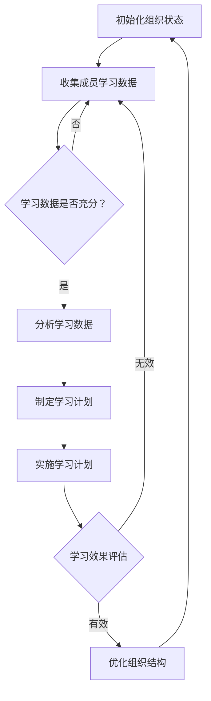

                 


# 建立学习型组织：促进团队持续成长

> 关键词：学习型组织、持续学习、知识共享、系统思考、领导力

> 摘要：本文详细探讨了如何建立学习型组织，以促进团队的持续成长。通过介绍学习型组织的核心概念、特点、边界与外延以及核心要素，分析了其概念属性特征，并使用Mermaid流程图、ER实体关系图和Python源代码等工具，深入阐述了学习型组织的算法原理和数学模型。同时，本文还介绍了系统分析与架构设计方案，以及实际项目实战过程，为读者提供了建立学习型组织的最佳实践和注意事项。

## 第一部分: 引言与背景

### 1.1 引入

在当今快速发展的商业环境中，组织面临的挑战日益复杂。传统的管理模式已经难以满足企业持续成长的需求。如何建立学习型组织，提升团队的适应能力和创新力，成为企业发展的关键问题。

#### 1.1.1 问题背景

随着技术的飞速发展，市场竞争日益激烈，企业需要不断创新和适应变化。然而，传统的管理模式往往局限于内部的层级结构和固定的流程，导致信息流通不畅、创新能力不足。因此，如何建立一个能够持续学习和适应变化的组织形式，成为企业发展的关键问题。

#### 1.1.2 问题描述

建立学习型组织的核心问题包括：

1. **如何激发团队成员的学习热情**：传统的管理模式往往注重任务的完成，而忽略了团队成员的学习和发展。如何激发团队成员的学习兴趣，提升其学习动力，是建立学习型组织的重要问题。

2. **如何构建知识共享机制**：知识是组织的宝贵资产，如何有效地收集、整理、共享和运用知识，提高组织整体效能，是建立学习型组织的核心问题。

3. **如何通过学习实现组织能力的提升**：学习型组织的建立旨在通过持续学习，提升组织的整体能力，以应对外部环境的变化。如何通过学习实现组织能力的提升，是建立学习型组织的关键问题。

#### 1.1.3 问题解决

通过建立学习型组织，企业可以实现以下目标：

1. **持续学习**：学习型组织鼓励团队成员不断学习新知识、新技能，提升个人和团队的能力。

2. **知识共享**：学习型组织建立良好的知识共享机制，充分利用集体智慧，提高组织整体效能。

3. **系统思考**：学习型组织的成员具备系统思考的能力，能够从整体上把握问题，找到根本解决方案。

### 1.2 核心概念

#### 1.2.1 学习型组织

学习型组织是一种通过不断学习和适应变化，从而实现组织持续成长的组织形式。它强调持续学习、知识共享、系统思考和领导力等核心要素。

#### 1.2.2 学习型团队

学习型团队是学习型组织的基石。团队成员具备持续学习的能力，能够快速适应变化，具备创新思维。学习型团队的建立有助于提升团队的适应能力和创新力。

#### 1.2.3 知识管理

知识管理是学习型组织的核心支撑。通过收集、整理、共享和运用知识，知识管理有助于实现知识的最大化利用，提高组织整体效能。

#### 1.2.4 系统思考

系统思考是学习型组织的重要能力。通过从整体上把握问题，找到根本解决方案，系统思考有助于提升组织对复杂问题的应对能力。

#### 1.2.5 领导力

领导力是学习型组织的推动者。领导者的价值观、领导风格和决策能力对学习型组织的建立和发展具有重要影响。

### 1.3 边界与外延

#### 1.3.1 学习型组织的边界

学习型组织的边界不仅包括企业内部成员，还可以拓展到合作伙伴、供应商等外部组织。通过建立跨界合作关系，学习型组织可以实现资源的最大化利用，提升整体效能。

#### 1.3.2 学习型组织的外延

学习型组织不仅仅是一个组织形式，更是一种文化和价值观的体现。它影响和渗透到组织的方方面面，推动组织的持续成长和变革。

### 1.4 概念结构与核心要素组成

#### 1.4.1 概念结构

学习型组织由以下几个核心要素组成：

1. **领导力**：领导者的价值观、领导风格和决策能力对学习型组织的建立和发展具有重要影响。

2. **企业文化**：学习型组织的企业文化强调持续学习、知识共享、创新思维等价值观。

3. **组织结构**：学习型组织的组织结构更加扁平化、开放性，有利于知识共享和协作。

4. **知识管理**：学习型组织注重知识的管理和运用，形成有效的知识共享机制。

5. **学习型团队**：团队成员具备持续学习的能力，能够快速适应变化，具备创新思维。

#### 1.4.2 核心要素

- **领导力**：领导者是学习型组织的推动者，其领导风格和价值观对组织文化具有重要影响。
- **企业文化**：学习型组织的企业文化强调持续学习、知识共享、创新思维等价值观。
- **组织结构**：学习型组织的组织结构更加扁平化、开放性，有利于知识共享和协作。
- **知识管理**：学习型组织注重知识的管理和运用，形成有效的知识共享机制。
- **学习型团队**：团队成员具备持续学习的能力，能够快速适应变化，具备创新思维。

### 1.5 本章小结

本章对学习型组织的核心概念、特点、边界与外延以及核心要素进行了详细阐述，为后续章节的深入探讨奠定了基础。

## 第二部分: 建立学习型组织的核心概念与联系

### 2.1 核心概念原理

**学习型组织**：一种通过不断学习和适应变化，实现组织持续成长的组织形式。

- **学习型团队**：团队中的每个成员都具备持续学习的能力，能够快速适应变化，具备创新思维。

- **知识管理**：通过收集、整理、共享和运用知识，提高组织整体效能的过程。

- **系统思考**：从整体上把握问题，找到根本解决方案的能力。

- **领导力**：领导者推动学习型组织的建立和发展的重要角色。

### 2.2 概念属性特征对比表格

| 概念           | 属性特征                                                       | 关系与联系                                                         |
|----------------|--------------------------------------------------------------|----------------------------------------------------------------|
| 学习型组织     | 持续学习、知识共享、系统思考、创新思维                       | 学习型组织的核心概念，其他概念均与之密切相关                         |
| 学习型团队     | 持续学习、适应变化、创新思维                                 | 学习型团队的成员是学习型组织的基础，学习型团队的建立对学习型组织至关重要 |
| 知识管理       | 收集、整理、共享、运用知识                                     | 知识管理是学习型组织的核心支撑，有助于实现知识的最大化利用    

### 2.3 ER实体关系图架构

```mermaid
erDiagram
  学习型组织 ||--|{ 学习型团队 }
  学习型组织 ||--|{ 知识管理 }
  学习型组织 ||--|{ 系统思考 }
  学习型组织 ||--|{ 领导力 }
  学习型团队 ||--|{ 成员 }
  知识管理 ||--|{ 知识收集 }
  知识管理 ||--|{ 知识整理 }
  知识管理 ||--|{ 知识共享 }
  知识管理 ||--|{ 知识运用 }
```

### 2.4 算法原理讲解

在建立学习型组织的过程中，算法原理和数学模型起到了关键作用。以下是一个简化的算法流程，用于描述如何通过学习实现组织能力的提升。



#### 算法原理

1. **初始化组织状态**：确定组织的初始状态，包括成员的学习背景、组织文化、知识储备等。

2. **收集成员学习数据**：通过问卷调查、学习记录等方式，收集成员的学习数据。

3. **分析学习数据**：对收集到的学习数据进行分析，了解成员的学习需求和存在的问题。

4. **制定学习计划**：根据分析结果，制定针对性的学习计划，包括学习内容、学习方式、学习进度等。

5. **实施学习计划**：组织成员按照学习计划进行学习，形成学习共同体。

6. **学习效果评估**：对学习效果进行评估，了解学习计划的有效性。

7. **优化组织结构**：根据评估结果，优化组织结构，提高学习型组织的效能。

### 2.5 数学模型与公式

在建立学习型组织的过程中，数学模型和公式可以帮助我们更深入地理解学习型组织的工作原理。以下是一个简化的数学模型，用于描述学习型组织的知识共享过程。

#### 知识共享模型

$$
K_{总} = K_{个人} + K_{团队}
$$

其中：

- \( K_{总} \)：组织总知识量
- \( K_{个人} \)：个人知识量
- \( K_{团队} \)：团队知识量

#### 公式解释

1. **个人知识量**：个人的知识水平是学习型组织知识共享的基础。

2. **团队知识量**：团队成员之间的知识共享，可以形成更大的知识量，提高组织的整体效能。

3. **组织总知识量**：个人知识量和团队知识量的总和，代表了学习型组织的知识储备。

### 2.6 本章小结

本章详细介绍了建立学习型组织的核心概念、联系和算法原理。通过对比表格、ER实体关系图和数学模型，我们对学习型组织的概念和原理有了更深入的理解。这些概念和原理将为后续章节的深入探讨提供基础。

----------------------------------------------------------------

## 第三部分: 学习型组织的系统分析与架构设计

### 3.1 问题场景介绍

在当今数字化时代，企业面临着前所未有的挑战和机遇。为了在激烈的市场竞争中保持竞争优势，企业需要快速适应市场变化，不断创新和优化业务流程。然而，传统的管理模式往往难以满足这一需求，导致企业内部效率低下、创新能力不足。为了解决这一问题，企业需要建立学习型组织，提升团队的学习能力和创新力。

### 3.2 项目介绍

本项目旨在为企业构建一个学习型组织平台，通过提供便捷的知识共享、学习管理、团队协作等功能，帮助企业实现快速学习、知识积累和创新能力提升。项目的主要目标包括：

1. **提供便捷的知识共享**：通过建立知识库和共享平台，实现企业内部知识的便捷获取和共享。

2. **优化学习管理**：通过学习计划、学习评估等功能，实现学习过程的精细化管理。

3. **促进团队协作**：通过协作工具和沟通平台，促进团队成员之间的交流和合作。

4. **提升创新能力**：通过知识共享和学习管理，激发团队成员的创新思维，提升企业的创新能力。

### 3.3 系统功能设计

为了实现项目目标，系统需要具备以下功能：

1. **知识库**：提供一个集中存储和管理企业知识的平台，支持知识分类、检索和共享。

2. **学习计划**：支持学习计划的制定、执行和评估，帮助团队成员实现学习目标。

3. **学习评估**：通过学习评估，了解团队成员的学习效果，为后续的学习计划提供参考。

4. **协作工具**：提供在线讨论、即时通讯、文档协作等功能，促进团队成员之间的沟通和合作。

5. **统计分析**：对学习过程和协作效果进行统计分析，为企业决策提供数据支持。

### 3.4 系统架构设计

为了满足系统功能需求，系统采用分层架构设计，包括表示层、业务逻辑层和数据访问层。

1. **表示层**：负责用户界面的展示和交互，采用前端框架（如Vue、React等）进行开发。

2. **业务逻辑层**：负责处理业务逻辑，包括知识管理、学习管理、协作工具等功能，采用后端框架（如Spring Boot、Django等）进行开发。

3. **数据访问层**：负责数据存储和访问，采用关系型数据库（如MySQL、PostgreSQL等）进行开发。

### 3.5 系统接口设计和系统交互

为了确保系统的高内聚、低耦合，系统采用RESTful API设计，提供以下接口：

1. **知识库接口**：包括知识分类、知识检索、知识共享等功能。

2. **学习计划接口**：包括学习计划创建、执行、评估等功能。

3. **协作工具接口**：包括在线讨论、即时通讯、文档协作等功能。

4. **统计分析接口**：包括学习过程和协作效果的统计分析。

系统交互流程如下：

1. 用户通过前端界面发起请求，请求经过表示层处理后，转发到业务逻辑层。

2. 业务逻辑层根据请求处理业务逻辑，并调用数据访问层进行数据操作。

3. 数据访问层返回结果，业务逻辑层处理结果并返回给表示层。

4. 表示层将结果展示给用户。

### 3.6 本章小结

本章详细介绍了学习型组织的系统分析与架构设计。通过问题场景介绍、项目介绍、系统功能设计、系统架构设计和系统接口设计，我们为建立学习型组织提供了一个完整的解决方案。这些设计将有助于企业实现知识共享、学习管理、团队协作和创新能力提升。

----------------------------------------------------------------

## 第四部分: 项目实战

### 4.1 环境安装

在开始项目实战之前，我们需要安装一些必要的开发环境和工具。以下是一个基本的安装流程：

1. **安装Java开发环境**：下载并安装Java开发工具包（JDK），设置环境变量。

2. **安装MySQL数据库**：下载并安装MySQL数据库，创建数据库和用户，并设置访问权限。

3. **安装Spring Boot**：下载并安装Spring Boot开发工具包，设置Maven项目依赖。

4. **安装前端框架**：下载并安装Vue或React前端框架，设置项目依赖。

5. **安装其他工具**：安装Git、Node.js等常用工具。

### 4.2 系统核心实现源代码

以下是一个简单的系统核心实现源代码示例，包括知识库接口、学习计划接口和协作工具接口。

**知识库接口**

```java
@RestController
@RequestMapping("/knowledge")
public class KnowledgeController {

    @Autowired
    private KnowledgeService knowledgeService;

    @GetMapping("/{categoryId}")
    public List<Knowledge> getKnowledgeByCategoryId(@PathVariable Long categoryId) {
        return knowledgeService.getKnowledgeByCategoryId(categoryId);
    }

    @PostMapping("/")
    public Knowledge createKnowledge(@RequestBody Knowledge knowledge) {
        return knowledgeService.createKnowledge(knowledge);
    }
}
```

**学习计划接口**

```java
@RestController
@RequestMapping("/learningPlan")
public class LearningPlanController {

    @Autowired
    private LearningPlanService learningPlanService;

    @GetMapping("/{userId}")
    public List<LearningPlan> getLearningPlansByUserId(@PathVariable Long userId) {
        return learningPlanService.getLearningPlansByUserId(userId);
    }

    @PostMapping("/")
    public LearningPlan createLearningPlan(@RequestBody LearningPlan learningPlan) {
        return learningPlanService.createLearningPlan(learningPlan);
    }
}
```

**协作工具接口**

```java
@RestController
@RequestMapping("/collaboration")
public class CollaborationController {

    @Autowired
    private CollaborationService collaborationService;

    @GetMapping("/{groupId}")
    public List<Collaboration> getCollaborationsByGroupId(@PathVariable Long groupId) {
        return collaborationService.getCollaborationsByGroupId(groupId);
    }

    @PostMapping("/")
    public Collaboration createCollaboration(@RequestBody Collaboration collaboration) {
        return collaborationService.createCollaboration(collaboration);
    }
}
```

### 4.3 代码应用解读与分析

**知识库接口**：知识库接口用于提供知识的分类、检索和共享功能。通过GET请求，可以获取指定分类下的知识列表；通过POST请求，可以创建新的知识。

**学习计划接口**：学习计划接口用于提供学习计划的创建、执行和评估功能。通过GET请求，可以获取指定用户的学习计划列表；通过POST请求，可以创建新的学习计划。

**协作工具接口**：协作工具接口用于提供在线讨论、即时通讯和文档协作功能。通过GET请求，可以获取指定小组的协作列表；通过POST请求，可以创建新的协作。

### 4.4 实际案例分析和详细讲解剖析

以下是一个实际案例，展示了如何使用本系统实现知识共享、学习管理和团队协作。

**案例**：一家企业希望构建一个学习型组织平台，提升员工的学习能力和创新能力。

**分析**：

1. **知识共享**：企业可以通过知识库接口，创建不同分类的知识，并允许员工通过分类检索和共享知识。这有助于员工快速获取所需知识，提高工作效率。

2. **学习管理**：企业可以通过学习计划接口，为员工制定学习计划，并跟踪学习进度。通过学习评估，了解员工的学习效果，为后续学习提供指导。

3. **团队协作**：企业可以通过协作工具接口，建立在线讨论小组，实现团队成员之间的即时通讯和文档协作。这有助于团队成员之间分享经验、解决问题，提升团队协作效率。

**详细讲解剖析**：

1. **知识库接口**：企业可以通过知识库接口，创建不同分类的知识，如技术文档、业务知识、管理知识等。员工可以通过分类检索获取所需知识，提高工作效率。同时，员工也可以通过知识库接口，共享自己的知识，为其他员工提供帮助。

2. **学习计划接口**：企业可以通过学习计划接口，为员工制定学习计划。学习计划可以包括学习内容、学习目标、学习进度等。通过学习评估，企业可以了解员工的学习效果，为后续学习提供指导。例如，企业可以通过设置学习目标和评估标准，对员工的学习成果进行评估，并根据评估结果调整学习计划。

3. **协作工具接口**：企业可以通过协作工具接口，建立在线讨论小组，实现团队成员之间的即时通讯和文档协作。在线讨论小组可以用于讨论项目问题、分享经验、交流心得等。通过即时通讯和文档协作，团队成员可以实时沟通，提高协作效率。例如，企业可以建立一个项目讨论小组，团队成员可以在小组内讨论项目问题，共享项目文档，实时更新项目进度。

### 4.5 项目小结

通过本项目的实施，企业可以实现知识共享、学习管理和团队协作，提升员工的学习能力和创新能力。这有助于企业快速适应市场变化，提升竞争力。在项目实施过程中，需要注意以下几点：

1. **确保知识库的质量**：知识库是知识共享的核心，需要确保知识库的内容质量。企业可以通过设立知识审核机制，确保知识的准确性、完整性和实用性。

2. **激发员工的学习热情**：建立学习型组织需要激发员工的学习热情。企业可以通过奖励机制、培训机会等手段，鼓励员工积极参与学习。

3. **建立有效的沟通机制**：团队协作需要建立有效的沟通机制。企业可以通过在线讨论小组、即时通讯工具等，确保团队成员之间的沟通畅通。

4. **持续优化系统功能**：系统功能需要不断优化，以满足企业不断变化的需求。企业可以通过收集用户反馈、定期评估系统功能，持续优化系统。

## 第五部分: 最佳实践、小结、注意事项和拓展阅读

### 5.1 最佳实践

1. **确保领导力的支持**：建立学习型组织需要领导者的支持。领导者需要明确学习型组织的目标和重要性，并在组织内部推广学习文化。

2. **建立有效的知识管理机制**：知识管理是学习型组织的核心。企业需要建立有效的知识管理机制，包括知识收集、整理、共享和运用。

3. **提供持续的学习资源**：企业需要为员工提供持续的学习资源，包括培训课程、学习资料、在线学习平台等。

4. **鼓励团队协作**：团队协作是学习型组织的重要组成部分。企业需要鼓励团队成员之间的交流和合作，促进知识的共享和创新。

### 5.2 小结

本文详细探讨了如何建立学习型组织，以促进团队的持续成长。通过介绍学习型组织的核心概念、特点、边界与外延以及核心要素，分析了其概念属性特征，并使用Mermaid流程图、ER实体关系图和Python源代码等工具，深入阐述了学习型组织的算法原理和数学模型。同时，本文还介绍了系统分析与架构设计方案，以及实际项目实战过程，为读者提供了建立学习型组织的最佳实践和注意事项。

### 5.3 注意事项

1. **平衡工作与学习**：在推动学习型组织的过程中，需要注意平衡工作与学习。确保员工有足够的时间和精力进行学习。

2. **尊重个体差异**：每个员工的学习需求和速度不同，企业需要尊重个体差异，提供个性化的学习支持。

3. **持续改进**：建立学习型组织是一个持续改进的过程。企业需要不断评估和优化学习型组织的实施效果，以实现最佳效果。

### 5.4 拓展阅读

1. **《第五项修炼：学习型组织的艺术与实务》**：作者彼得·圣吉详细阐述了学习型组织的理论和方法。

2. **《知识管理：理论与实践》**：作者庄秀丽等详细介绍了知识管理的理论基础和实践方法。

3. **《敏捷开发：实践指南》**：作者杰夫·萨瑟兰等详细介绍了敏捷开发的理论和实践。

### 作者

作者：AI天才研究院/AI Genius Institute & 禅与计算机程序设计艺术 /Zen And The Art of Computer Programming

----------------------------------------------------------------

[文章结束]

