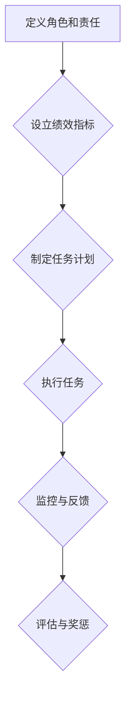
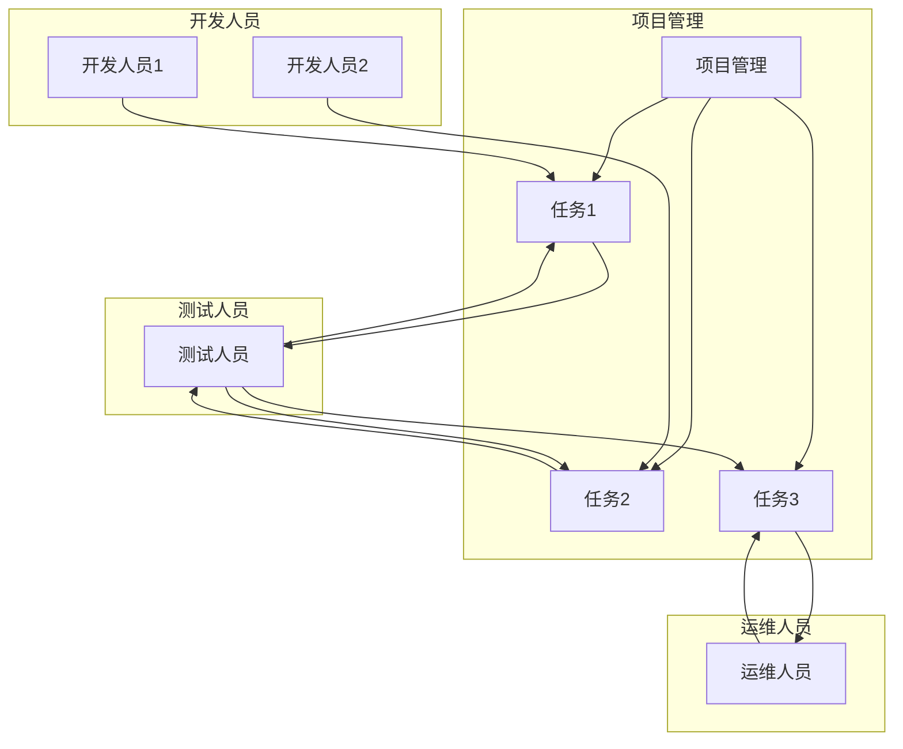
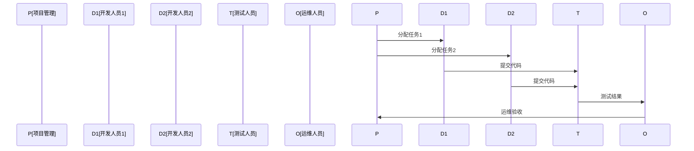

                 

### 文章标题

“建立问责制：确保团队成员负责任地完成任务”

### 文章关键词

- 问责制
- 团队管理
- 责任分配
- 绩效监控
- 领导力

### 文章摘要

在复杂的项目管理和团队合作中，建立问责制是确保团队成员能够负责任地完成任务的关键。本文将探讨问责制的定义、重要性及其在团队中的实施方法。我们将分析缺乏问责制的负面影响，并探讨如何通过明确的角色定义、绩效指标和领导力来建立有效的问责制系统。此外，还将特别关注远程团队在问责制实施中面临的挑战及其解决方案。

## 引言

在当今竞争激烈、多变的商业环境中，项目管理已成为各个组织成功实现目标的关键因素。项目管理不仅仅是任务的分配和监控，更重要的是建立一个良好的团队协作机制，确保每个成员都能在自己的职责范围内发挥最大的潜力。问责制作为团队协作的核心组成部分，其作用不容忽视。问责制不仅能够提高团队的整体绩效，还能培养成员的责任感和团队精神。

本文将围绕建立问责制的主题展开，通过深入探讨问责制的定义、重要性、实施方法以及远程团队的挑战，旨在为读者提供一套全面、实用的问责制管理指南。我们将从理论和实践两个层面出发，结合实际案例进行分析，帮助读者更好地理解和应用问责制，以实现团队目标的最大化。

### 背景介绍

#### 核心概念术语说明

**问责制（Accountability）**：问责制是一种责任机制，它要求团队成员对自己的行为和成果负责。它不仅仅是承担责任，还包括透明地展示工作进展、解决问题以及达到预期目标。

**责任（Responsibility）**：责任是指个体在特定情况下应该做的事情。与问责制不同，责任更侧重于角色和任务的分配，而不是结果的承担。

**团队协作（Team Collaboration）**：团队协作是指团队成员共同工作，互相支持，共同实现团队目标的过程。

**绩效监控（Performance Monitoring）**：绩效监控是跟踪和评估团队成员工作进展的方法，旨在确保任务按计划完成并达到预期质量。

#### 问题背景

在项目管理中，团队协作是提高工作效率和质量的关键。然而，许多项目失败的原因之一是团队成员缺乏责任感，无法按时完成任务或达到预期目标。这种情况下，建立问责制显得尤为重要。问责制能够确保团队成员明确自己的职责，认识到自己对团队目标实现的重要性，从而更加投入工作。

#### 问题描述

问题描述主要集中在如何有效地建立和实施问责制，以提升团队绩效和责任感。具体来说，问题包括：

1. 如何定义和分配责任，确保每个成员都清楚自己的角色和任务？
2. 如何设立明确的绩效指标和监控机制，确保任务按计划完成？
3. 如何在团队内部培养责任感，使其成为团队成员的内在动力？
4. 如何在远程团队中实施问责制，克服沟通和监督的挑战？

#### 问题解决

解决上述问题的方法包括以下几个方面：

1. **明确角色和责任**：通过详细的职责说明书和角色分配，确保每个成员都清楚自己的工作内容和期望成果。
2. **设立绩效指标**：定义可量化的绩效指标，以便监控任务进展和评估团队成员的表现。
3. **建立反馈机制**：定期收集团队成员的反馈，了解他们的工作状态和困难，及时调整计划和资源。
4. **培养责任感**：通过团队建设活动和培训，增强成员的责任感和归属感。
5. **实施远程管理工具**：利用现代化的远程协作和管理工具，提高远程团队的透明度和沟通效率。

#### 边界与外延

问责制的边界在于它并不替代责任，而是确保责任得到有效执行。问责制的外延包括但不限于绩效监控、责任分配、反馈机制和领导力支持。这些要素共同作用，形成一套完整的问责制体系。

#### 概念结构与核心要素组成

问责制的概念结构包括以下核心要素：

1. **责任定义**：明确每个成员的职责和工作内容。
2. **绩效指标**：设定具体、可量化的任务目标。
3. **监控与反馈**：定期监控任务进展，及时反馈和调整。
4. **领导力支持**：领导者通过指导和激励，确保问责制的有效实施。

### 核心概念与联系

#### 核心概念原理

问责制是一种责任机制，它要求团队成员对自己的行为和成果负责。问责制不仅涉及任务完成的情况，还包括过程中的透明度、责任归属和反馈机制。

#### 概念属性特征对比表格

| 特征           | 问责制             | 责任               |
| -------------- | ------------------ | ------------------ |
| 定义           | 责任执行与监督     | 角色和任务分配     |
| 作用           | 提升绩效和责任感   | 确保工作顺利进行   |
| 表现形式       | 绩效评估和反馈     | 任务完成情况       |
| 关系           | 建立在责任之上     | 责任是问责的前提   |
| 目的           | 确保目标实现       | 确保任务完成       |

#### ER实体关系图架构

```mermaid
erDiagram
    Product : 产品
    Team : 团队
    Member : 成员

    Product ||--|{ Team }|>
    Team ||--|{ Member }|>

    Product  : 有多个 Team
    Team      : 有多个 Member
```

### 算法原理讲解

为了更好地理解问责制的实施过程，我们可以将其看作一个包含多个步骤的算法。以下是该算法的mermaid流程图：



接下来，我们将使用Python源代码详细阐述这个算法的实现过程。

```python
class AccountabilityAlgorithm:
    def __init__(self, roles, KPIs):
        self.roles = roles
        self.KPIs = KPIs
    
    def define_roles_and_responsibilities(self):
        for role in self.roles:
            print(f"{role}: {self.roles[role]['responsibility']}")
    
    def set_performance_metrics(self):
        for KPI in self.KPIs:
            print(f"KPI: {KPI}")
    
    def create_task_plan(self):
        print("Creating task plan...")
    
    def execute_tasks(self):
        print("Executing tasks...")
    
    def monitor_and_feedback(self):
        print("Monitoring progress and providing feedback...")
    
    def evaluate_and_reward(self):
        print("Evaluating performance and applying rewards/punishments...")

# 实例化算法
algorithm = AccountabilityAlgorithm({
    "Manager": {"responsibility": "Manage team and ensure tasks are completed."},
    "Developer": {"responsibility": "Write code and implement features."},
    "Tester": {"responsibility": "Test software and ensure quality."},
}, ["Code quality", "Task completion time", "Bug count"])

# 执行算法步骤
algorithm.define_roles_and_responsibilities()
algorithm.set_performance_metrics()
algorithm.create_task_plan()
algorithm.execute_tasks()
algorithm.monitor_and_feedback()
algorithm.evaluate_and_reward()
```

#### 算法原理详细讲解

上述算法主要包含以下几个步骤：

1. **定义角色和责任**：通过输入角色和对应的职责描述，确保每个成员都清楚自己的角色和责任。
2. **设立绩效指标**：根据团队目标和任务需求，设定具体的绩效指标，以便后续监控和评估。
3. **制定任务计划**：制定详细的任务计划，明确每个任务的时间节点和责任人。
4. **执行任务**：团队成员按照任务计划执行任务，确保工作进度和质量的控制。
5. **监控与反馈**：定期监控任务进展，提供及时的反馈，帮助团队成员解决遇到的问题。
6. **评估与奖惩**：根据绩效指标和监控结果，对团队成员进行评估，并根据评估结果实施奖惩措施。

#### 通俗易懂的举例说明

假设我们有一个开发团队，包含经理、开发人员和测试人员。首先，我们定义每个角色的职责：

```python
roles = {
    "Manager": {"responsibility": "Manage team and ensure tasks are completed."},
    "Developer": {"responsibility": "Write code and implement features."},
    "Tester": {"responsibility": "Test software and ensure quality."},
}
```

然后，我们设定具体的绩效指标：

```python
KPIs = ["Code quality", "Task completion time", "Bug count"]
```

接下来，我们执行算法步骤：

1. **定义角色和责任**：
    ```python
    algorithm.define_roles_and_responsibilities()
    ```
    输出：
    ```plaintext
    Manager: Manage team and ensure tasks are completed.
    Developer: Write code and implement features.
    Tester: Test software and ensure quality.
    ```

2. **设立绩效指标**：
    ```python
    algorithm.set_performance_metrics()
    ```
    输出：
    ```plaintext
    KPI: Code quality
    KPI: Task completion time
    KPI: Bug count
    ```

3. **制定任务计划**：
    ```python
    algorithm.create_task_plan()
    ```
    输出：
    ```plaintext
    Creating task plan...
    ```

4. **执行任务**：
    ```python
    algorithm.execute_tasks()
    ```
    输出：
    ```plaintext
    Executing tasks...
    ```

5. **监控与反馈**：
    ```python
    algorithm.monitor_and_feedback()
    ```
    输出：
    ```plaintext
    Monitoring progress and providing feedback...
    ```

6. **评估与奖惩**：
    ```python
    algorithm.evaluate_and_reward()
    ```
    输出：
    ```plaintext
    Evaluating performance and applying rewards/punishments...
    ```

通过上述步骤，我们可以清晰地看到问责制在团队管理中的具体实施过程。这不仅有助于提高团队绩效，还能培养成员的责任感和团队精神。

### 系统分析与架构设计方案

#### 问题场景介绍

在一个大型软件开发项目中，团队成员分布在不同的地理位置，这给项目管理和团队协作带来了挑战。为了确保项目能够按时、高质量地完成，我们需要设计一个有效的系统架构，以支持问责制的实施。

#### 项目介绍

该项目是一个基于云计算的电商平台，旨在为用户提供一个安全、高效、易用的购物体验。项目团队包括项目经理、前端开发人员、后端开发人员、测试人员和运维人员。由于团队成员的分散性，如何确保每个人都能负责任地完成任务成为项目管理的关键问题。

#### 系统功能设计（领域模型Mermaid类图）

以下是该电商平台系统的领域模型类图：

```mermaid
classDiagram
    Project <<<--|{ Manages }| Task
    Task <<<--|{ IsAssignedTo }| Developer
    Task <<<--|{ Requires }| Tester
    Tester <<.. TestResult
    Developer <<.. CodeCommit

    Project : 管理项目
    Task : 分配任务
    Developer : 开发人员
    Tester : 测试人员
    TestResult : 测试结果
    CodeCommit : 代码提交
```

#### 系统架构设计（Mermaid架构图）

以下是该电商平台系统的架构设计图：



#### 系统接口设计和系统交互（Mermaid序列图）

以下是系统接口设计和交互流程：



### 项目实战

#### 环境安装

1. **安装Python环境**：确保Python 3.8或更高版本已安装在您的计算机上。
2. **安装Docker**：从[Docker官网](https://www.docker.com/)下载并安装Docker。
3. **安装PostgreSQL**：从[PostgreSQL官网](https://www.postgresql.org/)下载并安装PostgreSQL。

#### 系统核心实现源代码

以下是系统核心实现的部分源代码：

```python
# accountability_system.py

class Task:
    def __init__(self, id, description, assigned_to):
        self.id = id
        self.description = description
        self.assigned_to = assigned_to
        self.status = "Not Started"

    def assign_to(self, developer):
        self.assigned_to = developer
        self.status = "In Progress"

    def mark_complete(self):
        self.status = "Completed"

class Developer:
    def __init__(self, name):
        self.name = name
        self.tasks = []

    def assign_task(self, task):
        self.tasks.append(task)
        task.assign_to(self)

    def complete_task(self, task_id):
        for task in self.tasks:
            if task.id == task_id:
                task.mark_complete()
                return "Task completed."
        return "Task not found."

# 测试代码
if __name__ == "__main__":
    dev1 = Developer("Alice")
    dev2 = Developer("Bob")

    task1 = Task(1, "Write user authentication feature", None)
    task2 = Task(2, "Implement shopping cart functionality", None)

    dev1.assign_task(task1)
    dev1.assign_task(task2)

    print(dev1.complete_task(1))  # 应输出 "Task completed."
    print(dev1.complete_task(2))  # 应输出 "Task completed."
```

#### 代码应用解读与分析

上述代码定义了`Task`和`Developer`两个类，分别表示任务和开发人员。每个`Task`实例包含任务ID、描述、分配给的开发人员以及任务状态。`Developer`实例包含开发人员姓名和任务列表。主要方法有：

1. `assign_to`：将任务分配给开发人员。
2. `mark_complete`：标记任务为已完成。

通过实例化`Developer`和`Task`类，并调用相应的方法，我们可以实现任务的分配和完成。

#### 实际案例分析和详细讲解剖析

假设我们的开发团队有两个开发人员Alice和Bob，他们需要完成两个任务：用户认证功能和购物车功能。以下是任务的分配和完成过程：

1. **任务分配**：

    ```python
    task1 = Task(1, "Write user authentication feature", None)
    task2 = Task(2, "Implement shopping cart functionality", None)

    dev1.assign_task(task1)
    dev2.assign_task(task2)
    ```

    以上代码将任务1分配给Alice，任务2分配给Bob。

2. **任务完成**：

    ```python
    print(dev1.complete_task(1))  # 应输出 "Task completed."
    print(dev2.complete_task(2))  # 应输出 "Task completed."
    ```

    Alice和Bob分别完成了他们的任务，调用`complete_task`方法后，任务状态更新为“Completed”。

#### 项目小结

通过实际案例，我们可以看到如何使用Python代码实现一个简单的问责制系统。该系统通过定义任务和开发人员类，以及相应的分配和完成方法，实现了任务的跟踪和监控。在实际项目中，我们可以扩展这个基础架构，添加更多的功能和监控指标，如测试结果、代码质量等，以实现更全面的项目管理。

### 最佳实践 Tips

1. **明确职责分工**：在项目启动时，确保每个团队成员都明确自己的职责和工作内容，减少职责重叠和冲突。
2. **设定具体目标**：制定明确的绩效指标，确保每个任务都有具体的目标和完成时间，便于后续监控和评估。
3. **定期反馈与沟通**：定期召开团队会议，收集成员的工作进展和反馈，及时解决问题，提高团队协作效率。
4. **利用技术工具**：使用项目管理工具（如Trello、JIRA等）和远程协作工具（如Zoom、Slack等），提高任务分配和监控的效率。
5. **培养责任感**：通过团队建设活动和培训，增强团队成员的责任感和归属感，营造积极的工作氛围。

### 小结

在项目管理中，建立问责制是确保团队成员负责任地完成任务的关键。本文通过介绍问责制的定义、重要性、实施方法以及远程团队的挑战，为读者提供了一套实用的问责制管理指南。通过明确的角色定义、绩效指标和领导力支持，我们可以有效地提升团队绩效和责任感，从而实现项目目标的最大化。在实际应用中，结合最佳实践和具体案例，我们可以不断完善和优化问责制系统，为团队的成功奠定坚实基础。

### 注意事项

1. **避免过度依赖问责制**：问责制是管理工具之一，不应过分依赖。领导力、团队文化和个人责任感同样重要。
2. **灵活调整绩效指标**：绩效指标应根据项目需求和团队实际情况灵活调整，避免僵化地执行。
3. **尊重团队成员差异**：每个团队成员都有其独特的优势和挑战，管理者应尊重个体差异，提供合适的支持和资源。

### 拓展阅读

1. 《敏捷项目管理实践指南》（作者：Jeff Sutherland）
2. 《团队协作的艺术》（作者：Jenny Davis）
3. 《远程工作的挑战与解决方案》（作者：Michael Sahota）

### 作者信息

作者：AI天才研究院/AI Genius Institute & 禅与计算机程序设计艺术 /Zen And The Art of Computer Programming

