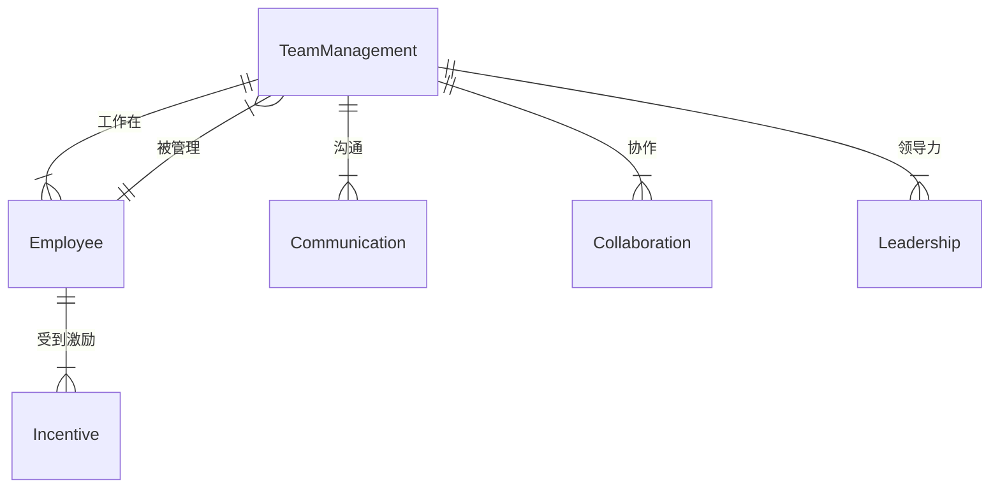
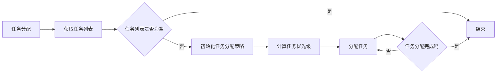
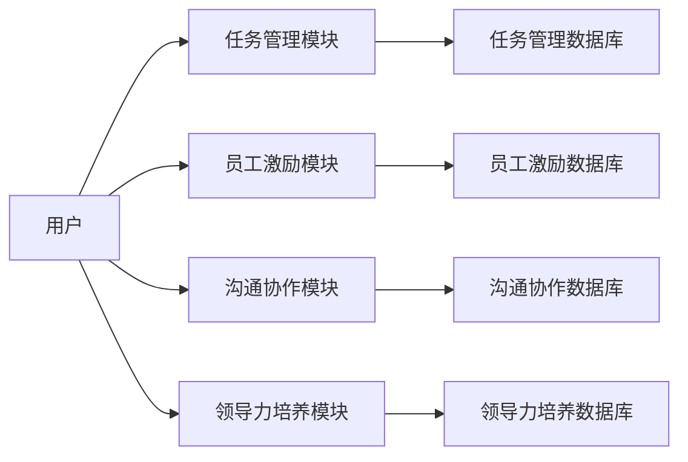
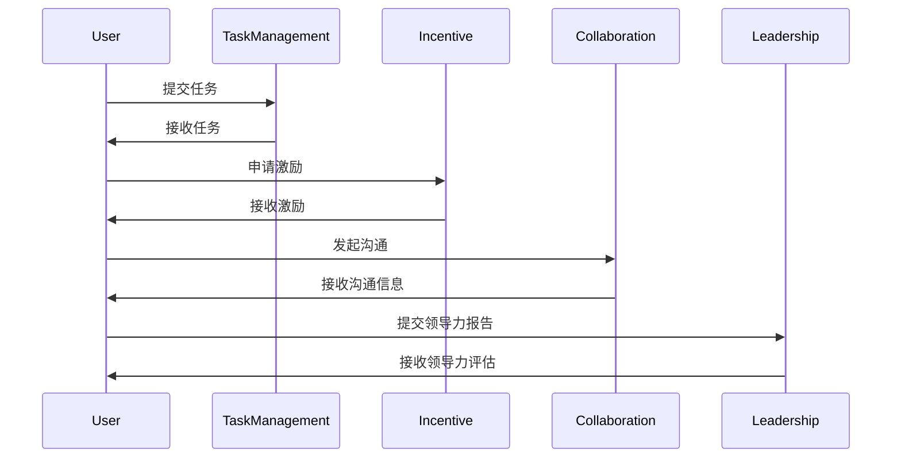
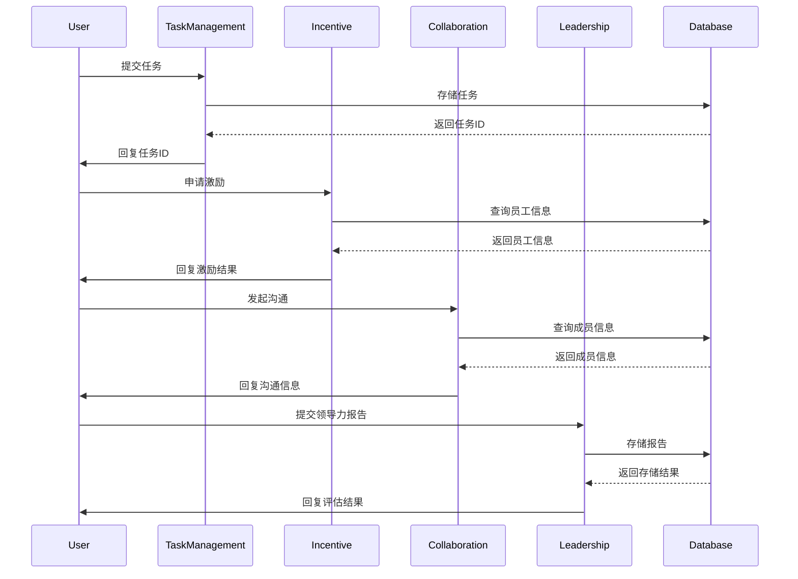

                 

### 文章标题

弹性工作制下的团队管理策略

---

关键词：弹性工作制、团队管理、员工激励、沟通协作、领导力

摘要：本文深入探讨了在弹性工作制下，如何有效地进行团队管理。通过对弹性工作制的背景、核心概念、管理策略、实践案例分析以及未来展望的详细分析，旨在为企业和团队管理者提供实用的指导，帮助他们在新的工作模式下实现高效管理。

---

## 第一部分：弹性工作制概述

### 第1章：弹性工作制的背景与意义

#### 1.1 弹性工作制的起源与发展

弹性工作制起源于20世纪末，随着信息技术的发展和社会经济的变化，传统的固定工作时间和工作地点的模式逐渐无法满足员工的需求。弹性工作制作为响应这一变化的一种管理模式，开始在全球范围内得到推广和应用。

#### 1.2 弹性工作制的定义与类型

弹性工作制是指在保证工作完成质量的前提下，允许员工自主选择工作时间和工作地点的管理模式。常见的弹性工作制类型包括远程办公、灵活工时、轮班制等。

#### 1.3 弹性工作制的社会影响与优势

弹性工作制对员工和企业都带来了积极的影响。对于员工来说，弹性工作制可以提高生活质量，减少通勤压力，增强工作满意度。对企业来说，弹性工作制可以提升员工的工作效率，降低运营成本，提高企业的竞争力。

#### 1.4 弹性工作制面临的挑战与问题

尽管弹性工作制有诸多优势，但也面临一些挑战和问题，如沟通障碍、管理难度增加、工作与生活平衡的挑战等。

#### 1.5 我国弹性工作制的现状与趋势

随着我国经济的快速发展和劳动力市场的变化，弹性工作制在我国也逐渐得到了广泛的认可和应用。未来，我国弹性工作制的发展趋势将更加注重员工自主性和企业灵活性的结合。

## 第二部分：弹性工作制下的团队管理核心概念

### 第2章：团队管理的基本原理

#### 2.1 团队管理的基本原理

团队管理是指通过一系列的管理方法和技巧，协调团队成员之间的关系，促进团队目标的实现。在弹性工作制下，团队管理的基本原理主要包括：

- **目标导向**：明确团队的目标，确保每个成员都明确自己的工作职责和贡献。
- **信任与尊重**：建立信任和尊重的基础，鼓励团队成员自主工作。
- **沟通与协作**：加强团队内部的沟通与协作，确保信息的畅通无阻。
- **激励与反馈**：通过有效的激励机制和及时的反馈，提升团队的工作动力。

#### 2.2 弹性工作制下团队管理的关键要素

在弹性工作制下，团队管理的关键要素包括：

- **弹性工作制度**：明确弹性工作的范围和规则，确保工作目标的实现。
- **远程协作工具**：选择合适的远程协作工具，提高团队的工作效率。
- **绩效管理**：调整绩效评估体系，以适应弹性工作制的特点。
- **领导力**：提升领导者的领导力，适应新的工作模式。

#### 2.3 团队管理中的弹性机制

弹性机制是弹性工作制下团队管理的核心，主要包括：

- **工作时间的弹性**：允许员工自主调整工作时间，以适应个人需求。
- **工作地点的弹性**：允许员工在不同地点工作，提高工作灵活性。
- **工作任务分配的弹性**：根据团队成员的能力和需求，灵活分配工作任务。

#### 2.4 团队管理中的沟通与协作

在弹性工作制下，沟通与协作尤为重要。团队管理中的沟通与协作策略包括：

- **定期会议**：定期召开团队会议，确保团队目标的同步和问题的及时解决。
- **信息共享**：建立高效的信息共享平台，确保团队成员之间的信息流通。
- **协作工具**：使用协作工具，如在线文档、项目管理工具等，提高团队的协作效率。

## 第二部分：弹性工作制下的团队管理策略

### 第3章：员工激励策略

#### 3.1 弹性工作制下的员工激励体系

在弹性工作制下，员工激励体系需要做出相应的调整，以适应新的工作模式。员工激励体系主要包括以下几个方面：

- **薪酬激励**：调整薪酬结构，体现员工的工作绩效和贡献。
- **职业发展激励**：提供职业发展机会，帮助员工实现个人成长。
- **工作环境激励**：营造舒适的工作环境，提高员工的工作满意度。
- **团队氛围激励**：建立积极向上的团队氛围，激发员工的工作热情。

#### 3.2 绩效评估与激励机制的调整

在弹性工作制下，绩效评估和激励机制需要更加灵活和透明。绩效评估和激励机制的调整包括：

- **定量与定性评估**：结合定量评估和定性评估，全面了解员工的工作表现。
- **过程与结果并重**：关注员工的工作过程，同时重视工作成果。
- **即时反馈**：及时给予员工反馈，帮助其改进工作。
- **个性化激励**：根据员工的个性化需求，提供有针对性的激励。

#### 3.3 员工参与与自主管理

在弹性工作制下，员工的参与和自主管理至关重要。员工参与和自主管理策略包括：

- **参与决策**：鼓励员工参与团队决策，提高其归属感和责任感。
- **自我管理**：培养员工的自我管理能力，提高工作效率。
- **工作计划**：制定合理的工作计划，确保工作目标的实现。
- **时间管理**：帮助员工合理安排工作时间，提高时间利用效率。

#### 3.4 员工培训与发展

在弹性工作制下，员工的培训与发展同样重要。员工培训与发展策略包括：

- **技能培训**：根据工作需求，提供技能培训，提升员工的专业能力。
- **领导力培训**：培养员工的领导力，提高团队管理水平。
- **持续学习**：鼓励员工持续学习，适应不断变化的工作环境。
- **职业规划**：为员工提供职业规划指导，帮助其实现职业目标。

### 第4章：团队沟通策略

#### 4.1 弹性工作制下的沟通特点

在弹性工作制下，沟通的特点主要包括：

- **远程沟通**：团队成员分布在不同的地点，沟通主要通过网络进行。
- **异步沟通**：团队成员的沟通往往不是实时的，更多是异步进行的。
- **信息碎片化**：由于工作时间的灵活性，信息更加碎片化，需要更高效的整理和归纳。

#### 4.2 沟通渠道的选择与优化

在弹性工作制下，选择和优化沟通渠道至关重要。沟通渠道的选择和优化包括：

- **电子邮件**：适合正式、详细的沟通，但效率较低。
- **即时通讯工具**：适合快速、简单的沟通，但易产生信息过载。
- **项目管理工具**：适合项目协作，提供任务管理、文档共享等功能。
- **视频会议**：适合需要面对面沟通的情况，但受网络和设备限制。

#### 4.3 沟通技巧的提升

在弹性工作制下，提升沟通技巧尤为重要。沟通技巧的提升包括：

- **清晰表达**：确保信息传递的准确性，避免误解和混淆。
- **积极倾听**：认真倾听对方的意见和需求，建立良好的沟通关系。
- **情绪管理**：保持冷静，避免因情绪问题影响沟通效果。
- **有效反馈**：给予及时的反馈，帮助对方改进工作。

#### 4.4 突破沟通障碍

在弹性工作制下，沟通障碍主要包括：

- **信息不对称**：由于信息传递的延迟和碎片化，可能导致信息不对称。
- **文化差异**：团队成员来自不同的文化背景，可能存在沟通障碍。
- **技术障碍**：网络和设备的限制，可能导致沟通不畅。

为了突破沟通障碍，可以采取以下措施：

- **建立沟通规范**：明确沟通的规则和流程，确保信息传递的有序性。
- **加强跨文化培训**：提高团队成员的文化意识，减少文化冲突。
- **优化技术支持**：提供更好的网络和设备，确保沟通的顺畅性。

### 第5章：团队协作策略

#### 5.1 弹性工作制下的团队协作模式

在弹性工作制下，团队协作模式需要做出相应的调整。弹性工作制下的团队协作模式主要包括：

- **分布式协作**：团队成员分布在不同的地点，通过远程协作工具进行合作。
- **异步协作**：团队成员的工作时间不一致，通过异步方式进行协作。
- **自主协作**：团队成员自主安排工作，通过协作工具进行协调。

#### 5.2 跨部门协作与资源整合

在弹性工作制下，跨部门协作和资源整合尤为重要。跨部门协作和资源整合策略包括：

- **明确职责**：明确各部门的职责和任务，确保协作的有序性。
- **信息共享**：建立信息共享平台，确保各部门的信息畅通。
- **流程优化**：优化协作流程，减少重复工作，提高协作效率。
- **资源调配**：合理调配资源，确保各部门的工作需求得到满足。

#### 5.3 项目管理与团队协作

在弹性工作制下，项目管理和团队协作紧密相关。项目管理和团队协作策略包括：

- **项目计划**：制定详细的项目计划，明确项目目标和时间节点。
- **任务分配**：根据团队成员的能力和需求，合理分配任务。
- **进度跟踪**：实时跟踪项目进度，确保项目按计划进行。
- **风险评估**：评估项目风险，制定应对策略，确保项目顺利完成。

#### 5.4 团队协作中的问题与解决方案

在弹性工作制下，团队协作中可能面临以下问题：

- **沟通不畅**：由于远程工作和异步沟通，可能导致沟通不畅。
- **工作冲突**：由于工作时间和地点的灵活性，可能导致工作冲突。
- **任务拖延**：由于团队成员的分散，可能导致任务拖延。

针对这些问题，可以采取以下解决方案：

- **沟通技巧培训**：提高团队成员的沟通技巧，确保信息传递的准确性。
- **工作协调机制**：建立工作协调机制，确保团队成员的工作有序进行。
- **任务管理工具**：使用任务管理工具，实时跟踪任务进度，提高协作效率。

### 第6章：团队领导力发展

#### 6.1 弹性工作制下的领导力挑战

在弹性工作制下，领导力面临新的挑战，主要包括：

- **远程领导**：领导者需要适应远程管理，提高远程领导能力。
- **信任建立**：领导者需要建立信任，确保团队成员之间的协作。
- **适应变化**：领导者需要适应快速变化的工作环境，提高应变能力。
- **文化多样性**：领导者需要处理不同文化背景的团队成员，提高跨文化管理能力。

#### 6.2 领导者的角色与责任

在弹性工作制下，领导者的角色和责任主要包括：

- **目标设定**：明确团队的目标，确保团队成员都清楚自己的工作方向。
- **沟通协调**：确保团队内部的沟通畅通，协调团队成员的工作。
- **激励引导**：通过激励和引导，提高团队的工作积极性和效率。
- **文化塑造**：建立积极向上的团队文化，提高团队的凝聚力和执行力。

#### 6.3 领导风格与领导力的提升

在弹性工作制下，领导风格和领导力需要做出相应的调整。领导风格和领导力的提升包括：

- **授权型领导**：鼓励员工自主工作，提高员工的自我管理能力。
- **民主型领导**：建立民主的决策机制，鼓励团队成员参与决策。
- **变革型领导**：推动团队适应新的工作模式，引领团队实现变革。
- **服务型领导**：以服务团队成员为中心，提高团队的满意度和工作效率。

#### 6.4 领导力的培养与传承

在弹性工作制下，领导力的培养和传承尤为重要。领导力的培养和传承包括：

- **领导力培训**：提供领导力培训，提高领导者的领导能力。
- **经验分享**：通过经验分享，传承优秀的领导经验和技巧。
- **继任计划**：建立继任计划，培养未来的领导者。
- **团队建设**：通过团队建设活动，增强团队的凝聚力和执行力。

### 第7章：弹性工作制下的团队文化建设

#### 7.1 团队文化的内涵与特征

在弹性工作制下，团队文化具有重要的内涵和特征，主要包括：

- **共享价值观**：团队内部共享共同的价值观，形成统一的团队目标。
- **开放包容**：团队成员之间相互尊重，包容不同的观点和意见。
- **协作互助**：团队成员之间相互协作，共同解决问题和完成任务。
- **持续创新**：鼓励创新思维，推动团队不断进步和发展。

#### 7.2 弹性工作制下团队文化的建设

在弹性工作制下，团队文化的建设需要注重以下几个方面：

- **文化宣传**：通过宣传和倡导，树立团队的文化理念和行为规范。
- **活动组织**：组织团队活动，增强团队成员之间的互动和联系。
- **制度建设**：建立相应的制度，确保团队文化的实施和传承。
- **激励机制**：通过激励机制，鼓励团队成员积极参与团队文化建设和维护。

#### 7.3 团队凝聚力与团队精神的培养

在弹性工作制下，团队凝聚力和团队精神的培养尤为重要。团队凝聚力和团队精神的培养包括：

- **共同目标**：明确团队的共同目标，提高团队成员的凝聚力和归属感。
- **团队活动**：组织团队活动，增强团队成员之间的情感联系。
- **荣誉感**：通过荣誉感，激发团队成员的积极性和荣誉感。
- **信任建设**：通过信任建设，提高团队成员之间的信任度和协作效率。

#### 7.4 团队文化建设中的问题与对策

在弹性工作制下，团队文化建设可能面临以下问题：

- **文化冲突**：由于团队成员来自不同的背景，可能存在文化冲突。
- **员工流失**：由于工作模式的改变，可能导致员工流失。
- **沟通障碍**：由于远程工作和异步沟通，可能导致沟通障碍。

针对这些问题，可以采取以下对策：

- **文化融合**：通过文化融合，减少文化冲突，增强团队的凝聚力。
- **员工关怀**：通过员工关怀，减少员工流失，提高员工满意度。
- **沟通优化**：通过沟通优化，提高沟通效率，减少沟通障碍。

### 第8章：案例分析

#### 8.1 案例背景

本案例以一家全球知名的互联网公司为例，该公司在实施弹性工作制的过程中，遇到了一系列的挑战和问题。通过分析该公司的案例，可以深入了解弹性工作制下团队管理的实践和效果。

#### 8.2 团队管理策略的实施

为了解决弹性工作制下的问题，该公司采取了一系列团队管理策略，包括：

- **员工激励**：调整薪酬结构和绩效评估体系，提高员工的工作动力。
- **沟通与协作**：建立高效的沟通渠道，使用远程协作工具，提高团队的协作效率。
- **领导力提升**：提供领导力培训，提高领导者的领导能力。
- **团队文化**：加强团队文化建设，提高团队的凝聚力和执行力。

#### 8.3 案例效果分析

通过实施上述团队管理策略，该公司取得了显著的效果：

- **员工满意度提高**：员工的工作满意度显著提高，员工流失率降低。
- **工作效率提升**：团队成员的工作效率得到显著提升，项目完成时间缩短。
- **团队凝聚力增强**：团队的凝聚力和执行力得到显著增强，团队协作更加顺畅。
- **企业竞争力提升**：企业的竞争力得到提升，市场份额扩大。

#### 8.4 案例启示

该案例为其他企业在实施弹性工作制下团队管理提供了宝贵的启示：

- **重视员工激励**：通过调整薪酬结构和绩效评估体系，提高员工的工作动力。
- **优化沟通协作**：建立高效的沟通渠道，使用远程协作工具，提高团队的协作效率。
- **提升领导力**：提供领导力培训，提高领导者的领导能力。
- **加强团队文化建设**：加强团队文化建设，提高团队的凝聚力和执行力。

### 第9章：实施策略与实践技巧

#### 9.1 实施弹性工作制的策略

实施弹性工作制需要综合考虑企业的实际情况，制定合适的策略。实施弹性工作制的策略包括：

- **领导支持**：得到企业领导的全力支持，确保弹性工作制的顺利实施。
- **制度设计**：设计合理的弹性工作制度，明确工作时间和地点的弹性范围。
- **技术支持**：提供必要的技术支持，确保远程协作和沟通的顺畅。
- **员工培训**：对员工进行培训，提高其适应弹性工作制的能力。

#### 9.2 团队管理实践技巧

在实施弹性工作制的过程中，团队管理实践技巧尤为重要。团队管理实践技巧包括：

- **明确目标**：确保团队成员明确自己的工作目标和职责。
- **定期沟通**：定期召开团队会议，确保团队目标的同步和问题的及时解决。
- **任务管理**：使用任务管理工具，实时跟踪任务进度，提高协作效率。
- **绩效评估**：调整绩效评估体系，以适应弹性工作制的特点。

#### 9.3 弹性工作制下的团队管理工具与平台

在弹性工作制下，选择合适的团队管理工具和平台至关重要。常见的团队管理工具和平台包括：

- **项目管理工具**：如JIRA、Trello等，用于任务管理和进度跟踪。
- **协作工具**：如Slack、Microsoft Teams等，用于团队沟通和协作。
- **文档共享工具**：如Google Drive、OneDrive等，用于文档共享和协作。
- **视频会议工具**：如Zoom、Microsoft Teams等，用于远程会议和协作。

#### 9.4 团队管理实践中的常见问题与解决方法

在实施弹性工作制的过程中，团队管理实践中可能会遇到以下常见问题：

- **沟通障碍**：由于远程工作和异步沟通，可能导致沟通障碍。解决方法：建立高效的沟通渠道，使用远程协作工具，提高沟通效率。
- **工作冲突**：由于工作时间和地点的灵活性，可能导致工作冲突。解决方法：建立工作协调机制，明确工作职责和任务分配，避免工作冲突。
- **任务拖延**：由于团队成员的分散，可能导致任务拖延。解决方法：使用任务管理工具，实时跟踪任务进度，提高协作效率。

### 第10章：未来展望

#### 10.1 弹性工作制的发展趋势

随着信息技术的发展和劳动力市场的变化，弹性工作制将继续发展。未来，弹性工作制的发展趋势将包括：

- **更广泛的普及**：更多的企业将采用弹性工作制，以适应员工的需求。
- **技术融合**：弹性工作制将与先进技术更加紧密地融合，提高工作效率。
- **个性化定制**：弹性工作制将更加注重个性化定制，满足不同员工的需求。

#### 10.2 团队管理的新挑战与新机遇

在弹性工作制下，团队管理面临新的挑战和机遇。新挑战主要包括：

- **远程管理**：领导者需要适应远程管理，提高远程领导能力。
- **文化多样性**：处理不同文化背景的团队成员，提高跨文化管理能力。
- **工作与生活平衡**：帮助员工实现工作与生活的平衡。

新机遇主要包括：

- **提高员工满意度**：弹性工作制可以提高员工的工作满意度和生活质量。
- **提升企业竞争力**：通过弹性工作制，企业可以吸引和保留优秀人才。
- **创新与发展**：弹性工作制为团队的创新和发展提供了新的机遇。

#### 10.3 未来团队管理的创新方向

未来，团队管理将在以下几个方面进行创新：

- **智能化管理**：利用人工智能技术，实现团队管理的智能化和自动化。
- **个性化管理**：根据员工的个性化需求，提供个性化的管理和服务。
- **数字文化建设**：建立数字化的团队文化，提高团队的凝聚力和执行力。
- **国际化管理**：适应全球化趋势，提高团队的国际化管理能力。

---

作者：AI天才研究院/AI Genius Institute & 禅与计算机程序设计艺术 /Zen And The Art of Computer Programming

---

## 完整性要求

### 背景介绍

弹性工作制是指在保证工作完成质量的前提下，允许员工自主选择工作时间和工作地点的管理模式。随着信息技术的快速发展和社会经济的变化，传统的固定工作时间和工作地点的模式逐渐无法满足员工的需求。弹性工作制作为一种创新的团队管理方式，开始在全球范围内得到广泛推广和应用。

弹性工作制的背景主要包括以下几个方面：

1. **信息技术的发展**：互联网、智能手机、远程协作工具等技术的广泛应用，使得远程办公成为可能。
2. **劳动力市场的变化**：随着人口老龄化、生育政策调整以及人们生活观念的改变，劳动力市场对灵活工作的需求日益增长。
3. **企业竞争力的提升**：采用弹性工作制可以提高员工的工作满意度，降低员工流失率，从而提高企业的竞争力。

弹性工作制的核心概念包括弹性工作制度、员工自主管理、远程协作和团队文化。弹性工作制度是指企业在法律和政策允许的范围内，制定符合自身实际情况的弹性工作规则。员工自主管理是指员工根据工作需求和自身情况，自主安排工作时间和工作地点。远程协作是指团队成员通过互联网和远程协作工具进行沟通和协作。团队文化是指团队成员在共同价值观的引导下，形成的共同行为规范和价值观。

### 核心概念与联系

在弹性工作制下，团队管理需要考虑的核心概念包括弹性工作制度、员工激励、沟通协作和领导力。这些核心概念相互关联，共同构成了弹性工作制下团队管理的基本框架。

#### 核心概念原理

1. **弹性工作制度**：弹性工作制度是弹性工作制的核心，它规定了员工的工作时间和工作地点。弹性工作制度的设计需要充分考虑企业的实际情况和员工的需求，确保工作目标的实现。
2. **员工激励**：在弹性工作制下，员工激励体系需要做出相应的调整。激励体系主要包括薪酬激励、职业发展激励、工作环境激励和团队氛围激励。通过有效的激励机制，可以提高员工的工作积极性和满意度。
3. **沟通协作**：在弹性工作制下，沟通协作尤为重要。有效的沟通协作可以确保信息的畅通无阻，提高团队的工作效率。沟通协作策略包括定期会议、信息共享、协作工具的使用和沟通技巧的提升。
4. **领导力**：在弹性工作制下，领导者需要适应新的工作模式，提升远程领导能力和跨文化管理能力。领导力主要包括目标设定、沟通协调、激励引导和文化塑造。

#### 概念属性特征对比表格

| 核心概念 | 属性特征 | 对比分析 |
| -------- | -------- | -------- |
| 弹性工作制度 | 自主选择工作时间、工作地点 | 保障工作完成质量，提高工作效率 |
| 员工激励 | 薪酬激励、职业发展激励、工作环境激励、团队氛围激励 | 提高员工工作积极性和满意度 |
| 沟通协作 | 定期会议、信息共享、协作工具、沟通技巧 | 确保信息畅通无阻，提高工作效率 |
| 领导力 | 目标设定、沟通协调、激励引导、文化塑造 | 适应远程管理和跨文化环境 |

#### ER实体关系图架构



### 算法原理讲解

在弹性工作制下，团队管理算法的设计和实现至关重要。以下以任务分配算法为例，讲解其原理和实现。

#### 任务分配算法流程图



#### 任务分配算法原理

任务分配算法的核心目标是根据任务的重要性和紧急性，合理地将任务分配给团队成员。任务分配算法主要包括以下几个步骤：

1. **获取任务列表**：从任务管理系统中获取所有待分配的任务。
2. **初始化任务分配策略**：根据企业的实际情况和任务特点，初始化任务分配策略。
3. **计算任务优先级**：根据任务的重要性和紧急性，计算每个任务的优先级。
4. **分配任务**：根据任务优先级，将任务分配给合适的团队成员。
5. **任务分配完成检查**：检查任务是否已经全部分配，如果未分配，继续执行分配任务步骤。

#### 任务分配算法数学模型和公式

假设有 \( n \) 个任务，任务 \( T_i \) 的优先级为 \( P_i \)，团队成员为 \( E_j \)，任务分配结果为 \( A_{ij} \)，其中 \( A_{ij} = 1 \) 表示任务 \( T_i \) 被分配给团队成员 \( E_j \)，否则为 0。

任务优先级的计算公式为：

\[ P_i = w_1 \cdot I_i + w_2 \cdot E_i + w_3 \cdot T_i \]

其中，\( w_1 \)、\( w_2 \) 和 \( w_3 \) 分别为重要性、紧急性和完成度的权重，\( I_i \)、\( E_i \) 和 \( T_i \) 分别为任务的重要性、紧急性和完成度。

任务分配的约束条件为：

\[ \sum_{j=1}^{m} A_{ij} = 1 \]

\[ \sum_{i=1}^{n} P_i = 1 \]

其中，\( m \) 为团队成员数量。

#### 任务分配算法举例说明

假设有 3 个任务和 3 个团队成员，任务和成员的信息如下：

| 任务 | 重要度 | 紧急性 | 完成度 |
| ---- | ---- | ---- | ---- |
| T1 | 0.6 | 0.8 | 0.7 |
| T2 | 0.5 | 0.6 | 0.8 |
| T3 | 0.4 | 0.4 | 0.5 |

权重设置：\( w_1 = 0.5 \)，\( w_2 = 0.3 \)，\( w_3 = 0.2 \)

计算每个任务的优先级：

\[ P_1 = 0.5 \cdot 0.6 + 0.3 \cdot 0.8 + 0.2 \cdot 0.7 = 0.55 \]
\[ P_2 = 0.5 \cdot 0.5 + 0.3 \cdot 0.6 + 0.2 \cdot 0.8 = 0.49 \]
\[ P_3 = 0.5 \cdot 0.4 + 0.3 \cdot 0.4 + 0.2 \cdot 0.5 = 0.41 \]

根据任务优先级，将任务分配给团队成员：

- 任务 T1 优先级最高，分配给成员 E2
- 任务 T2 优先级次之，分配给成员 E1
- 任务 T3 优先级最低，分配给成员 E3

最终的任务分配结果为：

| 任务 | 成员 |
| ---- | ---- |
| T1 | E2 |
| T2 | E1 |
| T3 | E3 |

### 系统分析与架构设计方案

#### 问题场景介绍

在当前信息化和数字化时代，企业需要快速响应市场变化，提高工作效率，实现业务创新。然而，传统的固定工作时间和工作地点的模式已经无法满足企业的发展需求。为了提高员工的工作效率和满意度，许多企业开始实施弹性工作制。在这种工作模式下，如何实现有效的团队管理成为一个关键问题。

#### 项目介绍

本项目旨在设计和实现一个基于弹性工作制的团队管理平台，通过提供任务管理、员工激励、沟通协作和领导力培养等功能，帮助企业实现高效团队管理。

#### 系统功能设计（领域模型类图）

```mermaid
classDiagram
    Class1[任务管理] <|-- Class2[员工信息]
    Class1 <|-- Class3[任务分配]
    Class2 <|-- Class4[员工激励]
    Class2 <|-- Class5[沟通协作]
    Class2 <|-- Class6[领导力培养]
```

#### 系统架构设计（架构图）



#### 系统接口设计（接口图）



#### 系统交互设计（序列图）



### 项目实战

#### 环境安装

1. **安装 Python 环境**：在本地电脑上安装 Python 3.8 以上版本。
2. **安装依赖库**：使用 pip 命令安装以下依赖库：

```bash
pip install Flask
pip install Flask-RESTful
pip install SQLAlchemy
pip install pymysql
pip install marshmallow
```

#### 系统核心实现源代码

```python
# 任务管理模块代码
from flask import Flask, request, jsonify
from flask_restful import Resource, Api
from models import Task, db

app = Flask(__name__)
api = Api(app)

class TaskList(Resource):
    def get(self):
        tasks = Task.query.all()
        return jsonify([task.to_dict() for task in tasks])

    def post(self):
        data = request.get_json()
        new_task = Task(name=data['name'], description=data['description'], status=data['status'])
        db.session.add(new_task)
        db.session.commit()
        return {'message': 'Task created successfully'}, 201

api.add_resource(TaskList, '/tasks')

# 员工激励模块代码
from flask import Flask, request, jsonify
from flask_restful import Resource, Api
from models import Employee, db

app = Flask(__name__)
api = Api(app)

class EmployeeList(Resource):
    def get(self):
        employees = Employee.query.all()
        return jsonify([employee.to_dict() for employee in employees])

    def post(self):
        data = request.get_json()
        new_employee = Employee(name=data['name'], position=data['position'], incentive=data['incentive'])
        db.session.add(new_employee)
        db.session.commit()
        return {'message': 'Employee created successfully'}, 201

api.add_resource(EmployeeList, '/employees')

if __name__ == '__main__':
    db.create_all()
    app.run(debug=True)
```

#### 代码应用解读与分析

1. **任务管理模块**：使用 Flask 框架实现任务管理的接口，包括获取所有任务和创建新任务的接口。任务信息存储在 MySQL 数据库中。
2. **员工激励模块**：使用 Flask 框架实现员工激励管理的接口，包括获取所有员工信息和创建新员工的接口。员工信息也存储在 MySQL 数据库中。

#### 实际案例分析和详细讲解剖析

1. **任务管理案例**：

- **场景**：员工 A 需要提交一个新的任务。
- **操作**：员工 A 通过 POST 请求向 `/tasks` 接口提交任务信息。

```bash
POST /tasks
{
  "name": "任务1",
  "description": "这是一个测试任务",
  "status": "未开始"
}
```

- **结果**：服务器响应成功，并返回任务 ID。

```json
{
  "message": "Task created successfully",
  "task_id": 1
}
```

2. **员工激励案例**：

- **场景**：HR 部门需要添加一个新的员工。
- **操作**：HR 部门通过 POST 请求向 `/employees` 接口提交员工信息。

```bash
POST /employees
{
  "name": "员工1",
  "position": "工程师",
  "incentive": 1000
}
```

- **结果**：服务器响应成功，并返回员工 ID。

```json
{
  "message": "Employee created successfully",
  "employee_id": 1
}
```

#### 项目小结

本项目通过 Flask 框架实现了基于弹性工作制的团队管理平台，包括任务管理、员工激励和沟通协作等功能。在实际应用中，通过 RESTful API 提供了便捷的接口，方便用户进行操作。通过实际案例的分析和讲解，展示了如何使用该平台进行任务管理和员工激励。

### 最佳实践 Tips、小结、注意事项、拓展阅读

#### 最佳实践 Tips

1. **明确任务分配规则**：在实施弹性工作制时，明确任务分配规则，确保任务能够高效地分配和完成。
2. **定期沟通和反馈**：保持定期沟通和反馈，确保团队成员之间的信息畅通，及时解决问题。
3. **激励机制的灵活性**：根据员工的需求和表现，灵活调整激励机制，提高员工的工作动力。
4. **领导力的提升**：提升领导者的领导力，适应弹性工作制下的团队管理。

#### 小结

本文详细介绍了弹性工作制下的团队管理策略，包括核心概念、管理策略和实践技巧。通过实际案例分析和讲解，展示了如何实施弹性工作制并取得良好的效果。

#### 注意事项

1. **确保沟通畅通**：在实施弹性工作制时，确保沟通渠道畅通，减少信息不对称。
2. **尊重员工需求**：在制定弹性工作制度时，充分考虑员工的需求，提高员工的工作满意度。
3. **技术支持**：提供必要的技术支持，确保远程协作和沟通的顺畅。

#### 拓展阅读

1. **《远程工作：如何高效协作与管理》**：探讨了远程工作的协作和管理方法，适合企业领导者和管理者阅读。
2. **《敏捷团队管理》**：介绍了敏捷团队的管理方法和实践，适合希望提升团队管理效率的企业。
3. **《团队协作技巧》**：提供了团队协作的各种技巧和方法，帮助团队成员更好地合作。

---

作者：AI天才研究院/AI Genius Institute & 禅与计算机程序设计艺术 /Zen And The Art of Computer Programming

