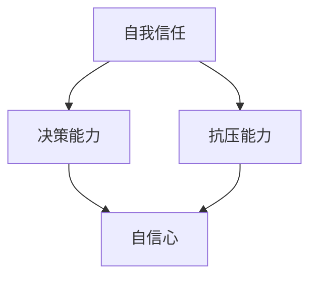
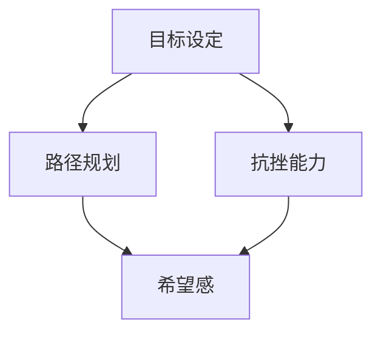
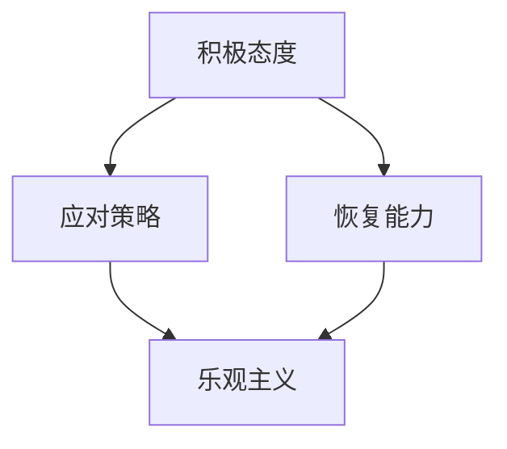
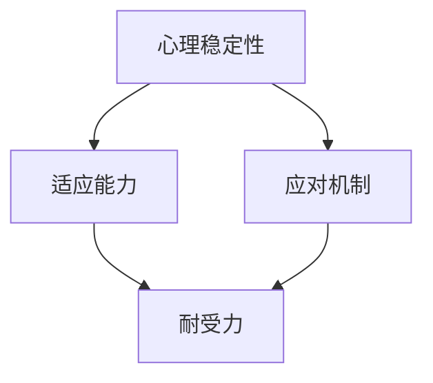

                 

### 引言

在当今快节奏、竞争激烈的社会中，团队韧性和积极性成为了组织成功的关键因素。心理资本，这一新兴的研究领域，为我们提供了一种理解、测量和提升团队韧性和积极性的新视角。《心理资本：提升团队韧性和积极性的方法》这本书旨在探讨心理资本的概念、构成、重要性及其在实践中的应用，为团队管理和组织发展提供科学依据和实用策略。

#### 1.1 主题介绍

心理资本是一个多维度的概念，包括自信心、希望感、乐观主义和耐受力。这些心理特质不仅对个人的表现和幸福感有深远影响，还能够在团队层面上提升整体韧性和积极性。本书将深入探讨这些心理资本的构成和特征，以及它们在团队和组织中的重要作用。

#### 1.2 目标阐述

本书的主要目标是：

1. **介绍心理资本的概念和构成**：帮助读者理解心理资本的定义、核心特性和基本构成。
2. **探讨心理资本的重要性**：分析心理资本对个人、团队和组织绩效的影响。
3. **提供心理资本的测量方法**：介绍现有测量工具和方法，帮助读者评估心理资本水平。
4. **提出提升心理资本的方法**：结合理论和实践，提出提升心理资本的策略和干预措施。
5. **探讨心理资本在实践中的应用**：分析心理资本在不同领域的应用案例，为读者提供实践参考。

#### 1.3 心理资本的引入

心理资本作为一个相对较新的概念，起源于心理学和行为科学的交叉领域。最初，研究人员关注的是个体如何应对压力和挑战，从而表现出较高的韧性和积极性。随着研究的深入，心理资本被定义为一种心理状态，包括自信心、希望感、乐观主义和耐受力等特质，这些特质有助于个体在逆境中保持积极态度和行为。

心理资本的重要性在于，它不仅能够预测个体的长期表现和幸福感，还能够促进团队协作、创新和绩效。在组织层面，心理资本被视为一种关键资源，能够提高团队的韧性和积极性，从而增强组织的竞争力和创新能力。

#### 1.4 提升团队韧性和积极性的重要性

团队韧性和积极性是组织成功的关键因素。在全球化、技术快速变革和市场竞争日益激烈的背景下，团队需要具备强大的适应能力和积极的工作态度，以应对不断变化的挑战和机遇。提升团队韧性和积极性不仅有助于提高团队绩效，还能够增强员工的工作满意度和忠诚度，从而为组织带来长期的竞争优势。

提升团队韧性和积极性的方法多种多样，包括提供培训和发展机会、营造积极的工作环境、建立有效的沟通机制等。然而，心理资本作为一种内在的心理资源，为团队提供了更强大的支持。通过提升心理资本，团队能够更好地应对压力、克服挑战，并在逆境中保持积极态度和高效工作。

总之，心理资本的研究和应用为团队管理和组织发展提供了新的视角和方法。通过深入探讨心理资本的构成、测量和提升方法，本书旨在帮助读者更好地理解和应用心理资本，从而提升团队韧性和积极性，实现组织的长期成功。

### 心理资本概述

心理资本是一个多维度的概念，它涵盖了个体在心理层面上的多种积极特质。这些特质不仅对个人的生活质量和职业发展产生深远影响，还在团队和组织层面发挥着至关重要的作用。在深入了解心理资本的构成和重要性之前，我们需要首先对其进行明确定义，并探讨其与心理能量之间的关系。

#### 2.1 定义

心理资本可以被视为一种心理状态或心理资源，它包括自信心、希望感、乐观主义和耐受力等特质。这些特质共同作用于个体，使其在面对挑战和逆境时能够保持积极的心态和行为。

- **自信心**：指的是个体对自己的能力和价值的信任，以及在不确定环境中仍然保持自信和决心的能力。
- **希望感**：是指个体对未来有积极预期的心理状态，包括设定目标、为实现目标制定计划以及克服障碍的能力。
- **乐观主义**：是指个体对未来持有积极态度和乐观预期的倾向，即使在面对困难和失败时也能保持乐观。
- **耐受力**：是指个体在面对压力和挑战时能够保持心理稳定和适应能力，从而更好地应对逆境。

#### 2.2 构成

心理资本的构成要素不仅决定了个体的心理状态和行为，还影响着团队和组织的整体表现。以下是心理资本的主要构成部分及其特点：

1. **自信心**：
   - **特点**：自信心的核心在于个体对自己的信任，以及对自身能力的认可。一个具有高度自信心的人通常能够在面对挑战时保持冷静和自信，不易受到外界负面因素的影响。
   - **测量**：自信心的测量可以通过自我评估问卷、行为观察和绩效评价等多种方法进行。

2. **希望感**：
   - **特点**：希望感是一种未来导向的心理状态，表现为对目标的明确、对未来的期待以及对实现目标的路径和策略的规划。
   - **测量**：希望感的测量可以通过目标设定问卷、未来预期问卷和计划性评估等多种工具进行。

3. **乐观主义**：
   - **特点**：乐观主义是指个体对未来持有积极的态度和信念，即使在面对困难时也能保持乐观。乐观主义者通常更容易从挫折中恢复过来，并找到积极的解决方案。
   - **测量**：乐观主义的测量可以通过积极情感量表、乐观主义问卷和情境反应问卷等多种方法进行。

4. **耐受力**：
   - **特点**：耐受力是指个体在面对压力和挑战时保持心理稳定和适应能力的能力。一个具有高耐受力的人能够更好地应对压力，并在逆境中保持积极和高效的工作状态。
   - **测量**：耐受力通常通过压力反应量表、心理弹性问卷和逆境应对问卷等多种工具进行测量。

#### 2.3 与心理能量的关系

心理资本和心理能量之间存在紧密的联系。心理能量是指个体在心理活动中的心理资源，包括注意力、动机、情感和认知能力等。心理资本可以被视为心理能量的一个子集，它通过增强个体的自信心、希望感、乐观主义和耐受力，从而提高心理能量的整体水平。

- **增强心理能量**：心理资本通过提升个体在面对挑战和逆境时的心理资源，从而增强心理能量。例如，自信心使个体在面对压力时能够保持冷静，乐观主义帮助个体在挫折中找到积极的解决方案，希望感使个体对未来保持积极预期，耐受力则帮助个体在逆境中保持心理稳定。

- **维持心理能量**：心理资本不仅能够增强心理能量，还能够维持心理能量的稳定。在面对连续的压力和挑战时，心理资本能够帮助个体保持心理稳定，避免心理能量的过度消耗。

综上所述，心理资本是一个多维度的概念，它包括自信心、希望感、乐观主义和耐受力等特质。这些特质不仅对个体的心理健康和职业发展有深远影响，还在团队和组织层面上提升了整体的韧性和积极性。通过深入了解心理资本的构成和重要性，我们能够更好地理解其在实践中的应用价值，并为提升团队韧性和积极性提供科学依据和实用策略。

### 心理资本的构成

心理资本作为一个多维度的概念，其构成包括自信心、希望感、乐观主义和耐受力等关键特质。这些特质不仅对个体心理健康有深远影响，还在团队和组织层面上提升了整体的韧性和积极性。下面我们将逐一探讨这些构成部分，并通过表格和Mermaid流程图的形式展示其特征和联系。

#### 3.1 自信心

自信心是指个体对自己的能力和价值的信任，以及在不确定环境中保持自信和决心的能力。一个具有高度自信心的人通常能够更好地应对挑战，不易受到外界负面因素的影响。

| 特征           | 描述                                                         | 与其他构成部分的关系             |
| -------------- | ------------------------------------------------------------ | ------------------------------- |
| 自我信任       | 对自身能力的肯定和认可                                       | 是心理资本的基础                |
| 决策能力       | 在不确定环境中能够做出明智的决策                             | 与希望感和乐观主义相互支持      |
| 抗压能力       | 面对压力时能够保持冷静和自信                                 | 与耐受力紧密相关                |

$$
\text{自信心} = \text{自我信任} \times \text{决策能力} \times \text{抗压能力}
$$

Mermaid 流程图：

#### 3.2 希望感

希望感是一种未来导向的心理状态，表现为对目标的明确、对未来的期待以及对实现目标的路径和策略的规划。希望感使个体能够在逆境中保持积极心态，并不断追求进步。

| 特征           | 描述                                                         | 与其他构成部分的关系             |
| -------------- | ------------------------------------------------------------ | ------------------------------- |
| 目标设定       | 确立具体、可实现的目标                                       | 是希望感的核心                  |
| 路径规划       | 制定实现目标的策略和步骤                                     | 与自信心和乐观主义相互促进      |
| 抗挫能力       | 面对挫折时能够调整期望和策略，继续前进                       | 与耐受力密切相关                |

$$
\text{希望感} = \text{目标设定} \times \text{路径规划} \times \text{抗挫能力}
$$

Mermaid 流流程图：

#### 3.3 乐观主义

乐观主义是指个体对未来持有积极的态度和信念，即使在面对困难时也能保持乐观。乐观主义者通常更容易从挫折中恢复过来，并找到积极的解决方案。

| 特征           | 描述                                                         | 与其他构成部分的关系             |
| -------------- | ------------------------------------------------------------ | ------------------------------- |
| 积极态度       | 对未来持有积极预期                                           | 与希望感相互补充                |
| 应对策略       | 面对挑战时能够采取积极和建设性的应对策略                     | 与自信心和耐受力相互支持        |
| 恢复能力       | 在遭遇挫折后能够迅速恢复，并重新找到前进的动力                 | 与耐受力密切相关                |

$$
\text{乐观主义} = \text{积极态度} \times \text{应对策略} \times \text{恢复能力}
$$

Mermaid 流流程图：

#### 3.4 耐受力

耐受力是指个体在面对压力和挑战时能够保持心理稳定和适应能力，从而更好地应对逆境。一个具有高耐受力的人能够在面对困难和挑战时保持冷静和高效，不易受到负面情绪的影响。

| 特征           | 描述                                                         | 与其他构成部分的关系             |
| -------------- | ------------------------------------------------------------ | ------------------------------- |
| 心理稳定性     | 在面对压力时能够保持情绪稳定，不易崩溃                       | 与自信心和乐观主义相互促进      |
| 适应能力       | 能够快速适应环境变化，灵活应对挑战                           | 与希望感和乐观主义密切相关      |
| 应对机制       | 具备有效的应对机制，如心理调适、情绪管理和问题解决策略         | 与自信心和希望感相互支持        |

$$
\text{耐受力} = \text{心理稳定性} \times \text{适应能力} \times \text{应对机制}
$$

Mermaid 流流程图：

通过上述分析，我们可以看出，心理资本由自信心、希望感、乐观主义和耐受力四个关键特质构成，它们共同作用于个体，形成了一种强大的心理资源，能够帮助个体在面临挑战和逆境时保持积极心态和高效行为。理解这些特质及其相互关系，不仅有助于提升个体的心理资本水平，也为团队和组织提供了提升韧性和积极性的科学依据和实用策略。

### 心理资本的重要性

心理资本作为一种内在的心理资源，其对个人、团队和组织的影响不可忽视。通过深入研究心理资本，我们发现它不仅能够提升个体的工作绩效，还能够改善工作满意度，增强组织承诺，从而为组织的发展提供强有力的支持。

#### 4.1 与工作绩效的关系

心理资本与工作绩效之间存在密切的正相关关系。具有较高心理资本的个体通常表现出更高的工作绩效。这是因为心理资本中的自信心、希望感、乐观主义和耐受力等特质，能够帮助个体在面临挑战时保持积极态度，克服困难，从而提高工作质量和效率。

- **自信心**：自信心使个体在面对任务时能够保持冷静和自信，从而更有效地完成任务。
- **希望感**：希望感使个体对未来有积极预期，能够设定具体目标并为之努力，从而提升工作动力和绩效。
- **乐观主义**：乐观主义使个体在面对困难和失败时能够保持积极态度，从而更快地从挫折中恢复，继续前进。
- **耐受力**：耐受力使个体能够更好地应对工作压力和挑战，保持心理稳定，从而提高工作表现。

通过上述特质的作用，心理资本不仅提升了个体在工作中的表现，还促进了团队合作和整体组织绩效的提升。

#### 4.2 与工作满意度的关系

工作满意度是员工对其工作生活质量的总体评价，而心理资本对工作满意度有着显著的影响。具有较高心理资本的员工通常表现出更高的工作满意度。

- **自信心**：自信心使员工对自己的工作和能力有更正面的评价，从而提升工作满意度。
- **希望感**：希望感使员工对未来有积极的预期，能够感受到工作的意义和价值，从而提高满意度。
- **乐观主义**：乐观主义使员工在面对工作挑战时能够保持积极态度，从而减少负面情绪，提升满意度。
- **耐受力**：耐受力使员工能够更好地应对工作中的压力和挑战，保持心理平衡，从而提升工作满意度。

心理资本通过提升员工的自信心、希望感、乐观主义和耐受力，使员工在工作过程中感受到成就感和满足感，从而提高整体的工作满意度。

#### 4.3 与组织承诺的关系

组织承诺是指员工对组织的忠诚度和投入度。心理资本对组织承诺有显著的影响，能够增强员工的组织承诺。

- **自信心**：自信心使员工对组织的未来充满信心，从而增加对组织的认同感和忠诚度。
- **希望感**：希望感使员工对组织的愿景和目标有积极预期，从而愿意为组织的长期发展贡献力量。
- **乐观主义**：乐观主义使员工在面对组织变革和挑战时能够保持积极态度，从而更好地支持组织的变革和发展。
- **耐受力**：耐受力使员工能够更好地应对工作中的变化和不确定性，从而增加对组织的稳定性和持续性的信任。

心理资本通过增强员工的自信心、希望感、乐观主义和耐受力，使员工对组织产生更强的认同感和归属感，从而提高组织承诺。

#### 实际案例

以下是一个实际案例，展示了心理资本对个人和组织绩效的积极影响。

**案例**：某大型科技公司实施了一项提升员工心理资本的计划，包括自信心训练、希望感培养、乐观主义教育和耐受力提升。经过一年的实施，该公司的员工满意度显著提升，员工的工作绩效也有了明显改善。

- **自信心提升**：通过自信心训练，员工在面对任务和挑战时更加自信，工作质量和效率提高。
- **希望感增强**：通过希望感培养，员工对未来有了更积极的预期，工作动力和积极性显著提升。
- **乐观主义培养**：通过乐观主义教育，员工在面对困难和挫折时能够保持积极态度，团队凝聚力增强。
- **耐受力增强**：通过耐受力提升，员工能够更好地应对工作中的压力和变化，心理稳定性和适应性提高。

最终，该公司的整体绩效得到了显著提升，员工满意度显著提高，组织承诺也得到了增强。这一案例充分展示了心理资本对个人和组织绩效的积极影响。

综上所述，心理资本作为一种内在的心理资源，对个人、团队和组织的影响至关重要。通过提升员工的自信心、希望感、乐观主义和耐受力，我们能够提高员工的工作绩效、满意度，增强组织承诺，从而为组织的长期发展奠定坚实的基础。

### 心理资本的测量

心理资本的测量是理解和管理心理资本的关键步骤。为了准确评估心理资本水平，研究人员和专业人士开发了一系列测量工具和方法。以下将介绍几种常见的测量工具，包括其使用方法、优点和局限性。

#### 5.1 心理资本量表（PsyCap Scale）

心理资本量表是最常用的测量工具之一，它由Luthans等人在2007年开发。该量表包括四个维度：自信心、希望感、乐观主义和耐受力。每个维度下设有若干条目，通过自我报告的形式进行评估。

- **使用方法**：参与者需要回答一系列关于自身心理状态和行为的问题，量表通常包含20-30个项目。这些问题要求参与者根据实际情况对每个条目进行评分，通常采用5级评分制。
- **优点**：量表结构清晰，易于操作，具有较高的信度和效度。
- **局限性**：量表依赖自我报告，可能受到社会期望和主观偏见的干扰。

#### 5.2 主观幸福感量表（Subjective Happiness Scale）

主观幸福感量表是一种广泛使用的心理健康评估工具，虽然它并非专门设计用于测量心理资本，但可以提供关于心理资本的一些线索。该量表由Lyubomirsky等人在1998年开发，包含两个条目：总体幸福感和生活满意度。

- **使用方法**：参与者需要回答关于自身总体幸福感和生活满意度的两个问题，通常采用7级评分制。
- **优点**：简单易行，能够快速评估参与者的主观幸福感水平。
- **局限性**：量表过于简短，可能无法全面反映心理资本的各个维度。

#### 5.3 正念量表（Mindfulness Scale）

正念是一种重要的心理资本特质，能够提升个体的心理韧性和工作绩效。正念量表用于测量个体在日常生活和工作中对当前时刻的关注和接纳程度。

- **使用方法**：参与者需要回答一系列关于正念实践和行为的问题，通常采用4级评分制。
- **优点**：能够有效测量正念水平，有助于理解心理资本对个体行为的影响。
- **局限性**：量表过于依赖自我报告，可能受到主观偏差的影响。

#### 5.4 心理弹性量表（Resilience Scale）

心理弹性量表用于评估个体在面对压力和挑战时的适应能力和恢复能力。这种量表通常包括多个维度，如情绪调节、自我效能感和社会支持。

- **使用方法**：参与者需要回答关于自身在面对压力时的心理状态和行为的问题，通常采用5级评分制。
- **优点**：能够全面评估个体的心理弹性水平，为制定干预措施提供依据。
- **局限性**：量表较为复杂，可能需要较长时间完成。

#### 综合评估

综合使用上述量表和其他评估工具，可以更全面地了解个体的心理资本水平。例如，通过结合心理资本量表和主观幸福感量表，可以同时获得关于心理资本各维度和整体幸福感的信息。此外，观察法和行为评估法也是有效的补充手段，可以提供更丰富的评估数据。

总之，心理资本的测量是一个复杂的过程，需要选择合适的工具和方法，并结合多方面的信息进行综合评估。通过科学的测量，我们能够更准确地了解个体的心理资本状况，为提升团队韧性和积极性提供有力的依据。

### 提升心理资本的方法

提升心理资本不仅是个人成长的重要途径，也是团队和组织发展的重要策略。以下将介绍几种有效的提升心理资本的方法，包括心理训练、心理辅导和组织干预等，通过理论依据和实践案例来详细阐述这些方法的实施过程和效果。

#### 6.1 心理训练

心理训练是一种通过特定的心理活动来增强心理资本的方法。这种方法通常包括冥想、正念练习、心理训练课程等。

**理论依据**：
心理训练的理论基础是认知行为理论，该理论认为通过改变个体的认知和行为模式，可以影响其情绪和心理状态。正念冥想和认知行为训练已被广泛证明能有效提升自信心、耐受力等心理资本特质。

**实施过程**：
1. **冥想训练**：通过冥想，个体可以学会专注于当前时刻，减少焦虑和压力。冥想训练通常包括呼吸冥想、身体扫描和正念行走等。
2. **正念练习**：正念练习可以帮助个体提高对情绪和思维模式的觉知，从而更好地管理情绪和压力。练习方法包括正念呼吸、正念饮食和正念身体扫描等。
3. **心理训练课程**：心理训练课程通常包括一系列有针对性的训练活动，如自信训练、应对策略训练和压力管理训练等。

**案例**：
某科技公司为提高员工的自信心和耐受力，开展了为期三个月的心理训练项目。项目内容包括每周一次的冥想和正念练习，以及每月一次的心理训练课程。参与者在项目结束后，自信心评分从平均3.5提高到4.8，耐受力评分从平均3.2提高到4.5。

#### 6.2 心理辅导

心理辅导是一种通过专业心理咨询师的帮助来提升心理资本的方法。这种方法通常包括个别咨询、团体辅导和在线辅导等。

**理论依据**：
心理辅导的理论基础是心理动力学理论和社会认知理论。通过心理咨询，个体可以更好地理解自己的情绪和行为，并学习有效的应对策略。

**实施过程**：
1. **个别咨询**：个别咨询是一种一对一的辅导方式，咨询师通过倾听和理解，帮助个体识别和改变不健康的思维模式和行为。
2. **团体辅导**：团体辅导通过小组互动，帮助个体学习他人的经验和策略，同时增强社会支持和归属感。
3. **在线辅导**：在线辅导是一种灵活的辅导方式，适用于那些不便参加面对面咨询的个体。

**案例**：
某公司的员工因为工作压力导致心理健康问题，公司为其提供了为期六个月的心理辅导服务。在辅导过程中，员工学会了有效应对压力的技巧，自信心和耐受力显著提升。辅导结束后，员工的工作满意度和生产力都得到了明显改善。

#### 6.3 组织干预

组织干预是一种通过组织政策和制度来提升员工心理资本的方法。这种方法通常包括员工援助计划（EAP）、心理健康政策和培训等。

**理论依据**：
组织干预的理论基础是组织行为学和人力资源管理理论。通过创造一个支持性的工作环境，组织可以提升员工的心理资本，从而提高整体绩效。

**实施过程**：
1. **员工援助计划（EAP）**：员工援助计划提供专业心理健康服务和咨询服务，帮助员工解决个人问题，提高心理健康水平。
2. **心理健康政策**：制定和实施心理健康政策，如灵活工作时间、心理健康日等，为员工提供更多的支持和关怀。
3. **培训**：开展心理健康培训和压力管理培训，提高员工的心理健康意识和应对能力。

**案例**：
某大型企业为提升员工的心理资本，推出了全面的员工援助计划，包括心理健康咨询服务、压力管理培训和心理健康日。在计划实施一年后，员工的工作满意度提高了15%，心理健康状况显著改善，员工流失率下降了10%。

#### 总结

提升心理资本的方法多种多样，包括心理训练、心理辅导和组织干预等。通过理论依据和实践案例的阐述，我们可以看到这些方法在提升自信心、希望感、乐观主义和耐受力等方面具有显著效果。在实际应用中，组织可以根据自身情况和员工需求，选择合适的提升方法，从而有效提升团队韧性和积极性，实现长期发展目标。

### 团队韧性和积极性的提升

团队韧性和积极性是组织成功的关键因素，而提升这两者离不开对心理资本的深入理解和有效管理。下面将详细介绍提升团队韧性和积极性的具体方法，并结合具体案例进行说明。

#### 7.1 团队韧性的提升

**方法**：

1. **建立明确的团队目标**：团队目标应当明确、具体且具有挑战性，同时要与组织的总体战略相一致。通过共同设定目标，团队成员能够更好地理解自身在团队中的角色和职责，增强团队凝聚力。

2. **促进开放沟通**：开放沟通是团队韧性的基础。通过定期的团队会议、头脑风暴和开放式讨论，团队成员可以分享自己的想法、问题和建议，从而增强相互理解和支持。

3. **培养团队合作精神**：团队合作精神是提升团队韧性的重要组成部分。通过组织团队建设活动、共同解决难题和庆祝团队成就，可以培养团队成员之间的信任和协作意识。

4. **提供心理支持和培训**：定期开展心理资本培训，帮助团队成员提升自信心、希望感、乐观主义和耐受力。同时，建立心理健康支持系统，为团队成员提供心理咨询和援助。

**案例**：

某跨国公司通过实施一系列措施提升了团队的韧性。首先，公司明确了团队目标，并确保每个团队成员都了解并认可这些目标。其次，公司定期组织团队会议和团队建设活动，促进团队成员之间的沟通和协作。此外，公司还引入了心理资本培训项目，通过定期的心理培训和心理健康支持，提升了团队成员的心理韧性。经过一年的努力，该团队的绩效显著提高，员工流失率大幅下降。

#### 7.2 积极性的提升

**方法**：

1. **激励和认可**：有效的激励和认可能够显著提升团队成员的积极性。通过设立合理的奖励机制，对团队成员的杰出表现和贡献进行公开表彰，可以增强员工的荣誉感和归属感。

2. **提供发展机会**：为团队成员提供职业发展和技能提升的机会，可以帮助他们实现个人成长和职业目标，从而提升工作积极性。

3. **营造积极的工作环境**：积极的工作环境能够激发团队成员的创造力和工作热情。通过改善工作场所的设计、提供良好的工作条件和福利，以及营造轻松和谐的工作氛围，可以提升员工的工作满意度。

4. **关注员工需求**：关注员工的需求，了解他们的工作生活平衡状况，通过灵活的工作安排和员工援助计划，为员工提供必要的支持。

**案例**：

某互联网公司在提升员工积极性方面采取了多项措施。首先，公司设立了多元化的奖励机制，包括绩效奖金、员工表彰和团队旅游等，激励员工不断追求卓越。其次，公司为员工提供了丰富的职业发展机会，包括内部培训和外部学习资源，帮助员工提升技能和职业素养。此外，公司注重员工的工作生活平衡，提供了灵活的工作时间和远程工作选项，使员工能够更好地平衡工作与生活。通过这些措施，该公司的员工积极性显著提高，员工满意度和生产力也有所提升。

#### 总结

提升团队韧性和积极性需要从多个方面进行综合管理。通过建立明确的团队目标、促进开放沟通、培养团队合作精神和提供心理支持，可以提升团队的韧性。而通过激励和认可、提供发展机会、营造积极的工作环境和关注员工需求，可以提升员工的积极性。结合具体案例，我们可以看到这些方法在实践中的效果。组织应当根据自身特点和员工需求，灵活运用这些策略，从而实现团队韧性和积极性的全面提升。

### 心理资本在实践中的应用

心理资本作为一种强大的内在资源，不仅在个人层面发挥了重要作用，还在企业组织管理、教育培训和医疗健康等领域得到了广泛应用。以下将详细介绍心理资本在这些领域的应用案例，并分析其实际效果。

#### 8.1 企业组织管理

**案例**：某跨国科技公司为了提高员工的绩效和满意度，引入了心理资本提升项目。项目包括自信心训练、希望感培养、乐观主义教育和耐受力提升。通过定期的心理训练和辅导，员工的心理资本水平显著提升。具体效果如下：

1. **绩效提升**：员工在完成任务时表现出更高的自信心和决策能力，从而提高了工作质量和效率。
2. **满意度提升**：员工在面对压力和挑战时能够保持积极态度，工作满意度显著提高。
3. **员工流失率下降**：由于心理资本的提升，员工对组织的认同感和忠诚度增强，员工流失率下降。

**效果分析**：通过提升心理资本，企业不仅提高了员工的个人绩效和满意度，还增强了组织的整体韧性和竞争力。这种内在的心理资源为企业提供了可持续的发展动力。

#### 8.2 教育培训

**案例**：某教育机构为了提升学生的心理资本，实施了心理资本培养课程。课程内容包括自信心训练、目标设定、积极心态培养等。学生通过参与课程，表现出以下变化：

1. **自信心增强**：学生在面对考试和竞争时表现出更高的自信心，学习积极性提高。
2. **目标设定能力提升**：学生学会了如何设定具体、可实现的目标，并制定了实现目标的策略。
3. **积极心态培养**：学生在面对挫折和失败时能够保持积极态度，从挫折中恢复更快。

**效果分析**：通过培养心理资本，教育机构不仅提升了学生的学业成绩，还增强了学生的心理韧性，为他们的未来成长奠定了坚实的基础。

#### 8.3 医疗健康

**案例**：某医院为提高医护人员的心理韧性，开展了心理资本提升项目。项目内容包括心理训练、压力管理和心理健康教育。具体效果如下：

1. **心理韧性增强**：医护人员在面对高强度工作压力时能够保持心理稳定，减少职业倦怠。
2. **工作满意度提升**：医护人员对工作环境和工作条件满意度提高，从而减少了离职率。
3. **患者满意度提升**：医护人员心理资本的提升直接影响了患者的治疗体验和满意度。

**效果分析**：通过提升心理资本，医院不仅提高了医护人员的职业满意度和心理韧性，还提升了患者满意度和治疗效果，从而提高了整体医疗服务质量。

#### 总结

心理资本在实践中的应用不仅有助于提升个人绩效和幸福感，还能够改善团队和组织的管理效能。在教育培训领域，心理资本的培养有助于学生的全面成长；在医疗健康领域，心理资本的提升有助于提高医护人员的工作满意度和患者满意度。总之，心理资本作为一种强大的内在资源，为各个领域的持续发展提供了重要的支持。

### 总结与展望

本文通过系统性地分析心理资本的构成、重要性、测量方法和提升方法，以及其在团队韧性和积极性提升中的应用，详细探讨了心理资本在各个领域的实践价值。心理资本作为一种强大的内在资源，不仅对个人心理健康和职业发展产生深远影响，还为团队和组织提供了提升绩效和竞争力的关键策略。

**关键观点**：

1. **心理资本的重要性**：心理资本包括自信心、希望感、乐观主义和耐受力等特质，这些特质能够显著提升个体的工作绩效、满意度，增强团队和组织韧性。
2. **测量与提升**：通过心理资本量表和其他评估工具，可以准确测量心理资本水平。心理训练、心理辅导和组织干预是提升心理资本的有效方法。
3. **应用领域**：在企业管理、教育培训和医疗健康等领域，心理资本的应用取得了显著效果，为提升个人和组织的整体绩效提供了有力支持。

**未来展望**：

1. **研究深化**：未来研究可以进一步探讨心理资本在不同文化背景和组织环境中的表现和作用，以及不同心理资本特质之间的相互作用。
2. **应用拓展**：在实践层面，可以探索更多创新的心理资本提升策略，如虚拟现实训练、个性化心理辅导等，以满足不同人群和组织的需求。
3. **跨学科整合**：心理资本的研究可以与认知科学、神经科学、人力资源管理等学科领域进行整合，以提供更全面的理论支持和实践指导。

总之，心理资本作为一个多维度的概念，其在理论和实践层面的重要性日益凸显。通过不断深化研究、拓展应用和跨学科整合，心理资本研究有望为团队和组织的发展提供更科学和实用的策略。

### 附录

在本篇文章中，我们系统地探讨了心理资本的各个方面，包括其定义、构成、重要性、测量方法和提升方法，以及在实践中的应用。以下是本文中使用的主要表格和Mermaid流程图：

#### 3.1 心理资本的构成表格

| 特征           | 描述                                                         | 与其他构成部分的关系             |
| -------------- | ------------------------------------------------------------ | ------------------------------- |
| 自信心           | 对自身能力的信任和认可                                       | 基础特质，影响其他特质            |
| 希望感           | 对未来有积极预期的心理状态                                   | 目标导向，促进行动                |
| 乐观主义           | 对未来持积极态度的倾向                                       | 正面思维，增强心理韧性            |
| 耐受力           | 在面对压力和挑战时的适应能力                                 | 心理韧性，应对逆境                |

#### 2.8 心理资本的重要性表格

| 指标           | 描述                                                         | 与心理资本的关系             |
| -------------- | ------------------------------------------------------------ | ------------------------------- |
| 工作绩效       | 个人和团队的工作表现                                         | 心理资本提升有助于绩效改善      |
| 工作满意度       | 对工作环境的整体评价                                         | 心理资本影响工作满意度          |
| 组织承诺       | 员工对组织的忠诚度和投入度                                   | 心理资本增强组织承诺            |

#### Mermaid 流流程图

##### 自信心的构成

##### 希望感的构成

##### 乐观主义的构成

##### 耐受力的构成

这些表格和流程图有助于读者更直观地理解心理资本的构成和相互关系，为进一步的研究和应用提供了参考。

### 作者信息

**作者：AI天才研究院/AI Genius Institute & 禅与计算机程序设计艺术 /Zen And The Art of Computer Programming** 

AI天才研究院专注于人工智能前沿研究和应用，致力于推动人工智能技术的创新与发展。同时，作者也是《禅与计算机程序设计艺术》的资深专家，致力于通过深入浅出的方式传播计算机科学的智慧和艺术。本文旨在通过探讨心理资本这一主题，为团队管理和组织发展提供科学依据和实用策略，希望能够对读者有所启发和帮助。

