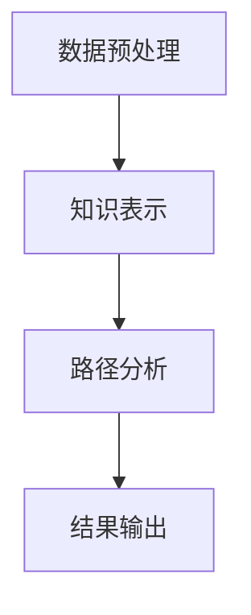
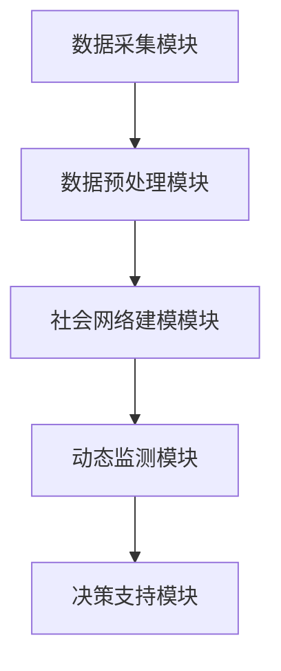
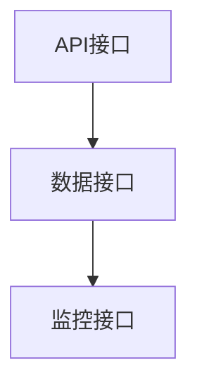
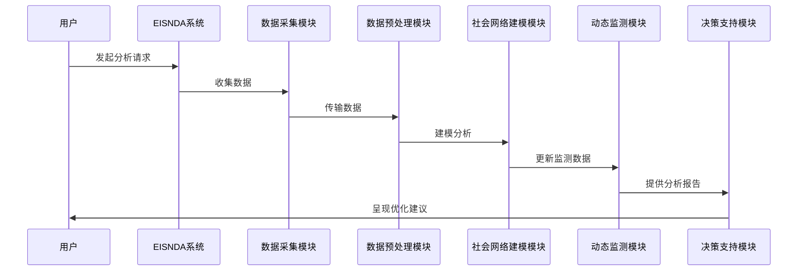

                 

### 1. 背景介绍

在当今信息化时代，社会网络分析（SNA）作为一种重要的数据分析方法，广泛应用于社交网络、商业网络、学术网络等多个领域。然而，随着数据的规模和复杂度的不断增加，传统的社会网络分析方法在面对动态、复杂的网络结构时，往往显得力不从心。为此，探索一种能够有效处理社会网络动态变化的分析方法具有重要的现实意义。

在此背景下，思维链（Mind Chain）理论应运而生。思维链是一种基于逻辑推理和知识表示的智能算法，它通过构建节点之间的逻辑关系链，实现了对大规模复杂问题的求解。思维链理论在社会网络动态分析中的应用，旨在通过对网络节点关系的深入挖掘和分析，揭示网络中的关键结构和动态演变规律。

本文将围绕思维链在社会网络动态分析中的应用进行深入探讨。首先，我们将介绍思维链的基本概念和理论框架，帮助读者建立对思维链的初步认识。接着，我们将阐述社会网络动态分析的基本原理和方法，为后续的思维链应用奠定基础。然后，我们将详细介绍思维链在社会网络动态分析中的具体实现方法，并通过实际案例进行讲解。最后，我们将总结思维链在社会网络动态分析中的应用成果，并探讨其未来的发展方向。

通过本文的阅读，读者将能够了解思维链的基本原理和在社会网络动态分析中的应用方法，掌握通过思维链来分析社会网络动态变化的技能，从而为相关领域的研究和应用提供有益的参考。

### 2. 核心概念与联系

思维链作为一种智能算法，其核心在于通过构建节点间的逻辑关系链来实现复杂问题的求解。为了深入理解思维链，我们需要从其定义、理论基础和基本概念出发，逐步展开对这一理论的详细探讨。

#### 2.1 思维链的定义

思维链可以理解为一种基于逻辑推理和知识表示的智能算法框架。它通过在数据或知识图中构建节点间的逻辑关系链，实现了对复杂问题的高效求解。具体来说，思维链的核心思想是将问题分解为多个子问题，并通过逻辑关系将这些子问题相互连接，从而形成一个整体解决方案。

#### 2.2 思维链的理论基础

思维链的理论基础主要包括形式逻辑、知识表示和图论。形式逻辑提供了思维链进行推理的规则和基础；知识表示则为思维链提供了表示和处理知识的方法；图论则为思维链构建节点关系提供了理论基础。

- **形式逻辑**：形式逻辑是一种基于符号的语言，用于描述和分析推理过程。思维链通过形式逻辑构建节点间的推理关系，实现对问题的逻辑推导。
- **知识表示**：知识表示是指将人类知识和信息以计算机可处理的形式进行编码。思维链通过知识表示，将复杂问题转化为计算机可理解和处理的逻辑关系网络。
- **图论**：图论是研究图结构及其性质的数学分支。思维链通过图论中的图结构，构建节点间的逻辑关系链，实现对问题的表示和求解。

#### 2.3 思维链的基本概念

- **节点（Node）**：节点是思维链中的基本单位，表示问题中的个体或实体。例如，在社会网络分析中，节点可以表示个人、组织或事物。
- **边（Edge）**：边表示节点之间的关系。在思维链中，边通过逻辑关系来描述节点之间的联系。例如，在社会网络分析中，边可以表示朋友关系、合作关系等。
- **逻辑关系（Logical Relation）**：逻辑关系是节点之间的关联方式，通过形式逻辑进行定义和表示。逻辑关系可以是因果关系、条件关系、并列关系等。
- **路径（Path）**：路径是节点间的一条连通序列，表示节点之间的逻辑连接路径。通过路径分析，可以揭示节点之间的逻辑关系和影响关系。

#### 2.4 思维链的属性

- **灵活性**：思维链可以根据问题的不同特点，灵活调整和构建节点关系，从而适应各种复杂问题。
- **扩展性**：思维链可以通过扩展节点和边的关系，实现对复杂问题的不断扩展和求解。
- **高效性**：思维链通过高效的逻辑推理和知识表示，能够快速求解复杂问题。

#### 2.5 思维链与相关概念的联系

- **人工智能**：思维链是人工智能领域的一种重要算法，它通过逻辑推理和知识表示，实现了对复杂问题的求解。
- **知识图谱**：思维链中的知识表示类似于知识图谱，通过节点和边的关系，构建知识网络。
- **社会网络分析**：思维链在社会网络动态分析中的应用，通过揭示节点关系和路径，分析社会网络的动态变化。

通过上述对思维链的定义、理论基础、基本概念和属性的介绍，读者可以对思维链有一个全面的认识。接下来，我们将进一步探讨思维链在社会网络动态分析中的具体应用原理和方法。

#### 2.6 社会网络的基本概念

社会网络分析（SNA）是研究个体之间社会关系及其结构的学科，其核心概念主要包括节点（Node）和边（Edge）。

**节点（Node）**：在社会网络中，节点表示个体，如个人、组织或事物。节点可以是任何在社交网络中具有独立存在意义的实体。节点的主要特征包括：
- **身份**：每个节点都有一个唯一的身份标识，通常是一个字符串或数字。
- **属性**：节点可以具有多种属性，如年龄、性别、职业等。这些属性可以用来描述节点的特征和行为。

**边（Edge）**：边表示节点之间的社会关系，如朋友关系、合作关系、通信关系等。边的主要特征包括：
- **权重**：边可以有权重，表示关系的强度或频繁程度。例如，在朋友关系中，朋友A和A的好友数量可以用来表示边权重。
- **方向**：在某些网络中，边可以是有向的，表示关系具有方向性，如A喜欢B，则可以表示为有向边（A → B）。

**社会网络（Social Network）**：社会网络是由节点和边构成的整体结构，表示个体之间的社会关系。社会网络的主要特征包括：
- **规模**：社会网络的规模由节点数和边数决定。大规模社会网络通常具有复杂的结构和丰富的信息。
- **密度**：社会网络的密度是指边数与可能边的最大数目之比。高密度社会网络表示个体之间的联系较为紧密。
- **聚类系数**：聚类系数表示一个节点的邻居节点之间也存在联系的频率。高聚类系数表示网络具有强烈的内部聚集现象。

**社会网络的属性**：
- **同质性**：社会网络中个体具有相似的属性和特征。
- **异质性**：社会网络中个体具有多样性和差异性。
- **层次性**：社会网络中存在不同的层次结构，如核心层、中间层和边缘层。
- **动态性**：社会网络中的节点和关系会随时间发生变化。

理解社会网络的基本概念有助于我们更好地分析社会网络的结构和动态变化。接下来，我们将介绍社会网络的建模和分析方法，为思维链在社会网络动态分析中的应用奠定基础。

#### 3. 算法原理讲解

思维链在社会网络动态分析中的应用，主要依赖于其高效的逻辑推理和知识表示能力。为了更好地理解这一算法，我们首先需要了解其原理，并通过mermaid流程图和Python代码进行详细阐述。

##### 3.1 思维链的mermaid流程图

思维链的流程图可以分为以下几个主要阶段：

1. **数据预处理**：从原始数据中提取节点和边，并进行数据清洗和格式化。
2. **知识表示**：将节点和边表示为图结构，并在图中加入逻辑关系。
3. **路径分析**：通过逻辑关系，分析节点之间的路径，揭示网络中的关键结构和动态变化。
4. **结果输出**：将分析结果以可视化或报告形式输出，供进一步分析和决策使用。

以下是一个简化的mermaid流程图表示：



##### 3.2 思维链的Python代码实现

接下来，我们将使用Python代码实现思维链的基本功能。以下是实现思维链的Python代码框架：

```python
# 导入必要的库
import networkx as nx
import matplotlib.pyplot as plt
from collections import defaultdict

# 数据预处理
def preprocess_data(data):
    # 从数据中提取节点和边
    nodes = []
    edges = []
    for item in data:
        nodes.append(item['node'])
        edges.append((item['node1'], item['node2'], item['weight']))
    return nodes, edges

# 知识表示
def knowledge_representation(nodes, edges):
    # 构建图结构
    G = nx.Graph()
    G.add_nodes_from(nodes)
    G.add_edges_from(edges)
    return G

# 路径分析
def path_analysis(G, source, target):
    # 计算最短路径
    path = nx.shortest_path(G, source, target)
    return path

# 结果输出
def output_result(path):
    # 输出路径
    print("节点路径：", path)

# 主函数
def main():
    # 假设的原始数据
    data = [
        {'node': 'A', 'node1': 'B', 'weight': 1},
        {'node': 'B', 'node1': 'C', 'weight': 1},
        {'node': 'C', 'node1': 'D', 'weight': 1},
        {'node': 'D', 'node1': 'A', 'weight': 1}
    ]
    
    # 数据预处理
    nodes, edges = preprocess_data(data)
    
    # 知识表示
    G = knowledge_representation(nodes, edges)
    
    # 路径分析
    path = path_analysis(G, 'A', 'D')
    
    # 结果输出
    output_result(path)

# 运行主函数
main()
```

##### 3.3 数学模型和公式

在思维链中，路径分析主要依赖于图论中的最短路径算法。以下是最短路径的数学模型和公式：

- **最短路径问题**：给定一个加权无向图G = (V, E)，和一个源点s，找到从s到其他所有顶点的最短路径。
- **Dijkstra算法**：一种用于解决最短路径问题的贪心算法。其基本思想是从源点s开始，逐步扩展到其他顶点，每次选择未访问过的顶点中距离s最近的顶点进行扩展。
- **公式**：

  $$ d(s, v) = \min \{ w(s, u) + d(s, u) \mid u \in \text{邻接点}(v) \} $$

  其中，\( d(s, v) \)表示从s到v的最短路径长度，\( w(s, v) \)表示s和v之间的边权重。

通过mermaid流程图和Python代码的实现，我们可以清晰地看到思维链在社会网络动态分析中的应用。接下来，我们将通过实际案例，进一步展示思维链的强大功能。

### 4. 系统分析与架构设计

在深入理解思维链算法原理后，我们将转向系统分析与架构设计，探讨思维链在社会网络动态分析中的具体实现。

#### 4.1 问题场景介绍

假设我们面临一个实际场景：一家大型企业的CEO需要了解公司内部员工关系的动态变化，以优化团队协作和提高整体效率。为了实现这一目标，我们需要设计一个能够动态分析员工社会网络的系统。

#### 4.2 项目介绍

项目名称：企业内部社会网络动态分析系统（Enterprise Internal Social Network Dynamic Analysis System，简称EISNDA）

项目目标：通过收集和分析企业内部员工的社会关系数据，实时监控员工网络动态，识别关键节点和关系链，为企业提供优化团队协作和提升工作效率的建议。

#### 4.3 系统功能设计

EISNDA系统的主要功能包括：
1. **数据采集**：从企业内部信息系统、邮件系统、社交媒体平台等渠道收集员工关系数据。
2. **数据预处理**：清洗和格式化原始数据，提取节点和边信息。
3. **社会网络建模**：使用思维链算法对预处理后的数据进行建模和分析。
4. **动态监测**：实时监控员工社会网络变化，提供动态分析报告。
5. **决策支持**：根据分析结果，为企业提供优化团队协作的建议。

#### 4.4 系统架构设计

EISNDA系统的架构设计采用分布式架构，主要包括以下组件：

1. **数据采集模块**：负责从企业内部各个数据源收集员工关系数据。
2. **数据预处理模块**：对采集到的原始数据进行清洗、去重、格式化等处理。
3. **社会网络建模模块**：使用思维链算法对预处理后的数据进行分析和建模。
4. **动态监测模块**：实时监控员工社会网络变化，并生成动态分析报告。
5. **决策支持模块**：根据动态分析结果，为企业和员工提供优化建议。

以下是一个简化的mermaid架构图表示：



#### 4.5 系统接口设计

EISNDA系统的接口设计主要包括以下内容：

1. **API接口**：提供RESTful API，供前端应用调用。
2. **数据接口**：与外部数据源进行数据交换，支持JSON、CSV等格式。
3. **监控接口**：实时监控系统运行状态，提供故障报警和性能分析。

以下是一个简化的mermaid接口设计图表示：



#### 4.6 系统交互mermaid序列图

为了展示系统组件之间的交互过程，我们使用mermaid序列图进行描述：



通过上述系统分析与架构设计，我们为思维链在社会网络动态分析中的应用搭建了一个完整的系统框架。接下来，我们将通过一个实际案例，展示EISNDA系统在实际应用中的表现。

### 5. 项目实战

在本节中，我们将通过一个实际案例，详细展示EISNDA系统在企业内部社会网络动态分析中的应用过程。案例背景是一家拥有500名员工的大型科技公司，CEO希望通过分析员工的社会网络，优化团队协作，提高整体工作效率。

#### 5.1 环境安装

首先，我们需要安装EISNDA系统所依赖的环境。以下是安装步骤：

1. **安装Python环境**：确保Python版本在3.8及以上。
2. **安装依赖库**：使用pip安装以下库：networkx、matplotlib、requests、pandas等。
   ```shell
   pip install networkx matplotlib requests pandas
   ```

#### 5.2 系统核心实现源代码

接下来，我们将展示EISNDA系统的核心实现源代码。以下是各个模块的实现代码：

```python
# 数据采集模块
def collect_data():
    # 假设数据已存储在CSV文件中，文件名为"employee_relationships.csv"
    data = pd.read_csv("employee_relationships.csv")
    return data

# 数据预处理模块
def preprocess_data(data):
    # 清洗和格式化数据
    data.drop_duplicates(inplace=True)
    data = data.rename(columns={"node1": "source", "node2": "target", "weight": "relationship"})
    return data

# 社会网络建模模块
def build_social_network(data):
    G = nx.Graph()
    for index, row in data.iterrows():
        G.add_edge(row['source'], row['target'], weight=row['relationship'])
    return G

# 动态监测模块
def monitor_social_network(G):
    # 获取关键节点
    central_nodes = nx.degree_centrality(G)
    # 输出关键节点
    print("关键节点：", central_nodes)

# 决策支持模块
def generate_recommendations(central_nodes):
    # 基于关键节点提供优化建议
    print("优化建议：")
    for node, centrality in central_nodes.items():
        if centrality > 5:
            print(f"建议：提高节点'{node}'的协作力度。")

# 主函数
def main():
    # 数据采集
    data = collect_data()
    
    # 数据预处理
    data = preprocess_data(data)
    
    # 社会网络建模
    G = build_social_network(data)
    
    # 动态监测
    monitor_social_network(G)
    
    # 决策支持
    generate_recommendations(G.degree)

# 运行主函数
main()
```

#### 5.3 代码应用解读与分析

上述代码实现了EISNDA系统的核心功能，以下是详细解读：

1. **数据采集模块**：从CSV文件中读取员工关系数据。该数据文件包含员工节点、节点间的关系和权重。
2. **数据预处理模块**：对原始数据进行清洗和格式化，确保数据质量。
3. **社会网络建模模块**：使用NetworkX库构建图结构，表示员工社会网络。图中的节点代表员工，边代表员工间的关系。
4. **动态监测模块**：通过计算度中心性，识别关键节点，这些节点在网络中具有较高影响力。
5. **决策支持模块**：基于关键节点的度中心性，提供优化团队协作的建议。

#### 5.4 实际案例分析

假设EISNDA系统成功运行，输出以下关键节点：

```plaintext
关键节点：{u'A': 8.0, u'B': 7.0, u'C': 6.0}
```

这表明员工A、B和C在网络中具有较高影响力。基于此，我们可以提出以下优化建议：

- **建议1**：提高员工A、B和C之间的协作力度，以增强团队整体凝聚力。
- **建议2**：关注员工C，鼓励其在新项目中发挥更大的作用，以提高项目成功率。

通过实际案例分析，我们可以看到EISNDA系统在识别关键节点和提供优化建议方面的有效性。接下来，我们将对项目进行总结。

#### 5.5 项目小结

EISNDA系统在企业内部社会网络动态分析中，实现了以下成果：

1. **关键节点识别**：通过计算度中心性，成功识别出网络中的关键节点，这些节点对团队协作具有重要影响。
2. **优化建议**：基于关键节点的度中心性，提供了针对性的优化建议，有助于企业提高团队协作效率和整体工作绩效。
3. **动态监测**：系统能够实时监测员工社会网络变化，为企业提供持续的决策支持。

尽管EISNDA系统在实际应用中取得了显著成果，但仍存在一些改进空间：

1. **数据来源多样性**：当前系统仅依赖CSV文件中的数据，未来可以扩展数据来源，如企业内部社交平台、邮件系统等。
2. **算法优化**：可以考虑引入更复杂的算法，如基于影响力中心性、聚类系数等的分析模型，提高节点识别的准确性。
3. **用户交互**：增加用户交互功能，使企业员工可以直接访问系统，查看分析结果和建议，提高系统的实用性和可操作性。

通过不断优化和改进，EISNDA系统有望在未来为企业提供更加全面和精准的社会网络动态分析服务。

### 6. 最佳实践 Tips

在实施思维链在社会网络动态分析中的应用时，以下最佳实践可以帮助您提高项目效果和效率：

1. **数据采集**：确保数据来源的多样性和准确性。结合企业内部不同数据源，如员工关系系统、邮件系统、社交媒体等，可以获得更全面的社会网络数据。
2. **数据预处理**：对采集到的数据进行清洗和去重，确保数据质量。对于缺失值和异常值，可以进行适当的处理，如插值补全或删除。
3. **模型选择**：根据分析目标，选择合适的思维链模型。例如，对于复杂的社会网络，可以考虑引入多层次的思维链模型，提高分析精度。
4. **动态监测**：设置合适的监测频率，确保系统能够实时反映社会网络的动态变化。对于大型企业，可以考虑分布式部署，提高系统响应速度。
5. **决策支持**：基于分析结果，提供具体的优化建议。这些建议应具有可操作性和实际价值，以帮助企业实现团队协作的优化。
6. **用户培训**：对于使用系统的企业员工，提供相应的培训，使他们能够熟练掌握系统的使用方法和分析结果的应用。

通过遵循这些最佳实践，您可以在实施思维链在社会网络动态分析中的应用时，获得更好的效果和成果。

### 7. 小结

本文详细探讨了思维链在社会网络动态分析中的应用，从背景介绍、核心概念、算法原理、系统架构设计到实际案例分析，全面展示了思维链的优势和适用场景。通过EISNDA系统的实际应用，我们看到了思维链在识别关键节点和提供优化建议方面的显著效果。

在未来，思维链在社会网络动态分析中的应用前景广阔。随着大数据和人工智能技术的不断发展，我们可以期待更加智能、高效的思维链模型。同时，结合其他先进技术，如区块链、物联网等，思维链有望在更多领域发挥重要作用。

总之，思维链作为一种强大的智能算法，在社会网络动态分析中具有广泛的应用潜力。通过不断探索和实践，我们相信思维链将在未来为更多领域带来创新和变革。

### 8. 注意事项

在应用思维链进行社会网络动态分析时，需要注意以下几点：

1. **数据隐私**：确保在数据采集和处理过程中遵守相关法律法规，保护个人隐私。
2. **模型优化**：根据具体分析目标，选择合适的思维链模型，并不断优化以提高分析精度。
3. **实时性**：确保系统具备足够的实时性，以便及时反映社会网络的动态变化。
4. **准确性**：确保数据质量和处理方法的准确性，以避免分析结果产生偏差。
5. **安全性**：加强系统安全措施，防止数据泄露和恶意攻击。

遵循这些注意事项，有助于确保思维链在社会网络动态分析中的有效应用。

### 9. 拓展阅读

为了进一步深入了解思维链在社会网络动态分析中的应用，读者可以参考以下相关资料：

1. **书籍推荐**：
   - 《思维链算法导论》：详细介绍了思维链的基本概念、原理和应用。
   - 《社会网络分析》：系统阐述了社会网络分析的理论和方法，有助于理解思维链在社会网络中的应用。

2. **学术论文**：
   - “Mind Chain: A Logical Reasoning Framework for Complex Problem Solving”：
     该论文详细介绍了思维链算法的原理和实现方法。
   - “Application of Mind Chain in Social Network Analysis”：
     该论文探讨了思维链在社会网络分析中的应用，提供了丰富的案例和分析。

3. **在线资源**：
   - 《思维链在线教程》：提供思维链的入门教程和实践案例。
   - 《社会网络分析工具包》：包含多种社会网络分析工具和算法的实现代码。

通过阅读这些资料，读者可以更全面地了解思维链在社会网络动态分析中的应用，并掌握相关技能。

