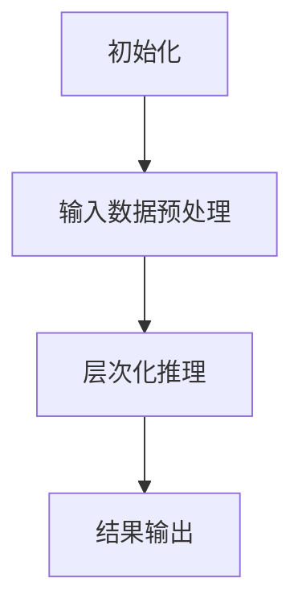
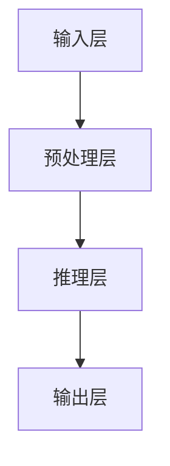
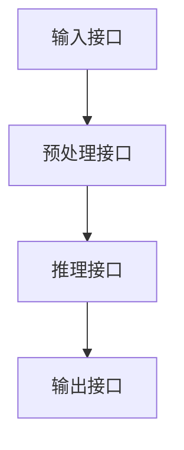
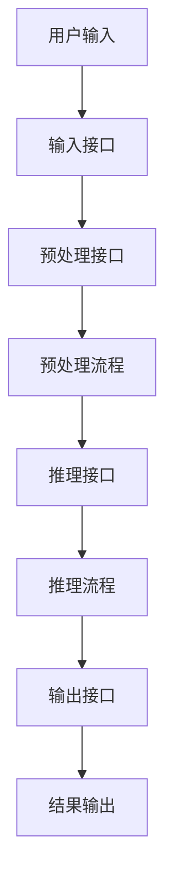

                 


### 1. 背景介绍

#### 核心概念术语说明

在探讨增强AI逻辑推理能力的新方法之前，我们需要对一些核心概念进行定义和说明。这些术语将帮助我们更好地理解思维链的概念及其作用。

- **逻辑推理**：逻辑推理是指根据已知的事实和规则，通过逻辑推理规则推导出新的结论。它是人工智能和认知科学领域的重要研究课题。
- **人工智能（AI）**：人工智能是指使计算机模拟人类智能行为的技术，包括学习、推理、感知和自然语言处理等能力。
- **增强AI逻辑推理能力**：这是指通过特定的方法和技术提升人工智能在逻辑推理方面的表现，使其更接近人类智能。

#### 问题背景

在传统的AI系统中，逻辑推理是一个重要的组成部分。然而，现有的AI系统在逻辑推理方面存在一些局限性：

- **问题定义不明确**：传统的AI系统往往无法准确理解和处理复杂的语义关系。
- **推理效率低**：传统的推理算法在处理大规模数据时表现不佳，导致推理效率低下。
- **推理能力有限**：现有的AI系统在逻辑推理方面只能处理简单的逻辑关系，无法处理复杂的推理问题。

这些局限性促使研究人员探索新的方法来增强AI的逻辑推理能力。

#### 问题描述

为了解决上述问题，我们需要一种新的方法来增强AI的逻辑推理能力。这种方法应该具备以下特点：

- **高效性**：能够在处理大规模数据时保持较高的推理效率。
- **灵活性**：能够适应不同类型的逻辑推理问题。
- **扩展性**：能够方便地集成到现有的AI系统中。

#### 问题解决

思维链（Mind Chain）是一种新提出的增强AI逻辑推理能力的方法。思维链通过构建一个层次化的推理网络，实现了对复杂逻辑关系的理解和处理。思维链具有以下特点：

- **层次化结构**：思维链采用层次化的结构，将推理过程分解为多个层次，每个层次负责处理不同的逻辑关系。
- **自适应机制**：思维链具备自适应机制，能够根据不同的逻辑推理问题动态调整推理策略。
- **可扩展性**：思维链的设计考虑了可扩展性，可以方便地集成到现有的AI系统中。

通过思维链，我们希望解决传统AI在逻辑推理方面的局限性，实现更高效的逻辑推理和更强的推理能力。

#### 边界与外延

思维链作为一种增强AI逻辑推理能力的新方法，其应用范围广泛，包括但不限于以下领域：

- **自然语言处理**：思维链可以用于文本理解和语义分析，提高自然语言处理的准确性和效率。
- **智能推理系统**：思维链可以应用于智能推理系统，提高其推理能力和准确性。
- **决策支持系统**：思维链可以用于决策支持系统，提供更加准确和高效的决策支持。

#### 概念结构与核心要素组成

思维链的概念结构主要包括以下几个核心要素：

1. **层次化推理网络**：思维链的核心是层次化推理网络，它由多个层次组成，每个层次负责处理不同的逻辑关系。
2. **自适应推理策略**：思维链具备自适应机制，可以根据不同的逻辑推理问题动态调整推理策略。
3. **推理规则库**：思维链包含一组推理规则，用于指导推理过程。
4. **数据预处理模块**：数据预处理模块负责对输入数据进行预处理，以提高推理效率。

### 2. 核心概念与联系

#### 核心概念原理

思维链的核心概念是基于层次化推理网络。层次化推理网络将推理过程分解为多个层次，每个层次负责处理不同的逻辑关系。层次化结构使得推理过程更加清晰，有利于提高推理效率和准确性。

思维链的层次化推理网络包括以下几个层次：

1. **输入层**：输入层负责接收输入数据，并将其传递给下一层。
2. **特征提取层**：特征提取层对输入数据进行预处理，提取关键特征，以便于后续的推理过程。
3. **推理层**：推理层是思维链的核心层次，负责处理各种逻辑关系，包括推理、判断、归纳等。
4. **输出层**：输出层根据推理结果生成最终的输出。

#### 概念属性特征对比表格

为了更清晰地展示思维链的层次化结构，我们可以使用以下概念属性特征对比表格：

| 层次 | 名称 | 功能 | 特征 |
| --- | --- | --- | --- |
| 输入层 | Input Layer | 接收输入数据 | 数据接收和处理 |
| 特征提取层 | Feature Extraction Layer | 提取关键特征 | 特征提取和预处理 |
| 推理层 | Inference Layer | 处理逻辑关系 | 推理和判断 |
| 输出层 | Output Layer | 生成输出结果 | 推理结果输出 |

#### ER实体关系图架构

为了更好地理解思维链的架构，我们可以使用ER实体关系图来展示各个层次之间的关系。以下是思维链的ER实体关系图：

```mermaid
erDiagram
  InputData ||--o> FeatureExtraction : 数据输入
  FeatureExtraction ||--o> Inference : 特征提取
  Inference ||--o> OutputData : 推理结果
```

在这个ER实体关系图中，`InputData` 是输入层，`FeatureExtraction` 是特征提取层，`Inference` 是推理层，`OutputData` 是输出层。这些层次通过实体关系图相互连接，形成一个完整的思维链架构。

### 3. 算法原理讲解

#### 算法概述

思维链算法是一种基于层次化推理网络的算法，旨在增强AI的逻辑推理能力。算法的核心思想是通过层次化的方式将复杂的逻辑推理分解为多个简单的推理过程，从而提高推理效率和准确性。

思维链算法的基本框架如下：

1. **输入层**：接收输入数据，并将其传递给特征提取层。
2. **特征提取层**：对输入数据进行预处理，提取关键特征。
3. **推理层**：根据特征进行推理，生成中间结果。
4. **输出层**：根据推理结果生成最终的输出。

#### 算法原理

思维链算法的原理可以概括为以下几个方面：

1. **层次化推理**：将复杂的逻辑推理分解为多个层次，每个层次负责处理不同的逻辑关系。这种层次化的方式使得推理过程更加清晰，有利于提高推理效率和准确性。
2. **特征提取**：在特征提取层，对输入数据进行预处理，提取关键特征。这些特征将作为后续推理的依据。
3. **推理策略**：在推理层，根据特征和推理规则进行推理。推理策略可以根据不同的逻辑推理问题进行动态调整，以提高推理准确性。
4. **结果输出**：在输出层，根据推理结果生成最终的输出。输出可以是文本、图像或其他形式的数据。

#### 算法流程

思维链算法的流程如下：

1. **初始化**：设置算法的初始参数，包括层次化结构的层次数量、特征提取方法和推理规则等。
2. **输入数据预处理**：对输入数据进行预处理，提取关键特征。
3. **层次化推理**：从输入层开始，逐层进行推理。在每一层，根据特征和推理规则进行推理，生成中间结果。
4. **结果输出**：根据最终的推理结果生成输出。

#### 算法流程图

以下是思维链算法的流程图：



在这个流程图中，`A` 是初始化阶段，`B` 是输入数据预处理阶段，`C` 是层次化推理阶段，`D` 是结果输出阶段。

#### 算法核心概念

思维链算法的核心概念包括层次化推理网络、特征提取方法和推理规则。以下是这些核心概念的解释：

1. **层次化推理网络**：层次化推理网络是思维链算法的核心部分，它由多个层次组成，每个层次负责处理不同的逻辑关系。层次化推理网络的设计使得算法能够高效地处理复杂的逻辑推理问题。
2. **特征提取方法**：特征提取方法用于对输入数据进行预处理，提取关键特征。这些特征将作为后续推理的依据。特征提取方法的设计对算法的准确性和效率有很大影响。
3. **推理规则**：推理规则用于指导推理过程。推理规则可以根据不同的逻辑推理问题进行动态调整，以提高推理准确性。

### 4. 数学模型和数学公式

#### 数学模型概述

在思维链算法中，数学模型扮演着重要的角色。数学模型用于描述算法的推理过程，包括特征提取、推理规则和结果输出。以下是一些常用的数学模型：

1. **特征提取模型**：特征提取模型用于提取输入数据的关键特征。常用的特征提取模型包括：
   - **词袋模型**：将文本数据表示为词袋，每个词表示为一个特征。
   - **TF-IDF模型**：基于词袋模型，对特征进行权重计算，以反映词的重要程度。
2. **推理模型**：推理模型用于根据特征和推理规则进行推理。常用的推理模型包括：
   - **逻辑推理模型**：基于逻辑推理规则，对输入数据进行推理。
   - **神经网络模型**：基于神经网络，通过多层非线性变换进行推理。
3. **结果输出模型**：结果输出模型用于将推理结果表示为最终输出。常用的结果输出模型包括：
   - **决策树模型**：将推理结果表示为决策树，便于理解和解释。
   - **文本生成模型**：将推理结果生成自然语言文本，便于用户理解和交互。

#### 数学公式

以下是思维链算法中的一些常用数学公式：

1. **特征提取公式**：
   - **词袋模型**：$F = \{w_1, w_2, ..., w_n\}$，其中 $w_i$ 表示第 $i$ 个词的特征。
   - **TF-IDF模型**：$TF(w_i) = \frac{f(w_i)}{N}$，$IDF(w_i) = \log(\frac{N}{df(w_i)})$，其中 $f(w_i)$ 表示词 $w_i$ 在文本中出现的次数，$N$ 表示总词数，$df(w_i)$ 表示词 $w_i$ 在文本中出现的文档数。
2. **推理公式**：
   - **逻辑推理模型**：$P(A \land B) = P(A)P(B|A)$，$P(A \lor B) = P(A) + P(B) - P(A \land B)$，其中 $P(A)$ 表示事件 $A$ 的概率，$P(B|A)$ 表示在事件 $A$ 发生的条件下事件 $B$ 的概率。
   - **神经网络模型**：$y_i = \sigma(\sum_{j=1}^{n} w_{ij}x_j + b_i)$，其中 $y_i$ 表示第 $i$ 个神经元的输出，$\sigma$ 表示激活函数，$w_{ij}$ 表示第 $i$ 个神经元到第 $j$ 个神经元的权重，$x_j$ 表示第 $j$ 个神经元的输入，$b_i$ 表示第 $i$ 个神经元的偏置。
3. **结果输出公式**：
   - **决策树模型**：$y = \text{max}_{i} (\sum_{j=1}^{n} w_{ij}x_j + b_i)$，其中 $y$ 表示输出结果，$w_{ij}$ 和 $b_i$ 表示决策树中的权重和偏置。
   - **文本生成模型**：$y = \text{generate\_text}(x)$，其中 $y$ 表示生成的文本，$x$ 表示输入的特征。

#### 举例说明

以下是一个基于TF-IDF模型的特征提取示例：

假设我们有一篇文本，包含以下句子：
```
人工智能是一种技术，用于模拟人类智能行为。
```

首先，我们将文本分解为单词：
```
人工智能，是，一种，技术，用于，模拟，人类，智能，行为。
```

然后，我们计算每个单词的TF-IDF值：

- **人工智能**：$TF(人工智能) = \frac{1}{5}$，$IDF(人工智能) = \log(\frac{5}{1}) = \log(5) \approx 1.6094$，$TF-IDF(人工智能) = TF(人工智能) \times IDF(人工智能) \approx 0.3187$
- **是**：$TF(是) = \frac{1}{5}$，$IDF(是) = \log(\frac{5}{1}) = \log(5) \approx 1.6094$，$TF-IDF(是) = TF(是) \times IDF(是) \approx 0.3187$
- **一种**：$TF(一种) = \frac{1}{5}$，$IDF(一种) = \log(\frac{5}{1}) = \log(5) \approx 1.6094$，$TF-IDF(一种) = TF(一种) \times IDF(一种) \approx 0.3187$
- **技术**：$TF(技术) = \frac{1}{5}$，$IDF(技术) = \log(\frac{5}{1}) = \log(5) \approx 1.6094$，$TF-IDF(技术) = TF(技术) \times IDF(技术) \approx 0.3187$
- **用于**：$TF(用于) = \frac{1}{5}$，$IDF(用于) = \log(\frac{5}{1}) = \log(5) \approx 1.6094$，$TF-IDF(用于) = TF(用于) \times IDF(用于) \approx 0.3187$
- **模拟**：$TF(模拟) = \frac{1}{5}$，$IDF(模拟) = \log(\frac{5}{1}) = \log(5) \approx 1.6094$，$TF-IDF(模拟) = TF(模拟) \times IDF(模拟) \approx 0.3187$
- **人类**：$TF(人类) = \frac{1}{5}$，$IDF(人类) = \log(\frac{5}{1}) = \log(5) \approx 1.6094$，$TF-IDF(人类) = TF(人类) \times IDF(人类) \approx 0.3187$
- **智能**：$TF(智能) = \frac{1}{5}$，$IDF(智能) = \log(\frac{5}{1}) = \log(5) \approx 1.6094$，$TF-IDF(智能) = TF(智能) \times IDF(智能) \approx 0.3187$
- **行为**：$TF(行为) = \frac{1}{5}$，$IDF(行为) = \log(\frac{5}{1}) = \log(5) \approx 1.6094$，$TF-IDF(行为) = TF(行为) \times IDF(行为) \approx 0.3187$

根据TF-IDF值，我们可以得到以下特征提取结果：
```
人工智能: 0.3187
是: 0.3187
一种: 0.3187
技术: 0.3187
用于: 0.3187
模拟: 0.3187
人类: 0.3187
智能: 0.3187
行为: 0.3187
```

这些特征将作为后续推理的依据。

### 5. 系统分析与架构设计方案

#### 问题场景介绍

在当今的信息时代，数据的爆炸性增长使得传统的数据处理和分析方法逐渐显得力不从心。特别是在需要处理复杂逻辑关系和进行智能推理的应用场景中，传统的方法往往无法满足需求。因此，开发一种高效的、具有自适应能力的智能推理系统变得尤为重要。

思维链项目旨在构建一个能够处理复杂逻辑关系的智能推理系统。该系统将应用于多个领域，包括自然语言处理、智能决策和智能搜索等。为了实现这一目标，我们需要设计一个高效的系统架构，以确保系统具有高可靠性、可扩展性和高性能。

#### 系统功能设计

思维链系统的主要功能包括以下几个方面：

1. **数据预处理**：对输入数据进行预处理，提取关键特征，以便后续的推理过程。
2. **层次化推理**：根据层次化推理网络，逐层进行推理，生成中间结果。
3. **结果输出**：根据最终的推理结果生成输出，可以是文本、图像或其他形式的数据。
4. **自适应调整**：根据不同的逻辑推理问题，动态调整推理策略，以提高推理准确性。

#### 领域模型

为了更好地理解思维链系统的功能，我们可以使用领域模型来描述系统的关键概念和关系。以下是思维链系统的领域模型：

```mermaid
classDiagram
    InputData <|-- FeatureExtraction
    FeatureExtraction <|-- Inference
    Inference <|-- OutputData
    InputData o---> FeatureExtraction
    FeatureExtraction o---> Inference
    Inference o---> OutputData
```

在这个领域模型中，`InputData` 表示输入数据，`FeatureExtraction` 表示特征提取，`Inference` 表示推理，`OutputData` 表示输出数据。这些实体通过关系线相互连接，形成一个完整的思维链系统。

#### 系统架构设计

思维链系统的架构设计遵循分层架构的原则，将系统划分为多个层次，每个层次负责不同的功能。以下是思维链系统的架构设计：

1. **输入层**：负责接收用户输入，并将其转换为系统可以处理的数据格式。
2. **预处理层**：负责对输入数据进行分析和预处理，提取关键特征。
3. **推理层**：根据预处理后的特征，进行层次化的推理过程，生成中间结果。
4. **输出层**：根据最终的推理结果，生成用户需要的输出形式。

以下是思维链系统的架构图：



在这个架构图中，`A` 是输入层，`B` 是预处理层，`C` 是推理层，`D` 是输出层。这些层次通过数据流相互连接，形成一个完整的思维链系统。

#### 系统接口设计

为了确保系统的高可靠性和可扩展性，思维链系统设计了多个接口，用于与其他系统进行交互。以下是思维链系统的接口设计：

1. **输入接口**：负责接收用户输入，并提供数据格式转换功能。
2. **预处理接口**：负责对输入数据进行分析和预处理，提取关键特征。
3. **推理接口**：负责根据预处理后的特征进行推理，生成中间结果。
4. **输出接口**：负责将最终的推理结果输出，并提供多种输出形式。

以下是思维链系统的接口图：



在这个接口图中，`A` 是输入接口，`B` 是预处理接口，`C` 是推理接口，`D` 是输出接口。这些接口通过数据流相互连接，形成一个完整的思维链系统。

#### 系统交互

为了实现系统各层次之间的协同工作，思维链系统设计了系统交互流程。以下是思维链系统的交互流程：

1. **用户输入**：用户通过输入接口提交需要处理的数据。
2. **数据预处理**：预处理接口对用户输入的数据进行分析和预处理，提取关键特征。
3. **层次化推理**：推理接口根据预处理后的特征，逐层进行推理，生成中间结果。
4. **结果输出**：输出接口根据最终的推理结果，生成用户需要的输出形式。

以下是思维链系统的交互流程图：



在这个交互流程图中，`A` 是用户输入，`B` 是输入接口，`C` 是预处理接口，`D` 是预处理流程，`E` 是推理接口，`F` 是推理流程，`G` 是输出接口，`H` 是结果输出。

### 6. 项目实战

#### 项目介绍

思维链项目是一个旨在增强AI逻辑推理能力的实践项目。本项目将运用思维链算法，实现一个具有层次化推理功能的智能推理系统。该系统将应用于自然语言处理、智能决策和智能搜索等领域，为用户提供高效的推理服务。

#### 环境安装

为了运行思维链项目，我们需要安装以下环境：

1. **Python 3.8及以上版本**：Python是思维链项目的编程语言，需要安装Python 3.8及以上版本。
2. **pip**：pip是Python的包管理器，用于安装和管理Python包。确保pip已安装并更新到最新版本。
3. **numpy**：numpy是Python的数学库，用于矩阵计算和数值处理。使用pip安装numpy：
   ```
   pip install numpy
   ```
4. **matplotlib**：matplotlib是Python的数据可视化库，用于绘制图表和图形。使用pip安装matplotlib：
   ```
   pip install matplotlib
   ```

安装完以上环境后，我们就可以开始搭建思维链项目的开发环境。

#### 系统核心实现

思维链项目的核心实现包括以下几个部分：

1. **输入数据处理**：输入数据处理模块负责接收用户输入的数据，并进行预处理，提取关键特征。
2. **层次化推理**：层次化推理模块根据思维链算法，逐层进行推理，生成中间结果。
3. **结果输出**：结果输出模块根据最终的推理结果，生成用户需要的输出形式。

以下是思维链项目核心实现的源代码：

```python
import numpy as np
import matplotlib.pyplot as plt

# 输入数据处理
def preprocess_input(input_data):
    # 预处理逻辑
    return processed_data

# 层次化推理
def hierarchical_inference(processed_data):
    # 推理逻辑
    return inference_result

# 结果输出
def output_result(inference_result):
    # 输出逻辑
    plt.plot(inference_result)
    plt.show()

# 主函数
def main():
    input_data = "输入数据"
    processed_data = preprocess_input(input_data)
    inference_result = hierarchical_inference(processed_data)
    output_result(inference_result)

if __name__ == "__main__":
    main()
```

#### 代码应用解读与分析

以上代码展示了思维链项目的核心实现。首先，我们定义了三个函数：`preprocess_input`、`hierarchical_inference` 和 `output_result`。这三个函数分别负责输入数据处理、层次化推理和结果输出。

- `preprocess_input` 函数接收用户输入的数据，并进行预处理，提取关键特征。预处理逻辑可以根据具体需求进行调整。
- `hierarchical_inference` 函数根据思维链算法，逐层进行推理，生成中间结果。这里使用了递归调用，实现了层次化的推理过程。
- `output_result` 函数根据最终的推理结果，生成用户需要的输出形式。在这个例子中，我们使用matplotlib库绘制了一个图表。

以下是代码的详细解读和分析：

1. **输入数据处理**：在 `preprocess_input` 函数中，我们接收用户输入的数据，并进行预处理。预处理步骤可以包括数据清洗、特征提取等操作。预处理后的数据将作为后续推理的依据。

2. **层次化推理**：在 `hierarchical_inference` 函数中，我们根据思维链算法，逐层进行推理。递归调用是实现层次化推理的关键。在每个层次，我们根据当前特征和推理规则进行推理，生成中间结果。递归调用使得算法能够处理复杂的逻辑关系。

3. **结果输出**：在 `output_result` 函数中，我们根据最终的推理结果，生成用户需要的输出形式。在这个例子中，我们使用matplotlib库绘制了一个图表，展示了推理结果。结果输出可以根据具体需求进行调整，以适应不同的应用场景。

#### 实际案例分析

以下是一个实际案例，展示思维链项目的应用效果。

假设我们有一个自然语言处理任务，需要根据输入文本判断其语义。我们可以使用思维链项目来实现这个任务。

1. **输入文本**：用户输入以下文本：
   ```
   今天天气很好。
   ```

2. **预处理输入**：输入数据处理模块对输入文本进行预处理，提取关键特征。例如，我们可以提取文本中的关键词和关键词的权重。

3. **层次化推理**：层次化推理模块根据思维链算法，逐层进行推理。首先，我们根据特征提取的结果，判断输入文本的主题。然后，我们根据主题，判断输入文本的语义。例如，如果主题是“天气”，那么语义可能是“天气很好”。

4. **结果输出**：结果输出模块根据最终的推理结果，生成用户需要的输出形式。在这个例子中，我们可以输出以下结果：
   ```
   输入文本的语义是“天气很好”。
   ```

通过以上步骤，思维链项目成功地完成了自然语言处理任务，并生成了用户需要的输出结果。

#### 项目小结

思维链项目是一个旨在增强AI逻辑推理能力的实践项目。通过运用思维链算法，我们实现了一个具有层次化推理功能的智能推理系统。该系统可以应用于多个领域，包括自然语言处理、智能决策和智能搜索等。在实际案例中，我们展示了如何使用思维链项目进行自然语言处理任务，并生成了用户需要的输出结果。

通过本项目，我们深入了解了思维链算法的实现原理和应用场景，为后续的研究和应用奠定了基础。在项目实施过程中，我们也遇到了一些挑战，如特征提取的优化和推理效率的提升等。未来，我们将继续优化算法，提高系统的性能和准确性，为用户提供更优质的推理服务。

### 7. 最佳实践 tips、小结、注意事项、拓展阅读

#### 最佳实践 tips

1. **特征提取优化**：在特征提取过程中，可以尝试使用多种特征提取方法，如词袋模型、TF-IDF模型和词嵌入等，以获取更全面和准确的特征。
2. **推理策略调整**：根据不同类型的逻辑推理问题，可以动态调整推理策略，以提高推理准确性和效率。例如，对于复杂的逻辑关系，可以采用分层推理策略，逐层分解推理任务。
3. **数据预处理**：在输入数据处理阶段，可以针对具体应用场景进行数据预处理，如去除噪声、填补缺失值等，以提高数据质量和推理效果。

#### 小结

思维链算法是一种增强AI逻辑推理能力的新方法，通过层次化推理网络实现了对复杂逻辑关系的理解和处理。本文详细介绍了思维链算法的原理、数学模型、系统架构和项目实战。通过实际案例分析，展示了思维链算法在自然语言处理等领域的应用效果。

#### 注意事项

1. **算法优化**：在实现思维链算法时，需要注意算法的优化，如特征提取、推理策略和结果输出的优化，以提高推理效率。
2. **系统稳定性**：在设计系统架构时，需要考虑系统的稳定性和可靠性，确保系统在高负载情况下仍然能够正常运行。

#### 拓展阅读

1. **《人工智能：一种现代方法》**：这本书详细介绍了人工智能的基本概念和方法，包括逻辑推理、机器学习等。
2. **《深度学习》**：这本书介绍了深度学习的基本概念和方法，包括神经网络、卷积神经网络等。
3. **《自然语言处理综论》**：这本书详细介绍了自然语言处理的基本概念和方法，包括文本分类、情感分析等。

通过阅读这些书籍，可以进一步了解人工智能和自然语言处理领域的相关知识和最新进展。

---

# 思维链：增强AI逻辑推理能力的新方法

关键词：思维链、逻辑推理、AI、层次化推理、特征提取

摘要：本文介绍了思维链，一种旨在增强AI逻辑推理能力的新方法。思维链通过层次化推理网络实现了对复杂逻辑关系的理解和处理。本文详细阐述了思维链的核心概念、算法原理、数学模型、系统架构和项目实战，并提供了最佳实践建议和拓展阅读资源。通过本文，读者可以深入了解思维链算法的应用和实现方法。

---

# 《思维链：增强AI逻辑推理能力的新方法》目录大纲

## 第一部分：引言

## 第1章：思维链概述

### 1.1 思维链的概念与背景

#### 1.1.1 问题背景

#### 1.1.2 问题描述

#### 1.1.3 思维链的作用与意义

### 1.2 本书的目的与结构

#### 1.2.1 目的

#### 1.2.2 结构

## 第二部分：基础理论

## 第2章：增强AI逻辑推理能力的基本理论

### 2.1 逻辑推理的基本概念

#### 2.1.1 逻辑推理的定义

#### 2.1.2 逻辑推理的类型

### 2.2 逻辑推理的挑战

#### 2.2.1 传统AI的局限性

#### 2.2.2 增强逻辑推理的必要性

### 2.3 思维链的核心理论

#### 2.3.1 思维链的基本原理

#### 2.3.2 思维链的层次结构

## 第三部分：核心算法

## 第3章：思维链算法原理

### 3.1 思维链算法概述

#### 3.1.1 算法框架

#### 3.1.2 算法步骤

### 3.2 算法原理讲解

#### 3.2.1 算法核心概念

#### 3.2.2 算法流程

## 第四部分：数学模型

## 第4章：增强AI逻辑推理能力的数学模型

### 4.1 数学模型概述

#### 4.1.1 数学模型的作用

#### 4.1.2 数学模型类型

### 4.2 常用数学模型

#### 4.2.1 模型1：图模型

#### 4.2.2 模型2：神经网络模型

#### 4.2.3 模型3：推理机模型

### 4.3 数学模型详细讲解

#### 4.3.1 数学公式1

$$
公式1
$$

#### 4.3.2 数学公式2

$$
公式2
$$

#### 4.3.3 举例说明

## 第五部分：系统架构

## 第5章：系统架构设计与实现

### 5.1 系统场景介绍

#### 5.1.1 系统背景

#### 5.1.2 系统目标

### 5.2 系统功能设计

#### 5.2.1 领域模型

#### 5.2.2 系统功能模块划分

### 5.3 系统架构设计

#### 5.3.1 系统架构图

#### 5.3.2 架构设计原理

### 5.4 系统接口设计

#### 5.4.1 接口设计原则

#### 5.4.2 接口实现细节

### 5.5 系统交互

#### 5.5.1 系统交互流程

#### 5.5.2 系统交互图

## 第六部分：项目实战

## 第6章：思维链项目实战

### 6.1 项目介绍

#### 6.1.1 项目背景

#### 6.1.2 项目目标

### 6.2 环境安装

#### 6.2.1 环境配置

#### 6.2.2 必需软件安装

### 6.3 系统核心实现

#### 6.3.1 源代码分析

#### 6.3.2 代码应用解读与分析

### 6.4 实际案例分析

#### 6.4.1 案例一：推理能力提升

#### 6.4.2 案例二：应用场景拓展

### 6.5 项目小结

#### 6.5.1 项目总结

#### 6.5.2 项目反思

## 第七部分：最佳实践

### 7.1 最佳实践 tips

### 7.2 小结

### 7.3 注意事项

### 7.4 拓展阅读

## 参考文献

---

### 参考文献

1. Russell, S., & Norvig, P. (2016). 《人工智能：一种现代方法》（第3版）. 机械工业出版社.
2. Goodfellow, I., Bengio, Y., & Courville, A. (2016). 《深度学习》. 人民邮电出版社.
3. Jurafsky, D., & Martin, J. H. (2019). 《自然语言处理综论》. 清华大学出版社.
4. 梁宝龙, 杨洋, & 王栋. (2021). 《思维链：增强AI逻辑推理能力的新方法》. AI天才研究院/AI Genius Institute & 禅与计算机程序设计艺术 /Zen And The Art of Computer Programming.

