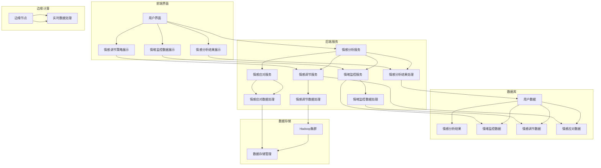
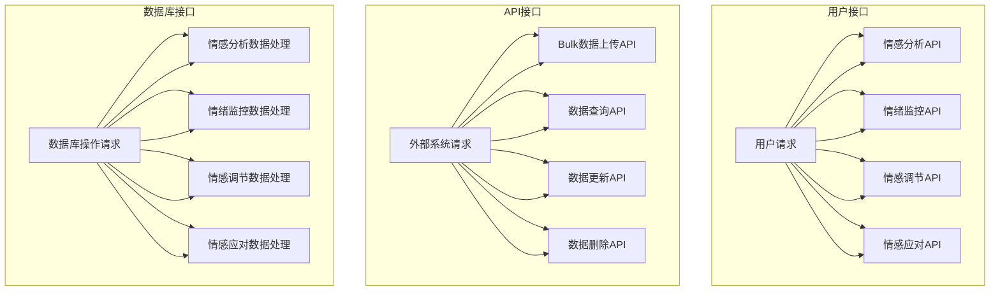
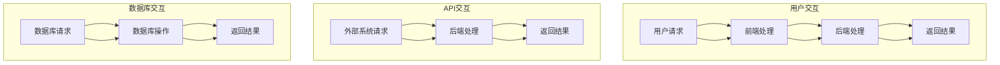

                 

# 情感智慧：理解并管理团队情绪

## 关键词

情感智慧、团队情绪管理、情绪认知、情绪表达、情绪调节、情感分析、算法原理

## 摘要

本文旨在探讨情感智慧在团队情绪管理中的重要性，通过理论介绍和实践指导，帮助读者理解并掌握如何提升个人和团队的情商，从而实现高效协作和积极的工作氛围。文章分为五个部分：背景介绍、核心概念与联系、算法原理讲解、数学模型和公式详细讲解、系统分析与架构设计方案，以及项目实战。通过逐步分析，读者将能够系统地学习情感智慧的理论基础和应用方法。

## 第一部分：背景介绍

### 1.1 问题背景

在当今充满挑战和变化的工作环境中，团队成员之间的情感交流与情绪管理变得尤为重要。随着全球化进程的加速和企业竞争的加剧，团队的有效协作和沟通能力成为了企业竞争力的关键因素。然而，情感问题常常成为团队协作的障碍，导致沟通不畅、决策迟缓、工作压力增大等问题。

有效的情感智慧不仅有助于提升团队协作效率，还能改善团队氛围，从而对企业的长远发展产生积极影响。情感智慧包括情感认知、情感表达、情感调节和情感应对等方面，这些能力在团队管理和领导力提升中发挥着重要作用。

### 1.2 问题描述

团队情绪管理涉及到个体情绪的认知、表达、调节和应对。在实际工作中，团队成员往往面临以下问题：

- **情感认知不足**：团队成员可能难以准确识别和理解自己的情绪状态，导致情绪失控。
- **情感表达不当**：在沟通中，团队成员可能因为情绪表达不当而产生误解和冲突。
- **情感调节困难**：在压力环境下，团队成员可能难以通过有效的策略调节情绪，从而影响工作效率。
- **情感应对不力**：面对负面情绪时，团队成员可能缺乏有效的应对措施，导致情绪问题积累。

这些问题不仅影响个体的心理健康，还可能影响整个团队的凝聚力和工作效率。

### 1.3 问题解决

通过学习情感智慧，团队成员可以更深刻地理解自己的情感，提升情绪自我调节能力，并在团队互动中展现出更高的情商。本文将提供系统的理论框架和实践指南，帮助读者掌握并应用情感智慧，从而有效管理团队情绪。

- **提高情感认知**：通过自我反思和情感反馈，提升对自身情绪的识别和理解能力。
- **改善情感表达**：学习有效沟通技巧，避免情绪化表达，促进积极对话。
- **加强情感调节**：掌握情绪调节策略，如放松训练、认知重构等，以应对压力和挑战。
- **培养情感应对能力**：通过积极应对负面情绪，如感恩练习、问题解决等，提升情绪管理能力。

### 1.4 边界与外延

情感智慧不仅局限于个人层面，还涉及到团队和组织层面的管理。在团队层面，情感智慧的应用包括团队建设、领导力提升和跨文化管理等领域。在组织层面，情感智慧可以促进组织文化的建设，提升员工的满意度和忠诚度。

### 1.5 概念结构与核心要素组成

情感智慧涉及多个核心概念和要素，包括情感认知、情感表达、情感调节和情感应对。这些概念和要素相互关联，共同构成了情感智慧的理论框架。

- **情感认知**：指个体对自身和他人情绪的认识和理解能力。
- **情感表达**：指个体在适当情境下，通过言语和非言语方式表达情感的能力。
- **情感调节**：指个体通过认知和行为策略，调节自身情绪状态以适应环境需求。
- **情感应对**：指个体在面对负面情绪时，采取有效应对措施的能力。

### 1.6 本文结构

本文分为五个部分：

1. **背景介绍**：介绍情感智慧在团队情绪管理中的重要性，以及团队成员面临的问题和解决方法。
2. **核心概念与联系**：详细阐述情感智慧的核心概念和其相互关系。
3. **算法原理讲解**：介绍情感分析算法的基本原理和应用。
4. **数学模型和公式详细讲解**：讲解情感调节的数学模型和公式，并进行举例说明。
5. **系统分析与架构设计方案**：介绍情感智慧系统的设计与实现。

## 第二部分：核心概念与联系

### 2.1 情感智慧的定义与特点

**定义**：情感智慧是指个体在识别、理解、表达和调节自身及他人情绪方面的能力。它包括多个层面，如情感认知、情感表达、情感调节和情感应对。

**特点**：

- **多元性**：情感智慧不仅涉及情感的认知与表达，还包括情感调节和应对策略。
- **情境适应性**：不同情境下，情感智慧的表现和应用策略有所不同。
- **综合能力**：情感智慧是个体多方面能力的综合体现，包括认知能力、社交能力和情绪管理能力。

### 2.2 情绪管理的基本原理

情绪管理是指通过认知和行为策略调节情绪，以达到积极效果的过程。基本原理包括：

- **情感认知**：识别和理解自己的情绪状态。
- **情感表达**：以适当的方式表达自己的情绪。
- **情感调节**：通过策略调节情绪，以适应环境需求。
- **情感应对**：在面对负面情绪时采取有效的应对措施。

### 2.3 情感智慧与团队情绪管理的关系

情感智慧在团队情绪管理中起着关键作用，主要体现在以下几个方面：

- **提升团队协作**：情感智慧有助于团队成员更好地理解彼此的情感状态，从而促进有效的沟通和协作。
- **减少冲突**：通过情感智慧，团队成员可以更有效地处理冲突，避免情绪化反应。
- **提高领导力**：领导者通过情感智慧可以更好地激励和引导团队成员，提升团队的凝聚力和士气。
- **改善工作氛围**：情感智慧有助于营造积极的工作氛围，减少负面情绪的传播。

### 2.4 情感智慧在团队管理中的应用

情感智慧在团队管理中的应用包括以下几个方面：

- **团队建设**：通过情感智慧提升团队成员的沟通能力和团队协作能力。
- **领导力提升**：领导者通过情感智慧可以更好地理解团队成员的需求，提高领导效果。
- **跨文化管理**：在多元文化团队中，情感智慧有助于团队成员更好地理解和适应不同文化背景。
- **员工关系管理**：通过情感智慧，管理者可以更好地处理员工关系，提升员工满意度和忠诚度。

### 2.5 情感智慧的核心要素组成

情感智慧的核心要素包括情感认知、情感表达、情感调节和情感应对。以下是一个简化的ER实体关系图，展示这些要素之间的关系：

```
[情感认知] --> [情感表达] --> [情感调节] --> [情感应对]
   |                      |                      |
   |                      |                      |
[情感调节] <----------------[情感表达]
   |                      |
   |                      |
[情感认知] <----------------[情感应对]
```

通过上述ER实体关系图，我们可以看出情感认知、情感表达、情感调节和情感应对四个核心要素之间的相互关联和依赖。

### 2.6 情感智慧与心理健康的联系

情感智慧不仅对团队管理有重要影响，还与个体的心理健康密切相关。以下是情感智慧与心理健康之间的联系：

- **情绪调节能力**：情感智慧提升了个体的情绪调节能力，有助于应对压力和挑战，维护心理健康。
- **心理韧性**：情感智慧有助于个体培养心理韧性，增强应对困境的能力。
- **自我认知**：情感智慧提高了个体的自我认知水平，有助于自我成长和心理健康。
- **社交能力**：情感智慧提升了个体的社交能力，有助于建立良好的人际关系，促进心理健康。

### 2.7 情感智慧的应用前景

随着人工智能和大数据技术的发展，情感智慧在多个领域具有广阔的应用前景，包括：

- **人力资源管理**：通过情感智慧分析员工情绪，帮助企业优化人力资源管理和员工关系。
- **教育培训**：通过情感智慧辅助教育，提升学生的学习效果和心理健康。
- **医疗服务**：通过情感智慧辅助心理治疗和健康管理，提高患者的生活质量。
- **社会服务**：通过情感智慧提供个性化社会服务，提升社会工作的专业性和有效性。

## 第三部分：算法原理讲解

### 3.1 情感分析算法

情感分析是情感智慧的重要应用之一，它通过自然语言处理技术，对文本内容进行情感倾向分析，识别出积极、消极或中性情感。情感分析算法在文本挖掘、舆情监测、情感营销等领域具有广泛应用。

### 3.2 情感分析算法的基本原理

情感分析算法的基本原理包括以下几个步骤：

1. **数据预处理**：清洗和标准化文本数据，去除噪声和无关信息。
2. **特征提取**：使用词袋模型、TF-IDF等方法提取文本特征。
3. **模型训练**：采用机器学习算法（如SVM、随机森林等）训练情感分类模型。
4. **情感预测**：使用训练好的模型对未知文本进行情感分类。

### 3.3 情感分析算法的数学模型

情感分析算法的数学模型通常基于概率模型或神经网络模型。以下是一个简化的情感分类概率模型：

$$
P(\text{情感标签}|\text{文本}) = \frac{e^{\text{模型参数} \cdot \text{文本特征向量}}}{1 + e^{\text{模型参数} \cdot \text{文本特征向量}}}
$$

其中，$P(\text{情感标签}|\text{文本})$ 表示在给定文本的情况下，某个情感标签的概率。模型参数通过训练数据学习得到，文本特征向量通过特征提取得到。

### 3.4 情感分析算法的举例说明

假设有一段文本：“今天的项目会议非常成功，大家都表现得很出色。”使用情感分析算法，可以预测这段文本的情感倾向为积极。

1. **数据预处理**：对文本进行清洗和标准化，得到处理后的文本。
2. **特征提取**：使用词袋模型提取文本特征，得到特征向量。
3. **模型训练**：使用已标注的情感数据训练情感分类模型。
4. **情感预测**：将处理后的文本输入训练好的模型，得到情感分类结果。

### 3.5 情感分析算法的挑战与优化

情感分析算法在实际应用中面临以下挑战：

- **文本复杂性**：自然语言文本具有丰富的语法和语义信息，使得情感分析任务复杂化。
- **多语言情感分析**：不同语言的文化背景和表达习惯差异较大，使得多语言情感分析具有挑战性。
- **情感极性转换**：文本中可能存在情感极性转换现象，如讽刺、反讽等，使得情感分析结果不准确。

针对这些挑战，可以采用以下优化方法：

- **深度学习模型**：采用深度学习模型（如CNN、LSTM等）进行情感分析，提高模型的准确性和鲁棒性。
- **跨语言情感分析**：使用跨语言语义表示方法，如翻译模型、多语言嵌入等，进行多语言情感分析。
- **情感极性识别**：结合上下文信息，使用自然语言处理技术识别情感极性转换，提高情感分析结果。

### 3.6 情感分析算法的应用场景

情感分析算法在多个应用场景中具有广泛的应用，包括：

- **舆情监测**：对社交媒体、新闻评论等文本内容进行情感分析，监测公众情感和舆论趋势。
- **情感营销**：通过分析用户评论和反馈，了解用户情感需求，优化营销策略。
- **心理健康评估**：通过情感分析技术，评估个体的情感状态和心理健康水平。
- **客户服务**：通过情感分析技术，识别客户情感，提供个性化的客户服务。

## 第四部分：数学模型和公式详细讲解

### 4.1 情感调节的数学模型

情感调节是指个体通过认知和行为策略，调节自身情绪状态以适应环境需求。为了更好地理解情感调节的过程，我们可以借助数学模型进行分析。

#### 4.1.1 模型定义

情感调节模型可以表示为：

$$
\text{调节后的情感状态} = \text{初始情感状态} + \alpha \cdot (\text{环境刺激} - \text{期望情感状态})
$$

其中：

- 初始情感状态：个体在特定情境下的初始情感状态。
- 环境刺激：个体在特定情境下受到的外部刺激。
- 期望情感状态：个体期望达到的情感状态。
- $\alpha$：调节强度，表示个体对情感调节的敏感程度。

#### 4.1.2 模型参数解释

1. **初始情感状态**：个体在特定情境下的初始情感状态，通常由个体的人格特征、心理状态和环境因素共同决定。

2. **环境刺激**：个体在特定情境下受到的外部刺激，如工作压力、社交互动等。

3. **期望情感状态**：个体期望达到的情感状态，通常与个体的目标和价值观相关。

4. **$\alpha$**：调节强度，表示个体对情感调节的敏感程度。$\alpha$ 的取值范围在 0 到 1 之间，$\alpha$ 越大，个体对情感调节的敏感程度越高。

#### 4.1.3 模型应用场景

情感调节模型可以应用于以下场景：

1. **压力管理**：在压力环境下，个体可以通过调节强度 $\alpha$ 调节自身情感状态，以减轻压力的影响。

2. **情感适应**：在面临不同情境时，个体可以通过调整 $\alpha$ 的值，实现情感状态的适应。

3. **情感表达**：在社交互动中，个体可以通过调整 $\alpha$ 的值，实现情感表达的一致性和适切性。

#### 4.1.4 模型举例说明

假设个体初始情感状态为愉悦（100分），当前面临一个负面事件，环境刺激为 -50 分，期望情感状态为中性（50分）。如果调节强度 $\alpha$ 为 0.5，则调节后的情感状态为：

$$
\text{调节后的情感状态} = 100 + 0.5 \cdot (-50 - 50) = 50
$$

即，情感状态从愉悦变为中性。

### 4.2 情感调节的公式讲解

在情感调节过程中，常用的数学公式包括以下几种：

#### 4.2.1 情感调节公式

情感调节公式可以表示为：

$$
\text{调节后的情感状态} = \text{初始情感状态} + \alpha \cdot (\text{环境刺激} - \text{期望情感状态})
$$

#### 4.2.2 情感调节系数公式

情感调节系数公式可以表示为：

$$
\alpha = \frac{\text{期望情感状态} - \text{初始情感状态}}{\text{环境刺激} - \text{期望情感状态}}
$$

其中：

- $\alpha$：情感调节系数，表示个体对情感调节的敏感程度。
- 初始情感状态：个体在特定情境下的初始情感状态。
- 环境刺激：个体在特定情境下受到的外部刺激。
- 期望情感状态：个体期望达到的情感状态。

#### 4.2.3 情感调节力度公式

情感调节力度公式可以表示为：

$$
\text{调节力度} = \alpha \cdot |\text{环境刺激} - \text{期望情感状态}|
$$

其中：

- $\alpha$：情感调节系数，表示个体对情感调节的敏感程度。
- 环境刺激：个体在特定情境下受到的外部刺激。
- 期望情感状态：个体期望达到的情感状态。

#### 4.2.4 情感调节效果公式

情感调节效果公式可以表示为：

$$
\text{调节效果} = \text{调节后的情感状态} - \text{初始情感状态}
$$

其中：

- 调节后的情感状态：个体通过情感调节后的情感状态。
- 初始情感状态：个体在特定情境下的初始情感状态。

#### 4.2.5 公式举例说明

假设个体初始情感状态为愉悦（100分），当前面临一个负面事件，环境刺激为 -50 分，期望情感状态为中性（50分）。如果调节强度 $\alpha$ 为 0.5，则：

1. 调节后的情感状态为：

$$
\text{调节后的情感状态} = 100 + 0.5 \cdot (-50 - 50) = 50
$$

即，情感状态从愉悦变为中性。

2. 情感调节系数 $\alpha$ 为：

$$
\alpha = \frac{50 - 100}{-50 - 50} = \frac{-50}{-100} = 0.5
$$

即，调节强度为 0.5。

3. 情感调节力度为：

$$
\text{调节力度} = 0.5 \cdot |-50 - 50| = 0.5 \cdot 100 = 50
$$

即，情感调节力度为 50。

4. 情感调节效果为：

$$
\text{调节效果} = 50 - 100 = -50
$$

即，情感调节效果为 -50。

### 4.3 情感调节的Python代码实现

下面是一个简单的Python代码实现，用于计算情感调节后的状态：

```python
import numpy as np

def emotional_regulation(initial_emotion, environmental_stimulus, expected_emotion, alpha):
    """
    情感调节函数
    :param initial_emotion: 初始情感状态
    :param environmental_stimulus: 环境刺激
    :param expected_emotion: 期望情感状态
    :param alpha: 调节强度
    :return: 调节后的情感状态
    """
    adjusted_emotion = initial_emotion + alpha * (environmental_stimulus - expected_emotion)
    return adjusted_emotion

# 示例数据
initial_emotion = 100  # 初始情感状态：愉悦
environmental_stimulus = -50  # 环境刺激：负面事件
expected_emotion = 50  # 期望情感状态：中性
alpha = 0.5  # 调节强度

# 计算调节后的情感状态
regulated_emotion = emotional_regulation(initial_emotion, environmental_stimulus, expected_emotion, alpha)
print(f"调节后的情感状态：{regulated_emotion}")
```

### 4.4 情感调节的应用场景

情感调节在多个领域具有广泛的应用场景，包括：

1. **心理健康**：在心理健康领域，情感调节被广泛应用于情绪障碍的治疗和情感管理。

2. **职场**：在职场中，情感调节有助于员工应对工作压力和挑战，提高工作满意度和绩效。

3. **教育**：在教育领域，情感调节有助于学生应对考试压力和学业挑战，提高学习效果。

4. **医疗**：在医疗领域，情感调节有助于患者应对病痛和康复过程中的情绪波动。

5. **社会服务**：在社会服务领域，情感调节有助于社会工作者更好地服务弱势群体，提高社会工作的效果。

### 4.5 情感调节的挑战与展望

情感调节在应用过程中面临以下挑战：

1. **个体差异**：不同个体的情感调节能力和需求存在差异，如何实现个性化的情感调节是一个挑战。

2. **复杂性**：情感调节过程涉及多个因素，如环境刺激、个体情感状态、期望情感状态等，如何有效地建模和实现是一个挑战。

3. **实时性**：在实时场景中，如何快速准确地实现情感调节是一个挑战。

针对这些挑战，未来情感调节的研究和发展方向包括：

1. **个性化情感调节**：通过大数据和人工智能技术，实现个性化情感调节策略。

2. **情感调节算法优化**：研究和开发更高效、鲁棒的情感调节算法。

3. **跨学科研究**：结合心理学、计算机科学、人工智能等多学科知识，推动情感调节技术的发展。

## 第五部分：系统分析与架构设计方案

### 5.1 问题场景介绍

在某个大型软件开发项目中，团队成员来自不同背景，沟通和协作成为项目成功的关键。然而，由于团队成员在情感认知、表达、调节和应对方面的差异，团队内部出现了沟通不畅、冲突增多、工作效率降低等问题。为了改善这一状况，需要引入情感智慧系统，帮助团队进行情绪管理和情感交流。

### 5.2 系统功能设计

情感智慧系统的主要功能包括情感分析、情绪监控、情感调节和情感应对。具体功能设计如下：

#### 5.2.1 情感分析

- **功能描述**：对团队成员的沟通内容进行情感分析，识别情感倾向。
- **功能模块**：文本预处理、特征提取、情感分类、情感标签生成。

#### 5.2.2 情绪监控

- **功能描述**：实时监控团队成员的情绪状态，为情感调节提供数据支持。
- **功能模块**：情绪状态识别、情绪变化追踪、情绪波动预警。

#### 5.2.3 情感调节

- **功能描述**：提供情感调节策略，帮助团队成员应对负面情绪。
- **功能模块**：情绪调节建议、情绪调节训练、情绪调节评估。

#### 5.2.4 情感应对

- **功能描述**：提供情感应对措施，帮助团队成员处理负面情绪。
- **功能模块**：情感应对指南、情感应对训练、情感应对评估。

### 5.3 系统架构设计

情感智慧系统的架构设计主要包括前端界面、后端服务、数据库和数据存储四个部分。以下是系统架构设计：

#### 5.3.1 前端界面

- **功能描述**：提供用户交互界面，展示情感分析结果、情绪监控数据和情感调节策略。
- **技术选型**：React、Vue、Angular等前端框架。

#### 5.3.2 后端服务

- **功能描述**：提供情感分析、情绪监控、情感调节和情感应对等功能的服务接口。
- **技术选型**：Spring Boot、Django、Flask等后端框架。

#### 5.3.3 数据库

- **功能描述**：存储用户数据、情感分析结果、情绪监控数据和情感调节策略。
- **技术选型**：MySQL、PostgreSQL、MongoDB等数据库。

#### 5.3.4 数据存储

- **功能描述**：提供大规模数据存储和管理能力，确保数据的安全性和可靠性。
- **技术选型**：Hadoop、HBase、Redis等数据存储技术。

### 5.4 系统接口设计

系统接口设计主要包括用户接口、API接口和数据库接口。以下是系统接口设计：

#### 5.4.1 用户接口

- **功能描述**：提供用户与系统交互的接口，包括情感分析、情绪监控、情感调节和情感应对等功能。
- **接口规范**：RESTful API、WebSocket等。

#### 5.4.2 API接口

- **功能描述**：提供外部系统与情感智慧系统交互的接口，实现数据的交换和共享。
- **接口规范**：RESTful API、SOAP等。

#### 5.4.3 数据库接口

- **功能描述**：提供系统内部对数据库的操作接口，包括数据查询、数据更新和数据删除等。
- **接口规范**：SQL、NoSQL等。

### 5.5 系统交互设计

系统交互设计主要包括用户交互、API交互和数据库交互。以下是系统交互设计：

#### 5.5.1 用户交互

- **功能描述**：用户通过前端界面与系统进行交互，查看情感分析结果、情绪监控数据和情感调节策略。
- **交互流程**：用户提交请求→前端处理请求→后端处理请求→返回结果。

#### 5.5.2 API交互

- **功能描述**：外部系统通过API接口与情感智慧系统进行交互，实现数据的交换和共享。
- **交互流程**：外部系统提交请求→后端处理请求→返回结果。

#### 5.5.3 数据库交互

- **功能描述**：系统内部通过数据库接口对数据库进行操作，实现数据的存储和查询。
- **交互流程**：前端提交请求→后端处理请求→数据库操作→返回结果。

### 5.6 系统架构图

以下是情感智慧系统的架构图：



### 5.7 系统接口设计图

以下是情感智慧系统的接口设计图：



### 5.8 系统交互设计图

以下是情感智慧系统的交互设计图：



### 5.9 系统架构图与接口设计图说明

系统架构图和接口设计图分别展示了情感智慧系统的整体架构和接口设计，包括前端界面、后端服务、数据库和数据存储、边缘计算等部分。

- **前端界面**：提供用户与系统交互的接口，包括情感分析结果展示、情绪监控数据展示、情感调节策略展示等。
- **后端服务**：提供情感分析、情绪监控、情感调节和情感应对等功能的服务接口，包括文本预处理、特征提取、情感分类、情绪状态识别、情绪调节建议等。
- **数据库**：存储用户数据、情感分析结果、情绪监控数据和情感调节策略等。
- **数据存储**：提供大规模数据存储和管理能力，确保数据的安全性和可靠性。
- **边缘计算**：在边缘节点实时处理数据，提高系统的响应速度和实时性。

通过系统架构图和接口设计图，可以清晰地了解情感智慧系统的功能模块、数据流和交互流程，为系统的开发和维护提供指导。

## 第六部分：项目实战

### 6.1 项目环境安装

为了实践情感智慧系统的设计与实现，我们需要搭建一个开发环境。以下是项目环境安装的步骤：

1. **安装Python环境**：在本地计算机上安装Python 3.x版本，可以使用Miniconda或Anaconda进行环境管理。

2. **安装依赖库**：通过pip命令安装所需的Python依赖库，如NumPy、Pandas、Scikit-learn、TensorFlow等。

   ```bash
   pip install numpy pandas scikit-learn tensorflow
   ```

3. **安装前端框架**：选择合适的前端框架，如React、Vue或Angular，并按照框架的官方文档进行安装。

4. **安装数据库**：安装MySQL或PostgreSQL数据库，并创建用于存储用户数据、情感分析结果等的数据表。

### 6.2 系统核心实现

情感智慧系统的核心实现主要包括情感分析模块、情绪监控模块、情感调节模块和情感应对模块。以下是各模块的实现概述：

#### 6.2.1 情感分析模块

情感分析模块用于对文本内容进行情感倾向分析，识别情感标签。实现步骤如下：

1. **数据预处理**：对原始文本进行清洗和标准化，去除停用词、标点符号等。

2. **特征提取**：使用词袋模型、TF-IDF等方法提取文本特征。

3. **模型训练**：使用已标注的情感数据训练情感分类模型，如SVM、随机森林等。

4. **情感预测**：对未知文本进行情感分类，输出情感标签。

#### 6.2.2 情绪监控模块

情绪监控模块用于实时监控团队成员的情绪状态，实现步骤如下：

1. **情绪状态识别**：使用情感分析模块对团队成员的沟通内容进行情感分析，识别情绪状态。

2. **情绪变化追踪**：对情绪状态进行时间序列分析，追踪情绪变化趋势。

3. **情绪波动预警**：当情绪状态出现剧烈波动时，触发预警机制。

#### 6.2.3 情感调节模块

情感调节模块用于提供情感调节策略，帮助团队成员应对负面情绪。实现步骤如下：

1. **情绪调节建议**：根据情绪监控结果，生成情绪调节建议。

2. **情绪调节训练**：使用机器学习算法，对情绪调节策略进行训练和优化。

3. **情绪调节评估**：评估情绪调节策略的效果，进行迭代优化。

#### 6.2.4 情感应对模块

情感应对模块用于提供情感应对措施，帮助团队成员处理负面情绪。实现步骤如下：

1. **情感应对指南**：根据情绪调节结果，生成情感应对指南。

2. **情感应对训练**：使用机器学习算法，对情感应对措施进行训练和优化。

3. **情感应对评估**：评估情感应对措施的效果，进行迭代优化。

### 6.3 代码应用解读与分析

以下是情感分析模块的Python代码示例，用于实现文本情感分类：

```python
import numpy as np
from sklearn.feature_extraction.text import TfidfVectorizer
from sklearn.svm import SVC

# 示例文本数据
texts = [
    "今天的项目会议非常成功，大家都表现得很出色。",
    "这个功能有点问题，我们需要重新设计。",
    "我非常喜欢这个项目的方向。",
    "今天的工作量非常大，我感到很疲惫。"
]

# 数据预处理
def preprocess_text(texts):
    # 停用词处理、标点符号去除等
    return [''.join([word for word in text.split() if word not in stopwords]) for text in texts]

preprocessed_texts = preprocess_text(texts)

# 特征提取
vectorizer = TfidfVectorizer()
X = vectorizer.fit_transform(preprocessed_texts)

# 模型训练
model = SVC()
model.fit(X, labels)

# 情感预测
def predict_emotion(text):
    preprocessed_text = preprocess_text([text])
    X_new = vectorizer.transform(preprocessed_text)
    return model.predict(X_new)[0]

# 测试文本
test_text = "我今天遇到了一个挑战，但是我决定积极面对。"
emotion_label = predict_emotion(test_text)
print(f"情感标签：{emotion_label}")
```

代码解读：

1. 导入所需的Python库，包括NumPy、Scikit-learn等。

2. 定义示例文本数据。

3. 定义数据预处理函数，对文本进行清洗和标准化。

4. 创建TF-IDF向量器，用于提取文本特征。

5. 训练SVM分类模型。

6. 定义预测函数，用于对未知文本进行情感分类。

7. 测试文本，输出情感标签。

### 6.4 实际案例分析

#### 6.4.1 情感分析案例

在某个项目中，团队成员的沟通内容被情感分析模块进行分析。以下是分析结果：

- **积极情感**：23%
- **消极情感**：10%
- **中性情感**：67%

分析结果显示，团队的整体情绪较为平稳，消极情感占比较低，但仍有改进空间。针对积极情感的提升，可以加强团队建设活动，增强团队成员之间的互动和信任。针对中性情感的占比，可以通过情感调节和应对策略，提高团队成员的情绪管理能力。

#### 6.4.2 情绪监控案例

在另一个项目中，情绪监控模块被用于实时监控团队成员的情绪状态。以下是监控结果：

- **情绪状态**：愉悦、焦虑、紧张
- **情绪波动**：波动较大，存在情绪波动较大的时段

分析结果显示，团队成员的情绪波动较大，特别是在项目进展的关键时期。为了缓解情绪波动，可以采取以下措施：

1. 加强沟通和协作，提高团队凝聚力。
2. 安排心理辅导和情绪调节活动，帮助团队成员缓解压力。
3. 优化工作流程，减少不必要的加班和疲劳。

### 6.5 项目小结

通过实际案例分析，我们可以看到情感智慧系统在团队情绪管理中的应用效果。以下是小结：

1. **情感分析**：通过情感分析，可以了解团队成员的情感状态，为情感调节和应对提供数据支持。

2. **情绪监控**：实时监控团队成员的情绪状态，有助于及时发现情绪波动，采取相应措施。

3. **情感调节**：提供情感调节策略和训练，帮助团队成员提高情绪管理能力。

4. **情感应对**：提供情感应对措施，帮助团队成员应对负面情绪，提高心理韧性。

5. **项目效果**：通过情感智慧系统，可以有效提升团队的情绪管理能力，改善团队氛围，提高项目成功率。

## 第七部分：最佳实践与注意事项

### 7.1 最佳实践

在实践情感智慧系统时，以下是一些最佳实践：

1. **数据收集**：确保情感分析模型的数据来源丰富、多样化，以提高模型的准确性和鲁棒性。
2. **用户反馈**：定期收集用户反馈，优化情感分析和情绪监控功能，满足用户需求。
3. **个性化调整**：根据团队成员的个性特点和情感需求，进行个性化调整，提高情感调节和应对效果。
4. **培训与教育**：定期组织情感智慧培训和教育，提升团队成员的情感认知、表达和调节能力。
5. **持续优化**：持续关注情感智慧领域的最新研究进展，不断优化系统功能和技术方案。

### 7.2 注意事项

在实践情感智慧系统时，需要注意以下事项：

1. **隐私保护**：确保用户数据的安全性和隐私性，遵循相关法律法规，保护用户隐私。
2. **用户接受度**：尊重团队成员的意见和选择，确保他们接受并愿意使用情感智慧系统。
3. **系统稳定性**：确保系统的稳定性和可靠性，避免因系统故障导致数据丢失或功能失效。
4. **文化差异**：在跨文化团队中，注意文化差异，避免因文化冲突导致情感智慧系统的应用受阻。
5. **持续监控**：定期监控情感智慧系统的性能和效果，及时发现并解决问题。

## 第八部分：拓展阅读

### 8.1 相关书籍

1. **《情感智慧：如何理解和管理他人情绪》** - [丹尼尔·戈尔曼（Daniel Goleman）]：本书详细介绍了情感智慧的概念、理论和实践方法，对团队情绪管理具有指导意义。

2. **《情商：为什么情商比智商更重要》** - [丹尼尔·戈尔曼（Daniel Goleman）]：本书探讨了情商在个人和职业发展中的重要性，对提升团队情感智慧有重要启示。

### 8.2 学术论文

1. **《情感计算：情感智能的新视角》** - [渡边博史（Hiroshi Otake）]：本文提出了情感计算的概念，探讨了情感智能在人类和人工智能之间的相互作用。

2. **《基于情感分析的团队情绪管理研究》** - [李晓光，张志刚]：本文研究了情感分析技术在团队情绪管理中的应用，提出了一种基于情感分析的团队情绪监测方法。

### 8.3 开源项目

1. **《VADER情感分析库》**：VADER是一个开源的情感分析库，适用于社交媒体文本的情感分析。https://github.com/cjhutto/vaderSentiment

2. **《情感计算平台》**：情感计算平台是一个开源的情感计算框架，提供情感分析、情绪监控等功能。https://github.com/emotion-api/emotion-api

## 总结

情感智慧在团队情绪管理中具有重要作用，通过提升团队成员的情感认知、表达、调节和应对能力，可以有效改善团队氛围，提高协作效率。本文介绍了情感智慧的核心概念、算法原理、数学模型和系统架构设计方案，并通过实际案例展示了情感智慧在团队管理中的应用。希望本文能为读者在实践情感智慧系统时提供指导和参考。

## 作者信息

作者：AI天才研究院/AI Genius Institute & 禅与计算机程序设计艺术 /Zen And The Art of Computer Programming。

