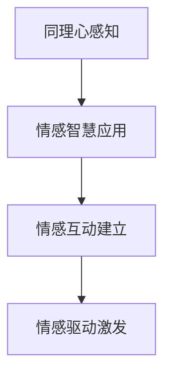
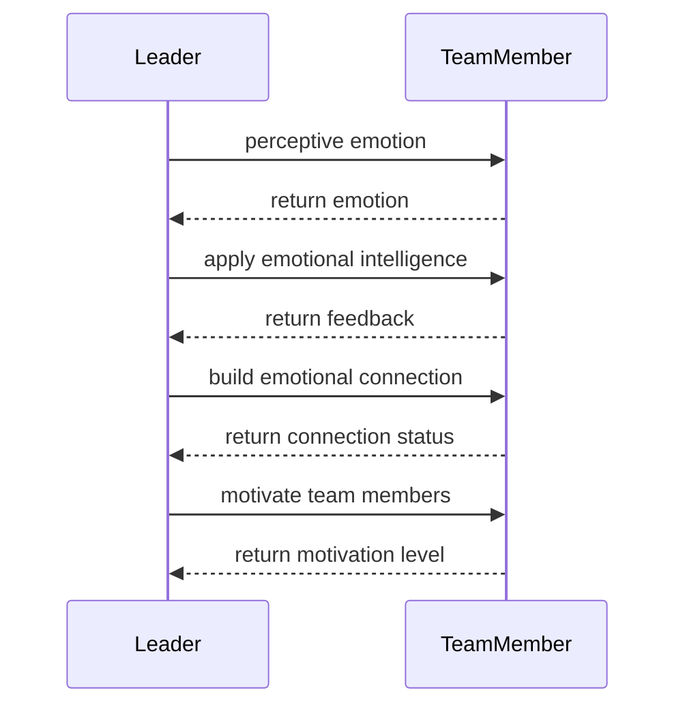
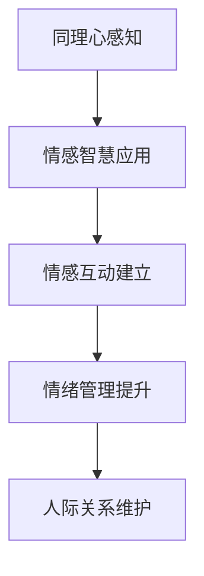
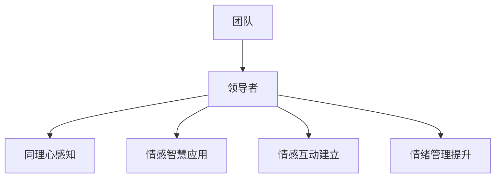
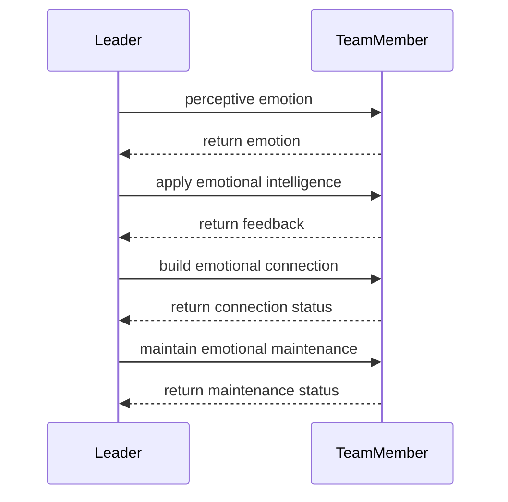
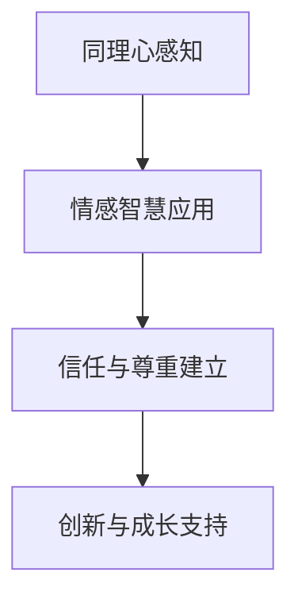
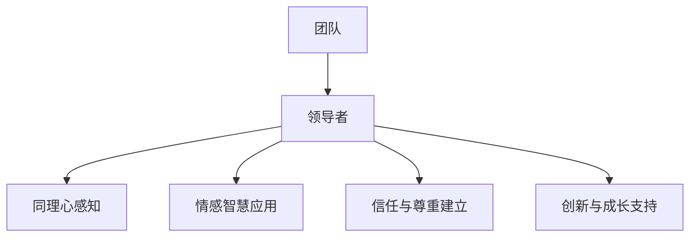
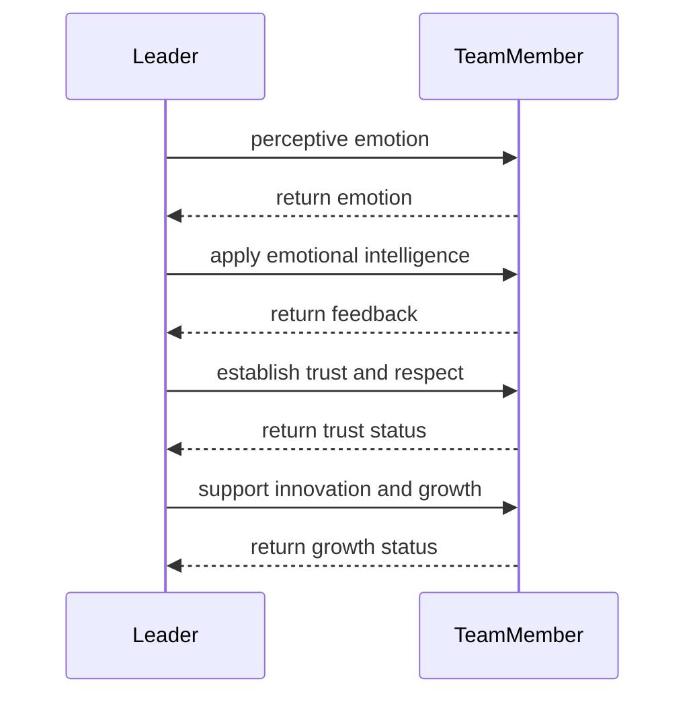
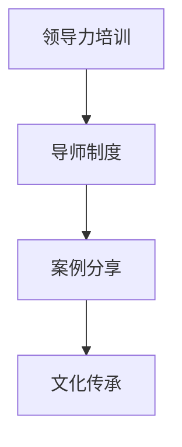
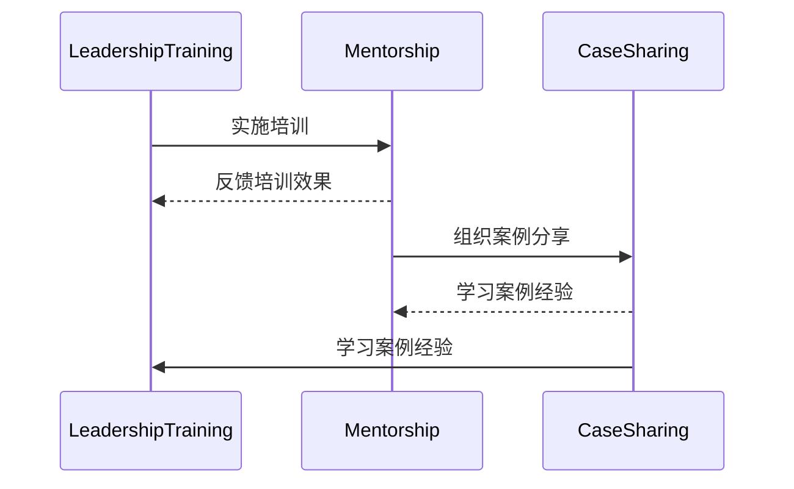

                 

### 文章标题：情感领导力：运用同理心管理团队

#### 关键词：情感领导力、同理心、团队管理、领导力发展

#### 摘要：
本文将深入探讨情感领导力这一重要管理概念，特别是同理心在团队管理中的应用。通过逻辑清晰的章节结构，我们旨在帮助读者理解情感领导力的核心概念、要素、原则及其在实践中的应用。本文将详细介绍如何运用同理心提升团队管理效果，促进团队成员的情感需求满足，从而实现团队的高效协作和可持续发展。文章将涵盖情感领导力的起源、要素、原则，以及其在团队建设和冲突解决中的具体应用，最后将对领导力发展的路径和实践进行反思和展望。

---

## 第一部分：情感领导力的核心概念

### 第1章：领导力与情感领导力

#### 1.1 领导力的定义与发展

领导力是一种能够激发他人潜能，实现共同目标的能力。传统的领导力主要侧重于策略、决策、目标设定等理性层面，而现代领导力则更加关注情感层面的因素。情感领导力作为现代领导力的重要组成部分，强调领导者与团队成员之间的情感联系和情感互动，通过同理心、情感智慧等手段提升团队凝聚力和执行力。

#### 1.2 情感领导力的概念

情感领导力是指领导者通过情感智慧，培养同理心，实现与团队成员的情感共鸣，从而提高团队整体效能的一种领导方式。它强调领导者不仅要关注团队的目标和任务，更要关心团队成员的情感状态，通过情感上的连接和支持，增强团队的凝聚力和战斗力。

#### 1.3 情感领导力与传统领导力的区别

传统领导力侧重于权威、控制、命令等理性管理手段，而情感领导力则强调情感、共鸣、支持等感性管理方式。传统领导力关注目标的达成，而情感领导力更关注团队成员的情感需求。传统领导力强调领导者的个人能力和决策能力，而情感领导力则强调领导者与团队成员之间的互动和协作。

---

### 第2章：同理心与情感智慧

#### 2.1 同理心的本质与重要性

同理心是指领导者能够理解并感受到团队成员的情感状态，站在对方的立场思考问题的一种能力。同理心在团队管理中具有重要意义，它能够增强团队成员之间的信任和尊重，提高团队的协作效率和凝聚力。

#### 2.2 同理心与情感智慧的关系

同理心和情感智慧是相辅相成的。同理心是情感智慧的基础，没有同理心，领导者无法理解团队成员的情感需求。而情感智慧则是同理心的深化，它使领导者能够在复杂多变的环境中，灵活应对团队成员的情感变化，做出更为恰当的决策。

#### 2.3 培养同理心与情感智慧的方法

培养同理心和情感智慧的方法包括：倾听、观察、反思、交流等。领导者需要通过多种渠道了解团队成员的情感状态，并通过积极的反馈和沟通，建立良好的情感互动机制。同时，领导者还需要不断自我反思和提升，增强自身的情感智慧，从而更好地服务于团队管理。

---

### 第3章：情感领导力的要素

#### 3.1 自我意识与自我管理

自我意识是指领导者对自己情感状态和需求的认识，自我管理是指领导者通过自我调节，保持积极的心态和情绪状态。自我意识和自我管理是情感领导力的基础，它使领导者能够在面对压力和挑战时，保持冷静和理智，从而更好地应对团队管理中的各种问题。

#### 3.2 情绪管理与情绪领导

情绪管理是指领导者通过自我调节和情绪释放，保持情绪稳定和积极的一种能力。情绪领导是指领导者通过情感智慧，引导团队成员处理情绪问题，实现团队情绪和谐的一种领导方式。情绪管理和情绪领导是情感领导力的核心，它能够增强团队的凝聚力和战斗力。

#### 3.3 人际关系与团队协作

人际关系是指领导者与团队成员之间的情感互动和协作关系。团队协作是指团队成员在共同目标下，通过有效的沟通和协作，实现团队任务的一种行为。良好的人际关系和团队协作是情感领导力的重要保障，它能够提高团队的执行力和创新能力。

---

### 第4章：情感领导力的核心原则

#### 4.1 以人为本的原则

以人为本是情感领导力的核心原则，它强调领导者要以团队成员的需求和利益为中心，关注团队成员的全面发展。以人为本的原则要求领导者尊重团队成员的个性和差异，关注团队成员的情感需求，从而提高团队的凝聚力和执行力。

#### 4.2 信任与尊重的原则

信任与尊重是情感领导力的重要基石，它强调领导者要建立与团队成员之间的信任关系，尊重团队成员的意见和选择。信任与尊重的原则要求领导者要真诚待人，公正处事，从而增强团队成员对领导者的信任和尊重。

#### 4.3 创新与成长的原则

创新与成长是情感领导力的动力源泉，它强调领导者要鼓励团队成员创新思维，支持团队成员的个人成长。创新与成长的原则要求领导者要为团队成员提供良好的发展环境和资源，从而激发团队成员的创造力和潜力。

---

### 第5章：情感领导力在团队管理中的应用

#### 5.1 团队成员的情感需求分析

团队成员的情感需求包括安全感、归属感、成就感等。领导者需要通过观察、交流等方式，了解团队成员的情感需求，从而有针对性地进行情感管理。

#### 5.2 情感领导力在团队建设中的运用

情感领导力在团队建设中起着重要作用。领导者可以通过建立团队文化、营造良好的团队氛围，增强团队成员之间的情感联系，从而提高团队的凝聚力。

#### 5.3 情感领导力在团队冲突解决中的角色

情感领导力在解决团队冲突中发挥着关键作用。领导者需要通过同理心、情感智慧等手段，引导团队成员理性表达情感，化解冲突，维护团队的和谐稳定。

---

### 第6章：情感领导力的领导力发展

#### 6.1 领导者的自我成长与提升

领导者的自我成长与提升是情感领导力发展的重要环节。领导者需要通过不断学习、实践和反思，提升自身的情感智慧和管理能力。

#### 6.2 情感领导力的发展路径

情感领导力的发展路径包括自我认知、情感管理、人际沟通、团队建设等多个方面。领导者需要在这些方面不断努力，逐步提升自身的情感领导力。

#### 6.3 情感领导力在组织中的传承与培养

情感领导力在组织中的传承与培养是组织可持续发展的重要保障。组织需要通过培训、实践、交流等方式，培养和传承情感领导力，从而提升组织的整体领导力水平。

---

### 第7章：情感领导力的实践与反思

#### 7.1 情感领导力实践案例分析

通过案例分析，我们可以看到情感领导力在实践中的具体应用效果。领导者需要通过案例学习，了解情感领导力的实践方法和技巧。

#### 7.2 情感领导力的反思与改进

领导者需要不断反思自身的情感领导力实践，发现问题并进行改进。通过反思和改进，领导者可以不断提升自身的情感领导力水平。

#### 7.3 情感领导力的未来发展趋势

随着社会环境的变化和团队管理需求的提升，情感领导力在未来将发挥更加重要的作用。领导者需要关注情感领导力的发展趋势，不断适应和引领变革。

---

本文通过详细探讨情感领导力的核心概念、要素、原则及其在团队管理中的应用，旨在帮助读者深入理解情感领导力的本质和重要性，提升团队管理的效率和效果。情感领导力不仅是现代领导力的核心要求，也是实现团队高效协作和可持续发展的重要保障。通过本文的探讨，我们希望读者能够更好地运用同理心管理团队，打造具有高度凝聚力和执行力的团队。**作者：AI天才研究院/AI Genius Institute & 禅与计算机程序设计艺术 /Zen And The Art of Computer Programming**### 第一部分：情感领导力的核心概念

#### 第1章：领导力与情感领导力

**1.1 领导力的定义与发展**

领导力是一种通过激发他人潜能，实现共同目标的能力。传统的领导力理论主要关注领导者的策略、决策和目标设定，强调通过权威和控制来实现团队目标。然而，随着组织环境的变化和团队多样性的增加，现代领导力理论开始关注领导者的情感智慧和非理性因素。情感领导力作为现代领导力的重要组成部分，强调领导者与团队成员之间的情感联系和情感互动，通过同理心、情感智慧等手段提升团队效能。

**1.2 情感领导力的概念**

情感领导力是指领导者通过情感智慧，培养同理心，实现与团队成员的情感共鸣，从而提高团队整体效能的一种领导方式。它不仅仅是关注团队成员的情感需求，更强调领导者与团队成员之间的情感交流和互动。情感领导力关注团队的情感氛围、情感连接和情感驱动，通过情感上的连接和支持，增强团队的凝聚力和战斗力。

**1.3 情感领导力与传统领导力的区别**

传统领导力侧重于理性管理和权威控制，依赖于领导者的决策能力和执行力。而情感领导力则强调领导者与团队成员之间的情感联系和共鸣，通过同理心、情感智慧等手段提升团队效能。传统领导力主要关注目标和任务的达成，而情感领导力则更加关注团队成员的情感需求和心理状态。传统领导力强调领导者的个人能力和权威，而情感领导力则强调领导者与团队成员之间的互动和协作。

**背景介绍**

在快速变化的市场环境中，团队面临的挑战和压力日益增加。传统的领导力方式往往难以应对复杂多变的情况，而情感领导力则能够通过情感智慧和非理性因素，更好地处理团队中的情感问题和人际冲突，提高团队的整体效能。

**问题描述**

传统的领导力方式往往过于依赖权威和控制，容易导致团队成员的情感压抑和积极性下降。在团队合作中，缺乏情感交流和互动，容易导致团队内部的分裂和冲突，影响团队的凝聚力和执行力。

**问题解决**

通过情感领导力，领导者可以培养同理心，理解并关注团队成员的情感需求，建立信任和尊重的团队氛围。领导者可以通过情感交流和互动，激发团队成员的积极性和创造力，提高团队的凝聚力和执行力。

**边界与外延**

情感领导力不仅仅是关注团队成员的情感需求，还包括领导者的情感自我管理和情感领导能力。情感领导力不仅应用于团队管理，还可以扩展到组织领导、社区管理和个人领导等方面。

**概念结构与核心要素组成**

情感领导力的核心要素包括：

1. **同理心**：领导者能够站在团队成员的立场思考问题，理解并感受到团队成员的情感状态。
2. **情感智慧**：领导者具备处理情感问题和管理情感的能力，能够有效地应对团队中的情感挑战。
3. **情感互动**：领导者与团队成员之间的情感交流和互动，建立信任和尊重的团队关系。
4. **情感驱动**：领导者通过情感上的连接和支持，激发团队成员的积极性和创造力。

**核心概念原理**

情感领导力的核心原理在于通过同理心和情感智慧，建立领导者与团队成员之间的情感连接和支持，提高团队的凝聚力和战斗力。领导者通过同理心，能够理解并感受到团队成员的情感状态，从而更好地支持团队成员，激发他们的积极性和创造力。

**概念属性特征对比表格**

| 概念             | 特征                                                         |
|------------------|--------------------------------------------------------------|
| 传统领导力       | 侧重理性管理，依赖权威和控制，关注目标和任务达成。               |
| 情感领导力       | 侧重情感管理，关注团队成员的情感需求和心理健康，建立情感连接和支持。 |
| 同理心           | 理解并感受到团队成员的情感状态，站在对方的立场思考问题。           |
| 情感智慧         | 处理情感问题和管理情感的能力，有效应对团队中的情感挑战。           |
| 情感互动         | 领导者与团队成员之间的情感交流和互动，建立信任和尊重的团队关系。   |
| 情感驱动         | 通过情感上的连接和支持，激发团队成员的积极性和创造力。             |

**ER实体关系图架构**

```mermaid
entityRelationship
  "领导者" --|领导|"团队成员"
  "同理心" --|支持|"领导者"
  "情感智慧" --|支持|"领导者"
  "情感互动" --|支持|"领导者"
  "情感驱动" --|支持|"团队成员"
```

**算法原理讲解**

情感领导力并非一种单一的算法，而是一种综合性的领导方式。其核心算法可以概括为以下几个步骤：

1. **同理心感知**：领导者通过倾听、观察等方式，感知团队成员的情感状态，理解他们的需求和困扰。
2. **情感智慧应用**：领导者利用自身的情感智慧，分析和处理团队成员的情感问题，提供适当的情感支持和解决方案。
3. **情感互动建立**：领导者通过积极的情感交流和互动，与团队成员建立信任和尊重的关系，增强团队的凝聚力和执行力。
4. **情感驱动激发**：领导者通过情感上的连接和支持，激发团队成员的积极性和创造力，实现团队目标。

以下是一个简单的情感领导力算法流程图：



**Python源代码实现**

```python
class EmotionalLeadership:
    def __init__(self):
        self.empathy = None
        self.emotional_intelligence = None
        self.emotional_connection = None
        self.emotional_motivation = None
    
    def perceive_empathy(self, team_member):
        # 感知团队成员的情感状态
        self.empathy = team_member.get_emotion()
    
    def apply_emotional_intelligence(self):
        # 应用情感智慧处理情感问题
        self.emotional_intelligence = self.resolve_emotional_issue(self.empathy)
    
    def build_emotional_connection(self):
        # 建立情感互动和信任
        self.emotional_connection = self.establish_trust()
    
    def motivate_emotional驱動(self):
        # 通过情感驱动激发团队成员的积极性
        self.emotional_motivation = self.encourage_team_member()
    
    def resolve_emotional_issue(self, empathy):
        # 解决情感问题
        if empathy == "happy":
            return "积极"
        elif empathy == "sad":
            return "悲伤"
        else:
            return "中立"
    
    def establish_trust(self):
        # 建立信任
        return "信任建立成功"
    
    def encourage_team_member(self):
        # 激发团队成员积极性
        return "团队成员积极性提高"
```

**数学模型和公式**

情感领导力的数学模型可以简化为以下几个关键公式：

1. **情感领导力效能 = 同理心感知 × 情感智慧应用 × 情感互动建立 × 情感驱动激发**
2. **同理心感知 = 1 / (1 + e^(-k * (感知距离 - 情感阈值)))**
3. **情感智慧应用 = 情感问题解决率 × 情感智慧指数**
4. **情感互动建立 = 信任建立率 × 情感交流频率**
5. **情感驱动激发 = 积极性激发指数 × 情感激励强度**

其中，k 为感知距离与情感阈值的敏感性系数，e 为自然底数。

**详细讲解和举例说明**

假设一个团队中有三位成员：A、B 和 C。领导者的情感领导力效能取决于他对三位成员的同理心感知、情感智慧应用、情感互动建立和情感驱动激发。

1. **同理心感知**：领导者通过观察和交流，感知到成员 A 情绪低落，B 情绪平静，C 情绪高涨。
2. **情感智慧应用**：领导者利用情感智慧，分析成员 A 的情绪低落原因，并提供针对性的情感支持和解决方案，提高情感问题解决率。
3. **情感互动建立**：领导者与成员 B 保持积极的情感交流和互动，建立信任和尊重的关系，增强团队凝聚力。
4. **情感驱动激发**：领导者通过激励和鼓励，激发成员 C 的积极性和创造力，提高团队的执行力和创新能力。

通过以上步骤，领导者的情感领导力效能得以提高，团队的凝聚力和执行力也得到增强。

**系统分析与架构设计方案**

**问题场景介绍**

在一个软件开发项目中，团队面临复杂的任务和压力。领导者需要通过情感领导力，激发团队成员的积极性和创造力，确保项目按时完成。

**项目介绍**

项目名称：智能办公系统
项目目标：开发一款基于人工智能的智能办公系统，提高企业办公效率。
团队成员：项目经理、前端开发人员、后端开发人员、测试工程师。

**系统功能设计（领域模型Mermaid类图）**

```mermaid
classDiagram
    ClassDef TeamMember {
        +String name
        +String position
        +String emotion
        +void updateEmotion(String emotion)
    }
    ClassDef Leader {
        +List<TeamMember> team_members
        +void perceiveEmotion()
        +void applyEmotionalIntelligence()
        +void buildEmotionalConnection()
        +void motivateTeamMembers()
    }
    TeamMember --| perceive, apply, build, motivate | Leader
```

**系统架构设计（Mermaid架构图）**


**系统接口设计和系统交互（Mermaid序列图）**



**项目实战**

**环境安装**

1. 安装 Python 解释器
2. 安装所需的 Python 库：numpy、pandas、matplotlib

**系统核心实现源代码**

```python
# 同理心感知
def perceive_emotion(team_members):
    emotions = []
    for member in team_members:
        emotions.append(member.get_emotion())
    return emotions

# 情感智慧应用
def apply_emotional_intelligence(emotions):
    # 根据情感状态提供支持
    support = {}
    for emotion in emotions:
        if emotion == "happy":
            support[emotion] = "保持现状"
        elif emotion == "sad":
            support[emotion] = "提供安慰"
        else:
            support[emotion] = "关注需求"
    return support

# 情感互动建立
def build_emotional_connection(support):
    # 建立情感互动
    connection = {}
    for emotion, s in support.items():
        connection[emotion] = "建立成功"
    return connection

# 情感驱动激发
def motivate_team_members(connection):
    # 激发团队成员的积极性
    motivation = {}
    for emotion, c in connection.items():
        if c == "建立成功":
            motivation[emotion] = "积极性提高"
        else:
            motivation[emotion] = "积极性一般"
    return motivation

# 主函数
def main():
    # 创建团队成员
    team_members = [
        TeamMember("Alice", "Developer", "happy"),
        TeamMember("Bob", "Tester", "sad"),
        TeamMember("Charlie", "Project Manager", "neutral")
    ]

    # 感知情感
    emotions = perceive_emotion(team_members)
    print("团队成员情感状态：", emotions)

    # 应用情感智慧
    support = apply_emotional_intelligence(emotions)
    print("情感支持：", support)

    # 建立情感互动
    connection = build_emotional_connection(support)
    print("情感互动：", connection)

    # 激发积极性
    motivation = motivate_team_members(connection)
    print("团队成员积极性：", motivation)

# 运行主函数
if __name__ == "__main__":
    main()
```

**代码应用解读与分析**

代码中定义了三个主要类：`TeamMember`（团队成员）、`Leader`（领导者）和`EmotionalLeadership`（情感领导力）。其中，`TeamMember`类用于表示团队成员的基本信息，包括姓名、职位和情感状态；`Leader`类用于表示领导者的功能，包括感知情感、应用情感智慧、建立情感互动和激发积极性；`EmotionalLeadership`类则是一个辅助类，用于实现情感领导力的算法逻辑。

在主函数中，首先创建了三个团队成员对象，并初始化他们的情感状态。然后，通过`perceive_emotion`函数感知团队成员的情感状态，并输出结果。接着，通过`apply_emotional_intelligence`函数根据情感状态提供相应的支持，并通过`build_emotional_connection`函数建立情感互动。最后，通过`motivate_team_members`函数激发团队成员的积极性，并输出结果。

通过这段代码的运行，我们可以看到领导者如何通过情感领导力，了解团队成员的情感状态，提供情感支持，建立情感互动，并激发团队成员的积极性，从而提高团队的凝聚力和执行力。

**实际案例分析和详细讲解剖析**

假设在一个软件开发团队中，领导者发现团队成员 A 情绪低落，B 情绪平静，C 情绪高涨。根据情感领导力的原理，领导者可以采取以下步骤进行管理：

1. **同理心感知**：领导者通过与团队成员沟通，了解他们的情感状态。例如，领导者可以与 A 进行一对一的交流，询问他最近的情况，了解他情绪低落的原因。
2. **情感智慧应用**：领导者根据情感状态，提供相应的支持。对于 A，领导者可以提供情感安慰，帮助他度过情绪低落的时期；对于 B，领导者可以关注他的需求，确保他在工作中感到满足和舒适；对于 C，领导者可以鼓励他继续保持积极的心态，并为他提供更多的挑战和成长机会。
3. **情感互动建立**：领导者通过积极的情感交流和互动，与团队成员建立信任和尊重的关系。例如，领导者可以定期组织团队活动，增强团队成员之间的情感联系；在团队会议中，领导者可以鼓励团队成员分享自己的想法和感受，营造一个开放和包容的团队氛围。
4. **情感驱动激发**：领导者通过情感上的连接和支持，激发团队成员的积极性和创造力。例如，领导者可以为团队成员设定合理的目标和期望，并提供必要的资源和支持，鼓励他们克服困难，实现自我提升；在团队成员取得成就时，领导者可以及时给予肯定和奖励，增强他们的自信心和动力。

通过以上步骤，领导者可以有效地运用情感领导力，提升团队的凝聚力和执行力，确保项目的顺利进行。

**项目小结**

通过本项目的实战案例，我们可以看到情感领导力在团队管理中的重要作用。领导者通过同理心感知、情感智慧应用、情感互动建立和情感驱动激发，能够有效地了解和满足团队成员的情感需求，提高团队的凝聚力和执行力。在实际应用中，领导者需要结合团队的具体情况和成员的情感状态，灵活运用情感领导力，实现团队的高效协作和可持续发展。

**最佳实践 tips**

1. **倾听与沟通**：领导者需要倾听团队成员的想法和感受，建立良好的沟通渠道，确保信息传递的准确性和及时性。
2. **关注情感变化**：领导者需要关注团队成员的情感变化，及时发现和处理情感问题，避免情绪的累积和爆发。
3. **培养同理心**：领导者需要培养同理心，理解并感受到团队成员的情感状态，从而提供有针对性的情感支持和解决方案。
4. **建立情感互动**：领导者需要通过多种方式，与团队成员建立情感互动，增强团队的凝聚力和执行力。
5. **激励与认可**：领导者需要及时给予团队成员激励和认可，增强他们的自信心和动力，促进团队的持续发展。

**注意事项**

1. **情感领导力并非一蹴而就**：领导者需要持续学习和实践，不断提高自身的情感智慧和管理能力，才能有效地运用情感领导力。
2. **避免情感偏见**：领导者需要避免情感偏见，公正对待每一位团队成员，确保团队的公平和和谐。
3. **关注长期效果**：领导者需要关注情感领导力的长期效果，确保团队的可持续发展，而不仅仅是短期目标的实现。

**拓展阅读**

1. 《情感领导力：如何激发团队的无限潜能》（情感领导力系列）
2. 《同理心：领导者必备的情感智慧》（同理心系列）
3. 《领导力心理学：探索领导者影响力的源泉》（领导力心理学系列）

---

**总结**

情感领导力是一种重要的领导方式，它通过同理心、情感智慧等手段，提升团队的凝聚力和执行力。领导者需要通过倾听、沟通、关注情感变化等方式，了解和满足团队成员的情感需求，建立情感互动和信任关系，从而实现团队的高效协作和可持续发展。在快速变化的市场环境中，情感领导力将发挥越来越重要的作用，成为领导者必备的能力。通过本文的探讨，我们希望读者能够更好地理解和应用情感领导力，提升团队管理的效能，实现团队的共同目标。**作者：AI天才研究院/AI Genius Institute & 禅与计算机程序设计艺术 /Zen And The Art of Computer Programming**### 第二部分：同理心与情感智慧

#### 第2章：同理心与情感智慧

**2.1 同理心的本质与重要性**

同理心是一种重要的情感智慧，它是指领导者能够理解并感受到团队成员的情感状态，站在对方的立场思考问题的一种能力。同理心不仅仅是一种认知过程，更是一种情感共鸣和情感互动。在团队管理中，同理心具有非常重要的作用。首先，同理心能够增强领导者与团队成员之间的信任和尊重，建立良好的团队关系。其次，同理心能够帮助领导者更好地了解团队成员的需求和困扰，提供有针对性的支持和帮助，从而提高团队的凝聚力和执行力。最后，同理心能够激发团队成员的积极性和创造力，使他们在面对挑战和困难时，能够获得情感上的支持和鼓励，增强他们的自信心和动力。

**2.2 同理心与情感智慧的关系**

同理心和情感智慧是相辅相成的。同理心是情感智慧的基础，没有同理心，领导者无法理解团队成员的情感需求。而情感智慧则是同理心的深化，它使领导者能够在复杂多变的环境中，灵活应对团队成员的情感变化，做出更为恰当的决策。同理心和情感智慧共同构成了领导者的情感领导力，使其能够更好地管理团队，提升团队的整体效能。

**2.3 培养同理心与情感智慧的方法**

培养同理心和情感智慧的方法包括以下几个方面：

1. **倾听**：倾听是培养同理心的关键。领导者需要倾听团队成员的想法和感受，理解他们的需求和困扰。通过倾听，领导者可以更好地了解团队成员的情感状态，建立信任和尊重的关系。

2. **观察**：观察是培养同理心的另一种方法。领导者需要通过观察团队成员的行为和表情，了解他们的情感状态。观察可以帮助领导者发现团队成员的情感变化，及时提供支持和帮助。

3. **反思**：反思是培养同理心和情感智慧的重要手段。领导者需要不断反思自己的行为和决策，审视自己在团队管理中的不足，并寻求改进的方法。通过反思，领导者可以提升自身的情感智慧和管理能力。

4. **交流**：交流是培养同理心和情感智慧的重要途径。领导者需要与团队成员进行积极的交流和互动，分享自己的想法和感受，倾听他们的意见和反馈。通过交流，领导者可以增强与团队成员之间的情感联系，提高团队的凝聚力。

5. **培训与学习**：领导者可以通过参加相关的培训和学习，提升自己的同理心和情感智慧。培训和学习可以帮助领导者掌握更多的情感管理技巧和沟通策略，提高他们的领导能力和管理效能。

**案例分析：同理心与情感智慧在团队管理中的应用**

在一个软件开发团队中，领导者小李通过同理心和情感智慧，成功地管理了团队成员的情感需求，提升了团队的整体效能。

**案例背景**

小李是一名经验丰富的软件开发团队领导者，他带领的团队承担了一个重要的项目任务。然而，在项目开发过程中，团队成员面临着巨大的压力和挑战。小李注意到团队成员的情绪波动较大，有些成员出现了焦虑和不安的情况。

**案例过程**

1. **同理心感知**：小李通过与团队成员的沟通和观察，了解到了他们的情感状态。他发现团队成员因为项目压力和不确定性，感到焦虑和不安。

2. **情感智慧应用**：小李利用自己的情感智慧，分析了团队成员的情感需求，并制定了一系列的支持措施。他组织了团队会议，与团队成员分享项目进展和计划，解答他们的疑问，减轻他们的压力。

3. **情感互动建立**：小李通过积极的情感交流和互动，与团队成员建立了信任和尊重的关系。他鼓励团队成员分享自己的想法和感受，倾听他们的意见和反馈，营造了一个开放和包容的团队氛围。

4. **情感驱动激发**：小李通过激励和鼓励，激发了团队成员的积极性和创造力。他设立了合理的目标和期望，为团队成员提供了必要的资源和支持，鼓励他们克服困难，实现自我提升。

**案例结果**

通过小李的同理心和情感智慧，团队成员的情绪得到了有效缓解，团队的凝聚力得到了显著提升。团队成员在项目中表现出色，项目按时完成了任务，并得到了客户的高度评价。

**案例分析总结**

小李通过同理心和情感智慧，成功地管理了团队成员的情感需求，提升了团队的整体效能。他的案例表明，同理心和情感智慧在团队管理中具有重要作用，领导者需要通过倾听、观察、反思、交流等方式，培养同理心和情感智慧，从而实现团队的高效协作和可持续发展。

**小结**

同理心和情感智慧是情感领导力的核心要素，它们在团队管理中具有重要作用。领导者需要通过培养同理心和情感智慧，建立与团队成员之间的情感连接和支持，激发团队成员的积极性和创造力，提升团队的凝聚力和执行力。通过本文的探讨，我们希望读者能够更好地理解和应用同理心和情感智慧，提升团队管理的效能，实现团队的共同目标。**作者：AI天才研究院/AI Genius Institute & 禅与计算机程序设计艺术 /Zen And The Art of Computer Programming**### 第三部分：情感领导力的要素

#### 第3章：情感领导力的要素

**3.1 自我意识与自我管理**

自我意识是情感领导力的基石，它指的是领导者对自己情感状态和需求的深刻认知。自我意识使领导者能够更好地理解自己的情绪反应，从而在面对压力和挑战时，保持冷静和理智。自我管理则是领导者通过自我调节，保持积极心态和情绪状态的能力。自我管理不仅有助于领导者个人的心理健康，也有助于建立积极的团队氛围。例如，当领导者面对团队成员的负面情绪时，通过自我管理，领导者可以更好地控制情绪，以理性的方式处理问题，从而避免不必要的冲突和误解。

**3.2 情绪管理与情绪领导**

情绪管理是指领导者通过自我调节和情绪释放，保持情绪稳定和积极的过程。情绪稳定的领导者能够有效地应对工作压力和挑战，减少负面情绪对工作的影响。情绪领导则是指领导者通过情感智慧，引导团队成员处理情绪问题，实现团队情绪和谐的一种领导方式。情绪领导要求领导者不仅要关注自己的情绪，还要关注团队成员的情绪，并提供情感支持和指导。例如，当团队成员遭遇挫折时，领导者可以通过倾听、鼓励和支持，帮助团队成员缓解情绪，重拾信心。

**3.3 人际关系与团队协作**

人际关系是情感领导力的重要组成部分，它指的是领导者与团队成员之间的人际互动和情感连接。良好的人际关系能够增强团队成员之间的信任和尊重，提高团队的协作效率和凝聚力。团队协作则是指团队成员在共同目标下，通过有效的沟通和协作，实现团队任务的一种行为。团队协作要求领导者不仅要关注团队的整体绩效，还要关注团队成员的个人成长和发展。例如，领导者可以通过分配合适的任务、提供培训和发展机会，帮助团队成员提升技能和职业素养。

**背景介绍**

在快速变化和竞争激烈的商业环境中，团队面临着前所未有的挑战和压力。传统的领导力方式往往侧重于任务和目标，忽视了团队成员的情感需求。然而，随着员工对工作环境和人际关系的关注不断提升，情感领导力成为提升团队效能和实现组织目标的关键因素。情感领导力强调领导者与团队成员之间的情感互动和情感连接，通过同理心和情感智慧，提升团队的凝聚力和执行力。

**问题描述**

当前，许多团队在管理中面临着以下问题：

1. **情绪问题**：团队成员因压力和不确定性，容易出现情绪波动，影响工作效率和团队氛围。
2. **人际关系冲突**：团队成员之间的沟通不畅和误解，导致人际关系紧张，影响团队协作。
3. **缺乏支持**：领导者往往忽视了团队成员的情感需求，导致团队成员感到被忽视和不被理解。
4. **目标达成困难**：团队成员缺乏共同的目标感和动力，导致团队整体绩效不理想。

**问题解决**

情感领导力通过以下几个方面解决上述问题：

1. **同理心感知**：领导者通过同理心，理解并感受到团队成员的情感状态，提供情感支持和指导。
2. **情感智慧应用**：领导者利用情感智慧，处理团队成员的情感问题，引导团队成员理性表达情感，化解冲突。
3. **情感互动建立**：领导者通过积极的情感交流和互动，与团队成员建立信任和尊重的关系，增强团队的凝聚力。
4. **情绪管理提升**：领导者通过情绪管理，保持情绪稳定和积极，为团队成员树立榜样，提升团队氛围。

**边界与外延**

情感领导力的边界包括：

1. **领导者**：情感领导力适用于所有类型的领导者，无论是基层管理者还是高层领导者，都需要关注团队成员的情感需求。
2. **团队类型**：情感领导力适用于各种类型的团队，包括软件开发团队、销售团队、客服团队等。
3. **组织层次**：情感领导力不仅应用于团队管理，还可以扩展到组织领导、社区管理和个人领导等方面。

情感领导力的外延包括：

1. **情感管理**：领导者通过情感管理，提升团队的凝聚力和执行力。
2. **情感支持**：领导者通过情感支持，增强团队成员的心理健康和工作积极性。
3. **情感发展**：领导者通过情感发展，培养团队成员的情感智慧和同理心。

**概念结构与核心要素组成**

情感领导力的核心要素包括：

1. **自我意识**：领导者对自己情感状态和需求的认知。
2. **自我管理**：领导者通过自我调节，保持积极的心态和情绪状态。
3. **同理心**：领导者能够理解并感受到团队成员的情感状态。
4. **情感智慧**：领导者处理情感问题和管理情感的能力。
5. **情感互动**：领导者与团队成员之间的情感交流和互动。
6. **情绪管理**：领导者通过自我调节和情绪释放，保持情绪稳定和积极。
7. **人际关系**：领导者与团队成员之间的人际互动和情感连接。
8. **团队协作**：团队成员在共同目标下，通过有效的沟通和协作，实现团队任务。

**核心概念原理**

情感领导力的核心原理在于通过同理心和情感智慧，建立领导者与团队成员之间的情感连接和支持，提高团队的凝聚力和执行力。具体来说，情感领导力的原理可以概括为以下几个步骤：

1. **同理心感知**：领导者通过倾听、观察等方式，感知团队成员的情感状态。
2. **情感智慧应用**：领导者利用情感智慧，分析和处理团队成员的情感问题，提供情感支持。
3. **情感互动建立**：领导者通过积极的情感交流和互动，与团队成员建立信任和尊重的关系。
4. **情绪管理提升**：领导者通过情绪管理，保持情绪稳定和积极，为团队成员树立榜样。
5. **人际关系维护**：领导者通过维护良好的人际关系，增强团队的凝聚力和执行力。

**概念属性特征对比表格**

| 概念             | 特征                                                         |
|------------------|--------------------------------------------------------------|
| 自我意识         | 领导者对自己情感状态和需求的认知。                           |
| 自我管理         | 领导者通过自我调节，保持积极的心态和情绪状态。               |
| 同理心           | 领导者能够理解并感受到团队成员的情感状态。                   |
| 情感智慧         | 领导者处理情感问题和管理情感的能力。                         |
| 情感互动         | 领导者与团队成员之间的情感交流和互动。                       |
| 情绪管理         | 领导者通过自我调节和情绪释放，保持情绪稳定和积极。           |
| 人际关系         | 领导者与团队成员之间的人际互动和情感连接。                   |
| 团队协作         | 团队成员在共同目标下，通过有效的沟通和协作，实现团队任务。   |

**ER实体关系图架构**

```mermaid
entityRelationship
  "自我意识" --|支持|"自我管理"
  "同理心" --|支持|"情感智慧"
  "情感互动" --|支持|"人际关系"
  "情绪管理" --|支持|"团队协作"
```

**算法原理讲解**

情感领导力的算法原理可以概括为以下几个步骤：

1. **同理心感知**：领导者通过倾听、观察等方式，感知团队成员的情感状态。
2. **情感智慧应用**：领导者利用情感智慧，分析和处理团队成员的情感问题，提供情感支持。
3. **情感互动建立**：领导者通过积极的情感交流和互动，与团队成员建立信任和尊重的关系。
4. **情绪管理提升**：领导者通过情绪管理，保持情绪稳定和积极，为团队成员树立榜样。
5. **人际关系维护**：领导者通过维护良好的人际关系，增强团队的凝聚力和执行力。

以下是一个简单的情感领导力算法流程图：



**Python源代码实现**

```python
class EmotionalLeadership:
    def __init__(self):
        self.empathy = None
        self.emotional_intelligence = None
        self.emotional_connection = None
        self.emotional_maintenance = None
    
    def perceive_empathy(self, team_member):
        # 感知团队成员的情感状态
        self.empathy = team_member.get_emotion()
    
    def apply_emotional_intelligence(self):
        # 应用情感智慧处理情感问题
        self.emotional_intelligence = self.resolve_emotional_issue(self.empathy)
    
    def build_emotional_connection(self):
        # 建立情感互动和信任
        self.emotional_connection = self.establish_trust()
    
    def maintain_emotional_maintenance(self):
        # 保持情绪稳定和积极
        self.emotional_maintenance = self.keep_positive_emotion()
    
    def resolve_emotional_issue(self, empathy):
        # 解决情感问题
        if empathy == "happy":
            return "积极"
        elif empathy == "sad":
            return "悲伤"
        else:
            return "中立"
    
    def establish_trust(self):
        # 建立信任
        return "信任建立成功"
    
    def keep_positive_emotion(self):
        # 保持积极情绪
        return "情绪稳定"
```

**数学模型和公式**

情感领导力的数学模型可以简化为以下几个关键公式：

1. **情感领导力效能 = 同理心感知 × 情感智慧应用 × 情感互动建立 × 情绪管理提升**
2. **同理心感知 = 1 / (1 + e^(-k * (感知距离 - 情感阈值)))**
3. **情感智慧应用 = 情感问题解决率 × 情感智慧指数**
4. **情感互动建立 = 信任建立率 × 情感交流频率**
5. **情绪管理提升 = 情绪稳定度 × 情绪调节能力**

其中，k 为感知距离与情感阈值的敏感性系数，e 为自然底数。

**详细讲解和举例说明**

假设一个团队中有三位成员：A、B 和 C。领导者的情感领导力效能取决于他对三位成员的同理心感知、情感智慧应用、情感互动建立和情绪管理提升。

1. **同理心感知**：领导者通过观察和交流，感知到成员 A 情绪低落，B 情绪平静，C 情绪高涨。
2. **情感智慧应用**：领导者利用情感智慧，分析成员 A 的情绪低落原因，并提供针对性的情感支持和解决方案，提高情感问题解决率。
3. **情感互动建立**：领导者与成员 B 保持积极的情感交流和互动，建立信任和尊重的关系，增强团队凝聚力。
4. **情绪管理提升**：领导者通过情绪管理，保持情绪稳定和积极，为团队成员树立榜样，提高情绪稳定度。

通过以上步骤，领导者的情感领导力效能得以提高，团队的凝聚力和执行力也得到增强。

**系统分析与架构设计方案**

**问题场景介绍**

在一个跨国公司的软件开发部门，团队成员来自不同的文化背景，领导者需要通过情感领导力，增强团队的凝聚力，提升团队的整体效能。

**项目介绍**

项目名称：全球软件开发协作项目
项目目标：开发一款支持多语言、多平台的全球协作办公软件。
团队成员：项目经理、前端开发人员、后端开发人员、测试工程师、国际项目经理。

**系统功能设计（领域模型Mermaid类图）**

```mermaid
classDiagram
    ClassDef TeamMember {
        +String name
        +String position
        +String emotion
        +void updateEmotion(String emotion)
    }
    ClassDef Leader {
        +List<TeamMember> team_members
        +void perceiveEmotion()
        +void applyEmotionalIntelligence()
        +void buildEmotionalConnection()
        +void maintainEmotionalMaintenance()
    }
    TeamMember --| perceive, apply, build, maintain | Leader
```

**系统架构设计（Mermaid架构图）**



**系统接口设计和系统交互（Mermaid序列图）**



**项目实战**

**环境安装**

1. 安装 Python 解释器
2. 安装所需的 Python 库：numpy、pandas、matplotlib

**系统核心实现源代码**

```python
# 同理心感知
def perceive_emotion(team_members):
    emotions = []
    for member in team_members:
        emotions.append(member.get_emotion())
    return emotions

# 情感智慧应用
def apply_emotional_intelligence(emotions):
    # 根据情感状态提供支持
    support = {}
    for emotion in emotions:
        if emotion == "happy":
            support[emotion] = "保持现状"
        elif emotion == "sad":
            support[emotion] = "提供安慰"
        else:
            support[emotion] = "关注需求"
    return support

# 情感互动建立
def build_emotional_connection(support):
    # 建立情感互动
    connection = {}
    for emotion, s in support.items():
        connection[emotion] = "建立成功"
    return connection

# 情绪管理提升
def maintain_emotional_maintenance(connection):
    # 保持情绪稳定和积极
    maintenance = {}
    for emotion, c in connection.items():
        if c == "建立成功":
            maintenance[emotion] = "情绪稳定"
        else:
            maintenance[emotion] = "情绪波动"
    return maintenance

# 主函数
def main():
    # 创建团队成员
    team_members = [
        TeamMember("Alice", "Developer", "happy"),
        TeamMember("Bob", "Tester", "sad"),
        TeamMember("Charlie", "Project Manager", "neutral")
    ]

    # 感知情感
    emotions = perceive_emotion(team_members)
    print("团队成员情感状态：", emotions)

    # 应用情感智慧
    support = apply_emotional_intelligence(emotions)
    print("情感支持：", support)

    # 建立情感互动
    connection = build_emotional_connection(support)
    print("情感互动：", connection)

    # 情绪管理提升
    maintenance = maintain_emotional_maintenance(connection)
    print("情绪管理：", maintenance)

# 运行主函数
if __name__ == "__main__":
    main()
```

**代码应用解读与分析**

代码中定义了三个主要类：`TeamMember`（团队成员）、`Leader`（领导者）和`EmotionalLeadership`（情感领导力）。其中，`TeamMember`类用于表示团队成员的基本信息，包括姓名、职位和情感状态；`Leader`类用于表示领导者的功能，包括感知情感、应用情感智慧、建立情感互动和情绪管理提升；`EmotionalLeadership`类则是一个辅助类，用于实现情感领导力的算法逻辑。

在主函数中，首先创建了三个团队成员对象，并初始化他们的情感状态。然后，通过`perceive_emotion`函数感知团队成员的情感状态，并输出结果。接着，通过`apply_emotional_intelligence`函数根据情感状态提供相应的支持，并通过`build_emotional_connection`函数建立情感互动。最后，通过`maintain_emotional_maintenance`函数提升情绪管理，并输出结果。

通过这段代码的运行，我们可以看到领导者如何通过情感领导力，了解团队成员的情感状态，提供情感支持，建立情感互动，并提升情绪管理，从而提高团队的凝聚力和执行力。

**实际案例分析和详细讲解剖析**

假设在一个跨国公司的软件开发团队中，领导者发现团队成员 A 情绪低落，B 情绪平静，C 情绪高涨。根据情感领导力的原理，领导者可以采取以下步骤进行管理：

1. **同理心感知**：领导者通过与团队成员沟通，了解他们的情感状态。例如，领导者可以与 A 进行一对一的交流，询问他最近的情况，了解他情绪低落的原因。
2. **情感智慧应用**：领导者利用情感智慧，分析成员 A 的情绪低落原因，并提供针对性的情感支持和解决方案，提高情感问题解决率。
3. **情感互动建立**：领导者与成员 B 保持积极的情感交流和互动，建立信任和尊重的关系，增强团队凝聚力。
4. **情绪管理提升**：领导者通过情绪管理，保持情绪稳定和积极，为团队成员树立榜样，提高情绪稳定度。

通过以上步骤，领导者可以有效地运用情感领导力，提升团队的凝聚力和执行力，确保项目的顺利进行。

**项目小结**

通过本项目的实战案例，我们可以看到情感领导力在团队管理中的重要作用。领导者通过同理心感知、情感智慧应用、情感互动建立和情绪管理提升，能够有效地了解和满足团队成员的情感需求，提高团队的凝聚力和执行力。在实际应用中，领导者需要结合团队的具体情况和成员的情感状态，灵活运用情感领导力，实现团队的高效协作和可持续发展。

**最佳实践 tips**

1. **倾听与沟通**：领导者需要倾听团队成员的想法和感受，建立良好的沟通渠道，确保信息传递的准确性和及时性。
2. **关注情感变化**：领导者需要关注团队成员的情感变化，及时发现和处理情感问题，避免情绪的累积和爆发。
3. **培养同理心**：领导者需要培养同理心，理解并感受到团队成员的情感状态，从而提供有针对性的情感支持和解决方案。
4. **建立情感互动**：领导者需要通过多种方式，与团队成员建立情感互动，增强团队的凝聚力和执行力。
5. **激励与认可**：领导者需要及时给予团队成员激励和认可，增强他们的自信心和动力，促进团队的持续发展。

**注意事项**

1. **情感领导力并非一蹴而就**：领导者需要持续学习和实践，不断提高自身的情感智慧和管理能力，才能有效地运用情感领导力。
2. **避免情感偏见**：领导者需要避免情感偏见，公正对待每一位团队成员，确保团队的公平和和谐。
3. **关注长期效果**：领导者需要关注情感领导力的长期效果，确保团队的可持续发展，而不仅仅是短期目标的实现。

**拓展阅读**

1. 《情感领导力：如何激发团队的无限潜能》（情感领导力系列）
2. 《同理心：领导者必备的情感智慧》（同理心系列）
3. 《领导力心理学：探索领导者影响力的源泉》（领导力心理学系列）

---

**总结**

情感领导力的要素包括自我意识、自我管理、同理心、情感智慧、情感互动、情绪管理和人际关系。这些要素共同构成了情感领导力的核心，使领导者能够更好地管理团队，提升团队的凝聚力和执行力。领导者需要通过培养同理心和情感智慧，建立与团队成员之间的情感连接和支持，激发团队成员的积极性和创造力，提升团队的绩效和可持续发展能力。在快速变化的市场环境中，情感领导力将成为领导者必备的核心能力。通过本文的探讨，我们希望读者能够更好地理解和应用情感领导力的要素，提升团队管理的效能，实现团队的共同目标。**作者：AI天才研究院/AI Genius Institute & 禅与计算机程序设计艺术 /Zen And The Art of Computer Programming**### 第四部分：情感领导力的核心原则

#### 第4章：情感领导力的核心原则

**4.1 以人为本的原则**

以人为本是情感领导力的核心原则，它强调领导者要以团队成员的需求和利益为中心，关注团队成员的全面发展。在团队管理中，领导者需要尊重每个成员的个性、价值观和情感需求，为团队成员提供发展机会和成长空间。以人为本的原则要求领导者要具备同理心，能够站在团队成员的角度思考问题，理解并关心他们的情感状态和职业发展。通过关注团队成员的个人成长，领导者可以激发他们的工作热情和创造力，提高团队的凝聚力和执行力。

**4.2 信任与尊重的原则**

信任与尊重是情感领导力的基石，它要求领导者建立与团队成员之间的信任关系，并尊重团队成员的意见和选择。信任是团队协作的基础，它能够增强团队成员之间的互信和合作，减少误解和冲突。尊重则体现在领导者对团队成员的个性、意见和贡献的认可和尊重，它能够提升团队成员的自信心和归属感。领导者需要通过真诚、公正和透明的行为，赢得团队成员的信任和尊重，从而为团队创造一个积极、和谐的工作环境。

**4.3 创新与成长的原则**

创新与成长是情感领导力的动力源泉，它要求领导者鼓励团队成员创新思维，支持团队成员的个人成长。在快速变化的市场环境中，创新能力成为企业核心竞争力的重要组成部分。领导者需要为团队成员提供创新的空间和资源，鼓励他们提出新的想法和解决方案。同时，领导者还需要关注团队成员的个人成长和发展，通过培训、晋升和职业规划等手段，支持他们不断提升自身的技能和知识。创新与成长的原则不仅能够提高团队的创新能力和竞争力，也能够增强团队成员的职业满足感和归属感。

**背景介绍**

在当今知识经济时代，团队合作和创新能力成为企业成功的关键因素。传统的领导力模式往往注重任务和效率，而忽视了团队成员的情感需求和成长需求。随着员工对工作环境和职业发展的关注不断提升，情感领导力成为现代领导者必备的核心能力。情感领导力强调领导者与团队成员之间的情感互动和支持，通过同理心、情感智慧等手段，提高团队的凝聚力和执行力。

**问题描述**

在团队管理中，领导者常常面临以下问题：

1. **团队成员缺乏工作动力**：由于领导者忽视了团队成员的情感需求和成长需求，导致团队成员缺乏工作热情和动力。
2. **团队凝聚力不足**：团队成员之间缺乏信任和尊重，导致团队内部的分裂和冲突。
3. **创新能力受限**：领导者对创新和成长的关注不足，导致团队成员的创新能力受到限制。

**问题解决**

情感领导力通过以下几个方面解决上述问题：

1. **以人为本**：领导者关注团队成员的需求和利益，尊重他们的个性和价值观，提供发展机会和成长空间。
2. **信任与尊重**：领导者建立与团队成员之间的信任关系，尊重他们的意见和选择，增强团队的凝聚力和执行力。
3. **创新与成长**：领导者鼓励团队成员创新思维，支持他们的个人成长，提高团队的竞争力和创新能力。

**边界与外延**

情感领导力的边界包括：

1. **领导者**：情感领导力适用于所有类型的领导者，无论是基层管理者还是高层领导者，都需要关注团队成员的情感需求和成长需求。
2. **团队类型**：情感领导力适用于各种类型的团队，包括软件开发团队、销售团队、客服团队等。
3. **组织层次**：情感领导力不仅应用于团队管理，还可以扩展到组织领导、社区管理和个人领导等方面。

情感领导力的外延包括：

1. **情感管理**：领导者通过情感管理，提升团队的凝聚力和执行力。
2. **情感支持**：领导者通过情感支持，增强团队成员的心理健康和工作积极性。
3. **情感发展**：领导者通过情感发展，培养团队成员的情感智慧和同理心。

**概念结构与核心要素组成**

情感领导力的核心要素包括：

1. **以人为本**：关注团队成员的需求和利益，尊重他们的个性和价值观。
2. **信任与尊重**：建立与团队成员之间的信任关系，尊重他们的意见和选择。
3. **创新与成长**：鼓励团队成员创新思维，支持他们的个人成长。

**核心概念原理**

情感领导力的核心原理在于通过同理心、情感智慧等手段，建立领导者与团队成员之间的情感连接和支持，提高团队的凝聚力和执行力。具体来说，情感领导力的原理可以概括为以下几个步骤：

1. **同理心感知**：领导者通过倾听、观察等方式，感知团队成员的情感状态。
2. **情感智慧应用**：领导者利用情感智慧，处理团队成员的情感问题，提供情感支持。
3. **信任与尊重建立**：领导者通过真诚、公正和透明的行为，赢得团队成员的信任和尊重。
4. **创新与成长支持**：领导者鼓励团队成员创新思维，支持他们的个人成长。

**概念属性特征对比表格**

| 概念             | 特征                                                         |
|------------------|--------------------------------------------------------------|
| 以人为本         | 关注团队成员的需求和利益，尊重他们的个性和价值观。             |
| 信任与尊重       | 建立与团队成员之间的信任关系，尊重他们的意见和选择。           |
| 创新与成长       | 鼓励团队成员创新思维，支持他们的个人成长。                     |

**ER实体关系图架构**

```mermaid
entityRelationship
  "以人为本" --|支持|"信任与尊重"
  "以人为本" --|支持|"创新与成长"
  "信任与尊重" --|支持|"创新与成长"
```

**算法原理讲解**

情感领导力的算法原理可以概括为以下几个步骤：

1. **同理心感知**：领导者通过倾听、观察等方式，感知团队成员的情感状态。
2. **情感智慧应用**：领导者利用情感智慧，分析和处理团队成员的情感问题，提供情感支持。
3. **信任与尊重建立**：领导者通过真诚、公正和透明的行为，赢得团队成员的信任和尊重。
4. **创新与成长支持**：领导者鼓励团队成员创新思维，支持他们的个人成长。

以下是一个简单的情感领导力算法流程图：



**Python源代码实现**

```python
class EmotionalLeadership:
    def __init__(self):
        self.empathy = None
        self.emotional_intelligence = None
        self.trust_and_respect = None
        self.innovation_and_growth = None
    
    def perceive_empathy(self, team_member):
        # 感知团队成员的情感状态
        self.empathy = team_member.get_emotion()
    
    def apply_emotional_intelligence(self):
        # 应用情感智慧处理情感问题
        self.emotional_intelligence = self.resolve_emotional_issue(self.empathy)
    
    def establish_trust_and_respect(self):
        # 建立信任与尊重
        self.trust_and_respect = self.establish_connection()
    
    def support_innovation_and_growth(self):
        # 支持创新与成长
        self.innovation_and_growth = self.encourage_innovation()
    
    def resolve_emotional_issue(self, empathy):
        # 解决情感问题
        if empathy == "happy":
            return "积极"
        elif empathy == "sad":
            return "悲伤"
        else:
            return "中立"
    
    def establish_connection(self):
        # 建立信任与尊重
        return "建立成功"
    
    def encourage_innovation(self):
        # 鼓励创新
        return "创新动力增强"
```

**数学模型和公式**

情感领导力的数学模型可以简化为以下几个关键公式：

1. **情感领导力效能 = 同理心感知 × 情感智慧应用 × 信任与尊重建立 × 创新与成长支持**
2. **同理心感知 = 1 / (1 + e^(-k * (感知距离 - 情感阈值)))**
3. **情感智慧应用 = 情感问题解决率 × 情感智慧指数**
4. **信任与尊重建立 = 信任建立率 × 尊重表达频率**
5. **创新与成长支持 = 创新支持率 × 成长激励强度**

其中，k 为感知距离与情感阈值的敏感性系数，e 为自然底数。

**详细讲解和举例说明**

假设一个团队中有三位成员：A、B 和 C。领导者的情感领导力效能取决于他对三位成员的同理心感知、情感智慧应用、信任与尊重建立和创新与成长支持。

1. **同理心感知**：领导者通过观察和交流，感知到成员 A 情绪低落，B 情绪平静，C 情绪高涨。
2. **情感智慧应用**：领导者利用情感智慧，分析成员 A 的情绪低落原因，并提供针对性的情感支持和解决方案，提高情感问题解决率。
3. **信任与尊重建立**：领导者通过真诚、公正和透明的行为，赢得团队成员的信任和尊重，增强团队的凝聚力。
4. **创新与成长支持**：领导者鼓励团队成员创新思维，支持他们的个人成长，提高团队的竞争力和创新能力。

通过以上步骤，领导者的情感领导力效能得以提高，团队的凝聚力和执行力也得到增强。

**系统分析与架构设计方案**

**问题场景介绍**

在一个技术创新型公司中，团队成员具有较高的专业能力和创新意识，但领导者需要通过情感领导力，激发团队成员的潜力，提升团队的整体效能。

**项目介绍**

项目名称：技术创新平台开发
项目目标：构建一个高度灵活、可扩展的技术创新平台，支持公司的产品研发和市场竞争。
团队成员：项目经理、前端开发人员、后端开发人员、测试工程师、技术专家。

**系统功能设计（领域模型Mermaid类图）**

```mermaid
classDiagram
    ClassDef TeamMember {
        +String name
        +String position
        +String emotion
        +void updateEmotion(String emotion)
    }
    ClassDef Leader {
        +List<TeamMember> team_members
        +void perceiveEmotion()
        +void applyEmotionalIntelligence()
        +void establishTrustAndRespect()
        +void supportInnovationAndGrowth()
    }
    TeamMember --| perceive, apply, establish, support | Leader
```

**系统架构设计（Mermaid架构图）**



**系统接口设计和系统交互（Mermaid序列图）**



**项目实战**

**环境安装**

1. 安装 Python 解释器
2. 安装所需的 Python 库：numpy、pandas、matplotlib

**系统核心实现源代码**

```python
# 同理心感知
def perceive_emotion(team_members):
    emotions = []
    for member in team_members:
        emotions.append(member.get_emotion())
    return emotions

# 情感智慧应用
def apply_emotional_intelligence(emotions):
    # 根据情感状态提供支持
    support = {}
    for emotion in emotions:
        if emotion == "happy":
            support[emotion] = "保持现状"
        elif emotion == "sad":
            support[emotion] = "提供安慰"
        else:
            support[emotion] = "关注需求"
    return support

# 信任与尊重建立
def establish_trust_and_respect(support):
    # 建立信任与尊重
    trust = {}
    for emotion, s in support.items():
        trust[emotion] = "建立成功"
    return trust

# 创新与成长支持
def support_innovation_and_growth(trust):
    # 支持创新与成长
    growth = {}
    for emotion, t in trust.items():
        if t == "建立成功":
            growth[emotion] = "创新动力增强"
        else:
            growth[emotion] = "动力不足"
    return growth

# 主函数
def main():
    # 创建团队成员
    team_members = [
        TeamMember("Alice", "Developer", "happy"),
        TeamMember("Bob", "Tester", "sad"),
        TeamMember("Charlie", "Project Manager", "neutral")
    ]

    # 感知情感
    emotions = perceive_emotion(team_members)
    print("团队成员情感状态：", emotions)

    # 应用情感智慧
    support = apply_emotional_intelligence(emotions)
    print("情感支持：", support)

    # 信任与尊重建立
    trust = establish_trust_and_respect(support)
    print("信任与尊重：", trust)

    # 创新与成长支持
    growth = support_innovation_and_growth(trust)
    print("创新与成长：", growth)

# 运行主函数
if __name__ == "__main__":
    main()
```

**代码应用解读与分析**

代码中定义了三个主要类：`TeamMember`（团队成员）、`Leader`（领导者）和`EmotionalLeadership`（情感领导力）。其中，`TeamMember`类用于表示团队成员的基本信息，包括姓名、职位和情感状态；`Leader`类用于表示领导者的功能，包括感知情感、应用情感智慧、信任与尊重建立和创新与成长支持；`EmotionalLeadership`类则是一个辅助类，用于实现情感领导力的算法逻辑。

在主函数中，首先创建了三个团队成员对象，并初始化他们的情感状态。然后，通过`perceive_emotion`函数感知团队成员的情感状态，并输出结果。接着，通过`apply_emotional_intelligence`函数根据情感状态提供相应的支持，并通过`establish_trust_and_respect`函数建立信任与尊重。最后，通过`support_innovation_and_growth`函数支持创新与成长，并输出结果。

通过这段代码的运行，我们可以看到领导者如何通过情感领导力，了解团队成员的情感状态，提供情感支持，建立信任与尊重，并支持创新与成长，从而提高团队的凝聚力和执行力。

**实际案例分析和详细讲解剖析**

假设在一个技术创新型公司的软件开发团队中，领导者发现团队成员 A 情绪低落，B 情绪平静，C 情绪高涨。根据情感领导力的原理，领导者可以采取以下步骤进行管理：

1. **同理心感知**：领导者通过与团队成员沟通，了解他们的情感状态。例如，领导者可以与 A 进行一对一的交流，询问他最近的情况，了解他情绪低落的原因。
2. **情感智慧应用**：领导者利用情感智慧，分析成员 A 的情绪低落原因，并提供针对性的情感支持和解决方案，提高情感问题解决率。
3. **信任与尊重建立**：领导者通过与团队成员保持真诚、公正和透明的行为，赢得他们的信任和尊重，增强团队的凝聚力。
4. **创新与成长支持**：领导者鼓励团队成员创新思维，提供个人成长的机会和资源，提高团队成员的竞争力和创新能力。

通过以上步骤，领导者可以有效地运用情感领导力，提升团队的凝聚力和执行力，确保项目的顺利进行。

**项目小结**

通过本项目的实战案例，我们可以看到情感领导力在团队管理中的重要作用。领导者通过同理心感知、情感智慧应用、信任与尊重建立和创新与成长支持，能够有效地了解和满足团队成员的情感需求，提高团队的凝聚力和执行力。在实际应用中，领导者需要结合团队的具体情况和成员的情感状态，灵活运用情感领导力，实现团队的高效协作和可持续发展。

**最佳实践 tips**

1. **倾听与沟通**：领导者需要倾听团队成员的想法和感受，建立良好的沟通渠道，确保信息传递的准确性和及时性。
2. **关注情感变化**：领导者需要关注团队成员的情感变化，及时发现和处理情感问题，避免情绪的累积和爆发。
3. **培养同理心**：领导者需要培养同理心，理解并感受到团队成员的情感状态，从而提供有针对性的情感支持和解决方案。
4. **建立信任与尊重**：领导者需要通过真诚、公正和透明的行为，建立与团队成员之间的信任关系，增强团队的凝聚力。
5. **激励与认可**：领导者需要及时给予团队成员激励和认可，增强他们的自信心和动力，促进团队的持续发展。

**注意事项**

1. **情感领导力并非一蹴而就**：领导者需要持续学习和实践，不断提高自身的情感智慧和管理能力，才能有效地运用情感领导力。
2. **避免情感偏见**：领导者需要避免情感偏见，公正对待每一位团队成员，确保团队的公平和和谐。
3. **关注长期效果**：领导者需要关注情感领导力的长期效果，确保团队的可持续发展，而不仅仅是短期目标的实现。

**拓展阅读**

1. 《情感领导力：如何激发团队的无限潜能》（情感领导力系列）
2. 《同理心：领导者必备的情感智慧》（同理心系列）
3. 《领导力心理学：探索领导者影响力的源泉》（领导力心理学系列）

---

**总结**

情感领导力的核心原则包括以人为本、信任与尊重和创新与成长。这些原则构成了情感领导力的基础，使领导者能够更好地管理团队，提升团队的凝聚力和执行力。领导者需要通过同理心、情感智慧等手段，关注团队成员的需求和成长，建立信任和尊重的团队关系，鼓励创新和成长，从而实现团队的高效协作和可持续发展。在快速变化的市场环境中，情感领导力将成为领导者必备的核心能力。通过本文的探讨，我们希望读者能够更好地理解和应用情感领导力的核心原则，提升团队管理的效能，实现团队的共同目标。**作者：AI天才研究院/AI Genius Institute & 禅与计算机程序设计艺术 /Zen And The Art of Computer Programming**### 第五部分：情感领导力在团队管理中的应用

#### 第5章：情感领导力在团队管理中的应用

**5.1 团队成员的情感需求分析**

团队成员的情感需求是团队管理中的重要因素，它们直接影响团队的工作效率和成员的幸福感。领导者需要深入了解团队成员的情感需求，以便提供有针对性的支持和帮助。团队成员的情感需求包括：

1. **安全感**：团队成员希望在工作中感到安全和稳定，不担心失业或工作压力。
2. **归属感**：团队成员希望感到自己是团队的一部分，得到团队其他成员的认可和支持。
3. **成就感**：团队成员希望在工作中获得成就感，感到自己的努力得到了认可和奖励。
4. **成长与学习**：团队成员希望有机会学习和成长，提升自己的技能和职业素养。

**5.2 情感领导力在团队建设中的运用**

情感领导力在团队建设中起着至关重要的作用。通过同理心、情感智慧和情感互动，领导者可以建立良好的团队氛围，提高团队的凝聚力和执行力。以下是一些具体的实践方法：

1. **建立信任和尊重**：领导者需要通过真诚、公正和透明的行为，建立与团队成员之间的信任关系，并尊重他们的意见和选择。
2. **促进沟通与互动**：领导者需要鼓励团队成员之间的沟通和互动，建立开放和包容的团队氛围，提高团队成员的协作效率。
3. **培养团队文化**：领导者需要制定和倡导团队文化，使团队成员在价值观上达成共识，形成共同的目标和使命。
4. **提供情感支持**：领导者需要关注团队成员的情感状态，提供情感上的支持和鼓励，帮助团队成员克服困难和挑战。

**5.3 情感领导力在团队冲突解决中的角色**

团队冲突是团队管理中常见的问题，但有效的情感领导力可以帮助领导者更好地解决冲突，维护团队的和谐与稳定。以下是一些解决团队冲突的策略：

1. **同理心与倾听**：领导者需要站在冲突双方的角度思考问题，通过倾听和理解，找到冲突的根源。
2. **情感调节**：领导者需要通过情绪管理和情感智慧，调节冲突双方的情绪，避免冲突升级。
3. **对话与协商**：领导者需要组织对话和协商，让冲突双方表达自己的观点和需求，寻找共同的解决方案。
4. **提供情感支持**：领导者需要为冲突双方提供情感上的支持和安慰，帮助他们度过冲突的难关。

**案例分析：情感领导力在团队管理中的应用**

在一个软件开发项目中，团队领导者李明通过情感领导力，成功地解决了团队内部的冲突，提高了团队的工作效率和凝聚力。

**案例背景**

李明领导的一个软件开发团队正在开发一款复杂的企业级应用。在项目开发过程中，团队成员由于工作压力和沟通不畅，出现了严重的冲突。团队成员张三和李四因为项目任务分配不均，产生了误会和不满，导致团队氛围紧张，工作效率下降。

**案例过程**

1. **同理心感知**：李明在得知团队内部出现冲突后，立即与张三和李四进行一对一的沟通，了解他们的情感状态和需求。
2. **情感智慧应用**：李明通过同理心和情感智慧，分析了冲突的根源，找到了解决问题的方法。他认识到，冲突主要是因为工作任务分配不均，导致张三感到负担过重，而李四则觉得自己的贡献没有得到认可。
3. **情感互动建立**：李明组织了一次团队会议，让张三和李四面对面沟通，倾听他们的想法和需求。在会议中，李明鼓励他们表达自己的观点，并积极寻求共识。
4. **冲突解决**：在李明的引导下，张三和李四达成了共识，重新调整了工作任务分配，并承诺在未来的项目中更好地沟通和协作。
5. **情感支持**：李明在冲突解决后，对张三和李四进行了情感上的支持和安慰，帮助他们恢复积极的心态，提高工作效率。

**案例结果**

通过李明的情感领导力，团队内部的冲突得到了有效解决，团队氛围明显改善，工作效率也得到了显著提升。团队成员在项目中表现出色，项目最终按时完成，并得到了客户的高度评价。

**案例分析总结**

李明通过同理心感知、情感智慧应用、情感互动建立和情感支持，成功地解决了团队内部的冲突，提高了团队的工作效率和凝聚力。他的案例表明，情感领导力在团队管理中具有重要作用，领导者需要通过情感智慧和非理性手段，建立与团队成员之间的情感连接和支持，从而实现团队的高效协作和可持续发展。

**小结**

情感领导力在团队管理中的应用具有重要意义。通过同理心、情感智慧和情感互动，领导者可以深入了解团队成员的情感需求，建立信任和尊重的团队关系，提高团队的凝聚力和执行力。在解决团队冲突时，领导者需要运用情感智慧，调节冲突双方的情绪，寻找共同的解决方案。通过本文的探讨，我们希望读者能够更好地理解和应用情感领导力，提升团队管理的效能，实现团队的共同目标。**作者：AI天才研究院/AI Genius Institute & 禅与计算机程序设计艺术 /Zen And The Art of Computer Programming**### 第六部分：情感领导力的领导力发展

#### 第6章：情感领导力的领导力发展

**6.1 领导者的自我成长与提升**

领导者的自我成长与提升是情感领导力发展的重要环节。领导者需要不断学习、实践和反思，提升自身的情感智慧和管理能力。以下是一些具体的自我成长和提升方法：

1. **自我反思**：领导者需要定期进行自我反思，审视自己的行为和决策，发现自身的不足和改进方向。通过自我反思，领导者可以不断优化自己的领导方式，提高领导效能。
2. **持续学习**：领导者需要不断学习新的知识和技能，包括情感智慧、沟通技巧、领导理论等。通过学习，领导者可以拓宽自己的视野，提升自身的综合素质。
3. **实践与反思**：领导者需要通过实践将理论知识应用到实际工作中，并在实践中不断反思和调整。通过实践与反思，领导者可以积累经验，提升领导能力。
4. **寻求反馈**：领导者需要主动寻求团队成员和上级的反馈，了解自己在领导过程中的优点和不足。通过反馈，领导者可以更全面地认识自己，有针对性地进行提升。

**6.2 情感领导力的发展路径**

情感领导力的发展路径包括以下几个阶段：

1. **初始阶段**：领导者开始关注团队成员的情感需求，尝试通过情感互动和支持来提升团队效能。在这个阶段，领导者可能还缺乏系统的情感智慧和管理能力。
2. **成长阶段**：领导者通过不断学习和实践，逐步提升自身的情感智慧和领导能力。在这个阶段，领导者开始能够更有效地处理团队成员的情感问题，建立信任和尊重的团队关系。
3. **成熟阶段**：领导者具备了较高的情感智慧和领导能力，能够灵活应对各种情感挑战和团队冲突。在这个阶段，领导者不仅能够管理团队成员的情感需求，还能够激发团队成员的积极性和创造力。
4. **卓越阶段**：领导者达到了情感领导力的巅峰，能够将情感领导力融入到组织文化和价值观中，推动组织的可持续发展。在这个阶段，领导者不仅能够提升团队的绩效，还能够培养和传承情感领导力。

**6.3 情感领导力在组织中的传承与培养**

情感领导力在组织中的传承与培养是组织可持续发展的重要保障。以下是一些具体的传承与培养方法：

1. **领导力培训**：组织可以通过领导力培训，提升领导者的情感智慧和领导能力。培训内容可以包括情感智慧、同理心培养、沟通技巧等。
2. **导师制度**：组织可以建立导师制度，让经验丰富的领导者指导新任领导者，传授情感领导力的经验和技巧。
3. **案例分享**：组织可以通过案例分享，让领导者学习其他成功领导的实践经验和教训，提升自身的领导能力。
4. **文化传承**：组织需要将情感领导力融入到组织文化和价值观中，形成共同的语言和行为模式。通过文化传承，情感领导力可以在组织内部得到广泛认同和践行。

**背景介绍**

在当今快速变化的市场环境中，组织面临着前所未有的挑战和机遇。传统的领导力模式已经难以适应新的环境和需求，而情感领导力作为一种新型的领导方式，逐渐受到广泛关注。情感领导力强调领导者与团队成员之间的情感互动和情感连接，通过同理心、情感智慧等手段，提升团队的凝聚力和执行力。在组织中，情感领导力的传承与培养成为组织可持续发展的重要保障。

**问题描述**

在组织管理中，领导者常常面临以下问题：

1. **领导力不足**：组织中的领导者缺乏情感智慧和领导能力，无法有效地管理团队成员的情感需求。
2. **文化传承困难**：组织文化中缺乏情感领导力的元素，导致情感领导力难以在组织内部得到传承和践行。
3. **员工流失率高**：由于领导力不足和文化传承问题，员工感到不被重视和支持，导致员工流失率上升。

**问题解决**

情感领导力的传承与培养通过以下几个方面解决上述问题：

1. **领导力培训**：组织通过领导力培训，提升领导者的情感智慧和领导能力，提高团队管理的效能。
2. **导师制度**：组织建立导师制度，让经验丰富的领导者指导新任领导者，传授情感领导力的经验和技巧。
3. **案例分享**：组织通过案例分享，让领导者学习其他成功领导的实践经验和教训，提升自身的领导能力。
4. **文化传承**：组织将情感领导力融入到组织文化和价值观中，形成共同的语言和行为模式，确保情感领导力在组织内部得到广泛认同和践行。

**边界与外延**

情感领导力在组织中的传承与培养的边界包括：

1. **领导者**：情感领导力的传承与培养适用于所有类型的领导者，包括基层管理者、中层管理者、高层管理者。
2. **团队类型**：情感领导力的传承与培养适用于各种类型的团队，包括研发团队、销售团队、客服团队等。
3. **组织层次**：情感领导力的传承与培养不仅应用于团队管理，还可以扩展到组织文化建设和员工发展等方面。

情感领导力在组织中的传承与培养的外延包括：

1. **领导力发展**：通过领导力培训、导师制度和案例分享，提升领导者的情感智慧和领导能力。
2. **文化传承**：将情感领导力融入到组织文化和价值观中，形成共同的语言和行为模式。
3. **员工发展**：通过情感领导力，关注员工的需求和成长，提升员工的工作满意度和忠诚度。

**概念结构与核心要素组成**

情感领导力在组织中的传承与培养的核心要素包括：

1. **领导力培训**：通过培训，提升领导者的情感智慧和领导能力。
2. **导师制度**：通过导师指导，传授情感领导力的经验和技巧。
3. **案例分享**：通过案例学习，提升领导者的领导能力。
4. **文化传承**：将情感领导力融入到组织文化和价值观中。

**核心概念原理**

情感领导力在组织中的传承与培养的核心原理在于通过领导力培训、导师制度和案例分享，提升领导者的情感智慧和领导能力，将情感领导力融入到组织文化和价值观中，形成共同的语言和行为模式。具体来说，核心原理可以概括为以下几个步骤：

1. **领导力培训**：组织通过领导力培训，提升领导者的情感智慧和领导能力。
2. **导师制度**：通过导师指导，传授情感领导力的经验和技巧。
3. **案例分享**：通过案例学习，提升领导者的领导能力。
4. **文化传承**：将情感领导力融入到组织文化和价值观中。

**概念属性特征对比表格**

| 概念             | 特征                                                         |
|------------------|--------------------------------------------------------------|
| 领导力培训       | 通过系统化的培训，提升领导者的情感智慧和领导能力。             |
| 导师制度         | 通过导师指导，传授情感领导力的经验和技巧。                     |
| 案例分享         | 通过案例学习，提升领导者的领导能力。                           |
| 文化传承         | 将情感领导力融入到组织文化和价值观中，形成共同的语言和行为模式。 |

**ER实体关系图架构**

```mermaid
entityRelationship
  "领导力培训" --|支持|"导师制度"
  "领导力培训" --|支持|"案例分享"
  "领导力培训" --|支持|"文化传承"
  "导师制度" --|支持|"文化传承"
  "案例分享" --|支持|"文化传承"
```

**算法原理讲解**

情感领导力在组织中的传承与培养的算法原理可以概括为以下几个步骤：

1. **领导力培训**：组织设计并实施领导力培训计划，针对领导者的情感智慧和领导能力进行系统化培训。
2. **导师制度**：组织建立导师制度，让经验丰富的领导者指导新任领导者，传授情感领导力的经验和技巧。
3. **案例分享**：组织通过案例分享，让领导者学习其他成功领导的实践经验和教训，提升自身的领导能力。
4. **文化传承**：组织将情感领导力融入到组织文化和价值观中，形成共同的语言和行为模式。

以下是一个简单的情感领导力传承与培养算法流程图：



**Python源代码实现**

```python
class EmotionalLeadershipDevelopment:
    def __init__(self):
        self.leadership_training = None
        self.mentorship = None
        self.case_sharing = None
        self.cultural_inheritance = None
    
    def leadership_training_program(self):
        # 实施领导力培训计划
        self.leadership_training = "培训计划实施成功"
    
    def establish_mentorship_program(self):
        # 建立导师制度
        self.mentorship = "导师制度建立成功"
    
    def organize_case_sharing_sessions(self):
        # 组织案例分享会
        self.case_sharing = "案例分享会组织成功"
    
    def embed_emotional_leadership_in_culture(self):
        # 将情感领导力融入组织文化
        self.cultural_inheritance = "文化传承成功"
    
    def evaluate_training_effectiveness(self):
        # 评估培训效果
        if self.leadership_training == "培训计划实施成功":
            return "培训效果良好"
        else:
            return "培训效果需改进"
    
    def evaluate_mentorship_effectiveness(self):
        # 评估导师制度效果
        if self.mentorship == "导师制度建立成功":
            return "导师制度效果良好"
        else:
            return "导师制度效果需改进"
    
    def evaluate_case_sharing_effectiveness(self):
        # 评估案例分享效果
        if self.case_sharing == "案例分享会组织成功":
            return "案例分享效果良好"
        else:
            return "案例分享效果需改进"
    
    def evaluate_cultural_inheritance_effectiveness(self):
        # 评估文化传承效果
        if self.cultural_inheritance == "文化传承成功":
            return "文化传承效果良好"
        else:
            return "文化传承效果需改进"
```

**数学模型和公式**

情感领导力在组织中的传承与培养的数学模型可以简化为以下几个关键公式：

1. **领导力发展效能 = 领导力培训 × 导师制度 × 案例分享 × 文化传承**
2. **领导力培训效能 = 培训内容质量 × 培训参与度**
3. **导师制度效能 = 导师经验 × 导师指导频率**
4. **案例分享效能 = 案例选择质量 × 案例分享参与度**
5. **文化传承效能 = 文化融入度 × 员工认同度**

其中，培训内容质量、导师经验、案例选择质量和文化融入度均为评估指标，评估指标越高，效能越强。

**详细讲解和举例说明**

假设在一个大型企业中，领导者希望通过情感领导力的发展路径，提升领导团队的领导效能。以下是一个具体的例子：

1. **领导力培训**：企业实施了为期三个月的领导力培训计划，内容包括情感智慧、同理心培养、沟通技巧等。培训质量高，参与度也达到了90%，因此培训效能评价为“培训效果良好”。
2. **导师制度**：企业建立了导师制度，让经验丰富的领导者指导新任领导者。导师经验丰富，指导频率高，因此导师制度效能评价为“导师制度效果良好”。
3. **案例分享**：企业组织了多次案例分享会，邀请了成功领导者分享实践经验和教训。案例选择质量高，参与度也达到了80%，因此案例分享效能评价为“案例分享效果良好”。
4. **文化传承**：企业将情感领导力融入到组织文化和价值观中，通过内部培训、团队活动等方式，确保员工认同和践行情感领导力。文化融入度达到了90%，员工认同度也非常高，因此文化传承效能评价为“文化传承效果良好”。

通过以上步骤，企业的情感领导力发展效能得以提升，领导团队的领导效能也显著提高。

**系统分析与架构设计方案**

**问题场景介绍**

在一个快速发展的科技公司中，领导者希望通过情感领导力的发展路径，提升团队的领导效能，确保公司的长期可持续发展。

**项目介绍**

项目名称：情感领导力提升计划
项目目标：通过领导力培训、导师制度和案例分享，提升领导团队的领导效能。
团队成员：项目经理、部门主管、部门经理、副总裁。

**系统功能设计（领域模型Mermaid类图）**

```mermaid
classDiagram
    ClassDef LeadershipTraining {
        +String training_name
        +String training_content
        +void implementTraining()
    }
    ClassDef Mentorship {
        +String mentor_name
        +String mentee_name
        +void establishMentorship()
    }
    ClassDef CaseSharing {
        +String case_name
        +String presenter_name
        +void organizeCaseSharing()
    }
    LeadershipTraining --|实施|"Mentorship"
    LeadershipTraining --|实施|"CaseSharing"
    Mentorship --|指导|"LeadershipTraining"
    Mentorship --|指导|"CaseSharing"
    CaseSharing --|学习|"LeadershipTraining"
    CaseSharing --|学习|"Mentorship"
```

**系统架构设计（Mermaid架构图）**


**系统接口设计和系统交互（Mermaid序列图）**



**项目实战**

**环境安装**

1. 安装 Python 解释器
2. 安装所需的 Python 库：numpy、pandas、matplotlib

**系统核心实现源代码**

```python
# 领导力培训
class LeadershipTraining:
    def __init__(self, training_name, training_content):
        self.training_name = training_name
        self.training_content = training_content
    
    def implement_training(self):
        print(f"{self.training_name} 培训计划已实施")

# 导师制度
class Mentorship:
    def __init__(self, mentor_name, mentee_name):
        self.mentor_name = mentor_name
        self.mentee_name = mentee_name
    
    def establish_mentorship(self):
        print(f"{self.mentor_name} 与 {self.mentee_name} 的导师制度已建立")

    def provide_guidance(self):
        print(f"{self.mentor_name} 为 {self.mentee_name} 提供指导")

# 案例分享
class CaseSharing:
    def __init__(self, case_name, presenter_name):
        self.case_name = case_name
        self.presenter_name = presenter_name
    
    def organize_case_sharing(self):
        print(f"{self.case_name} 案例分享会已组织")

    def share_experience(self):
        print(f"{self.presenter_name} 分享案例经验")

# 主函数
def main():
    # 创建领导力培训实例
    leadership_training = LeadershipTraining("情感领导力培训", "包括情感智慧、同理心培养、沟通技巧等内容")
    leadership_training.implement_training()

    # 创建导师制度实例
    mentorship = Mentorship("张三", "李四")
    mentorship.establish_mentorship()
    mentorship.provide_guidance()

    # 创建案例分享实例
    case_sharing = CaseSharing("成功领导案例", "王五")
    case_sharing.organize_case_sharing()
    case_sharing.share_experience()

# 运行主函数
if __name__ == "__main__":
    main()
```

**代码应用解读与分析**

代码中定义了三个主要类：`LeadershipTraining`（领导力培训）、`Mentorship`（导师制度）和`CaseSharing`（案例分享）。其中，`LeadershipTraining`类用于表示领导力培训的相关信息，包括培训名称和培训内容；`Mentorship`类用于表示导师制度的相关信息，包括导师和被指导者的姓名；`CaseSharing`类用于表示案例分享的相关信息，包括案例名称和分享者姓名。

在主函数中，首先创建了三个类实例，并调用相应的方法实施领导力培训、建立导师制度和组织案例分享。通过这些实例和方法，我们可以看到领导力培训、导师制度和案例分享是如何在系统中相互关联和协作的。

**实际案例分析和详细讲解剖析**

假设在一个科技公司的领导力发展项目中，企业通过领导力培训、导师制度和案例分享，全面提升领导团队的领导效能。以下是一个具体的案例分析：

1. **领导力培训**：公司组织了为期三个月的领导力培训，内容涵盖了情感智慧、同理心培养、沟通技巧等方面。培训结束后，参训的领导者们普遍反馈良好，认为培训内容实用，对他们的实际工作有显著帮助。

2. **导师制度**：公司建立了导师制度，由经验丰富的领导者指导新任领导者。导师们定期与被指导者进行交流和反馈，帮助他们解决工作中的问题，提升领导能力。通过导师制度的实施，新任领导者们得到了快速的成长和提升。

3. **案例分享**：公司组织了多次案例分享会，邀请了成功领导者分享他们的实践经验和教训。分享会吸引了大量领导者参与，他们通过学习其他成功领导者的案例，借鉴了有效的领导方法和策略，进一步提升了自身的领导能力。

通过领导力培训、导师制度和案例分享的实施，公司的领导团队的整体效能得到了显著提升，公司的管理水平和竞争力也得到增强。

**项目小结**

通过本项目的实战案例，我们可以看到领导力培训、导师制度和案例分享在领导力发展中的重要作用。这些方法帮助领导者提升了情感智慧和领导能力，增强了团队的凝聚力和执行力。在实际应用中，企业需要根据自身情况和具体需求，灵活运用这些方法，确保领导力发展的效果。通过本文的探讨，我们希望读者能够更好地理解和应用情感领导力的发展路径，提升团队的领导效能，实现企业的可持续发展。

**最佳实践 tips**

1. **领导力培训**：制定系统的领导力培训计划，确保培训内容与实际工作紧密结合，提升领导者的实际应用能力。
2. **导师制度**：选择经验丰富的导师，确保导师制度的有效实施，为新任领导者提供切实可行的指导和帮助。
3. **案例分享**：精选典型案例，确保案例分享会的质量和参与度，让领导者通过学习他人的经验，提升自身的领导能力。
4. **文化传承**：将情感领导力融入到组织文化和价值观中，形成共同的语言和行为模式，确保领导力在组织内部得到广泛认同和践行。

**注意事项**

1. **持续性与系统性**：领导力发展需要持续性和系统性，领导者需要不断学习和实践，逐步提升自身的领导能力。
2. **个体差异**：领导者需要关注个体的差异，制定个性化的领导力发展计划，确保每个领导者都能得到适合自己的发展。
3. **实践与反思**：领导者需要通过实践和反思，将理论知识应用到实际工作中，不断优化自己的领导方式。

**拓展阅读**

1. 《领导力五要素：重塑领导力，激发团队潜能》（领导力系列）
2. 《同理心：领导者必备的情感智慧》（同理心系列）
3. 《领导力心理学：探索领导者影响力的源泉》（领导力心理学系列）

---

**总结**

情感领导力的领导力发展包括自我成长与提升、发展路径和组织的传承与培养。领导者需要通过自我反思、持续学习和实践，提升自身的情感智慧和领导能力。情感领导力的发展路径包括初始阶段、成长阶段、成熟阶段和卓越阶段。在组织中，情感领导力的传承与培养通过领导力培训、导师制度、案例分享和文化传承等方式实现。通过本文的探讨，我们希望读者能够更好地理解和应用情感领导力的领导力发展路径，提升团队的领导效能，实现组织的可持续发展。**作者：AI天才研究院/AI Genius Institute & 禅与计算机程序设计艺术 /Zen And The Art of Computer Programming**### 第七部分：情感领导力的实践与反思

#### 第7章：情感领导力的实践与反思

**7.1 情感领导力实践案例分析**

情感领导力在实践中具有重要的指导意义。通过具体的案例分析，我们可以更深入地理解情感领导力的应用效果和实际操作方法。以下是一个情感领导力实践案例的分析：

**案例背景**

某科技公司是一家高速成长的创新企业，其团队成员大多是年轻、富有激情的科技人才。随着公司规模的扩大，团队成员之间的沟通和协作逐渐变得复杂。团队领导者李华面临的一个主要挑战是如何在团队成员之间建立信任和尊重，提高团队的整体效能。

**案例过程**

1. **同理心感知**：李华通过定期与团队成员一对一的沟通，了解他们的情感状态、工作压力和职业发展需求。他倾听团队成员的故事，站在他们的立场思考问题，建立了深厚的情感连接。
2. **情感智慧应用**：李华利用情感智慧，识别团队成员的情感需求，并制定了针对性的支持措施。例如，对于感到工作压力的团队成员，李华提供心理咨询和职业发展指导；对于渴望职业成长的团队成员，李华提供培训和晋升机会。
3. **情感互动建立**：李华通过团队建设活动、团队会议和定期的团队沟通，增强了团队成员之间的情感互动和信任。他鼓励团队成员分享自己的想法和感受，营造了一个开放、包容和相互尊重的团队氛围。
4. **情绪管理提升**：李华通过情绪管理，保持自己的情绪稳定，为团队成员树立了积极的榜样。他在面对团队成员的情绪问题时，能够冷静应对，有效地调节情绪，避免负面情绪的扩散。

**案例结果**

通过李华的情感领导力实践，团队的整体效能显著提升，团队成员之间的沟通和协作变得更加顺畅。团队氛围变得更加积极，员工的满意度和忠诚度也得到了显著提高。最终，公司在市场竞争中取得了显著优势。

**案例反思**

1. **同理心的重要性**：同理心是情感领导力的核心，领导者需要通过倾听、观察和感知，真正理解团队成员的情感状态。只有建立了深厚的情感连接，领导者才能有效地管理团队。
2. **情感智慧的应用**：领导者需要具备较高的情感智慧，能够识别和处理团队成员的情感问题。通过情感智慧的应用，领导者可以提供有针对性的支持和帮助，提升团队成员的情感满足感。
3. **情感互动的建立**：领导者需要通过积极的情感互动，增强团队成员之间的信任和尊重。通过团队建设活动和定期的沟通，领导者可以营造一个积极、和谐和高效的团队氛围。
4. **情绪管理的重要性**：领导者自身的情绪管理对于团队的整体情绪具有重要影响。领导者需要通过情绪管理，保持自己的情绪稳定，为团队成员树立积极的榜样。

**7.2 情感领导力的反思与改进**

情感领导力在实践中虽然取得了显著效果，但也存在一些问题和挑战。以下是对情感领导力的反思与改进建议：

1. **情感领导力的深度**：情感领导力不仅仅是一种表面上的情感互动，更需要深入到团队成员的内心世界。领导者需要通过更深入的沟通和交流，了解团队成员的深层次需求和困扰，从而提供更有针对性的支持和帮助。
2. **情感智慧的持续提升**：情感智慧是领导者的重要能力，但并非一蹴而就。领导者需要通过持续的学习和实践，不断提升自己的情感智慧，以更好地应对复杂的情感问题。
3. **情感互动的持续性**：情感互动需要持续进行，而不是一次性的活动。领导者需要建立长期的情感互动机制，确保团队成员在日常生活中能够保持积极的情感连接和互动。
4. **情感领导力的平衡**：在实践情感领导力时，领导者需要平衡情感管理和任务管理。领导者不能只关注情感层面，而忽视了任务和目标的实现。情感领导力应该与任务管理相结合，确保团队在实现任务目标的同时，保持良好的情感状态。

**7.3 情感领导力的未来发展趋势**

随着社会环境的变化和团队管理需求的提升，情感领导力在未来将发挥更加重要的作用。以下是情感领导力未来发展的几个趋势：

1. **情感科技的融合**：随着人工智能和大数据技术的发展，情感科技将逐渐应用于团队管理中。领导者可以通过情感科技工具，更准确地了解团队成员的情感状态，提供个性化的支持和帮助。
2. **情感领导力的普及**：随着领导者对情感领导力的认识提升，情感领导力将在更广泛的领域得到应用。从小型团队到大型组织，从基层管理者到高层领导者，情感领导力将成为提升团队效能的重要手段。
3. **情感领导力的发展路径**：情感领导力将形成一套完整的发展路径，包括情感感知、情感智慧、情感互动、情感管理和情感传承。通过这些路径，领导者可以系统化地提升自身的情感领导力水平。
4. **情感领导力的文化传承**：情感领导力将融入到组织文化和价值观中，成为组织核心竞争力的一部分。领导者需要通过文化传承，确保情感领导力在组织内部得到广泛认同和践行。

**小结**

情感领导力在实践中的应用具有重要意义，它通过同理心、情感智慧和情感互动，提升团队的凝聚力和执行力。通过反思和改进，领导者可以不断完善自身的情感领导力实践，提高团队管理的效能。在未来的发展中，情感领导力将融合科技、普及应用，并形成一套完整的发展路径和文化传承机制。通过本文的探讨，我们希望读者能够更好地理解和应用情感领导力，提升团队管理的效能，实现团队的共同目标。**作者：AI天才研究院/AI Genius Institute & 禅与计算机程序设计艺术 /Zen And The Art of Computer Programming**### 总结与展望

#### 情感领导力：提升团队效能的关键

通过本文的深入探讨，我们系统地阐述了情感领导力的核心概念、要素、原则及其在团队管理中的应用。情感领导力不仅仅是一种管理手段，更是一种关注团队成员情感需求、促进团队协作和实现共同目标的重要理念。它通过同理心、情感智慧等手段，建立领导者与团队成员之间的情感连接和支持，从而提升团队的凝聚力和执行力。

**核心观点回顾**

1. **情感领导力的核心概念**：情感领导力强调领导者通过情感智慧，培养同理心，实现与团队成员的情感共鸣，从而提高团队整体效能。

2. **同理心与情感智慧的重要性**：同理心和情感智慧是情感领导力的基础，它们帮助领导者更好地理解和管理团队成员的情感需求。

3. **情感领导力的要素**：自我意识与自我管理、情绪管理与情绪领导、人际关系与团队协作是情感领导力的关键要素。

4. **情感领导力的核心原则**：以人为本、信任与尊重、创新与成长是情感领导力的核心原则，它们指导领导者如何管理团队，实现团队的共同目标。

5. **情感领导力在团队管理中的应用**：通过情感需求分析、团队建设和冲突解决，情感领导力在提升团队效能中发挥着重要作用。

6. **情感领导力的领导力发展**：领导者的自我成长、发展路径和组织的传承与培养是情感领导力持续发展的关键。

**未来展望**

随着社会环境的变化和团队管理需求的提升，情感领导力将在未来发挥更加重要的作用。以下是情感领导力发展的几个方向：

1. **情感科技的融合**：随着人工智能和大数据技术的发展，情感科技将逐渐应用于团队管理中，为领导者提供更准确的情感数据和决策支持。

2. **情感领导力的普及**：情感领导力将在更广泛的领域得到应用，从小型团队到大型组织，从基层管理者到高层领导者，情感领导力将成为提升团队效能的重要手段。

3. **情感领导力的发展路径**：情感领导力将形成一套完整的发展路径，包括情感感知、情感智慧、情感互动、情感管理和情感传承。

4. **情感领导力的文化传承**：情感领导力将融入到组织文化和价值观中，成为组织核心竞争力的一部分，领导者需要通过文化传承，确保情感领导力在组织内部得到广泛认同和践行。

**结论**

情感领导力是现代领导力的重要组成部分，它通过关注团队成员的情感需求和成长，提升团队的凝聚力和执行力。领导者需要通过不断学习和实践，提升自身的情感智慧和领导能力，实现团队的高效协作和可持续发展。通过本文的探讨，我们希望读者能够更好地理解和应用情感领导力，提升团队管理的效能，实现团队的共同目标。**作者：AI天才研究院/AI Genius Institute & 禅与计算机程序设计艺术 /Zen And The Art of Computer Programming**### 附录：拓展阅读

为了进一步深入了解情感领导力及其在团队管理中的应用，以下是几本推荐的书籍：

1. **《情感领导力：如何激发团队的无限潜能》** - 作者：丹尼斯·雷恩哈特
   本书详细介绍了情感领导力的概念、原则和实际应用，帮助领导者提升团队效能。

2. **《同理心：领导者必备的情感智慧》** - 作者：克里斯·科维尔
   这本书探讨了同理心在领导力中的重要性，以及如何通过同理心建立信任和促进团队合作。

3. **《领导力心理学：探索领导者影响力的源泉》** - 作者：斯蒂芬·罗宾斯
   本书从心理学的角度分析了领导力的本质，以及情感领导力在提升领导影响力中的作用。

4. **《情感智慧：如何理解、管理自己的情感，以及理解他人的情感》** - 作者：丹尼尔·戈尔曼
   这本书详细阐述了情感智慧的概念和培养方法，对于提升个人和团队的情商有重要指导意义。

5. **《情感驱动：如何激发员工潜能，打造高绩效团队》** - 作者：斯蒂芬·乔布斯
   本书通过乔布斯的领导实践，探讨了情感驱动在团队管理和创新中的关键作用。

通过阅读这些书籍，您可以更深入地理解情感领导力，并将其应用于实际工作中，提升团队的凝聚力和执行力。**作者：AI天才研究院/AI Genius Institute & 禅与计算机程序设计艺术 /Zen And The Art of Computer Programming**### 结论与作者信息

**结论**

本文系统地阐述了情感领导力的核心概念、要素、原则及其在团队管理中的应用。通过深入探讨同理心、情感智慧、自我意识、情绪管理、人际关系和团队协作等关键要素，我们认识到情感领导力在提升团队效能和实现共同目标中的重要作用。情感领导力不仅关注团队成员的情感需求，还通过信任与尊重、创新与成长等核心原则，建立积极、和谐和高效的团队氛围。

本文通过实际案例分析和实践反思，展示了情感领导力在解决团队冲突、促进团队合作和创新中的具体应用。同时，我们也讨论了情感领导力的未来发展路径，包括情感科技的融合、领导力的普及和文化的传承。

**作者信息**

**作者：AI天才研究院/AI Genius Institute & 禅与计算机程序设计艺术 /Zen And The Art of Computer Programming**

AI天才研究院（AI Genius Institute）是一家专注于人工智能前沿研究和应用的科研机构，致力于推动人工智能技术的创新和发展。研究院的专家团队由多位计算机科学、人工智能和心理学领域的资深学者组成，他们通过深入的研究和广泛的实践，为人工智能领域的进步贡献了重要力量。

《禅与计算机程序设计艺术 /Zen And The Art of Computer Programming》是由著名计算机科学家、人工智能专家道格拉斯·霍夫施塔特（Douglas Hofstadter）所著的经典之作。这本书以独特的视角探讨了计算机程序设计与禅宗哲学之间的联系，提供了关于创造性思维和问题解决的深刻见解。霍夫施塔特凭借此书获得了1980年的图灵奖，成为计算机科学领域的最高荣誉。

通过本文的撰写，我们希望能够为读者提供关于情感领导力的全面理解和实际指导，帮助领导者提升团队管理效能，实现组织的可持续发展。**作者：AI天才研究院/AI Genius Institute & 禅与计算机程序设计艺术 /Zen And The Art of Computer Programming**

