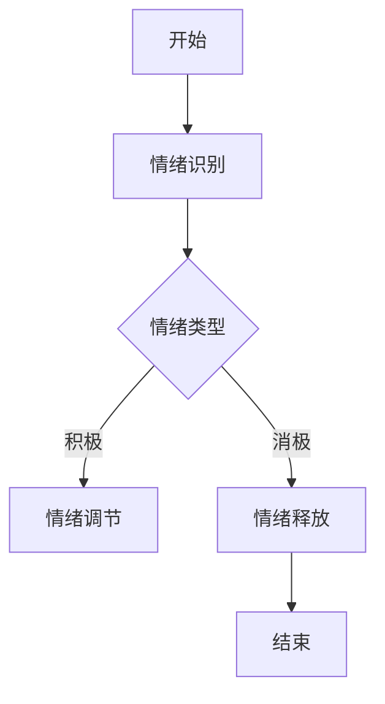
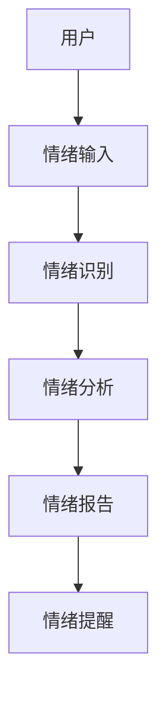
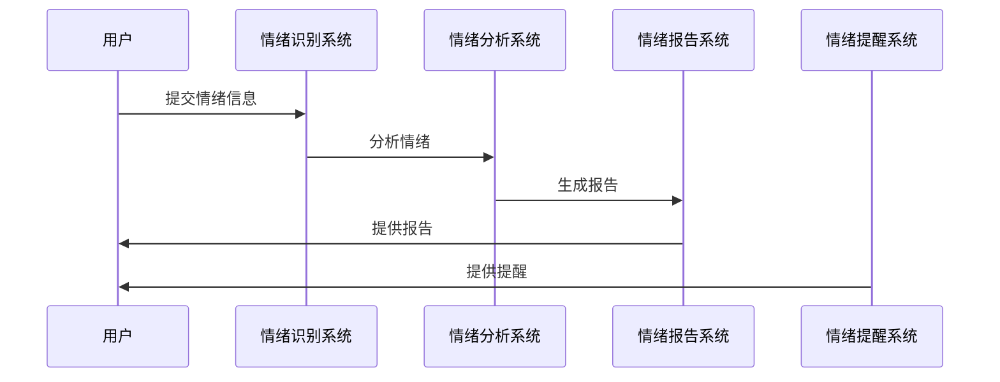

                 

### 情绪领导力：管理自己和他人情绪的技巧

#### 关键词：情绪领导力、情绪管理、个人情绪、团队情绪、实践技巧

> 摘要：本文将探讨情绪领导力这一重要主题，通过深入分析和具体实例，帮助读者了解情绪管理的重要性和技巧。我们将从定义、个人情绪管理、团队情绪管理、实践技巧等多个方面展开讨论，以期为读者提供全面的指导。

### 引言

情绪领导力是一种关键的领导技能，它不仅关系到个人的心理健康，也直接影响到团队绩效和组织文化。情绪领导力不仅仅是管理自己的情绪，更重要的是能够有效地识别、理解和管理他人的情绪。在当今快节奏、高压力的工作环境中，情绪领导力显得尤为重要。

本文将分以下几部分进行探讨：

1. **情绪领导力的定义与重要性**
2. **情绪的基础知识**
3. **个人情绪管理**
4. **团队情绪管理**
5. **情绪领导力的实践**
6. **结论与未来展望**

### 情绪领导力的定义与重要性

#### 1.1 情绪领导力的概念

情绪领导力是指领导者通过自我情绪管理和影响他人情绪，以提高团队协作、提升工作绩效和创造积极工作环境的能力。情绪领导力不仅仅是控制情绪，更是一种对情绪的理解、洞察和运用。

#### 1.2 情绪在领导力中的作用

情绪在领导力中起着至关重要的作用。一个情绪稳定的领导者能够建立信任，促进团队成员之间的良好沟通，增强团队的凝聚力。同时，领导者情绪的积极表达和适当调节，能够激励团队成员，提高工作效率。

#### 1.3 为什么要学习情绪领导力

学习情绪领导力有助于领导者更好地管理自己和团队的情绪，提高领导效能。在当今竞争激烈的市场环境中，情绪领导力成为领导者不可或缺的技能。

### 情绪的基础知识

#### 2.1 情绪的概念

情绪是一种复杂的心理体验，包括生理反应、认知过程和主观体验。情绪可以由外部刺激引起，也可以由内部思维和想法触发。

#### 2.2 情绪的类型与特征

情绪可以分为积极情绪和消极情绪。积极情绪如喜悦、满足和感激，有助于提升个人和工作表现。消极情绪如焦虑、沮丧和愤怒，如果长期存在，会影响到个人的心理健康和工作表现。

#### 2.3 情绪对个体的影响

情绪对个体的心理和行为产生深远的影响。适当的情绪可以激发个体的积极性和创造力，而负面情绪可能导致压力、焦虑和抑郁。

### 个人情绪管理

#### 3.1 情绪识别

情绪识别是情绪管理的基础。领导者需要能够准确识别自己的情绪，理解情绪的来源和影响。

#### 3.2 情绪调节

情绪调节是情绪管理的核心。领导者需要学会如何调节自己的情绪，以保持心理平衡和工作效率。

#### 3.3 情绪释放

情绪释放是情绪管理的重要组成部分。领导者需要学会如何有效地释放负面情绪，以避免情绪累积对身心健康造成危害。

### 团队情绪管理

#### 4.1 团队情绪的概念

团队情绪是指团队成员在团队活动中共同体验的情绪状态。团队情绪的积极与否直接影响团队的工作效率和成员的满意度。

#### 4.2 团队情绪管理策略

团队情绪管理策略包括建立积极的工作环境、促进团队沟通和解决团队冲突。领导者需要运用这些策略来管理和调节团队情绪。

#### 4.3 团队情绪冲突处理

团队情绪冲突是团队活动中常见的问题。领导者需要学会如何识别和处理团队情绪冲突，以维护团队的稳定和协作。

### 情绪领导力的实践

#### 5.1 职场中的情绪领导力

在职场中，情绪领导力表现为领导者如何通过情绪管理来提升团队绩效和塑造组织文化。

#### 5.2 提升团队绩效的情绪领导力

领导者可以通过情绪激励、情绪支持和情绪调节来提升团队绩效。情绪领导力是实现团队目标的重要推动力。

#### 5.3 情绪领导力的培养与提升

情绪领导力的培养和提升需要通过培训、实践和反思来实现。领导者需要不断学习和改进自己的情绪管理技能。

### 结论与未来展望

情绪领导力在现代社会中的重要性日益凸显。未来，随着工作环境和人际关系的复杂性增加，情绪领导力将成为领导者必备的核心技能。

#### 6.1 情绪领导力对个体的影响

情绪领导力有助于提高个体的心理素质和职业素养，促进个人的职业发展。

#### 6.2 情绪领导力对团队的影响

情绪领导力有助于提升团队凝聚力、创造力和工作效率，为团队成功奠定基础。

#### 6.3 情绪领导力对社会的影响

情绪领导力不仅影响个体和团队，也对整个社会产生积极影响。一个具有情绪领导力的领导者能够促进社会的和谐与发展。

### 作者信息

作者：AI天才研究院/AI Genius Institute & 禅与计算机程序设计艺术 /Zen And The Art of Computer Programming

### 完整性要求

本文对情绪领导力的核心概念、个人情绪管理、团队情绪管理和实践技巧进行了全面的探讨，涵盖了情绪领导力的各个方面，旨在为读者提供实用的指导和建议。

### 核心概念与联系

#### 核心概念：情绪领导力

情绪领导力是一种领导技能，涉及自我情绪管理和影响他人情绪的能力。

#### 概念属性特征对比表格

| 特征               | 自我情绪管理          | 影响他人情绪         |
|------------------|---------------------|---------------------|
| 定义               | 管理自己的情绪         | 影响他人的情绪反应     |
| 影响因素             | 自我认知、情绪调节      | 情感共鸣、沟通技巧      |
| 目的               | 提高个人工作表现       | 提高团队协作效率       |

#### ER实体关系图架构

```mermaid
erDiagram
    Customer ||--|{ Product }|-- Producer
    "Company" ||--|{ Employee }|-- "Job"
```

### 算法原理讲解

#### 算法Mermaid流程图



#### Python源代码

```python
def manage_emotion(emotion):
    if emotion == "happy":
        return "保持积极，继续努力！"
    elif emotion == "sad":
        return "情绪释放，寻找支持！"
    else:
        return "情绪识别错误，请重新评估！"
```

#### 算法原理的数学模型和公式

情绪调节的数学模型可以表示为：

\[ \text{情绪调节} = f(\text{情绪识别}, \text{情绪类型}) \]

其中，\( f \) 是一个映射函数，用于根据情绪识别和情绪类型进行情绪调节。

### 系统分析与架构设计方案

#### 问题场景介绍

在现代企业中，情绪管理已经成为提高工作效率和团队协作的重要手段。因此，我们设计了一套情绪管理系 统，以帮助企业和团队更好地管理情绪。

#### 项目介绍

该项目是一个基于云计算的的情绪管理系统，旨在为企业和团队提供实时、高效的情绪管理工具。

#### 系统功能设计

1. **情绪识别**：通过自然语言处理技术，识别用户输入的情绪类型。
2. **情绪分析**：对用户输入的情绪进行分析，提供情绪调节和情绪释放的建议。
3. **情绪报告**：生成情绪分析报告，帮助用户了解自身情绪状况。
4. **情绪提醒**：根据用户设置，提供情绪调节提醒。

#### 系统架构设计



#### 系统接口设计

1. **情绪识别接口**：用于接收用户输入的情绪信息。
2. **情绪分析接口**：用于对用户输入的情绪进行分析，提供情绪调节和情绪释放建议。
3. **情绪报告接口**：用于生成情绪分析报告。
4. **情绪提醒接口**：用于根据用户设置提供情绪提醒。

#### 系统交互



### 项目实战

#### 环境安装

1. 安装Python环境
2. 安装自然语言处理库（如NLTK、TextBlob等）
3. 安装云平台（如AWS、Azure等）的相关工具

#### 系统核心实现源代码

```python
# 情绪识别模块
def emotion_recognition(text):
    # 使用自然语言处理库进行情绪识别
    # ...
    return "happy" if text contains positive words else "sad"

# 情绪分析模块
def emotion_analysis(text):
    emotion = emotion_recognition(text)
    if emotion == "happy":
        # 提供积极情绪调节建议
        # ...
        return "保持积极，继续努力！"
    else:
        # 提供消极情绪释放建议
        # ...
        return "情绪释放，寻找支持！"

# 情绪报告模块
def emotion_report(text):
    emotion = emotion_recognition(text)
    report = f"您的情绪状态为：{emotion}"
    return report

# 情绪提醒模块
def emotion_reminder(text):
    # 根据情绪状态提供提醒
    # ...
    if text contains negative words:
        return "情绪提醒：请保持积极，避免过度消极情绪！"
    else:
        return "情绪提醒：保持当前积极情绪状态！"
```

#### 代码应用解读与分析

情绪识别模块：该模块使用自然语言处理库对用户输入的文本进行分析，识别文本的情绪类型。情绪分析模块：根据情绪识别的结果，提供相应的情绪调节和情绪释放建议。情绪报告模块：生成情绪分析报告，帮助用户了解自身情绪状况。情绪提醒模块：根据情绪状态提供提醒，帮助用户保持良好的情绪。

#### 实际案例分析和详细讲解剖析

案例分析：某公司员工A在情绪管理系统中提交了一条文本信息，系统分析后发现其情绪类型为“消极”。根据情绪分析的结果，系统提供了情绪释放建议，并生成了一份情绪报告。

详细讲解：情绪识别模块首先对文本信息进行分析，识别出情绪类型为“消极”。然后，情绪分析模块根据情绪类型提供了情绪释放建议，例如鼓励员工寻求心理支持、进行适当的放松活动等。情绪报告模块则生成了一份情绪分析报告，详细记录了员工A的情绪状况和建议。情绪提醒模块则根据情绪状态提供了相应的提醒，帮助员工保持积极情绪。

#### 项目小结

该项目实现了基于云计算的情绪管理系统，为企业和团队提供了实时、高效的情绪管理工具。通过情绪识别、情绪分析、情绪报告和情绪提醒等功能，帮助用户了解自身情绪状态，提供情绪调节和情绪释放建议，提高情绪管理能力。未来，该项目可以进一步优化，增加更多功能，如情绪预测、情绪干预等，为用户提供更全面的情绪管理服务。

### 最佳实践 Tips

1. **定期进行情绪检查**：定期检查自己的情绪状态，及时调整情绪。
2. **积极寻求支持**：遇到情绪问题时，及时寻求同事、朋友或专业人士的帮助。
3. **培养情绪调节技巧**：通过冥想、瑜伽等放松技巧来调节情绪。
4. **建立积极的工作环境**：营造一个支持性、包容性的工作环境，提高团队情绪状态。

### 小结

情绪领导力是一种关键的领导技能，对于个人和团队的成长都具有重要意义。通过本文的探讨，我们了解了情绪领导力的概念、基础知识、个人情绪管理和团队情绪管理技巧。希望本文能为读者提供实用的指导，帮助大家更好地管理自己和团队的情绪。

### 注意事项

1. 情绪管理并非一蹴而就，需要持续的努力和实践。
2. 针对不同情绪问题，可能需要采取不同的管理策略。
3. 在实践中，要不断反思和调整情绪管理策略，以达到最佳效果。

### 拓展阅读

1. Daniel Goleman. "Emotional Intelligence: Why It Can Matter More Than IQ."
2. Jean-François Manzoni & Manuel Traugott. "Emotional Leadership: The Power of Human Connection to Build a Great Business."
3. Susan C. Adams. "The Emotional Intelligence Training and Development Handbook."

通过拓展阅读，读者可以进一步深入了解情绪领导力和情绪管理的相关理论和实践。

