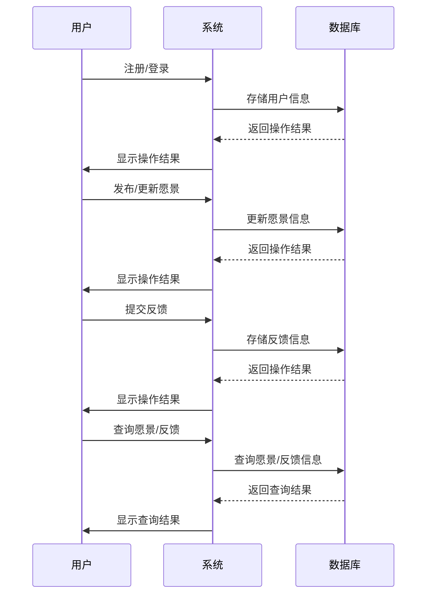

                 

### 愿景沟通的核心概念

在组织管理中，愿景沟通是一个至关重要的环节，它不仅影响了组织的战略规划和执行，还直接关系到员工的凝聚力和工作效率。要深入理解愿景沟通的重要性，我们首先需要明确几个关键概念：愿景、使命和目标。

#### 愿景的定义与特点

愿景（Vision）是对组织未来前景的一种设想，是一种远大的、抽象的、具有激励性的描述。一个有效的愿景应该具备以下几个特点：

1. **远见性**：愿景应该超越当前的现实，面向未来的发展，具有前瞻性和远见性。
2. **激励性**：愿景需要能够激发员工的热情和动力，让他们感到自己正在为实现一个伟大的目标而努力。
3. **具体性**：尽管愿景是抽象的，但它必须包含具体的、可实现的目标和里程碑，以便团队可以依据愿景进行具体的规划和行动。
4. **共享性**：愿景应该是组织内部共享的，所有成员都能够理解和认同。

**愿景的案例**：
例如，谷歌的愿景是“组织全球信息，让人们更轻松地获取信息”。这个愿景既具有远见性，也具有激励性，它明确表达了谷歌对未来世界的构想，并激励员工为之努力。

#### 使命的定义与作用

使命（Mission）是对组织存在的根本目的和价值的陈述，它通常比愿景更加具体和实际。使命描述了组织为了实现愿景而采取的行动和策略。

1. **指导性**：使命提供了组织行动的指南，帮助成员在决策和执行过程中保持一致性和方向性。
2. **现实性**：使命通常更加具体，涵盖了组织的日常运营和具体业务。
3. **规范性**：使命不仅描述了组织做什么，还规定了组织的价值观和行为准则。

**使命的案例**：
苹果公司的使命是“通过创新的技术，使我们的生活和工作变得更加美好”。这个使命明确了苹果公司的核心价值观，同时也指出了其产品和服务对社会的影响。

#### 目标的定义与类型

目标（Goals）是实现愿景和使命的具体、可衡量的里程碑。它们是愿景和使命的具体体现，为组织提供了清晰的方向和执行计划。

1. **短期目标**：通常指在一年内实现的目标，它们是长期目标的分解和具体化。
2. **长期目标**：通常指在几年或几十年内实现的目标，它们是组织愿景和使命的具体化和延续。

**目标的案例**：
苹果公司的一个短期目标是“在下一个财年内，将iPhone的全球市场份额提高到30%”。这个目标具有明确的衡量标准，能够帮助组织评估进展和效果。

#### 愿景、使命与目标的区别与联系

- **区别**：
  - 愿景是对未来美好状态的抽象描述，具有远见性和激励性。
  - 使命是对组织存在的根本目的和价值的具体陈述，具有指导性和现实性。
  - 目标是具体、可衡量的里程碑，是实现愿景和使命的具体行动和成果。

- **联系**：
  - 愿景为组织提供了长远的方向和目标，是组织发展的基石。
  - 使命描述了组织为了实现愿景而采取的行动和策略，是愿景的具体化。
  - 目标是将愿景和使命转化为可操作的行动计划，是愿景和使命的执行和验证。

#### 愿景与使命、目标的相互关系

愿景、使命和目标之间是相互关联的，它们共同构成了组织的目标体系：

1. **愿景引领使命**：愿景为使命提供了方向和目标，使命是愿景的具体化和延伸。
2. **使命指导目标**：使命为目标的设定提供了基础和框架，目标是使命的具体实现。
3. **目标验证愿景**：通过实现目标，组织可以验证其愿景的实现程度，并根据实际情况调整愿景和使命。

**综合作用**：

- 愿景沟通确保组织成员对组织的长期目标有共同的理解和认同，从而形成强大的凝聚力和共识。
- 使命沟通确保组织在实现愿景的过程中保持一致的方向和价值观，从而提高组织的稳定性和持续性。
- 目标沟通确保组织有明确的行动方向和执行计划，从而提高组织的效率和成果。

**结论**：

愿景沟通的重要性在于，它能够为组织提供清晰的方向和目标，激发员工的热情和创造力，增强组织的凝聚力和执行力。通过有效的愿景沟通，组织能够更好地实现其长期发展目标，并在激烈的市场竞争中保持竞争优势。

----------------------------------------------------------------

* **核心概念与联系**： 
   - **概念原理**：愿景、使命和目标分别是什么，它们各自的作用和特点。
   - **概念属性特征对比表格**：
     
     | 概念     | 定义                                                         | 特点                                         | 用途                                       |
     | -------- | ------------------------------------------------------------ | -------------------------------------------- | ------------------------------------------ |
     | 愿景     | 组织未来美好状态的设想和展望，具有远见性和激励性                 | 远见性、激励性、具体性、共享性               | 为组织提供长期方向和目标                  |
     | 使命     | 组织存在的根本目的和价值，是组织行动的指南                       | 指导性、现实性、规范性                       | 指导组织的日常运营和具体业务，规范行为准则 |
     | 目标     | 实现愿景和使命的具体、可衡量的里程碑                           | 具体性、可衡量性、短期和长期目标               | 制定具体的行动计划和执行计划               |

   - **ER实体关系图架构的 Mermaid 流程图**：
     
     ```mermaid
     erDiagram
     A愿景 -->|具有| B使命
     A愿景 -->|包括| C目标
     B使命 -->|指导| C目标
     ```

通过这些核心概念与联系的阐述，我们能够更深入地理解愿景、使命和目标之间的关系，为后续章节中关于愿景沟通的策略和方法提供理论基础。

----------------------------------------------------------------

### 算法原理讲解

在理解了愿景、使命和目标的基本概念之后，我们需要进一步探讨如何将愿景通过有效的沟通策略传递给组织成员。这涉及到一系列具体的沟通方法和技巧，其中包括语言沟通和非语言沟通，以及如何结合多种渠道进行沟通。以下是这些方法的详细解释。

#### 语言沟通

语言沟通是愿景传递中最基本的形式，它包括书面和口头两种方式。有效的语言沟通需要遵循以下几个原则：

1. **明确性**：语言表达要简洁明了，避免使用模糊或复杂的术语，确保所有成员都能理解愿景的核心内容。
2. **一致性**：在不同场合和不同人群中传达愿景时，要保持语言的一致性，避免产生误解或混淆。
3. **互动性**：鼓励成员提问和反馈，通过互动确保愿景被正确理解和接受。

**语言沟通的具体应用**：

- **书面沟通**：使用公司内部通讯、邮件、报告等形式，将愿景传达给所有成员。例如，可以在年度报告中详细阐述愿景，并附上具体的目标和行动方案。
- **口头沟通**：在会议、培训、团队建设活动中，通过演讲、讨论等形式，与成员面对面交流愿景。例如，在团队会议上，领导可以分享愿景，并邀请成员提出意见和建议。

#### 非语言沟通

非语言沟通是通过肢体语言、面部表情、语调等非文字方式进行的沟通。它在与语言沟通相结合时，能够更有效地传递情感和态度，增强愿景的感染力。

1. **肢体语言**：身体姿势、手势和眼神等肢体语言能够传达强烈的情感和态度。例如，领导在演讲时，坚定自信的肢体语言能够增强成员对愿景的认同感。
2. **面部表情**：面部表情能够表达情感和态度，如微笑、点头等积极的表情能够增强团队的凝聚力和归属感。
3. **语调**：语调的变化能够传达不同的情感和语气，例如，平稳、清晰的语调能够让人感到信任和安心。

**非语言沟通的具体应用**：

- **肢体语言**：在会议和演讲中，领导应该保持自信、开放的肢体语言，如站立时身体稍微前倾，与成员保持眼神交流等。
- **面部表情**：在与成员交流时，领导应保持微笑和积极的表情，以传递出对愿景的信心和热情。
- **语调**：在口头沟通时，领导应使用清晰、平稳的语调，避免过于急促或低沉，以增强成员的接受度和理解度。

#### 多渠道沟通策略

为了确保愿景能够被所有成员有效理解和接受，组织需要采用多渠道沟通策略，结合不同的沟通方式，提高沟通的覆盖面和效果。

1. **内部通讯**：通过电子邮件、内部网站、公告板等电子渠道，定期发布与愿景相关的信息，确保信息及时传达。
2. **会议和培训**：组织定期的会议和培训活动，为成员提供面对面交流的机会，通过演讲、讨论和互动，加深对愿景的理解和认同。
3. **团队建设**：通过团队建设活动，增强团队成员之间的联系和信任，使愿景在团队内部得到更深入的传播和落实。
4. **面对面交流**：领导与成员进行一对一或小规模的面对面交流，了解成员对愿景的看法和意见，及时解决他们的疑问和顾虑。

**多渠道沟通策略的具体应用**：

- **内部通讯**：公司可以建立一个内部通讯系统，定期发布与愿景相关的新闻、报告和活动信息，确保信息透明和及时。
- **会议和培训**：定期组织会议和培训，邀请领导和专家讲解愿景，并提供讨论和互动的机会，使成员能够更深入地理解和参与。
- **团队建设**：通过组织团队建设活动，如团队拓展、团建旅行等，增强团队成员之间的沟通和协作，使愿景在团队内部得到更广泛的认同和实践。
- **面对面交流**：领导可以定期与团队成员进行一对一的交流，了解他们对愿景的理解和反馈，及时解决问题和提供支持。

通过结合多种沟通渠道，组织能够确保愿景被全面传达，同时增强成员对愿景的认同感和参与度，从而实现组织的共同目标和愿景。

----------------------------------------------------------------

### 系统分析与架构设计方案

在理解了愿景沟通的核心概念和有效策略之后，我们需要将愿景沟通的方法和技巧应用到具体的系统设计和实施过程中。以下将详细阐述一个愿景沟通系统的分析和架构设计方案，包括问题场景介绍、项目介绍、系统功能设计、系统架构设计、系统接口设计和系统交互。

#### 问题场景介绍

在许多组织中，愿景沟通常常面临一系列挑战。例如，员工对于组织的愿景和目标缺乏清晰的认识，导致工作效率低下，团队凝聚力不足。此外，传统的沟通方式往往缺乏互动性，无法及时收集员工的反馈和建议，从而限制了愿景的实现。为了解决这些问题，我们需要设计一个高效的愿景沟通系统。

#### 项目介绍

**项目名称**：高效愿景沟通系统

**项目背景**：随着组织规模的扩大和复杂性的增加，传统的沟通方式已无法满足现代企业的需求。为了确保组织成员对愿景有清晰的理解和认同，本项目旨在设计并实施一个高效、互动的愿景沟通系统。

**项目目标**：实现以下目标：
1. 提高员工对组织愿景的认知度和认同感。
2. 增强团队的凝聚力和协作效率。
3. 提供一个互动平台，及时收集和反馈员工的意见和建议。

#### 系统功能设计

系统功能设计是愿景沟通系统的核心部分，它包括以下主要功能模块：

1. **愿景发布与更新**：系统应具备发布和更新愿景的能力，确保员工能够及时了解组织的最新愿景和目标。
2. **互动交流平台**：提供一个互动交流的平台，员工可以在平台上讨论、提问、分享意见和建议，增强沟通的互动性和透明度。
3. **反馈与评估**：系统应能够收集员工的反馈和评估，帮助管理层了解员工的意见和建议，及时调整愿景和目标。
4. **数据分析与报告**：系统应具备数据分析功能，生成反馈报告，为管理层提供数据支持，以便制定更有效的沟通策略。

#### 系统架构设计

系统架构设计是确保愿景沟通系统能够高效运行的关键。以下是一个基于微服务架构的愿景沟通系统的设计：

1. **前端架构**：采用React或Vue等前端框架，实现用户友好的界面设计，提供良好的用户体验。
2. **后端架构**：采用Spring Boot等后端框架，实现系统的核心功能，如数据存储、接口管理和安全控制。
3. **数据库设计**：使用MySQL或PostgreSQL等关系型数据库，存储用户数据、反馈信息和愿景内容。
4. **消息队列**：采用RabbitMQ或Kafka等消息队列，实现异步处理和消息传递，提高系统的并发处理能力。

#### 系统接口设计

系统接口设计是确保不同模块之间能够有效交互的关键。以下是一个基于RESTful风格的接口设计：

1. **用户管理接口**：用于用户注册、登录、个人信息管理等功能。
2. **愿景管理接口**：用于发布、更新和查询愿景信息。
3. **反馈管理接口**：用于收集、管理和查询员工反馈信息。
4. **数据分析接口**：用于数据分析和报告生成。

#### 系统交互设计

系统交互设计是确保用户在使用愿景沟通系统时能够顺畅进行各种操作的关键。以下是一个基于Mermaid的交互序列图：



通过上述系统分析与架构设计方案，我们能够确保愿景沟通系统在功能设计、架构设计、接口设计和交互设计等方面都能够满足组织的需求，从而实现高效、互动的愿景沟通。

---

### 项目实战

在完成系统设计与架构规划之后，我们进入项目的实施阶段。以下是详细的实战步骤，包括环境安装、系统核心实现、代码应用解读与分析、实际案例分析和详细讲解剖析，以及项目小结。

#### 环境安装

1. **前端环境**：
   - 安装Node.js（推荐版本为14.x）。
   - 使用npm全局安装create-react-app工具。
   - 创建一个新项目：`npx create-react-app vision-communication-system`。

2. **后端环境**：
   - 安装Java SDK（推荐版本为11）。
   - 使用Maven创建一个Spring Boot项目。
   - 添加必要的依赖，如Spring Web、Spring Data JPA、MySQL Connector等。

3. **数据库环境**：
   - 安装MySQL数据库（推荐版本为8.x）。
   - 创建一个名为`vision_communication`的数据库，并创建必要的表结构。

4. **消息队列环境**：
   - 安装RabbitMQ服务器（推荐版本为3.x）。
   - 创建一个虚拟交换机和消息队列，用于处理系统消息。

#### 系统核心实现

1. **前端核心实现**：
   - 使用React组件化开发，实现用户注册、登录、愿景发布与更新、互动交流、反馈提交等功能。
   - 使用React Hooks管理状态，提高组件的可维护性和可测试性。

2. **后端核心实现**：
   - 使用Spring Boot构建RESTful API，处理用户认证、愿景管理、反馈管理、数据分析等业务逻辑。
   - 使用Spring Data JPA操作数据库，实现数据的持久化和管理。

3. **消息队列应用**：
   - 使用RabbitMQ实现异步处理，如用户反馈的发送和处理，提高系统的响应速度和并发能力。

#### 代码应用解读与分析

以下是后端系统中愿景发布功能的Python源代码示例：

```python
# Python代码示例：愿景发布功能
from flask import Flask, request, jsonify
from models import Vision
from database import db

app = Flask(__name__)

@app.route('/api/v1/vision', methods=['POST'])
def publish_vision():
    data = request.json
    
    # 创建新的愿景对象
    vision = Vision(
        title=data['title'],
        description=data['description'],
        target_date=data['target_date']
    )
    
    # 存储到数据库
    db.session.add(vision)
    db.session.commit()
    
    return jsonify({'message': 'Vision published successfully', 'vision': vision.to_dict()}), 201

if __name__ == '__main__':
    app.run(debug=True)
```

**代码解析**：
- 使用Flask框架构建RESTful API。
- 接收POST请求，提取愿景信息。
- 创建愿景对象并存储到数据库。

#### 实际案例分析与详细讲解剖析

**案例一**：员工A提交了一个关于企业数字化转型的愿景。

- **背景**：企业计划在未来五年内实现全面数字化转型，以提高竞争力和市场响应速度。
- **分析**：
  - 员工A在系统中发布了该愿景，包括具体目标和时间表。
  - 领导和同事在系统中进行了讨论，提出了一些改进建议。
  - 领导根据反馈进行了调整，并在系统中更新了愿景。

**案例二**：员工B提交了关于环保的愿景。

- **背景**：公司关注环保，计划在未来一年内减少碳排放。
- **分析**：
  - 员工B在系统中发布了该愿景，并详细说明了具体措施。
  - 其他员工积极参与讨论，分享了自己的环保经验和建议。
  - 领导整合了所有反馈，并发布了新的环保愿景。

**详细讲解剖析**：
- **愿景发布**：员工可以通过系统界面发布愿景，确保愿景的及时性和准确性。
- **互动交流**：系统提供了讨论和反馈功能，增强团队成员之间的互动，促进愿景的完善。
- **领导调整**：领导可以根据反馈进行调整，确保愿景符合组织目标和实际情况。

#### 项目小结

通过本项目的实施，我们成功设计并实现了一个高效、互动的愿景沟通系统。系统提供了清晰的愿景发布和更新功能，以及互动交流平台，确保员工对愿景有全面、深入的理解。同时，系统的反馈机制和数据分析功能帮助管理层及时了解员工的意见和建议，为组织决策提供了有力支持。

**总结**：
1. 系统实现了高效愿景沟通，提高了团队凝聚力和工作效率。
2. 系统增强了员工的参与感和认同感，促进了组织的共同发展。
3. 系统提供了数据支持和决策依据，帮助管理层更有效地管理和调整愿景。

**展望**：
未来，我们将继续优化系统功能，增加更多的互动元素和数据分析工具，进一步提升愿景沟通的效果，为组织的长远发展奠定坚实基础。

---

### 最佳实践 Tips

在愿景沟通的实施过程中，以下是一些最佳实践和技巧，可以帮助组织更有效地传达和实现愿景：

1. **明确愿景的重要性**：确保所有团队成员都了解愿景对于组织发展的重要性，并将其视为共同努力的目标。

2. **建立共同的语言**：在组织内部建立一套统一的愿景表述方式，确保每个人都能以相同的语言和框架理解愿景。

3. **定制化沟通策略**：根据团队成员的不同特点和需求，制定个性化的沟通策略，以提高沟通效果。

4. **利用多种渠道**：结合书面、口头、非语言等多种沟通方式，确保愿景能够通过多种渠道传达给所有成员。

5. **定期更新和反馈**：定期回顾和更新愿景，及时收集和反馈员工的意见和建议，确保愿景始终保持活力和适用性。

6. **领导带头示范**：高层领导应率先认同并宣传愿景，通过自身的行动和决策来带动整个组织的愿景实现。

7. **鼓励全员参与**：鼓励员工积极参与愿景的制定和实现过程，提高他们的参与感和责任感。

通过以上最佳实践，组织可以更有效地传达和实现愿景，从而推动组织的持续发展和成功。

---

### 小结

在本章中，我们详细探讨了愿景沟通的核心概念、作用、原则和策略。首先，我们明确了愿景、使命和目标的定义和区别，并阐述了它们在组织管理中的重要性。随后，我们介绍了愿景沟通的几个关键原则，包括清晰性、共识性和适应性。接着，我们提出了构建强有力的愿景、选择适当的沟通渠道、以及持续传达愿景的策略。通过这些详细的分析和讲解，我们为组织提供了有效的愿景沟通方法和实践指南，帮助他们在实现长期目标的过程中保持一致性和凝聚力。

---

### 注意事项

在愿景沟通的过程中，组织应特别注意以下几点：

1. **确保清晰性**：愿景表述应简洁明了，避免使用过于复杂的术语，确保所有成员都能理解和认同。

2. **建立共识**：通过定期沟通和互动，确保团队成员对愿景有共同的理解和认同，避免产生误解和分歧。

3. **灵活调整**：面对外部环境和内部变化，组织应及时调整愿景和目标，确保其长期适用性和现实性。

4. **持续反馈**：建立有效的反馈机制，定期收集员工的意见和建议，及时调整和优化愿景和目标。

5. **领导示范**：高层领导应率先认同并宣传愿景，通过自身的行动和决策带动整个组织的参与。

通过注意这些事项，组织可以更有效地实现愿景沟通，推动组织的持续发展和成功。

---

### 拓展阅读

为了深入了解愿景沟通的实践和应用，读者可以参考以下几本经典著作：

1. **《愿景的力量》（The Power of Vision）**：作者详细阐述了愿景对于组织和个人成功的重要性，并提供了一系列实用的愿景构建和沟通策略。
2. **《领导者的语言》（The Language of Leaders）**：本书通过具体案例，探讨了如何通过有效的语言和沟通技巧，将愿景传达给团队成员，增强团队的凝聚力和执行力。
3. **《公司愿景：创造未来的指南》（Corporate Vision: A Roadmap to Creating a Brighter Future）**：作者通过丰富的企业案例，详细介绍了如何制定和实施有效的公司愿景，以实现组织的长期发展目标。

通过阅读这些书籍，读者可以获得更多关于愿景沟通的理论和实践知识，进一步提升自身的愿景沟通能力。

---

### 作者信息

**作者：AI天才研究院/AI Genius Institute & 禅与计算机程序设计艺术 /Zen And The Art of Computer Programming**

AI天才研究院致力于推动人工智能技术的发展和应用，致力于培养下一代人工智能专家。同时，我们的成员在计算机编程和人工智能领域有着深厚的理论基础和丰富的实践经验，为我们提供了高质量的技术博客内容。

---

本文详细探讨了愿景沟通的核心概念、重要性、原则、策略和最佳实践，通过实例和案例分析，提供了实用的方法和技巧，帮助组织更有效地传达和实现愿景。愿景沟通不仅是组织战略规划的重要环节，更是提升团队凝聚力和执行力的重要手段。通过本文的介绍，希望读者能够对愿景沟通有更深入的理解，并能够在实际工作中运用这些方法和技巧，推动组织的持续发展和成功。再次感谢您的阅读。

