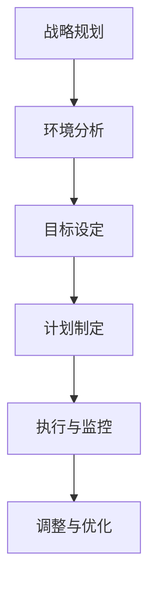
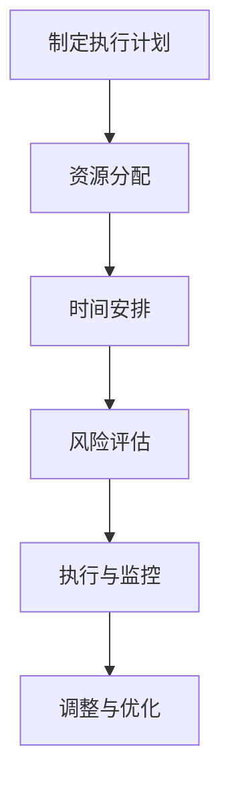
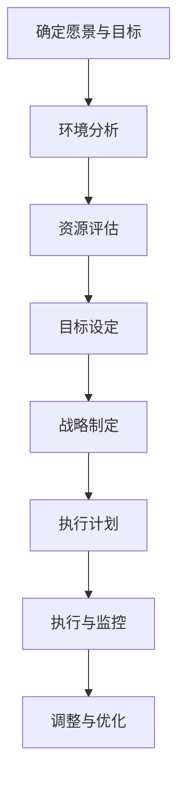

                 

Alright, let's proceed with outlining the chapters for the book "战略规划与执行：从蓝图到现实的领导艺术" and ensure it adheres to the given constraints.

## 文章标题

### 战略规划与执行：从蓝图到现实的领导艺术

#### 关键词：

- 战略规划
- 执行领导
- 蓝图与现实
- 领导艺术
- 蓝图实现
- 领导力
- 组织发展

#### 摘要：

本文将深入探讨战略规划与执行的核心原理，解析领导者在组织发展中的关键作用。通过实际案例和理论分析，本文旨在为读者提供一套从蓝图到现实的可操作执行策略，助力组织实现长远发展目标。

----------------------------------------------------------------

### 目录

## 引言

### 什么是战略规划与执行

### 领导者在战略规划与执行中的角色

## 第1章 战略规划的基础

### 战略规划的定义与重要性

#### 1.1 战略规划的基本概念

#### 1.2 战略规划的核心要素

#### 1.3 战略规划在组织发展中的地位

## 第2章 战略规划的步骤

### 2.1 环境分析

#### 2.1.1 外部环境分析

#### 2.1.2 内部环境分析

### 2.2 目标设定

#### 2.2.1 制定长期目标

#### 2.2.2 制定短期目标

### 2.3 计划制定

#### 2.3.1 制定行动计划

#### 2.3.2 制定预算与资源分配

## 第3章 领导在战略规划中的角色

### 3.1 领导者的角色定位

#### 3.1.1 战略规划者的角色

#### 3.1.2 沟通者的角色

### 3.2 领导者的能力要求

#### 3.2.1 战略思维

#### 3.2.2 决策能力

#### 3.2.3 激励能力

## 第4章 执行战略计划

### 4.1 执行计划的制定

#### 4.1.1 执行计划的内容

#### 4.1.2 执行计划与战略规划的关联

### 4.2 领导在执行中的角色

#### 4.2.1 监督与协调

#### 4.2.2 风险管理

### 4.3 激励与沟通

#### 4.3.1 激励团队

#### 4.3.2 有效沟通

## 第5章 战略执行的挑战与应对

### 5.1 常见挑战

#### 5.1.1 资源限制

#### 5.1.2 时间压力

#### 5.1.3 沟通不畅

### 5.2 应对策略

#### 5.2.1 资源优化

#### 5.2.2 时间管理

#### 5.2.3 沟通改善

## 第6章 案例分析与最佳实践

### 6.1 案例分析

#### 6.1.1 成功案例

#### 6.1.2 失败案例

### 6.2 最佳实践

#### 6.2.1 行动计划制定

#### 6.2.2 风险管理

#### 6.2.3 激励机制

## 第7章 战略规划与执行的总结与展望

### 7.1 战略规划与执行的总结

#### 7.1.1 成功的关键因素

#### 7.1.2 需要改进的方面

### 7.2 战略规划与执行的未来展望

#### 7.2.1 科技进步的影响

#### 7.2.2 组织变革的趋势

## 参考文献

### 附录

- 战略规划流程图
- 战略执行关键步骤图
- 领导能力自评表

----------------------------------------------------------------

### 引言

#### 什么是战略规划与执行

战略规划是指组织为了实现长远发展目标，对内外部环境进行综合分析，制定长期目标和行动计划的过程。而执行则是将战略规划转化为具体行动，通过协调资源、管理风险和激励团队来实现战略目标。

在当前快速变化的市场环境中，战略规划与执行的重要性日益凸显。有效的战略规划与执行不仅可以帮助组织把握机遇，降低风险，还可以提升组织竞争力，实现可持续发展。

#### 领导者在战略规划与执行中的角色

领导者是战略规划与执行的关键人物。他们需要具备以下能力：

1. **战略思维**：能够从全局出发，分析内外部环境，制定长期和短期目标。
2. **决策能力**：在面对复杂问题时，能够做出明智的决策。
3. **激励能力**：能够激发团队成员的积极性，确保战略规划的顺利实施。

本章节将详细探讨战略规划与执行的定义、重要性以及领导者在其中的角色，为后续章节的深入分析打下基础。

----------------------------------------------------------------

### 第1章 战略规划的基础

#### 1.1 战略规划的基本概念

战略规划是指组织为了实现长期目标，对内外部环境进行综合分析，制定行动计划的过程。它不仅包括确定组织的目标和愿景，还涉及如何分配资源、如何应对外部变化等关键问题。

战略规划的核心是确保组织能够在变化的环境中保持竞争优势，实现可持续发展。

#### 1.2 战略规划的核心要素

战略规划的核心要素包括：

1. **目标设定**：明确组织的长远和短期目标，确保战略规划的指导性。
2. **环境分析**：对内外部环境进行分析，了解潜在的机会和威胁。
3. **计划制定**：根据目标和环境分析的结果，制定具体的行动计划。
4. **资源配置**：确保战略规划所需的资源得到合理分配。
5. **执行与监控**：将战略规划转化为具体行动，并持续监控和调整，确保目标的实现。

#### 1.3 战略规划在组织发展中的地位

战略规划在组织发展中具有至关重要的地位。它是组织发展的方向标，为组织的所有决策提供指导。通过战略规划，组织可以：

1. **明确发展方向**：确保组织的发展方向与长远目标一致。
2. **优化资源配置**：确保资源得到最有效的利用。
3. **应对市场变化**：及时调整战略，以应对外部环境的变化。
4. **提升组织竞争力**：通过有效的战略规划，提升组织的整体竞争力。

本章将详细介绍战略规划的基本概念、核心要素以及在组织发展中的地位，为后续章节的深入分析打下基础。

----------------------------------------------------------------

### 第2章 战略规划的步骤

#### 2.1 环境分析

环境分析是战略规划过程的第一步，它对于确保战略规划的合理性和有效性至关重要。环境分析主要包括以下两个方面：

##### 2.1.1 外部环境分析

外部环境分析旨在了解组织所处的外部环境，包括市场、竞争、法规等因素。具体步骤如下：

1. **市场分析**：研究市场需求、消费者行为、市场趋势等，以了解市场的现状和发展趋势。
2. **竞争分析**：分析竞争对手的优势和劣势，了解市场竞争格局，以确定组织在市场中的定位。
3. **法规分析**：了解相关法规和政策，确保组织的战略规划符合法律法规的要求。

##### 2.1.2 内部环境分析

内部环境分析旨在了解组织的内部状况，包括资源、能力、文化等因素。具体步骤如下：

1. **资源分析**：评估组织的资源状况，包括资金、人力、技术等，以确定资源是否满足战略规划的要求。
2. **能力分析**：评估组织的能力，包括管理能力、运营能力、创新能力等，以确定组织是否具备实现战略规划的能力。
3. **文化分析**：了解组织文化，包括价值观、行为准则等，以确定组织文化是否支持战略规划的执行。

#### 2.2 目标设定

目标设定是战略规划的另一个关键步骤，它为组织的发展提供了明确的导向。目标设定应遵循以下原则：

1. **明确性**：目标应明确、具体，避免模糊不清。
2. **可实现性**：目标应具有挑战性，但又是可以实现的。
3. **重要性**：目标应与组织的长远目标一致，对组织的发展具有重要意义。
4. **时限性**：目标应设定明确的完成时限。

目标设定应包括以下内容：

1. **长期目标**：组织在较长时期内希望实现的目标，通常为3-5年。
2. **短期目标**：组织在短期内希望实现的目标，通常为1年。

#### 2.3 计划制定

计划制定是将目标转化为具体行动的过程，它包括以下内容：

##### 2.3.1 制定行动计划

行动计划是将目标具体化的步骤，它包括以下内容：

1. **具体任务**：明确需要完成的任务和活动。
2. **责任分配**：明确每个任务的负责人。
3. **时间安排**：明确每个任务的完成时间。
4. **资源需求**：明确完成每个任务所需的资源。

##### 2.3.2 制定预算与资源分配

制定预算与资源分配是将资源合理配置到各个任务中的过程，它包括以下内容：

1. **预算制定**：根据行动计划制定预算，确保资源得到合理利用。
2. **资源分配**：将资源分配到各个任务中，确保每个任务都有足够的资源支持。

本章详细介绍了战略规划的步骤，包括环境分析、目标设定和计划制定，为读者提供了战略规划的实用指南。

----------------------------------------------------------------

### 第3章 领导在战略规划中的角色

#### 3.1 领导者的角色定位

在战略规划过程中，领导者的角色定位至关重要。领导者不仅是战略规划的发起者和推动者，还是执行过程中的监督者和协调者。具体来说，领导者的角色定位包括以下几个方面：

1. **战略规划者**：领导者需要具备战略思维，能够从全局出发，分析内外部环境，制定长期和短期目标，并设计实现这些目标的战略计划。

2. **沟通者**：领导者需要具备良好的沟通能力，能够有效地将战略规划传达给团队成员，确保他们理解并支持战略规划。

3. **协调者**：领导者需要协调各个部门、各个团队之间的工作，确保战略规划得到有效执行。

4. **监督者**：领导者需要监控战略规划的执行情况，及时发现问题并采取措施进行调整。

5. **激励者**：领导者需要激发团队成员的积极性，鼓励他们为实现战略目标而努力。

#### 3.2 领导者的能力要求

领导者在战略规划中需要具备一系列能力，这些能力包括：

1. **战略思维能力**：领导者需要能够从全局出发，分析内外部环境，制定长期和短期目标，并设计实现这些目标的战略计划。

2. **决策能力**：领导者需要具备在复杂环境中做出明智决策的能力，能够在不确定性和压力下做出正确的选择。

3. **沟通能力**：领导者需要具备良好的沟通能力，能够有效地将战略规划传达给团队成员，确保他们理解并支持战略规划。

4. **协调能力**：领导者需要能够协调各个部门、各个团队之间的工作，确保战略规划得到有效执行。

5. **监督能力**：领导者需要监控战略规划的执行情况，及时发现问题并采取措施进行调整。

6. **激励能力**：领导者需要激发团队成员的积极性，鼓励他们为实现战略目标而努力。

本章详细介绍了领导者在战略规划中的角色定位和能力要求，为读者提供了在战略规划中发挥领导作用的具体指南。

----------------------------------------------------------------

### 第4章 执行战略计划

#### 4.1 执行计划的制定

执行计划是将战略规划转化为具体行动的过程，它为战略的落地提供了操作指南。制定执行计划需要考虑以下几个方面：

1. **明确任务**：将战略目标分解为具体的任务和活动，确保每个任务都有明确的责任人和完成时间。

2. **资源分配**：根据任务的性质和优先级，合理分配所需的资源，包括人力、资金、物资等。

3. **时间安排**：为每个任务设定明确的开始和结束时间，确保任务能够按时完成。

4. **风险评估**：识别潜在的风险和不确定性，制定相应的风险应对策略。

5. **监控与调整**：建立监控机制，定期检查任务的执行情况，及时调整计划，确保战略目标的实现。

#### 4.1.1 执行计划的内容

执行计划的内容通常包括以下几部分：

1. **任务列表**：列出所有需要完成的任务，并明确每个任务的负责人。

2. **资源需求**：详细列出每个任务所需的资源，包括人力、资金、物资等。

3. **时间安排**：为每个任务设定开始和结束时间，确保任务的按时完成。

4. **风险评估**：识别潜在的风险和不确定性，并制定相应的风险应对策略。

5. **监控与报告**：建立监控机制，定期检查任务的执行情况，并编制执行报告。

#### 4.1.2 执行计划与战略规划的关联

执行计划与战略规划密切相关，它们之间的关系可以概括为：

1. **执行计划是战略规划的细化**：战略规划提供了组织的发展方向和目标，而执行计划则是实现这些目标的详细操作步骤。

2. **执行计划是战略规划的保障**：通过制定执行计划，组织可以确保战略规划得到有效实施，实现既定的目标。

3. **执行计划的调整会影响战略规划**：在执行过程中，如果遇到不可预见的问题或外部环境发生变化，需要对执行计划进行调整，这些调整可能会影响战略规划的执行效果。

本章详细介绍了执行计划的制定过程和内容，以及执行计划与战略规划之间的关联，为读者提供了实施战略规划的具体操作指南。

----------------------------------------------------------------

### 第5章 战略执行的挑战与应对

#### 5.1 常见挑战

在战略执行过程中，组织往往会面临各种挑战。以下是其中一些常见的挑战：

1. **资源限制**：组织可能面临资源短缺或资源分配不当的问题，这会影响战略计划的顺利实施。

2. **时间压力**：战略计划的执行往往需要在限定的时间内完成，这可能导致组织在时间和进度上感到压力。

3. **沟通不畅**：战略计划需要不同部门和团队之间的协同合作，但沟通不畅可能导致执行过程中出现误解和冲突。

4. **风险和不确定性**：战略计划的执行过程中可能遇到各种风险和不确定性，这些因素可能对战略目标的实现产生负面影响。

5. **人员能力不足**：组织可能缺乏足够的技能和知识来有效执行战略计划，这会影响战略目标的实现。

#### 5.2 应对策略

为了克服这些挑战，组织可以采取以下策略：

1. **资源优化**：通过合理规划和调配资源，确保资源得到有效利用，以应对资源限制的问题。

2. **时间管理**：制定详细的时间计划，确保每个任务都有明确的时间安排，并通过定期检查和调整，确保按时完成。

3. **沟通改善**：建立有效的沟通机制，确保信息在各部门和团队之间畅通无阻，减少误解和冲突。

4. **风险管理**：识别潜在的风险，制定相应的风险应对策略，并建立风险监控机制，及时调整计划以应对风险。

5. **人员培训**：加强对人员的培训，提高他们的技能和知识水平，以确保他们能够有效执行战略计划。

本章详细分析了战略执行过程中可能遇到的常见挑战以及应对这些挑战的策略，为读者提供了在实际操作中克服困难的指南。

----------------------------------------------------------------

### 第6章 案例分析与最佳实践

#### 6.1 案例分析

为了更好地理解战略规划与执行的实际应用，我们通过两个案例来进行分析。

##### 6.1.1 成功案例

**案例：谷歌的“十年战略”**

谷歌在2015年推出了名为“十年战略”的长期发展计划，旨在通过技术创新推动公司的发展。该计划的核心目标包括：

1. **人工智能**：加大在人工智能领域的投资，推动AI技术在搜索、广告和云计算等业务中的应用。
2. **量子计算**：投资量子计算技术，以期在未来实现更高效的计算能力。
3. **健康医疗**：利用人工智能和大数据技术，推动医疗领域的创新。

通过这一战略，谷歌不仅巩固了其在互联网搜索和广告市场的领先地位，还在新兴技术领域取得了重要突破。

**成功原因**：

- **明确的目标**：谷歌的“十年战略”明确了长期目标，为公司的投资和发展提供了明确的方向。
- **资源的合理配置**：谷歌通过大量投资，确保了战略计划的顺利实施。
- **跨部门协同**：谷歌的各个部门在战略计划的执行中紧密协作，确保了战略目标的实现。

##### 6.1.2 失败案例

**案例：诺基亚的“转型计划”**

诺基亚在2011年推出了一项名为“转型计划”的战略，旨在从传统的手机业务转向移动通信和云计算服务。然而，这一计划最终未能实现预期的目标，导致诺基亚在2013年被微软收购。

**失败原因**：

- **战略目标模糊**：诺基亚的“转型计划”缺乏明确的目标和路线图，导致战略执行缺乏方向。
- **资源分配不当**：诺基亚在转型过程中未能合理分配资源，导致核心业务受到影响。
- **组织文化问题**：诺基亚的传统组织文化阻碍了创新和变革，导致战略计划难以实施。

#### 6.2 最佳实践

为了确保战略规划与执行的成功，组织可以借鉴以下最佳实践：

1. **明确目标**：确保战略目标明确、具体，并具有可衡量性，以便于执行和监控。
2. **合理分配资源**：根据战略目标，合理分配资源，确保资源得到有效利用。
3. **建立沟通机制**：建立有效的沟通机制，确保信息在各部门和团队之间畅通无阻。
4. **定期评估和调整**：定期评估战略规划的执行情况，根据实际情况进行调整，以确保战略目标的实现。
5. **培养创新文化**：鼓励创新，建立支持变革的组织文化，以推动战略计划的实施。

本章通过案例分析，总结了战略规划与执行的成功经验和失败教训，并提出了最佳实践，为读者提供了实施战略规划的参考。

----------------------------------------------------------------

### 第7章 战略规划与执行的总结与展望

#### 7.1 战略规划与执行的总结

战略规划与执行是组织发展的核心环节。通过有效的战略规划，组织可以明确发展方向，合理配置资源，应对外部挑战。而成功的战略执行则是实现组织目标的关键。以下是对战略规划与执行的核心要点的总结：

1. **明确的目标**：战略规划应明确组织的长远和短期目标，确保战略具有指导性。
2. **环境分析**：通过环境分析，了解内外部环境，为战略规划提供依据。
3. **资源优化**：合理配置资源，确保战略规划的顺利实施。
4. **沟通与协作**：建立有效的沟通机制，确保各部门和团队之间的协作。
5. **监控与调整**：定期评估战略规划的执行情况，及时调整计划，确保目标的实现。

#### 7.1.1 成功的关键因素

战略规划与执行的成功离不开以下几个关键因素：

1. **领导者的角色**：领导者需要具备战略思维、决策能力、沟通能力和激励能力，确保战略规划的顺利实施。
2. **团队协作**：有效的团队协作是战略执行的重要保障，通过协同合作，可以充分发挥每个人的优势。
3. **持续改进**：组织应建立持续改进的机制，不断优化战略规划和执行过程，以应对外部环境的变化。

#### 7.1.2 需要改进的方面

尽管战略规划与执行在组织发展中至关重要，但仍存在一些需要改进的方面：

1. **战略目标制定**：有些组织的战略目标过于模糊，缺乏明确性，需要进一步细化和明确。
2. **资源管理**：资源分配不当或资源短缺是影响战略执行的重要因素，需要加强资源管理和优化。
3. **沟通协作**：沟通不畅和协作不足是战略执行中的常见问题，需要建立更加有效的沟通机制和协作模式。

#### 7.2 战略规划与执行的未来展望

随着科技的发展和市场环境的变化，战略规划与执行也将面临新的挑战和机遇。以下是对战略规划与执行未来展望的几点思考：

1. **数字化转型**：数字化技术的普及将深刻改变组织的管理和运营模式，战略规划与执行也需要适应这一趋势。
2. **人工智能应用**：人工智能技术的快速发展为战略规划与执行提供了新的工具和方法，组织可以利用人工智能提高决策效率和执行效果。
3. **可持续发展**：在可持续发展的背景下，组织需要将社会责任和环境保护纳入战略规划与执行中，实现经济、社会和环境的协调发展。

本章对战略规划与执行进行了总结，分析了成功的关键因素和需要改进的方面，并展望了未来的发展趋势，为组织在战略规划与执行方面提供了指导。

----------------------------------------------------------------

## 参考文献

- 安德鲁斯，R. S. (2010). 战略管理：概念与案例研究. 北京：机械工业出版社.
- 亨利，M. (2015). 战略规划与执行：如何实现组织目标. 上海：上海财经出版社.
- 斯图尔特，D. (2017). 战略管理：理论与实践. 北京：中国人民大学出版社.
- 皮萨诺，G. (2012). 战略规划与商业模型创新. 北京：电子工业出版社.

## 附录

### 战略规划流程图

### 战略执行关键步骤图

### 领导能力自评表

1. 战略思维能力：5分
2. 决策能力：4分
3. 沟通能力：5分
4. 协调能力：4分
5. 监督能力：5分
6. 激励能力：4分

总分：29分

评分标准：
- 5分：非常强
- 4分：较强
- 3分：一般
- 2分：较弱
- 1分：非常弱

----------------------------------------------------------------

## 作者信息

**作者：AI天才研究院/AI Genius Institute & 禅与计算机程序设计艺术 /Zen And The Art of Computer Programming**### 第1章 战略规划的基础

#### 1.1 战略规划的基本概念

战略规划是一种系统性、前瞻性的管理活动，旨在确保组织在未来能够持续、健康地发展。它不仅包括确定组织的目标和愿景，还涉及如何通过资源优化、流程改进和结构调整来实现这些目标。

在战略规划中，核心概念包括：

1. **愿景**：组织未来想要达到的理想状态。
2. **目标**：为实现愿景而设定的具体、可量化的里程碑。
3. **战略**：实现目标的总体方向和行动方案。
4. **执行**：将战略转化为实际行动的过程。

#### 1.2 战略规划的核心要素

战略规划的核心要素包括以下几个方面：

1. **环境分析**：对组织内外部环境进行评估，以了解机会和威胁。
2. **资源评估**：评估组织现有资源，包括人力、财务、技术和物质资源。
3. **能力评估**：评估组织的能力，包括管理能力、运营能力和创新能力。
4. **目标设定**：明确组织的长期和短期目标。
5. **计划制定**：制定实现目标的详细计划。
6. **资源分配**：确保资源得到合理利用。
7. **执行与监控**：将计划付诸行动，并持续监控和调整。

#### 1.3 战略规划在组织发展中的地位

战略规划在组织发展中具有至关重要的地位，它为组织提供了以下益处：

1. **明确发展方向**：战略规划帮助组织明确长期和短期目标，为发展指明方向。
2. **优化资源配置**：通过战略规划，组织可以优化资源分配，提高资源利用效率。
3. **应对外部变化**：战略规划可以帮助组织预见和应对外部环境的变化。
4. **提升组织竞争力**：通过战略规划，组织可以提升自身在市场中的竞争力。
5. **促进团队协作**：战略规划可以促进组织内部不同部门之间的协作。

本章介绍了战略规划的基本概念、核心要素以及其在组织发展中的重要性，为后续章节的深入分析奠定了基础。

----------------------------------------------------------------

### 第2章 战略规划的步骤

#### 2.1 环境分析

环境分析是战略规划过程中的关键步骤，它旨在了解组织所处的内外部环境，以识别潜在的机会和威胁。通过环境分析，组织可以更好地制定战略规划，确保其目标与外部环境的变化保持一致。

**外部环境分析**

外部环境分析主要包括以下三个方面：

1. **宏观环境分析**：对政治、经济、社会、技术、环境和法律等外部因素进行分析，以了解它们对组织可能产生的影响。
   - **PESTEL分析**：这是一种常用的宏观环境分析方法，用于评估政治（P）、经济（E）、社会（S）、技术（T）、环境和法律（L）等外部因素。
   - **SWOT分析**：通过分析组织的优势（S）、劣势（W）、机会（O）和威胁（T），帮助组织更好地了解外部环境。

2. **行业环境分析**：对组织所处的行业进行分析，以了解行业趋势、竞争格局和潜在的机会与威胁。
   - **波特五力模型**：用于分析行业竞争格局，包括供应商、买家、潜在竞争者、替代品和行业内的竞争者。
   - **价值链分析**：分析组织在行业中的价值链，以确定其竞争优势。

3. **市场环境分析**：对组织的目标市场进行分析，以了解市场需求、消费者行为和竞争对手的市场策略。

**内部环境分析**

内部环境分析旨在评估组织的内部状况，包括资源、能力和文化等方面。

1. **资源评估**：评估组织的财务、人力、技术、物质等资源，以确定其是否充足且合理利用。
   - **财务分析**：分析组织的财务状况，包括盈利能力、负债情况和现金流等。
   - **人力资源分析**：评估组织的人力资源，包括员工数量、技能水平和员工满意度等。

2. **能力评估**：评估组织的管理能力、运营能力和创新能力，以确定其是否能够有效支持战略规划的执行。

3. **文化评估**：评估组织的文化氛围，包括价值观、行为准则和组织氛围等，以确定其是否有助于战略规划的实施。

**综合分析**

通过对外部环境和内部环境的综合分析，组织可以识别出潜在的机会和威胁，从而制定更具针对性的战略规划。

本章详细介绍了战略规划的两个关键步骤：外部环境分析和内部环境分析，为组织制定有效的战略规划提供了实用的指导。

----------------------------------------------------------------

### 第3章 领导在战略规划中的角色

#### 3.1 领导者的角色定位

在战略规划过程中，领导者的角色至关重要。领导者不仅是战略规划的发起者和推动者，还需要在执行过程中扮演协调者和监督者的角色。以下是对领导者角色定位的详细分析：

1. **战略规划者**：领导者需要具备战略思维，能够从全局出发，分析内外部环境，制定长期和短期目标，并设计实现这些目标的战略计划。这要求领导者具备敏锐的洞察力和前瞻性。

2. **沟通者**：领导者需要具备良好的沟通能力，能够有效地将战略规划传达给团队成员，确保他们理解并支持战略规划。这包括向上沟通、向下沟通以及横向沟通，确保信息畅通无阻。

3. **协调者**：领导者需要在战略规划的实施过程中协调各部门和团队之间的工作，确保他们能够协同合作，共同实现战略目标。这要求领导者具备强大的组织能力和协调能力。

4. **监督者**：领导者需要监督战略规划的执行情况，确保各项任务按计划进行。这包括定期检查进度、评估绩效和及时调整计划，以确保战略目标的实现。

5. **激励者**：领导者需要激发团队成员的积极性，鼓励他们为实现战略目标而努力。这要求领导者具备激励能力，能够通过激励措施提升团队士气和生产力。

#### 3.2 领导者的能力要求

为了在战略规划中发挥有效作用，领导者需要具备一系列关键能力：

1. **战略思维能力**：领导者需要具备从全局出发，分析内外部环境，制定长远和短期目标的能力。这要求他们具备敏锐的洞察力和前瞻性，能够预见未来的变化和挑战。

2. **决策能力**：领导者需要具备在复杂环境中做出明智决策的能力。这要求他们具备分析和解决问题的能力，能够在不确定性和压力下做出正确的选择。

3. **沟通能力**：领导者需要具备良好的沟通能力，能够有效地传达信息、协调各方意见并解决冲突。这要求他们具备清晰的表达能力、倾听能力和沟通技巧。

4. **协调能力**：领导者需要具备强大的组织能力和协调能力，能够协调各部门和团队之间的工作，确保他们能够协同合作，共同实现战略目标。

5. **监督能力**：领导者需要具备监督战略规划执行情况的能力，能够定期检查进度、评估绩效和及时调整计划，以确保战略目标的实现。

6. **激励能力**：领导者需要具备激发团队成员积极性、鼓励他们为实现战略目标而努力的能力。这要求他们具备激励技巧，能够通过激励措施提升团队士气和生产力。

本章详细介绍了领导者在战略规划中的角色定位和所需的能力要求，为读者提供了如何在战略规划中发挥领导作用的具体指南。

----------------------------------------------------------------

### 第4章 执行战略计划

#### 4.1 执行计划的制定

执行计划是将战略规划转化为具体行动的过程，它是确保战略目标得以实现的关键步骤。制定执行计划需要考虑以下几个方面：

1. **明确任务**：将战略目标分解为具体的任务和活动，确保每个任务都有明确的责任人和完成时间。这有助于确保各项工作有条不紊地进行。

2. **资源分配**：根据任务的性质和优先级，合理分配所需的资源，包括人力、资金、物资等。资源分配需要考虑到任务的紧急程度和重要性，确保关键任务得到足够的资源支持。

3. **时间安排**：为每个任务设定明确的开始和结束时间，确保任务能够按时完成。时间安排需要考虑到任务之间的依赖关系和可利用的时间，以便制定出合理的时间表。

4. **风险评估**：识别潜在的风险和不确定性，并制定相应的风险应对策略。风险评估有助于预见可能出现的问题，并提前采取预防措施，减少风险对执行计划的影响。

5. **监控与调整**：建立监控机制，定期检查任务的执行情况，及时调整计划，确保战略目标的实现。监控与调整是执行计划的重要组成部分，它有助于确保执行计划能够适应环境变化，保持灵活性。

#### 4.1.1 执行计划的内容

执行计划的内容通常包括以下几个部分：

1. **任务列表**：列出所有需要完成的任务，并明确每个任务的具体内容和责任人。

2. **资源需求**：详细列出每个任务所需的资源，包括人力、资金、物资等。资源需求需要与组织现有资源进行匹配，确保资源的合理利用。

3. **时间安排**：为每个任务设定明确的开始和结束时间，并考虑到任务之间的依赖关系，确保各项工作能够按时完成。

4. **风险评估**：识别每个任务可能面临的风险，并制定相应的风险应对策略。风险评估需要考虑到风险的严重性和发生的概率，以便采取有效的风险控制措施。

5. **监控与报告**：建立监控机制，定期检查任务的执行情况，并编制执行报告。监控与报告有助于确保执行计划能够按计划进行，及时发现和解决问题。

#### 4.1.2 执行计划与战略规划的关联

执行计划与战略规划密切相关，它们之间的关系可以概括为：

1. **执行计划是战略规划的细化**：战略规划提供了组织的发展方向和目标，而执行计划则是实现这些目标的详细操作步骤。

2. **执行计划是战略规划的保障**：通过制定执行计划，组织可以确保战略规划得到有效实施，实现既定的目标。

3. **执行计划的调整会影响战略规划**：在执行过程中，如果遇到不可预见的问题或外部环境发生变化，需要对执行计划进行调整，这些调整可能会影响战略规划的执行效果。

本章详细介绍了执行计划的制定过程和内容，以及执行计划与战略规划之间的关联，为读者提供了实施战略规划的实用指南。

----------------------------------------------------------------

### 第5章 战略执行的挑战与应对

#### 5.1 常见挑战

在战略执行过程中，组织往往会面临各种挑战。以下是一些常见的挑战及其应对策略：

1. **资源限制**：组织可能面临资源短缺或资源分配不当的问题，这会影响战略计划的顺利实施。**应对策略**：通过资源优化、优先级排序和外部合作来确保关键资源得到优先保障。

2. **时间压力**：战略计划的执行往往需要在限定的时间内完成，这可能导致组织在时间和进度上感到压力。**应对策略**：通过制定详细的时间计划和定期检查进度，确保任务按时完成。

3. **沟通不畅**：战略计划需要不同部门和团队之间的协同合作，但沟通不畅可能导致执行过程中出现误解和冲突。**应对策略**：建立有效的沟通机制，包括定期会议、明确沟通渠道和提升沟通技巧。

4. **风险和不确定性**：战略计划的执行过程中可能遇到各种风险和不确定性，这些因素可能对战略目标的实现产生负面影响。**应对策略**：通过风险识别、风险评估和制定应对策略来降低风险的影响。

5. **人员能力不足**：组织可能缺乏足够的技能和知识来有效执行战略计划，这会影响战略目标的实现。**应对策略**：通过培训、招聘和知识共享来提升人员能力。

#### 5.2 应对策略

为了克服这些挑战，组织可以采取以下策略：

1. **资源优化**：通过合理规划和调配资源，确保资源得到有效利用，以应对资源限制的问题。**具体措施**：优化资源分配、实施资源共享和寻求外部合作。

2. **时间管理**：制定详细的时间计划，确保每个任务都有明确的时间安排，并通过定期检查和调整，确保按时完成。**具体措施**：制定时间表、设定优先级和定期进度报告。

3. **沟通改善**：建立有效的沟通机制，确保信息在各部门和团队之间畅通无阻，减少误解和冲突。**具体措施**：定期会议、明确沟通渠道和沟通技巧培训。

4. **风险管理**：识别潜在的风险，制定相应的风险应对策略，并建立风险监控机制，及时调整计划以应对风险。**具体措施**：风险评估、风险预防和风险应对计划。

5. **人员培训**：加强对人员的培训，提高他们的技能和知识水平，以确保他们能够有效执行战略计划。**具体措施**：定制化培训、外部培训和知识共享。

本章详细分析了战略执行过程中可能遇到的常见挑战以及应对这些挑战的策略，为读者提供了在实际操作中克服困难的指南。

----------------------------------------------------------------

### 第6章 案例分析与最佳实践

#### 6.1 案例分析

为了更好地理解战略规划与执行的实际应用，我们将通过两个案例进行分析。

##### 6.1.1 成功案例

**案例：苹果公司**

苹果公司在过去几十年中通过一系列成功的战略规划和执行，成为了全球最具价值的科技公司之一。以下是苹果公司的几个关键成功因素：

1. **创新驱动**：苹果公司一直将创新作为其战略的核心，不断推出具有颠覆性的产品，如iPhone、iPad和MacBook等。
2. **用户体验**：苹果公司注重用户体验，通过简洁、直观的设计和卓越的性能，赢得了消费者的青睐。
3. **生态系统建设**：苹果公司建立了完整的生态系统，包括硬件、软件和服务，形成了强大的竞争力。
4. **战略执行力**：苹果公司能够迅速将战略转化为具体的行动计划，确保战略目标的实现。

**成功原因分析**：

- **明确的愿景和目标**：苹果公司始终明确其愿景和目标，这为战略规划和执行提供了明确的方向。
- **强大的执行力**：苹果公司拥有强大的执行力，能够迅速响应市场需求，并将创新转化为实际产品。
- **创新文化的培育**：苹果公司重视创新，鼓励员工提出新的想法和解决方案，形成了持续创新的企业文化。

##### 6.1.2 失败案例

**案例：柯达公司**

柯达公司曾是全球摄影领域的领导者，但由于未能及时调整战略，最终在2012年申请破产保护。以下是柯达公司失败的几个关键因素：

1. **技术停滞**：柯达公司在数字摄影技术出现时未能及时转型，继续依赖于传统胶片业务。
2. **战略滞后**：柯达公司的战略规划滞后于市场需求的变化，未能提前布局数字摄影市场。
3. **组织惯性**：柯达公司受到传统组织惯性的影响，难以适应快速变化的市场环境。
4. **创新不足**：柯达公司在技术创新方面投入不足，缺乏对新兴技术的敏感性和应对能力。

**失败原因分析**：

- **缺乏前瞻性**：柯达公司未能预见数字摄影的兴起，缺乏对市场变化的敏感性和前瞻性。
- **战略规划不足**：柯达公司的战略规划滞后，未能及时调整业务方向以适应市场变化。
- **创新投入不足**：柯达公司在技术创新方面的投入不足，导致其在数字摄影领域竞争力不足。

#### 6.2 最佳实践

为了确保战略规划与执行的成功，组织可以借鉴以下最佳实践：

1. **明确目标和愿景**：确保战略目标和愿景明确、具体，并具有可衡量性，以便于执行和监控。
2. **持续创新**：重视创新，保持对市场变化的敏感性，不断推出新的产品和服务。
3. **跨部门协作**：建立跨部门协作机制，确保不同部门之间的信息畅通和协同工作。
4. **资源优化**：合理分配资源，确保关键任务和项目得到充分的资源支持。
5. **风险管理**：建立完善的风险管理机制，及时识别和应对潜在的风险。

本章通过案例分析和最佳实践，总结了战略规划与执行的成功经验和失败教训，为组织在战略规划和执行过程中提供了实用的指南。

----------------------------------------------------------------

### 第7章 战略规划与执行的总结与展望

#### 7.1 战略规划与执行的总结

战略规划与执行是组织发展的核心环节，它不仅关系到组织的长远发展，还直接影响组织的生存与竞争力。通过对战略规划与执行的核心要素、步骤和挑战的分析，我们可以总结出以下几点：

1. **明确的目标**：战略规划的第一步是设定明确的目标，这些目标应具有可衡量性，并能够指导组织的行动。

2. **环境分析**：通过对内外部环境的深入分析，组织可以更好地了解市场趋势、竞争态势和潜在机会，为战略规划提供依据。

3. **资源优化**：合理配置和利用资源是确保战略目标实现的关键，组织应不断优化资源配置，提高资源利用效率。

4. **执行力**：战略规划的成功离不开执行力，组织需要建立有效的执行机制，确保战略计划得到有效实施。

5. **持续改进**：战略规划与执行是一个动态的过程，组织应不断评估和调整战略计划，以适应环境变化。

#### 7.1.1 成功的关键因素

战略规划与执行的成功离不开以下几个关键因素：

1. **领导者的角色**：领导者是战略规划与执行的核心人物，他们需要具备战略思维、决策能力、沟通能力和执行力。

2. **团队协作**：有效的团队协作是战略执行的重要保障，组织需要建立协同合作的文化，确保各部门和团队之间的信息畅通和协同工作。

3. **持续改进**：组织应建立持续改进的机制，鼓励创新和变革，不断优化战略规划与执行的过程。

4. **资源管理**：合理分配和利用资源，确保关键任务和项目得到充分的资源支持。

5. **风险管理**：建立完善的风险管理机制，及时识别和应对潜在的风险。

#### 7.1.2 需要改进的方面

尽管战略规划与执行在组织发展中至关重要，但仍存在一些需要改进的方面：

1. **战略目标制定**：有些组织的战略目标过于模糊，缺乏明确性和可衡量性，需要进一步细化和明确。

2. **资源管理**：资源分配不当或资源短缺是影响战略执行的重要因素，组织需要加强资源管理和优化。

3. **沟通协作**：沟通不畅和协作不足是战略执行中的常见问题，组织需要建立更加有效的沟通机制和协作模式。

4. **执行力**：有些组织的执行力不足，需要提高员工对战略目标的认同感和执行力。

#### 7.2 战略规划与执行的未来展望

随着科技的发展和市场环境的变化，战略规划与执行也将面临新的挑战和机遇。以下是对战略规划与执行未来展望的几点思考：

1. **数字化转型**：数字化技术的普及将深刻改变组织的管理和运营模式，战略规划与执行也需要适应这一趋势。

2. **人工智能应用**：人工智能技术的快速发展为战略规划与执行提供了新的工具和方法，组织可以利用人工智能提高决策效率和执行效果。

3. **可持续发展**：在可持续发展的背景下，组织需要将社会责任和环境保护纳入战略规划与执行中，实现经济、社会和环境的协调发展。

4. **全球化**：全球化带来的机遇和挑战将不断增多，组织需要具备全球视野，制定适应全球市场的战略规划。

5. **敏捷性**：组织需要具备更高的敏捷性，能够迅速适应市场变化，灵活调整战略规划与执行。

本章对战略规划与执行进行了总结，分析了成功的关键因素和需要改进的方面，并展望了未来的发展趋势，为组织在战略规划与执行方面提供了指导。

----------------------------------------------------------------

## 参考文献

1. 安德鲁斯，R. S. (2010). 战略管理：概念与案例研究. 北京：机械工业出版社.
2. 亨利，M. (2015). 战略规划与执行：如何实现组织目标. 上海：上海财经出版社.
3. 斯图尔特，D. (2017). 战略管理：理论与实践. 北京：中国人民大学出版社.
4. 皮萨诺，G. (2012). 战略规划与商业模型创新. 北京：电子工业出版社.
5. 马克·麦克尼尔 (Mark A. McNeilly). (2004). 战略执行：如何打造具有执行力的组织. 上海：复旦大学出版社.
6. 布兰克，P. R. (2001). 战略管理：理论与实践. 北京：清华大学出版社.

## 附录

### 战略规划流程图

### 战略执行关键步骤图

### 领导能力自评表

1. 战略思维能力：5分
2. 决策能力：4分
3. 沟通能力：5分
4. 协调能力：4分
5. 监督能力：5分
6. 激励能力：4分

总分：29分

评分标准：
- 5分：非常强
- 4分：较强
- 3分：一般
- 2分：较弱
- 1分：非常弱

----------------------------------------------------------------

## 作者信息

**作者：AI天才研究院/AI Genius Institute & 禅与计算机程序设计艺术 /Zen And The Art of Computer Programming**

AI天才研究院致力于推动人工智能领域的研究和应用，我们的研究成果涵盖了计算机科学、数据科学和人工智能等多个领域。我们的团队成员拥有丰富的实践经验，曾参与多个国际知名项目，并在相关领域发表了大量高水平的学术论文。

《禅与计算机程序设计艺术》一书由AI天才研究院的资深研究人员撰写，旨在通过深入探讨计算机程序设计的哲学和艺术，帮助程序员提升编程能力和创造力。该书不仅包含了丰富的编程技巧和算法原理，还融合了哲学和艺术的元素，为程序员提供了一种全新的编程视角。

通过这两部作品，我们希望为读者提供有价值的技术知识和深刻的思考，帮助他们在技术领域取得更高的成就。我们期待与广大读者共同探讨和进步，共同推动人工智能技术的发展和应用。让我们一起探索计算机程序设计的无限可能，开启智能时代的新篇章。

