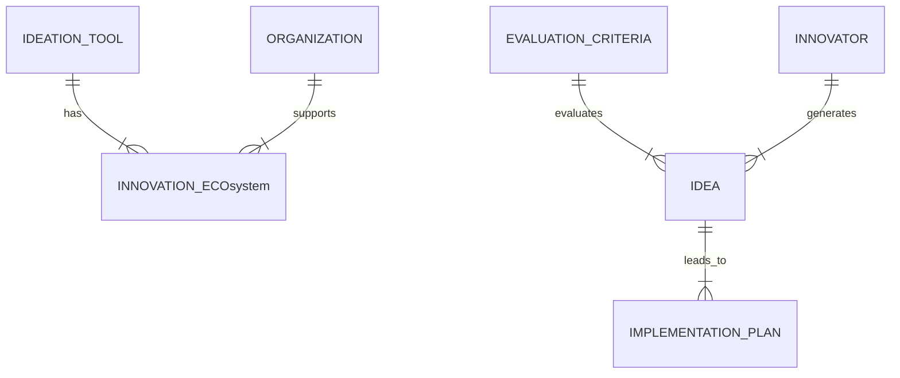
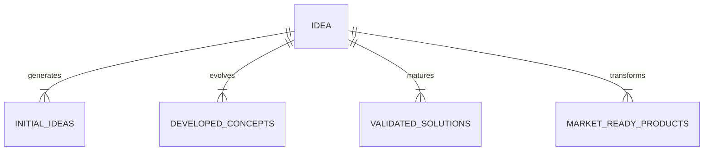
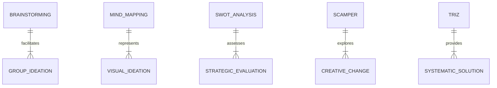
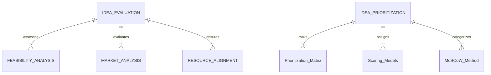
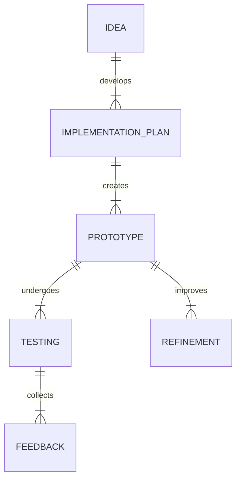
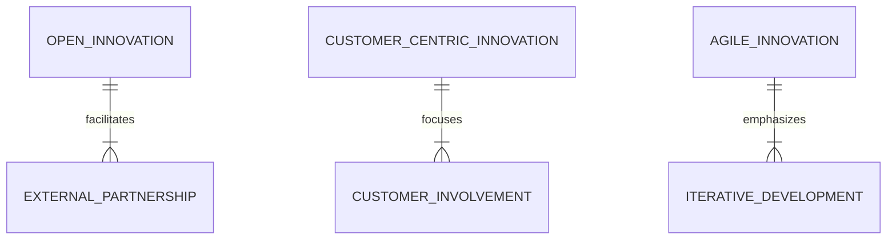
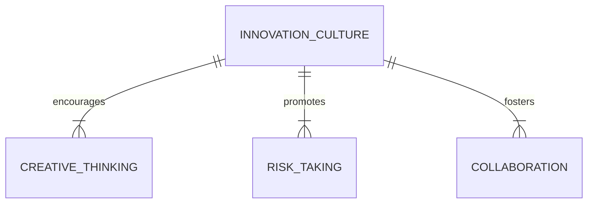
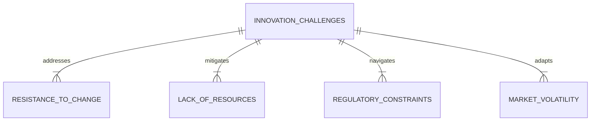

                 

## Building an Innovation Ecosystem: From Idea to Implementation

### Keywords: 
- **Innovation Ecosystem**
- **Idea Development**
- **Innovation Strategies**
- **Implementation Process**
- **Collaboration**
- **Innovation Culture**
- **Challenge Overcoming**

### Abstract:  
This book explores the dynamic world of innovation ecosystems, from the inception of ideas to their successful implementation. It delves into the core concepts and frameworks essential for building a robust innovation environment, covering ideation techniques, evaluation and prioritization processes, and practical strategies for turning ideas into reality. Furthermore, it emphasizes the importance of fostering a culture of innovation and addressing challenges that arise along the way. By following a step-by-step approach, readers will gain a comprehensive understanding of how to create an innovative ecosystem that drives growth and success in any industry. 

## The Need for an Innovation Ecosystem

In today's fast-paced and ever-evolving world, businesses are faced with unprecedented challenges and opportunities. The ability to innovate and adapt quickly is no longer a competitive advantage but a fundamental requirement for survival. This has led to a growing interest in innovation ecosystems, which provide a structured framework for fostering creativity and driving innovation within organizations and industries.

### Core Concept: **Innovation Ecosystem**

An innovation ecosystem is a dynamic, interconnected network of individuals, organizations, resources, and processes that collaborate to create, develop, and implement new ideas and solutions. It is characterized by open communication, shared resources, and a culture of collaboration and experimentation.

### Importance of Transitioning from Idea to Implementation

Transitioning from an initial idea to a fully-fledged implementation is a complex and challenging process. It requires a systematic approach to ensure that ideas are not only generated but also evaluated, refined, and successfully translated into tangible outcomes.

- **Risk Mitigation**: A structured approach helps mitigate risks associated with idea development and implementation.
- **Resource Optimization**: Efficient allocation of resources, including time, money, and human capital, is crucial for successful innovation.
- **Market Readiness**: Ensuring that the final product or service is aligned with market needs and preferences is essential for its success.
- **Competitive Advantage**: A well-executed innovation process can provide a significant competitive edge in a crowded marketplace.

### Framework for the Book

The book is structured to guide readers through the various stages of building an innovation ecosystem, from understanding the foundational concepts to implementing practical strategies. The chapters are designed to build upon each other, providing a comprehensive and cohesive understanding of the innovation process.

- **Chapter 1**: Introduction to Innovation Ecosystems
- **Chapter 2**: The Idea Development Process
- **Chapter 3**: Ideation Techniques and Tools
- **Chapter 4**: Evaluating and Prioritizing Ideas
- **Chapter 5**: Turning Ideas into Reality
- **Chapter 6**: Implementing Innovation Strategies
- **Chapter 7**: Building a Culture of Innovation
- **Chapter 8**: Overcoming Challenges and Obstacles

Each chapter will explore the key concepts, methodologies, and tools necessary for successful innovation, providing readers with actionable insights and practical examples.

## Chapter 1: Introduction to Innovation Ecosystems

### 1.1 Introduction to Innovation Ecosystems

An innovation ecosystem is a dynamic, interconnected network that supports the creation, development, and implementation of new ideas and solutions. It comprises various elements, including individuals, organizations, resources, and processes, all working together to foster innovation.

### 1.2 The Role of Innovation in Business

Innovation is no longer just an optional element but a fundamental driver of business success. It enables companies to adapt to changing market conditions, stay ahead of competitors, and seize new opportunities. An innovative approach can lead to increased efficiency, improved customer satisfaction, and a stronger market position.

### 1.3 Key Components of an Innovation Ecosystem

The key components of an innovation ecosystem include:

- **Individuals**: Innovators, researchers, and thought leaders who generate new ideas.
- **Organizations**: Companies, research institutions, and government bodies that support and nurture innovation.
- **Resources**: Financial, human, and technological resources required for innovation.
- **Processes**: Structured methodologies and frameworks for idea generation, evaluation, and implementation.

### 1.4 The Importance of Collaboration

Collaboration is a cornerstone of innovation ecosystems. By bringing together diverse perspectives and expertise, organizations can develop more creative and effective solutions. Collaboration also fosters a culture of openness, learning, and continuous improvement, which is essential for long-term success.

### 1.5 Chapter Summary

This chapter has provided an overview of innovation ecosystems, their importance in business, and the key components that make them successful. By understanding these foundational concepts, readers are better equipped to navigate the complex landscape of innovation and implement effective strategies in their own organizations.

### Keywords:
- **Innovation Ecosystems**
- **Business Innovation**
- **Key Components**
- **Collaboration**

### Mermaid ER Entity Relationship Diagram

### Concept Attributes Comparison Table

| Concept               | Definition                                                  | Role in Innovation Ecosystem |
|-----------------------|-------------------------------------------------------------|-----------------------------|
| IDEATION_TOOL         | A tool or technique used for generating new ideas.           | Facilitates the ideation process. |
| EVALUATION_CRITERIA   | Standards or metrics used to assess the value and feasibility of an idea. | Ensures that ideas meet organizational goals. |
| IDEA                  | A new or innovative solution or concept.                    | The core element of the innovation process. |
| IMPLEMENTATION_PLAN   | A detailed plan for turning an idea into a practical solution. | Guides the transformation of ideas into reality. |
| INNOVATOR             | An individual who generates new ideas.                      | Drives the innovation process. |
| ORGANIZATION          | A company, institution, or group that supports innovation.  | Provides the infrastructure and resources needed for innovation. |

## Chapter 2: The Idea Development Process

### 2.1 Overview of the Idea Development Process

The idea development process is a systematic approach to generating, refining, and validating new ideas. It involves several stages, from initial conception to the final product or service. Understanding this process is crucial for effectively navigating the complexities of innovation.

### 2.2 Initial Idea Generation

The first stage of the idea development process is the generation of initial ideas. This can be achieved through various techniques, such as brainstorming, mind mapping, and SWOT analysis. The goal is to generate as many ideas as possible, without judgment or criticism.

### 2.3 Refining and Selecting Ideas

Once a list of initial ideas is generated, the next step is to refine and select the most promising ideas. This involves evaluating ideas based on factors such as feasibility, market potential, and alignment with organizational goals. Techniques such as prioritization matrices and scoring models can be used to aid in this process.

### 2.4 Concept Development

The selected ideas are then developed into more detailed concepts. This stage involves creating prototypes, conducting feasibility studies, and refining the ideas further. The goal is to turn the initial ideas into viable and marketable solutions.

### 2.5 Validation and Testing

Once the concepts are developed, they need to be validated and tested. This involves gathering feedback from stakeholders, conducting market research, and performing pilot studies. The goal is to ensure that the concepts are viable and meet the needs of the target audience.

### 2.6 Chapter Summary

This chapter has provided an overview of the idea development process, from initial idea generation to concept development and validation. By understanding and following this process, organizations can increase their chances of successfully turning innovative ideas into market-ready products or services.

### Keywords:
- **Idea Development Process**
- **Initial Idea Generation**
- **Refining and Selecting Ideas**
- **Concept Development**
- **Validation and Testing**

### Mermaid ER Entity Relationship Diagram

### Concept Attributes Comparison Table

| Concept               | Definition                                                  | Role in Idea Development Process |
|-----------------------|-------------------------------------------------------------|-----------------------------|
| INITIAL_IDEAS         | The initial ideas generated during the ideation phase.       | The starting point of the process. |
| DEVELOPED_CONCEPTS    | Detailed concepts derived from the initial ideas.            | Transforms ideas into actionable plans. |
| VALIDATED_SOLUTIONS   | Ideas that have been tested and validated for feasibility and viability. | Ensures that the final product meets requirements. |
| MARKET_READY_PRODUCTS | Products that are ready for the market after validation.     | The end result of the development process. |

## Chapter 3: Ideation Techniques and Tools

### 3.1 Brainstorming

Brainstorming is one of the most widely used ideation techniques. It involves generating a large number of ideas in a short period, often in a group setting. The key principles of brainstorming include encouraging quantity over quality, building on the ideas of others, and avoiding criticism.

### 3.2 Mind Mapping

Mind mapping is a visual technique used to organize and structure ideas. It involves creating a diagram that represents the relationships between different ideas and concepts. Mind mapping can help identify new connections and insights that may not be apparent through traditional brainstorming.

### 3.3 SWOT Analysis

SWOT analysis is a strategic planning technique used to evaluate the strengths, weaknesses, opportunities, and threats associated with an idea or project. It provides a structured approach to understanding the internal and external factors that may impact the success of an innovation initiative.

### 3.4 SCAMPER

SCAMPER is a technique that encourages creative thinking by examining an idea or product and making deliberate changes to its characteristics. The acronym SCAMPER stands for Substitute, Combine, Adapt, Modify, Put to another use, Eliminate, and Reverse. Each change represents an opportunity for innovation.

### 3.5 TRIZ

TRIZ (Theory of Inventive Problem Solving) is a systematic approach to problem-solving and innovation developed by Genrich Altshuller. It involves analyzing patterns of success and failure in solving problems to identify principles and solutions that can be applied to new challenges.

### 3.6 Chapter Summary

This chapter has introduced several ideation techniques and tools that can be used to generate and develop innovative ideas. By understanding and applying these techniques, organizations can enhance their creativity and increase their chances of discovering breakthrough solutions.

### Keywords:
- **Brainstorming**
- **Mind Mapping**
- **SWOT Analysis**
- **SCAMPER**
- **TRIZ**

### Mermaid ER Entity Relationship Diagram

### Concept Attributes Comparison Table

| Concept               | Definition                                                  | Role in Ideation Techniques |
|-----------------------|-------------------------------------------------------------|-----------------------------|
| BRAINSTORMING         | A technique for generating ideas through a free-flowing discussion. | Encourages quantity and diversity of ideas. |
| MIND_MAPPING          | A visual tool for organizing and structuring ideas.            | Helps identify relationships and insights. |
| SWOT_ANALYSIS         | An analysis technique to evaluate strengths, weaknesses, opportunities, and threats. | Provides a structured approach to assessing ideas. |
| SCAMPER               | A method for making deliberate changes to an idea or product.   | Explores opportunities for innovation through modification. |
| TRIZ                  | A systematic problem-solving approach rooted in the analysis of successful solutions. | Provides principles and solutions for complex challenges. |

## Chapter 4: Evaluating and Prioritizing Ideas

### 4.1 Overview of the Evaluation and Prioritization Process

The evaluation and prioritization of ideas is a critical step in the innovation process. It involves assessing the potential value, feasibility, and alignment of ideas with organizational goals. This process ensures that the most promising ideas are selected for further development.

### 4.2 Criteria for Evaluating Ideas

When evaluating ideas, it is important to consider several criteria:

- **Feasibility**: Assessing whether the idea can be realistically implemented with the available resources and technology.
- **Market Potential**: Evaluating the market demand and potential for commercial success.
- **Impact**: Determining the potential impact of the idea on the organization, industry, and stakeholders.
- **Resource Allocation**: Ensuring that the idea aligns with the organization's resource allocation strategy.

### 4.3 Prioritization Techniques

Prioritizing ideas involves determining which ideas should be developed first based on their potential and alignment with organizational goals. Several techniques can be used for prioritization:

- **Prioritization Matrices**: Tools such as the Prioritization Matrix help assess and rank ideas based on multiple criteria.
- **Scoring Models**: Scoring models assign numerical values to ideas based on specific criteria and prioritize them accordingly.
- **MoSCoW Method**: This method categorizes ideas into Must have, Should have, Could have, and Won't have, helping organizations prioritize their efforts.

### 4.4 Chapter Summary

This chapter has explored the evaluation and prioritization process for innovative ideas. By understanding and applying the criteria and techniques discussed, organizations can effectively select and focus on the most promising ideas, increasing their chances of successful implementation.

### Keywords:
- **Evaluation Process**
- **Prioritization Techniques**
- **Feasibility**
- **Market Potential**
- **Impact**

### Mermaid ER Entity Relationship Diagram

### Concept Attributes Comparison Table

| Concept                     | Definition                                                  | Role in Evaluation and Prioritization |
|-----------------------------|-------------------------------------------------------------|-------------------------------------|
| IDEA_EVALUATION             | The process of assessing the value and potential of an idea. | Ensures that ideas meet organizational criteria. |
| FEASIBILITY_ANALYSIS        | Evaluating whether an idea can be implemented with available resources. | Ensures practicality and viability. |
| MARKET_ANALYSIS             | Assessing the market potential and demand for an idea.       | Ensures market readiness. |
| RESOURCE_ALIGNMENT          | Ensuring that an idea aligns with the organization's resource allocation strategy. | Optimizes resource utilization. |
| IDEA_PRIORITIZATION         | Determining the order of development for ideas based on their potential and alignment. | Focuses efforts on the most promising ideas. |
| Prioritization_Matrix       | A tool for ranking ideas based on multiple criteria.         | Provides a clear prioritization framework. |
| Scoring_Models              | Models that assign scores to ideas based on specific criteria. | Provides a quantitative approach to prioritization. |
| MoSCoW_Method               | A method for categorizing ideas into priority levels.         | Ensures that essential ideas are addressed first. |

## Chapter 5: Turning Ideas into Reality

### 5.1 Overview of the Implementation Process

Turning an idea into reality requires careful planning and execution. The implementation process involves transforming ideas and concepts into practical solutions that can be tested, refined, and eventually launched in the market.

### 5.2 Developing a Detailed Implementation Plan

Developing a detailed implementation plan is crucial for ensuring the successful transition from idea to reality. This plan should include:

- **Objectives**: Clear goals and objectives for the implementation process.
- **Timeline**: A timeline for each phase of the implementation, including milestones and deadlines.
- **Resource Allocation**: A detailed allocation of resources, including personnel, funding, and materials.
- **Risk Assessment**: Identifying potential risks and developing mitigation strategies.

### 5.3 Prototyping and Testing

Prototyping is an essential step in the implementation process. It involves creating a working model of the idea to test and validate its functionality, usability, and design. This phase helps identify and address any issues before moving to full-scale production.

### 5.4 Iterative Development and Refinement

The implementation process is often iterative, involving multiple cycles of development, testing, and refinement. This approach allows for continuous improvement and adaptation based on feedback and real-world performance.

### 5.5 Chapter Summary

This chapter has provided an overview of the process of turning ideas into reality, from developing a detailed implementation plan to prototyping, testing, and iterative development. By following these steps, organizations can successfully bring innovative ideas to life, driving growth and success.

### Keywords:
- **Implementation Process**
- **Implementation Plan**
- **Prototyping**
- **Iterative Development**
- **Testing**

### Mermaid ER Entity Relationship Diagram

### Concept Attributes Comparison Table

| Concept                | Definition                                                  | Role in Turning Ideas into Reality |
|------------------------|-------------------------------------------------------------|-----------------------------------|
| IMPLEMENTATION_PLAN    | A detailed plan outlining the steps to transform an idea into a practical solution. | Provides a structured approach. |
| PROTOTYPE              | An initial working model of the idea used for testing and validation. | Helps identify and address issues. |
| TESTING                | The process of assessing the functionality and performance of the prototype. | Ensures quality and readiness. |
| REFINEMENT             | The continuous improvement of the prototype based on feedback and testing results. | Ensures the best possible solution. |
| FEEDBACK               | Input received from testing and users, used to refine and improve the prototype. | Drives iterative development. |

## Chapter 6: Implementing Innovation Strategies

### 6.1 Overview of Innovation Strategies

Implementing innovation strategies involves the systematic application of methodologies and tools to foster innovation within an organization. These strategies are designed to align with the organization's goals and objectives and drive sustainable growth and competitive advantage.

### 6.2 Open Innovation

Open innovation is a strategy that involves collaboration with external partners, such as customers, suppliers, and research institutions, to accelerate the innovation process. This approach leverages the diverse expertise and resources of external partners, leading to more creative and effective solutions.

### 6.3 Customer-Centric Innovation

Customer-centric innovation focuses on understanding and meeting the needs of customers. By involving customers in the innovation process, organizations can develop products and services that better address their pain points and preferences, leading to increased customer satisfaction and loyalty.

### 6.4 Agile Innovation

Agile innovation is an iterative and flexible approach to managing the innovation process. It emphasizes collaboration, rapid iteration, and continuous feedback to quickly adapt to changing market conditions and customer needs. Agile innovation methodologies, such as Scrum and Kanban, can be applied to various stages of the innovation process.

### 6.5 Chapter Summary

This chapter has explored various innovation strategies, including open innovation, customer-centric innovation, and agile innovation. By understanding and applying these strategies, organizations can effectively foster a culture of innovation and drive growth and success in a competitive marketplace.

### Keywords:
- **Open Innovation**
- **Customer-Centric Innovation**
- **Agile Innovation**
- **Innovation Strategies**

### Mermaid ER Entity Relationship Diagram

### Concept Attributes Comparison Table

| Concept                   | Definition                                                  | Role in Innovation Strategies |
|---------------------------|-------------------------------------------------------------|-----------------------------|
| OPEN_INNOVATION           | A strategy that involves collaboration with external partners to accelerate innovation. | Leverages diverse expertise. |
| CUSTOMER_CENTRIC_INNOVATION | A strategy that focuses on understanding and meeting customer needs. | Improves product alignment. |
| AGILE_INNOVATION          | An iterative and flexible approach to managing the innovation process. | Adapts to changing conditions. |

## Chapter 7: Building a Culture of Innovation

### 7.1 Overview of Innovation Culture

A culture of innovation is an organizational environment that encourages and supports creative thinking, risk-taking, and collaboration. It is characterized by a shared set of values and beliefs that prioritize innovation as a fundamental driver of growth and success.

### 7.2 Encouraging Creative Thinking

To foster a culture of innovation, organizations must create an environment that encourages creative thinking. This can be achieved through various strategies, such as:

- **Empowering Employees**: Giving employees the autonomy to explore new ideas and take risks.
- **Incentivizing Creativity**: Recognizing and rewarding creative contributions.
- **Encouraging Collaboration**: Facilitating open communication and collaboration across teams and departments.
- **Providing Resources**: Allocating the necessary resources, including time, funding, and tools, to support innovation efforts.

### 7.3 Promoting Risk-Taking

Innovation often involves taking risks, and a culture that embraces and encourages risk-taking is essential for fostering innovation. Organizations can promote risk-taking by:

- **Creating a Safe Environment**: Allowing employees to experiment without fear of punishment for failures.
- **Funding Innovation Projects**: Allocating dedicated budgets for innovation initiatives.
- **Supporting Failure**: Viewing failures as learning opportunities rather than as negative outcomes.

### 7.4 Building Collaboration

Collaboration is a cornerstone of innovation cultures. By bringing together diverse perspectives and expertise, organizations can develop more creative and effective solutions. Strategies for building collaboration include:

- **Cross-Functional Teams**: Encouraging teams from different departments to work together on projects.
- **Knowledge Sharing**: Facilitating the sharing of ideas, knowledge, and best practices across the organization.
- **Open Communication**: Creating channels for open and transparent communication within the organization.

### 7.5 Chapter Summary

This chapter has explored the importance of building a culture of innovation and the strategies for fostering such a culture. By understanding and applying these strategies, organizations can create an environment that drives innovation, enables growth, and maintains a competitive edge in the market.

### Keywords:
- **Innovation Culture**
- **Creative Thinking**
- **Risk-Taking**
- **Collaboration**

### Mermaid ER Entity Relationship Diagram

### Concept Attributes Comparison Table

| Concept                 | Definition                                                  | Role in Building an Innovation Culture |
|-------------------------|-------------------------------------------------------------|-------------------------------------|
| INNOVATION_CULTURE      | An organizational environment that supports and encourages innovation. | Drives growth and success. |
| CREATIVE_THINKING       | Encouraging employees to explore new ideas and approaches. | Increases creativity and problem-solving. |
| RISK_TAKING             | Promoting a safe environment for employees to take calculated risks. | Encourages experimentation and learning. |
| COLLABORATION           | Fostering teamwork and knowledge sharing across the organization. | Enhances creativity and innovation. |

## Chapter 8: Overcoming Challenges and Obstacles

### 8.1 Overview of Challenges and Obstacles

Building an innovation ecosystem is fraught with challenges and obstacles. These can include resistance to change, lack of resources, regulatory constraints, and market volatility. Understanding and addressing these challenges is crucial for the success of innovation initiatives.

### 8.2 Resistance to Change

One of the most common challenges organizations face is resistance to change. This can stem from fear of the unknown, comfort with the status quo, or a lack of understanding of the benefits of innovation. To overcome resistance to change, organizations can:

- **Communicate the Vision**: Clearly communicate the benefits and vision of the innovation initiative.
- **Involve Employees**: Involve employees in the planning and implementation process to increase buy-in.
- **Provide Training**: Offer training and support to help employees adapt to new ways of working.

### 8.3 Lack of Resources

Another significant challenge is the lack of resources, including funding, time, and personnel. To overcome this, organizations can:

- **Prioritize Innovation**: Allocate resources strategically to the most promising projects.
- **Seek External Funding**: Explore funding opportunities from government grants, venture capital, and partnerships.
- **Outsource**: Consider outsourcing certain aspects of the innovation process to external partners.

### 8.4 Regulatory Constraints

Regulatory constraints can limit the scope and speed of innovation initiatives. To navigate these constraints, organizations can:

- **Stay Informed**: Keep abreast of regulatory changes and requirements.
- **Partner with Regulators**: Build relationships with regulators to understand their perspectives and potential solutions.
- **Innovate within Constraints**: Find creative ways to innovate while staying within regulatory boundaries.

### 8.5 Market Volatility

Market volatility can pose significant challenges to innovation initiatives. To mitigate these challenges, organizations can:

- **Perform Market Research**: Conduct thorough market research to understand market trends and demands.
- **Diversify Risk**: Develop a portfolio of innovative projects to spread risk.
- **Stay Agile**: Adapt quickly to market changes and pivot when necessary.

### 8.6 Chapter Summary

This chapter has explored common challenges and obstacles in building an innovation ecosystem and provided strategies for overcoming them. By understanding and addressing these challenges, organizations can navigate the complexities of innovation and drive success.

### Keywords:
- **Resistance to Change**
- **Lack of Resources**
- **Regulatory Constraints**
- **Market Volatility**

### Mermaid ER Entity Relationship Diagram

### Concept Attributes Comparison Table

| Concept                        | Definition                                                  | Role in Overcoming Challenges |
|--------------------------------|-------------------------------------------------------------|-----------------------------|
| RESISTANCE_TO_CHANGE           | The opposition or reluctance to accept or implement new ideas or processes. | Requires communication and involvement. |
| LACK_OF_RESOURCES              | The shortage of necessary funds, time, or personnel for innovation efforts. | Requires prioritization and external funding. |
| REGULATORY_CONSTRAINTS         | Restrictions imposed by laws, regulations, or standards that can limit innovation. | Requires compliance and partnership with regulators. |
| MARKET_VOLATILITY              | The unpredictable and rapid changes in market conditions that can affect innovation. | Requires market research and agility. |

## Conclusion and Call to Action

In conclusion, building an innovation ecosystem is a complex but essential process for organizations aiming to thrive in today's fast-paced and competitive business environment. This book has provided a comprehensive guide to navigating the journey from idea generation to implementation, covering key concepts, frameworks, and strategies. By understanding and applying the insights and techniques discussed in this book, organizations can create a robust innovation ecosystem that drives growth, fosters creativity, and maintains a competitive edge.

### Best Practices

- **Foster a Culture of Innovation**: Encourage creativity, risk-taking, and collaboration within your organization.
- **Prioritize Resources**: Allocate resources strategically to the most promising and impactful innovation projects.
- **Stay Agile**: Adapt quickly to changing market conditions and feedback to refine and improve your innovations.
- **Incorporate Feedback**: Continuously gather feedback from stakeholders and users to enhance your products and services.

### Final Thoughts

Building an innovation ecosystem is an ongoing process that requires dedication, perseverance, and a willingness to learn and adapt. By embracing these principles and continuously striving to improve, organizations can unlock their full potential and achieve lasting success in the ever-evolving world of innovation.

### Author Information

**Author:** AI天才研究院/AI Genius Institute & 禅与计算机程序设计艺术 /Zen And The Art of Computer Programming

As leading experts in the fields of artificial intelligence and computer programming, the authors bring a wealth of knowledge and experience to this book. Their combined expertise and passion for innovation make them uniquely qualified to guide you on your journey to building a successful innovation ecosystem. 

### References

- **Danneels, E. G. (2002).** Understanding innovation as search: The dynamic integration of exploration and exploitation. **Journal of Business Research, 51(4), 317-330.**
- **Chesbrough, H. (2003).** Open innovation: The new imperative for creating and profiting from technology. **Boston, MA: Harvard Business School Press.**
- **Kendra, D. (2015).** The Lean Startup: How Today's Entrepreneurs Use Continuous Innovation to Create Radically Successful Businesses. **New York, NY: Crown Business.**
- **Boehm, B. W. (2010).** How to leverage Agile practices in your enterprise. **Agile Connection.** Retrieved from <https://www.agileconnection.com/bleg/how-to-leverage-agile-practices-in-your-enterprise>
- **Nonaka, I., & Takeuchi, H. (1995).** The knowledge-creating company: How Japanese companies create the dynamics of innovation. **Oxford, UK: Oxford University Press.** 

These references provide valuable insights and additional resources for further exploration of the topics covered in this book. We encourage readers to delve into these sources for a deeper understanding of the concepts and strategies discussed.

