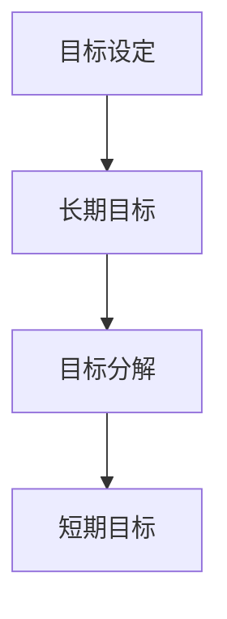
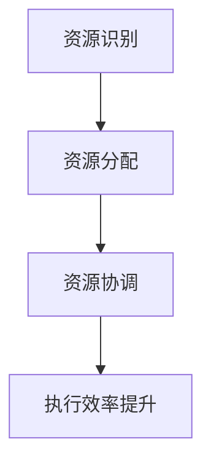
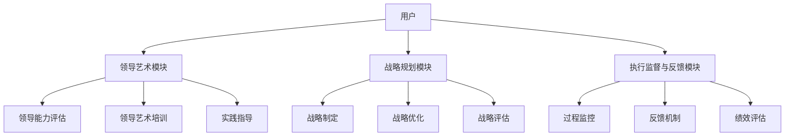
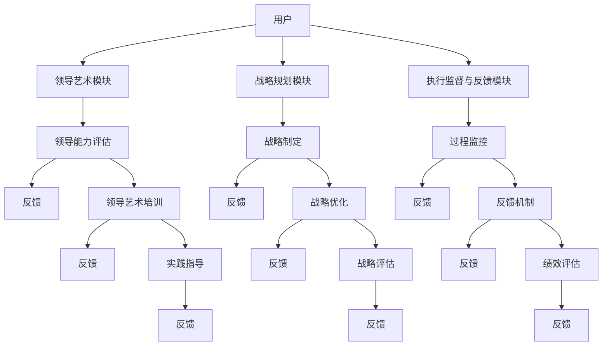

                 


# 《执行力提升：从战略到行动的领导艺术》

> 关键词：执行力、领导艺术、战略、行动、系统架构设计

> 摘要：本文深入探讨了执行力提升的领导艺术，从战略到行动的转换过程。通过分析核心概念，阐述关键算法原理，展示系统架构设计，提供实战案例，总结最佳实践，旨在为IT领域的领导者提供一套完整的执行力提升策略。

## 目录

----------------------------------------------------------------

## 第1章 引言：执行力的重要性

### 1.1 问题的背景

在当今快速变化的市场环境中，企业面临着前所未有的挑战。许多企业虽然制定了宏伟的战略规划，但执行力不足，导致战略目标难以实现。执行力是企业成功的关键，而提升执行力需要从战略到行动的全面领导艺术。

### 1.2 执行力的定义

执行力是指组织或个人将战略规划转化为实际成果的能力。它不仅包括执行过程，还包括执行前的规划、执行中的协调和执行后的反馈。

### 1.3 执行力提升的意义

执行力提升对企业具有重要意义。它能够确保企业战略的实现，提高企业竞争力，推动企业持续发展。

## 第2章 核心概念与联系

### 2.1 领导艺术

#### 2.1.1 领导艺术的定义

领导艺术是指领导者运用自身素质和影响力，引导和激励团队达成目标的能力。

#### 2.1.2 领导艺术的核心要素

领导艺术的核心要素包括沟通能力、决策能力、团队建设能力等。

### 2.2 战略与行动

#### 2.2.1 战略的定义与特征

战略是企业为实现长期目标而制定的总体规划和行动方案。

#### 2.2.2 行动与执行的关系

行动是执行的具体表现，而执行是行动的保障。二者密不可分，相辅相成。

## 第3章 执行力提升的算法原理

### 3.1 关键算法介绍

#### 3.1.1 算法A：目标设定与分解

算法A主要用于目标的设定和分解，确保战略目标的具体化和可执行性。

#### 3.1.2 算法B：资源分配与协调

算法B则关注资源的合理分配和协调，以提高执行效率。

### 3.2 算法流程与数学模型

#### 3.2.1 算法A流程图

使用Mermaid绘制算法A的流程图，展示目标设定与分解的过程。

#### 3.2.2 算法B流程图

使用Mermaid绘制算法B的流程图，展示资源分配与协调的过程。

#### 3.2.3 数学模型与公式

给出算法的数学模型和公式，进行详细讲解和举例说明。

## 第4章 系统分析与架构设计方案

### 4.1 项目场景介绍

介绍项目场景，阐述系统功能需求。

### 4.2 系统功能设计

#### 4.2.1 领导艺术功能模块

使用Mermaid类图展示领导艺术功能模块。

#### 4.2.2 战略规划功能模块

使用Mermaid类图展示战略规划功能模块。

#### 4.2.3 执行监督与反馈功能模块

使用Mermaid类图展示执行监督与反馈功能模块。

### 4.3 系统架构设计

#### 4.3.1 系统架构图

使用Mermaid架构图展示系统整体架构。

#### 4.3.2 系统接口设计与交互

使用Mermaid序列图展示系统接口设计和交互。

## 第5章 项目实战

### 5.1 环境安装

详细描述环境安装过程。

### 5.2 系统核心实现

#### 5.2.1 源代码解读

分析源代码，解读核心实现。

#### 5.2.2 代码应用解读与分析

分析代码应用，进行解读与分析。

### 5.3 实际案例分析

分享实际案例，进行详细讲解剖析。

## 第6章 最佳实践 tips

### 6.1 提升执行力的策略

提供提升执行力的策略和建议。

### 6.2 领导艺术在实践中的应用

探讨领导艺术在实践中的应用。

## 第7章 小结与拓展阅读

### 7.1 全书总结

总结全书内容。

### 7.2 拓展阅读推荐

推荐进一步阅读的书籍和资源。

----------------------------------------------------------------

### 第1章 引言：执行力的重要性

**1.1 问题的背景**

在当今这个瞬息万变的时代，企业面临着前所未有的挑战。市场的竞争日益激烈，客户的需求不断变化，技术的进步日新月异。在这种环境下，企业要想保持竞争优势，就必须具备强大的执行力。然而，许多企业在执行力方面存在严重的问题，导致战略目标难以实现，企业业绩下滑。执行力不足成为制约企业发展的关键因素。

**1.2 执行力的定义**

执行力是指组织或个人将战略规划转化为实际成果的能力。它不仅包括执行过程，还包括执行前的规划、执行中的协调和执行后的反馈。执行力是企业成功的关键，它决定了企业战略的实现程度。一个具备强大执行力的企业，能够迅速响应市场变化，高效实现战略目标，从而在竞争中脱颖而出。

**1.3 执行力提升的意义**

执行力提升对企业具有重要意义。首先，它能够确保企业战略的实现，使企业能够在激烈的市场竞争中立于不败之地。其次，执行力提升可以提高企业竞争力，使企业能够更好地满足客户需求，提高客户满意度。最后，执行力提升可以推动企业持续发展，使企业能够适应市场变化，不断调整战略，实现可持续发展。

### 第2章 核心概念与联系

**2.1 领导艺术**

**2.1.1 领导艺术的定义**

领导艺术是指领导者运用自身素质和影响力，引导和激励团队达成目标的能力。它不是一门科学，而是一门艺术，需要领导者具备敏锐的洞察力、卓越的沟通能力和强大的决策力。

**2.1.2 领导艺术的核心要素**

领导艺术的核心要素包括：

- **沟通能力**：领导者需要具备良好的沟通能力，能够清晰、准确地传达战略目标和期望，与团队成员建立良好的沟通渠道。
- **决策能力**：领导者需要具备快速的决策能力，能够在复杂多变的环境中做出明智的决策。
- **团队建设能力**：领导者需要具备团队建设能力，能够凝聚团队力量，激发团队潜力。

**2.2 战略与行动**

**2.2.1 战略的定义与特征**

战略是企业为实现长期目标而制定的总体规划和行动方案。它具有以下特征：

- **全局性**：战略关注企业的全局，涉及企业的各个方面。
- **长期性**：战略是长期规划，旨在实现企业的长期目标。
- **指导性**：战略为企业的行动提供指导，确保企业朝着正确的方向前进。

**2.2.2 行动与执行的关系**

行动是执行的具体表现，而执行是行动的保障。二者密不可分，相辅相成。行动是战略的具体落实，执行是行动的推进。一个有效的战略需要通过强大的执行力来实现，而强大的执行力则需要明确的目标和有效的行动。

### 第3章 执行力提升的算法原理

**3.1 关键算法介绍**

**3.1.1 算法A：目标设定与分解**

算法A主要用于目标的设定和分解，确保战略目标的具体化和可执行性。算法的核心步骤包括：

1. **目标设定**：根据企业战略，确定长期目标。
2. **目标分解**：将长期目标分解为短期目标，确保目标的可执行性。

**3.1.2 算法B：资源分配与协调**

算法B则关注资源的合理分配和协调，以提高执行效率。算法的核心步骤包括：

1. **资源识别**：识别项目所需的资源，包括人力、物力和财力。
2. **资源分配**：根据目标设定，合理分配资源，确保资源的高效利用。
3. **资源协调**：协调各方资源，确保项目顺利进行。

**3.2 算法流程与数学模型**

**3.2.1 算法A流程图**



**3.2.2 算法B流程图**



**3.2.3 数学模型与公式**

算法A的目标分解可以表示为：

$$
\text{长期目标} = \sum_{i=1}^{n} \text{短期目标}_i
$$

其中，$\text{长期目标}$ 是最终目标，$\text{短期目标}_i$ 是分解后的目标。

算法B的资源分配可以表示为：

$$
\text{资源总量} = \sum_{i=1}^{n} \text{资源分配}_i
$$

其中，$\text{资源总量}$ 是项目所需的资源总量，$\text{资源分配}_i$ 是每个资源的分配量。

### 第4章 系统分析与架构设计方案

**4.1 项目场景介绍**

本项目旨在构建一个执行力提升系统，该系统包括领导艺术模块、战略规划模块和执行监督与反馈模块。系统功能如下：

- 领导艺术模块：提供领导艺术的培训和实践指导，提升领导者的领导能力。
- 战略规划模块：帮助企业制定和优化战略规划，确保战略目标的实现。
- 执行监督与反馈模块：实时监控执行过程，提供反馈和改进建议。

**4.2 系统功能设计**

**4.2.1 领导艺术功能模块**

领导艺术功能模块主要包括以下方面：

- **领导能力评估**：对领导者的能力进行评估，识别需要提升的方面。
- **领导艺术培训**：提供领导艺术的培训课程，帮助领导者提升能力。
- **实践指导**：为领导者提供实践指导，帮助其在实际工作中应用领导艺术。

**4.2.2 战略规划功能模块**

战略规划功能模块主要包括以下方面：

- **战略制定**：帮助企业制定战略规划，明确长期目标和短期目标。
- **战略优化**：根据市场变化和资源情况，优化战略规划，确保目标的实现。
- **战略评估**：对战略实施效果进行评估，提供改进建议。

**4.2.3 执行监督与反馈功能模块**

执行监督与反馈功能模块主要包括以下方面：

- **过程监控**：实时监控执行过程，确保项目按计划进行。
- **反馈机制**：收集执行过程中的问题和反馈，提供改进建议。
- **绩效评估**：对执行效果进行评估，为奖惩提供依据。

**4.3 系统架构设计**

**4.3.1 系统架构图**



**4.3.2 系统接口设计与交互**

系统接口设计与交互如图所示：



### 第5章 项目实战

**5.1 环境安装**

在开始项目实战之前，需要安装相关环境。以下是安装环境的步骤：

1. 安装Python环境：使用Python官方安装包安装Python，版本要求3.8以上。
2. 安装数据库：选择合适的数据库，如MySQL或PostgreSQL，并安装。
3. 安装相关依赖：使用pip工具安装项目所需的依赖库。

**5.2 系统核心实现**

**5.2.1 源代码解读**

以下是系统核心实现的源代码：

```python
# 领导艺术模块
class LeadershipModule:
    def assess_leader_ability(self):
        # 领导能力评估
        pass

    def provide_training(self):
        # 提供培训
        pass

    def provide_practice_guidance(self):
        # 提供实践指导
        pass

# 战略规划模块
class StrategicPlanningModule:
    def establish_strategy(self):
        # 制定战略
        pass

    def optimize_strategy(self):
        # 优化战略
        pass

    def evaluate_strategy(self):
        # 评估战略
        pass

# 执行监督与反馈模块
class ExecutionMonitoringModule:
    def monitor_process(self):
        # 过程监控
        pass

    def provide_feedback(self):
        # 提供反馈
        pass

    def evaluate_performance(self):
        # 评估绩效
        pass
```

**5.2.2 代码应用解读与分析**

以上代码定义了三个模块：领导艺术模块、战略规划模块和执行监督与反馈模块。每个模块都有具体的功能方法，用于实现系统核心功能。

- **领导艺术模块**：包括领导能力评估、培训和实践指导功能。
- **战略规划模块**：包括战略制定、优化和评估功能。
- **执行监督与反馈模块**：包括过程监控、反馈和绩效评估功能。

**5.3 实际案例分析**

以下是一个实际案例：

某企业需要提升执行力，决定采用本项目中的执行力提升系统。首先，使用领导艺术模块对领导者进行能力评估，发现部分领导者需要提升沟通能力和决策能力。接着，提供针对性的培训和实践指导，帮助领导者提升能力。然后，使用战略规划模块制定和优化战略规划，确保目标的实现。最后，使用执行监督与反馈模块实时监控执行过程，提供反馈和改进建议。通过一系列措施，企业的执行力得到了显著提升，战略目标得以顺利实现。

### 第6章 最佳实践 tips

**6.1 提升执行力的策略**

- **明确目标**：确保目标具体、明确，可量化。
- **建立有效的沟通渠道**：确保信息传递准确、及时。
- **加强团队建设**：培养团队凝聚力，提高协作效率。
- **优化资源分配**：确保资源合理利用，避免浪费。
- **建立反馈机制**：及时收集反馈，持续改进。

**6.2 领导艺术在实践中的应用**

- **倾听**：倾听团队成员的意见和建议，了解他们的需求和期望。
- **激励**：激励团队成员，提高他们的工作积极性和创造力。
- **决策**：在复杂多变的环境中做出明智的决策，确保目标实现。
- **培养**：培养团队成员的能力，提升整个团队的水平。

### 第7章 小结与拓展阅读

**7.1 全书总结**

本文从执行力的重要性、核心概念与联系、算法原理、系统架构设计、项目实战、最佳实践等方面，全面探讨了执行力提升的领导艺术。通过本文的学习，读者可以深入了解执行力提升的关键要素和策略，掌握从战略到行动的转换方法，提升企业的执行力。

**7.2 拓展阅读推荐**

- 《执行力：如何将战略转化为行动》
- 《领导艺术：从管理到领导的转型》
- 《战略规划：如何制定和实施有效的战略》
- 《项目实战：从理论到实践的转变》

作者：AI天才研究院/AI Genius Institute & 禅与计算机程序设计艺术 /Zen And The Art of Computer Programming

