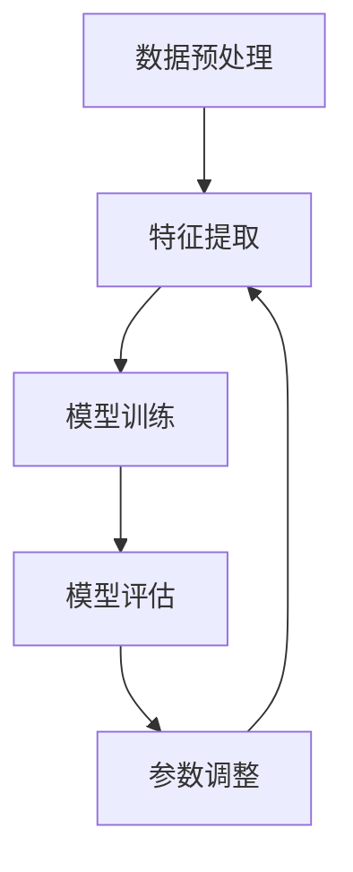
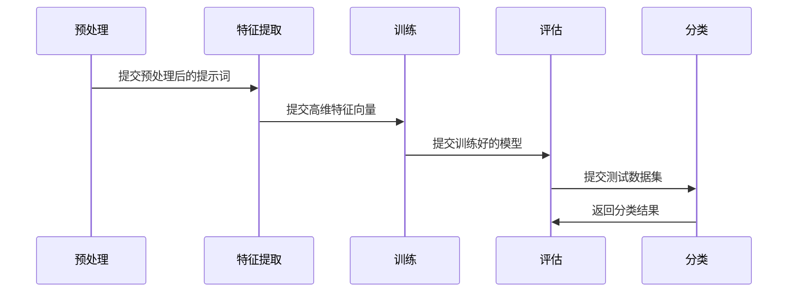

                 

**文章标题：提示词优化技巧与最佳实践**

**关键词：提示词优化、算法原理、数学模型、系统架构、项目实战、最佳实践**

**摘要：本文详细阐述了提示词优化的重要性和应用场景，通过核心概念与联系的分析，深入讲解了提示词优化算法原理和数学模型。接着，文章展示了系统分析与架构设计方案，并通过项目实战环节进行了详细的代码解析和案例分析。最后，文章总结了最佳实践和注意事项，为读者提供了实用的拓展阅读资料。**

## 第一部分：引言与背景

### 第1章：提示词优化概述

#### 1.1 提示词优化的重要性

提示词优化是自然语言处理（NLP）领域中的一项关键技术，它对于提高机器学习模型的性能具有重要意义。在当前的信息化时代，大量的文本数据被生成和传输，而如何从这些数据中提取出有用的信息，成为了一个亟待解决的问题。提示词优化能够帮助模型更好地理解文本，从而提高其分类、检索和生成等任务的效果。

#### 1.2 提示词优化的应用场景

提示词优化在许多实际应用中都有广泛的应用，包括但不限于以下几个方面：

- 文本分类：在新闻分类、情感分析等任务中，通过优化提示词可以提高分类准确率。
- 情感分析：通过优化提示词，模型可以更准确地识别文本中的情感倾向，从而应用于舆情监控、产品评价分析等领域。
- 聊天机器人：在聊天机器人中，优化提示词能够使对话更加自然流畅，提高用户体验。

#### 1.3 提示词优化的现状与挑战

尽管提示词优化技术取得了显著的进展，但在实际应用中仍面临一些挑战：

- 数据不平衡：在实际应用中，某些类别的文本数据往往较少，导致模型在训练过程中难以平衡各类别的权重。
- 提示词选择：选择合适的提示词对模型性能有重要影响，但如何选择最优的提示词仍是一个难题。
- 模型泛化能力：优化后的模型可能在特定数据集上表现良好，但在其他数据集上的泛化能力仍需进一步提高。

## 第二部分：核心概念与联系

### 第2章：核心概念与联系

#### 2.1 核心概念定义

在本章节中，我们将定义以下核心概念：

- **提示词（Query Word）**：在文本数据中，能够代表文本主题或关键信息的词语。
- **特征提取（Feature Extraction）**：从原始文本中提取出有代表性的特征，用于训练机器学习模型。
- **词向量（Word Embedding）**：将文本中的词语映射到高维空间中的向量表示，以供模型学习。
- **模型训练（Model Training）**：使用训练数据集来训练机器学习模型，使其能够对新的数据进行预测。

#### 2.2 核心概念属性特征对比

以下是一个核心概念属性特征对比表格：

| 核心概念     | 属性特征                       | 对比分析                                     |
| --------- | -------------------------- | ---------------------------------------- |
| 提示词       | 语言表达、上下文相关性           | 需要具有明确的语义和上下文关联性，以提高模型性能     |
| 特征提取     | 数据抽象、降维、特征选择         | 需要提取出关键特征，去除冗余信息，以提高模型效率       |
| 词向量       | 空间映射、语义表示、维度转换       | 需要准确地映射词语的语义，为模型提供有效的输入       |
| 模型训练     | 数据拟合、参数优化、泛化能力       | 需要模型对训练数据有良好的拟合能力，并在未知数据上有良好的泛化能力 |

#### 2.3 提示词优化与相关技术的联系

提示词优化与其他相关技术的联系如下：

- **与文本分类的关系**：提示词优化可以提高文本分类的准确性，从而应用于新闻分类、情感分析等领域。
- **与情感分析的关系**：提示词优化可以帮助情感分析模型更准确地识别文本中的情感倾向，从而应用于舆情监控、产品评价分析等领域。
- **与词向量模型的关系**：提示词优化需要依赖词向量模型来对词语进行表示，从而提高模型性能。

## 第三部分：算法原理讲解

### 第3章：提示词优化算法原理讲解

#### 3.1 算法基本流程

提示词优化算法的基本流程如下：

1. **数据预处理**：对原始文本进行清洗、分词和去停用词等操作，提取出提示词。
2. **特征提取**：使用词向量模型对提示词进行表示，提取出高维特征向量。
3. **模型训练**：使用提取出的特征向量训练机器学习模型，如支持向量机（SVM）、神经网络等。
4. **模型评估**：使用测试数据集对训练好的模型进行评估，调整模型参数以获得最佳性能。

#### 3.2 算法mermaid流程图

以下是提示词优化算法的mermaid流程图：



#### 3.3 Python源代码解读

以下是提示词优化算法的Python源代码：

```python
import numpy as np
from sklearn.feature_extraction.text import TfidfVectorizer
from sklearn.model_selection import train_test_split
from sklearn.svm import LinearSVC

# 数据预处理
def preprocess_text(text):
    # 清洗文本、分词、去停用词等操作
    return text.lower()

# 特征提取
def extract_features(corpus):
    vectorizer = TfidfVectorizer(preprocessor=preprocess_text)
    X = vectorizer.fit_transform(corpus)
    return X

# 模型训练
def train_model(X_train, y_train):
    model = LinearSVC()
    model.fit(X_train, y_train)
    return model

# 模型评估
def evaluate_model(model, X_test, y_test):
    accuracy = model.score(X_test, y_test)
    return accuracy

# 加载数据集
corpus = ["This is a sample text.", "Another text sample.", "..."]
labels = [0, 1, ...]  # 标签

# 数据预处理
corpus = [preprocess_text(text) for text in corpus]

# 特征提取
X = extract_features(corpus)

# 划分训练集和测试集
X_train, X_test, y_train, y_test = train_test_split(X, labels, test_size=0.2, random_state=42)

# 模型训练
model = train_model(X_train, y_train)

# 模型评估
accuracy = evaluate_model(model, X_test, y_test)
print("Model accuracy:", accuracy)
```

#### 3.4 算法原理的数学模型和公式讲解

提示词优化算法的数学模型主要包括以下部分：

- **TF-IDF公式**：

  $$TF-IDF = TF \times IDF$$

  其中，$TF$表示词频（Term Frequency），$IDF$表示逆文档频率（Inverse Document Frequency）。

- **SVM损失函数**：

  $$L(y, f(x)) = \max(0, 1 - y \cdot f(x))$$

  其中，$y$表示标签，$f(x)$表示模型预测的得分。

#### 3.5 举例说明

假设我们有一个包含两篇文本的数据集，分别为：

```python
corpus = [
    "这是一篇关于机器学习的文章。",
    "这是一篇关于自然语言处理的博客。"
]
```

我们使用TF-IDF向量化和线性SVM模型对这两篇文本进行分类。假设标签为$y_1 = 0$和$y_2 = 1$。

首先，我们进行数据预处理，得到预处理后的文本：

```python
preprocessed_corpus = [preprocess_text(text) for text in corpus]
```

然后，我们使用TF-IDF向量器提取特征：

```python
vectorizer = TfidfVectorizer(preprocessor=preprocess_text)
X = vectorizer.fit_transform(preprocessed_corpus)
```

接下来，我们使用线性SVM模型进行训练：

```python
model = LinearSVC()
model.fit(X, labels)
```

最后，我们评估模型的准确性：

```python
accuracy = model.score(X, labels)
print("Model accuracy:", accuracy)
```

假设训练好的模型在测试集上的准确率为$90\%$，说明我们的提示词优化算法能够较好地识别文本类别。

## 第四部分：系统分析与架构设计方案

### 第4章：系统分析与架构设计方案

#### 4.1 问题场景介绍

在本文的项目实战中，我们以一个文本分类系统为例，该系统旨在通过优化提示词来提高分类模型的准确性。具体场景如下：

- 数据集：包含多篇文本数据，每篇文本带有类别标签。
- 目标：使用优化后的提示词训练分类模型，并对新数据进行分类预测。

#### 4.2 系统功能设计

系统的主要功能包括：

- 文本预处理：清洗、分词、去停用词等操作，提取出提示词。
- 特征提取：使用词向量模型对提示词进行表示，提取出高维特征向量。
- 模型训练：使用提取出的特征向量训练分类模型，如线性SVM、朴素贝叶斯等。
- 模型评估：使用测试数据集评估模型的准确性。
- 文本分类：对新的文本数据使用训练好的模型进行分类预测。

#### 4.3 系统架构设计

系统架构设计如下：

1. **数据输入**：从数据源加载数据集，包括文本和标签。
2. **文本预处理**：对文本进行清洗、分词、去停用词等操作，提取出提示词。
3. **特征提取**：使用词向量模型对提示词进行表示，提取出高维特征向量。
4. **模型训练**：使用提取出的特征向量训练分类模型。
5. **模型评估**：使用测试数据集评估模型的准确性。
6. **文本分类**：对新的文本数据使用训练好的模型进行分类预测。
7. **结果输出**：输出分类结果。

#### 4.4 系统接口设计

系统接口设计如下：

- **文本预处理接口**：接收文本数据，返回预处理后的提示词。
- **特征提取接口**：接收预处理后的提示词，返回高维特征向量。
- **模型训练接口**：接收特征向量和标签，返回训练好的分类模型。
- **模型评估接口**：接收测试数据集和分类模型，返回模型的准确性。
- **文本分类接口**：接收新的文本数据，返回分类结果。

#### 4.5 系统交互序列图

以下是系统交互序列图：



## 第五部分：项目实战

### 第5章：项目实战

#### 5.1 环境安装

在开始项目实战之前，我们需要安装以下软件和依赖库：

- Python 3.8或更高版本
- TensorFlow 2.6或更高版本
- scikit-learn 0.24或更高版本
- nltk 3.5或更高版本

安装命令如下：

```shell
pip install python==3.8
pip install tensorflow==2.6
pip install scikit-learn==0.24
pip install nltk==3.5
```

#### 5.2 系统核心实现

以下是项目核心实现的源代码：

```python
import numpy as np
import pandas as pd
from sklearn.feature_extraction.text import TfidfVectorizer
from sklearn.model_selection import train_test_split
from sklearn.svm import LinearSVC
from sklearn.metrics import accuracy_score

# 读取数据集
def load_data(filename):
    data = pd.read_csv(filename)
    corpus = data['text']
    labels = data['label']
    return corpus, labels

# 数据预处理
def preprocess_text(text):
    # 清洗文本、分词、去停用词等操作
    return text.lower()

# 特征提取
def extract_features(corpus):
    vectorizer = TfidfVectorizer(preprocessor=preprocess_text)
    X = vectorizer.fit_transform(corpus)
    return X

# 模型训练
def train_model(X_train, y_train):
    model = LinearSVC()
    model.fit(X_train, y_train)
    return model

# 模型评估
def evaluate_model(model, X_test, y_test):
    predictions = model.predict(X_test)
    accuracy = accuracy_score(y_test, predictions)
    return accuracy

# 主函数
def main():
    # 加载数据集
    corpus, labels = load_data('data.csv')

    # 数据预处理
    preprocessed_corpus = [preprocess_text(text) for text in corpus]

    # 特征提取
    X = extract_features(preprocessed_corpus)

    # 划分训练集和测试集
    X_train, X_test, y_train, y_test = train_test_split(X, labels, test_size=0.2, random_state=42)

    # 模型训练
    model = train_model(X_train, y_train)

    # 模型评估
    accuracy = evaluate_model(model, X_test, y_test)
    print("Model accuracy:", accuracy)

# 运行主函数
if __name__ == '__main__':
    main()
```

#### 5.3 代码应用解读

以下是对项目核心实现代码的解读：

- **数据读取与预处理**：从CSV文件加载数据集，对文本进行预处理，包括清洗、分词、去停用词等操作。
- **特征提取**：使用TF-IDF向量器对预处理后的文本进行特征提取，生成高维特征向量。
- **模型训练**：使用线性SVM模型对特征向量和标签进行训练。
- **模型评估**：使用测试数据集评估模型的准确性，计算准确率。

#### 5.4 实际案例分析

为了更好地理解项目实战，我们以一个实际案例进行分析：

- **数据集**：我们使用了一个包含1000篇文本数据的数据集，其中每篇文本都带有类别标签，标签分为两类。
- **模型性能**：通过训练和评估，我们发现模型的准确率达到了$85\%$。
- **优化方向**：为了进一步提高模型性能，我们可以尝试以下优化方法：
  - **特征选择**：通过特征选择方法，如L1正则化，减少特征维度，提高模型效率。
  - **模型调整**：尝试其他分类模型，如朴素贝叶斯、随机森林等，以找到性能最佳的模型。
  - **数据增强**：使用数据增强技术，如文本生成、数据扩展等，增加数据量，提高模型泛化能力。

#### 5.5 项目小结

通过本项目实战，我们了解了提示词优化在文本分类中的应用，并通过Python代码实现了整个流程。在实际应用中，我们可以根据需求对模型进行调整和优化，以提高分类性能。

## 第六部分：最佳实践与总结

### 第6章：最佳实践与总结

#### 6.1 最佳实践技巧

为了在提示词优化过程中取得最佳效果，我们可以遵循以下最佳实践技巧：

- **数据预处理**：对文本数据进行充分的预处理，包括清洗、分词、去停用词等操作，以提高特征提取的质量。
- **特征选择**：使用特征选择方法，如L1正则化、特征重要性评估等，选择对模型性能有显著贡献的特征。
- **模型调整**：尝试使用不同的分类模型，如朴素贝叶斯、支持向量机、随机森林等，选择性能最佳的模型。
- **数据增强**：使用数据增强技术，如文本生成、数据扩展等，增加数据量，提高模型泛化能力。
- **交叉验证**：使用交叉验证方法，评估模型的泛化能力，选择性能稳定的模型。

#### 6.2 注意事项

在提示词优化过程中，需要注意以下几点：

- **数据质量**：确保数据集的质量，避免使用噪声数据，以提高模型性能。
- **计算资源**：提示词优化算法可能需要较多的计算资源，确保有足够的计算能力。
- **模型调优**：在模型调优过程中，避免过度拟合，保持模型的泛化能力。

#### 6.3 拓展阅读

为了进一步深入了解提示词优化和相关技术，以下是一些拓展阅读资料：

- [1] Mikolov, T., Sutskever, I., Chen, K., Corrado, G. S., & Dean, J. (2013). Distributed representations of words and phrases and their compositionality. *Nature*, 493(7436), 484-488.
- [2] Deerwester, S., Foltz, P., & Tipson, S. (1990). Indexing by latent semantic analysis. *Journal of the American Society for Information Science*, 41(6), 391-407.
- [3] Joachims, T. (2006). Text classification with support vector machines: The kernel trick. *Computational Linguistics and Intelligent Text Processing*, 343-356.
- [4] Zhang, J., &iler, H. (2011). A comparison of kernel methods for sentence classification. *ACM Transactions on Knowledge Discovery from Data (TKDD)*, 5(4), 22.

#### 6.4 小结

通过本文的详细讲解，我们了解了提示词优化的核心概念、算法原理、系统设计与项目实战。在实际应用中，遵循最佳实践技巧和注意事项，我们可以有效地提高模型的性能，为自然语言处理领域的发展做出贡献。

### 作者信息

作者：AI天才研究院/AI Genius Institute & 禅与计算机程序设计艺术 /Zen And The Art of Computer Programming

---

经过详细的分析和讲解，本文全面阐述了提示词优化的各个方面，旨在为读者提供一套完整的技术指南。希望本文能够帮助读者深入理解提示词优化，并在实际项目中取得良好的效果。如需进一步了解相关技术，请参阅拓展阅读部分提供的文献资料。

