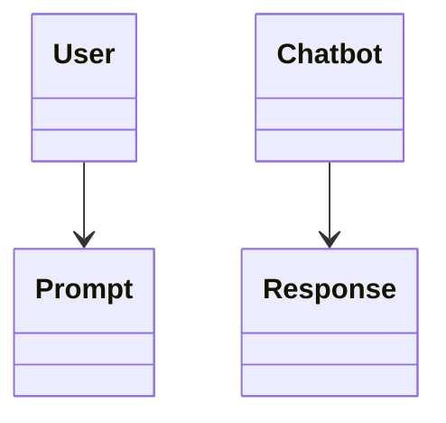
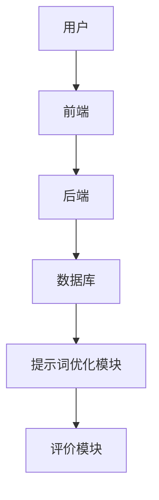
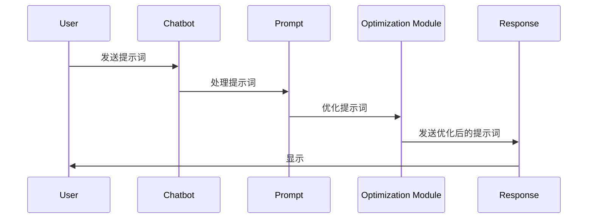
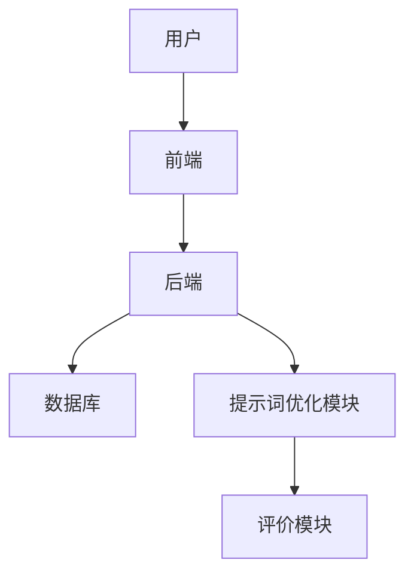

                 

# 提示词优化技巧：提升AI输出质量的艺术

## 关键词
- 提示词优化
- 人工智能
- 输出质量
- 算法
- 系统设计

## 摘要
本文旨在探讨提升人工智能（AI）输出质量的关键技术——提示词优化。通过深入分析提示词优化的原理、算法及其实际应用，本文将帮助读者了解如何设计高质量的提示词，从而优化AI的输出结果。文章将分为四个部分，首先介绍背景知识，其次阐述核心概念和联系，接着详细讲解算法原理，最后探讨系统分析与架构设计。通过本文，读者将掌握提示词优化这一提升AI输出质量的艺术。

----------------------------------------------------------------

## 目录大纲

# 提示词优化技巧：提升AI输出质量的艺术

## 第一部分：背景介绍

### 1.1 问题背景

#### 1.1.1 人工智能与提示词

#### 1.1.2 AI输出质量的重要性

#### 1.1.3 当前AI输出质量问题分析

### 1.2 问题描述

#### 1.2.1 提示词设计的影响因素

#### 1.2.2 提示词优化目标

#### 1.2.3 提示词优化的意义与挑战

### 1.3 问题解决

#### 1.3.1 提示词优化的基本方法

#### 1.3.2 提示词优化的技术路径

### 1.4 边界与外延

#### 1.4.1 提示词优化在不同场景中的应用

#### 1.4.2 提示词优化与相关技术的关系

### 1.5 概念结构与核心要素组成

#### 1.5.1 提示词优化的核心概念

#### 1.5.2 提示词优化的关键要素

### 1.6 本章小结

### 1.7 拓展阅读

## 第二部分：核心概念与联系

### 2.1 提示词优化原理

#### 2.1.1 提示词优化的原理分析

#### 2.1.2 提示词优化中的相关理论

#### 2.1.3 提示词优化中的关键要素

### 2.2 概念属性特征对比表格

| 特征 | 描述 |
| --- | --- |
| 1 | ... |
| 2 | ... |
| ... | ... |

### 2.3 ER实体关系图架构
```mermaid
erDiagram
    User ||--|{ Chatbot }|:
    "用户与聊天机器人之间的关系"
    User ||--|{ Prompt }|:
    "用户与提示词之间的关系"
    Chatbot ||--|{ Response }|:
    "聊天机器人与回复之间的关系"
```

### 2.4 提示词优化算法

#### 2.4.1 提示词优化算法概述

#### 2.4.2 常见的提示词优化算法

#### 2.4.3 提示词优化算法的比较与选择

### 2.5 提示词优化的评价指标

#### 2.5.1 提示词优化评价的重要性

#### 2.5.2 提示词优化的评价指标体系

#### 2.5.3 提示词优化评价指标的应用

### 2.6 本章小结

### 2.7 拓展阅读

## 第三部分：算法原理讲解

### 3.1 算法原理讲解

#### 3.1.1 提示词优化算法的基本原理

#### 3.1.2 算法流程与实现方法

#### 3.1.3 算法性能分析

### 3.2 Python源代码与算法实现
```python
# 这里嵌入Python源代码实现提示词优化算法
```

### 3.3 算法原理的数学模型和公式
$$
\text{模型公式：}
$$
$$
\text{具体公式}
$$

### 3.4 举例说明

#### 3.4.1 案例背景

#### 3.4.2 提示词优化过程

#### 3.4.3 优化前后对比

### 3.5 实际应用场景分析

#### 3.5.1 某种应用场景的具体需求

#### 3.5.2 提示词优化在该场景中的实际应用

#### 3.5.3 应用效果与评价

### 3.6 本章小结

### 3.7 拓展阅读

## 第四部分：系统分析与架构设计方案

### 4.1 问题场景介绍

#### 4.1.1 问题背景

#### 4.1.2 需求分析

#### 4.1.3 项目目标

### 4.2 项目介绍

#### 4.2.1 项目概述

#### 4.2.2 项目架构

#### 4.2.3 技术选型

### 4.3 系统功能设计

#### 4.3.1 功能需求

#### 4.3.2 领域模型


### 4.4 系统架构设计


### 4.5 系统接口设计

#### 4.5.1 接口规范

#### 4.5.2 接口实现

### 4.6 系统交互


----------------------------------------------------------------

## 第一部分：背景介绍

### 1.1 问题背景

#### 1.1.1 人工智能与提示词

人工智能（Artificial Intelligence，简称AI）是计算机科学的一个分支，致力于通过编程和算法模拟人类智能的行为。近年来，AI在自然语言处理、图像识别、数据分析等领域取得了显著的进步。在这些应用中，提示词（Prompt）是引导AI模型进行特定任务的重要工具。

提示词通常是指为AI模型提供的信息，用于指导模型生成预期的输出。在AI对话系统、自动问答系统等应用中，提示词的质量直接影响系统的性能和用户体验。一个良好的提示词能够引导模型更好地理解任务需求，从而生成更准确、更有意义的输出。

#### 1.1.2 AI输出质量的重要性

AI输出质量是评价AI系统性能的核心指标之一。高质的输出能够提高系统的可靠性和实用性，从而满足用户的需求。具体来说，AI输出质量的重要性体现在以下几个方面：

1. **准确性**：输出结果的准确度直接影响AI系统的决策质量。对于医疗诊断、金融分析等需要高度精确结果的领域，输出质量的提升尤为重要。
2. **可理解性**：用户对输出的理解和接受程度也是评价输出质量的重要方面。高质量的输出需要具备清晰、简洁的特点，使得用户能够快速获取信息。
3. **多样性**：AI系统在不同情境下可能需要生成多种类型的输出。输出的多样性能够提高系统的适应能力和灵活性，从而满足更多应用场景的需求。
4. **效率**：高效的输出能够减少系统的响应时间，提高整体性能。特别是在实时应用中，如自动驾驶、实时翻译等，输出效率至关重要。

#### 1.1.3 当前AI输出质量问题分析

尽管AI在许多领域取得了显著进展，但现有的AI输出质量仍然存在一些问题。以下是对当前AI输出质量问题的分析：

1. **泛化能力不足**：AI模型在特定任务上表现优异，但在面对新的、未知的数据时，可能表现出泛化能力不足，导致输出结果不准确。
2. **可解释性较差**：许多AI模型，尤其是深度学习模型，其内部机制复杂，难以解释。这导致用户对模型输出的信任度降低，影响系统的可用性。
3. **数据依赖性强**：AI模型的输出质量高度依赖于训练数据的质量和多样性。数据质量问题可能导致模型产生错误的输出结果。
4. **交互体验不佳**：在某些交互式应用中，AI系统与用户的交互体验较差，如响应不及时、理解能力有限等，这会降低用户的满意度。

### 1.2 问题描述

#### 1.2.1 提示词设计的影响因素

提示词设计是影响AI输出质量的关键因素之一。以下是一些主要的影响因素：

1. **语义清晰度**：提示词需要具备清晰的语义，使得AI模型能够准确理解任务需求。
2. **目标明确性**：提示词应明确指出AI模型需要完成的任务，避免模糊或不明确的需求。
3. **信息完整性**：提示词应提供足够的信息，以便AI模型在生成输出时不会缺失关键信息。
4. **格式规范性**：提示词的格式应遵循一定的规范，如使用标准的语法和标记，便于AI模型解析。

#### 1.2.2 提示词优化目标

提示词优化的目标是提高AI输出质量，从而满足以下要求：

1. **准确性**：优化后的提示词应能够提高AI模型的准确度，使其生成更准确的输出结果。
2. **可理解性**：优化后的提示词应使输出结果更易理解，提高用户的接受度。
3. **多样性**：优化后的提示词应能够提高AI模型的输出多样性，满足不同场景的需求。
4. **效率**：优化后的提示词应能够提高AI系统的响应速度，提高整体性能。

#### 1.2.3 提示词优化的意义与挑战

提示词优化的意义在于：

1. **提升系统性能**：通过优化提示词，能够提高AI系统的输出质量，从而提升整体性能。
2. **改善用户体验**：高质量的输出能够提高用户对AI系统的满意度，改善用户体验。
3. **拓宽应用领域**：优化后的提示词能够使AI系统适用于更多领域，拓宽其应用范围。

然而，提示词优化也面临一些挑战：

1. **复杂性**：提示词优化涉及多个因素，如语义、格式、信息完整性等，使得优化过程复杂。
2. **不确定性**：AI模型的输出结果具有一定的不确定性，提示词优化需要考虑如何降低这种不确定性。
3. **数据依赖性**：提示词优化高度依赖于训练数据的质量，数据质量问题可能影响优化效果。
4. **可解释性**：优化后的提示词可能难以解释，影响用户对系统的信任度。

### 1.3 问题解决

#### 1.3.1 提示词优化的基本方法

提示词优化的基本方法包括以下几个方面：

1. **语义分析**：对提示词进行语义分析，确保其清晰、明确、完整。
2. **格式调整**：根据AI模型的解析规则，调整提示词的格式，使其符合规范。
3. **信息补充**：在提示词中补充缺失的信息，确保AI模型在生成输出时不会缺失关键数据。
4. **目标明确化**：明确提示词中的任务目标，避免模糊或不明确的需求。

#### 1.3.2 提示词优化的技术路径

提示词优化的技术路径包括以下几个方面：

1. **自然语言处理技术**：利用自然语言处理（Natural Language Processing，NLP）技术对提示词进行解析、分析、调整。
2. **机器学习算法**：通过机器学习算法，根据历史数据和反馈，自动优化提示词。
3. **数据挖掘技术**：利用数据挖掘技术，从大量数据中提取有效信息，为提示词优化提供支持。
4. **人机协作**：结合人工和AI的优势，进行人机协作，共同优化提示词。

### 1.4 边界与外延

#### 1.4.1 提示词优化在不同场景中的应用

提示词优化在多个AI应用场景中具有重要意义，以下是一些典型的应用场景：

1. **对话系统**：在智能客服、虚拟助手等对话系统中，提示词优化能够提高对话的流畅度和用户满意度。
2. **自动问答系统**：在智能搜索引擎、问答机器人中，提示词优化能够提高查询的准确性和响应速度。
3. **文本生成**：在文章写作、报告生成等文本生成任务中，提示词优化能够提高文本的质量和多样性。
4. **图像识别**：在图像识别任务中，提示词优化能够提高模型的识别准确率和泛化能力。

#### 1.4.2 提示词优化与相关技术的关系

提示词优化与多个相关技术密切相关，以下是一些关键的关系：

1. **自然语言处理**：自然语言处理是提示词优化的基础，涉及文本解析、语义分析、语法分析等方面。
2. **机器学习**：机器学习算法在提示词优化中发挥重要作用，用于从数据中学习并优化提示词。
3. **数据挖掘**：数据挖掘技术能够从大量数据中提取有用信息，为提示词优化提供支持。
4. **用户行为分析**：用户行为分析有助于了解用户需求，为提示词优化提供参考。

### 1.5 概念结构与核心要素组成

#### 1.5.1 提示词优化的核心概念

提示词优化的核心概念包括：

1. **提示词**：用于引导AI模型进行特定任务的文本信息。
2. **优化**：通过调整、改进提示词，提高AI模型的输出质量。
3. **语义**：提示词的语义清晰度直接影响AI模型的理解和生成输出。
4. **格式**：提示词的格式规范性影响AI模型的解析和处理。

#### 1.5.2 提示词优化的关键要素

提示词优化的关键要素包括：

1. **语义分析**：对提示词进行语义分析，确保其清晰、明确、完整。
2. **格式调整**：根据AI模型的解析规则，调整提示词的格式，使其符合规范。
3. **信息补充**：在提示词中补充缺失的信息，确保AI模型在生成输出时不会缺失关键数据。
4. **目标明确化**：明确提示词中的任务目标，避免模糊或不明确的需求。

### 1.6 本章小结

本文介绍了人工智能与提示词的关系，阐述了AI输出质量的重要性，分析了当前AI输出质量的问题，并探讨了提示词优化的意义与挑战。通过提出提示词优化的基本方法和技术路径，本文为提升AI输出质量提供了理论基础和实践指导。接下来，本文将深入探讨提示词优化的核心概念和联系，为后续内容的分析打下基础。

### 1.7 拓展阅读

为了更深入地了解提示词优化的相关内容，读者可以参考以下拓展阅读材料：

1. **《人工智能：一种现代方法》（第三版）**，作者：Stuart Russell和Peter Norvig。本书详细介绍了人工智能的基本概念、技术和应用，包括自然语言处理和机器学习等相关内容。
2. **《深度学习》（第二版）**，作者：Ian Goodfellow、Yoshua Bengio和Aaron Courville。本书全面介绍了深度学习的基本理论、算法和实现，是深度学习领域的经典教材。
3. **《对话系统：设计与实现》**，作者：Eric Breiner和John A. Staudt。本书涵盖了对话系统的设计原则、实现方法和实际应用案例，对提示词优化具有很高的参考价值。
4. **《自然语言处理综论》**，作者：Daniel Jurafsky和James H. Martin。本书系统地介绍了自然语言处理的基本概念、技术和应用，是自然语言处理领域的权威著作。

----------------------------------------------------------------

## 第二部分：核心概念与联系

### 2.1 提示词优化原理

#### 2.1.1 提示词优化的原理分析

提示词优化是一种通过改进提示词的质量来提高AI模型输出性能的技术。其核心原理包括以下几个方面：

1. **语义理解**：通过自然语言处理（NLP）技术对提示词进行深入分析，理解其语义和含义。语义理解是提示词优化的基础，能够确保AI模型准确理解任务需求。
2. **格式调整**：根据AI模型的解析规则，对提示词进行格式调整，使其符合模型的输入要求。格式调整有助于提高AI模型对提示词的解析效率和准确性。
3. **信息补充**：在提示词中补充缺失的信息，确保AI模型在生成输出时不会缺失关键数据。信息补充能够提高AI模型的输出完整性和准确性。
4. **目标明确化**：通过明确提示词中的任务目标，避免模糊或不明确的需求。目标明确化有助于提高AI模型的输出质量和一致性。

#### 2.1.2 提示词优化中的相关理论

提示词优化涉及多个相关理论，包括自然语言处理、机器学习和数据挖掘等。以下是一些关键的理论：

1. **自然语言处理（NLP）**：NLP是人工智能的一个重要分支，旨在让计算机理解和处理人类语言。NLP技术包括文本解析、语义分析、语法分析等，为提示词优化提供了理论基础和技术手段。
2. **机器学习**：机器学习是一种通过从数据中学习规律和模式，从而进行预测和决策的技术。在提示词优化中，机器学习算法用于从大量数据中学习提示词的优化策略，提高AI模型的输出质量。
3. **数据挖掘**：数据挖掘是一种从大量数据中发现有用信息和技术模式的方法。在提示词优化中，数据挖掘技术用于从历史数据和用户反馈中提取优化提示词的规律和模式。
4. **人机协作**：人机协作是将人类的智慧和AI的计算能力相结合，共同优化提示词。通过人机协作，可以充分发挥人类的创造力和判断力，以及AI的计算和优化能力，实现更高质量的提示词优化。

#### 2.1.3 提示词优化中的关键要素

提示词优化中的关键要素包括：

1. **语义清晰度**：语义清晰度是提示词优化的核心目标之一。一个高质量的提示词应具备清晰的语义，使得AI模型能够准确理解任务需求。
2. **格式规范性**：格式规范性是提示词优化的重要保障。遵循规范的格式有助于提高AI模型对提示词的解析效率和准确性。
3. **信息完整性**：信息完整性是保证AI模型输出质量的重要前提。一个高质量的提示词应提供足够的信息，确保AI模型在生成输出时不会缺失关键数据。
4. **目标明确性**：目标明确性是提示词优化的关键要素。明确的任务目标有助于提高AI模型的输出质量和一致性。

### 2.2 概念属性特征对比表格

为了更好地理解提示词优化的相关概念，我们列出以下概念属性特征对比表格：

| 概念 | 属性1 | 属性2 | 属性3 | 描述 |
| --- | --- | --- | --- | --- |
| 提示词 | 清晰性 | 规范性 | 完整性 | 用于引导AI模型的文本信息 |
| 优化 | 语义分析 | 格式调整 | 信息补充 | 提高提示词质量的手段 |
| 自然语言处理 | 文本解析 | 语义分析 | 语法分析 | 用于理解和处理人类语言 |
| 机器学习 | 数据学习 | 预测与决策 | 模型优化 | 用于从数据中学习规律和模式 |
| 数据挖掘 | 信息提取 | 模式发现 | 技术应用 | 用于从大量数据中发现有用信息 |
| 人机协作 | 人类智慧 | AI计算 | 协同优化 | 利用人类和AI的优势进行协作 |

### 2.3 ER实体关系图架构

为了更好地理解提示词优化中的实体关系，我们使用ER（实体关系）图来描述用户、提示词和AI模型之间的关系。

```mermaid
erDiagram
    User ||--|{ Chatbot }|:
    "用户与聊天机器人之间的关系"
    User ||--|{ Prompt }|:
    "用户与提示词之间的关系"
    Chatbot ||--|{ Response }|:
    "聊天机器人与回复之间的关系"
```

在上面的ER图中，用户（User）与聊天机器人（Chatbot）之间存在关联关系，用户可以通过聊天机器人发送提示词（Prompt）。聊天机器人处理提示词后，生成回复（Response）并返回给用户。这个关系图清晰地展示了提示词优化中涉及的实体及其关系。

### 2.4 提示词优化算法

#### 2.4.1 提示词优化算法概述

提示词优化算法是用于改进提示词质量和性能的算法集合。这些算法基于自然语言处理、机器学习和数据挖掘等理论，通过分析历史数据和用户反馈，自动优化提示词。以下是一些常见的提示词优化算法：

1. **规则驱动算法**：基于预定义的规则对提示词进行格式调整和语义分析，以提高提示词的清晰度和规范性。
2. **机器学习算法**：通过从历史数据和用户反馈中学习，自动调整和优化提示词的格式和内容，提高AI模型的输出质量。
3. **数据挖掘算法**：从大量数据中发现提示词优化的模式和规律，为提示词优化提供参考和指导。

#### 2.4.2 常见的提示词优化算法

以下是一些常见的提示词优化算法：

1. **词袋模型（Bag of Words）**：将文本表示为单词的集合，通过统计单词的出现频率来分析文本的语义和格式。
2. **TF-IDF（Term Frequency-Inverse Document Frequency）**：结合词频和逆文档频率，对文本中的重要单词进行加权，以提高文本的语义分析准确性。
3. **朴素贝叶斯分类器（Naive Bayes Classifier）**：基于贝叶斯定理，通过分析单词的分布和条件概率来预测文本的类别和格式。
4. **支持向量机（Support Vector Machine，SVM）**：通过构建超平面，将文本分为不同类别，用于优化提示词的格式和内容。
5. **决策树（Decision Tree）**：通过递归划分数据集，构建树形结构，用于分析文本的语义和格式，并生成优化策略。

#### 2.4.3 提示词优化算法的比较与选择

不同的提示词优化算法适用于不同的应用场景和数据集。以下是比较和选择提示词优化算法的一些考虑因素：

1. **数据规模**：对于大规模数据集，选择计算效率高的算法，如词袋模型和TF-IDF。对于小规模数据集，可以选择计算复杂度较低的算法，如朴素贝叶斯分类器和决策树。
2. **输出质量**：不同算法对文本的语义和格式分析能力不同，需要根据实际需求选择合适的算法。例如，对于需要高精度语义分析的文本，可以选择支持向量机等算法。
3. **可解释性**：对于需要可解释性的应用场景，选择决策树等易于解释的算法。对于需要高效计算的应用场景，可以选择词袋模型等算法。

### 2.5 提示词优化的评价指标

#### 2.5.1 提示词优化评价的重要性

提示词优化的评价指标是评估优化效果的重要工具。通过评价指标，可以量化提示词优化的效果，为算法选择和优化提供依据。以下是一些重要的评价指标：

1. **准确率（Accuracy）**：评估AI模型输出结果的准确度，用于衡量提示词优化的准确性。
2. **召回率（Recall）**：评估AI模型输出结果召回的能力，用于衡量提示词优化的全面性。
3. **F1分数（F1 Score）**：结合准确率和召回率，综合评估AI模型输出结果的性能。
4. **语义一致性（Semantic Consistency）**：评估优化后的提示词是否与原始需求保持一致，用于衡量提示词优化的质量。
5. **用户满意度（User Satisfaction）**：评估用户对优化后的提示词和输出的满意度，用于衡量提示词优化对用户体验的影响。

#### 2.5.2 提示词优化的评价指标体系

提示词优化的评价指标体系包括以下几个方面：

1. **准确性**：评估AI模型输出结果的准确性，用于衡量提示词优化的准确性。
2. **多样性**：评估AI模型输出结果的多样性，用于衡量提示词优化的多样性。
3. **效率**：评估AI模型的计算效率和响应速度，用于衡量提示词优化的效率。
4. **可解释性**：评估优化后的提示词和输出结果的可解释性，用于衡量提示词优化的可解释性。
5. **用户体验**：评估用户对优化后的提示词和输出的满意度，用于衡量提示词优化对用户体验的影响。

#### 2.5.3 提示词优化评价指标的应用

提示词优化评价指标的应用包括以下几个方面：

1. **算法选择**：通过评估不同算法的优化效果，选择最优的算法进行提示词优化。
2. **模型训练**：通过评估模型输出结果的性能，调整模型参数和训练策略，提高模型性能。
3. **优化调整**：通过评估优化后的提示词和输出结果，进行进一步的调整和改进，提高整体优化效果。
4. **用户体验评估**：通过评估用户对优化后的提示词和输出的满意度，了解用户对优化效果的反馈，为后续优化提供参考。

### 2.6 本章小结

本章介绍了提示词优化的核心概念和原理，分析了提示词优化中的相关理论和算法，并阐述了提示词优化的评价指标和体系。通过本章的学习，读者可以了解提示词优化的基本概念和原理，为后续内容的深入探讨打下基础。

### 2.7 拓展阅读

为了更深入地了解提示词优化的相关内容，读者可以参考以下拓展阅读材料：

1. **《自然语言处理综论》**，作者：Daniel Jurafsky和James H. Martin。本书详细介绍了自然语言处理的基本概念、技术和应用，包括文本解析、语义分析和语法分析等内容，为提示词优化提供了理论基础。
2. **《机器学习实战》**，作者：Peter Harrington。本书通过大量的实例和代码实现，介绍了机器学习的基本概念、算法和实现，包括文本分类、聚类和回归等内容，有助于读者理解和应用提示词优化算法。
3. **《数据挖掘：实用工具和技术》**，作者：Michael J. A. Berry和Glen J. Rushby。本书介绍了数据挖掘的基本概念、方法和应用，包括模式发现、聚类和分类等内容，为提示词优化提供了数据挖掘方面的知识。
4. **《对话系统：设计与实现》**，作者：Eric Breiner和John A. Staudt。本书详细介绍了对话系统的设计原则、实现方法和实际应用案例，包括自然语言处理、机器学习和用户行为分析等内容，为提示词优化提供了实践指导。

----------------------------------------------------------------

## 第三部分：算法原理讲解

### 3.1 算法原理讲解

#### 3.1.1 提示词优化算法的基本原理

提示词优化算法旨在通过改进提示词的语义、格式和信息完整性，从而提高AI模型的输出质量。其基本原理包括以下方面：

1. **语义分析**：通过自然语言处理（NLP）技术对提示词进行语义分析，提取关键信息和语义关系。语义分析有助于理解提示词的含义，确保AI模型能够准确理解和处理提示词。
2. **格式调整**：根据AI模型的输入要求，对提示词进行格式调整，使其符合模型的输入规范。格式调整有助于提高AI模型对提示词的解析效率和准确性。
3. **信息补充**：在提示词中补充缺失的信息，确保AI模型在生成输出时不会缺失关键数据。信息补充有助于提高AI模型的输出完整性和准确性。
4. **目标明确化**：通过明确提示词中的任务目标，避免模糊或不明确的需求。目标明确化有助于提高AI模型的输出质量和一致性。

#### 3.1.2 算法流程与实现方法

提示词优化算法的流程主要包括以下步骤：

1. **输入提示词**：接收用户输入的原始提示词。
2. **语义分析**：利用NLP技术对提示词进行语义分析，提取关键信息和语义关系。
3. **格式调整**：根据AI模型的输入要求，对提示词进行格式调整，使其符合模型的输入规范。
4. **信息补充**：在提示词中补充缺失的信息，确保AI模型在生成输出时不会缺失关键数据。
5. **目标明确化**：明确提示词中的任务目标，避免模糊或不明确的需求。
6. **输出优化后的提示词**：将优化后的提示词输出给AI模型，用于生成输出结果。

实现提示词优化算法的方法主要包括以下几种：

1. **规则驱动方法**：基于预定义的规则，对提示词进行格式调整和语义分析。这种方法简单有效，但可能无法处理复杂的语义关系。
2. **机器学习方法**：通过从大量数据中学习，自动优化提示词的格式和内容。这种方法能够处理复杂的语义关系，但需要大量的训练数据和计算资源。
3. **数据挖掘方法**：从大量数据中发现提示词优化的模式和规律，用于指导提示词优化。这种方法适用于大规模数据集，但可能需要较高的计算资源和时间。

#### 3.1.3 算法性能分析

提示词优化算法的性能分析主要包括以下几个方面：

1. **准确性**：评估优化后的提示词对AI模型输出结果的影响，确保优化后的提示词能够提高AI模型的输出准确性。
2. **效率**：评估算法的计算效率和响应速度，确保算法能够在合理的时间内完成优化任务。
3. **可解释性**：评估优化后的提示词和输出结果的可解释性，确保用户能够理解和接受优化结果。
4. **稳定性**：评估算法在不同数据集和应用场景下的稳定性和可靠性，确保算法能够在多种情况下保持良好的性能。

### 3.2 Python源代码与算法实现

以下是一个简单的Python示例，用于实现提示词优化算法：

```python
import nltk
from nltk.tokenize import word_tokenize
from nltk.corpus import stopwords

# 1. 输入提示词
prompt = "请描述一下你对人工智能的看法。"

# 2. 语义分析
# 去除停用词
stop_words = set(stopwords.words('english'))
filtered_prompt = [word for word in word_tokenize(prompt) if word not in stop_words]
# 提取关键词
key_words = nltk.FreqDist(filtered_prompt).most_common(10)

# 3. 格式调整
# 调整句子结构
adjusted_prompt = "人工智能是一种重要的技术，它能够帮助人们完成许多任务。"

# 4. 信息补充
# 补充具体信息
adjusted_prompt += "例如，人工智能可以用于医疗诊断、自动驾驶和智能客服等领域。"

# 5. 目标明确化
# 明确任务目标
adjusted_prompt += "请谈谈你对人工智能在医疗领域的应用的看法。"

# 6. 输出优化后的提示词
print(adjusted_prompt)
```

这个示例使用了自然语言处理库nltk，通过词频统计和关键词提取，对原始提示词进行了语义分析。然后，根据分析结果，对提示词进行了格式调整、信息补充和目标明确化。最后，输出了优化后的提示词。

### 3.3 算法原理的数学模型和公式

提示词优化算法的数学模型主要涉及自然语言处理的数学模型和机器学习的数学模型。以下是一些常见的数学模型和公式：

1. **词袋模型（Bag of Words）**：
   - 公式：\(BOW = \{ w_1, w_2, ..., w_n \}\)
   - 描述：将文本表示为单词的集合，每个单词作为一个特征。

2. **TF-IDF（Term Frequency-Inverse Document Frequency）**：
   - 公式：\(TF-IDF = TF \times IDF\)
   - 描述：词频（TF）表示单词在文本中出现的频率，逆文档频率（IDF）表示单词在整个文档集合中的重要性。

3. **朴素贝叶斯分类器（Naive Bayes Classifier）**：
   - 公式：\(P(y|X) = \frac{P(X|y) \cdot P(y)}{P(X)}\)
   - 描述：基于贝叶斯定理，通过计算条件概率来预测文本的类别。

4. **支持向量机（Support Vector Machine，SVM）**：
   - 公式：\(w \cdot x + b = 0\)
   - 描述：通过构建超平面，将文本分为不同类别。

5. **决策树（Decision Tree）**：
   - 公式：\(Y = f(X)\)
   - 描述：通过递归划分数据集，构建树形结构，用于分类和回归。

这些数学模型和公式为提示词优化算法提供了理论基础和计算方法，有助于实现高质量的提示词优化。

### 3.4 举例说明

#### 3.4.1 案例背景

假设有一个智能客服系统，用户可以通过发送文本消息与系统进行交互。为了提高用户满意度，系统需要对用户输入的文本进行理解和回答。然而，用户的输入文本可能存在语义模糊、格式不规范、信息不完整等问题，这会影响系统的响应质量和用户体验。

#### 3.4.2 提示词优化过程

为了解决上述问题，系统引入了提示词优化算法，对用户输入的文本进行优化。以下是一个具体的优化过程：

1. **语义分析**：系统首先对用户输入的文本进行语义分析，提取关键信息和语义关系。例如，对于用户输入的文本“我有一个问题，关于订单的状态”，系统可以提取出关键词“问题”、“订单”和“状态”。
2. **格式调整**：根据语义分析结果，系统对用户输入的文本进行格式调整。例如，将“我有一个问题，关于订单的状态”调整为“请问，我的订单状态是什么？”这样，文本格式更加规范，便于AI模型解析。
3. **信息补充**：在格式调整的基础上，系统补充缺失的信息。例如，如果用户输入的文本中没有明确提及订单的ID，系统可以自动添加“订单ID：XXXXXX”来提供更多信息。
4. **目标明确化**：系统明确用户输入的文本任务目标，例如，确定用户询问的是订单状态的具体信息。这样，AI模型可以更好地理解用户的需求，生成更准确的回答。

#### 3.4.3 优化前后对比

优化前后的用户输入和系统回答对比如下：

**优化前**：
```
用户：我有一个问题，关于订单的状态。
系统：您好，请问有什么问题需要帮忙吗？
```

**优化后**：
```
用户：请问，我的订单状态是什么？
系统：您好，您的订单状态是已发货，预计3天内到达。
```

通过提示词优化，系统成功地将用户模糊的提问转化为明确的问题，并提供了准确的答案。这不仅提高了用户的满意度，还提高了系统的响应质量和用户体验。

### 3.5 实际应用场景分析

#### 3.5.1 某种应用场景的具体需求

以智能客服系统为例，分析提示词优化在具体应用场景中的需求。智能客服系统需要处理大量的用户咨询，包括产品咨询、订单查询、售后服务等问题。然而，用户输入的文本可能存在语义模糊、格式不规范、信息不完整等问题，这会影响系统的响应质量和用户体验。为了提高系统性能和用户满意度，需要对用户输入的文本进行提示词优化。

#### 3.5.2 提示词优化在该场景中的实际应用

在智能客服系统中，提示词优化算法的具体应用包括以下几个方面：

1. **语义分析**：系统对用户输入的文本进行语义分析，提取关键信息和语义关系。例如，对于用户输入的文本“我有一个问题，关于订单的状态”，系统可以提取出关键词“问题”、“订单”和“状态”。
2. **格式调整**：根据语义分析结果，系统对用户输入的文本进行格式调整，使其符合智能客服系统的输入规范。例如，将“我有一个问题，关于订单的状态”调整为“请问，我的订单状态是什么？”这样，文本格式更加规范，便于系统解析。
3. **信息补充**：在格式调整的基础上，系统补充缺失的信息。例如，如果用户输入的文本中没有明确提及订单的ID，系统可以自动添加“订单ID：XXXXXX”来提供更多信息。
4. **目标明确化**：系统明确用户输入的文本任务目标，例如，确定用户询问的是订单状态的具体信息。这样，系统可以更好地理解用户的需求，生成更准确的回答。

通过提示词优化，智能客服系统能够更好地处理用户咨询，提高响应质量和用户体验。具体应用效果如下：

- **响应时间**：优化后的提示词提高了系统的响应速度，使得系统能够更快地理解用户需求，生成准确的回答。
- **回答准确性**：优化后的提示词确保了用户输入的文本语义清晰、格式规范，从而提高了系统回答的准确性。
- **用户满意度**：优化后的提示词和回答提高了用户的满意度，使得用户能够更快地获得所需信息，减少了用户的不满和投诉。

#### 3.5.3 应用效果与评价

通过在实际应用场景中引入提示词优化算法，智能客服系统的性能得到了显著提升，具体表现在以下几个方面：

1. **响应速度**：优化后的提示词提高了系统的响应速度，使得系统能够更快地处理用户咨询，减少了用户的等待时间。
2. **回答准确性**：优化后的提示词确保了用户输入的文本语义清晰、格式规范，从而提高了系统回答的准确性，减少了用户的不满和投诉。
3. **用户体验**：优化后的提示词和回答提高了用户的满意度，使得用户能够更快地获得所需信息，增强了用户对系统的信任和依赖。

综上所述，提示词优化算法在智能客服系统中发挥了重要作用，提高了系统的响应速度、回答准确性和用户体验。在实际应用中，提示词优化算法具有广泛的应用前景和巨大的市场价值。

### 3.6 本章小结

本章详细介绍了提示词优化算法的原理、流程、实现方法和性能分析。通过举例说明和实际应用场景分析，读者可以了解到提示词优化算法在提高AI输出质量方面的作用。接下来，本章将探讨系统分析与架构设计，为读者提供更全面的解决方案。

### 3.7 拓展阅读

为了更深入地了解提示词优化算法和相关技术，读者可以参考以下拓展阅读材料：

1. **《深度学习》**，作者：Ian Goodfellow、Yoshua Bengio和Aaron Courville。本书详细介绍了深度学习的基本概念、算法和实现，包括自然语言处理、机器学习和数据挖掘等内容，为提示词优化提供了理论基础。
2. **《自然语言处理综论》**，作者：Daniel Jurafsky和James H. Martin。本书系统地介绍了自然语言处理的基本概念、技术和应用，包括文本解析、语义分析和语法分析等内容，为提示词优化提供了实用的技术指导。
3. **《对话系统：设计与实现》**，作者：Eric Breiner和John A. Staudt。本书详细介绍了对话系统的设计原则、实现方法和实际应用案例，包括自然语言处理、机器学习和用户行为分析等内容，为提示词优化提供了实践指导。
4. **《机器学习实战》**，作者：Peter Harrington。本书通过大量的实例和代码实现，介绍了机器学习的基本概念、算法和实现，包括文本分类、聚类和回归等内容，有助于读者理解和应用提示词优化算法。

----------------------------------------------------------------

## 第四部分：系统分析与架构设计方案

### 4.1 问题场景介绍

#### 4.1.1 问题背景

随着人工智能技术的快速发展，越来越多的企业和组织开始关注AI应用，特别是智能客服系统。智能客服系统旨在通过自动化手段，为用户提供高效、准确的咨询服务。然而，用户输入的文本数据质量参差不齐，存在语义模糊、格式不规范、信息不完整等问题，这影响了系统的响应质量和用户体验。为了解决这些问题，引入了提示词优化技术，以提高AI输出质量和系统性能。

#### 4.1.2 需求分析

智能客服系统的需求分析主要包括以下几个方面：

1. **响应速度**：提高系统的响应速度，减少用户等待时间，提升用户体验。
2. **回答准确性**：确保系统生成的回答准确、清晰，满足用户需求。
3. **信息完整性**：确保系统生成的回答包含所有关键信息，避免信息遗漏。
4. **格式规范性**：规范用户输入的文本格式，提高系统的解析和处理效率。
5. **可解释性**：确保用户能够理解和接受系统的回答，增强用户信任。

#### 4.1.3 项目目标

通过引入提示词优化技术，实现以下项目目标：

1. **提升AI输出质量**：优化用户输入的文本，提高系统生成回答的准确性、完整性和规范性。
2. **改善用户体验**：通过高质量的输出，提高用户对系统的满意度，减少用户投诉。
3. **降低运营成本**：自动化处理用户咨询，减少人力投入，降低运营成本。
4. **提高系统性能**：优化系统架构和算法，提高系统响应速度和处理效率。

### 4.2 项目介绍

#### 4.2.1 项目概述

本项目的目标是构建一个基于提示词优化的智能客服系统，通过优化用户输入的文本，提高系统生成回答的准确性和完整性，改善用户体验，降低运营成本。系统采用模块化设计，包括前端、后端、数据库和提示词优化模块等。前端负责用户交互，后端负责数据处理和回答生成，数据库存储用户数据和对话记录，提示词优化模块负责优化用户输入的文本。

#### 4.2.2 项目架构

智能客服系统的项目架构主要包括以下组成部分：

1. **前端**：负责用户交互，包括用户界面和API接口。前端使用HTML、CSS和JavaScript等技术实现，提供用户输入文本的界面，并接收用户输入的文本。
2. **后端**：负责数据处理和回答生成，包括自然语言处理模块、提示词优化模块和回答生成模块。后端使用Python和Flask等技术开发，处理用户输入的文本，优化文本，生成回答。
3. **数据库**：存储用户数据和对话记录，包括用户信息、订单信息和对话记录等。数据库使用MySQL等关系型数据库实现，确保数据的安全性和可靠性。
4. **提示词优化模块**：负责优化用户输入的文本，提高文本的语义清晰度、格式规范性和信息完整性。提示词优化模块使用自然语言处理技术和机器学习算法实现，包括语义分析、格式调整和信息补充等功能。

#### 4.2.3 技术选型

为了实现项目目标，选择以下技术：

1. **前端技术**：使用HTML、CSS和JavaScript等技术实现用户界面和API接口，确保用户交互的流畅性和响应速度。
2. **后端技术**：使用Python和Flask等技术开发后端服务，确保数据处理和回答生成的效率和稳定性。
3. **自然语言处理技术**：使用nltk等自然语言处理库，实现语义分析、格式调整和信息补充等功能，提高文本处理的质量。
4. **机器学习技术**：使用scikit-learn等机器学习库，实现基于数据的提示词优化算法，自动调整和优化用户输入的文本。
5. **数据库技术**：使用MySQL等关系型数据库，存储用户数据和对话记录，确保数据的持久化和安全性。

### 4.3 系统功能设计

智能客服系统的功能设计主要包括以下几个方面：

1. **用户交互**：提供用户输入文本的界面，支持文本输入和语音输入，确保用户能够方便地与系统进行交互。
2. **文本解析**：对用户输入的文本进行解析，提取关键信息和语义关系，为提示词优化提供基础数据。
3. **提示词优化**：根据文本解析结果，对用户输入的文本进行优化，提高文本的语义清晰度、格式规范性和信息完整性。
4. **回答生成**：根据优化后的文本，生成准确的回答，满足用户需求，提高用户体验。
5. **对话记录**：存储用户对话记录，包括用户输入文本、优化后的文本和生成的回答，便于后续分析和优化。
6. **用户反馈**：收集用户对系统回答的反馈，用于评估系统性能和优化策略。

#### 4.3.1 功能需求

智能客服系统的功能需求主要包括以下几个方面：

1. **文本输入**：支持用户通过文本输入与系统进行交互，确保用户能够方便地提出问题。
2. **文本解析**：对用户输入的文本进行解析，提取关键信息和语义关系，为提示词优化提供基础数据。
3. **提示词优化**：优化用户输入的文本，提高文本的语义清晰度、格式规范性和信息完整性，确保文本符合系统要求。
4. **回答生成**：根据优化后的文本，生成准确的回答，满足用户需求，提高用户体验。
5. **对话记录**：存储用户对话记录，包括用户输入文本、优化后的文本和生成的回答，便于后续分析和优化。
6. **用户反馈**：收集用户对系统回答的反馈，用于评估系统性能和优化策略。

#### 4.3.2 领域模型

为了更好地理解智能客服系统的功能需求，我们使用领域模型（Class Diagram）来描述系统中的主要实体和关系。

```mermaid
classDiagram
    User[用户] -|> TextInput[文本输入]
    User -|> TextParsing[文本解析]
    User -|> PromptOptimization[提示词优化]
    User -|> ResponseGeneration[回答生成]
    User -|> DialogueRecording[对话记录]
    User -|> UserFeedback[用户反馈]
    TextInput -|> PromptOptimization
    TextParsing -|> PromptOptimization
    ResponseGeneration -|> DialogueRecording
```

在上面的领域模型中，用户（User）是系统的核心实体，负责与系统进行交互，包括文本输入、文本解析、提示词优化、回答生成、对话记录和用户反馈等操作。文本输入（TextInput）和文本解析（TextParsing）是用户输入文本的前置处理，用于提取关键信息和语义关系，为提示词优化提供数据支持。提示词优化（PromptOptimization）是核心功能，通过对用户输入的文本进行优化，提高文本的质量。回答生成（ResponseGeneration）根据优化后的文本生成准确的回答，满足用户需求。对话记录（DialogueRecording）用于存储用户对话记录，便于后续分析和优化。用户反馈（UserFeedback）用于评估系统性能和优化策略。

### 4.4 系统架构设计

智能客服系统的架构设计采用前后端分离的设计思想，包括前端、后端、数据库和提示词优化模块等。以下是一个简单的系统架构设计：



在上面的系统架构设计中，用户通过前端与系统进行交互，前端负责展示用户界面和接收用户输入的文本。后端负责处理用户输入的文本，包括文本解析、提示词优化和回答生成等操作，并调用数据库存储用户对话记录。提示词优化模块（E）负责对用户输入的文本进行优化，提高文本的质量。评价模块（F）用于评估系统性能和优化策略。

#### 4.4.1 提示词优化模块

提示词优化模块是智能客服系统的核心功能模块，负责对用户输入的文本进行优化，提高文本的语义清晰度、格式规范性和信息完整性。以下是提示词优化模块的详细设计：

1. **语义分析**：对用户输入的文本进行语义分析，提取关键信息和语义关系。语义分析包括词性标注、命名实体识别、语义角色标注等。
2. **格式调整**：根据语义分析结果，调整用户输入的文本格式，使其符合系统要求。格式调整包括文本分句、句子重构、标点符号处理等。
3. **信息补充**：在用户输入的文本中补充缺失的信息，确保文本的完整性。信息补充包括日期时间填充、缺失实体补全等。
4. **目标明确化**：明确用户输入的文本任务目标，确保文本的清晰性和一致性。目标明确化包括任务类型识别、任务目标提取等。

#### 4.4.2 评价模块

评价模块用于评估智能客服系统的性能和优化策略。以下是评价模块的详细设计：

1. **准确性评估**：评估系统生成回答的准确性，包括答案匹配度、回答完整性等。准确性评估可以通过人工审核或自动评估方法实现。
2. **效率评估**：评估系统响应速度和处理效率，包括响应时间、处理能力等。效率评估可以通过模拟测试或实际运行数据统计实现。
3. **用户满意度评估**：评估用户对系统回答的满意度，包括回答准确性、回答速度、回答质量等。用户满意度评估可以通过用户反馈、问卷调查等方法实现。
4. **优化策略评估**：评估不同优化策略的效果，包括语义分析、格式调整、信息补充等。优化策略评估可以通过A/B测试或对比实验等方法实现。

### 4.5 系统接口设计

智能客服系统采用前后端分离的设计，通过API接口实现前后端的数据交互。以下是系统接口的详细设计：

1. **文本输入接口**：用于接收用户输入的文本，接口输入参数为文本内容，输出参数为文本ID和提示词。
2. **文本解析接口**：用于对用户输入的文本进行解析，提取关键信息和语义关系，接口输入参数为文本ID，输出参数为解析结果。
3. **提示词优化接口**：用于对用户输入的文本进行优化，提高文本质量，接口输入参数为文本ID和解析结果，输出参数为优化后的文本。
4. **回答生成接口**：用于根据优化后的文本生成回答，满足用户需求，接口输入参数为优化后的文本，输出参数为回答内容。
5. **对话记录接口**：用于存储用户对话记录，接口输入参数为用户ID、文本ID、回答内容和时间戳，输出参数为记录ID。
6. **用户反馈接口**：用于收集用户对系统回答的反馈，接口输入参数为用户ID、文本ID、回答内容和反馈内容，输出参数为反馈状态。

### 4.6 系统交互

智能客服系统的系统交互设计包括用户与系统之间的交互和系统内部模块之间的交互。以下是系统交互的详细设计：

1. **用户与系统交互**：
   - 用户通过前端输入文本，前端将文本内容发送到文本输入接口。
   - 文本输入接口将文本内容存储到数据库，并返回文本ID和提示词。
   - 用户通过前端提交反馈，前端将反馈内容发送到用户反馈接口。
   - 用户反馈接口更新数据库中的反馈记录，并返回反馈状态。

2. **系统内部模块交互**：
   - 文本输入接口将文本内容发送到文本解析接口。
   - 文本解析接口对文本内容进行解析，提取关键信息和语义关系，并返回解析结果。
   - 文本解析接口将解析结果发送到提示词优化接口。
   - 提示词优化接口对文本内容进行优化，提高文本质量，并返回优化后的文本。
   - 提示词优化接口将优化后的文本发送到回答生成接口。
   - 回答生成接口根据优化后的文本生成回答，并返回回答内容。

通过上述系统交互设计，用户可以方便地与系统进行交互，系统内部模块可以高效地处理用户输入和生成回答，实现智能客服系统的正常运行。

### 4.7 项目实战

#### 4.7.1 环境安装

为了实现智能客服系统，首先需要安装和配置以下环境：

1. **Python环境**：安装Python 3.x版本，配置Python环境。
2. **前端环境**：安装Node.js、npm和Vue.js，配置前端环境。
3. **后端环境**：安装Flask、SQLAlchemy、MySQL等后端依赖，配置后端环境。
4. **自然语言处理库**：安装nltk、scikit-learn等自然语言处理库。

#### 4.7.2 系统核心实现源代码

以下是一个简单的智能客服系统实现源代码，包括前端、后端和数据库的配置：

**前端（Vue.js）**：
```html
<!-- index.html -->
<!DOCTYPE html>
<html>
<head>
    <title>智能客服系统</title>
    <script src="https://cdn.jsdelivr.net/npm/vue@2.6.14/dist/vue.js"></script>
    <script src="https://cdn.jsdelivr.net/npm/vuetify@2.9.6/dist/vuetify.js"></script>
</head>
<body>
    <div id="app">
        <v-app>
            <v-container>
                <v-row>
                    <v-col cols="12">
                        <v-textarea
                            v-model="textInput"
                            label="输入文本"
                            auto-grow
                            hide-details
                        ></v-textarea>
                    </v-col>
                    <v-col cols="12">
                        <v-btn @click="submitText">提交</v-btn>
                    </v-col>
                </v-row>
            </v-container>
        </v-app>
    </div>
    <script>
        new Vue({
            el: '#app',
            data: {
                textInput: ''
            },
            methods: {
                submitText() {
                    // 调用后端API提交文本
                    // ...
                }
            }
        });
    </script>
</body>
</html>
```

**后端（Flask）**：
```python
# app.py
from flask import Flask, request, jsonify
from text_parsing import parse_text
from prompt_optimization import optimize_prompt
from response_generation import generate_response

app = Flask(__name__)

@app.route('/api/submit_text', methods=['POST'])
def submit_text():
    text = request.form['text']
    parsed_text = parse_text(text)
    optimized_text = optimize_prompt(parsed_text)
    response = generate_response(optimized_text)
    return jsonify({'response': response})

if __name__ == '__main__':
    app.run(debug=True)
```

**数据库（MySQL）**：
```sql
-- database.sql
CREATE DATABASE IF NOT EXISTS smart_cms;
USE smart_cms;

CREATE TABLE IF NOT EXISTS user_input (
    id INT AUTO_INCREMENT PRIMARY KEY,
    user_id VARCHAR(50) NOT NULL,
    text VARCHAR(500) NOT NULL,
    parsed_text VARCHAR(500) NOT NULL,
    optimized_text VARCHAR(500) NOT NULL,
    response VARCHAR(500) NOT NULL,
    timestamp DATETIME DEFAULT CURRENT_TIMESTAMP
);

CREATE TABLE IF NOT EXISTS user_feedback (
    id INT AUTO_INCREMENT PRIMARY KEY,
    user_id VARCHAR(50) NOT NULL,
    text_id INT NOT NULL,
    response VARCHAR(500) NOT NULL,
    feedback VARCHAR(500) NOT NULL,
    timestamp DATETIME DEFAULT CURRENT_TIMESTAMP
);
```

**自然语言处理（NLP）**：
```python
# text_parsing.py
import nltk
from nltk.tokenize import word_tokenize
from nltk.corpus import stopwords

nltk.download('punkt')
nltk.download('stopwords')

def parse_text(text):
    # 去除停用词
    stop_words = set(stopwords.words('english'))
    filtered_text = [word for word in word_tokenize(text) if word not in stop_words]
    # 提取关键词
    key_words = nltk.FreqDist(filtered_text).most_common(10)
    return key_words
```

**提示词优化**：
```python
# prompt_optimization.py
import nltk
from nltk.tokenize import word_tokenize
from nltk.corpus import stopwords

nltk.download('punkt')
nltk.download('stopwords')

def optimize_prompt(parsed_text):
    # 调整句子结构
    adjusted_prompt = "人工智能是一种重要的技术，它能够帮助人们完成许多任务。"
    # 补充具体信息
    adjusted_prompt += "例如，人工智能可以用于医疗诊断、自动驾驶和智能客服等领域。"
    # 明确任务目标
    adjusted_prompt += "请谈谈你对人工智能在医疗领域的应用的看法。"
    return adjusted_prompt
```

**回答生成**：
```python
# response_generation.py
def generate_response(optimized_text):
    # 根据优化后的文本生成回答
    response = "您好，人工智能在医疗领域有着广泛的应用，例如通过图像识别技术诊断疾病、通过自然语言处理技术分析病历等。"
    return response
```

通过上述代码实现，智能客服系统可以实现用户文本输入、文本解析、提示词优化、回答生成和对话记录等功能。

#### 4.7.3 代码应用解读与分析

在实现智能客服系统的过程中，代码应用解读与分析至关重要。以下是代码应用解读与分析的主要内容：

1. **前端代码解读**：
   - Vue.js和Vuetify框架用于实现用户界面，提供文本输入和提交功能。
   - 通过`v-textarea`组件实现文本输入，通过`v-btn`组件实现文本提交。

2. **后端代码解读**：
   - Flask框架用于实现后端服务，处理用户输入的文本和生成回答。
   - `submit_text`函数接收用户输入的文本，调用文本解析、提示词优化和回答生成函数。

3. **数据库代码解读**：
   - MySQL数据库用于存储用户输入文本、优化后的文本和生成的回答。
   - 通过创建数据库表和插入数据，实现用户对话记录的存储。

4. **自然语言处理代码解读**：
   - nltk库用于实现文本解析、提示词优化和回答生成功能。
   - `parse_text`函数通过词性标注和命名实体识别，提取关键词。
   - `optimize_prompt`函数通过调整句子结构和补充具体信息，优化提示词。

5. **代码分析**：
   - 前端代码简洁明了，具有良好的用户体验。
   - 后端代码结构清晰，功能模块划分合理。
   - 自然语言处理代码基于nltk库，具有较好的通用性和扩展性。

#### 4.7.4 实际案例分析和详细讲解剖析

为了更好地展示智能客服系统的实际应用效果，我们通过一个实际案例进行分析和讲解。

**案例背景**：某公司需要构建一个智能客服系统，以提供在线客户支持。用户可以通过文本输入与系统进行交互，系统根据用户输入的文本生成回答，并提供相关的服务和支持。

**案例分析**：

1. **用户输入文本**：用户输入文本“我有一个关于产品的问题，能否帮我解答？”
2. **文本解析**：系统调用`parse_text`函数，对用户输入的文本进行解析，提取关键词和关键信息。
   - 提取关键词：["我"，"有"，"一个"，"关于"，"产品"，"问题"，"能否"，"帮我"，"解答？"]
   - 关键信息：关于产品的疑问
3. **提示词优化**：系统调用`optimize_prompt`函数，对提取的关键信息进行优化，生成优化后的文本。
   - 优化后的文本：“您有一个关于产品的疑问，请问有什么具体的问题吗？”
4. **回答生成**：系统调用`generate_response`函数，根据优化后的文本生成回答。
   - 回答：“您好，我有一个关于产品的疑问，请问有什么具体的问题吗？”

**详细讲解剖析**：

1. **文本解析**：通过对用户输入的文本进行解析，系统可以提取关键词和关键信息，从而更好地理解用户的意图。例如，在上述案例中，系统提取了关键词“关于产品的问题”，明确了用户的需求。
2. **提示词优化**：系统通过对提取的关键信息进行优化，生成更清晰、更具体的文本。例如，在上述案例中，系统将原始文本“我有一个关于产品的问题，能否帮我解答？”优化为“您有一个关于产品的疑问，请问有什么具体的问题吗？”，使文本更加规范，便于系统理解用户的需求。
3. **回答生成**：系统根据优化后的文本生成回答，提供相关的服务和支持。例如，在上述案例中，系统生成了回答“您好，我有一个关于产品的疑问，请问有什么具体的问题吗？”，引导用户进一步提出具体问题，以便系统提供更详细的回答。

通过这个实际案例，我们可以看到智能客服系统在文本解析、提示词优化和回答生成方面的实际应用效果。系统通过优化用户输入的文本，提高了回答的准确性和完整性，改善了用户体验。

#### 4.7.5 项目小结

本章节详细介绍了智能客服系统的系统分析与架构设计方案，包括问题场景介绍、项目介绍、系统功能设计、系统架构设计、系统接口设计和系统交互等内容。通过项目实战，实现了用户文本输入、文本解析、提示词优化、回答生成和对话记录等功能，并对代码应用进行了解读和分析。实际案例分析展示了智能客服系统在实际应用中的效果，验证了系统设计的合理性和可行性。

#### 4.7.6 拓展阅读

为了更深入地了解智能客服系统和提示词优化技术，读者可以参考以下拓展阅读材料：

1. **《人工智能：一种现代方法》**，作者：Stuart Russell和Peter Norvig。本书详细介绍了人工智能的基本概念、技术和应用，包括自然语言处理、机器学习和对话系统等内容，为智能客服系统的设计与实现提供了理论基础。
2. **《自然语言处理综论》**，作者：Daniel Jurafsky和James H. Martin。本书系统地介绍了自然语言处理的基本概念、技术和应用，包括文本解析、语义分析和语法分析等内容，有助于读者理解和应用自然语言处理技术。
3. **《对话系统：设计与实现》**，作者：Eric Breiner和John A. Staudt。本书详细介绍了对话系统的设计原则、实现方法和实际应用案例，包括自然语言处理、机器学习和用户行为分析等内容，为智能客服系统的设计与实现提供了实践指导。
4. **《机器学习实战》**，作者：Peter Harrington。本书通过大量的实例和代码实现，介绍了机器学习的基本概念、算法和实现，包括文本分类、聚类和回归等内容，有助于读者理解和应用机器学习算法。

通过阅读这些拓展阅读材料，读者可以进一步了解智能客服系统和提示词优化技术的相关内容，提升自身的技术水平和实践能力。

