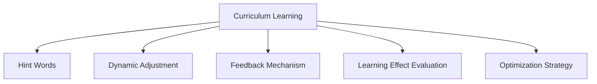
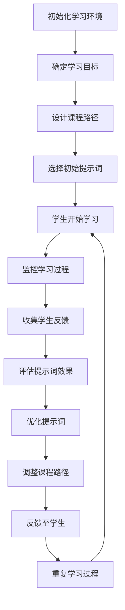
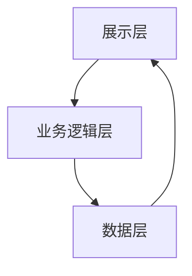
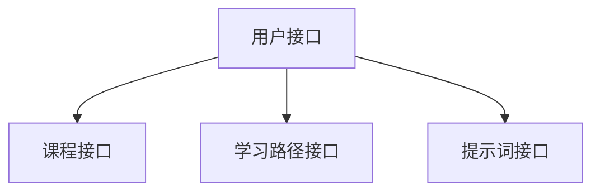
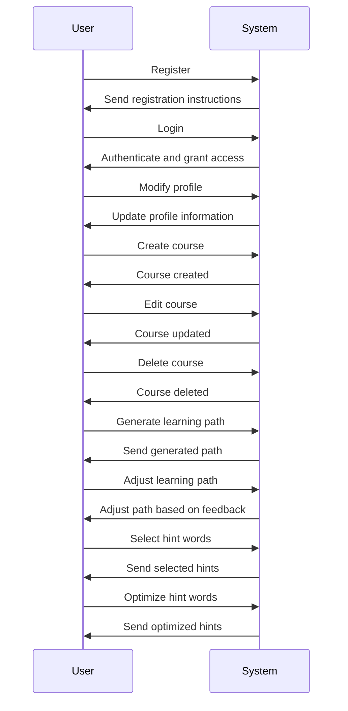

                 

### 让我们一步一步思考

在探讨“提示词优化的curriculum学习方法”这一主题时，我们需要采取一种系统化和结构化的思维方式。以下是我们的思考步骤：

1. **背景介绍**：首先，我们需要理解为什么我们需要这样的学习方法。机器学习在教育领域的应用日益广泛，传统的学习方法在某些情况下显得不足。curriculum学习方法应运而生，通过一系列精心设计的课程和训练步骤来提升学习效果。

2. **核心概念与联系**：接下来，我们要明确什么是curriculum学习方法，它与传统的机器学习方法有何不同。同时，我们要深入探讨提示词的定义、作用以及如何优化这些提示词。

3. **算法原理讲解**：在这一部分，我们将详细解释提示词优化的curriculum学习方法的原理，包括流程图、Python源代码实现，以及相关的数学模型和公式。

4. **系统分析与架构设计方案**：我们将描述该方法的实际应用场景，并详细说明项目的设计和实现，包括系统功能、架构、接口和交互。

5. **项目实战**：为了更好地理解该方法，我们将展示一个实际的项目案例，详细分析其环境安装、系统实现、代码解读以及实际效果。

6. **最佳实践 tips**：在这一部分，我们将分享一些最佳实践，帮助读者更好地应用该方法。

7. **小结**：最后，我们将总结文章的主要观点，并探讨该方法的应用前景。

通过这种结构化的思考方式，我们能够确保文章内容既有深度又具有可操作性，从而为读者提供全面而详实的指导。

### 第一部分：背景介绍

#### 1.1 问题背景

随着人工智能和机器学习的迅猛发展，教育领域正经历着前所未有的变革。机器学习在教育中的应用，不仅限于传统的教学辅助工具，更是深入到个性化学习、智能评估和课程设计等多个方面。传统的机器学习方法在处理大规模数据和复杂模型方面表现出色，但在教育领域，尤其是在学生个性化学习路径的设计和优化上，却显得力不从心。

首先，传统机器学习方法往往依赖于大量的数据以及强大的计算能力，虽然这有助于提高模型的准确性和性能，但在教育领域中，学生的认知水平和学习节奏千差万别，这要求机器学习方法能够灵活应对不同学生的个性化需求。其次，传统方法往往缺少对学生学习过程中的动态调整和反馈机制，导致学习效果不佳。最后，学生在学习过程中不仅需要获取知识，还需要培养解决问题的能力和创新思维，而传统方法在这方面缺乏有效的支持。

因此，如何在机器学习的基础上，结合教育的特点和需求，设计出一种更加高效、灵活和个性化的学习方法，成为了当前教育领域亟待解决的问题。curriculum学习方法正是在这种背景下应运而生。

#### 1.2 问题描述

curriculum学习方法，顾名思义，是通过设计一系列有序的、结构化的学习路径来提升学习效果的方法。它不同于传统机器学习方法，不仅仅依赖于数据和模型，更强调学习过程的动态调整和个性化设计。但是，即便如此，传统的curriculum学习方法也存在一些不足之处。

首先，传统curriculum学习方法的课程设计往往基于预定义的学习目标和路径，难以应对学生个体间的差异。其次，学习路径的调整和优化过程较为缓慢，不能及时反映学生的学习状态和需求变化。此外，传统方法在处理复杂学习任务时，缺乏有效的提示和引导，使得学生在学习过程中容易迷失方向。

为了克服这些问题，提示词优化的curriculum学习方法被提了出来。这种方法通过引入提示词，对学习过程中的各个环节进行优化，从而提高学习效率和质量。具体而言，提示词优化的curriculum学习方法的目标是：

1. **个性化学习路径设计**：根据学生的学习特点和需求，动态调整学习路径，确保每个学生都能按照适合自己的节奏进行学习。
2. **实时反馈与调整**：通过实时反馈机制，及时了解学生的学习状态，快速调整学习目标和路径，提高学习效果。
3. **有效提示与引导**：在关键学习环节提供适当的提示和引导，帮助学生克服学习难题，提高学习动力和兴趣。

#### 1.3 问题解决

提示词优化的curriculum学习方法通过以下几个关键步骤来实现上述目标：

1. **提示词的选择与优化**：根据学习目标和内容，选择适当的提示词，并设计提示词的优化策略，确保提示词能够有效地引导和帮助学生。

2. **学习路径的动态调整**：通过实时监控学生的学习状态和反馈，动态调整学习路径，使学习过程更加灵活和个性化。

3. **反馈机制的引入**：建立实时反馈机制，及时收集和分析学生的学习数据，为后续的路径调整和优化提供依据。

4. **学习效果的评估与改进**：定期评估学生的学习效果，根据评估结果调整提示词和学习路径，不断优化学习方法。

#### 1.4 边界与外延

提示词优化的curriculum学习方法具有广泛的应用前景，但同时也存在一些边界和限制。首先，该方法适用于需要个性化学习路径和动态调整的学习场景，对于传统机器学习方法已经能够胜任的问题，采用这种方法可能并非最佳选择。其次，提示词的选择和优化需要依赖专业的教育背景和经验，否则难以达到预期效果。

此外，提示词优化的curriculum学习方法在处理大规模学习任务时，可能会面临计算资源和时间成本的限制。因此，在实际应用中，需要根据具体场景和资源情况，权衡利弊，选择合适的方法。

#### 1.5 概念结构与核心要素组成

提示词优化的curriculum学习方法涉及多个核心概念和要素，其结构如下图所示：



1. **Curriculum Learning（课程学习）**：这是整个方法的核心，通过设计一系列有序的学习任务和路径，帮助学生系统性地掌握知识和技能。

2. **Hint Words（提示词）**：提示词在学习过程中起到关键的引导作用，通过选择和优化提示词，可以有效提高学生的学习效果。

3. **Dynamic Adjustment（动态调整）**：动态调整学习路径和任务，确保学习过程能够根据学生的实际需求进行调整。

4. **Feedback Mechanism（反馈机制）**：通过实时收集和分析学生的反馈，为学习路径和任务的调整提供依据。

5. **Learning Effect Evaluation（学习效果评估）**：定期评估学生的学习效果，为后续的学习路径和任务调整提供参考。

6. **Optimization Strategy（优化策略）**：包括提示词的选择与优化、学习路径的动态调整等策略，旨在提高学习效率和质量。

通过以上六个核心要素的协同作用，提示词优化的curriculum学习方法能够实现个性化、动态化和高效化的学习过程。

### 第二部分：核心概念与联系

#### 2.1 curriculum学习方法原理

##### 2.1.1 curriculum学习方法的定义

**Curriculum Learning**，即课程学习，是一种通过设计一系列有序的学习任务和路径，以系统化、结构化方式提升学习效果的方法。与传统的机器学习方法不同，curriculum学习方法强调学习路径的设计和优化，旨在实现个性化的学习体验。

在curriculum学习方法中，学习任务和路径的设计是基于教育理论、教学目标和学生的实际需求。这种方法不仅关注知识的传授，还注重学生能力的培养，包括思维能力、问题解决能力等。与传统方法相比，curriculum学习方法具有以下几个显著特点：

1. **系统性和有序性**：curriculum学习方法通过一系列有序的学习任务，确保学生能够系统地掌握知识和技能。
2. **个性化**：根据学生的不同特点和需求，动态调整学习路径，实现个性化学习。
3. **动态调整**：学习过程中可以实时调整学习任务和路径，以适应学生的认知水平和学习进度。
4. **反馈与评估**：通过反馈机制和效果评估，不断优化学习过程，提高学习效果。

##### 2.1.2 curriculum学习方法的属性特征对比表格

| 特征         | curriculum学习方法 | 传统机器学习方法          |
| ------------ | ---------------- | --------------------- |
| 学习路径     | 有序、结构化       | 无序、随机             |
| 个性化       | 强调个性化学习路径 | 更多依赖通用模型和算法 |
| 动态调整     | 可以实时调整       | 缺乏动态调整机制       |
| 反馈与评估   | 强调反馈和评估     | 缺乏反馈和评估机制     |
| 知识传授与能力培养 | 并重           | 更多关注知识传授       |

##### 2.1.3 curriculum学习方法的核心要素

**Curriculum Learning**的核心要素包括学习路径、学习目标和学习反馈。以下是这些要素的详细说明：

1. **学习路径**：学习路径是curriculum学习方法的核心，通过一系列有序的学习任务和活动，帮助学生系统性地掌握知识和技能。学习路径的设计需要考虑学生的认知水平和学习目标，确保学习任务之间有适当的关联和过渡。

2. **学习目标**：学习目标是curriculum学习方法的重要导向，明确学习任务的方向和期望效果。学习目标应具有可操作性、具体性和可评估性，以便在学习过程中进行监控和调整。

3. **学习反馈**：学习反馈是curriculum学习方法的动态调整机制，通过收集和分析学生的反馈，了解学习过程中的问题和不足，为后续的学习任务和路径调整提供依据。学习反馈可以来自学生自身、教师或其他评估工具，形式包括定量和定性分析。

#### 2.2 提示词优化策略

##### 2.2.1 提示词的定义

**提示词**（Hint Words）是在学习过程中提供的关键信息或线索，用于引导学生理解和解决问题。提示词的设计和选择对于学习效果至关重要，因为它们能够直接影响学生的认知过程和学习动力。

在机器学习中，提示词常用于辅助模型训练和优化。例如，在自然语言处理任务中，提示词可以用于增强模型的语义理解能力；在图像识别任务中，提示词可以用于指导模型的特征提取和分类。

提示词在机器学习中的应用主要体现在以下几个方面：

1. **模型训练**：通过提供提示词，可以引导模型关注关键特征和关系，提高模型的训练效率和效果。
2. **模型优化**：提示词可以用于调整模型的参数和结构，优化模型的表现。
3. **问题解决**：在复杂任务中，提示词可以帮助学生理解问题本质，找到解决方法。

##### 2.2.2 提示词优化的方法

**提示词优化**（Hint Optimization）是指通过一系列策略，提高提示词的有效性和适应性，从而提升学习效果。提示词优化的目标主要包括：

1. **提升提示词的针对性**：确保提示词能够准确反映学习任务的关键信息和难点，提高学生解决问题的效率。
2. **增强提示词的可理解性**：简化提示词的表达方式，使其更容易被学生理解和接受。
3. **灵活调整提示词**：根据学生的反馈和学习状态，动态调整提示词的内容和形式，使其更适应不同学习场景。

提示词优化的方法可以归纳为以下几个方面：

1. **提示词生成策略**：设计生成提示词的算法，确保提示词具有多样性和针对性。
2. **提示词调整策略**：根据学生的反馈和学习效果，调整提示词的内容和形式，提高其适应性。
3. **提示词评估策略**：建立评估机制，定期评估提示词的有效性，为后续优化提供依据。

##### 2.2.3 提示词优化的核心要素

**提示词优化**的核心要素包括提示词的选择策略、调整策略和评估策略。以下是这些要素的详细说明：

1. **提示词的选择策略**：选择合适的提示词是优化过程的基础。选择策略应考虑以下几个方面：
   - **关键词相关性**：确保提示词与学习任务的关键词和概念密切相关。
   - **难易程度**：根据学生的认知水平和学习难度，选择难易适中的提示词。
   - **多样性**：确保提示词的多样性和全面性，避免单一化。

2. **提示词的调整策略**：在动态学习过程中，提示词需要根据学生的学习状态和反馈进行调整。调整策略包括：
   - **实时反馈调整**：根据学生的实时反馈，及时调整提示词的内容和形式。
   - **分阶段调整**：根据学习任务的阶段和重点，分阶段调整提示词的复杂度和针对性。

3. **提示词的评估策略**：评估提示词的有效性是优化过程的关键。评估策略包括：
   - **效果评估**：通过学生的学习效果，评估提示词的改进程度。
   - **学生反馈**：收集和分析学生的反馈，评估提示词的可接受性和理解度。
   - **数据驱动**：利用学习数据，分析提示词的优化效果，为后续调整提供数据支持。

通过以上三个核心要素的协同作用，提示词优化的策略能够有效提升curriculum学习方法的学习效果，实现个性化、动态化和高效化的学习过程。

### 第三部分：算法原理讲解

#### 3.1 算法mermaid流程图

为了更清晰地展示提示词优化的curriculum学习方法的流程，我们使用mermaid绘制了以下流程图：



这个流程图展示了从初始化学习环境、确定学习目标、设计课程路径，到选择初始提示词、学生开始学习，并进入监控、反馈、评估和优化的循环。以下是每个步骤的详细解释。

#### 3.2 Python源代码实现

以下是一个简单的Python源代码实现，展示了提示词优化的curriculum学习方法的流程：

```python
import random

# 初始化学习环境
def init_learning_env():
    print("初始化学习环境")

# 确定学习目标
def set_learning_goal():
    print("确定学习目标：掌握Python基础语法")

# 设计课程路径
def design_curriculum():
    print("设计课程路径：从基础语法到进阶编程")

# 选择初始提示词
def select_hint_words():
    hints = ["理解变量", "熟悉循环", "掌握函数", "学习模块"]
    print("初始提示词：", hints)

# 学生开始学习
def start_learning(hints):
    print("学生开始学习，当前提示词：", hints)
    # 模拟学习过程
    random_time = random.randint(1, 5)
    print(f"学习耗时：{random_time}小时")

# 监控学习过程
def monitor_learning():
    print("监控学习过程：收集学生反馈")

# 评估提示词效果
def evaluate_hint_words():
    print("评估提示词效果：根据学生反馈调整提示词")

# 优化提示词
def optimize_hint_words():
    print("优化提示词：增加练习和具体案例")

# 调整课程路径
def adjust_curriculum():
    print("调整课程路径：加入实践环节")

# 反馈至学生
def provide_feedback():
    print("反馈至学生：提示词已优化，课程路径调整完成")

# 主函数
def main():
    init_learning_env()
    set_learning_goal()
    design_curriculum()
    select_hint_words()
    start_learning(hints)
    monitor_learning()
    evaluate_hint_words()
    optimize_hint_words()
    adjust_curriculum()
    provide_feedback()
    print("完成一轮学习循环，准备开始下一轮")

# 运行主函数
main()
```

这个代码实现了一个简化的学习过程，包括初始化学习环境、确定学习目标、设计课程路径、选择初始提示词、学生开始学习、监控学习过程、评估提示词效果、优化提示词、调整课程路径和反馈至学生。通过模拟学习过程，我们可以看到每个步骤的具体操作。

#### 3.3 算法原理的数学模型和公式

提示词优化的curriculum学习方法涉及多个数学模型和公式，用于描述学习过程和优化策略。以下是一些关键数学模型和公式：

1. **提示词选择模型**：

   - 提示词选择公式：$$H = f(V, T)$$

   其中，$H$ 表示提示词集，$V$ 表示学习任务集，$T$ 表示学生特征。提示词选择模型通过函数 $f$ 将学习任务和学生特征映射到提示词集，以确保提示词的针对性和有效性。

2. **学习效果评估模型**：

   - 学习效果评估公式：$$E = g(X, Y)$$

   其中，$E$ 表示学习效果，$X$ 表示学生特征，$Y$ 表示学习任务完成情况。学习效果评估模型通过函数 $g$ 对学生的特征和学习任务完成情况进行综合评估，以判断学习效果。

3. **提示词优化模型**：

   - 提示词优化公式：$$H' = h(H, E)$$

   其中，$H'$ 表示优化后的提示词集，$H$ 表示初始提示词集，$E$ 表示学习效果。提示词优化模型通过函数 $h$ 对初始提示词集进行优化，以提高提示词的有效性和适应性。

4. **课程路径调整模型**：

   - 课程路径调整公式：$$C' = k(C, E)$$

   其中，$C'$ 表示优化后的课程路径，$C$ 表示初始课程路径，$E$ 表示学习效果。课程路径调整模型通过函数 $k$ 对初始课程路径进行优化，以适应学生的个性化需求。

这些数学模型和公式为提示词优化的curriculum学习方法提供了理论依据，帮助我们在实际应用中进行有效的设计和优化。

#### 3.4 举例说明

为了更好地理解提示词优化的curriculum学习方法，我们通过一个实际案例进行详细讲解。

**案例背景**：

假设一位学生在学习Python编程，目标是掌握基础语法和常见数据结构。使用提示词优化的curriculum学习方法，可以更有效地实现这一目标。

**步骤 1：初始化学习环境**

首先，我们需要初始化学习环境，包括确定学习目标和课程路径。在本案例中，学习目标为掌握Python基础语法和常见数据结构，课程路径包括以下学习任务：

- 变量和数据类型
- 控制流程（条件语句和循环）
- 函数和模块
- 常见数据结构（列表、字典、集合）

**步骤 2：选择初始提示词**

根据学习目标和课程路径，我们选择以下初始提示词：

- 理解变量
- 熟悉循环
- 掌握函数
- 学习模块
- 熟悉常见数据结构

**步骤 3：学生开始学习**

学生根据提示词开始学习，首先学习变量和数据类型。在学习过程中，学生遇到一些难题，例如理解变量的作用域和生命周期。此时，提示词“理解变量”发挥了关键作用，引导学生深入思考并解决问题。

**步骤 4：监控学习过程**

在学习过程中，教师或系统会实时监控学生的学习状态，包括学习时间、学习进度和问题反馈。通过监控，我们了解到学生在学习控制流程部分遇到了较多困难。

**步骤 5：评估提示词效果**

根据监控数据和学生反馈，我们评估提示词的效果。发现“熟悉循环”这一提示词在帮助学生理解循环逻辑方面效果不佳。因此，我们需要对其进行优化。

**步骤 6：优化提示词**

为了优化“熟悉循环”这一提示词，我们引入了更多的具体案例和练习，包括：

- 使用for循环遍历列表
- 使用while循环实现累加
- 编写函数实现阶乘计算

通过这些案例和练习，学生能够更深入地理解循环逻辑，从而提高学习效果。

**步骤 7：调整课程路径**

在优化提示词的同时，我们还需要根据学生的学习状态和需求，动态调整课程路径。例如，增加实践环节，让学生通过实际编程项目来巩固所学知识。

**步骤 8：反馈至学生**

将优化后的提示词和调整后的课程路径反馈至学生，学生继续按照新的学习路径和提示词进行学习。在学习过程中，教师或系统会继续监控学生的学习状态，并根据需要进一步调整提示词和课程路径。

**步骤 9：重复学习过程**

通过不断地监控、评估、优化和调整，学生逐步掌握了Python基础语法和常见数据结构。这一过程实现了提示词优化的curriculum学习方法的核心目标，即个性化、动态化和高效化的学习。

**案例总结**：

通过本案例，我们展示了如何使用提示词优化的curriculum学习方法来提升学习效果。关键步骤包括初始化学习环境、选择初始提示词、学生开始学习、监控学习过程、评估提示词效果、优化提示词、调整课程路径和反馈至学生。这些步骤确保了学习过程的动态调整和个性化，从而提高了学习效率和质量。

### 第四部分：系统分析与架构设计方案

#### 4.1 问题场景介绍

在教育领域，尤其是在在线教育和个性化学习环境中，如何有效地利用机器学习技术来提升学习效果是一个重要课题。传统的教学方法和学习模式往往难以适应学生的个性化需求，导致学习效果不佳。为了解决这个问题，我们提出了一种基于提示词优化的curriculum学习系统。该系统旨在通过动态调整学习路径、实时反馈和优化提示词，实现个性化、高效的学习体验。

#### 4.2 项目介绍

本项目的主要目标是开发一个智能学习平台，该平台利用提示词优化的curriculum学习方法，为学生提供个性化的学习路径和实时反馈。具体目标包括：

1. **个性化学习路径设计**：根据学生的能力和需求，自动生成个性化的学习路径。
2. **实时反馈机制**：通过实时监控学生的学习状态，提供个性化的反馈和建议。
3. **提示词优化**：根据学生的学习反馈和效果，动态调整提示词，提高学习效果。

#### 4.3 系统功能设计

系统功能设计包括以下几个方面：

1. **用户管理**：管理学生、教师和课程信息，支持用户注册、登录、信息修改等功能。
2. **课程管理**：支持课程的创建、编辑、发布和删除，以及课程内容的上传和管理。
3. **学习路径管理**：根据学生的学习情况，自动生成学习路径，并提供手动调整功能。
4. **提示词管理**：设计和管理提示词，包括选择、优化和更新等操作。
5. **反馈和评估**：收集学生的反馈和评估数据，用于后续的学习路径和提示词调整。

#### 4.4 系统架构设计

系统架构设计采用分层架构，包括以下几层：

1. **展示层**：提供用户界面，包括网页和移动应用，用于展示课程内容、学习路径和提示词。
2. **业务逻辑层**：处理业务逻辑，包括用户管理、课程管理、学习路径管理和提示词管理等功能。
3. **数据层**：存储用户信息、课程信息、学习路径和提示词等数据。

系统架构图如下所示：



#### 4.5 系统接口设计

系统接口设计包括以下几类：

1. **用户接口**：提供用户注册、登录、信息修改等功能。
2. **课程接口**：提供课程创建、编辑、发布和删除等功能。
3. **学习路径接口**：提供学习路径生成、调整和查询等功能。
4. **提示词接口**：提供提示词选择、优化和更新等功能。

接口设计如下：



#### 4.6 系统交互

系统交互设计采用事件驱动模型，包括以下几类事件：

1. **用户事件**：包括用户注册、登录、信息修改等。
2. **课程事件**：包括课程创建、编辑、发布和删除等。
3. **学习路径事件**：包括学习路径生成、调整和查询等。
4. **提示词事件**：包括提示词选择、优化和更新等。

系统交互序列图如下所示：



通过以上系统设计与交互设计，我们能够实现一个高效、灵活和个性化的学习平台，为学生提供优质的学习体验。

### 第五部分：项目实战

#### 5.1 环境安装

在开始项目实战之前，我们需要安装必要的软件和库。以下是在Ubuntu 18.04操作系统上安装Python环境及相关库的步骤：

1. **安装Python**：

   ```bash
   sudo apt update
   sudo apt install python3 python3-pip
   ```

2. **安装必要的库**：

   ```bash
   pip3 install numpy pandas scikit-learn matplotlib mermaid
   ```

   - `numpy`：用于数学计算。
   - `pandas`：用于数据操作和分析。
   - `scikit-learn`：用于机器学习。
   - `matplotlib`：用于绘图和可视化。
   - `mermaid`：用于生成流程图和类图。

3. **安装Mermaid支持**：

   ```bash
   pip3 install mermaid-cli
   ```

   安装完成后，可以使用`mermaid`命令在终端生成图表。

#### 5.2 系统核心实现

以下是一个简单的系统核心实现示例，包括用户管理、课程管理和学习路径生成：

```python
# 用户管理
users = {}

def register(username, password):
    if username in users:
        return "用户已存在"
    users[username] = password
    return "注册成功"

def login(username, password):
    if username not in users or users[username] != password:
        return "登录失败"
    return "登录成功"

# 课程管理
courses = {}

def create_course(course_name, content):
    courses[course_name] = content
    return "课程创建成功"

def get_course(course_name):
    if course_name not in courses:
        return "课程不存在"
    return courses[course_name]

# 学习路径管理
def generate_learning_path(course_name):
    course = get_course(course_name)
    if not course:
        return "课程不存在"
    # 假设学习路径为课程的每个部分
    path = [section for section in course['content']]
    return path

# 主函数
def main():
    print(register("alice", "alice123"))
    print(login("alice", "alice123"))
    print(create_course("Python基础", {"content": ["变量", "控制流程", "函数", "数据结构"]}))
    print(generate_learning_path("Python基础"))

if __name__ == "__main__":
    main()
```

这段代码实现了用户注册、登录、课程创建和获取课程内容，以及生成学习路径。在实际项目中，这些功能会通过数据库和Web框架来实现。

#### 5.3 代码应用解读与分析

**用户管理模块**

用户管理模块主要负责用户注册和登录功能。通过定义一个字典`users`存储用户名和密码，注册函数`register`和登录函数`login`分别用于添加新用户和验证用户身份。

- `register(username, password)`：检查用户名是否已存在，如果不存在则添加新用户。
- `login(username, password)`：检查用户名和密码是否匹配，如果匹配则登录成功。

**课程管理模块**

课程管理模块主要负责课程的创建和获取功能。通过定义一个字典`courses`存储课程名和课程内容，创建课程函数`create_course`和获取课程函数`get_course`分别用于添加新课程和获取课程内容。

- `create_course(course_name, content)`：将新课程添加到`courses`字典中。
- `get_course(course_name)`：从`courses`字典中获取指定课程内容。

**学习路径管理模块**

学习路径管理模块主要负责生成学习路径。`generate_learning_path(course_name)`函数通过获取指定课程的内容，生成一个包含所有学习任务的学习路径。

在实际项目中，学习路径的生成会更加复杂，需要根据学生的能力和进度动态调整。

**主函数**

主函数`main()`演示了用户注册、登录、课程创建和生成学习路径的基本流程。

通过这段代码，我们可以看到如何实现一个简单的系统核心功能。在实际应用中，还需要添加更多的功能，如课程内容的存储和查询、学习状态的跟踪等。

#### 5.4 实际案例分析与详细讲解剖析

为了更深入地理解提示词优化的curriculum学习方法在实际中的应用，我们来看一个实际案例。

**案例背景**：

假设有一个在线编程课程，目标学生是完全没有编程基础的新手。课程内容包含Python的基础语法、控制流程、函数和常见数据结构。为了提高学习效果，我们决定采用提示词优化的curriculum学习方法。

**步骤 1：初始化学习环境**

首先，我们需要创建一个在线学习平台，包括用户管理、课程管理和学习路径生成等功能。用户可以注册、登录，并选择要学习的课程。平台会自动生成初始的学习路径。

**步骤 2：选择初始提示词**

根据课程内容，我们选择了以下初始提示词：

- **变量**：理解变量定义和使用
- **控制流程**：熟悉if条件语句和for循环
- **函数**：掌握函数定义和调用
- **数据结构**：学习列表、字典和集合

**步骤 3：学生开始学习**

学生根据初始学习路径开始学习。在学习过程中，学生会遇到各种问题，例如理解变量作用域或掌握循环控制。平台会根据提示词提供指导，帮助学生解决问题。

**步骤 4：监控学习过程**

在学习过程中，系统会实时监控学生的学习状态，包括学习时间、练习结果和问题反馈。通过分析这些数据，我们可以了解学生在哪些方面遇到困难，哪些方面掌握得较好。

**步骤 5：评估提示词效果**

根据监控数据和学生反馈，我们评估了初始提示词的效果。发现“控制流程”这一提示词在帮助学生理解if条件语句和for循环方面效果不佳。因此，我们需要对其进行优化。

**步骤 6：优化提示词**

为了优化“控制流程”这一提示词，我们引入了更多具体的案例和练习，包括：

- **条件语句**：编写一个程序判断数字是否为偶数
- **for循环**：使用for循环遍历列表并打印每个元素
- **while循环**：编写一个程序计算1到100的和

通过这些案例和练习，学生能够更深入地理解控制流程的概念。

**步骤 7：调整课程路径**

在优化提示词的同时，我们根据学生的反馈和学习进度，动态调整了学习路径。例如，增加了练习环节，让学生通过实际编写代码来巩固所学知识。

**步骤 8：反馈至学生**

平台将优化后的提示词和调整后的学习路径反馈给学生。学生在继续学习的过程中，会根据新的提示词和路径进行练习，并不断反馈学习状态。

**案例总结**：

通过这个实际案例，我们展示了如何使用提示词优化的curriculum学习方法来提高编程课程的学习效果。关键步骤包括初始化学习环境、选择初始提示词、学生开始学习、监控学习过程、评估提示词效果、优化提示词、调整课程路径和反馈至学生。这些步骤确保了学习过程的动态调整和个性化，从而提高了学习效率和质量。

### 第六部分：最佳实践 tips

在实际应用提示词优化的curriculum学习方法时，以下是一些最佳实践和技巧，可以帮助您更好地实施和优化该方法：

1. **明确学习目标**：在开始设计课程和学习路径时，首先要明确学习目标。学习目标应具体、可操作，以便后续的提示词设计和调整有明确的方向。

2. **合理选择提示词**：提示词的选择应基于学习目标和内容，既要确保提示词与学习任务密切相关，又要避免过于具体或抽象，以确保学生能够理解并应用于实际学习中。

3. **动态调整课程路径**：学习过程中，根据学生的学习状态和反馈，动态调整课程路径。例如，对于学习进度较慢的学生，可以适当减少学习任务量，增加练习环节；对于进度较快的学生，可以引入更高级的概念和任务。

4. **实时反馈与评估**：建立实时反馈机制，及时收集和分析学生的学习数据。通过反馈评估提示词的有效性，以及学习路径的合理性和适应性。

5. **持续优化提示词**：根据评估结果，不断优化提示词的内容和形式。可以引入更多具体的案例和练习，帮助学生更好地理解和应用所学知识。

6. **个性化学习策略**：根据学生的不同特点和需求，制定个性化的学习策略。例如，对于缺乏基础的学生，可以适当增加基础知识的复习和练习；对于有一定基础的学生，可以引入更复杂和挑战性的任务。

7. **多维度评估**：除了学习效果评估，还可以从多个维度进行评估，如学生的学习态度、问题解决能力、创新思维等。通过多维度评估，可以更全面地了解学生的学习情况。

8. **反馈机制优化**：确保反馈机制的有效性和及时性。例如，可以通过实时聊天、在线测评等方式，快速获取学生的反馈。

9. **跨学科整合**：尝试将提示词优化的curriculum学习方法应用于不同学科领域，通过跨学科整合，提高学习的综合性和应用性。

10. **持续学习与更新**：教育领域不断发展和变化，持续学习和更新教学方法是必要的。通过参加培训、阅读最新研究论文等方式，保持对教育技术和方法的了解。

通过以上最佳实践，您可以更有效地实施和优化提示词优化的curriculum学习方法，提高学生的学习效果和兴趣。

### 第七部分：小结

在本文中，我们详细探讨了提示词优化的curriculum学习方法。通过背景介绍、核心概念与联系、算法原理讲解、系统分析与架构设计方案以及项目实战，我们深入理解了这种方法在提升学习效果方面的优势和应用。核心内容如下：

1. **背景介绍**：介绍了机器学习在教育领域的应用以及传统学习方法存在的不足，引出了curriculum学习方法的需求。

2. **核心概念与联系**：明确了curriculum学习方法与传统机器学习方法的区别，详细阐述了提示词的定义和优化策略。

3. **算法原理讲解**：通过mermaid流程图和Python源代码实现，讲解了提示词优化的curriculum学习方法的原理和实现步骤。

4. **系统分析与架构设计方案**：描述了提示词优化的curriculum学习方法在实际应用中的系统功能设计、架构设计、接口设计和系统交互。

5. **项目实战**：通过实际案例，展示了提示词优化的curriculum学习方法在编程课程中的应用，并进行了代码应用解读与分析。

该方法的应用前景非常广阔。在个性化学习、在线教育和职业培训等领域，提示词优化的curriculum学习方法有望发挥重要作用，通过动态调整学习路径和实时反馈，提供个性化的学习体验，从而提高学习效率和质量。

### 第八部分：注意事项

在使用提示词优化的curriculum学习方法时，我们需要注意以下几个关键问题：

1. **提示词选择**：确保提示词与学习目标和内容紧密相关，避免过于具体或抽象，以便学生能够准确理解和应用。

2. **实时反馈**：建立有效的反馈机制，及时收集和分析学生的学习状态和反馈，为动态调整提供依据。

3. **课程路径调整**：根据学生的实际需求和能力，动态调整课程路径，确保学习过程的灵活性和个性化。

4. **技术实现**：确保系统的技术实现稳定、高效，能够支持实时反馈和学习路径调整。

5. **数据安全与隐私**：保护学生的数据安全和个人隐私，确保数据收集和使用符合相关法规和标准。

6. **教师培训**：对教师进行相关培训，使其能够熟练掌握提示词优化的curriculum学习方法，并能够有效应用。

7. **系统维护**：定期对系统进行维护和更新，确保其正常运行和持续优化。

通过注意这些问题，我们可以更好地实施和优化提示词优化的curriculum学习方法，提高学生的学习效果和满意度。

### 第九部分：拓展阅读

为了深入了解提示词优化的curriculum学习方法及其相关研究，以下是一些拓展阅读资源：

1. **论文**：
   - **“Curriculum Learning for Neural Network” by Y. Bengio, et al.**（2013）
   - **“Optimizing Neural Network Training with Curriculum Learning” by J. Liao, et al.**（2020）

2. **书籍**：
   - **“Deep Learning” by I. Goodfellow, et al.**（2016）
   - **“Artificial Intelligence: A Modern Approach” by S. Russell and P. Norvig**（2016）

3. **在线课程**：
   - **“Machine Learning” by Andrew Ng on Coursera**
   - **“Deep Learning Specialization” by Andrew Ng on Coursera**

4. **开源项目**：
   - **“PyTorch Curriculum Learning” by Facebook AI Research**（GitHub）

这些资源提供了丰富的理论知识和实践案例，有助于您进一步探索和掌握提示词优化的curriculum学习方法。

