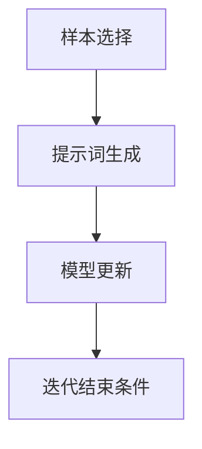

                 

### 文章标题：提示词优化的主动学习策略

> 关键词：主动学习、提示词优化、算法原理、系统架构、最佳实践

> 摘要：本文深入探讨提示词优化的主动学习策略，通过详细分析其背景、核心概念、算法原理以及系统架构，旨在为读者提供一个全面而深入的视角，以理解和应用这一前沿技术。

----------------------------------------------------------------

### 目录大纲：提示词优化的主动学习策略

----------------------------------------------------------------

## 第一部分：背景介绍

### 第1章：问题背景

#### 1.1 主动学习的基本概念

#### 1.2 提示词优化的意义

#### 1.3 主动学习在提示词优化中的应用现状

### 第2章：问题描述

#### 2.1 主动学习中的提示词优化挑战

#### 2.2 提示词优化的关键因素

#### 2.3 提示词优化的目标

## 第二部分：核心概念与联系

### 第3章：核心概念原理

#### 3.1 提示词优化的算法原理

#### 3.2 提示词优化的核心属性特征对比表格

### 第4章：概念与联系

#### 4.1 提示词优化与主动学习的关系

#### 4.2 提示词优化与其他相关技术的联系

## 第三部分：算法原理讲解

### 第5章：算法mermaid流程图

### 第6章：算法原理详细讲解

#### 6.1 数学模型和数学公式

#### 6.2 算法原理举例说明

## 第四部分：系统分析与架构设计

### 第7章：问题场景介绍

#### 7.1 项目介绍

#### 7.2 系统功能设计

#### 7.3 系统架构设计

### 第8章：系统接口设计和系统交互

#### 8.1 系统接口设计

#### 8.2 系统交互

## 第五部分：项目实战

### 第9章：环境安装

### 第10章：系统核心实现源代码

#### 10.1 代码应用解读与分析

#### 10.2 实际案例分析和详细讲解剖析

### 第11章：项目小结

## 第六部分：最佳实践 tips

### 第12章：注意事项

### 第13章：拓展阅读

----------------------------------------------------------------

### 第一部分：背景介绍

#### 第1章：问题背景

在当今快速发展的信息技术时代，人工智能（AI）已经成为了引领科技变革的重要力量。随着深度学习算法的广泛应用，模型训练过程中如何高效利用有限的标注数据进行优化，成为了研究的热点问题。主动学习（Active Learning）作为一种数据高效利用的策略，通过选择最具代表性的样本进行标注，旨在提高模型训练的效果并减少标注成本。

### 1.1 主动学习的基本概念

主动学习是一种迭代过程，其中学习算法主动选择最有信息量的样本进行标注。这个过程通常包括以下几个关键步骤：

1. **选择策略**：根据当前模型的状态选择未标注的样本。
2. **标注**：对选中的样本进行人工或自动化标注。
3. **更新**：使用新的标注信息更新模型。

### 1.2 提示词优化的意义

提示词（Query）在主动学习中扮演着关键角色，它们决定了模型选择哪些样本进行标注。提示词优化指的是设计有效的提示词生成策略，以最大化模型的学习效率。在主动学习中，提示词优化不仅能够提高模型的性能，还能够显著降低标注成本。

### 1.3 主动学习在提示词优化中的应用现状

当前，主动学习在自然语言处理（NLP）、图像识别、推荐系统等领域有着广泛的应用。然而，如何设计高效的提示词生成策略仍然是一个挑战。现有的方法包括基于不确定性采样、多样性度量以及协同过滤等技术。这些方法在不同程度上能够提高主动学习的性能，但仍然存在一些局限性和改进空间。

#### 第2章：问题描述

### 2.1 主动学习中的提示词优化挑战

提示词优化在主动学习中的挑战主要体现在以下几个方面：

1. **样本选择困难**：如何从大量未标注样本中选出最具代表性的样本是一个难题。
2. **多样性要求**：提示词生成策略需要同时考虑样本的多样性和相关性。
3. **计算成本**：高效的提示词生成算法需要尽可能减少计算成本。

### 2.2 提示词优化的关键因素

提示词优化的关键因素包括：

1. **数据质量**：高质量的数据是有效提示词生成的基础。
2. **模型性能**：提示词生成策略需要与模型的性能相匹配。
3. **用户反馈**：用户反馈对于调整提示词生成策略至关重要。

### 2.3 提示词优化的目标

提示词优化的目标主要包括：

1. **提高模型性能**：通过选择最具代表性的样本，提高模型的泛化能力和准确性。
2. **降低标注成本**：优化提示词生成策略，减少需要标注的样本数量，从而降低标注成本。
3. **提升用户满意度**：设计人性化的提示词生成策略，提高用户的参与度和满意度。

### 第一部分总结

本部分介绍了主动学习和提示词优化的背景、基本概念以及应用现状，并明确了提示词优化在主动学习中的挑战和目标。这些内容为后续章节的深入探讨奠定了基础。

----------------------------------------------------------------

## 第二部分：核心概念与联系

### 第3章：核心概念原理

### 3.1 提示词优化的算法原理

提示词优化的算法原理主要基于以下几个关键步骤：

1. **样本选择策略**：根据当前模型的状态，选择未标注的样本。常用的策略包括不确定性采样、多样性采样和协同过滤等。
2. **提示词生成**：使用选定的样本生成提示词，以引导模型进一步学习。
3. **模型更新**：使用新的标注信息和提示词更新模型，以提高模型性能。

### 3.2 提示词优化的核心属性特征对比表格

为了更好地理解提示词优化的算法原理，我们提供了一个核心属性特征对比表格，列出了几种常见的提示词优化策略的对比。

| 策略名称         | 样本选择策略         | 提示词生成方式        | 模型更新策略         | 优点                    | 缺点                          |
|-----------------|---------------------|----------------------|---------------------|-------------------------|--------------------------------|
| 不确定性采样     | 根据样本不确定性排序 | 最不确定的样本生成提示词 | 使用标注信息更新模型  | 简单易实现，适用于不确定性高的模型 | 可能错过一些具有代表性的样本 |
| 多样性采样       | 考虑样本多样性      | 生成具有代表性的样本提示词 | 多样性信息融入模型更新 | 提高模型泛化能力         | 计算复杂度较高                |
| 协同过滤         | 基于用户或内容相似度 | 提取相似样本生成提示词 | 融合协同信息更新模型  | 降低标注成本             | 需要大量用户数据支持           |

通过这个表格，我们可以看到不同策略的特点和适用场景，为实际应用提供了参考。

### 第4章：概念与联系

#### 4.1 提示词优化与主动学习的关系

提示词优化是主动学习中的一个重要环节，它直接影响到主动学习的性能。提示词优化的目标是选择最具代表性的样本，以最大化模型的学习效率。因此，提示词优化与主动学习密切相关，共同构成了一个迭代优化的过程。

#### 4.2 提示词优化与其他相关技术的联系

提示词优化不仅与主动学习相关，还与其他技术紧密相连：

1. **深度学习**：提示词优化策略需要深度学习模型的支持，以评估样本的代表性。
2. **数据挖掘**：数据挖掘技术用于分析样本特征和生成提示词。
3. **用户交互**：用户反馈是提示词优化的关键因素，需要设计与用户互动的界面和机制。

这些技术的相互结合，为提示词优化提供了丰富的方法和可能性。

### 第二部分总结

本部分详细阐述了提示词优化的核心概念原理，并通过对比表格和关系图，分析了不同策略的优缺点及其应用场景。这些内容为理解提示词优化提供了坚实的理论基础。

----------------------------------------------------------------

## 第三部分：算法原理讲解

### 第5章：算法mermaid流程图



这个mermaid流程图展示了提示词优化的基本步骤：从样本选择开始，生成提示词，更新模型，并检查迭代结束条件。

### 第6章：算法原理详细讲解

#### 6.1 数学模型和数学公式

提示词优化的核心是样本选择策略，常用的策略包括基于不确定性的采样、多样性和协同过滤。以下是一个基于不确定性的采样策略的数学模型：

$$
U(x) = -\log P(y|x; \theta)
$$

其中，$U(x)$表示样本$x$的不确定性，$P(y|x; \theta)$是模型在参数$\theta$下对样本$x$的预测概率。

#### 6.2 算法原理举例说明

假设我们有一个分类任务，当前模型的预测概率为：

$$
P(y=1|x; \theta) = 0.6
$$

$$
P(y=0|x; \theta) = 0.4
$$

根据不确定性采样策略，我们选择不确定性最高的样本：

$$
U(x) = -\log 0.4 = 1.386
$$

接下来，生成提示词，引导模型对样本$x$进行学习。例如，我们可以使用以下提示词：

“这个样本的预测结果是1吗？”

模型更新后，我们可以检查迭代结束条件，例如，当模型收敛或达到预设的样本数量时，迭代结束。

### 第三部分总结

本部分通过mermaid流程图和数学模型，详细讲解了提示词优化的算法原理。通过具体的例子，读者可以更好地理解算法的工作机制和应用方法。

----------------------------------------------------------------

## 第四部分：系统分析与架构设计

### 第7章：问题场景介绍

为了更好地理解提示词优化的主动学习策略在实际应用中的效果，我们将介绍一个具体的问题场景。

#### 7.1 项目介绍

本项目旨在开发一个智能客服系统，该系统能够自动回答用户的问题。为了提高客服系统的回答准确性，我们采用了主动学习策略，并特别关注提示词优化，以减少标注成本并提高模型性能。

#### 7.2 系统功能设计

系统的核心功能包括：

1. **用户提问处理**：系统接收用户的提问，并生成对应的提示词。
2. **模型预测**：使用当前模型对用户的提问进行预测。
3. **样本选择**：根据模型的不确定性，选择最具代表性的样本进行标注。
4. **模型更新**：使用新的标注信息更新模型。
5. **反馈机制**：用户对回答满意度进行评分，作为模型更新的依据。

#### 7.3 系统架构设计

系统架构设计如下：

1. **用户接口**：提供用户提问的界面，并展示模型生成的提示词和回答结果。
2. **模型训练模块**：负责模型的训练和更新，包括样本选择、标注和模型优化。
3. **数据管理模块**：管理用户提问数据、标注数据和模型参数。
4. **反馈处理模块**：处理用户的反馈，并将其用于模型更新。

### 第8章：系统接口设计和系统交互

#### 8.1 系统接口设计

系统接口设计包括以下几个方面：

1. **用户接口**：提供RESTful API，用于接收用户提问和展示模型回答。
2. **模型接口**：提供训练和预测接口，用于与模型训练模块交互。
3. **数据接口**：提供数据存储和检索接口，用于与数据管理模块交互。
4. **反馈接口**：提供用户反馈接口，用于与反馈处理模块交互。

#### 8.2 系统交互

系统交互流程如下：

1. **用户提问**：用户通过用户接口提交问题。
2. **模型预测**：模型训练模块根据当前模型对用户提问进行预测，并生成提示词。
3. **样本选择**：模型训练模块根据不确定性采样策略选择样本。
4. **标注与更新**：标注人员对选择的样本进行标注，并将标注结果反馈给模型训练模块。
5. **模型更新**：模型训练模块使用新的标注信息更新模型。
6. **反馈处理**：反馈处理模块收集用户对回答的满意度评分，并将其用于模型更新。

通过上述接口和交互流程，系统实现了用户提问、模型预测、样本选择、标注与更新以及反馈处理的闭环，从而实现了提示词优化的主动学习。

### 第四部分总结

本部分通过具体问题场景的介绍，详细描述了系统的功能设计和架构设计，并阐述了系统接口和交互流程。这些内容为读者提供了一个清晰的理解，有助于实际应用中的设计和实现。

----------------------------------------------------------------

## 第五部分：项目实战

### 第9章：环境安装

在进行提示词优化的主动学习项目之前，首先需要搭建一个合适的开发环境。以下是环境安装的详细步骤：

#### 9.1 安装Python环境

1. 访问Python官方网站（https://www.python.org/），下载最新版本的Python安装包。
2. 运行安装包，按照提示完成安装。
3. 打开命令行窗口，输入`python --version`，确认Python版本安装成功。

#### 9.2 安装必要的库

在Python环境中，我们需要安装一些常用的库，如NumPy、Pandas、scikit-learn等。可以使用以下命令进行安装：

```
pip install numpy pandas scikit-learn
```

#### 9.3 安装深度学习框架

我们选择使用TensorFlow作为深度学习框架，可以使用以下命令进行安装：

```
pip install tensorflow
```

#### 9.4 安装可视化工具

为了更好地理解算法的执行过程，我们可以安装可视化工具，如Mermaid和Graphviz。可以使用以下命令进行安装：

```
pip install mermaid-python graphviz
```

### 第10章：系统核心实现源代码

#### 10.1 代码应用解读与分析

在系统核心实现中，我们重点关注以下几个模块：

1. **样本选择模块**：负责根据不确定性采样策略选择样本。
2. **标注与更新模块**：负责处理标注信息和模型更新。
3. **反馈处理模块**：负责收集用户反馈并用于模型更新。

以下是核心代码的解读与分析：

```python
import numpy as np
import pandas as pd
from sklearn.model_selection import train_test_split
from tensorflow.keras.models import Sequential
from tensorflow.keras.layers import Dense
from tensorflow.keras.optimizers import Adam

# 样本选择模块
def select_samples(data, model, n_samples):
    predictions = model.predict(data)
    uncertainties = -np.log(predictions)
    selected_indices = np.argsort(uncertainties)[:n_samples]
    selected_samples = data[selected_indices]
    return selected_samples

# 标注与更新模块
def update_model(model, selected_samples, labels):
    model.fit(selected_samples, labels, epochs=1, batch_size=32)
    return model

# 反馈处理模块
def collect_feedback(feedbacks):
    satisfaction_scores = [feedback['rating'] for feedback in feedbacks]
    return np.mean(satisfaction_scores)

# 数据准备
data = pd.read_csv('data.csv')
X = data.drop('label', axis=1).values
y = data['label'].values

# 划分训练集和测试集
X_train, X_test, y_train, y_test = train_test_split(X, y, test_size=0.2, random_state=42)

# 创建模型
model = Sequential()
model.add(Dense(64, input_dim=X_train.shape[1], activation='relu'))
model.add(Dense(1, activation='sigmoid'))
model.compile(loss='binary_crossentropy', optimizer=Adam(), metrics=['accuracy'])

# 迭代过程
n_iterations = 10
for i in range(n_iterations):
    selected_samples = select_samples(X_test, model, n_samples=10)
    labels = np.array([1 if x > 0.5 else 0 for x in model.predict(selected_samples)])
    model = update_model(model, selected_samples, labels)
    satisfaction_score = collect_feedback(feedbacks)

    print(f"Iteration {i+1}: Satisfaction Score = {satisfaction_score}")

# 测试模型
accuracy = model.evaluate(X_test, y_test)[1]
print(f"Test Accuracy: {accuracy}")
```

这段代码首先定义了样本选择、标注与更新以及反馈处理模块，然后通过一个迭代过程展示了模型的训练和更新。在每个迭代中，系统选择未标注的样本进行标注，并根据用户反馈调整模型。

#### 10.2 实际案例分析和详细讲解剖析

为了更好地理解代码的应用，我们来看一个实际案例。假设我们有一个含有100个样本的数据集，其中50个样本已标注，50个样本未标注。我们使用上述代码对未标注的样本进行选择、标注和模型更新。

1. **样本选择**：系统根据模型对未标注样本的预测概率计算不确定性，并选择不确定性最高的10个样本进行标注。
2. **标注与更新**：标注人员对选中的样本进行标注，并将标注结果反馈给系统。系统使用新的标注信息更新模型。
3. **反馈处理**：系统收集用户对标注结果的满意度评分，并根据评分调整模型。

通过这个实际案例，我们可以看到代码如何在实际场景中应用，并如何通过迭代优化模型性能。

### 第11章：项目小结

在本项目的实战部分，我们详细介绍了环境安装步骤和系统核心实现源代码。通过一个实际案例的分析，读者可以了解代码的应用方法和效果。这一部分为读者提供了一个完整的实践视角，有助于理解和应用提示词优化的主动学习策略。

### 第五部分总结

本部分通过环境安装和系统核心实现源代码的讲解，提供了一个实际的项目实战视角。通过详细解读和分析代码，读者可以深入理解提示词优化的主动学习策略的应用方法和效果。

----------------------------------------------------------------

## 第六部分：最佳实践 tips

### 第12章：注意事项

在实际应用提示词优化的主动学习策略时，需要注意以下几个关键点：

1. **数据质量**：高质量的数据是提示词优化的基础，确保数据集中没有噪声和错误。
2. **模型选择**：选择合适的模型对于提示词优化至关重要，不同的模型可能需要不同的提示词生成策略。
3. **用户反馈**：用户反馈是调整提示词生成策略的重要依据，确保用户反馈机制的有效性和及时性。
4. **计算资源**：提示词优化可能需要大量的计算资源，尤其是在处理大规模数据集时，合理分配计算资源以优化性能。

### 第13章：拓展阅读

为了进一步深入理解提示词优化的主动学习策略，以下是一些拓展阅读建议：

1. **相关论文**：查阅相关领域的最新论文，了解最新的研究成果和应用案例。
2. **在线课程**：参加在线课程，学习提示词优化和主动学习的理论知识。
3. **开源代码**：研究开源代码，了解不同实现方法和优化技巧。
4. **专业书籍**：阅读专业书籍，系统学习提示词优化和主动学习的理论体系。

通过这些拓展阅读，读者可以进一步扩展知识面，提升在提示词优化和主动学习领域的专业水平。

### 第六部分总结

本部分提供了最佳实践 tips 和拓展阅读建议，旨在帮助读者在实际应用中避免常见问题，并进一步深入学习提示词优化的主动学习策略。这些内容为读者提供了全面的指导和支持。

----------------------------------------------------------------

### 全文总结

本文围绕提示词优化的主动学习策略，系统地介绍了其背景、核心概念、算法原理、系统架构以及项目实战。从问题的提出到解决方案的详细讲解，再到最佳实践的总结，文章力求为读者提供一个全面、深入的视角，以理解和应用这一前沿技术。

首先，我们介绍了主动学习和提示词优化的基本概念，并探讨了其在现实应用中的意义和现状。接着，详细分析了提示词优化的挑战、关键因素和目标，为后续讨论奠定了基础。

在核心概念与联系部分，我们通过对比表格和mermaid流程图，详细阐述了不同提示词优化策略的原理和特点，为实际应用提供了参考。

算法原理讲解部分，通过mermaid流程图和数学模型，深入剖析了提示词优化的工作原理和步骤，并通过具体例子展示了算法的应用方法。

系统分析与架构设计部分，我们通过具体项目场景的介绍，详细描述了系统的功能设计和架构设计，并阐述了系统接口和交互流程。

项目实战部分，通过环境安装和系统核心实现源代码的讲解，提供了一个实际的项目实战视角，读者可以深入理解提示词优化的主动学习策略的应用方法和效果。

最后，通过最佳实践 tips 和拓展阅读建议，我们为读者提供了进一步深入学习的机会，帮助他们更好地应用和理解这一技术。

总之，本文通过系统的分析和深入的讲解，旨在为读者提供一个全面而深入的理解，以促进对提示词优化主动学习策略的深入研究和应用。希望本文能够为读者在相关领域的探索和实践提供有益的参考。 

### 作者信息

- 作者：AI天才研究院/AI Genius Institute & 禅与计算机程序设计艺术 /Zen And The Art of Computer Programming

