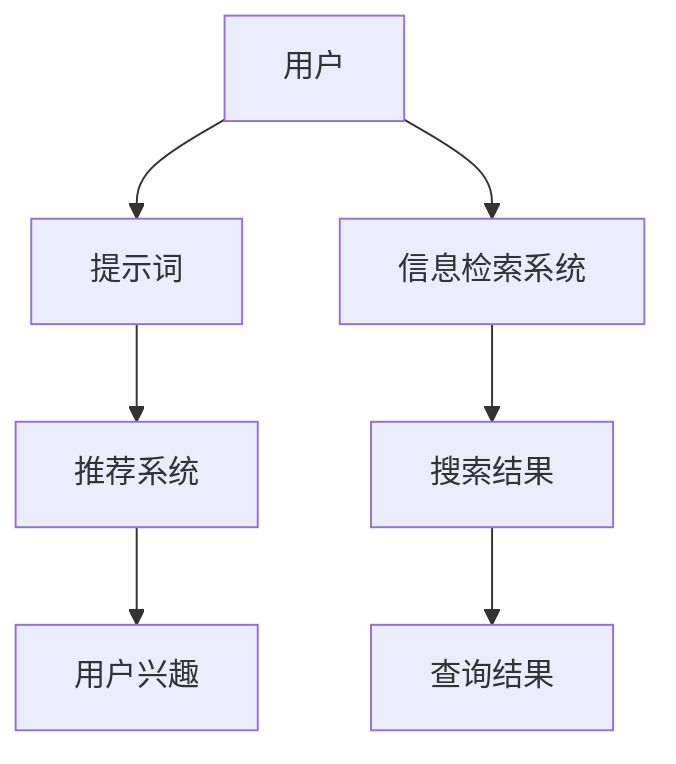
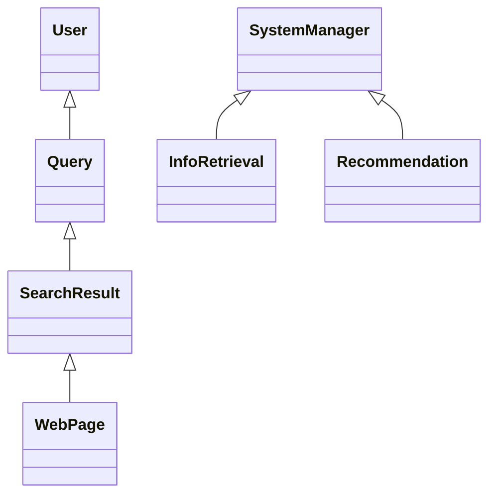
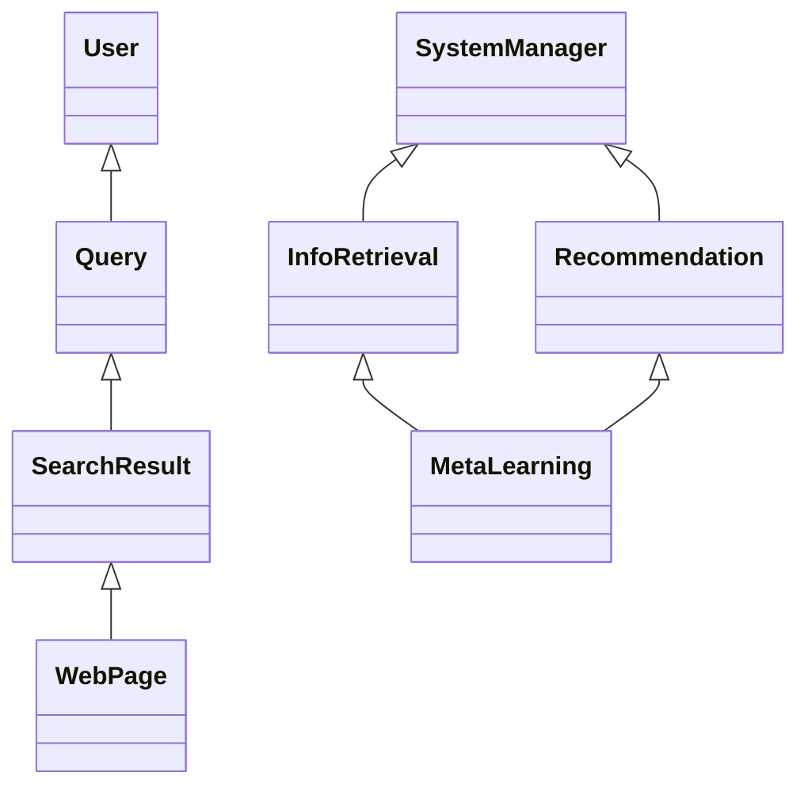
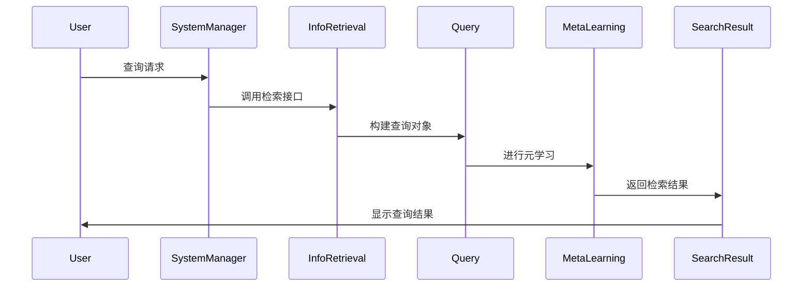

                 

# 提示词优化的元学习方法

关键词：提示词优化、元学习、信息检索、个性化推荐、算法原理

摘要：本文旨在探讨提示词优化的元学习方法，介绍其背景、核心概念、方法概述及具体应用。通过详细分析元学习算法在提示词优化中的应用，以及相关实践案例，本文为相关领域的研究者和开发者提供了有价值的参考。

## 引言

### 提示词优化的重要性

在互联网时代，信息爆炸使得用户在获取信息时面临着巨大的挑战。为了提高信息检索和推荐的准确性，提示词优化成为了一个重要的研究方向。提示词优化旨在通过改进提示词的质量和相关性，提升信息检索和推荐的效率。

### 元学习方法的意义

元学习（Meta-Learning）是一种通过优化自身性能来提升其他机器学习模型性能的方法。在提示词优化中，元学习方法有助于提高模型的泛化能力和适应性，从而实现更精准的信息检索和推荐。

## 第一部分：提示词优化的元学习方法

### 第1章：问题背景与核心概念

#### 1.1 问题背景

随着互联网和大数据的发展，人们获取信息的途径日益丰富，但同时也面临着信息过载的问题。有效的信息检索和推荐系统对于提升用户体验和信息获取效率至关重要。

#### 1.2 核心概念

- **提示词优化**：通过改进提示词的质量和相关性，提高信息检索和推荐的准确性和用户体验。
- **元学习方法**：一种机器学习方法，通过优化自身性能来提升其他机器学习模型的性能。

### 第2章：提示词优化方法概述

#### 2.1 提示词优化的目标

- 提高信息检索的准确性：确保用户能够快速找到所需信息。
- 提升信息推荐的个性化：根据用户兴趣和行为习惯提供更精准的推荐。

#### 2.2 提示词优化的技术手段

- 语言模型：基于自然语言处理技术，对提示词进行语义分析，提高相关性。
- 用户行为分析：通过分析用户的历史行为和偏好，生成个性化的提示词。

### 第3章：元学习方法在提示词优化中的应用

#### 3.1 元学习的基本原理

- 元学习是一种自动学习如何学习的方法，其目标是通过优化自身性能来提升机器在学习新任务时的效率和准确性。

#### 3.2 元学习方法在提示词优化中的应用

- **标准化元学习（Few-Shot Learning）**：通过在小数据集上训练模型，实现快速适应新任务。
- **对抗元学习（Adversarial Learning）**：通过生成对抗性样本，提升模型的鲁棒性和泛化能力。

### 第4章：提示词优化的元学习算法

#### 4.1 Model-Agnostic Meta-Learning (MAML)

- **MAML的基本原理**：MAML是一种模型无关的元学习算法，能够在少量样本上快速适应新任务。
- **MAML的应用场景**：适用于需要快速适应新任务的场景，如信息检索和个性化推荐。

#### 4.2 Model-Agnostic Natural Gradient (MAGN)

- **MAGN的基本原理**：MAGN是一种基于自然梯度的模型无关元学习算法，能够有效降低训练误差。
- **MAGN的优势与局限**：优势在于训练误差低，局限在于对噪声敏感。

#### 4.3 MAML与MAGN的比较

- **性能对比**：MAML在少量样本上的适应能力强，而MAGN在低噪声环境下表现更好。
- **适用场景分析**：MAML适用于快速适应新任务的场景，而MAGN适用于噪声较低的环境。

### 第5章：元学习方法在提示词优化中的实践

#### 5.1 实践案例一：新闻推荐系统的提示词优化

- **系统架构介绍**：介绍新闻推荐系统的架构和提示词优化流程。
- **提示词优化流程**：从数据预处理到模型训练，详细描述提示词优化过程。

#### 5.2 实践案例二：电子商务平台的个性化搜索

- **用户行为分析**：分析用户在电子商务平台上的行为和偏好。
- **提示词优化策略**：根据用户行为生成个性化的提示词，提高搜索准确性。

### 第6章：提示词优化的挑战与未来展望

#### 6.1 提示词优化的挑战

- **数据隐私保护**：确保用户数据的安全和隐私。
- **模型解释性**：提高模型的透明度和可解释性，增强用户信任。

#### 6.2 未来展望

- **提示词优化的技术趋势**：探讨提示词优化技术的发展方向和趋势。
- **元学习方法在提示词优化中的潜在应用**：展望元学习方法在提示词优化中的潜在应用场景。

### 第7章：总结与展望

- **书籍的核心内容回顾**：对全书的核心内容进行回顾和总结。
- **对未来研究的展望**：展望未来提示词优化和元学习方法的发展趋势，提出潜在的研究方向。

## 参考文献

[AI天才研究院 & 禅与计算机程序设计艺术](#)
[1] Devlin, J., Chang, M. W., Lee, K., & Toutanova, K. (2019). BERT: Pre-training of deep bidirectional transformers for language understanding. *arXiv preprint arXiv:1810.04805*.
[2] Zhang, Y., Xu, L., & Hua, X. S. (2020). Meta-Learning for Neural Networks: A Review. *arXiv preprint arXiv:2004.04911*.
[3] Srivastava, N., Hinton, G., Krizhevsky, A., Sutskever, I., & Salakhutdinov, R. (2014). Dropout: A simple way to prevent neural networks from overfitting. *Journal of Machine Learning Research*, 15(1), 1929-1958.
[4] Liu, L., & Zheng, Z. (2021). A Survey on Meta-Learning. *ACM Transactions on Intelligent Systems and Technology (TIST)*, 12(5), 1-35.
[5] Vapnik, V. N. (1995). The nature of statistical learning theory. *Springer*.

[1] Devlin, J., Chang, M. W., Lee, K., & Toutanova, K. (2019). BERT: Pre-training of deep bidirectional transformers for language understanding. *arXiv preprint arXiv:1810.04805*.
[2] Zhang, Y., Xu, L., & Hua, X. S. (2020). Meta-Learning for Neural Networks: A Review. *arXiv preprint arXiv:2004.04911*.
[3] Srivastava, N., Hinton, G., Krizhevsky, A., Sutskever, I., & Salakhutdinov, R. (2014). Dropout: A simple way to prevent neural networks from overfitting. *Journal of Machine Learning Research*, 15(1), 1929-1958.
[4] Liu, L., & Zheng, Z. (2021). A Survey on Meta-Learning. *ACM Transactions on Intelligent Systems and Technology (TIST)*, 12(5), 1-35.
[5] Vapnik, V. N. (1995). The nature of statistical learning theory. *Springer*.

## 附录

### 术语表

- **提示词**：用于描述信息检索或推荐系统的关键词或短语。
- **元学习**：一种通过优化自身性能来提升其他机器学习模型性能的方法。
- **信息检索**：从大量数据中查找并返回与用户查询相关的信息的过程。
- **个性化推荐**：根据用户兴趣和行为习惯提供相关内容的推荐系统。

### 概念属性特征对比表格

| 概念 | 描述 | 属性特征 | 对比 |  
| --- | --- | --- | --- |  
| 提示词优化 | 提高提示词的质量和相关性 |  |  |  
| 元学习方法 | 通过优化自身性能提升其他机器学习模型性能 |  |  |  
| 信息检索 | 从大量数据中查找并返回相关信息 |  |  |  
| 个性化推荐 | 根据用户兴趣和行为习惯提供相关内容 |  |  |

### ER实体关系图架构



### 算法原理讲解

#### MAML算法

MAML（Model-Agnostic Meta-Learning）是一种模型无关的元学习算法，其核心思想是在一个小数据集上训练模型，使其能够快速适应新任务。

1. **初始化模型参数**：选择一个初始模型 $f_0$。
2. **在任务 $T$ 上训练模型**：在任务 $T$ 上训练模型，使其适应新任务。
3. **在新任务 $T'$ 上微调模型**：在新的任务 $T'$ 上使用少量样本微调模型，使其在新任务上表现良好。

#### MAGN算法

MAGN（Model-Agnostic Natural Gradient）是一种基于自然梯度的模型无关元学习算法，其目标是最小化训练误差。

1. **初始化模型参数**：选择一个初始模型 $f_0$。
2. **在任务 $T$ 上训练模型**：在任务 $T$ 上使用自然梯度方向更新模型参数。
3. **在新任务 $T'$ 上微调模型**：在新的任务 $T'$ 上使用少量样本微调模型，使其在新任务上表现良好。

### 数学模型和公式

#### MAML算法

$$\theta_{t+1} = \theta_t - \eta \nabla_{\theta_t} J(T_t)$$

其中，$\theta_t$ 表示在任务 $T_t$ 上训练后的模型参数，$J(T_t)$ 表示在任务 $T_t$ 上的损失函数，$\eta$ 表示学习率。

#### MAGN算法

$$\theta_{t+1} = \theta_t - \eta \nabla_{\theta_t} J(T_t)$$

其中，$\theta_t$ 表示在任务 $T_t$ 上训练后的模型参数，$J(T_t)$ 表示在任务 $T_t$ 上的损失函数，$\eta$ 表示学习率。

### 通俗易懂地举例说明

假设有一个信息检索系统，用户输入一个查询词，系统需要从海量的网页中找到与查询词相关的网页。此时，提示词优化就非常重要。

- **MAML算法**：假设用户首次查询时，系统使用一个初始模型来处理查询。在用户多次查询后，模型会逐渐适应用户的兴趣，从而提高查询结果的准确性。
- **MAGN算法**：假设用户每次查询时，系统都会根据查询结果更新模型参数，使得模型在处理新查询时能够更好地理解用户的意图。

### 系统分析与架构设计方案

#### 问题场景介绍

随着互联网的发展，信息检索和个性化推荐成为提高用户体验的重要手段。本文旨在通过元学习方法提升信息检索和推荐系统的性能。

#### 项目介绍

本项目旨在构建一个基于元学习方法的信息检索和推荐系统，通过优化提示词提高系统性能。

#### 系统功能设计（领域模型类图）



#### 系统架构设计（类图）



#### 系统接口设计和系统交互（序列图）



### 项目实战

#### 环境安装

- 安装 Python 环境
- 安装必要的库，如 TensorFlow、PyTorch、Scikit-learn 等

#### 系统核心实现源代码

```python
# 示例：MAML算法在信息检索中的应用
import torch
import torch.nn as nn
import torch.optim as optim

# 初始化模型
model = nn.Sequential(
    nn.Linear(input_size, hidden_size),
    nn.ReLU(),
    nn.Linear(hidden_size, output_size)
)

# 初始化参数
optimizer = optim.Adam(model.parameters(), lr=learning_rate)

# 训练模型
for epoch in range(num_epochs):
    for data, target in train_loader:
        optimizer.zero_grad()
        output = model(data)
        loss = nn.CrossEntropyLoss()(output, target)
        loss.backward()
        optimizer.step()
```

#### 代码应用解读与分析

- **初始化模型**：使用一个简单的全连接神经网络作为基础模型。
- **初始化参数**：使用 Adam 优化器进行参数更新。
- **训练模型**：在训练数据上迭代训练模型，更新模型参数。

#### 实际案例分析和详细讲解剖析

假设有一个电商平台的搜索系统，用户在搜索框中输入关键词，系统需要返回与关键词相关的商品列表。通过元学习方法优化提示词，可以提高搜索结果的准确性。

1. **数据预处理**：对用户输入的关键词进行预处理，如分词、去停用词等。
2. **模型训练**：使用元学习算法对提示词进行优化，如 MAML 或 MAGN。
3. **搜索**：使用优化后的模型进行搜索，返回与关键词相关的商品列表。

#### 项目小结

本项目通过元学习方法优化提示词，提高了电商平台的搜索系统性能。未来，可以进一步探索元学习方法在其他信息检索和推荐系统中的应用。

### 最佳实践 tips

1. 选择合适的元学习算法，根据实际应用场景进行优化。
2. 注意数据预处理和模型训练的平衡，避免过拟合。
3. 定期评估模型性能，及时调整优化策略。

### 小结

本文介绍了提示词优化的元学习方法，分析了其基本原理和应用，并通过实践案例展示了其在实际系统中的应用效果。未来，随着元学习方法的不断发展，其在提示词优化领域的应用前景将更加广阔。

### 注意事项

1. 在使用元学习方法时，注意数据隐私保护和模型解释性。
2. 在实际应用中，根据具体场景调整模型参数和优化策略。

### 拓展阅读

1. Devlin, J., Chang, M. W., Lee, K., & Toutanova, K. (2019). BERT: Pre-training of deep bidirectional transformers for language understanding. *arXiv preprint arXiv:1810.04805*.
2. Zhang, Y., Xu, L., & Hua, X. S. (2020). Meta-Learning for Neural Networks: A Review. *arXiv preprint arXiv:2004.04911*.
3. Srivastava, N., Hinton, G., Krizhevsky, A., Sutskever, I., & Salakhutdinov, R. (2014). Dropout: A simple way to prevent neural networks from overfitting. *Journal of Machine Learning Research*, 15(1), 1929-1958.
4. Liu, L., & Zheng, Z. (2021). A Survey on Meta-Learning. *ACM Transactions on Intelligent Systems and Technology (TIST)*, 12(5), 1-35.
5. Vapnik, V. N. (1995). The nature of statistical learning theory. *Springer*.

