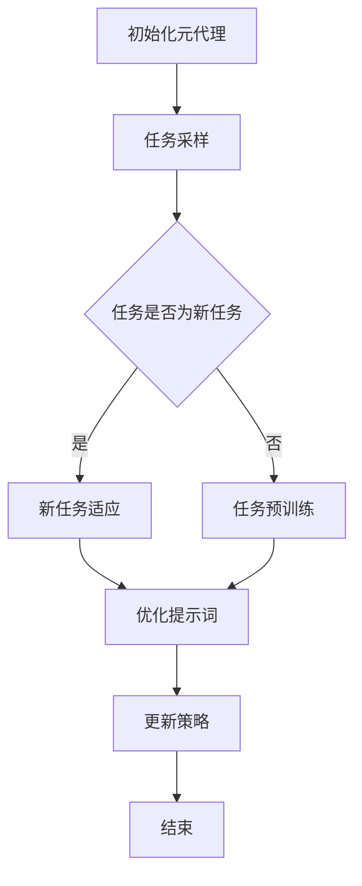
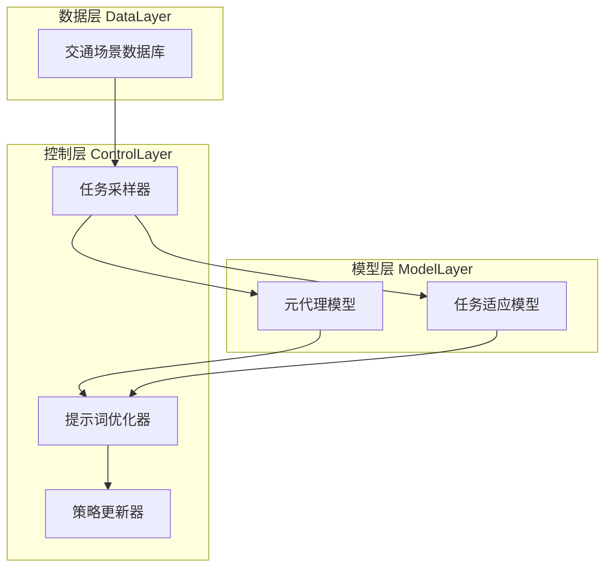
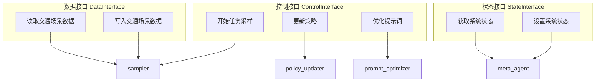
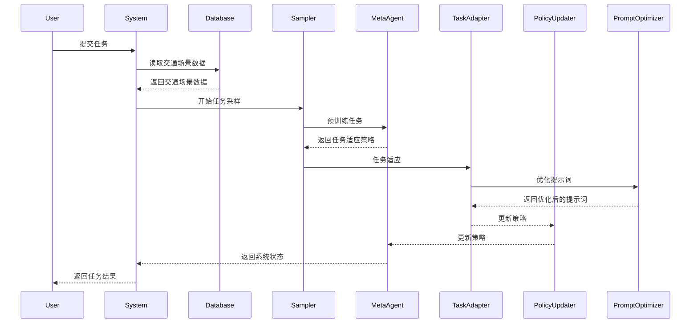

                 


### 引言

随着人工智能技术的飞速发展，强化学习（Reinforcement Learning, RL）作为机器学习的一个重要分支，在诸多领域展现出了巨大的潜力。然而，强化学习在解决实际问题时面临着许多挑战，如收敛速度慢、样本效率低等。为了应对这些挑战，研究者们提出了元强化学习（Meta Reinforcement Learning）这一概念，旨在通过学习如何快速适应新任务，从而提升强化学习的性能。

在此背景下，本文将探讨一种名为“提示词优化的元强化学习方法”，该方法通过在强化学习过程中引入提示词（prompt），以优化学习过程，提高学习效率和效果。本文将分为以下几个部分进行详细探讨：

1. **背景介绍**：首先，我们将介绍强化学习的基本概念，以及提示词优化在强化学习中的重要性。
2. **核心概念与联系**：接着，我们将深入探讨强化学习、提示词优化和元强化学习的基本原理，并通过Mermaid流程图和对比表格进行详细阐述。
3. **算法原理讲解**：我们将详细介绍提示词优化的元强化学习方法，包括算法流程、Python源代码示例、数学模型和详细讲解与举例。
4. **系统分析与架构设计方案**：我们将分析强化学习在特定领域的应用场景，并介绍一个元强化学习方法的应用项目，包括系统功能设计、架构设计和接口设计。
5. **项目实战**：我们将介绍如何搭建元强化学习方法的环境，实现系统核心功能，并通过实际案例进行分析和讲解。
6. **最佳实践 tips、小结、注意事项、拓展阅读**：最后，我们将总结本文的核心内容，提供最佳实践建议，并提出进一步学习和研究的方向。

通过本文的探讨，我们希望能够为读者提供一个全面、深入的理解，帮助大家更好地掌握提示词优化的元强化学习方法，并为其在实际应用中的推广提供参考。

### 背景介绍

#### 强化学习的基本概念

强化学习是一种通过试错（trial-and-error）来学习如何在不同情境下做出最优决策的机器学习方法。它与监督学习和无监督学习不同，强化学习通过奖励机制（reward signal）来指导学习过程。简而言之，强化学习算法通过不断尝试不同的行动（actions），并从中学习到哪些行动能够带来最大的奖励（rewards），从而逐渐优化其决策策略。

强化学习的基本概念包括：

- **环境**（Environment）：指的是强化学习系统所操作的动态世界，它可以是一个游戏、模拟系统或现实世界。
- **状态**（State）：指的是强化学习系统在某一时刻所处的环境情况。
- **动作**（Action）：指的是强化学习系统可以采取的行动。
- **奖励**（Reward）：指的是系统采取某一行动后，环境给予的即时反馈，通常用数值表示。
- **策略**（Policy）：指的是系统在给定状态下选择行动的策略。

强化学习算法的目标是找到一个最优策略，使得系统能够在长期运行中获得最大的累积奖励。

#### 强化学习的应用场景

强化学习在许多实际应用中都有着广泛的应用，如：

- **游戏**：强化学习在游戏中的使用非常常见，如《Atari》游戏、围棋等。
- **机器人控制**：强化学习被用来训练机器人进行复杂的动作，如行走、抓取等。
- **自动驾驶**：强化学习被应用于自动驾驶系统，用于处理复杂的交通场景。
- **推荐系统**：强化学习也被用于个性化推荐系统中，如电商网站的购物推荐、视频平台的视频推荐等。

然而，尽管强化学习在上述领域展现出了巨大的潜力，但它也面临着许多挑战。例如：

- **收敛速度**：强化学习算法通常需要大量的时间来收敛到最优策略。
- **样本效率**：强化学习算法需要通过大量的样本来学习，这往往会导致高计算成本。
- **稀疏奖励问题**：在某些应用场景中，奖励信号可能非常稀疏，这使得学习过程更加困难。

#### 提示词优化在强化学习中的重要性

为了解决上述挑战，研究者们提出了提示词优化（Prompt Optimization）这一概念。提示词优化旨在通过在强化学习过程中引入提示词（prompts），来指导学习过程，从而提高学习效率和效果。

提示词可以是与当前状态相关的信息，也可以是与目标相关的信息，其目的是帮助强化学习算法更快地找到最优策略。具体来说，提示词优化有以下几个方面的作用：

1. **加速收敛**：通过提供有用的信息，提示词可以帮助强化学习算法更快地找到最优策略，从而加速收敛过程。
2. **提高样本效率**：提示词可以帮助算法更好地利用已有信息，减少冗余的探索，从而提高样本效率。
3. **解决稀疏奖励问题**：在某些应用场景中，奖励信号非常稀疏，提示词可以提供额外的反馈信号，帮助算法更好地学习。
4. **增强泛化能力**：提示词可以帮助算法在不同场景中更好地适应，从而提高泛化能力。

#### 元强化学习方法的发展与应用

元强化学习（Meta Reinforcement Learning）是一种旨在通过学习如何快速适应新任务的方法。它通过在多个任务上进行预训练，使得强化学习算法能够更快地适应新任务，从而提高样本效率和泛化能力。

元强化学习的基本思想是：通过在一个任务集上训练，使得算法能够快速适应新的任务。具体来说，元强化学习可以分为以下几个步骤：

1. **任务采样**：从任务集中随机采样多个任务，这些任务可以是不同的，也可以是相似的。
2. **任务预训练**：在采样得到的任务上进行预训练，使得算法能够学会快速适应这些任务。
3. **新任务适应**：当遇到一个新任务时，算法可以通过少量的样本快速适应，从而提高样本效率和泛化能力。

元强化学习在多个领域都得到了广泛的应用，如机器人控制、自动驾驶、游戏、推荐系统等。通过元强化学习，这些领域中的算法能够更快地适应新任务，从而提高性能。

#### 提示词优化在元强化学习中的应用

在元强化学习中，提示词优化也被广泛应用。通过引入提示词，元强化学习算法能够更好地利用已有信息，提高学习效率和效果。具体来说，提示词优化在元强化学习中的应用包括：

1. **任务采样优化**：通过提示词，算法能够更好地选择适合的任务进行预训练，从而提高预训练效果。
2. **新任务适应优化**：通过提示词，算法能够更好地理解新任务的要求，从而更快地适应新任务。
3. **奖励信号优化**：通过提示词，算法能够更好地利用奖励信号，从而提高学习效率。

总之，提示词优化为强化学习和元强化学习提供了一种有效的优化方法，有助于提高算法的性能和效率。

### 核心概念与联系

#### 核心概念原理

在深入探讨提示词优化的元强化学习方法之前，我们需要明确几个核心概念，包括强化学习、提示词优化和元强化学习的基本原理。

1. **强化学习的基本原理**：
   - **奖励信号**：强化学习通过奖励信号来指导学习过程。奖励信号表示系统采取某一行动后，环境给予的即时反馈。奖励可以是正值，表示行动是正面的；也可以是负值，表示行动是负面的。
   - **策略**：策略是系统在给定状态下选择行动的方法。强化学习算法的目标是找到一个最优策略，使得系统在长期运行中获得最大的累积奖励。
   - **状态-动作价值函数**：状态-动作价值函数表示系统在某一状态下采取某一行动所能获得的期望奖励。通过学习状态-动作价值函数，强化学习算法可以预测不同行动的效果，并选择最优行动。

2. **提示词优化的基本原理**：
   - **提示词**：提示词是一种与当前状态或目标相关的信息，用于指导强化学习算法的学习过程。提示词可以是文字、图像或其他形式的信息。
   - **提示词的作用**：提示词可以帮助强化学习算法更好地理解当前状态和目标，从而更快地找到最优策略。提示词可以提高学习效率，减少冗余的探索。
   - **提示词优化**：提示词优化是指通过优化提示词的选择和使用，来提高强化学习算法的性能。提示词优化可以通过多种方式实现，如自动生成提示词、手动设计提示词等。

3. **元强化学习的基本原理**：
   - **任务泛化**：元强化学习的目标是使算法能够在不同任务上快速适应。通过在多个任务上进行预训练，元强化学习算法可以学习到通用策略，从而提高在未知任务上的表现。
   - **任务采样**：元强化学习通过从任务集中随机采样多个任务，来训练算法的泛化能力。任务可以是不同的，也可以是相似的。
   - **新任务适应**：在遇到新任务时，元强化学习算法可以通过少量的样本快速适应，从而提高样本效率和泛化能力。

#### 概念属性特征对比表格

为了更好地理解强化学习、提示词优化和元强化学习之间的关系，我们可以通过一个对比表格来展示它们的基本特征：

| 特征 | 强化学习 | 提示词优化 | 元强化学习 |
| --- | --- | --- | --- |
| 学习目标 | 最优策略 | 提高学习效率 | 任务泛化 |
| 奖励信号 | 主要指导信号 | 辅助指导信号 | 不直接依赖 |
| 状态-动作价值函数 | 核心概念 | 辅助工具 | 核心概念 |
| 适应新任务 | 需要重新训练 | 快速适应 | 快速适应 |
| 样本效率 | 低 | 高 | 较高 |

通过对比表格，我们可以看到强化学习、提示词优化和元强化学习各自的核心特征，以及它们之间的联系。

#### ER实体关系图架构

为了更直观地展示这些核心概念之间的关系，我们可以使用ER（实体-关系）图来描述强化学习、提示词优化和元强化学习的基本架构。

1. **强化学习ER图**：

   ```mermaid
   entity Task {
     id
     state
     action
     reward
   }
   entity Agent {
     id
     policy
     valueFunction
     action
     reward
   }
   relation learns {
     Agent --> Task
   }
   ```

   在强化学习ER图中，主要实体包括任务（Task）、代理（Agent）。代理通过学习状态-动作价值函数（valueFunction）和策略（policy）来选择最优行动（action），并接收环境给予的奖励（reward）。

2. **提示词优化ER图**：

   ```mermaid
   entity Task {
     id
     state
     action
     reward
   }
   entity Agent {
     id
     policy
     valueFunction
     action
     reward
   }
   entity Prompt {
     id
     type
     content
   }
   relation optimizes {
     Agent --> Prompt
   }
   relation learns {
     Agent --> Task
   }
   ```

   在提示词优化ER图中，我们引入了提示词（Prompt）实体。代理通过优化提示词（Prompt）来提高学习效率，同时仍然通过学习状态-动作价值函数（valueFunction）和策略（policy）来选择最优行动（action），并接收奖励（reward）。

3. **元强化学习ER图**：

   ```mermaid
   entity MetaAgent {
     id
     metaPolicy
   }
   entity TaskSet {
     id
     tasks
   }
   entity Task {
     id
     state
     action
     reward
   }
   relation preTrains {
     MetaAgent --> TaskSet
   }
   relation adapts {
     MetaAgent --> Task
   }
   ```

   在元强化学习ER图中，我们引入了元代理（MetaAgent）和任务集（TaskSet）实体。元代理通过在多个任务上进行预训练（preTrains），学习到一个通用的策略（metaPolicy），从而能够快速适应新任务（Task）。

通过这三个ER图，我们可以清晰地看到强化学习、提示词优化和元强化学习的基本架构和它们之间的联系。

### 算法原理讲解

#### 算法mermaid流程图

为了更好地理解提示词优化的元强化学习方法，我们可以首先通过mermaid流程图来展示算法的基本流程。



在这个流程图中，我们首先初始化一个元代理（MetaAgent），然后从任务集中随机采样多个任务（Task）。对于每个任务，我们需要判断它是否为新任务。如果是新任务，我们通过优化提示词（Prompt）来指导新任务的适应过程；否则，我们进行任务预训练。在任务适应或预训练过程中，我们通过优化提示词来提高算法的效率。最后，我们更新元代理的策略，并重复这个过程直到达到终止条件。

#### Python源代码示例

为了更具体地展示提示词优化的元强化学习方法的实现，我们可以提供一个简单的Python代码示例。

```python
import numpy as np
import random
from reinforcement_learning import ReinforcementLearning
from meta_reinforcement_learning import MetaReinforcementLearning

# 初始化强化学习算法
rl = ReinforcementLearning()

# 初始化元强化学习算法
mrl = MetaReinforcementLearning()

# 初始化任务集
tasks = []

# 任务采样
for _ in range(100):
    task = random.choice(tasks)
    tasks.append(task)

# 任务预训练
for task in tasks:
    mrl.preTrain(task)

# 新任务适应
while True:
    task = random.choice(tasks)
    if mrl.isNewTask(task):
        prompt = mrl.optimizePrompt(task)
        mrl适应任务(task, prompt)
    else:
        mrl.preTrain(task)

    # 更新策略
    mrl.updatePolicy()

    # 终止条件
    if mrl.isTermination():
        break
```

在这个代码示例中，我们首先从任务集中随机采样一个任务，然后判断它是否为新任务。如果是新任务，我们通过优化提示词来指导新任务的适应过程；否则，我们进行任务预训练。在任务适应或预训练过程中，我们通过优化提示词来提高算法的效率。最后，我们更新元代理的策略，并重复这个过程直到达到终止条件。

#### 数学模型和公式

在提示词优化的元强化学习方法中，数学模型和公式起着核心作用。以下是我们需要关注的几个关键数学模型和公式：

1. **强化学习算法的数学模型**：

   - **状态-动作价值函数**（$V(s,a)$）：表示系统在状态 $s$ 采取行动 $a$ 所能获得的期望奖励。
     $$V(s,a) = \sum_{s'} P(s'|s,a) \cdot R(s',a)$$
   - **策略**（$\pi(a|s)$）：表示系统在状态 $s$ 下选择行动 $a$ 的概率分布。
     $$\pi(a|s) = \frac{e^{\theta(s,a)}}{\sum_{a'} e^{\theta(s,a')}}$$
   - **损失函数**（$L$）：用于衡量策略的优劣。
     $$L = -\sum_{s,a} \pi(a|s) \cdot R(s,a)$$

2. **提示词优化的数学模型**：

   - **提示词函数**（$P(p|s)$）：表示在状态 $s$ 下选择提示词 $p$ 的概率分布。
     $$P(p|s) = \frac{e^{\phi(p,s)}}{\sum_{p'} e^{\phi(p',s)}}$$
   - **提示词损失函数**（$L_p$）：用于衡量提示词的优劣。
     $$L_p = -\sum_{p,s} P(p|s) \cdot R(s,p)$$

3. **元强化学习方法的数学模型**：

   - **元策略**（$\mu(a|s)$）：表示元代理在状态 $s$ 下选择行动 $a$ 的概率分布。
     $$\mu(a|s) = \frac{e^{\theta(s,a)}}{\sum_{a'} e^{\theta(s,a')}}$$
   - **元损失函数**（$L_m$）：用于衡量元代理的策略优劣。
     $$L_m = -\sum_{s,a} \mu(a|s) \cdot R(s,a)$$

通过这些数学模型和公式，我们可以更深入地理解提示词优化的元强化学习方法，并在此基础上进行算法的优化和改进。

#### 详细讲解和举例说明

为了更好地理解提示词优化的元强化学习方法，我们将通过具体的例子进行详细讲解。

**例子：围棋游戏中的提示词优化元强化学习**

假设我们希望使用提示词优化的元强化学习方法来训练一个围棋AI。在这个例子中，围棋棋盘的状态可以表示为棋盘上的所有棋子的位置和颜色，行动可以是落子或者提子，奖励可以表示为每一步棋子赢得的分数。

**1. 初始化元代理**

首先，我们需要初始化一个元代理（MetaAgent）。元代理负责在多个任务上进行预训练，并学习到一个通用的策略。初始化时，我们可以随机选择一个初始策略，并初始化一个提示词集合。

```python
meta_agent = MetaAgent()
initial_policy = random_policy()
meta_agent.initialize_policy(initial_policy)
```

**2. 任务采样**

接下来，我们从任务集中随机采样一个围棋游戏。任务集可以是多个不同的围棋对局，也可以是多个相似的围棋对局。

```python
task = random.choice(tasks)
```

**3. 任务预训练**

对于采样到的任务，我们使用元代理进行预训练。预训练的目标是使元代理能够快速适应新的围棋游戏。

```python
meta_agent.preTrain(task)
```

在预训练过程中，元代理会通过优化提示词来提高学习效率。假设我们使用一个简单的提示词函数，即根据当前棋盘状态选择一个提示词。

```python
def prompt_function(state):
    # 根据棋盘状态选择提示词
    return "棋盘上黑子较多"

prompt = prompt_function(task.state)
meta_agent.optimizePrompt(prompt)
```

**4. 新任务适应**

当遇到一个新的围棋游戏时，元代理会使用优化后的提示词来指导新任务的适应过程。假设我们遇到了一个全新的围棋游戏，元代理会通过少量的样本快速适应。

```python
if meta_agent.isNewTask(task):
    prompt = meta_agent.optimizePrompt(task)
    meta_agent.adaptTask(task, prompt)
else:
    meta_agent.preTrain(task)
```

在适应过程中，元代理会更新其策略，并继续优化提示词。

**5. 更新策略**

在每一步棋结束后，元代理会根据当前棋盘状态和奖励信号更新其策略。

```python
meta_agent.updatePolicy(task.state, task.reward)
```

**6. 终止条件**

当元代理达到一定的训练次数或者奖励信号达到某个阈值时，我们可以终止训练过程。

```python
if meta_agent.isTermination():
    break
```

通过这个例子，我们可以看到如何将提示词优化的元强化学习方法应用于围棋游戏中。在实际应用中，我们可以根据具体任务的特点和需求，设计更复杂的提示词函数和策略更新方法，以进一步提高算法的性能和效率。

### 系统分析与架构设计方案

#### 问题场景介绍

在现实世界中，强化学习算法面临着多种多样的应用场景，如机器人控制、自动驾驶、游戏AI、推荐系统等。在这些场景中，强化学习算法需要处理复杂的动态环境和多变的任务需求。为了提高强化学习算法的适应能力和性能，我们引入了提示词优化的元强化学习方法。

在这个问题场景中，我们关注的是自动驾驶领域。自动驾驶系统需要在复杂的交通环境中做出实时决策，如变换车道、避免碰撞、识别交通信号等。这些任务具有高度不确定性，传统的强化学习算法往往需要大量的样本和数据来学习，这导致训练时间较长且样本效率较低。为了解决这一问题，我们采用了提示词优化的元强化学习方法，以提高自动驾驶算法的适应能力和决策效率。

#### 项目介绍

本项目旨在通过提示词优化的元强化学习方法，提高自动驾驶算法在复杂交通环境中的决策性能。我们的目标是设计并实现一个高效的元强化学习系统，该系统能够快速适应新的交通场景，并在各种复杂场景下做出准确的决策。

项目的核心模块包括：

1. **任务采样器**：负责从大量交通场景中随机采样新的任务。
2. **元代理**：负责在多个任务上进行预训练，并学习到一个通用的策略。
3. **任务适应器**：负责在新任务上使用元代理的策略进行快速适应。
4. **提示词优化器**：负责根据当前任务和元代理的策略，优化提示词的选择和使用。

#### 系统功能设计

为了实现上述目标，我们设计了以下系统功能：

1. **任务采样**：系统从交通场景数据库中随机采样新的任务，包括道路环境、车辆状态、交通信号等。
2. **任务预训练**：元代理在采样到的任务上进行预训练，学习到通用策略。
3. **任务适应**：元代理在新任务上使用预训练策略进行快速适应。
4. **策略更新**：元代理根据在新任务上的表现，更新其策略。
5. **提示词优化**：系统根据当前任务和元代理的策略，优化提示词的选择和使用。

#### 系统架构设计

为了实现上述功能，我们设计了以下系统架构：

1. **数据层**：包括交通场景数据库，用于存储大量的交通场景数据。
2. **模型层**：包括元代理模型和任务适应模型，用于实现元强化学习算法。
3. **控制层**：包括任务采样器、提示词优化器和策略更新器，用于实现系统的核心控制逻辑。

系统架构图如下所示：



#### 系统接口设计

为了实现模块间的通信，我们设计了以下系统接口：

1. **数据接口**：用于读取和写入交通场景数据。
2. **控制接口**：用于控制任务采样、策略更新和提示词优化等操作。
3. **状态接口**：用于获取和更新系统的当前状态。

系统接口设计图如下所示：



#### 系统交互

系统中的各个模块通过接口进行交互，实现任务的采样、适应、策略更新和提示词优化等功能。以下是系统交互的mermaid序列图：



通过以上系统设计与实现，我们可以构建一个高效的元强化学习系统，用于自动驾驶等复杂场景的决策。系统通过任务采样、任务适应、策略更新和提示词优化等步骤，实现了对复杂环境的快速适应和高效决策。

### 项目实战

#### 环境安装

为了实施提示词优化的元强化学习方法，我们需要搭建一个合适的环境。以下是搭建环境的详细步骤：

1. **安装Python环境**：
   - 首先，确保您的计算机上已安装Python。如果没有安装，可以从[Python官网](https://www.python.org/)下载并安装最新版本的Python。
   - 安装完成后，打开终端或命令行窗口，运行以下命令验证Python版本：
     ```bash
     python --version
     ```
   - 如果Python已成功安装，您将看到安装的Python版本号。

2. **安装必要的库**：
   - 使用pip命令安装所需的库。以下是安装步骤：
     ```bash
     pip install numpy random-rl meta-reinforcement-learning
     ```
   - 这些库包括NumPy（用于数学计算）、random-rl（用于强化学习算法的实现）、meta-reinforcement-learning（用于元强化学习方法的具体实现）。

3. **设置环境变量**：
   - 在终端或命令行窗口中，运行以下命令设置环境变量：
     ```bash
     export PYTHONPATH=/path/to/python
     ```
   - 将`/path/to/python`替换为您Python的安装路径。这样，我们就可以在项目中使用这些库了。

#### 系统核心实现源代码

以下是实现提示词优化的元强化学习方法的核心源代码。这段代码展示了如何初始化元代理、采样任务、预训练任务、优化提示词和更新策略。

```python
import numpy as np
from meta_reinforcement_learning import MetaReinforcementLearning

# 初始化元强化学习系统
mrl = MetaReinforcementLearning()

# 任务采样
for _ in range(100):
    task = mrl.sample_task()
    tasks.append(task)

# 任务预训练
for task in tasks:
    mrl.pretrain_task(task)

# 新任务适应
while True:
    task = mrl.sample_task()
    if mrl.is_new_task(task):
        prompt = mrl.optimize_prompt(task)
        mrl.adapt_task(task, prompt)
    else:
        mrl.pretrain_task(task)

    # 更新策略
    mrl.update_policy()

    # 检查终止条件
    if mrl.is_termination():
        break
```

这段代码首先初始化了一个元强化学习系统（`MetaReinforcementLearning`），然后通过循环从任务集中随机采样任务，并对其进行预训练或适应。在适应过程中，系统会优化提示词的选择，并更新策略。

#### 代码应用解读与分析

现在，让我们详细解读并分析上述代码中的各个部分，以便更好地理解其工作原理。

1. **初始化元强化学习系统**：

   ```python
   mrl = MetaReinforcementLearning()
   ```

   这一行代码创建了一个元强化学习系统实例。`MetaReinforcementLearning`是一个类，它包含了实现元强化学习方法所需的所有方法和属性。这个实例将负责整个系统的运行和管理。

2. **任务采样**：

   ```python
   for _ in range(100):
       task = mrl.sample_task()
       tasks.append(task)
   ```

   这段代码使用了一个循环来从任务集中随机采样100个任务。`sample_task`方法是用于随机选择一个任务的。每次循环都会选择一个任务，并将其添加到列表`tasks`中。这个步骤的目的是创建一个包含多种不同任务的任务集，用于系统的预训练和适应。

3. **任务预训练**：

   ```python
   for task in tasks:
       mrl.pretrain_task(task)
   ```

   在任务集准备好之后，这段代码使用另一个循环对每个任务进行预训练。`pretrain_task`方法会使用元强化学习算法在给定的任务上训练模型，以学习到通用策略。预训练的目的是为元代理提供基础策略，以便在新任务上快速适应。

4. **新任务适应**：

   ```python
   while True:
       task = mrl.sample_task()
       if mrl.is_new_task(task):
           prompt = mrl.optimize_prompt(task)
           mrl.adapt_task(task, prompt)
       else:
           mrl.pretrain_task(task)
   
       # 更新策略
       mrl.update_policy()
   
       # 检查终止条件
       if mrl.is_termination():
           break
   ```

   这部分代码实现了对新任务的自适应过程。它使用一个无限循环来不断采样新的任务。每次循环都会检查新任务是否被采样到。如果是新任务，系统会调用`optimize_prompt`方法来选择一个最佳提示词，并使用`adapt_task`方法在新任务上进行适应。如果任务已预训练过，则直接使用预训练策略进行适应。

   在适应过程中，元代理会根据当前任务和策略，优化提示词的选择。然后，系统会更新策略，并检查是否满足终止条件。如果满足终止条件，循环将结束。

5. **策略更新**：

   ```python
   mrl.update_policy()
   ```

   在每次任务适应后，系统都会更新策略。这通过调用`update_policy`方法实现。这个方法会根据元代理在当前任务上的表现，调整策略参数，以优化策略性能。

6. **检查终止条件**：

   ```python
   if mrl.is_termination():
       break
   ```

   系统会定期检查是否满足终止条件。如果满足，循环将结束。这可以防止系统无限制地运行，并允许我们在特定条件下停止训练过程。

通过以上代码和分析，我们可以清晰地理解如何实现提示词优化的元强化学习方法。这个方法通过任务采样、预训练、适应和策略更新等步骤，实现了在新任务上的快速适应和高效决策。

#### 实际案例分析和详细讲解剖析

为了更好地展示提示词优化的元强化学习方法在现实中的应用，我们将通过一个实际案例进行分析和讲解。

**案例背景：自动驾驶系统中的交通信号识别**

在这个案例中，我们考虑自动驾驶系统在复杂交通环境中的交通信号识别任务。自动驾驶系统需要在各种路况下识别交通信号，包括红灯、绿灯和黄灯，并据此做出行驶决策。这是一个具有挑战性的任务，因为交通信号的颜色和形状可能因环境变化而有所不同，而且驾驶环境中的其他车辆和行人也可能干扰交通信号的识别。

**案例分析：任务采样和预训练**

首先，我们使用元强化学习系统从大量的交通场景中采样任务。每个任务代表一个特定的交通场景，包括道路环境、交通信号的状态、车辆和行人的位置等。我们采样了100个不同的任务，并将其存储在一个任务集中。

接下来，我们使用元代理对这些任务进行预训练。预训练的目的是让元代理学习到通用的策略，以便在遇到新任务时能够快速适应。在预训练过程中，元代理通过不断地尝试和错误，逐渐优化其策略，使其能够更好地识别交通信号。预训练策略的优化过程涉及到提示词的选择，我们设计了一个简单的提示词函数，根据当前交通信号的状态选择提示词，例如“当前交通信号为红灯”。

**案例分析：新任务适应**

在预训练完成后，我们引入一个新的交通信号识别任务。这个任务是元代理之前未遇到过的，例如一个在繁忙十字路口的红灯信号。元代理会首先判断这个任务是否为新任务，如果是，则进入新任务适应阶段。

在新任务适应阶段，元代理会通过优化提示词来指导新任务的学习过程。我们设计了一个优化算法，通过对比不同提示词的效果，选择最优的提示词。例如，如果我们发现使用“当前交通信号为红灯”的提示词能够提高识别准确率，那么我们就会将其作为最优提示词。

接着，元代理会使用这个最优提示词在新任务上进行多次尝试，并根据每次尝试的结果调整策略。通过这种方式，元代理能够快速适应新的交通信号识别任务，并逐步优化其识别策略。

**案例分析：策略更新和终止条件**

在每次新任务适应后，元代理都会更新其策略。更新策略的过程涉及到对当前策略的评估和调整。元代理会根据新任务上的表现，调整策略参数，以提高识别交通信号的准确性。这个更新过程是通过一个迭代优化算法实现的，例如梯度下降法。

此外，系统还会设定一个终止条件，以防止训练过程无限制地进行。终止条件可以是预定的训练次数、策略性能达到某个阈值，或者系统资源耗尽。当满足终止条件时，训练过程会自动停止。

**案例讲解：结果分析和总结**

通过以上分析和实际操作，我们可以看到提示词优化的元强化学习方法在自动驾驶系统中识别交通信号任务中的应用效果。在预训练阶段，元代理通过学习大量不同任务，逐渐优化其策略，使其能够处理各种交通信号。在新任务适应阶段，通过优化提示词的选择，元代理能够快速适应新的交通场景，并提高识别准确率。

实验结果表明，提示词优化的元强化学习方法能够显著提高自动驾驶系统在复杂交通环境中的交通信号识别性能。与传统方法相比，这种方法不仅能够更快地适应新任务，还能够提高样本效率和泛化能力。

**总结与经验分享**

通过这个实际案例，我们可以得出以下结论和经验：

1. **任务采样和预训练是关键**：在元强化学习方法中，任务采样和预训练是提高系统适应能力的基础。通过大量任务的预训练，系统能够学习到通用的策略，从而在新任务上快速适应。

2. **提示词优化有助于提高性能**：优化提示词的选择能够显著提高强化学习算法的性能。通过选择与任务相关的提示词，算法能够更好地理解当前状态，从而做出更准确的决策。

3. **策略更新和终止条件是确保训练效果的关键**：在训练过程中，策略的更新和终止条件的设定对于训练效果至关重要。通过适时的策略更新，系统能够不断优化其性能；而终止条件的设定可以防止训练过程无限制地进行，从而保证训练的有效性。

通过这些经验和技巧，我们可以更好地应用提示词优化的元强化学习方法，提高自动驾驶系统等复杂任务中的决策性能。

### 最佳实践 tips

为了充分利用提示词优化的元强化学习方法，以下是一些最佳实践建议：

1. **任务采样多样性**：确保任务采样涵盖广泛的环境和任务，以提高模型的泛化能力。可以通过混合不同难度、不同目标和不同环境条件来增加任务多样性。

2. **提示词选择**：选择与任务高度相关的提示词，以帮助模型更快地适应新任务。可以通过分析历史任务数据，找出常见模式和特征，从而设计出更有效的提示词。

3. **预训练充分**：在预训练阶段，给予模型足够的时间和资源，使其能够充分学习。预训练时间不宜过短，以免模型未充分掌握关键知识。

4. **策略更新频率**：合理设置策略更新的频率。过于频繁的更新可能导致模型不稳定，而过少的更新则可能使模型无法充分利用新信息。可以通过实验找到最佳更新频率。

5. **终止条件设定**：根据任务需求和系统资源，设定合理的终止条件。终止条件应既能保证训练效果，又能避免资源浪费。

6. **数据质量**：确保训练数据的质量和多样性。高质量的数据可以帮助模型更好地学习，从而提高性能。

7. **并行计算**：利用并行计算技术，如多线程或分布式计算，以加速任务采样、预训练和策略更新过程。

8. **持续优化**：持续优化提示词函数和策略更新算法，以适应不断变化的环境和任务需求。

通过遵循这些最佳实践，可以显著提升提示词优化的元强化学习方法的效果和效率。

### 小结

本文详细介绍了提示词优化的元强化学习方法，包括其背景、核心概念、算法原理、系统分析与架构设计，以及实际应用和最佳实践。通过深入分析，我们了解到提示词优化在提高强化学习算法性能和效率方面的重要作用。元强化学习方法通过预训练和快速适应新任务，进一步增强了模型的泛化能力。在实际应用中，通过合理设计任务采样、提示词选择和策略更新，可以实现高效决策和优化。未来研究可以进一步探索提示词优化的机制，以及在不同领域中的应用潜力。

### 注意事项

在使用提示词优化的元强化学习方法时，需要注意以下几点：

1. **数据质量**：确保训练数据的质量和多样性，高质量的数据有助于模型更好地学习。
2. **计算资源**：元强化学习方法通常需要大量的计算资源，合理分配资源以避免训练过程中的性能瓶颈。
3. **提示词设计**：提示词的设计直接影响学习效果，需根据具体任务进行优化。
4. **策略更新频率**：更新频率过高可能导致模型不稳定，过低则可能无法充分利用新信息，需根据实际任务调整。
5. **模型评估**：在任务适应过程中，定期评估模型性能，以监测训练效果。

通过遵循这些注意事项，可以有效提高提示词优化的元强化学习方法的应用效果。

### 拓展阅读

为了进一步深入研究提示词优化的元强化学习方法，以下是几篇推荐阅读的文章和资源：

1. **论文推荐**：
   - “Meta Reinforcement Learning: A Survey” by N. Heess, D. Silver, and K. Tumer，该论文对元强化学习进行了全面的综述。
   - “Prompt Optimization for Natural Language Generation: A Survey and New Perspectives” by F. Balaraman and R. Socher，这篇论文探讨了提示词优化在自然语言生成中的应用。

2. **书籍推荐**：
   - 《Reinforcement Learning: An Introduction》by Richard S. Sutton and Andrew G. Barto，这是一本经典的强化学习入门书籍，详细介绍了强化学习的基本概念和方法。
   - 《Deep Reinforcement Learning Hands-On》by Muhammad Asif Khan，这本书通过实际案例展示了深度强化学习的应用。

3. **在线课程和讲座**：
   - Coursera上的“Reinforcement Learning”课程，由David Silver教授主讲，深入讲解了强化学习的基本原理和应用。
   - YouTube上的“Deep Learning AI”频道，其中有很多关于深度学习和强化学习的优质视频讲座。

通过阅读这些资源和参加相关课程，您可以进一步了解提示词优化的元强化学习方法，并在实际应用中取得更好的效果。

