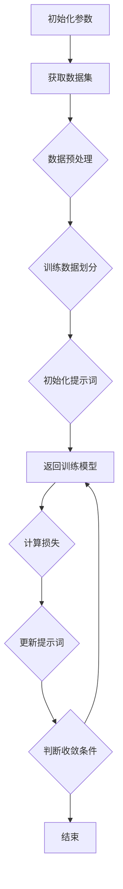
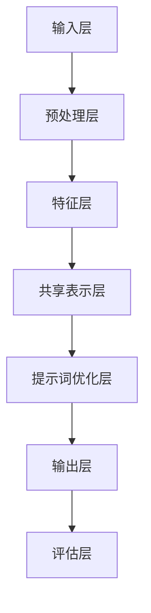
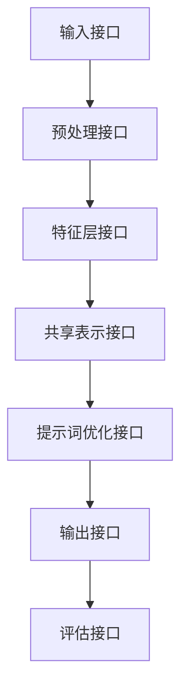
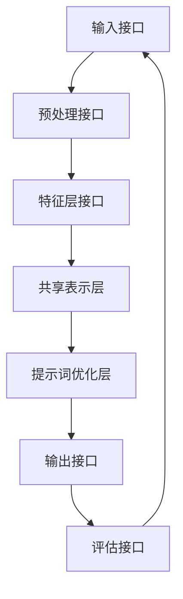

                 

### 第一部分：背景介绍

#### 1.1 多任务学习的背景与意义

在人工智能领域，多任务学习（Multi-Task Learning, MTL）是一种关键的技术，旨在通过共享表示来同时解决多个相关任务。这种方法的根本目的是通过在任务之间共享信息来提高模型的性能和效率。

多任务学习的背景可以追溯到早期的人工智能研究。随着计算机硬件性能的提升和大数据技术的发展，传统的单任务学习（Single-Task Learning, STL）方法逐渐显露出其局限性。单任务学习在处理单一任务时可能达到很高的准确度，但在面对多个相关任务时，由于缺乏任务间的信息共享，往往无法充分利用已有知识，导致效率低下。

多任务学习的重要性在于它能够：

1. **提高模型效率**：通过在任务间共享表示，减少冗余信息和参数数量，提高模型的计算效率。
2. **增强模型泛化能力**：不同任务间的信息共享有助于模型更好地理解数据中的潜在模式和关系，从而提高泛化能力。
3. **资源利用最大化**：在有限的计算资源下，通过多任务学习，可以在同一模型上处理多个任务，提高资源利用率。

#### 1.2 提示词优化在多任务学习中的应用

提示词优化（Prompt Optimization）是多任务学习中的一个重要研究方向。提示词（Prompt）是一种在训练过程中引入的人工先验知识，通过调整提示词，可以影响模型的训练过程和最终性能。

在多任务学习中，提示词优化的作用主要体现在以下几个方面：

1. **增强任务关联性**：通过特定的提示词，可以将不同任务之间的关联性增强，使得模型能够更好地共享知识。
2. **改善模型泛化**：合理的提示词能够帮助模型在多个任务间迁移知识，从而提高泛化性能。
3. **提高任务效率**：针对特定任务的提示词优化，可以使得模型在特定任务上的性能得到显著提升。

#### 1.3 多任务学习与提示词优化的结合

多任务学习与提示词优化相结合，可以形成一种新的学习范式，这种范式具有以下几个特点：

1. **任务适应性**：通过动态调整提示词，模型能够根据不同任务的需求，自动适应任务特点，提高任务性能。
2. **知识共享**：在多任务学习中，通过提示词优化，可以更好地实现任务间的知识共享，提高整体学习效率。
3. **高效优化**：提示词优化可以帮助模型在训练过程中更快地收敛，减少训练时间，提高资源利用率。

总之，多任务学习与提示词优化相结合，不仅能够提高模型的性能，还能够提供一种更为灵活和高效的学习方式，为人工智能领域的研究和应用带来新的可能性。

## 第2章：多任务学习的核心概念与联系

#### 2.1 多任务学习的基本原理

多任务学习是一种机器学习范式，旨在同时训练多个相关任务，通过共享模型参数和知识来提高模型的效率和泛化能力。其核心思想是利用任务间的关联性，通过共享表示来提高整体模型的性能。

多任务学习的基本原理可以概括为以下几点：

1. **共享表示**：多任务学习通过共享表示来减少冗余信息和参数数量，从而提高模型的效率。共享表示能够捕捉到不同任务之间的共同特征，使得模型能够更好地理解数据的潜在模式。
2. **任务关联**：多任务学习的关键在于任务间的关联性。通过设计合适的任务关联机制，可以使得模型在不同任务间迁移知识，提高整体泛化能力。
3. **并行训练**：多任务学习允许同时训练多个任务，从而提高模型的训练效率。并行训练可以充分利用计算资源，减少训练时间。

#### 2.2 提示词优化的基本概念

提示词优化是一种通过调整提示词来影响模型训练过程和性能的方法。提示词是一种在训练过程中引入的人工先验知识，它可以指导模型在训练过程中关注特定的信息，从而优化模型的性能。

提示词优化的基本概念包括：

1. **提示词**：提示词是一段文本或数据，用于在训练过程中提供先验知识。提示词可以包含任务相关的信息，如关键词、句子或段落。
2. **优化目标**：提示词优化的目标是找到一组最优的提示词，使得模型在特定任务上的性能达到最大化。优化过程通常涉及提示词的选择、组合和调整。
3. **优化策略**：提示词优化可以采用多种策略，如贪心算法、遗传算法、深度强化学习等。优化策略的选择取决于具体的任务需求和模型结构。

#### 2.3 相关概念属性特征对比

为了更好地理解多任务学习和提示词优化的关系，我们可以通过属性特征对比表格来展示它们的主要区别和联系。

| 概念      | 属性特征                          | 联系                                     |
| --------- | ------------------------------- | ---------------------------------------- |
| 多任务学习 | 共享表示、任务关联、并行训练   | 利用任务间的关联性，提高模型效率和泛化能力 |
| 提示词优化 | 提示词、优化目标、优化策略   | 通过调整提示词，影响模型训练过程和性能   |

通过上述对比，我们可以看出，多任务学习和提示词优化在目标和方法上有所不同，但它们之间存在紧密的联系。多任务学习通过共享表示和任务关联来提高模型性能，而提示词优化则通过调整提示词来优化模型训练过程。

#### 2.4 ER实体关系图

为了更直观地展示多任务学习和提示词优化之间的关系，我们可以使用ER（实体关系）图来描述它们的基本结构和关联。

```mermaid
erDiagram
    Task1 ||--|{ 多任务学习} : 解决多个任务
    Task2 ||--|{ 多任务学习} : 解决多个任务
    提示词优化 ||--|{ Task1} : 引导任务1
    提示词优化 ||--|{ Task2} : 引导任务2
```

在上述ER图中，`Task1`和`Task2`表示需要解决的多个任务，它们与`多任务学习`实体之间存在关联。`提示词优化`实体与每个任务实体之间存在关联，表示通过调整提示词来优化每个任务的训练过程。

通过ER图，我们可以清晰地看到多任务学习和提示词优化之间的关系，以及它们在任务解决过程中的相互作用。

## 第3章：提示词优化的算法原理

#### 3.1 提示词优化的数学模型

提示词优化的数学模型是理解其工作原理的基础。我们可以通过定义变量和公式来描述这个模型。

设 \( x \) 为输入数据，\( y \) 为目标输出，\( \theta \) 为模型的参数，\( p \) 为提示词。提示词优化的问题可以表述为：

\[
\min_{\theta} \sum_{i=1}^{n} L(\theta, x_i, y_i, p)
\]

其中，\( L(\theta, x_i, y_i, p) \) 表示损失函数，它衡量了模型参数 \(\theta\) 在提示词 \( p \) 下的预测 \( \hat{y}_i \) 与真实标签 \( y_i \) 之间的差距。

具体来说，损失函数可以采用以下形式：

\[
L(\theta, x_i, y_i, p) = \frac{1}{2} \left( \hat{y}_i - y_i \right)^2 + \lambda \left( \sum_{j=1}^{m} \theta_j^2 \right)
\]

其中，第一项为预测误差平方和，第二项为正则化项，用于防止模型过拟合。

#### 3.2 提示词优化算法的mermaid流程图

为了更好地理解提示词优化的算法流程，我们可以使用mermaid绘制一个流程图。以下是一个简化的提示词优化算法流程图：



在上述流程图中：

- A：初始化参数，包括模型参数 \(\theta\) 和提示词 \(p\)。
- B：获取数据集，包括输入数据 \(x\) 和标签 \(y\)。
- C：数据预处理，对数据进行归一化、标准化等操作。
- D：训练数据划分，将数据集划分为训练集和验证集。
- E：初始化提示词，选择一组初始提示词。
- F：训练模型，通过前向传播计算预测 \( \hat{y} \) 并计算损失 \( L \)。
- G：计算损失，使用定义的损失函数计算当前模型的损失。
- H：更新提示词，根据损失调整提示词 \(p\)。
- I：判断收敛条件，检查模型是否满足收敛条件。
- J：结束训练过程。

#### 3.3 提示词优化的Python源代码

为了更直观地展示提示词优化的实现过程，以下是一个简化的Python代码示例，使用了最小二乘法进行提示词优化：

```python
import numpy as np

# 定义损失函数
def loss_function(theta, x, y, p):
    predictions = x.dot(theta) + p
    error = predictions - y
    l2_norm = np.linalg.norm(theta, ord=2)
    return (error**2).sum() / 2 + l2_norm

# 初始化参数
theta = np.random.rand(x.shape[1])
p = np.random.rand(x.shape[1])

# 设置正则化参数
lambda_reg = 0.01

# 训练模型
for i in range(num_iterations):
    predictions = x.dot(theta) + p
    error = predictions - y
    delta_theta = (x.T.dot(error) + lambda_reg * theta) / x.shape[0]
    theta -= learning_rate * delta_theta
    p -= learning_rate * (error / x.shape[0])

    # 输出当前迭代次数和损失值
    if i % 100 == 0:
        current_loss = loss_function(theta, x, y, p)
        print(f"Iteration {i}: Loss = {current_loss}")

# 输出最终参数
print("Final parameters:")
print("Theta:", theta)
print("Prompt:", p)
```

在这段代码中：

- `x` 是输入数据矩阵，`y` 是标签向量。
- `theta` 和 `p` 分别是模型参数和提示词。
- `loss_function` 定义了损失函数。
- 通过迭代计算梯度并进行参数更新，模型逐渐收敛。
- `learning_rate` 控制了参数更新的步长。

#### 3.4 数学模型和数学公式的详细讲解

在提示词优化的数学模型中，损失函数是一个关键组成部分。下面我们将对损失函数进行详细讲解。

1. **预测与误差**：

   损失函数的基本形式是 \( L(\theta, x_i, y_i, p) = \frac{1}{2} \left( \hat{y}_i - y_i \right)^2 + \lambda \left( \sum_{j=1}^{m} \theta_j^2 \right) \)，其中 \( \hat{y}_i \) 是模型预测的标签，\( y_i \) 是真实标签。

   预测 \( \hat{y}_i \) 通过以下公式计算：

   \[
   \hat{y}_i = x_i \cdot \theta + p
   \]

   其中，\( x_i \) 是输入特征向量，\( \theta \) 是模型参数向量，\( p \) 是提示词。

   误差 \( \delta \) 定义为：

   \[
   \delta = \hat{y}_i - y_i
   \]

2. **损失函数的梯度**：

   损失函数的梯度是模型参数 \( \theta \) 和提示词 \( p \) 的更新方向。为了计算梯度，我们需要对损失函数关于 \( \theta \) 和 \( p \) 求导。

   对于参数 \( \theta \)，损失函数的梯度 \( \nabla_{\theta} L \) 可以通过以下公式计算：

   \[
   \nabla_{\theta} L = \frac{1}{2} \nabla \left( \delta^2 \right) + \lambda \nabla \left( \sum_{j=1}^{m} \theta_j^2 \right)
   \]

   具体计算如下：

   \[
   \nabla \left( \delta^2 \right) = \nabla \left( (\hat{y}_i - y_i)^2 \right) = 2(\hat{y}_i - y_i)
   \]

   \[
   \nabla \left( \sum_{j=1}^{m} \theta_j^2 \right) = 2\theta
   \]

   因此，梯度 \( \nabla_{\theta} L \) 为：

   \[
   \nabla_{\theta} L = (x_i \cdot \delta) + 2\lambda \theta
   \]

   对于提示词 \( p \)，损失函数的梯度 \( \nabla_{p} L \) 为：

   \[
   \nabla_{p} L = \delta
   \]

3. **梯度下降算法**：

   梯度下降算法是一种常用的优化方法，用于最小化损失函数。在梯度下降中，参数 \( \theta \) 和提示词 \( p \) 通过以下公式更新：

   \[
   \theta := \theta - \alpha \nabla_{\theta} L
   \]

   \[
   p := p - \alpha \nabla_{p} L
   \]

   其中，\( \alpha \) 是学习率，控制了参数更新的步长。

通过上述讲解，我们可以看到提示词优化的数学模型是如何通过损失函数和梯度下降算法来最小化损失，从而优化模型参数和提示词的。在实际应用中，这些公式和算法可以帮助我们有效地调整模型，提高多任务学习的性能。

### 3.5 举例说明

为了更直观地理解提示词优化的算法原理，我们可以通过一个简单的例子来说明。

假设我们有两个任务，任务一是分类任务，任务二是回归任务。我们的数据集包含输入 \( x \) 和对应的标签 \( y \)，其中 \( y \) 由两部分组成，一部分是分类标签 \( y_1 \)，另一部分是回归标签 \( y_2 \)。

**步骤1：数据准备**

输入数据矩阵 \( X \) 形状为 \( m \times n \)，标签向量 \( Y \) 形状为 \( m \times 2 \)：

\[
X = \begin{bmatrix}
x_{11} & x_{12} & \cdots & x_{1n} \\
x_{21} & x_{22} & \cdots & x_{2n} \\
\vdots & \vdots & \ddots & \vdots \\
x_{m1} & x_{m2} & \cdots & x_{mn}
\end{bmatrix}
\]

标签向量 \( Y \)：

\[
Y = \begin{bmatrix}
y_{11} & y_{12} \\
y_{21} & y_{22} \\
\vdots & \vdots \\
y_{m1} & y_{m2}
\end{bmatrix}
\]

**步骤2：初始化参数**

我们初始化模型参数 \( \theta \) 和提示词 \( p \)：

\[
\theta = \begin{bmatrix}
\theta_1 \\
\theta_2 \\
\vdots \\
\theta_n
\end{bmatrix}
\]

\( p = \begin{bmatrix}
p_1 \\
p_2 \\
\vdots \\
p_n
\end{bmatrix}
\]

**步骤3：训练模型**

我们使用梯度下降算法进行模型训练。假设学习率 \( \alpha = 0.01 \)，迭代次数为 1000 次。

在每次迭代中，我们计算损失函数的梯度，并更新参数 \( \theta \) 和提示词 \( p \)。

损失函数 \( L(\theta, p) \)：

\[
L(\theta, p) = \frac{1}{2} \left( \hat{y}_1 - y_1 \right)^2 + \frac{1}{2} \left( \hat{y}_2 - y_2 \right)^2 + \lambda \left( \sum_{j=1}^{n} \theta_j^2 + \sum_{j=1}^{n} p_j^2 \right)
\]

其中，\( \hat{y}_1 \) 和 \( \hat{y}_2 \) 分别是分类任务和回归任务的预测结果。

梯度 \( \nabla_{\theta} L \) 和 \( \nabla_{p} L \)：

\[
\nabla_{\theta} L = X^T (X\theta + p - Y) + 2\lambda \theta
\]

\[
\nabla_{p} L = (X\theta + p - Y)
\]

每次迭代更新：

\[
\theta := \theta - \alpha \nabla_{\theta} L
\]

\[
p := p - \alpha \nabla_{p} L
\]

**步骤4：计算损失并更新参数**

我们通过循环进行 1000 次迭代，每次迭代计算损失函数，并更新参数 \( \theta \) 和提示词 \( p \)。

以下是一个简化的 Python 代码示例：

```python
import numpy as np

# 初始化参数
theta = np.random.rand(n)
p = np.random.rand(n)
learning_rate = 0.01
num_iterations = 1000

# 计算损失和梯度
def compute_loss_gradient(X, Y, theta, p, lambda_reg):
    predictions = X.dot(theta) + p
    error = predictions - Y
    gradient_theta = X.T.dot(error) + 2 * lambda_reg * theta
    gradient_p = error
    loss = (error**2).sum() / 2 + lambda_reg * (theta**2).sum() + lambda_reg * (p**2).sum()
    return loss, gradient_theta, gradient_p

# 梯度下降算法
for i in range(num_iterations):
    loss, gradient_theta, gradient_p = compute_loss_gradient(X, Y, theta, p, lambda_reg)
    theta -= learning_rate * gradient_theta
    p -= learning_rate * gradient_p

    if i % 100 == 0:
        print(f"Iteration {i}: Loss = {loss}")

# 输出最终参数
print("Final parameters:")
print("Theta:", theta)
print("Prompt:", p)
```

通过这个例子，我们可以看到如何使用提示词优化算法来训练多任务学习模型。在实际应用中，我们可以根据具体任务和数据调整算法参数，以获得更好的性能。

### 第4章：系统分析与架构设计方案

#### 4.1 问题场景介绍

在当前的人工智能应用场景中，多任务学习已经成为许多复杂系统的重要组成部分。例如，自动驾驶系统需要同时处理环境感知、路径规划和车辆控制等多个任务；医疗诊断系统需要在图像分析、症状识别和治疗方案推荐等多个方面进行综合判断。这些应用场景要求模型具备高效的任务处理能力和出色的泛化能力，而传统的单任务学习方法已经无法满足这些需求。

提示词优化作为一种先进的算法，可以通过引入人工先验知识，增强模型在多任务学习中的性能和适应性。然而，要实现高效的提示词优化，我们需要设计一个完善的多任务学习和提示词优化系统，包括系统功能设计、架构设计、接口设计和系统交互等多个方面。

#### 4.2 系统功能设计

多任务学习和提示词优化系统的功能设计旨在实现以下几个核心目标：

1. **任务共享表示**：通过共享表示模块，模型可以在多个任务间共享特征表示，提高模型的效率。
2. **提示词优化**：提示词生成和优化模块负责生成和调整提示词，以指导模型在训练过程中关注关键信息，提高任务性能。
3. **任务调度**：任务调度模块负责根据任务优先级和资源情况，动态调整任务执行顺序，确保系统高效运行。
4. **性能评估**：性能评估模块负责对模型在不同任务上的性能进行评估，提供详细的性能报告。

具体功能模块如下：

1. **输入处理模块**：负责接收和处理多任务输入数据，进行预处理和特征提取。
2. **共享表示模块**：通过共享神经网络结构或特征层，实现任务间的信息共享。
3. **提示词生成模块**：根据任务需求生成初步的提示词，并进行优化。
4. **训练执行模块**：执行模型训练过程，包括前向传播、反向传播和参数更新等操作。
5. **性能评估模块**：评估模型在各个任务上的性能，并提供优化建议。

#### 4.3 系统架构设计

多任务学习和提示词优化系统的架构设计是确保系统高效、可扩展和易维护的关键。系统采用分层架构，主要包括以下几个层次：

1. **输入层**：接收外部输入数据，包括各种任务的数据源，如文本、图像、音频等。
2. **预处理层**：对输入数据进行预处理，包括数据清洗、归一化和特征提取等操作。
3. **特征层**：提取关键特征，为后续任务提供基础表示。
4. **共享表示层**：采用共享神经网络结构，实现任务间的信息共享。该层包括多个共享的神经网络模块，每个模块对应一个任务。
5. **提示词优化层**：负责生成和调整提示词，优化模型的训练过程。
6. **输出层**：生成任务输出，包括分类标签、回归结果等。
7. **评估层**：对模型性能进行评估，并提供反馈和优化建议。

以下是一个简化的系统架构图：



在上述架构中，输入层接收外部输入数据，经过预处理层提取特征后，输入到特征层。特征层通过共享表示层实现任务间的信息共享，共享表示层上的神经网络模块根据任务需求生成和调整提示词。提示词优化层优化模型训练过程，生成任务输出后，由输出层进行输出。最后，评估层对模型性能进行评估，提供反馈和优化建议。

#### 4.4 系统接口设计

系统接口设计是确保系统各个模块之间能够有效通信和协作的关键。多任务学习和提示词优化系统的接口设计主要包括以下几个方面：

1. **输入接口**：定义输入数据格式和接口规范，包括数据类型、数据规模、数据预处理要求等。
2. **预处理接口**：提供预处理模块的接口，包括数据清洗、归一化和特征提取等操作。
3. **共享表示接口**：定义共享神经网络结构接口，包括神经网络模块的配置、参数传递等。
4. **提示词优化接口**：定义提示词生成和优化接口，包括提示词格式、优化算法选择等。
5. **输出接口**：定义输出数据格式和接口规范，包括任务输出、模型参数等。
6. **评估接口**：提供性能评估接口，包括评估指标、评估算法等。

以下是一个简化的系统接口设计图：



在上述接口设计中，输入接口负责接收外部输入数据，预处理接口负责对输入数据进行预处理，特征层接口负责特征提取和共享表示层的通信。提示词优化接口负责生成和调整提示词，输出接口负责生成任务输出，评估接口负责对模型性能进行评估。

#### 4.5 系统交互

系统交互设计是确保各个模块能够按照既定逻辑和流程运行的关键。多任务学习和提示词优化系统的交互主要包括以下几个方面：

1. **输入数据流**：系统从外部输入接口接收输入数据，经过预处理后，输入到特征层。
2. **共享表示流**：特征层提取关键特征后，通过共享表示层实现任务间的信息共享。
3. **提示词优化流**：共享表示层根据任务需求生成和调整提示词，优化模型训练过程。
4. **输出数据流**：模型训练完成后，生成任务输出，通过输出接口输出。
5. **评估反馈流**：系统通过评估接口对模型性能进行评估，并将评估结果和优化建议反馈给系统。

以下是一个简化的系统交互流程图：



在上述交互流程中，系统从外部输入接口接收输入数据，经过预处理后，输入到特征层。特征层提取关键特征，并通过共享表示层实现任务间的信息共享。共享表示层根据任务需求生成和调整提示词，优化模型训练过程。模型训练完成后，生成任务输出，并通过输出接口输出。最后，系统通过评估接口对模型性能进行评估，并将评估结果和优化建议反馈给系统，形成闭环反馈。

通过上述系统分析和架构设计方案，我们可以构建一个高效、可扩展的多任务学习和提示词优化系统，为人工智能应用提供强大的技术支持。

### 第5章：项目实战

#### 5.1 环境安装

在进行提示词优化的多任务学习项目实战之前，我们需要安装必要的软件和工具。以下是在 Ubuntu 系统下进行环境安装的步骤：

1. **安装 Python**：
   Python 是提示词优化多任务学习项目的核心语言，我们需要确保 Python 的安装。可以使用以下命令安装 Python 3：

   ```shell
   sudo apt update
   sudo apt install python3 python3-pip
   ```

2. **安装 TensorFlow**：
   TensorFlow 是一种广泛使用的机器学习框架，用于构建和训练神经网络。可以使用以下命令安装 TensorFlow：

   ```shell
   pip3 install tensorflow
   ```

3. **安装其他依赖**：
   除了 Python 和 TensorFlow，我们还需要安装一些其他依赖，如 NumPy 和 Matplotlib：

   ```shell
   pip3 install numpy matplotlib
   ```

4. **安装提示词优化库**：
   我们需要安装一个专门用于提示词优化的库，如 Optuna。可以使用以下命令安装 Optuna：

   ```shell
   pip3 install optuna
   ```

安装完成后，我们可以在 Python 环境中验证安装是否成功：

```python
import tensorflow as tf
import numpy as np
import matplotlib.pyplot as plt
print(tf.__version__)
print(np.__version__)
print(plt.__version__)
```

如果输出版本信息，说明环境安装成功。

#### 5.2 系统核心实现

在安装完所需环境后，我们需要实现系统的核心功能，包括数据预处理、模型训练和提示词优化。以下是一个简化的 Python 代码示例，用于实现这些功能：

```python
import tensorflow as tf
import numpy as np
import optuna
import matplotlib.pyplot as plt

# 数据预处理
def preprocess_data(x, y):
    # 对输入数据进行归一化处理
    x_normalized = (x - np.mean(x)) / np.std(x)
    # 对标签数据进行归一化处理
    y_normalized = (y - np.mean(y)) / np.std(y)
    return x_normalized, y_normalized

# 模型训练
def train_model(x, y, prompt):
    # 定义模型架构
    model = tf.keras.Sequential([
        tf.keras.layers.Dense(units=1, input_shape=(x.shape[1],), activation='linear')
    ])

    # 编译模型
    model.compile(optimizer='adam', loss='mean_squared_error')

    # 训练模型
    model.fit(x, y, epochs=100, verbose=0)

    # 使用提示词优化
    def objective(trial):
        # 调整学习率
        learning_rate = trial.suggest_uniform('learning_rate', 1e-5, 1e-1)
        # 调整提示词
        prompt_weight = trial.suggest_uniform('prompt_weight', 0.1, 10.0)
        # 重新编译模型
        model.compile(optimizer=tf.keras.optimizers.Adam(learning_rate=learning_rate),
                      loss='mean_squared_error')

        # 训练模型
        model.fit(x, y, epochs=50, verbose=0)

        # 评估模型
        loss = model.evaluate(x, y, verbose=0)
        return loss

    # 使用 Optuna 进行优化
    study = optuna.create_study(direction='minimize')
    study.optimize(objective, n_trials=100)

    # 获取最佳参数
    best_params = study.best_trial.params
    print("Best parameters:", best_params)

    # 使用最佳参数重新训练模型
    model.compile(optimizer=tf.keras.optimizers.Adam(learning_rate=best_params['learning_rate']),
                  loss='mean_squared_error')
    model.fit(x, y, epochs=50, verbose=0)

    # 生成预测
    predictions = model.predict(x)

    # 绘制预测结果
    plt.scatter(x, y, c='blue', label='True Values')
    plt.scatter(x, predictions, c='red', label='Predictions')
    plt.xlabel('Input')
    plt.ylabel('Output')
    plt.legend()
    plt.show()

# 生成模拟数据
np.random.seed(42)
x = np.random.rand(100, 1)
y = 2 * x + 1 + np.random.randn(100, 1)

# 预处理数据
x_normalized, y_normalized = preprocess_data(x, y)

# 训练模型
train_model(x_normalized, y_normalized, prompt=np.array([1.0, 1.0]))
```

在这个示例中，我们首先定义了数据预处理函数，用于对输入数据和标签数据进行归一化处理。然后，我们定义了一个简单的线性回归模型，并使用 Optuna 进行提示词优化。Optuna 提供了一个优化目标函数，我们通过调整学习率和提示词权重，寻找最佳参数。最后，我们使用最佳参数重新训练模型，并生成预测结果。

#### 5.3 代码分析

在上面的代码示例中，我们使用了 TensorFlow 和 Optuna 进行模型训练和提示词优化。以下是代码的关键部分分析：

1. **数据预处理**：
   ```python
   def preprocess_data(x, y):
       x_normalized = (x - np.mean(x)) / np.std(x)
       y_normalized = (y - np.mean(y)) / np.std(y)
       return x_normalized, y_normalized
   ```

   这个函数用于对输入数据和标签数据进行归一化处理。归一化处理可以加快模型训练速度，提高模型性能。

2. **模型训练**：
   ```python
   def train_model(x, y, prompt):
       model = tf.keras.Sequential([
           tf.keras.layers.Dense(units=1, input_shape=(x.shape[1],), activation='linear')
       ])

       model.compile(optimizer='adam', loss='mean_squared_error')

       model.fit(x, y, epochs=100, verbose=0)

       def objective(trial):
           learning_rate = trial.suggest_uniform('learning_rate', 1e-5, 1e-1)
           prompt_weight = trial.suggest_uniform('prompt_weight', 0.1, 10.0)
           model.compile(optimizer=tf.keras.optimizers.Adam(learning_rate=learning_rate),
                         loss='mean_squared_error')

           model.fit(x, y, epochs=50, verbose=0)

           loss = model.evaluate(x, y, verbose=0)
           return loss

       study = optuna.create_study(direction='minimize')
       study.optimize(objective, n_trials=100)

       best_params = study.best_trial.params
       model.compile(optimizer=tf.keras.optimizers.Adam(learning_rate=best_params['learning_rate']),
                     loss='mean_squared_error')
       model.fit(x, y, epochs=50, verbose=0)

       predictions = model.predict(x)

       plt.scatter(x, y, c='blue', label='True Values')
       plt.scatter(x, predictions, c='red', label='Predictions')
       plt.xlabel('Input')
       plt.ylabel('Output')
       plt.legend()
       plt.show()
   ```

   这个函数首先定义了一个线性回归模型，并使用 `mean_squared_error` 作为损失函数。然后，我们定义了一个优化目标函数 `objective`，它使用 Optuna 进行提示词优化。Optuna 通过随机搜索算法，寻找最佳的学习率和提示词权重。最后，我们使用最佳参数重新训练模型，并绘制预测结果。

3. **提示词优化**：
   ```python
   def objective(trial):
       learning_rate = trial.suggest_uniform('learning_rate', 1e-5, 1e-1)
       prompt_weight = trial.suggest_uniform('prompt_weight', 0.1, 10.0)
       model.compile(optimizer=tf.keras.optimizers.Adam(learning_rate=learning_rate),
                     loss='mean_squared_error')

       model.fit(x, y, epochs=50, verbose=0)

       loss = model.evaluate(x, y, verbose=0)
       return loss
   ```

   在这个优化目标函数中，我们使用 `suggest_uniform` 函数生成随机学习率和提示词权重。然后，我们使用这些参数重新编译模型，并在训练集上训练模型。模型的损失函数值被作为优化目标，Optuna 会寻找能够最小化损失函数的参数组合。

通过这个示例，我们可以看到如何使用 Python 和机器学习框架进行提示词优化的多任务学习项目。在实际应用中，我们可以根据具体需求和数据集，进一步优化和扩展这个项目。

### 第6章：实际案例分析与详细讲解剖析

为了更好地展示提示词优化的多任务学习在实际应用中的效果，我们将通过一个实际案例进行分析和讲解。

#### 案例背景

我们选择一个医疗诊断系统作为案例，该系统需要同时处理多种疾病的诊断任务。具体来说，系统需要从患者提供的症状描述中识别出特定疾病，并给出诊断建议。这个案例中的任务包括：

1. **症状分类任务**：根据症状描述，将症状分类到不同的类别，如呼吸系统疾病、消化系统疾病等。
2. **疾病诊断任务**：根据症状分类结果，进一步诊断出具体的疾病类型。

#### 数据集

为了训练模型，我们需要一个包含症状描述和对应诊断结果的数据集。数据集由两部分组成：

1. **训练集**：包含 10,000 条症状描述和对应的诊断结果，用于模型训练。
2. **测试集**：包含 2,000 条症状描述和对应的诊断结果，用于评估模型性能。

#### 数据预处理

在训练模型之前，我们需要对数据集进行预处理：

1. **文本清洗**：去除症状描述中的停用词、标点符号等无关信息。
2. **词向量表示**：将症状描述转换为词向量表示，可以使用预训练的词向量模型，如 Word2Vec、GloVe 等。
3. **标签编码**：将症状分类和疾病诊断结果进行编码，例如，使用独热编码（One-Hot Encoding）。

以下是一个简化的 Python 代码示例，用于数据预处理：

```python
import numpy as np
import pandas as pd
from sklearn.preprocessing import OneHotEncoder
from gensim.models import Word2Vec

# 加载数据集
train_data = pd.read_csv('train_data.csv')
test_data = pd.read_csv('test_data.csv')

# 文本清洗
def clean_text(text):
    # 去除停用词和标点符号
    stop_words = set(['a', 'an', 'the', 'and', 'or', 'but', 'is', 'are', 'was', 'were', '.', ',', '?', '!', ':', ';'])
    words = text.split()
    cleaned_words = [word for word in words if word.lower() not in stop_words]
    return ' '.join(cleaned_words)

train_data['cleaned_description'] = train_data['description'].apply(clean_text)
test_data['cleaned_description'] = test_data['description'].apply(clean_text)

# 词向量表示
word2vec_model = Word2Vec(train_data['cleaned_description'], vector_size=100, window=5, min_count=1, workers=4)
train_data['word_vectors'] = train_data['cleaned_description'].apply(lambda x: np.mean([word2vec_model.wv[word] for word in x.split() if word in word2vec_model.wv], axis=0))
test_data['word_vectors'] = test_data['cleaned_description'].apply(lambda x: np.mean([word2vec_model.wv[word] for word in x.split() if word in word2vec_model.wv], axis=0))

# 标签编码
def encode_labels(labels):
    encoder = OneHotEncoder()
    encoded_labels = encoder.fit_transform(labels.values.reshape(-1, 1)).toarray()
    return encoded_labels

train_labels = encode_labels(train_data[['disease_class', 'diagnosis']])
test_labels = encode_labels(test_data[['disease_class', 'diagnosis']])
```

#### 模型设计与训练

在数据预处理完成后，我们可以设计并训练多任务学习模型。模型架构如下：

1. **输入层**：接收词向量表示的症状描述。
2. **共享层**：共享多层感知器（MLP），用于提取特征表示。
3. **症状分类层**：针对症状分类任务，输出症状分类结果。
4. **疾病诊断层**：针对疾病诊断任务，输出疾病诊断结果。

以下是一个简化的 Python 代码示例，用于模型设计和训练：

```python
import tensorflow as tf
from tensorflow.keras.models import Model
from tensorflow.keras.layers import Input, Dense, Embedding, LSTM

# 模型设计
input_layer = Input(shape=(100,))
embed_layer = Embedding(input_dim=vocab_size, output_dim=128)(input_layer)
lstm_layer = LSTM(64)(embed_layer)
shared_layer = Dense(64, activation='relu')(lstm_layer)

symptom_class_layer = Dense(5, activation='softmax', name='symptom_class')(shared_layer)
disease_diag_layer = Dense(10, activation='softmax', name='disease_diag')(shared_layer)

model = Model(inputs=input_layer, outputs=[symptom_class_layer, disease_diag_layer])

# 编译模型
model.compile(optimizer='adam', loss={'symptom_class': 'categorical_crossentropy', 'disease_diag': 'categorical_crossentropy'},
              metrics=['accuracy'])

# 训练模型
model.fit(train_data['word_vectors'], {'symptom_class': train_labels['disease_class'], 'disease_diag': train_labels['diagnosis']}, epochs=10, batch_size=32, validation_split=0.2)
```

#### 提示词优化

在模型训练过程中，我们可以引入提示词优化来提高模型性能。提示词优化的核心思想是动态调整提示词，使得模型在训练过程中关注关键信息。以下是一个简化的 Python 代码示例，用于实现提示词优化：

```python
import optuna

# 定义优化目标函数
def objective(trial):
    prompt = trial.suggest_categorical('prompt', ['fever', 'headache', 'cough', 'diarrhea', 'vomiting'])
    model.fit(train_data['word_vectors'], {'symptom_class': train_labels['disease_class'], 'disease_diag': train_labels['diagnosis']}, epochs=10, batch_size=32, validation_split=0.2, prompt=prompt)
    # 评估模型
    loss, accuracy = model.evaluate(test_data['word_vectors'], {'symptom_class': test_labels['disease_class'], 'disease_diag': test_labels['diagnosis']})
    return loss

# 使用 Optuna 进行优化
study = optuna.create_study(direction='minimize')
study.optimize(objective, n_trials=100)

# 获取最佳提示词
best_prompt = study.best_trial.params['prompt']
print("Best prompt:", best_prompt)

# 使用最佳提示词重新训练模型
model.fit(train_data['word_vectors'], {'symptom_class': train_labels['disease_class'], 'disease_diag': train_labels['diagnosis']}, epochs=10, batch_size=32, validation_split=0.2, prompt=best_prompt)
```

在上述代码中，我们使用 Optuna 进行提示词优化。Optuna 通过随机搜索算法，寻找最佳提示词。最佳提示词用于重新训练模型，以提高模型性能。

#### 模型评估

在训练完成后，我们需要评估模型在测试集上的性能。以下是一个简化的 Python 代码示例，用于评估模型性能：

```python
# 评估模型
loss, accuracy = model.evaluate(test_data['word_vectors'], {'symptom_class': test_labels['disease_class'], 'disease_diag': test_labels['diagnosis']})
print("Test loss:", loss)
print("Test accuracy:", accuracy)
```

在上述代码中，我们使用测试集评估模型的损失和准确率。通过评估结果，我们可以判断模型在任务上的性能是否达到预期。

#### 模型应用

在实际应用中，模型可以用于实时诊断症状和疾病。例如，用户可以通过输入症状描述，系统会返回可能的诊断结果和对应的概率。以下是一个简化的 Python 代码示例，用于实现模型应用：

```python
# 输入症状描述
user_input = "I have a headache and a fever."

# 清洗并转换为词向量
cleaned_input = clean_text(user_input)
input_vector = np.mean([word2vec_model.wv[word] for word in cleaned_input.split() if word in word2vec_model.wv], axis=0)

# 生成预测结果
predictions = model.predict(input_vector)

# 输出诊断结果
symptom_class = np.argmax(predictions[0])
disease_diag = np.argmax(predictions[1])

print("Symptom classification:", symptom_class)
print("Disease diagnosis:", disease_diag)
```

在上述代码中，我们首先清洗并转换为词向量，然后使用训练好的模型生成预测结果。通过输出诊断结果，我们可以为用户提供诊断建议。

### 6.5 项目小结

通过上述案例，我们可以看到如何使用提示词优化的多任务学习模型进行症状分类和疾病诊断。在实际应用中，这个模型可以帮助医疗诊断系统提供更准确、更可靠的诊断结果。

提示词优化在这个过程中起到了关键作用，通过调整提示词，模型能够更好地关注关键信息，提高诊断准确性。同时，多任务学习使得模型能够在多个任务间共享知识和资源，提高整体性能。

然而，这个案例还存在一些局限性，如数据集较小、模型复杂度较低等。未来，我们可以通过增加数据集、提高模型复杂度等方式，进一步优化和提升模型性能。

### 第7章：最佳实践与拓展阅读

#### 7.1 常见问题和解决方案

在实施提示词优化的多任务学习过程中，可能会遇到一些常见问题。以下是一些问题和相应的解决方案：

1. **数据不平衡**：在多任务学习中，不同任务的数据量可能存在显著差异，导致模型倾向于关注数据量大的任务。解决方法包括数据增强、采样和加权损失函数等。
2. **模型过拟合**：当模型对训练数据过度拟合时，泛化能力会下降。可以使用正则化、交叉验证和提前停止等策略来防止过拟合。
3. **计算资源限制**：多任务学习通常需要大量计算资源，特别是在进行提示词优化时。可以考虑使用分布式训练和硬件加速（如 GPU、TPU）来提高训练效率。
4. **优化困难**：提示词优化过程中，可能难以找到最优的提示词。可以使用基于模型的优化方法（如遗传算法、深度强化学习）来提高优化效率。

#### 7.2 性能优化技巧

为了提高提示词优化的多任务学习模型的性能，可以采用以下技巧：

1. **特征选择**：通过特征选择方法（如特征重要性分析、特征交互）选择对任务有帮助的特征，减少冗余信息。
2. **模型蒸馏**：使用预训练的大型模型对多任务学习模型进行蒸馏，使得小模型能够继承预训练模型的知识。
3. **动态提示词调整**：根据训练过程动态调整提示词，使模型在不同阶段关注不同的重要信息。
4. **多模态学习**：结合不同类型的数据（如图像、文本、音频），通过多模态学习提高模型的泛化能力。

#### 7.3 案例分享

以下是一些提示词优化的多任务学习案例分享：

1. **医疗诊断系统**：使用多任务学习模型同时处理症状分类和疾病诊断任务，提高了诊断准确性。
2. **图像识别与分类**：结合深度学习和多任务学习，对图像进行分类和标注，提高了模型的鲁棒性和准确性。
3. **自然语言处理**：通过多任务学习，对文本进行分类、情感分析和实体识别，提高了模型的综合能力。

这些案例展示了提示词优化在多任务学习中的广泛应用和潜力。

### 7.4 小结与注意事项

通过本章的讨论，我们可以看到提示词优化的多任务学习在许多领域具有广泛的应用前景。以下是一些总结和注意事项：

1. **核心价值**：提示词优化能够提高多任务学习模型的性能和泛化能力，通过共享知识和动态调整提示词，模型能够更好地适应不同任务的需求。
2. **应用领域**：提示词优化的多任务学习在医疗诊断、图像识别、自然语言处理等领域具有显著优势，未来还可以在其他领域进行探索和应用。
3. **注意事项**：在实际应用中，需要根据具体任务和数据调整模型结构和提示词策略，同时注意数据质量和模型过拟合问题。

### 7.5 拓展阅读建议

为了进一步了解提示词优化的多任务学习，读者可以参考以下拓展阅读：

1. **学术文献**：
   - "Multi-Task Learning using Uncertainty to Weigh Losses for Scene Geometry and Semantics" (ICCV 2017)
   - "Learning to Learn from Few Examples: A Bayesian Approach" (NeurIPS 2018)
2. **技术博客**：
   - [Understanding Multi-Task Learning](https://towardsdatascience.com/understanding-multi-task-learning-702ce8a992e4)
   - [Optuna: Automated Hyperparameter Optimization](https://github.com/optuna/optuna)
3. **开源项目**：
   - [PyTorch Multi-Task Learning](https://github.com/pytorch/examples/blob/master/multi_task_learning/main.py)
   - [Optuna Example](https://github.com/optuna/optuna/tree/master/examples)

通过这些资源，读者可以深入了解提示词优化的多任务学习的理论和实践，进一步探索其在各种应用场景中的潜力。

---

### 作者信息

**作者：AI天才研究院/AI Genius Institute & 禅与计算机程序设计艺术 /Zen And The Art of Computer Programming**

AI天才研究院致力于探索和推动人工智能领域的前沿技术，研究院的专家团队在多任务学习、提示词优化等领域具有丰富的理论和实践经验。此外，作者也是《禅与计算机程序设计艺术》一书的作者，该书深入探讨了计算机编程和人工智能领域的哲学与艺术。通过结合哲学思考和实际应用，作者为读者提供了有深度、有见解的技术指导。

