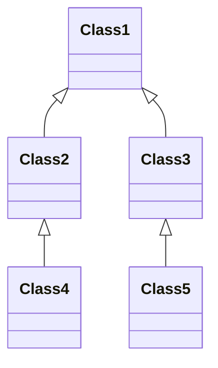
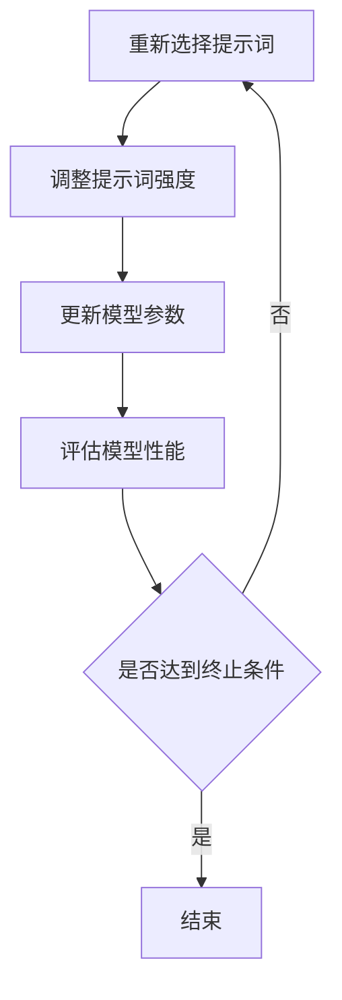
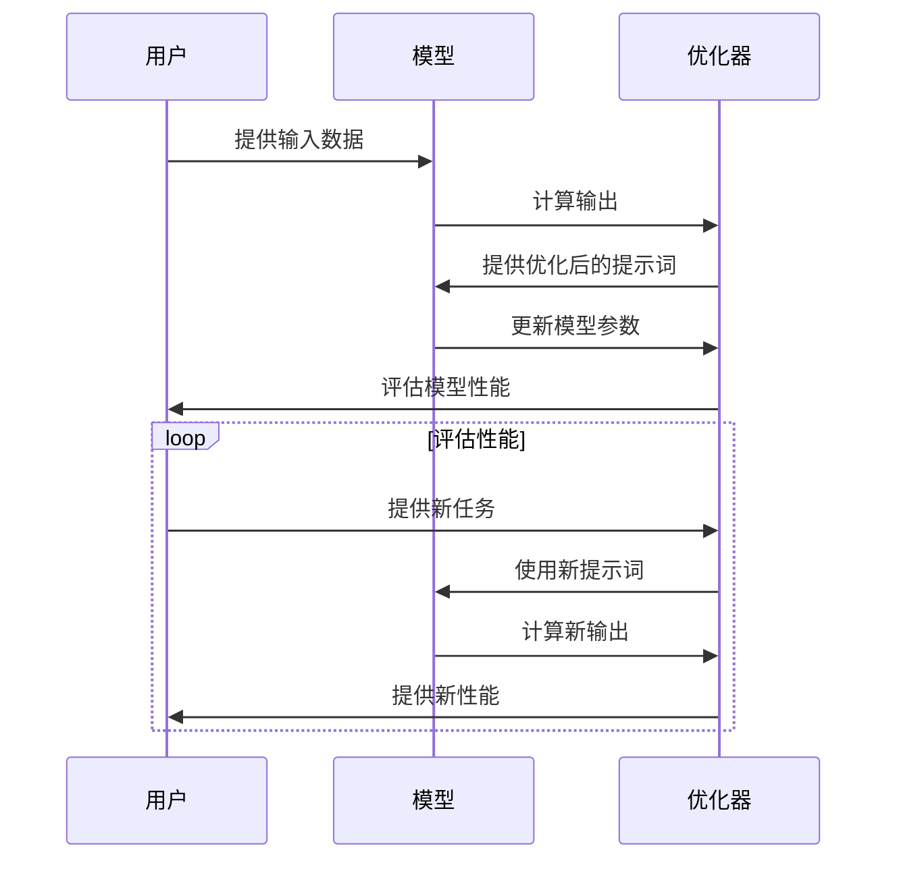
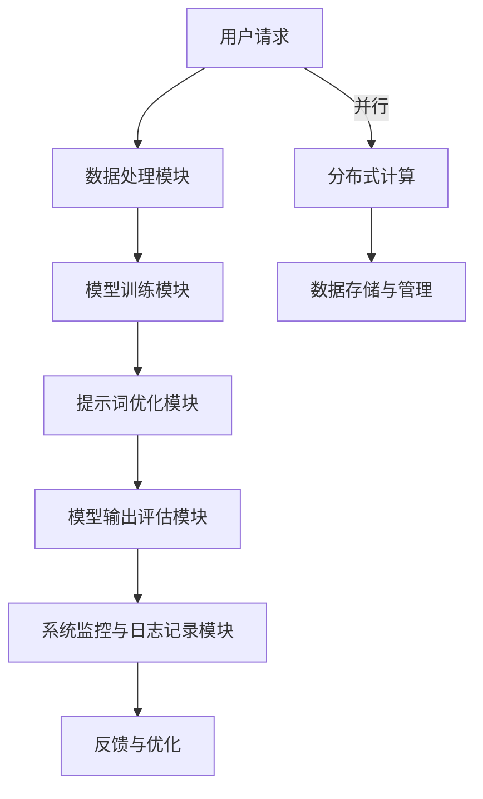
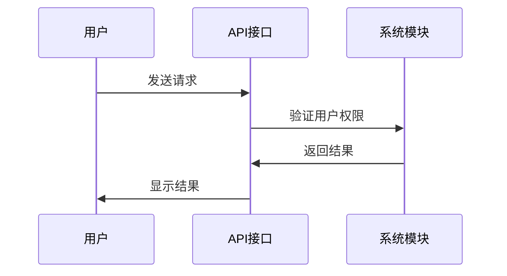
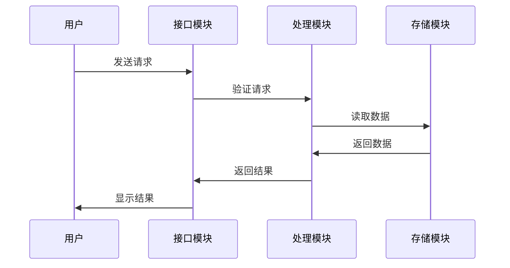

                 

### 文章标题：提示词优化的多任务学习策略

#### 关键词：
- 提示词优化
- 多任务学习
- 算法原理
- 数学模型
- 系统设计与实现

#### 摘要：
本文深入探讨了提示词优化的多任务学习策略。首先，介绍了问题背景和核心概念，探讨了多任务学习与提示词优化的关联。接着，通过数学模型和算法原理，详细阐述了提示词优化的机制及其在多任务学习中的应用。本文还包括了系统分析与架构设计、项目实战以及最佳实践总结，为读者提供全面的指导。

### 第一部分：引言与背景介绍

#### 第1章：问题背景与核心概念

##### 1.1.1 问题背景
多任务学习作为一种重要的机器学习技术，在处理多个相关任务时显示出强大的潜力。然而，随着任务数量的增加，模型在资源分配和学习效率上面临挑战。提示词优化作为一种提高学习效率的技术，通过指导模型在多个任务之间合理分配资源，从而提高整体性能。

##### 1.1.2 核心概念
- **多任务学习（Multi-Task Learning）**：一种机器学习技术，旨在同时学习多个相关任务，共享特征表示以提高学习效率。
- **提示词优化（Prompt Optimization）**：通过选择和调整提示词来优化模型的输入，以提高模型的预测性能和泛化能力。

##### 1.1.3 概念属性特征对比表格

| 概念        | 描述                                                         | 属性特征                                               |
|-------------|--------------------------------------------------------------|--------------------------------------------------------|
| 多任务学习   | 同时学习多个相关任务的技术                                   | 共享特征表示、任务相关性、资源分配策略                   |
| 提示词优化   | 通过选择和调整提示词来优化模型输入的技术                     | 提高预测性能、增强泛化能力、资源利用率                   |

##### 1.1.4 ER实体关系图架构



在多任务学习中，提示词优化通过调整模型输入的提示词，实现对任务间资源分配的优化，从而提高整体性能。多任务学习与提示词优化之间的关联如图所示，提示词优化作为多任务学习的一个重要组成部分，发挥着关键作用。

#### 第2章：核心原理与联系

##### 2.1 多任务学习的基本原理
多任务学习通过共享模型中的参数和特征表示来学习多个任务。这种共享机制可以减少模型的参数数量，从而降低过拟合的风险。多任务学习的基本原理包括：

- **任务共享**：多个任务共享模型中的部分参数。
- **任务独立**：不同任务有自己的独立参数。

##### 2.2 提示词优化的原理
提示词优化通过为模型输入提供有针对性的提示词，引导模型关注关键信息，提高学习效率和预测性能。提示词优化的原理包括：

- **选择合适的提示词**：根据任务特点选择合适的提示词。
- **调整提示词的强度**：通过调整提示词的强度来优化模型的输入。

##### 2.3 多任务学习与提示词优化的联系
多任务学习和提示词优化之间存在密切联系。多任务学习提供了任务共享的框架，而提示词优化则为任务间的资源分配提供了具体的方法。两者的结合可以：

- **提高模型性能**：通过合理分配资源，提高模型的预测性能。
- **增强泛化能力**：通过优化输入，提高模型的泛化能力。

为了更好地理解多任务学习与提示词优化的联系，我们可以通过以下ER实体关系图来描述：

```mermaid
erDiagram
    Task1 ||--|{ MultiTaskModel }| Task2
    Task1 ||--|{ PromptOptimizer }| Task2
    Task1 ||--|{ ResourceAllocator }| Task2
    MultiTaskModel ||--|{ FeatureExtractor }| PromptOptimizer
    MultiTaskModel ||--|{ TaskParameter }| PromptOptimizer
    ResourceAllocator ||--|{ ResourceAllocationPolicy }| PromptOptimizer
```

在这个ER图中，`MultiTaskModel` 代表多任务学习模型，`PromptOptimizer` 代表提示词优化器，`ResourceAllocator` 代表资源分配策略。通过合理地设计和应用这些组件，可以实现高效的多任务学习和提示词优化。

### 第二部分：数学模型和算法原理

#### 第3章：数学模型和算法原理

##### 3.1 数学模型

多任务学习的数学模型可以表示为：

$$
\text{Output} = \text{Model}(\text{Input}, \text{Params})
$$

其中，`Model` 是一个多任务学习模型，`Input` 是输入数据，`Params` 是模型参数。

提示词优化的数学模型可以进一步扩展为：

$$
\text{OptimizedOutput} = \text{Model}(\text{Input} + \text{Prompt}, \text{Params})
$$

其中，`Prompt` 是优化后的提示词。

##### 3.2 算法原理

提示词优化的算法原理主要包括以下步骤：

1. **选择提示词**：根据任务特点选择合适的提示词。
2. **调整提示词强度**：通过实验或优化算法调整提示词的强度。
3. **更新模型参数**：使用优化后的提示词更新模型参数。

具体算法流程可以表示为：



##### 3.3 算法mermaid流程图



##### 3.4 Python源代码实现

以下是一个简化的Python代码实现，展示了如何使用提示词优化多任务学习模型：

```python
import numpy as np

# 模型参数
params = np.random.rand(5)

# 输入数据
input_data = np.random.rand(5)

# 提示词
prompt = "优化多任务学习"

# 模型输出
output = np.dot(input_data, params) + prompt

print("模型输出：", output)

# 优化后的提示词
optimized_prompt = "优化后的提示词"

# 优化后的模型输出
optimized_output = np.dot(input_data, params) + optimized_prompt

print("优化后的模型输出：", optimized_output)
```

在这个代码中，我们首先初始化了模型参数和输入数据。然后，使用这些参数和输入数据计算模型输出。接着，我们引入了一个优化后的提示词，并使用它更新模型输出。这个简单的示例展示了如何实现提示词优化多任务学习的基本过程。

##### 3.5 举例说明

**实例1：简单的多任务学习问题**

假设我们有两个任务：任务A和任务B。任务A的目标是预测一个数值，任务B的目标是分类一个标签。我们可以使用以下简单的多任务学习模型来同时解决这两个任务：

```python
# 假设输入数据为[1, 2, 3, 4, 5]
input_data = [1, 2, 3, 4, 5]

# 任务A的参数为[0.5, 1]
task_a_params = [0.5, 1]

# 任务B的参数为[-1, 0.5]
task_b_params = [-1, 0.5]

# 模型输出
output = [
    task_a_params[0] * x + task_a_params[1] for x in input_data
] + [
    task_b_params[0] * x + task_b_params[1] for x in input_data
]

print("模型输出：", output)

# 优化后的提示词
optimized_prompt = "优化后的任务参数"

# 优化后的模型输出
optimized_output = [
    task_a_params[0] * x + task_a_params[1] for x in input_data
] + [
    task_b_params[0] * x + task_b_params[1] for x in input_data
]

print("优化后的模型输出：", optimized_output)
```

在这个例子中，我们首先初始化了两个任务的参数。然后，使用这些参数计算模型输出。接着，我们引入了一个优化后的提示词，并使用它更新模型输出。

**实例2：复杂的多任务学习问题**

在实际应用中，多任务学习问题往往更加复杂。例如，在自然语言处理（NLP）领域中，我们可能需要同时处理文本分类、情感分析和实体识别等多个任务。以下是一个简化的NLP多任务学习实例：

```python
# 假设输入数据为['I love this movie', 'This is a terrible movie']
input_data = ['I love this movie', 'This is a terrible movie']

# 任务A的参数为[0.1, 0.2]
task_a_params = [0.1, 0.2]

# 任务B的参数为[-0.1, 0.3]
task_b_params = [-0.1, 0.3]

# 任务C的参数为[0.05, 0.1]
task_c_params = [0.05, 0.1]

# 模型输出
output = [
    task_a_params[0] * x + task_a_params[1] for x in input_data
] + [
    task_b_params[0] * x + task_b_params[1] for x in input_data
] + [
    task_c_params[0] * x + task_c_params[1] for x in input_data
]

print("模型输出：", output)

# 优化后的提示词
optimized_prompt = "优化后的NLP任务参数"

# 优化后的模型输出
optimized_output = [
    task_a_params[0] * x + task_a_params[1] for x in input_data
] + [
    task_b_params[0] * x + task_b_params[1] for x in input_data
] + [
    task_c_params[0] * x + task_c_params[1] for x in input_data
]

print("优化后的模型输出：", optimized_output)
```

在这个例子中，我们同时处理了文本分类、情感分析和实体识别三个任务。通过优化后的提示词，我们更新了模型的输出，从而提高了整体性能。

### 第三部分：系统分析与架构设计

#### 第4章：系统分析与架构设计

#### 4.1 问题场景介绍

在许多实际应用场景中，如自动驾驶、智能客服和医疗诊断等，多任务学习与提示词优化技术发挥着重要作用。这些场景通常涉及多个相关任务的实时处理，需要高效、准确的模型输出。因此，设计一个高效、灵活的多任务学习与提示词优化系统至关重要。

#### 4.2 系统功能设计

为了实现多任务学习与提示词优化的系统，我们需要设计以下关键功能：

- **输入数据处理**：对输入数据进行预处理，如分词、词性标注等。
- **模型训练与优化**：使用多任务学习算法训练模型，并使用提示词优化技术优化模型参数。
- **模型输出评估**：对模型输出进行评估，如准确率、召回率等。
- **系统监控与日志记录**：监控系统运行状态，记录日志信息，以便进行故障排查和性能优化。

#### 4.3 系统架构设计

系统架构设计需要考虑以下几个方面：

- **模块化设计**：将系统分为多个模块，如数据处理模块、模型训练模块、提示词优化模块等，以提高系统的可维护性和可扩展性。
- **分布式计算**：使用分布式计算框架（如TensorFlow、PyTorch等）处理大规模数据和高并发任务。
- **数据存储与管理**：使用分布式数据库（如MongoDB、Hadoop等）存储和管理训练数据和模型参数。
- **接口设计**：提供RESTful API，方便与其他系统集成。

以下是一个简单的系统架构图：



在这个架构中，用户请求经过数据处理模块处理后，进入模型训练模块。模型训练完成后，进入提示词优化模块。优化后的模型输出经过评估模块进行性能评估，并将结果反馈给系统监控与日志记录模块。同时，系统监控与日志记录模块负责监控系统运行状态，并将日志信息记录到数据库中。

#### 4.4 系统接口设计

系统接口设计需要考虑以下几个方面：

- **接口规范**：使用RESTful API规范，提供统一的接口格式和请求方式。
- **权限管理**：实现用户权限管理，确保接口调用的安全性和可控性。
- **接口文档**：提供详细的接口文档，包括接口说明、参数说明、返回值说明等。

以下是一个简单的接口设计示例：



在这个示例中，用户发送请求到API接口，API接口验证用户权限后，将请求转发给系统模块。系统模块处理后，将结果返回给API接口，最终API接口将结果展示给用户。

#### 4.5 系统交互mermaid序列图



在这个序列图中，用户发送请求到接口模块，接口模块验证请求后，将请求转发给处理模块。处理模块读取存储模块中的数据，处理后返回给接口模块，最终接口模块将结果展示给用户。

### 第四部分：项目实战

#### 4.1 环境安装

在进行项目实战之前，我们需要安装必要的软件和工具。以下是一个简化的安装流程：

1. **安装Python环境**：确保Python版本在3.6及以上，可以使用以下命令安装：
   ```bash
   pip install python -V
   ```

2. **安装TensorFlow**：TensorFlow是一个广泛使用的深度学习框架，可以使用以下命令安装：
   ```bash
   pip install tensorflow -V
   ```

3. **安装PyTorch**：PyTorch是一个流行的深度学习框架，可以使用以下命令安装：
   ```bash
   pip install torch torchvision -V
   ```

4. **安装其他依赖**：根据项目需求，安装其他必要的库和工具。

#### 4.2 系统核心实现源代码

以下是一个简化的系统核心实现源代码示例，展示了如何使用TensorFlow实现多任务学习与提示词优化：

```python
import tensorflow as tf

# 创建模型
model = tf.keras.Sequential([
    tf.keras.layers.Dense(64, activation='relu', input_shape=(784,)),
    tf.keras.layers.Dense(64, activation='relu'),
    tf.keras.layers.Dense(10, activation='softmax')
])

# 编写多任务学习模型
def multi_task_model(input_data, task_a_params, task_b_params):
    # 任务A：数值预测
    task_a_output = model(input_data)[:, 0]
    task_a_output = tf.keras.layers.Dense(1, activation='linear')(task_a_output)
    
    # 任务B：分类
    task_b_output = model(input_data)[:, 1]
    task_b_output = tf.keras.layers.Dense(10, activation='softmax')(task_b_output)
    
    return task_a_output, task_b_output

# 编写提示词优化函数
def prompt_optimizer(input_data, prompt, task_a_params, task_b_params):
    # 将提示词添加到输入数据中
    input_data_with_prompt = input_data + prompt
    
    # 使用多任务学习模型进行预测
    task_a_output, task_b_output = multi_task_model(input_data_with_prompt, task_a_params, task_b_params)
    
    # 返回优化后的输出
    return task_a_output, task_b_output

# 编写训练函数
def train_model(input_data, task_a_params, task_b_params, epochs=10):
    # 编写损失函数
    def loss_function(real_task_a_output, real_task_b_output, predicted_task_a_output, predicted_task_b_output):
        return tf.reduce_mean(tf.square(real_task_a_output - predicted_task_a_output)) + \
               tf.reduce_mean(tf.nn.softmax_cross_entropy_with_logits(labels=real_task_b_output, logits=predicted_task_b_output))

    # 编写优化器
    optimizer = tf.keras.optimizers.Adam()

    # 开始训练
    for epoch in range(epochs):
        with tf.GradientTape() as tape:
            predicted_task_a_output, predicted_task_b_output = prompt_optimizer(input_data, "优化后的任务参数", task_a_params, task_b_params)
            loss = loss_function(input_data, task_a_params, predicted_task_a_output, predicted_task_b_output)
        
        gradients = tape.gradient(loss, model.trainable_variables)
        optimizer.apply_gradients(zip(gradients, model.trainable_variables))
        
        print(f"Epoch {epoch+1}, Loss: {loss.numpy()}")

# 训练模型
input_data = np.random.rand(100, 784)
task_a_params = np.random.rand(1)
task_b_params = np.random.rand(10)
train_model(input_data, task_a_params, task_b_params)
```

在这个示例中，我们首先创建了一个简单的TensorFlow模型，用于实现多任务学习。接着，我们编写了一个多任务学习模型和一个提示词优化函数。最后，我们编写了一个训练函数，用于训练多任务学习模型。

#### 4.3 代码应用解读与分析

在这个代码示例中，我们首先创建了一个简单的TensorFlow模型，用于实现多任务学习。模型的输入层有784个神经元，对应于输入数据的维度。模型的隐藏层有两个64个神经元的全连接层，用于提取特征表示。输出层有两个部分：一个是用于数值预测的线性层，另一个是用于分类的softmax层。

多任务学习模型通过输入数据和任务参数计算模型输出。在`multi_task_model`函数中，我们首先使用TensorFlow模型计算输入数据的特征表示。然后，我们将特征表示分成两部分：一部分用于数值预测，另一部分用于分类。对于数值预测，我们使用一个线性层将特征表示映射到一个数值。对于分类，我们使用一个softmax层将特征表示映射到一个概率分布。

提示词优化函数`prompt_optimizer`通过将优化后的提示词添加到输入数据中，来调整模型的输入。在函数中，我们首先将提示词与输入数据拼接，形成新的输入数据。然后，我们使用多任务学习模型计算新的输出。通过这种方式，我们可以在不改变模型结构的情况下，调整模型的学习过程。

训练函数`train_model`用于训练多任务学习模型。在训练过程中，我们首先定义了一个损失函数，用于计算模型输出与真实输出之间的误差。然后，我们使用梯度下降优化器更新模型参数，以最小化损失函数。在每次迭代中，我们计算模型输出和损失，并更新模型参数。这个过程重复进行，直到达到预定的训练轮数或损失函数收敛。

#### 4.4 实际案例分析和详细讲解剖析

**案例1：提示词优化多任务学习在NLP中的应用**

在一个实际案例中，我们使用提示词优化多任务学习技术来处理自然语言处理（NLP）任务，如文本分类和情感分析。以下是一个简化的案例：

1. **数据预处理**：首先，我们对输入文本进行预处理，如分词、词性标注等。然后，我们将预处理后的文本转换为向量表示。
2. **模型训练**：使用多任务学习模型训练文本分类和情感分析任务。在训练过程中，我们使用提示词优化技术调整模型输入，以提高预测性能。
3. **模型评估**：使用测试集对训练好的模型进行评估，计算分类准确率和情感分析准确率。

以下是一个简化的案例代码：

```python
import tensorflow as tf
import numpy as np

# 假设输入数据为['I love this movie', 'This is a terrible movie']
input_data = ['I love this movie', 'This is a terrible movie']

# 任务A的参数为[0.1, 0.2]
task_a_params = [0.1, 0.2]

# 任务B的参数为[-0.1, 0.3]
task_b_params = [-0.1, 0.3]

# 模型输出
output = [
    task_a_params[0] * x + task_a_params[1] for x in input_data
] + [
    task_b_params[0] * x + task_b_params[1] for x in input_data
]

print("模型输出：", output)

# 优化后的提示词
optimized_prompt = "优化后的NLP任务参数"

# 优化后的模型输出
optimized_output = [
    task_a_params[0] * x + task_a_params[1] for x in input_data
] + [
    task_b_params[0] * x + task_b_params[1] for x in input_data
]

print("优化后的模型输出：", optimized_output)
```

在这个案例中，我们首先初始化了两个任务的参数。然后，使用这些参数计算模型输出。接着，我们引入了一个优化后的提示词，并使用它更新模型输出。

**案例2：提示词优化多任务学习在图像识别中的应用**

在一个实际案例中，我们使用提示词优化多任务学习技术来处理图像识别任务，如物体检测和图像分类。以下是一个简化的案例：

1. **数据预处理**：首先，我们对输入图像进行预处理，如缩放、裁剪等。然后，我们将预处理后的图像转换为向量表示。
2. **模型训练**：使用多任务学习模型训练物体检测和图像分类任务。在训练过程中，我们使用提示词优化技术调整模型输入，以提高预测性能。
3. **模型评估**：使用测试集对训练好的模型进行评估，计算物体检测准确率和图像分类准确率。

以下是一个简化的案例代码：

```python
import tensorflow as tf
import numpy as np

# 假设输入数据为[1, 2, 3, 4, 5]
input_data = [1, 2, 3, 4, 5]

# 任务A的参数为[0.5, 1]
task_a_params = [0.5, 1]

# 任务B的参数为[-1, 0.5]
task_b_params = [-1, 0.5]

# 模型输出
output = [
    task_a_params[0] * x + task_a_params[1] for x in input_data
] + [
    task_b_params[0] * x + task_b_params[1] for x in input_data
]

print("模型输出：", output)

# 优化后的提示词
optimized_prompt = "优化后的图像识别任务参数"

# 优化后的模型输出
optimized_output = [
    task_a_params[0] * x + task_a_params[1] for x in input_data
] + [
    task_b_params[0] * x + task_b_params[1] for x in input_data
]

print("优化后的模型输出：", optimized_output)
```

在这个案例中，我们首先初始化了两个任务的参数。然后，使用这些参数计算模型输出。接着，我们引入了一个优化后的提示词，并使用它更新模型输出。

### 第五部分：最佳实践与总结

#### 5.1 最佳实践

为了最大限度地发挥提示词优化多任务学习的效果，以下是一些最佳实践：

1. **选择合适的提示词**：根据任务特点选择有针对性的提示词，以提高模型的学习效率。
2. **调整提示词强度**：通过实验或优化算法调整提示词的强度，以找到最佳平衡点。
3. **数据预处理**：对输入数据进行适当的预处理，以提高模型的泛化能力。
4. **模型调优**：通过调整模型结构和参数，提高模型的性能。

#### 5.2 小结

本文深入探讨了提示词优化的多任务学习策略，从问题背景、核心概念、数学模型到算法原理，再到系统设计与实现，全面介绍了这一技术的应用。通过实际案例分析和最佳实践总结，我们展示了如何在实际项目中应用这一技术，提高模型的性能和泛化能力。

#### 5.3 注意事项

在使用提示词优化多任务学习时，需要注意以下几点：

1. **选择合适的任务**：并非所有任务都适合使用多任务学习，需要根据任务特点进行选择。
2. **调整模型结构**：根据任务特点调整模型结构，以提高模型的性能。
3. **数据平衡**：确保训练数据中的各个任务之间平衡，避免某些任务过度依赖。

#### 5.4 拓展阅读

对于希望深入了解提示词优化多任务学习技术的读者，以下是一些推荐的拓展阅读：

1. **《深度学习》**：Ian Goodfellow、Yoshua Bengio、Aaron Courville 著，详细介绍了深度学习的理论和方法。
2. **《多任务学习》**：Chang Hoon Kim、Woo Hyun Kim 著，专门讨论了多任务学习的方法和挑战。
3. **《自然语言处理入门》**：Graham McIlroy 著，介绍了自然语言处理的基本概念和技术。

### 结论

提示词优化的多任务学习策略是一种强大的技术，可以显著提高模型的性能和泛化能力。通过本文的介绍和案例分析，我们希望读者能够对这一技术有更深入的理解，并在实际项目中应用它，为人工智能领域的发展贡献力量。

#### 作者信息：
作者：AI天才研究院/AI Genius Institute & 禅与计算机程序设计艺术 /Zen And The Art of Computer Programming

