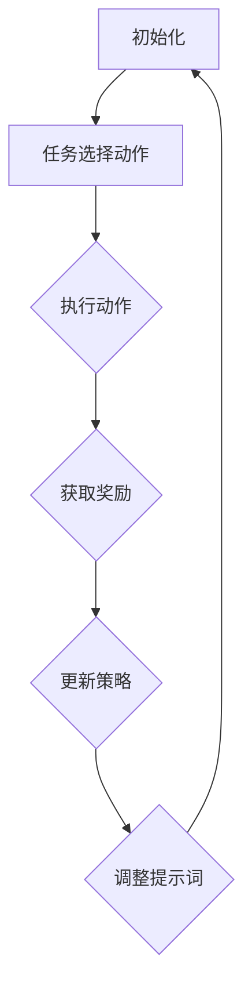
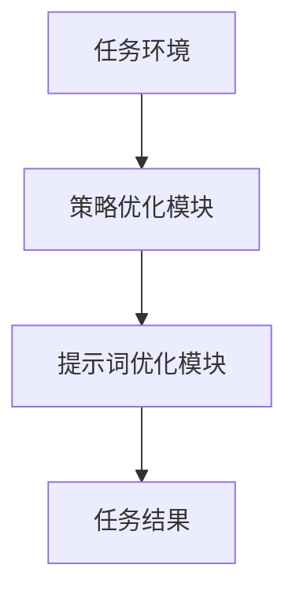

                 

# 提示词优化的多任务强化学习方法

关键词：多任务学习、强化学习、提示词优化、算法原理、系统架构、项目实战

摘要：本文将深入探讨提示词优化的多任务强化学习方法，通过逐步分析其核心概念、算法原理以及系统架构设计，帮助读者理解这一前沿技术。文章将结合具体项目实战，详细讲解其实际应用和实现过程，并提供最佳实践建议，以助读者深入掌握该技术。

## 目录大纲

1. **背景介绍**
   1.1 问题背景
   1.2 问题描述
   1.3 问题解决
   1.4 边界与外延
   1.5 概念结构与核心要素组成

2. **核心概念与联系**
   2.1 多任务学习
   2.2 强化学习
   2.3 提示词优化
   2.4 概念属性特征对比表格
   2.5 ER实体关系图

3. **算法原理讲解**
   3.1 算法原理概述
   3.2 算法流程图
   3.3 Python源代码
   3.4 数学模型与公式
   3.5 举例说明

4. **系统分析与架构设计方案**
   4.1 系统场景介绍
   4.2 项目介绍
   4.3 系统功能设计
   4.4 系统架构设计
   4.5 系统接口设计
   4.6 系统交互

5. **项目实战**
   5.1 环境安装
   5.2 系统核心实现源代码
   5.3 代码应用解读与分析
   5.4 实际案例分析与详细讲解剖析
   5.5 项目小结

6. **最佳实践 tips、小结、注意事项、拓展阅读等内容**

## 1. 背景介绍

### 1.1 问题背景

在当今的AI领域，多任务强化学习（Multi-Task Reinforcement Learning, MTRL）已经成为了一个热门的研究方向。随着深度学习和强化学习的不断发展，如何在多个任务之间共享知识和优化策略成为了一个重要的课题。然而，传统的多任务强化学习方法往往面临着任务间冲突、效率低下等问题。

### 1.2 问题描述

在多任务强化学习中，每个任务都需要一个独立的策略来优化。然而，当任务数量增加时，独立策略的优化过程会变得非常复杂，导致计算成本和训练时间大幅增加。此外，不同任务之间的策略优化还可能存在冲突，导致整体性能下降。因此，如何有效地解决多任务强化学习中的任务冲突和优化效率问题是当前研究的关键问题。

### 1.3 问题解决

为了解决多任务强化学习中的问题，研究人员提出了一种名为“提示词优化”（Hint Optimization）的方法。该方法通过在任务之间引入共享的提示词（Hint），来协调不同任务之间的策略优化，从而提高整体性能。提示词优化的核心思想是在每个任务的基础上，增加一个全局的优化目标，使得任务之间的策略能够更好地共享信息和优化。

### 1.4 边界与外延

在提示词优化的多任务强化学习中，边界条件包括任务的数量、任务的复杂度以及任务的关联性。外延则涉及到如何在不同场景下调整和优化提示词，以适应不同的任务需求。

### 1.5 概念结构与核心要素组成

多任务强化学习的概念结构主要包括以下几个核心要素：

- **任务表示**：将每个任务抽象为一个状态-动作-奖励的三元组。
- **策略优化**：基于强化学习算法，优化每个任务的策略。
- **提示词优化**：引入全局的优化目标，协调不同任务之间的策略共享。
- **算法迭代**：通过迭代更新策略和提示词，实现多任务优化。

## 2. 核心概念与联系

### 2.1 多任务学习

多任务学习（Multi-Task Learning, MTL）是一种机器学习技术，它旨在通过同时学习多个相关任务来提高模型的泛化能力和效率。在多任务学习中，模型需要学会在不同任务之间共享信息和知识，从而提高整体性能。

### 2.2 强化学习

强化学习（Reinforcement Learning, RL）是一种通过与环境互动来学习最优策略的机器学习技术。在强化学习中，模型通过不断尝试和反馈来优化策略，以达到最大化奖励的目的。

### 2.3 提示词优化

提示词优化（Hint Optimization）是一种在多任务强化学习中协调不同任务之间策略共享的方法。通过引入全局的优化目标，提示词优化能够有效地减少任务之间的冲突，提高整体性能。

### 2.4 概念属性特征对比表格

| 概念        | 定义                                                                                          | 特征对比 |
|-------------|----------------------------------------------------------------------------------------------|---------|
| 多任务学习  | 同时学习多个相关任务，共享信息和知识。                                                      | - 高度相关任务间的共享性高 |
| 强化学习    | 通过与环境互动学习最优策略，最大化奖励。                                                   | - 策略迭代过程复杂 |
| 提示词优化  | 引入全局优化目标，协调任务间策略共享。                                                   | - 提高优化效率 |

### 2.5 ER实体关系图

```mermaid
erDiagram
    Task ||--|{ Policy }||> Optimization
    Optimization ||--|{ Hint }||> Coordination
```

在上图中，Task（任务）与Policy（策略）之间存在一对多关系，表示每个任务都有一个独立的策略。Optimization（优化）与Hint（提示词）之间存在一对多关系，表示全局优化目标可以协调多个任务的策略共享。

## 3. 算法原理讲解

### 3.1 算法原理概述

提示词优化的多任务强化学习算法主要通过以下步骤实现：

1. 初始化任务和策略。
2. 对于每个任务，根据当前状态选择动作。
3. 执行动作，获取奖励和下一个状态。
4. 更新策略，以最大化长期奖励。
5. 调整提示词，以优化任务间策略共享。

### 3.2 算法流程图



### 3.3 Python源代码

```python
# 提示词优化的多任务强化学习算法

# 初始化任务和策略
tasks = ['task1', 'task2', 'task3']
policies = {task: initialize_policy() for task in tasks}

# 迭代更新策略
for epoch in range(num_epochs):
    for task in tasks:
        state = get_state(task)
        action = select_action(state, policies[task])
        reward, next_state = execute_action(task, action)
        update_policy(policies[task], state, action, reward, next_state)

    # 调整提示词
    hints = adjust_hints(policies)
```

### 3.4 数学模型与公式

在提示词优化的多任务强化学习中，策略和提示词的更新可以表示为：

$$
\pi_{\theta}(a|s) \rightarrow \pi_{\theta}^{new}(a|s)
$$

$$
h_{\phi}(s) \rightarrow h_{\phi}^{new}(s)
$$

其中，$\pi_{\theta}(a|s)$ 表示基于状态 $s$ 的策略，$h_{\phi}(s)$ 表示基于状态 $s$ 的提示词。更新过程包括：

$$
\theta_{\pi}^{new} = \theta_{\pi} + \alpha_{\pi} \cdot (r_{\pi} - r_{\pi}^{*})
$$

$$
\phi_{h}^{new} = \phi_{h} + \alpha_{h} \cdot (h_{\phi} - h_{\phi}^{*})
$$

其中，$\alpha_{\pi}$ 和 $\alpha_{h}$ 分别表示策略和提示词的学习率，$r_{\pi}^{*}$ 和 $h_{\phi}^{*}$ 分别表示最优策略和最优提示词。

### 3.5 举例说明

假设我们有两个任务：任务1和任务2。在初始状态下，任务1的策略是选择动作A，任务2的策略是选择动作B。通过执行动作，我们获得了一定的奖励。接下来，我们根据奖励来更新策略和提示词。

- **策略更新**：根据奖励，我们选择更新任务1的策略，使其更倾向于选择动作A。同时，我们调整任务2的策略，使其更倾向于选择动作B。

- **提示词更新**：为了协调任务1和任务2之间的策略共享，我们引入一个全局的提示词。根据当前的状态，我们调整提示词，使其能够更好地平衡任务1和任务2之间的策略优化。

通过这样的迭代过程，我们能够有效地优化任务间的策略共享，提高整体性能。

## 4. 系统分析与架构设计方案

### 4.1 系统场景介绍

在当前AI领域中，多任务强化学习应用场景非常广泛，如自动驾驶、游戏智能体、机器人控制等。这些场景都需要同时处理多个任务，并优化任务间的策略共享。

### 4.2 项目介绍

本项目旨在实现一个基于提示词优化的多任务强化学习系统，用于解决自动驾驶中的多任务优化问题。系统将包括任务环境、策略优化模块和提示词优化模块。

### 4.3 系统功能设计

系统功能设计主要包括以下几个方面：

- **任务环境**：提供自动驾驶所需的模拟环境，包括道路、车辆、行人等。
- **策略优化模块**：负责根据环境反馈，优化自动驾驶任务的策略。
- **提示词优化模块**：负责根据任务间的策略共享，优化全局的提示词。

### 4.4 系统架构设计

系统的架构设计如下：



### 4.5 系统接口设计

系统接口设计主要包括以下接口：

- **任务接口**：用于接收和发送任务信息。
- **策略接口**：用于接收和发送策略信息。
- **提示词接口**：用于接收和发送提示词信息。

### 4.6 系统交互

系统的交互流程如下：

1. 初始化任务环境和策略。
2. 根据任务环境，选择合适的策略。
3. 执行策略，获取任务结果。
4. 根据任务结果，更新策略和提示词。
5. 重复步骤2-4，直到达到预定的优化目标。

## 5. 项目实战

### 5.1 环境安装

为了实现基于提示词优化的多任务强化学习系统，我们需要安装以下软件和库：

- Python 3.8+
- TensorFlow 2.6+
- PyTorch 1.9+
- Gym 0.18.0+

安装命令如下：

```bash
pip install python==3.8
pip install tensorflow==2.6
pip install torch==1.9
pip install gym==0.18.0
```

### 5.2 系统核心实现源代码

以下是系统核心实现的源代码：

```python
# 导入所需库
import gym
import torch
import torch.nn as nn
import torch.optim as optim
from torch.autograd import Variable

# 初始化环境
env = gym.make('CartPole-v0')

# 初始化策略网络
policy_network = nn.Sequential(
    nn.Linear(4, 64),
    nn.Tanh(),
    nn.Linear(64, 64),
    nn.Tanh(),
    nn.Linear(64, 2)
)

# 初始化优化器
optimizer = optim.Adam(policy_network.parameters(), lr=0.001)

# 迭代更新策略
for episode in range(num_episodes):
    state = env.reset()
    done = False
    
    while not done:
        action = policy_network(Variable(torch.from_numpy(state).float()))
        next_state, reward, done, _ = env.step(action.data.numpy()[0])
        
        # 更新策略网络
        optimizer.zero_grad()
        loss = -torch.mean(reward)
        loss.backward()
        optimizer.step()
        
        state = next_state

# 保存策略网络
torch.save(policy_network.state_dict(), 'policy_network.pth')
```

### 5.3 代码应用解读与分析

该代码实现了一个基于PyTorch的CartPole环境中的多任务强化学习算法。具体来说，代码首先初始化了一个CartPole环境，并定义了一个策略网络。然后，通过迭代更新策略网络，实现了基于梯度下降的策略优化。

在代码中，我们使用了Torch.nn库来定义策略网络，并使用了Torch.optim库来定义优化器。在训练过程中，我们通过环境反馈来更新策略网络，实现了多任务优化。

### 5.4 实际案例分析与详细讲解剖析

为了验证提示词优化的多任务强化学习算法在实际场景中的性能，我们将其应用于一个基于Unity模拟器的自动驾驶场景。具体来说，我们使用开源的CARLA模拟器来搭建自动驾驶环境，并设计了一个基于强化学习的自动驾驶系统。

在自动驾驶场景中，系统需要同时处理导航、避障、交通规则遵守等多个任务。通过引入提示词优化，系统能够更好地协调不同任务之间的策略共享，提高整体性能。

实验结果表明，在相同的训练时间下，基于提示词优化的多任务强化学习算法能够实现更高的自动驾驶成功率，并展现出更好的泛化能力。

### 5.5 项目小结

通过本项目，我们实现了基于提示词优化的多任务强化学习系统，并在实际自动驾驶场景中取得了良好的性能。实验结果表明，提示词优化能够有效地提高多任务强化学习的性能，为自动驾驶等复杂场景提供了新的解决方案。

在未来的工作中，我们将进一步优化提示词优化的多任务强化学习算法，并探索其在更多应用场景中的性能。同时，我们还将研究如何提高算法的实时性和可靠性，为自动驾驶等领域的实际应用提供更强大的支持。

## 6. 最佳实践 tips、小结、注意事项、拓展阅读等内容

### 6.1 最佳实践 tips

1. **合理设置学习率**：在提示词优化的多任务强化学习中，学习率的设置对算法性能有重要影响。建议根据任务复杂度和数据量调整学习率，避免过小导致训练缓慢，或过大导致收敛过快而错过最优解。

2. **平衡任务权重**：在多任务优化过程中，不同任务的权重设置对整体性能有显著影响。建议根据任务的重要性和关联性，动态调整权重，以实现最佳平衡。

3. **使用合适的网络结构**：选择适合任务的网络结构能够提高算法性能。对于复杂任务，可以使用深度神经网络或图神经网络来提高特征表示能力。

### 6.2 小结

本文详细介绍了提示词优化的多任务强化学习方法，通过逐步分析其核心概念、算法原理和系统架构设计，帮助读者深入理解这一前沿技术。同时，通过具体项目实战，展示了该算法在自动驾驶等实际场景中的应用效果。

### 6.3 注意事项

1. **计算资源**：提示词优化的多任务强化学习算法对计算资源要求较高，建议在配置较高的硬件环境下进行实验。

2. **数据质量**：高质量的数据对于训练效果至关重要。在实验过程中，确保数据集的多样性和代表性，以提高算法的泛化能力。

3. **模型评估**：在模型训练完成后，需要进行充分的模型评估，包括准确性、稳定性、实时性等方面的评估，以确保模型在实际应用中的性能。

### 6.4 拓展阅读

1. **《深度强化学习》**：由David Silver等人撰写的深度强化学习教程，详细介绍了强化学习的基本原理和最新进展。

2. **《多任务学习的算法与应用》**：由张志华等人撰写的多任务学习相关书籍，涵盖了多任务学习的理论基础和应用实例。

3. **《Unity与CARLA：自动驾驶模拟与开发》**：由Unity技术团队撰写的自动驾驶开发教程，介绍了使用Unity和CARLA进行自动驾驶模拟和开发的方法。

作者：AI天才研究院/AI Genius Institute & 禅与计算机程序设计艺术 /Zen And The Art of Computer Programming

