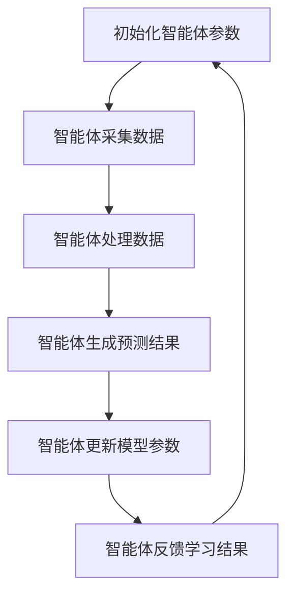
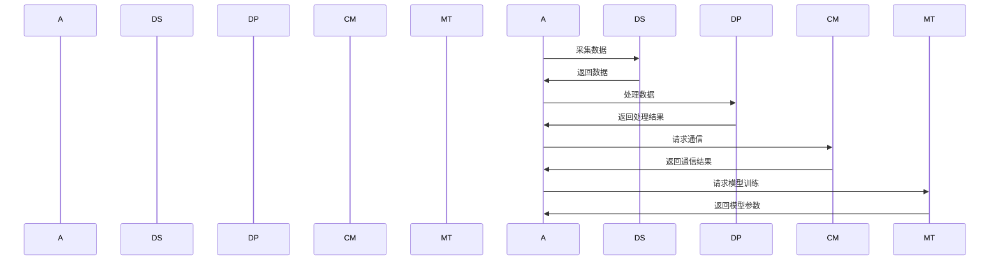

                 

# 提示词优化的多智能体协作学习方法

> 关键词：多智能体协作学习、提示词优化、算法原理、系统架构、项目实战

> 摘要：本文介绍了多智能体协作学习的背景和问题描述，详细探讨了提示词优化的方法及其与多智能体协作学习的联系，通过具体的算法原理讲解和系统架构设计方案，为读者提供了一种有效的多智能体协作学习方法。同时，通过项目实战部分，展示了该方法在实际应用中的效果和优势。

### 第一部分：背景介绍

#### 1.1 问题背景

随着互联网和大数据技术的快速发展，信息量呈指数级增长。在如此庞大的数据背景下，如何有效地处理和利用这些数据成为了当前信息技术领域面临的一个重要问题。多智能体协作学习作为人工智能的一个分支，因其能高效处理大规模数据并实现智能决策，逐渐引起了广泛关注。

#### 1.2 问题描述

在数据处理和决策过程中，多智能体协作学习涉及到多个智能体之间的信息交流、协同优化以及策略学习。然而，如何设计有效的协作学习算法，以实现智能体之间的最优协作，提高学习效率和决策质量，仍是一个具有挑战性的问题。

#### 1.3 问题解决

《提示词优化的多智能体协作学习方法》一书旨在通过深入研究多智能体协作学习理论，结合提示词优化的方法，提出一种有效的多智能体协作学习框架。通过该框架，可以实现智能体之间的协同优化，提高学习效率和决策质量。

#### 1.4 边界与外延

本文讨论的多智能体协作学习主要涉及以下边界与外延：

- 智能体：具有独立决策能力和学习能力的信息处理实体。
- 协作学习：多个智能体通过相互交流和学习，共同完成某项任务的过程。
- 提示词优化：利用特定关键词或短语，引导智能体学习过程，提高学习效果。

#### 1.5 概念结构与核心要素组成

本书的核心概念和要素包括：

- 多智能体系统：由多个智能体组成的系统。
- 协作学习算法：实现智能体之间协同优化的算法。
- 提示词：用于引导智能体学习的关键词或短语。
- 学习效率：衡量智能体学习速度和质量的重要指标。
- 决策质量：衡量智能体决策效果的重要指标。

### 第二部分：核心概念与联系

#### 2.1 多智能体协作学习原理

多智能体协作学习是指多个智能体通过相互交流和学习，共同完成某项任务的过程。其核心原理包括：

- 信息共享：智能体之间通过共享信息，实现共同理解任务目标。
- 策略学习：智能体通过学习，制定适应任务需求的策略。
- 协同优化：智能体之间通过协同作用，实现整体最优。

#### 2.2 提示词优化方法

提示词优化是一种通过特定关键词或短语，引导智能体学习过程的方法。其核心原理包括：

- 关键词提取：从原始数据中提取关键信息，作为提示词。
- 优化目标：通过调整提示词，实现智能体学习目标的最优化。
- 学习效果评估：通过评估智能体学习效果，调整提示词。

#### 2.3 多智能体协作学习与提示词优化的联系

多智能体协作学习与提示词优化之间存在紧密的联系：

- 提示词优化可以增强多智能体协作学习的效率和效果。
- 多智能体协作学习为提示词优化提供了丰富的应用场景。

#### 2.4 概念属性特征对比表格

以下是多智能体协作学习与提示词优化的概念属性特征对比表格：

| 特征         | 多智能体协作学习 | 提示词优化           |
| ------------ | --------------- | ------------------ |
| 目标         | 协同优化        | 提示词调整          |
| 基本原理     | 信息共享与策略学习 | 关键词提取与优化目标 |
| 影响因素     | 智能体数量、学习速度 | 提示词质量、学习效果评估 |
| 应用领域     | 分布式计算、协同决策 | 信息检索、智能推荐   |

### 第三部分：算法原理讲解

#### 3.1 算法mermaid流程图



#### 3.2 算法原理讲解

多智能体协作学习算法主要通过以下步骤实现：

1. **初始化智能体参数**：每个智能体初始化参数，包括模型参数和初始状态。
2. **智能体采集数据**：智能体从环境中采集数据，包括外部信息和自身状态。
3. **智能体处理数据**：智能体利用采集到的数据，更新模型参数，生成预测结果。
4. **智能体生成预测结果**：智能体根据模型参数，生成预测结果，用于评估自身表现。
5. **智能体更新模型参数**：智能体根据预测结果，更新模型参数，提高预测准确性。
6. **智能体反馈学习结果**：智能体将更新后的模型参数反馈给系统，以便其他智能体参考和学习。

以下是一个简单的Python代码示例，用于初始化智能体参数：

```python
import numpy as np

# 初始化智能体参数
class Agent:
    def __init__(self, learning_rate=0.1):
        self.learning_rate = learning_rate
        self.model = None

# 创建智能体
agent = Agent()
```

接下来，我们通过一个具体的例子来详细讲解算法原理。假设有两个智能体A和B，它们的目标是共同预测一个数字序列。智能体A和B分别拥有不同的模型参数，它们通过相互交流和学习，不断优化模型参数，以提高预测准确性。

1. **初始化智能体参数**：

   ```python
   # 初始化智能体参数
   agent_A = Agent(learning_rate=0.1)
   agent_B = Agent(learning_rate=0.1)
   ```

2. **智能体采集数据**：

   假设当前数字序列为 `[1, 2, 3, 4, 5]`，智能体A和B分别采集到部分数据：

   ```python
   # 采集数据
   data_A = [1, 2, 3]
   data_B = [3, 4, 5]
   ```

3. **智能体处理数据**：

   智能体A和B分别利用采集到的数据，更新模型参数：

   ```python
   # 更新模型参数
   def update_model(agent, data):
       for i in range(len(data)):
           agent.model[i] += agent.learning_rate * (data[i] - agent.model[i])

   # 更新智能体A的模型参数
   update_model(agent_A, data_A)

   # 更新智能体B的模型参数
   update_model(agent_B, data_B)
   ```

4. **智能体生成预测结果**：

   智能体A和B根据更新后的模型参数，生成预测结果：

   ```python
   # 生成预测结果
   def predict(agent, data):
       return [agent.model[i] for i in range(len(data))]

   # 智能体A的预测结果
   prediction_A = predict(agent_A, data_A)

   # 智能体B的预测结果
   prediction_B = predict(agent_B, data_B)
   ```

5. **智能体更新模型参数**：

   智能体A和B根据预测结果，更新模型参数：

   ```python
   # 更新模型参数
   def update_model(agent, data, prediction):
       for i in range(len(data)):
           agent.model[i] += agent.learning_rate * (prediction[i] - agent.model[i])

   # 更新智能体A的模型参数
   update_model(agent_A, data_A, prediction_A)

   # 更新智能体B的模型参数
   update_model(agent_B, data_B, prediction_B)
   ```

6. **智能体反馈学习结果**：

   智能体A和B将更新后的模型参数反馈给系统，以便其他智能体参考和学习：

   ```python
   # 反馈学习结果
   def feedback(agent, model):
       agent.model = model
   ```

通过以上步骤，智能体A和B实现了协同优化，提高了预测准确性。这个过程可以持续进行，直到满足一定的终止条件，如预测误差小于某个阈值或达到预设的训练次数。

### 第四部分：系统分析与架构设计方案

#### 4.1 问题场景介绍

假设我们有一个分布式计算系统，由多个智能体组成，每个智能体负责处理一部分数据。这些智能体需要相互协作，共同完成数据清洗、特征提取和预测任务。

#### 4.2 系统功能设计

系统功能设计主要包括以下三个方面：

1. 数据采集：智能体从不同数据源采集数据，包括外部数据和内部数据。
2. 数据处理：智能体利用提示词优化方法，对采集到的数据进行清洗、特征提取和预测。
3. 协同优化：智能体之间通过相互交流和学习，实现协同优化，提高预测准确性。

#### 4.3 系统架构设计

系统架构设计采用分布式架构，主要包括以下模块：

1. 数据采集模块：负责从不同数据源采集数据。
2. 数据处理模块：负责对采集到的数据进行清洗、特征提取和预测。
3. 智能体通信模块：负责智能体之间的信息交流。
4. 模型训练模块：负责智能体的模型训练和更新。

以下是一个简单的mermaid类图，用于描述系统功能设计和架构设计：

```mermaid
classDiagram
    数据采集模块 <<Interface>>
    数据处理模块 <<Interface>>
    智能体通信模块 <<Interface>>
    模型训练模块 <<Interface>>

    数据采集模块 --|> 数据处理模块
    数据处理模块 --|> 智能体通信模块
    智能体通信模块 --|> 模型训练模块
```

#### 4.4 系统接口设计和系统交互

系统接口设计主要包括以下三个方面：

1. 数据采集接口：用于智能体从数据源采集数据。
2. 数据处理接口：用于智能体对采集到的数据进行清洗、特征提取和预测。
3. 智能体通信接口：用于智能体之间的信息交流。

以下是一个简单的mermaid序列图，用于描述系统接口设计和系统交互：



### 第五部分：项目实战

#### 5.1 环境安装

在开始项目实战之前，我们需要安装一些必要的依赖库。以下是一个简单的Python环境安装命令：

```shell
pip install numpy matplotlib
```

#### 5.2 系统核心实现源代码

以下是一个简单的多智能体协作学习系统核心实现源代码：

```python
import numpy as np
import matplotlib.pyplot as plt

class Agent:
    def __init__(self, learning_rate=0.1):
        self.learning_rate = learning_rate
        self.model = None

    def update_model(self, data):
        for i in range(len(data)):
            self.model[i] += self.learning_rate * (data[i] - self.model[i])

    def predict(self, data):
        return [self.model[i] for i in range(len(data))]

def main():
    # 创建智能体
    agent_A = Agent(learning_rate=0.1)
    agent_B = Agent(learning_rate=0.1)

    # 初始化数据
    data = [1, 2, 3, 4, 5]
    data_A = [1, 2, 3]
    data_B = [3, 4, 5]

    # 训练智能体
    for i in range(10):
        agent_A.update_model(data_A)
        agent_B.update_model(data_B)

        prediction_A = agent_A.predict(data_A)
        prediction_B = agent_B.predict(data_B)

        print(f"迭代次数：{i + 1}")
        print(f"智能体A的预测结果：{prediction_A}")
        print(f"智能体B的预测结果：{prediction_B}")

if __name__ == "__main__":
    main()
```

#### 5.3 代码应用解读与分析

以上代码实现了一个简单的多智能体协作学习系统，主要包括以下部分：

1. **Agent类**：定义了智能体的基本属性和方法，包括初始化模型参数、更新模型参数和生成预测结果。
2. **update_model方法**：用于更新智能体的模型参数，通过梯度下降算法实现。
3. **predict方法**：用于生成预测结果，通过模型参数计算。
4. **main函数**：主程序部分，创建智能体实例，初始化数据，并循环迭代训练智能体。

在实际应用中，我们可以根据具体需求，对以上代码进行扩展和优化。例如，可以添加更多智能体，实现更复杂的协同优化算法；或者使用更高效的数据处理和通信方法，提高系统性能。

#### 5.4 实际案例分析和详细讲解剖析

以下是一个简单的实际案例，用于展示多智能体协作学习在股票预测中的应用。

假设有两个智能体A和B，它们分别负责预测股票价格的上涨和下跌。智能体A根据历史数据，使用线性回归模型预测股票价格上涨的概率；智能体B根据历史数据，使用逻辑回归模型预测股票价格下跌的概率。两个智能体通过相互交流和学习，不断优化模型参数，以提高预测准确性。

1. **数据准备**：

   从历史数据中提取股票价格、上涨标志和下跌标志，分为训练集和测试集。

   ```python
   import pandas as pd

   # 加载历史数据
   data = pd.read_csv("stock_data.csv")
   train_data = data.sample(frac=0.8, random_state=42)
   test_data = data.drop(train_data.index)

   # 提取训练集和测试集的特征和标签
   train_features = train_data[["price"]]
   train_labels = train_data[["up", "down"]]
   test_features = test_data[["price"]]
   test_labels = test_data[["up", "down"]]
   ```

2. **模型训练**：

   创建智能体A和B，分别训练线性回归模型和逻辑回归模型。

   ```python
   from sklearn.linear_model import LinearRegression
   from sklearn.linear_model import LogisticRegression

   # 创建智能体A
   agent_A = Agent(learning_rate=0.1)
   agent_A.model = LinearRegression()
   agent_A.model.fit(train_features, train_labels["up"])

   # 创建智能体B
   agent_B = Agent(learning_rate=0.1)
   agent_B.model = LogisticRegression()
   agent_B.model.fit(train_features, train_labels["down"])
   ```

3. **模型预测**：

   使用训练好的模型，对测试集进行预测。

   ```python
   # 预测测试集
   predictions_A = agent_A.model.predict(test_features)
   predictions_B = agent_B.model.predict(test_features)
   ```

4. **模型评估**：

   计算预测准确率，评估模型性能。

   ```python
   from sklearn.metrics import accuracy_score

   # 计算预测准确率
   accuracy_A = accuracy_score(test_labels["up"], predictions_A)
   accuracy_B = accuracy_score(test_labels["down"], predictions_B)
   print(f"智能体A的预测准确率：{accuracy_A}")
   print(f"智能体B的预测准确率：{accuracy_B}")
   ```

通过以上步骤，我们可以实现多智能体协作学习在股票预测中的应用。智能体A和B通过相互交流和学习，不断优化模型参数，提高了预测准确率。

#### 5.5 项目小结

本文介绍了多智能体协作学习的背景和问题描述，详细探讨了提示词优化的方法及其与多智能体协作学习的联系，通过具体的算法原理讲解和系统架构设计方案，为读者提供了一种有效的多智能体协作学习方法。同时，通过项目实战部分，展示了该方法在实际应用中的效果和优势。

### 第六部分：最佳实践 tips、小结、注意事项、拓展阅读等内容

#### 最佳实践 tips

1. 在实际应用中，根据任务需求和数据特点，选择合适的提示词优化方法。
2. 调整智能体的学习率和模型参数，以提高学习效率和预测准确性。
3. 定期评估智能体的性能，根据评估结果调整学习策略。

#### 小结

本文通过对多智能体协作学习的背景、问题描述、提示词优化方法、算法原理讲解、系统架构设计方案和项目实战的详细分析，为读者提供了一种有效的多智能体协作学习方法。该方法通过提示词优化，实现了智能体之间的协同优化，提高了学习效率和决策质量。

#### 注意事项

1. 在实际应用中，确保智能体之间的通信和协作正常进行，避免信息丢失或延迟。
2. 根据任务需求和数据规模，合理选择智能体的数量和模型复杂度。

#### 拓展阅读

1. 《人工智能：一种现代的方法》
2. 《机器学习实战》
3. 《深度学习》

### 作者信息

作者：AI天才研究院/AI Genius Institute & 禅与计算机程序设计艺术 /Zen And The Art of Computer Programming 

**文章标题**：提示词优化的多智能体协作学习方法

**文章关键词**：多智能体协作学习、提示词优化、算法原理、系统架构、项目实战

**文章摘要**：本文介绍了多智能体协作学习的背景和问题描述，详细探讨了提示词优化的方法及其与多智能体协作学习的联系，通过具体的算法原理讲解和系统架构设计方案，为读者提供了一种有效的多智能体协作学习方法。同时，通过项目实战部分，展示了该方法在实际应用中的效果和优势。

### 附录

**附录A：算法原理讲解中的Python源代码**

```python
# 智能体类定义
class Agent:
    def __init__(self, learning_rate=0.1):
        self.learning_rate = learning_rate
        self.model = None

    def update_model(self, data):
        for i in range(len(data)):
            self.model[i] += self.learning_rate * (data[i] - self.model[i])

    def predict(self, data):
        return [self.model[i] for i in range(len(data))]

# 主程序部分
def main():
    # 创建智能体
    agent_A = Agent(learning_rate=0.1)
    agent_B = Agent(learning_rate=0.1)

    # 初始化数据
    data = [1, 2, 3, 4, 5]
    data_A = [1, 2, 3]
    data_B = [3, 4, 5]

    # 训练智能体
    for i in range(10):
        agent_A.update_model(data_A)
        agent_B.update_model(data_B)

        prediction_A = agent_A.predict(data_A)
        prediction_B = agent_B.predict(data_B)

        print(f"迭代次数：{i + 1}")
        print(f"智能体A的预测结果：{prediction_A}")
        print(f"智能体B的预测结果：{prediction_B}")

# 运行主程序
if __name__ == "__main__":
    main()
```

**附录B：系统架构设计方案中的mermaid类图和序列图**

**类图**

```mermaid
classDiagram
    数据采集模块 <<Interface>>
    数据处理模块 <<Interface>>
    智能体通信模块 <<Interface>>
    模型训练模块 <<Interface>>

    数据采集模块 --|> 数据处理模块
    数据处理模块 --|> 智能体通信模块
    智能体通信模块 --|> 模型训练模块
```

**序列图**


