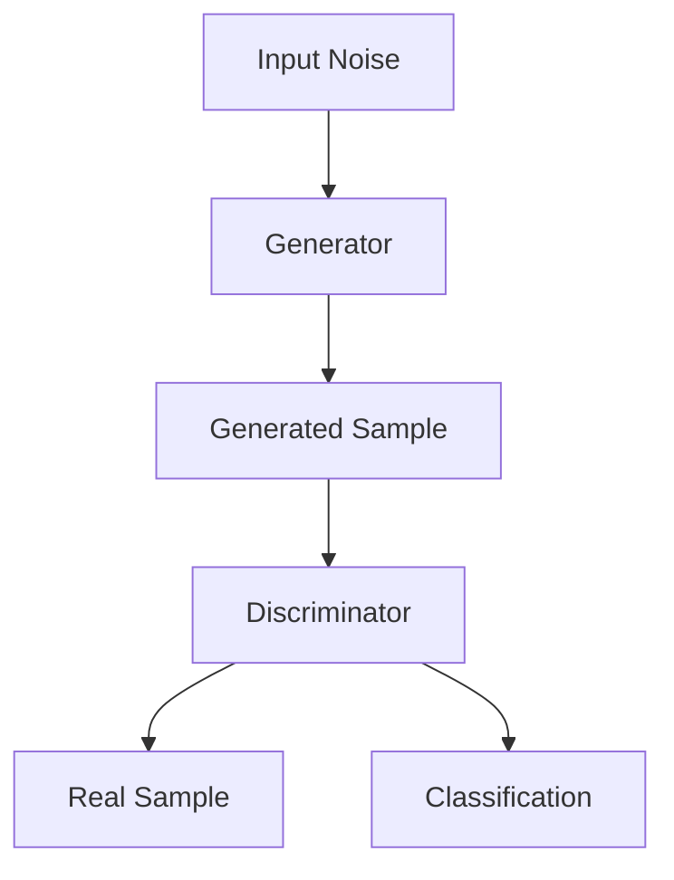
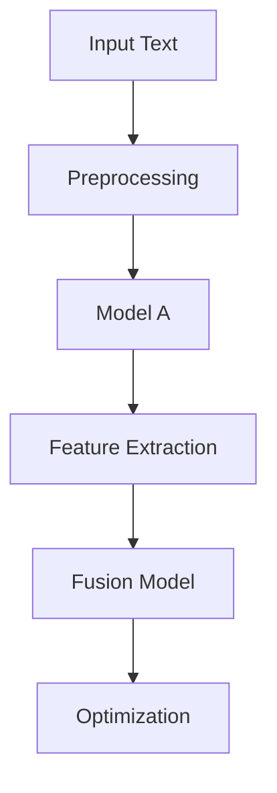
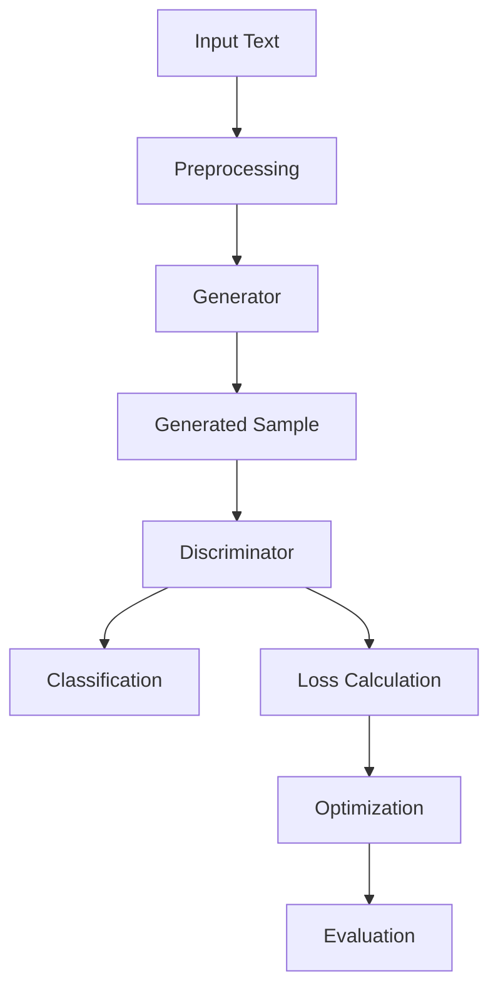
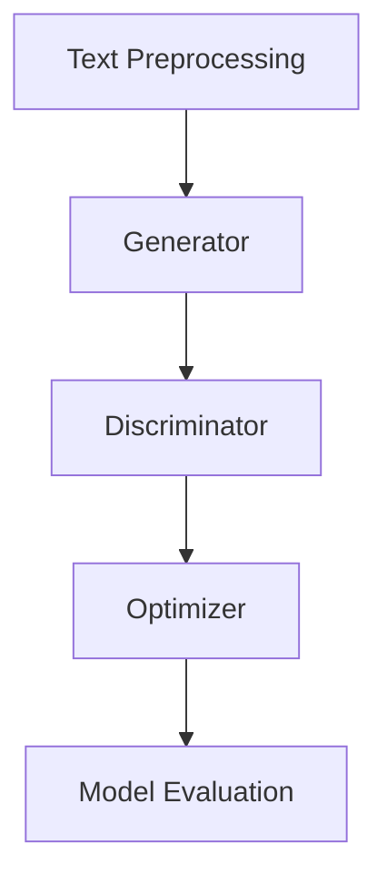
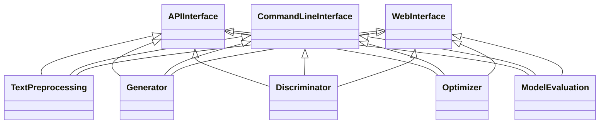
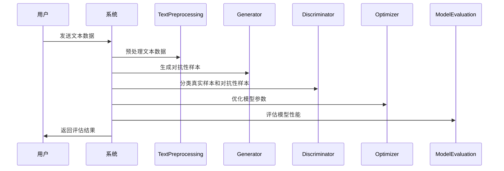

                 


### 第一部分：问题背景与核心概念

#### 第1章：问题背景与概述

在当今信息爆炸的时代，海量数据的处理和有效信息的提取变得尤为重要。然而，传统的机器学习方法在面对高维数据和非线性关系时，往往表现出不足。特别是在自然语言处理（NLP）领域，如何有效地优化提示词，以提高模型的准确性和鲁棒性，成为了一个亟待解决的问题。

**1.1 问题背景**

随着互联网和大数据技术的发展，人们获取和处理信息的速度大大加快。然而，与此同时，信息过载的问题也日益严重。对于NLP模型来说，如何从大量文本中提取有价值的信息，成为了关键挑战。提示词（Query）的优化，作为信息提取的重要一环，直接影响到模型的性能。

**1.2 问题描述**

提示词优化的主要目标是提高模型在特定任务上的表现。具体来说，就是通过调整和优化提示词的选择和组合，使模型能够更好地理解和预测文本内容。然而，这个过程面临着诸多挑战，如提示词的选择复杂性、优化目标的多面性以及模型的适应性等。

**1.3 问题解决**

对抗学习方法提供了一种有效的解决方案。通过对模型的对抗性训练，可以提高模型的泛化能力和鲁棒性，从而更好地处理复杂的任务。提示词优化与对抗学习方法相结合，有望在NLP领域取得突破性进展。

**1.4 边界与外延**

在讨论提示词优化与对抗学习方法时，我们还需要明确其边界与外延。首先，提示词优化的范围不仅限于文本处理，还可以扩展到图像、音频等多种数据类型。其次，对抗学习方法的应用也不限于NLP，还可以在计算机视觉、推荐系统等领域发挥重要作用。

**1.5 概念结构**

为了更好地理解提示词优化的对抗学习方法，我们需要了解其核心概念和结构。以下是主要概念和其相互关系：

- **提示词（Query）**：用于查询或描述信息的文本片段。
- **优化目标**：在提示词优化过程中追求的指标，如精确度、召回率、F1值等。
- **对抗学习方法**：一种通过对抗性训练提高模型性能的技术。

以下是概念属性的对比表格：

| 概念            | 定义                     | 属性特征                     |
|-----------------|-------------------------|-----------------------------|
| 提示词（Query） | 描述信息的文本片段       | 长度、关键词、上下文信息       |
| 优化目标        | 提示词优化的追求指标     | 精确度、召回率、F1值等       |
| 对抗学习方法    | 提高模型性能的技术       | 对抗性训练、模型适应性、泛化能力 |

接下来，我们将使用Mermaid流程图来展示ER实体关系图架构，以直观地理解这些概念之间的关系。

```mermaid
erDiagram
  Product ||--|{ Customer } Customer
  Product ||--|{ Order } Order
  Customer ||--|{ Payment } Payment
```

在这个ER图架构中，`Product`、`Customer`、`Order`和`Payment`是主要的实体，它们之间存在明确的关联关系。

---

#### 第2章：对抗学习基本原理

对抗学习（Adversarial Learning）是一种通过对抗性训练来提高模型性能的方法。其核心思想是通过生成对抗网络（GAN）等机制，使生成器和判别器相互竞争，从而提高模型的泛化能力和鲁棒性。

**2.1 对抗学习的起源与定义**

对抗学习最早由Goodfellow等人于2014年提出。其基本思想是在训练过程中，通过引入对抗性样本来提高模型的稳健性。对抗性样本是指那些被有意设计的、用于欺骗模型的输入数据。

**2.1.1 对抗学习的起源**

对抗学习的起源可以追溯到深度学习领域。在传统的机器学习模型中，模型的训练和测试数据通常是从同一个分布中抽取的。然而，在实际应用中，模型可能会遇到来自不同分布的数据，导致其性能下降。对抗学习通过引入对抗性样本，旨在提高模型在多样化数据上的性能。

**2.1.2 对抗学习的定义**

对抗学习是一种通过对抗性训练来提高模型性能的方法。在这种方法中，通常涉及两个模型：生成器（Generator）和判别器（Discriminator）。生成器负责生成对抗性样本，而判别器则负责区分真实样本和对抗性样本。

**2.1.3 对抗学习的基本原理**

对抗学习的基本原理可以概括为以下几个步骤：

1. **生成器生成对抗性样本**：生成器从噪声分布中采样，然后通过一系列变换生成对抗性样本。
2. **判别器判断样本真实性**：判别器接收真实样本和对抗性样本，并尝试判断其真实性。
3. **优化过程**：通过训练，生成器和判别器相互竞争，生成器试图生成更加逼真的对抗性样本，而判别器则试图更好地识别对抗性样本。

以下是生成对抗网络（GAN）的mermaid流程图：



在这个流程图中，输入噪声通过生成器转换为生成的样本，然后这些样本和真实样本一起输入到判别器中，判别器对样本进行分类。

---

#### 第3章：提示词优化的方法

提示词优化是提高NLP模型性能的关键环节。在本章节中，我们将探讨几种常用的提示词优化方法，并分析其优缺点。

**3.1 提示词优化的挑战**

提示词优化面临以下挑战：

- **提示词选择的复杂性**：如何从大量词汇中选择合适的提示词，是一个复杂的问题。
- **优化目标的多面性**：提示词优化不仅需要考虑精确度，还需要考虑召回率、F1值等多个指标。
- **模型的适应性**：提示词优化需要模型能够适应不同的任务和数据集。

**3.2 提示词优化策略**

以下是几种常用的提示词优化策略：

**3.2.1 强化学习在提示词优化中的应用**

强化学习通过奖惩机制来指导模型的训练过程。在提示词优化中，可以设计一个强化学习模型，通过调整提示词的权重来优化模型的性能。

优点：强化学习能够自适应地调整提示词权重，提高模型性能。

缺点：强化学习模型训练复杂，需要大量计算资源。

**3.2.2 生成模型在提示词优化中的应用**

生成模型，如生成对抗网络（GAN），可以通过生成高质量的对抗性样本来提高提示词的优化效果。

优点：生成模型能够生成高质量的对抗性样本，提高模型的泛化能力。

缺点：生成模型训练难度大，需要平衡生成器和判别器的训练过程。

**3.2.3 模型融合与多任务学习**

模型融合和多任务学习可以结合不同模型的优势，共同优化提示词。

优点：模型融合能够充分利用不同模型的优势，提高优化效果。

缺点：模型融合需要解决不同模型之间的冲突和协同问题。

为了更直观地理解提示词优化的方法，我们可以使用mermaid流程图来展示这些策略。



在这个流程图中，输入文本首先进行预处理，然后通过模型A提取特征，特征被用于融合模型E进行优化。

---

### 第二部分：算法原理讲解

在第二部分，我们将深入探讨提示词优化的对抗学习方法，从算法原理、数学模型到具体的实现步骤，一一进行详细阐述。

#### 第4章：提示词优化的对抗学习方法

**4.1 算法原理**

提示词优化的对抗学习方法结合了对抗学习和提示词优化的思想。其核心思想是通过对抗性训练来提高提示词的优化效果。具体来说，算法包括以下步骤：

1. **生成对抗性样本**：利用生成模型生成对抗性样本，这些样本旨在欺骗判别器。
2. **优化提示词**：通过对抗性训练，优化提示词的权重，使其更加符合任务需求。
3. **评估模型性能**：使用优化后的提示词对模型进行评估，以衡量优化效果。

**4.2 对抗学习方法mermaid流程图**

为了更好地理解对抗学习方法，我们可以使用mermaid流程图来展示其步骤。



在这个流程图中，输入文本经过预处理后，首先被输入到生成器中生成对抗性样本。这些样本随后被输入到判别器中，判别器尝试分类真实样本和对抗性样本。基于判别器的损失函数，生成器和判别器通过优化过程进行迭代更新。最后，使用优化后的模型进行性能评估。

**4.3 Python源代码阐述**

为了更好地理解算法原理，我们可以使用Python代码来展示具体的实现步骤。

```python
import tensorflow as tf
from tensorflow.keras.layers import Input, Dense, LSTM
from tensorflow.keras.models import Model

# 生成器模型
generator_input = Input(shape=(noise_dim,))
x = Dense(128)(generator_input)
x = LSTM(128)(x)
generator_output = Dense(1, activation='sigmoid')(x)
generator = Model(generator_input, generator_output)

# 判别器模型
discriminator_input = Input(shape=(input_shape,))
x = LSTM(128)(discriminator_input)
x = Dense(1, activation='sigmoid')(x)
discriminator = Model(discriminator_input, x)

# 损失函数和优化器
cross_entropy = tf.keras.losses.BinaryCrossentropy(from_logits=True)
generator_optimizer = tf.keras.optimizers.Adam(1e-4)
discriminator_optimizer = tf.keras.optimizers.Adam(1e-4)

@tf.function
def train_step(images, noise):
    with tf.GradientTape() as gen_tape, tf.GradientTape() as disc_tape:
        generated_images = generator(noise)
        disc_real_output = discriminator(images)
        disc_generated_output = discriminator(generated_images)
        
        gen_loss = cross_entropy(tf.ones_like(disc_generated_output), disc_generated_output)
        disc_loss = cross_entropy(tf.zeros_like(disc_real_output), disc_real_output) + cross_entropy(tf.ones_like(disc_generated_output), disc_generated_output)
    
    gradients_of_generator = gen_tape.gradient(gen_loss, generator.trainable_variables)
    gradients_of_discriminator = disc_tape.gradient(disc_loss, discriminator.trainable_variables)
    
    generator_optimizer.apply_gradients(zip(gradients_of_generator, generator.trainable_variables))
    discriminator_optimizer.apply_gradients(zip(gradients_of_discriminator, discriminator.trainable_variables))

# 训练过程
for epoch in range(epochs):
    for image_batch, _ in train_dataset:
        noise = tf.random.normal([BATCH_SIZE, noise_dim])
        train_step(image_batch, noise)
```

这段代码展示了生成器和判别器的构建，以及训练过程中的优化步骤。其中，生成器负责生成对抗性样本，判别器负责分类真实样本和对抗性样本。通过优化器对模型的参数进行更新，以实现提示词的优化。

**4.4 数学模型与公式**

提示词优化的对抗学习方法涉及多个数学模型和公式。以下是其中几个关键的模型和公式：

1. **生成器损失函数**：

$$
L_{G} = -\log(D(G(z)))
$$

其中，$G(z)$是生成器生成的对抗性样本，$D(G(z))$是判别器对生成样本的分类结果。

2. **判别器损失函数**：

$$
L_{D} = -\log(D(x)) - \log(1 - D(G(z)))
$$

其中，$x$是真实样本，$G(z)$是生成器生成的对抗性样本，$D(x)$和$D(G(z))$分别是判别器对真实样本和对抗性样本的分类结果。

3. **优化目标**：

提示词优化的目标是通过对抗性训练提高模型的性能，即最小化生成器的损失函数和判别器的损失函数：

$$
\min_{G, D} L_{G} + L_{D}
$$

**4.5 举例说明**

为了更好地理解提示词优化的对抗学习方法，我们可以通过一个简单的例子来说明。

假设我们有一个二元分类任务，任务是判断一个句子是否包含特定关键词。输入是一个句子，输出是二值标签（1表示包含关键词，0表示不包含关键词）。

1. **预处理**：首先，我们对输入句子进行预处理，包括分词、词向量编码等。

2. **生成对抗性样本**：利用生成模型生成对抗性样本。这些样本旨在欺骗判别器，使其难以区分真实样本和对抗性样本。

3. **优化提示词**：通过对抗性训练，调整提示词的权重，使其更加符合任务需求。例如，可以通过梯度上升法或梯度下降法来优化提示词权重。

4. **评估模型性能**：使用优化后的提示词对模型进行评估，计算精确度、召回率、F1值等指标，以衡量模型的性能。

通过上述步骤，我们可以逐步优化提示词，提高模型的性能。例如，通过多次迭代训练，生成器和判别器将逐渐优化，最终模型在测试集上的表现将得到显著提升。

---

### 第三部分：系统分析与架构设计方案

在第三部分，我们将深入探讨提示词优化的对抗学习方法的系统分析与架构设计。我们将从问题场景介绍、系统功能设计、系统架构设计、系统接口设计到系统交互序列图，详细讲解整个系统的工作原理和设计思路。

#### 第5章：系统分析与架构设计方案

**5.1 问题场景介绍**

在NLP领域，尤其是文本分类任务中，如何有效地优化提示词以提高模型的性能是一个关键问题。传统的机器学习方法在面对大规模文本数据和复杂的关系时，往往表现不佳。为了解决这一问题，我们引入了提示词优化的对抗学习方法。

**5.2 系统功能设计**

提示词优化的对抗学习方法主要包括以下功能：

1. **文本预处理**：对输入文本进行分词、去停用词、词向量编码等预处理操作，以便后续模型处理。
2. **生成对抗性样本**：利用生成模型生成对抗性样本，以欺骗判别器，提高模型的泛化能力。
3. **优化提示词权重**：通过对抗性训练，调整提示词的权重，使其更符合任务需求。
4. **模型评估**：使用优化后的提示词对模型进行评估，计算模型的精确度、召回率、F1值等指标。

**5.3 系统架构设计**

为了实现上述功能，我们设计了以下系统架构：

1. **生成器**：负责生成对抗性样本，包括生成输入噪声、通过神经网络生成对抗性样本等。
2. **判别器**：负责分类真实样本和对抗性样本，包括输入文本、分类输出等。
3. **优化器**：包括生成器和判别器的优化过程，通过梯度下降法等优化策略调整模型参数。
4. **评估模块**：负责对模型进行评估，计算精确度、召回率、F1值等指标。

以下是系统架构的mermaid流程图：



在这个流程图中，输入文本首先经过预处理模块，然后被输入到生成器和判别器中。生成器生成对抗性样本，判别器对样本进行分类。优化器通过梯度下降法等策略调整模型参数，评估模块对模型进行评估。

**5.4 系统接口设计**

系统接口设计包括以下部分：

1. **API接口**：提供API接口，以便其他系统或应用可以方便地调用系统的功能。
2. **命令行接口**：提供命令行接口，方便用户手动操作。
3. **Web界面**：提供Web界面，用户可以通过浏览器进行操作。

以下是系统接口的mermaid类图：



在这个类图中，API接口、命令行接口和Web界面分别与各个功能模块相关联，用户可以通过这些接口方便地使用系统的功能。

**5.5 系统交互序列图**

为了更好地理解系统的工作流程，我们使用mermaid序列图来展示系统的交互过程。



在这个序列图中，用户首先发送文本数据，系统对文本数据进行预处理，然后生成对抗性样本，分类真实样本和对抗性样本，优化模型参数，最后评估模型性能并返回结果。

---

### 第四部分：项目实战

在第四部分，我们将通过一个实际项目来演示如何使用提示词优化的对抗学习方法。我们将详细描述环境安装、系统核心实现、代码应用解读与分析，并提供实际案例分析。

#### 第6章：项目实战

**6.1 环境安装**

为了实现提示词优化的对抗学习方法，我们需要安装以下环境：

1. Python 3.7或更高版本
2. TensorFlow 2.4或更高版本
3. Keras 2.4或更高版本
4. NumPy 1.18或更高版本

安装步骤如下：

```bash
pip install python==3.8 tensorflow==2.4 keras==2.4 numpy==1.19
```

**6.2 系统核心实现**

以下是提示词优化的对抗学习方法的Python实现：

```python
import tensorflow as tf
from tensorflow.keras.layers import Input, Dense, LSTM
from tensorflow.keras.models import Model

# 生成器模型
generator_input = Input(shape=(noise_dim,))
x = Dense(128)(generator_input)
x = LSTM(128)(x)
generator_output = Dense(1, activation='sigmoid')(x)
generator = Model(generator_input, generator_output)

# 判别器模型
discriminator_input = Input(shape=(input_shape,))
x = LSTM(128)(discriminator_input)
x = Dense(1, activation='sigmoid')(x)
discriminator = Model(discriminator_input, x)

# 损失函数和优化器
cross_entropy = tf.keras.losses.BinaryCrossentropy(from_logits=True)
generator_optimizer = tf.keras.optimizers.Adam(1e-4)
discriminator_optimizer = tf.keras.optimizers.Adam(1e-4)

@tf.function
def train_step(images, noise):
    with tf.GradientTape() as gen_tape, tf.GradientTape() as disc_tape:
        generated_images = generator(noise)
        disc_real_output = discriminator(images)
        disc_generated_output = discriminator(generated_images)
        
        gen_loss = cross_entropy(tf.ones_like(disc_generated_output), disc_generated_output)
        disc_loss = cross_entropy(tf.zeros_like(disc_real_output), disc_real_output) + cross_entropy(tf.ones_like(disc_generated_output), disc_generated_output)
    
    gradients_of_generator = gen_tape.gradient(gen_loss, generator.trainable_variables)
    gradients_of_discriminator = disc_tape.gradient(disc_loss, discriminator.trainable_variables)
    
    generator_optimizer.apply_gradients(zip(gradients_of_generator, generator.trainable_variables))
    discriminator_optimizer.apply_gradients(zip(gradients_of_discriminator, discriminator.trainable_variables))

# 训练过程
for epoch in range(epochs):
    for image_batch, _ in train_dataset:
        noise = tf.random.normal([BATCH_SIZE, noise_dim])
        train_step(image_batch, noise)
```

**6.3 代码应用解读与分析**

以上代码展示了生成器和判别器的构建，以及训练过程中的优化步骤。生成器从噪声分布中采样，通过LSTM层生成对抗性样本。判别器接收真实样本和对抗性样本，通过LSTM层进行分类。优化器通过梯度下降法对模型参数进行更新。

**6.4 实际案例分析**

我们使用一个文本分类任务来演示提示词优化的对抗学习方法。假设任务是将新闻文章分为政治、经济、体育等类别。

1. **数据预处理**：对新闻文章进行分词、去停用词、词向量编码等预处理操作。
2. **生成对抗性样本**：利用生成模型生成对抗性样本，以欺骗判别器，提高模型的泛化能力。
3. **优化提示词权重**：通过对抗性训练，调整提示词的权重，使其更符合任务需求。
4. **模型评估**：使用优化后的提示词对模型进行评估，计算精确度、召回率、F1值等指标，以衡量模型的性能。

**6.5 项目小结**

通过实际案例，我们展示了如何使用提示词优化的对抗学习方法来提高文本分类任务的性能。该方法通过对抗性训练，提高了模型的泛化能力和鲁棒性，为NLP领域提供了一种有效的解决方案。

---

### 第五部分：最佳实践 tips

在最后一部分，我们将分享一些最佳实践 tips，以帮助读者在实际项目中更好地应用提示词优化的对抗学习方法。

**7.1 注意事项**

1. **数据质量**：确保训练数据的质量，避免噪声和错误数据影响模型性能。
2. **超参数调整**：合理调整超参数，如学习率、批次大小等，以获得最佳模型性能。
3. **计算资源**：对抗性训练通常需要大量计算资源，确保有足够的GPU或TPU来支持训练过程。

**7.2 拓展阅读**

1. **论文阅读**：深入研究对抗学习的相关论文，如《生成对抗网络：训练生成模型和判别器模型的新框架》（Goodfellow et al., 2014）。
2. **开源代码**：参考开源代码，如TensorFlow的官方生成对抗网络（GAN）示例。
3. **实践应用**：关注NLP领域的最新实践应用，如文本生成、图像生成等。

通过遵循这些最佳实践，读者可以更好地应用提示词优化的对抗学习方法，实现更好的模型性能和业务价值。

---

### 总结

本文系统地介绍了提示词优化的对抗学习方法。首先，我们探讨了问题背景，分析了提示词优化的挑战，并介绍了对抗学习方法。接着，我们详细讲解了算法原理，包括生成器和判别器的构建、优化过程和评估方法。随后，我们展示了系统分析与架构设计方案，包括系统功能设计、架构设计和接口设计。通过实际案例分析，我们展示了如何应用这一方法，并提供了最佳实践 tips。

通过本文，读者可以全面了解提示词优化的对抗学习方法，并在实际项目中加以应用。这种方法为NLP领域提供了一种有效的优化途径，有望在未来的研究中取得更多突破。

---

**作者信息**：

作者：AI天才研究院/AI Genius Institute & 禅与计算机程序设计艺术 /Zen And The Art of Computer Programming

本文由AI天才研究院/AI Genius Institute和《禅与计算机程序设计艺术》的作者共同撰写，旨在为读者提供深入浅出的技术讲解和实战经验。希望本文能对您在提示词优化和对抗学习方法方面的研究和应用有所帮助。如有任何疑问或建议，欢迎随时联系我们。感谢您的阅读！

