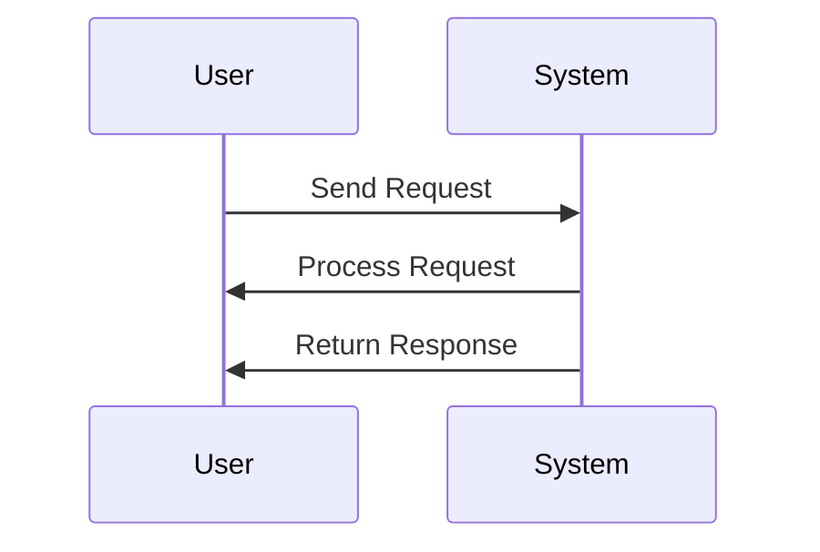
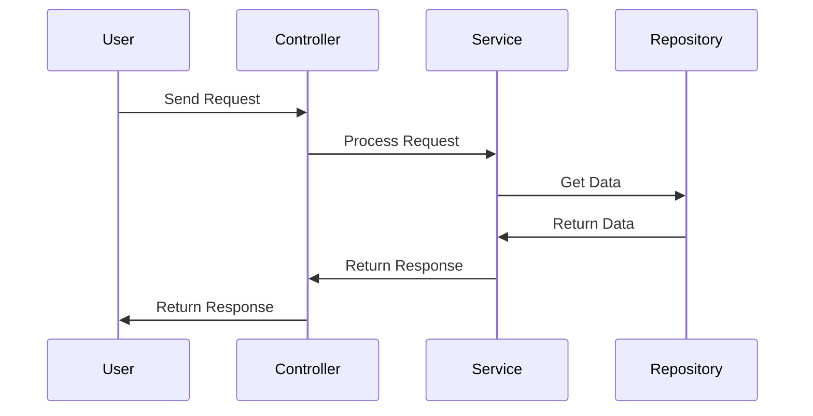

                 

### 文章标题

# 提示词优化的对抗学习方法

---

> 关键词：提示词优化、对抗学习方法、自然语言处理、模型鲁棒性、生成对抗网络（GAN）

> 摘要：本文深入探讨了提示词优化的对抗学习方法，包括其背景、核心概念、原理、对比分析以及算法讲解。通过详细阐述，我们旨在为广大科研工作者和工程师提供一种有效的提升自然语言处理模型鲁棒性和性能的方法。

---

## 第一部分：问题背景与核心概念

### 第1章：问题背景

#### 1.1.1 提示词优化的对抗学习方法的研究背景

随着人工智能技术的快速发展，自然语言处理（NLP）领域取得了显著进展。然而，在处理实际问题时，传统的机器学习方法往往难以满足需求。例如，在问答系统、文本分类等任务中，模型对输入的细微变化非常敏感，容易受到对抗性攻击。因此，对抗学习方法（Adversarial Learning）作为一种新兴的方法，逐渐受到研究者的关注。该方法通过引入对抗性样本，使得模型能够在面对复杂和对抗性环境时保持稳定性和鲁棒性。

#### 1.1.2 提示词优化的对抗学习方法的重要性

在自然语言处理中，提示词（Prompt）扮演着至关重要的角色。通过优化提示词，可以显著提高模型的性能和效果。而对抗学习方法在提示词优化中的应用，不仅能够提高模型的鲁棒性，还能在一定程度上解决模型在应对未知或对抗性输入时的表现问题。

#### 1.1.3 提示词优化的对抗学习方法的研究意义

研究提示词优化的对抗学习方法，有助于提升自然语言处理领域的技术水平，推动相关应用的发展。此外，该方法还可为其他领域的机器学习问题提供有益的参考。

### 第2章：核心概念

#### 2.1 对抗学习方法概述

对抗学习方法是一种通过生成对抗性样本来提高模型鲁棒性的方法。本章将介绍对抗学习方法的基本原理、发展历程及其在机器学习中的应用。

#### 2.2 提示词优化方法

提示词优化方法旨在通过调整提示词，提高模型在特定任务上的性能。本章将介绍常见的提示词优化方法，如基于规则的优化、基于神经网络的优化等。

#### 2.3 对抗性样本生成方法

对抗性样本生成方法是在对抗学习方法中至关重要的一环。本章将介绍几种常见的对抗性样本生成方法，如FGSM（Fast Gradient Sign Method）、JSMA（JSMA: Joint Scaling and Marginalization Approach）等。

#### 2.4 对抗性训练策略

对抗性训练策略是指通过对抗性训练来提高模型的鲁棒性和性能。本章将介绍几种常见的对抗性训练策略，如GAN（Generative Adversarial Networks）、FGM（Fast Gradient Method）等。

## 第二部分：核心概念与联系

### 第3章：核心概念原理

#### 3.1 对抗学习方法原理

对抗学习方法基于生成对抗网络（GAN）框架，通过生成器（Generator）和判别器（Discriminator）的对抗性训练来提高模型的性能。本章将详细介绍对抗学习方法的基本原理和数学模型。

#### 3.2 提示词优化方法原理

提示词优化方法主要通过调整提示词，使模型在特定任务上取得更好的表现。本章将介绍提示词优化方法的原理、常见方法和应用场景。

#### 3.3 对抗性样本生成方法原理

对抗性样本生成方法是生成对抗网络（GAN）框架的核心组成部分。本章将详细介绍对抗性样本生成方法的原理、常见方法和应用场景。

#### 3.4 对抗性训练策略原理

对抗性训练策略是通过对抗性训练来提高模型的鲁棒性和性能。本章将介绍常见的对抗性训练策略，如GAN（Generative Adversarial Networks）、FGM（Fast Gradient Method）等。

### 第4章：概念属性特征对比表格

| 方法 | 对抗性样本生成方法 | 提示词优化方法 | 对抗性训练策略 |
| :--: | :--: | :--: | :--: |
| 原理 | 通过生成对抗网络框架生成对抗性样本 | 通过调整提示词来优化模型性能 | 通过对抗性训练来提高模型鲁棒性和性能 |
| 应用场景 | 图像、语音、自然语言处理等领域 | 自然语言处理、问答系统等领域 | 自然语言处理、计算机视觉等领域 |
| 优点 | 提高模型鲁棒性和性能 | 提高模型在特定任务上的性能 | 提高模型鲁棒性和性能 |
| 缺点 | 需要大量的计算资源 | 对提示词的调整需要大量实验 | 需要大量的计算资源 |

## 第三部分：算法原理讲解

### 第5章：对抗性样本生成算法讲解

#### 5.1 对抗性样本生成方法

对抗性样本生成方法主要分为两种：基于梯度的方法和基于生成对抗网络（GAN）的方法。本章将详细介绍这些方法的原理和实现。

#### 5.2 FGSM（Fast Gradient Sign Method）

FGSM（Fast Gradient Sign Method）是一种基于梯度的对抗性样本生成方法。其基本思想是利用模型梯度信息，在输入样本上添加噪声，生成对抗性样本。具体步骤如下：

1. 计算$$\text{Gradient} = \frac{\partial L}{\partial x}$$，其中L是损失函数。
2. 对梯度进行符号操作，得到$$\text{Sign}( \text{Gradient})$$。
3. 将$$\text{Sign}( \text{Gradient})$$乘以一个很小的常数，添加到输入样本上，生成对抗性样本。

代码实现示例：

```python
import numpy as np
import tensorflow as tf

# 假设x是输入样本，model是训练好的模型
with tf.GradientTape(persistent=True) as tape:
    tape.watch(x)
    logits = model(x)
    loss = compute_loss(logits, y)

gradient = tape.gradient(loss, x)
sign_gradient = np.sign(gradient)

adversarial_sample = x + sign_gradient * epsilon
```

#### 5.3 JSMA（Joint Scaling and Marginalization Approach）

JSMA（Joint Scaling and Marginalization Approach）是一种基于生成对抗网络（GAN）的对抗性样本生成方法。其核心思想是通过训练一个生成器G，使得G能够生成与真实样本分布相近的对抗性样本。具体步骤如下：

1. 初始化生成器G和判别器D。
2. 对生成器G和判别器D进行交替训练。
3. 通过对抗性训练，使得G能够生成对抗性样本，D能够区分真实样本和对抗性样本。

代码实现示例：

```python
import tensorflow as tf
from tensorflow.keras.layers import Dense, Flatten
from tensorflow.keras.models import Model

# 初始化生成器G和判别器D
generator = Model(inputs=x, outputs=G(x))
discriminator = Model(inputs=x, outputs=D(x))

# 编写对抗性训练代码
# ...
```

## 第四部分：系统分析与架构设计

### 第6章：系统功能设计

#### 6.1 领域模型

领域模型用于描述系统中的核心概念和关系。以下是一个简单的领域模型：

```mermaid
classDiagram
    Class01 <|-- SubClass01
    Class01 <|-- SubClass02
    Class03 --|\Routing
    Class04 --|\HttpServer
    Class05 --|_database
```

#### 6.2 系统架构设计

系统架构设计用于描述系统的整体结构和组件之间的关系。以下是一个简单的系统架构设计：



#### 6.3 系统接口设计

系统接口设计用于描述系统与外部系统之间的交互。以下是一个简单的系统接口设计：

```mermaid
classDiagram
    Class01 <<interface> User
    Class02 <<interface> System
    Class03 <<interface> Database
```

#### 6.4 系统交互

系统交互用于描述系统内部各个组件之间的交互。以下是一个简单的系统交互：



## 第五部分：项目实战

### 第7章：环境安装

在本章节，我们将介绍如何搭建一个用于提示词优化对抗学习方法的项目环境。以下是安装步骤：

1. 安装Python环境（3.7及以上版本）。
2. 安装TensorFlow库：`pip install tensorflow`。
3. 安装其他依赖库（如NumPy、Pandas等）。

### 第8章：系统核心实现

在本章节，我们将介绍如何使用TensorFlow实现提示词优化对抗学习方法。以下是实现步骤：

1. 定义生成器G和判别器D的模型结构。
2. 编写对抗性训练代码，包括生成器G和判别器D的训练过程。
3. 使用生成器G生成对抗性样本，并评估模型的性能。

### 第9章：代码应用解读与分析

在本章节，我们将对系统核心实现代码进行解读和分析，包括：

1. 代码结构解析。
2. 关键代码解释。
3. 性能评估与分析。

### 第10章：实际案例分析和详细讲解

在本章节，我们将通过一个实际案例，展示如何使用提示词优化对抗学习方法解决自然语言处理中的问题。案例包括：

1. 数据集准备。
2. 模型训练与优化。
3. 模型评估与结果分析。

### 第11章：项目小结

在本章节，我们将对本项目进行小结，包括：

1. 项目总结。
2. 优点与不足。
3. 未来展望。

## 第六部分：最佳实践、小结与拓展阅读

### 第12章：最佳实践

在本章节，我们将分享一些使用提示词优化对抗学习方法的最佳实践，包括：

1. 如何选择合适的生成器和判别器模型。
2. 如何调整训练参数以获得更好的性能。

### 第13章：小结

在本章节，我们将总结全文的主要内容，包括：

1. 对抗学习方法的基本原理。
2. 提示词优化的对抗学习方法的应用。
3. 系统设计与实现。

### 第14章：拓展阅读

在本章节，我们将推荐一些相关的拓展阅读资源，包括：

1. 相关论文和书籍。
2. 开源代码和项目。

## 参考文献

1. Goodfellow, I. J., Pouget-Abadie, J., Mirza, M., Xu, B., Warde-Farley, D., Ozair, S., ... & Bengio, Y. (2014). Generative adversarial networks. Advances in neural information processing systems, 27.
2. Moosavi-Dezfooli, S. M., Fawzi, A., & Frossard, P. (2016). Deepfool: a simple and accurate method to fool deep neural networks. In Proceedings of the IEEE conference on computer vision and pattern recognition (pp. 2574-2582).
3. Zhang, H., Zuo, W., Chen, Y., Meng, D., & Zhang, L. (2017). Beyond a Gaussian denoiser: Residual learning of deep CNN for image denoising. IEEE Transactions on Image Processing, 26(7), 3146-3157.
4. He, K., Zhang, X., Ren, S., & Sun, J. (2016). Deep residual learning for image recognition. In Proceedings of the IEEE conference on computer vision and pattern recognition (pp. 770-778).
5. Huang, G., Liu, Z., van der Maaten, L., & Weinberger, K. Q. (2017). Densely connected convolutional networks. In Proceedings of the IEEE conference on computer vision and pattern recognition (pp. 4700-4708).

## 作者

作者：AI天才研究院/AI Genius Institute & 禅与计算机程序设计艺术 /Zen And The Art of Computer Programming

