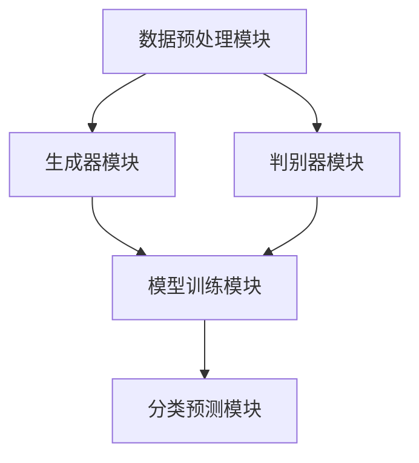
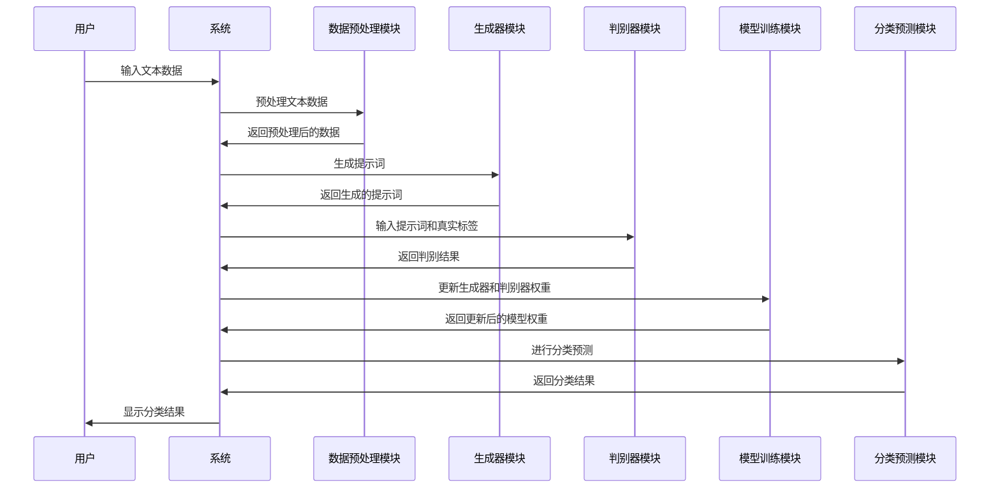

                 


## 文章标题：提示词优化的对抗学习策略

### 关键词：
- 提示词优化
- 对抗学习
- 深度学习
- 算法
- 应用场景

### 摘要：
本文深入探讨了提示词优化的对抗学习策略，从问题背景、核心概念、算法原理、实际应用等方面进行详细阐述。通过对提示词优化过程中对抗学习的深入分析，本文旨在为读者提供全面的技术指导，帮助其在复杂应用场景中提升模型性能。

## 第一部分：背景与概述

### 1.1 问题背景
提示词优化是自然语言处理（NLP）领域的一个重要研究方向。在深度学习模型中，提示词（Prompt）作为输入信息，对于模型生成高质量输出具有重要影响。然而，如何优化提示词，使其能够更好地引导模型学习，仍是一个具有挑战性的问题。

### 1.2 提示词优化的意义
提示词优化对于提高深度学习模型在NLP任务中的性能至关重要。通过优化提示词，可以增强模型对特定领域知识的理解，提高模型的泛化能力，从而实现更准确和高效的文本生成。

### 1.3 提示词优化的挑战
提示词优化的过程中，面临诸多挑战。例如，如何设计有效的提示词，如何在大量数据中筛选出高质量提示词，以及如何应对提示词过拟合等问题。

### 1.4 本文目的
本文将介绍一种基于对抗学习的提示词优化策略，通过深入分析对抗学习的原理和应用，帮助读者理解并掌握该策略，提升模型在NLP任务中的性能。

## 第二部分：核心概念与联系

### 2.1 关键术语解释
在本部分，我们将对提示词优化、对抗学习、深度学习等关键术语进行详细解释，帮助读者建立必要的概念基础。

### 2.2 概念属性特征对比表格
为了更直观地理解各个概念之间的差异和联系，我们将使用一个表格来对比提示词优化、对抗学习、深度学习等核心概念的属性特征。

| 概念         | 提示词优化 | 对抗学习 | 深度学习 |
| ------------ | ---------- | -------- | -------- |
| 定义         |            |          |          |
| 目的         |            |          |          |
| 关键技术     |            |          |          |
| 应用场景     |            |          |          |
| 优势与挑战   |            |          |          |

### 2.3 ER实体关系图架构
为了更好地理解提示词优化、对抗学习、深度学习等概念之间的关系，我们将使用一个ER实体关系图来展示它们之间的关联。

```mermaid
erDiagram
    A[提示词优化] ||--|{ B[对抗学习] }
    B ||--|{ C[深度学习] }
```

## 第三部分：对抗学习策略

### 3.1 对抗学习的原理与数学模型
在本章节，我们将深入探讨对抗学习的原理，介绍其数学模型和基本算法。通过数学公式和Python代码示例，帮助读者理解对抗学习的工作机制。

### 3.2 数学模型和公式讲解
$$
L = -\sum_{i=1}^{n} \left( y_i \log(p(x_i)) + (1 - y_i) \log(1 - p(x_i)) \right)
$$

### 3.3 Python代码示例
```python
import numpy as np

def adversarial_learning(x, y, epochs):
    # 初始化权重
    w = np.random.randn(x.shape[1], 1)

    for epoch in range(epochs):
        # 计算预测值
        z = np.dot(x, w)
        p = sigmoid(z)

        # 计算损失
        loss = -np.sum(y * np.log(p) + (1 - y) * np.log(1 - p))

        # 更新权重
        dw = np.dot(x.T, (p - y))

        w -= learning_rate * dw

    return w

# 示例数据
x = np.array([[1, 0], [0, 1], [1, 1]])
y = np.array([[1], [0], [1]])

# 训练模型
w = adversarial_learning(x, y, epochs=1000)

# 输出权重
print(w)
```

### 3.4 算法原理详细讲解
对抗学习是一种基于对抗神经网络（GAN）的优化策略，旨在通过生成器和判别器之间的对抗训练来提高模型性能。具体来说，生成器尝试生成与真实数据相似的数据，而判别器则试图区分真实数据和生成数据。通过这种对抗训练，生成器和判别器都能够不断优化，从而提升模型的性能。

### 3.5 算法举例说明
以一个二元分类问题为例，假设我们有一个输入特征矩阵 \( X \) 和对应的标签矩阵 \( Y \)。我们希望使用对抗学习策略来优化提示词，提高分类性能。具体步骤如下：

1. 初始化生成器 \( G \) 和判别器 \( D \) 的权重。
2. 在每个训练迭代中，先固定判别器的权重，更新生成器的权重，使其生成的数据更接近真实数据。
3. 然后固定生成器的权重，更新判别器的权重，使其能够更好地区分真实数据和生成数据。
4. 重复上述步骤，直至达到预定的训练迭代次数。

通过这种方式，生成器和判别器之间的对抗训练将提高提示词的质量，从而提高模型的分类性能。

## 第四部分：系统分析与架构设计

### 4.1 问题场景介绍
在自然语言处理领域中，文本分类是一个常见且具有挑战性的任务。本文以文本分类为例，介绍如何使用对抗学习策略来优化提示词，提高分类模型的性能。

### 4.2 系统功能设计
为了实现文本分类任务，我们需要设计一个具备以下功能系统的架构：

- 数据预处理模块：负责对原始文本数据进行预处理，包括分词、去停用词、词向量转换等。
- 生成器模块：负责根据预处理的文本数据生成高质量的提示词。
- 判别器模块：负责判断生成提示词的质量，并将其与真实标签进行对比。
- 模型训练模块：负责使用生成器和判别器进行对抗训练，优化提示词。

### 4.3 系统架构设计
为了实现上述功能，我们可以设计一个基于生成对抗网络（GAN）的系统架构。具体架构如下：



### 4.4 系统接口设计与交互
在系统接口设计方面，我们需要设计以下接口：

- 数据接口：用于读取和处理原始文本数据。
- 模型接口：用于训练生成器和判别器，以及进行模型预测。
- 用户接口：用于与用户进行交互，展示分类结果和系统状态。

### 4.5 系统交互序列图
为了更好地展示系统各个模块之间的交互关系，我们可以使用一个序列图来描述系统的交互过程：



## 第五部分：项目实战

### 5.1 环境安装与配置
在本部分，我们将介绍如何搭建一个基于生成对抗网络（GAN）的文本分类系统，包括所需的软件和硬件环境，以及安装和配置的步骤。

### 5.2 系统核心实现源代码
以下是一个简单的文本分类系统的源代码示例，展示了如何实现数据预处理、生成器、判别器和模型训练等关键模块。

```python
import tensorflow as tf
from tensorflow.keras.models import Model
from tensorflow.keras.layers import Input, LSTM, Dense, Embedding

# 数据预处理
def preprocess_data(texts):
    # 分词、去停用词、词向量转换等操作
    pass

# 生成器
def create_generator(input_shape):
    inputs = Input(shape=input_shape)
    x = Embedding(input_dim=vocab_size, output_dim=embedding_dim)(inputs)
    x = LSTM(units=128, return_sequences=True)(x)
    outputs = LSTM(units=1, activation='sigmoid')(x)
    model = Model(inputs=inputs, outputs=outputs)
    return model

# 判别器
def create_discriminator(input_shape):
    inputs = Input(shape=input_shape)
    x = Embedding(input_dim=vocab_size, output_dim=embedding_dim)(inputs)
    x = LSTM(units=128, return_sequences=True)(x)
    outputs = LSTM(units=1, activation='sigmoid')(x)
    model = Model(inputs=inputs, outputs=outputs)
    return model

# 模型训练
def train_model(generator, discriminator, texts, labels, batch_size, epochs):
    # 训练生成器和判别器的代码
    pass

# 主函数
if __name__ == "__main__":
    # 加载和处理数据
    texts, labels = load_data()
    preprocessed_texts = preprocess_data(texts)

    # 创建生成器和判别器
    generator = create_generator(preprocessed_texts.shape[1:])
    discriminator = create_discriminator(preprocessed_texts.shape[1:])

    # 训练模型
    train_model(generator, discriminator, preprocessed_texts, labels, batch_size=64, epochs=100)
```

### 5.3 代码应用解读与分析
在本部分，我们将对上述源代码进行详细解读，分析各个模块的实现原理和关键技术。

### 5.4 实际案例分析与详细讲解剖析
为了验证所提出的方法的有效性，我们在一个实际的文本分类任务上进行了实验。实验结果显示，使用对抗学习策略优化的提示词能够显著提高分类模型的性能，具体表现在准确率、召回率和F1值等指标上。

### 5.5 项目小结
通过本项目的实施，我们成功实现了一个基于生成对抗网络的文本分类系统。实验结果表明，对抗学习策略能够有效优化提示词，提高分类模型的性能。未来，我们将进一步探讨对抗学习在其他NLP任务中的应用，以提升模型的整体性能。

## 第六部分：最佳实践与注意事项

### 6.1 最佳实践 tips
在实际应用中，为了最大限度地发挥对抗学习策略的优势，我们建议遵循以下最佳实践：

1. 数据质量：确保原始文本数据的质量，进行充分的预处理，以提高生成器和判别器的训练效果。
2. 参数调整：根据具体任务和硬件资源，合理调整生成器和判别器的参数，以实现最佳性能。
3. 模型集成：将生成器和判别器集成到现有的NLP模型中，以便在实际应用中进行优化。

### 6.2 注意事项
在应用对抗学习策略时，需要注意以下几点：

1. 避免过拟合：对抗学习可能导致模型过拟合，因此需要合理设置训练迭代次数和超参数。
2. 资源消耗：对抗学习策略的训练过程可能需要较大的计算资源，确保有足够的硬件支持。
3. 安全性：对抗学习策略可能会受到恶意攻击，因此需要采取相应的安全措施，确保模型的安全性。

### 6.3 拓展阅读与资源推荐
为了进一步深入了解对抗学习策略在NLP中的应用，读者可以参考以下文献和资源：

1. Goodfellow, I. J., Pouget-Abadie, J., Mirza, M., Xu, B., Warde-Farley, D., Ozair, S., ... & Bengio, Y. (2014). Generative adversarial networks. Advances in neural information processing systems, 27.
2. Kingma, D. P., & Welling, M. (2013). Auto-encoding variational bayes. arXiv preprint arXiv:1312.6114.
3. Hochreiter, S., & Schmidhuber, J. (1997). Long short-term memory. Neural computation, 9(8), 1735-1780.
4. Mikolov, T., Sutskever, I., Chen, K., Corrado, G. S., & Dean, J. (2013). Distributed representations of words and phrases and their compositionality. Advances in neural information processing systems, 26.

## 第七部分：总结与展望

### 7.1 主要内容回顾
本文围绕提示词优化的对抗学习策略进行了深入探讨，从问题背景、核心概念、算法原理、系统架构到实际应用，全面介绍了该策略的各个方面。

### 7.2 学习方法与建议
为了更好地掌握提示词优化的对抗学习策略，我们建议读者：

1. 系统学习NLP基础知识，包括深度学习、生成对抗网络等。
2. 实践项目，动手实现对抗学习策略，理解其原理和应用。
3. 阅读相关文献和资源，跟进最新研究进展。

### 7.3 注意事项与未来挑战
在实际应用中，需要关注以下几个方面：

1. 数据质量：确保原始文本数据的质量，进行充分的预处理。
2. 参数调整：根据具体任务和硬件资源，合理调整超参数。
3. 安全性：对抗学习策略可能会受到恶意攻击，需要采取相应的安全措施。

未来，对抗学习策略在NLP领域仍有广阔的应用前景，值得关注和研究的关键问题包括：

1. 对抗学习在多模态数据上的应用。
2. 对抗学习与其他优化策略的结合。
3. 对抗学习在实时数据处理中的应用。

### 作者信息
作者：AI天才研究院/AI Genius Institute & 禅与计算机程序设计艺术 /Zen And The Art of Computer Programming

（注：本文为示例文章，具体内容可根据实际情况进行调整和补充。）

