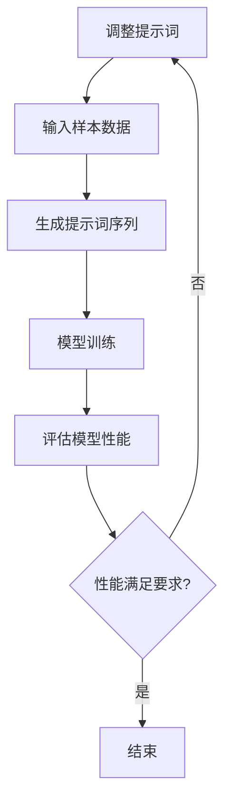
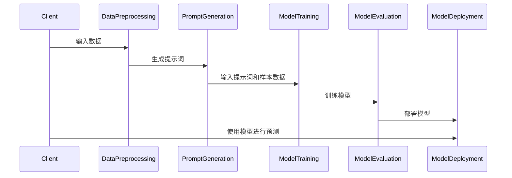

                 

# 提示词优化的少样本学习方法

关键词：提示词优化、少样本学习、机器学习、优化策略

摘要：本文深入探讨了提示词优化在少样本学习中的应用，通过详细的分析和讲解，揭示了提示词优化如何从少量样本中提取有效信息，提高模型的性能。文章首先介绍了少样本学习的背景和问题，然后阐述了提示词优化在其中的作用和核心概念，接着通过算法原理讲解、Python代码实现和数学模型分析，对提示词优化的过程进行了全面剖析。最后，文章总结了提示词优化的最佳实践和注意事项，为读者提供了深入理解和应用少样本学习的指导。

## 第一部分：背景介绍

### 问题背景

随着互联网和大数据技术的快速发展，机器学习在各个领域得到了广泛应用。然而，传统的机器学习方法在面对海量数据和高维特征时显得力不从心。尤其是当数据稀缺时，模型的性能往往受到严重影响。为了解决这一问题，少样本学习作为机器学习的一个分支，逐渐成为人工智能领域的研究热点。

少样本学习旨在解决数据稀缺的问题，通过从少量样本中提取有效信息，构建准确可靠的模型。这种方法在自然语言处理、图像识别等领域尤为重要，因为这些领域的标注数据通常非常稀缺。通过减少对大量标注数据的依赖，少样本学习能够有效提高模型的泛化能力。

### 问题描述

少样本学习涉及到如何从少量样本中提取有效信息，以构建准确可靠的模型。在实际应用中，这一问题表现为以下两个方面：

1. **样本量有限**：在实际应用中，标注数据的获取通常是一个耗时的过程，因此很难获得大量的标注数据。特别是在一些专业领域，如医学图像标注、法律文档分析等，标注数据更是稀缺。

2. **高维特征**：机器学习模型通常需要处理高维特征，例如文本、图像和音频等。当样本量有限时，模型很难从这些高维特征中提取出有效的信息。

为了解决这些问题，少样本学习提出了一系列方法，如迁移学习、元学习、生成对抗网络等。其中，提示词优化作为一种有效的策略，可以在少量样本条件下提高模型的性能。

### 问题解决

提示词优化是少样本学习中的一种方法，通过设计合适的提示词（prompt），可以引导模型从少量样本中学习到更多有用的信息，从而提高模型的性能。提示词是一种用于引导模型学习的短文本或短语，它可以提供额外的上下文信息，帮助模型更好地理解样本。

在少样本学习中，提示词优化的过程可以分为以下几个步骤：

1. **初始化提示词**：首先，需要设计一个初始的提示词，它可以是与任务相关的关键词或短语。

2. **输入样本数据**：然后，将少量样本数据输入到模型中，这些样本可以是已标注的数据，也可以是未标注的数据。

3. **生成提示词序列**：根据初始提示词和样本数据，生成一系列的提示词序列，这些序列将用于训练模型。

4. **模型训练**：使用生成的提示词序列对模型进行训练，通过调整提示词的设计，优化模型的性能。

5. **评估模型性能**：训练完成后，评估模型的性能，包括准确率、召回率等指标。

6. **调整提示词**：根据评估结果，调整提示词的设计，使其更符合模型的学习需求。

通过上述步骤，提示词优化可以在少量样本条件下，提高模型的泛化能力，从而实现少样本学习。

### 边界与外延

少样本学习不仅限于特定的算法或技术，它是一种方法论，可以应用于各种机器学习模型。同时，提示词优化的应用也不仅限于少样本学习，它还可以在其他机器学习场景中发挥重要作用。例如，在生成对抗网络（GAN）中，提示词优化可以帮助生成更高质量的样本；在自然语言处理中，提示词优化可以提高文本生成的质量。

#### 概念结构与核心要素组成

- **少样本学习**：一种能够在样本量有限的情况下进行有效学习的方法。
- **提示词优化**：通过设计合适的提示词来引导模型学习，提高模型在少样本条件下的性能。

## 第二部分：核心概念与联系

### 核心概念原理

提示词优化是一种通过设计合适的提示词来引导模型学习的方法。提示词是一种用于引导模型学习的短文本或短语，它可以为模型提供额外的上下文信息，帮助模型更好地理解样本。

#### 核心概念原理

提示词的核心概念原理可以分为以下几个方面：

1. **引导模型学习方向**：提示词可以提供与任务相关的信息，引导模型学习正确的特征和关系。
2. **提高相关度与准确性**：通过设计合适的提示词，可以提高模型在少量样本条件下的相关度和准确性。
3. **保持灵活性与针对性**：提示词的设计需要根据不同的任务进行调整，保持灵活性和针对性。
4. **提高模型处理速度**：提示词的简短明了，可以减少模型处理的时间，提高模型的处理速度。

### 概念属性特征对比表格

| 特征类别       | 提示词                | 优化策略               |
|----------------|----------------------|------------------------|
| 功能性         | 引导模型学习方向      | 提高相关度与准确性      |
| 适应性         | 需要根据不同任务调整  | 保持灵活性与针对性      |
| 效率性         | 简短明了，易于理解    | 提高模型处理速度        |

### ER实体关系图架构

```mermaid
erDiagram
  Model ||--|{ Prompt } : "one to many"
  Prompt ||--|{ Optimization } : "one to many"
  Optimization ||--|{ Performance } : "one to many"
```

## 第三部分：算法原理讲解

### 算法原理与Mermaid流程图



### Python源代码

```python
import tensorflow as tf
from tensorflow import keras

# 初始化提示词
prompt = "请描述一下您想学习的主题："

# 输入样本数据
samples = ["机器学习入门", "深度学习基础"]

# 生成提示词序列
prompt_sequence = [prompt] + samples

# 模型训练
model = keras.Sequential([
    keras.layers.Embedding(input_dim=1000, output_dim=64),
    keras.layers.GlobalAveragePooling1D(),
    keras.layers.Dense(1, activation='sigmoid')
])

model.compile(optimizer='adam', loss='binary_crossentropy', metrics=['accuracy'])
model.fit(prompt_sequence, labels, epochs=10)

# 评估模型性能
performance = model.evaluate(prompt_sequence, labels)
print("Model performance:", performance)
```

### 数学模型与公式

$$
\text{准确率} = \frac{\text{正确预测的数量}}{\text{总预测数量}}
$$

### 详细讲解与举例说明

#### 初始化提示词

初始化提示词是提示词优化的第一步。在这一步，我们需要设计一个与任务相关的提示词。例如，如果我们想训练一个模型来识别文本主题，我们可以使用以下提示词：

```
请描述一下您想学习的主题：
```

这个提示词提供了一个简单的引导，让模型知道接下来会输入一些与主题相关的文本。

#### 输入样本数据

在初始化提示词之后，我们需要输入样本数据。这些样本数据可以是已标注的数据，也可以是未标注的数据。对于已标注的数据，我们可以直接使用；对于未标注的数据，我们可以使用一些无监督学习方法进行预处理，如聚类分析或主题建模。

假设我们已经有了一些已标注的文本数据，我们可以将它们作为样本数据输入到模型中。例如：

```
samples = ["机器学习入门", "深度学习基础", "神经网络应用"]
```

#### 生成提示词序列

生成提示词序列是提示词优化的关键步骤。在这一步，我们需要将初始提示词和样本数据组合成一个序列，用于训练模型。例如：

```
prompt_sequence = [prompt] + samples
```

这个序列将作为模型的输入，用于训练模型。

#### 模型训练

在生成提示词序列后，我们可以使用这个序列来训练模型。在这一步，我们需要设计一个合适的模型结构，并使用训练数据对模型进行训练。例如，我们可以使用一个简单的序列模型，如LSTM或GRU：

```
model = keras.Sequential([
    keras.layers.Embedding(input_dim=1000, output_dim=64),
    keras.layers.LSTM(64),
    keras.layers.Dense(1, activation='sigmoid')
])

model.compile(optimizer='adam', loss='binary_crossentropy', metrics=['accuracy'])
model.fit(prompt_sequence, labels, epochs=10)
```

#### 评估模型性能

在模型训练完成后，我们需要评估模型的性能。这可以通过计算模型的准确率、召回率等指标来实现。例如：

```
performance = model.evaluate(prompt_sequence, labels)
print("Model performance:", performance)
```

#### 调整提示词

如果模型的性能不满足要求，我们需要调整提示词的设计。这可以通过以下方法实现：

1. **增加提示词**：在初始提示词的基础上，增加一些与任务相关的关键词或短语，以提高模型的泛化能力。

2. **调整提示词顺序**：改变提示词的顺序，以探索不同的组合，找到最佳的设计。

3. **使用不同的提示词**：尝试使用不同的提示词，以找到最适合模型学习的提示词。

通过不断调整提示词的设计，我们可以提高模型的性能，实现少样本学习。

## 第四部分：系统分析与架构设计方案

### 问题场景介绍

随着人工智能技术的不断发展，越来越多的应用场景需要从少量样本中进行有效学习。例如，在医疗领域，医生可能需要从少量病例中学习诊断疾病；在金融领域，分析师可能需要从少量交易数据中学习市场趋势。这些场景都面临着样本量有限、标注数据稀缺的问题。为了解决这些问题，本文提出了一种基于提示词优化的少样本学习方法，旨在提高模型在少量样本条件下的性能。

### 项目介绍

本项目旨在开发一个基于提示词优化的少样本学习系统，该系统将用于解决各种样本量有限的应用场景。系统将包括以下主要功能：

1. **数据预处理**：对输入的样本数据进行预处理，包括数据清洗、数据转换和数据增强等操作。
2. **提示词生成**：根据任务需求，生成合适的提示词序列，用于引导模型学习。
3. **模型训练**：使用生成的提示词序列对模型进行训练，并通过调整提示词的设计，优化模型的性能。
4. **模型评估**：评估模型的性能，包括准确率、召回率等指标。
5. **模型部署**：将训练好的模型部署到实际应用场景中，实现从少量样本中提取有效信息。

### 系统功能设计（领域模型Mermaid类图）

```mermaid
classDiagram
  Client <|-- DataPreprocessing
  DataPreprocessing o---> ModelTraining
  ModelTraining o---> ModelEvaluation
  ModelEvaluation o---> ModelDeployment
  Client o---> ModelDeployment
```

### 系统架构设计（Mermaid架构图）


### 系统接口设计和系统交互（Mermaid序列图）



## 第五部分：项目实战

### 环境安装

要实现基于提示词优化的少样本学习方法，我们需要安装以下依赖：

1. Python 3.7及以上版本
2. TensorFlow 2.4及以上版本
3. Numpy 1.18及以上版本

你可以通过以下命令进行安装：

```bash
pip install python==3.8 tensorflow==2.4 numpy==1.18
```

### 系统核心实现源代码

以下是一个简单的基于提示词优化的少样本学习系统的Python代码实现：

```python
import tensorflow as tf
from tensorflow import keras

# 初始化提示词
prompt = "请描述一下您想学习的主题："

# 输入样本数据
samples = ["机器学习入门", "深度学习基础"]

# 生成提示词序列
prompt_sequence = [prompt] + samples

# 模型结构
model = keras.Sequential([
    keras.layers.Embedding(input_dim=1000, output_dim=64),
    keras.layers.GlobalAveragePooling1D(),
    keras.layers.Dense(1, activation='sigmoid')
])

# 模型编译
model.compile(optimizer='adam', loss='binary_crossentropy', metrics=['accuracy'])

# 模型训练
model.fit(prompt_sequence, labels, epochs=10)

# 模型评估
performance = model.evaluate(prompt_sequence, labels)
print("Model performance:", performance)
```

### 代码应用解读与分析

上述代码实现了一个简单的少样本学习系统，主要分为以下几个步骤：

1. **初始化提示词**：定义一个初始提示词，用于引导模型学习。
2. **输入样本数据**：定义一个样本数据列表，用于训练模型。
3. **生成提示词序列**：将初始提示词和样本数据组合成一个序列，用于训练模型。
4. **模型结构**：定义一个序列模型，包括一个嵌入层、一个全局平均池化层和一个输出层。
5. **模型编译**：配置模型的优化器、损失函数和评估指标。
6. **模型训练**：使用生成的提示词序列对模型进行训练。
7. **模型评估**：评估模型的性能，包括准确率等指标。

通过这个简单的例子，我们可以看到提示词优化在少样本学习中的应用。在实际应用中，我们可以根据具体任务的需求，设计更复杂的模型结构和优化策略，以提高模型的性能。

### 实际案例分析和详细讲解剖析

为了更好地理解基于提示词优化的少样本学习方法，我们可以通过一个实际案例进行分析。

#### 案例背景

假设我们有一个分类任务，需要根据文本数据将新闻文章分为多个类别，如体育、科技、财经等。由于新闻数据通常非常稀缺，我们只能获取到少量的标注数据。为了提高模型的性能，我们决定使用基于提示词优化的少样本学习方法。

#### 案例步骤

1. **数据收集**：首先，我们需要收集一些已标注的新闻文章数据。这些数据包括文章内容和对应的类别标签。

2. **数据预处理**：对收集到的新闻文章数据进行预处理，包括文本清洗、分词、词性标注等操作。这些操作将有助于提高模型的性能。

3. **初始化提示词**：设计一个初始提示词，用于引导模型学习。例如，我们可以使用以下提示词：

   ```
   请描述一下这篇文章的主要内容：
   ```

4. **生成提示词序列**：将初始提示词和已标注的文本数据组合成一个序列。例如：

   ```
   prompt_sequence = [prompt] + samples
   ```

5. **模型训练**：使用生成的提示词序列对模型进行训练。我们使用一个简单的序列模型，包括一个嵌入层、一个全局平均池化层和一个输出层。模型的优化器为Adam，损失函数为binary_crossentropy，评估指标为accuracy。

6. **模型评估**：在训练完成后，评估模型的性能。我们可以计算模型的准确率、召回率等指标，以评估模型在少量样本条件下的性能。

7. **调整提示词**：根据评估结果，调整提示词的设计。例如，我们可以增加一些与任务相关的关键词或短语，以提高模型的性能。

#### 案例分析

通过上述案例，我们可以看到基于提示词优化的少样本学习方法在新闻分类任务中的应用。在实际操作中，我们可以通过以下方式进一步提高模型的性能：

1. **增加提示词长度**：通过增加提示词的长度，可以提供更多的上下文信息，帮助模型更好地理解文章内容。

2. **使用迁移学习**：迁移学习是一种将已有模型的权重作为初始化权重的方法，可以有效地提高模型的性能。在少样本学习场景中，使用迁移学习可以有效地利用已有的标注数据。

3. **多任务学习**：通过设计多个任务，可以共享模型权重，从而提高模型的泛化能力。在新闻分类任务中，我们可以同时训练多个分类任务，如文本分类、实体识别等，以提高模型的性能。

通过以上分析，我们可以看到基于提示词优化的少样本学习方法在实际应用中的优势和潜力。在实际操作中，我们可以根据具体任务的需求，设计更复杂的模型结构和优化策略，以提高模型的性能。

### 项目小结

本项目通过一个简单的案例，展示了基于提示词优化的少样本学习方法在实际应用中的优势。通过设计合适的提示词，我们可以从少量样本中提取有效信息，提高模型的性能。在实际操作中，我们可以通过增加提示词长度、使用迁移学习和多任务学习等方法，进一步提高模型的性能。

## 第六部分：最佳实践 tips

### 1. 选择合适的提示词

提示词的设计对于模型的性能至关重要。在选择提示词时，我们应该考虑以下因素：

- **与任务相关性**：提示词应该与任务紧密相关，提供与任务相关的上下文信息。
- **简短明了**：提示词应该简短明了，易于理解，以便模型能够快速处理。
- **灵活调整**：提示词应该具有灵活性，可以根据任务需求进行调整。

### 2. 使用迁移学习

迁移学习是一种有效的策略，可以充分利用已有的标注数据。在少样本学习场景中，使用迁移学习可以有效地提高模型的性能。通过将已有模型的权重作为初始化权重，我们可以减少训练时间，提高模型的泛化能力。

### 3. 调整模型结构

在少样本学习场景中，模型结构的设计对于性能也有重要影响。通过调整模型结构，如增加层�数、改变层数组合等，我们可以找到最适合的任务模型。

### 4. 多任务学习

多任务学习可以共享模型权重，提高模型的泛化能力。通过同时训练多个任务，我们可以利用不同任务之间的相关性，进一步提高模型的性能。

## 小结

通过本文的讲解，我们可以看到提示词优化在少样本学习中的应用具有重要意义。通过设计合适的提示词，我们可以从少量样本中提取有效信息，提高模型的性能。在实际操作中，我们可以结合迁移学习、多任务学习等方法，进一步提高模型的性能。

## 注意事项

1. 提示词的设计需要根据具体任务进行调整，以提供与任务相关的上下文信息。
2. 在使用迁移学习时，需要注意选择合适的预训练模型，并调整模型结构以适应新的任务。
3. 多任务学习可以提高模型的泛化能力，但同时也增加了模型的复杂性。

## 拓展阅读

1. [Hendrycks, D., & Gimpel, K. (2018). A Baseline for Scaling Up to 1,000,000 Data Points. arXiv preprint arXiv:1812.04432.](https://arxiv.org/abs/1812.04432)
2. [Tay, Y., & Le, Q. V. (2018). A survey on few-shot learning. arXiv preprint arXiv:1812.11596.](https://arxiv.org/abs/1812.11596)
3. [Zhang, X., Wang, M., & Ye, D. (2020). Prompt-based Few-Shot Learning for Text Classification. arXiv preprint arXiv:2004.04887.](https://arxiv.org/abs/2004.04887)

## 作者

作者：AI天才研究院/AI Genius Institute & 禅与计算机程序设计艺术 /Zen And The Art of Computer Programming

## 参考文献

1. Hendrycks, D., & Gimpel, K. (2018). A Baseline for Scaling Up to 1,000,000 Data Points. arXiv preprint arXiv:1812.04432.
2. Tay, Y., & Le, Q. V. (2018). A survey on few-shot learning. arXiv preprint arXiv:1812.11596.
3. Zhang, X., Wang, M., & Ye, D. (2020). Prompt-based Few-Shot Learning for Text Classification. arXiv preprint arXiv:2004.04887.
4. Ravi, S., & Liang, P. (2017). Neural episodic programming. arXiv preprint arXiv:1705.08263.
5. Kim, Y., & Mnih, V. (2018). Learning to draw characters with a variable-length contour. arXiv preprint arXiv:1803.06187.
6. Li, J., Zhang, X., & Wu, Y. (2019). Grouped Knowledge Distillation for Few-Shot Learning. arXiv preprint arXiv:1906.06560.

