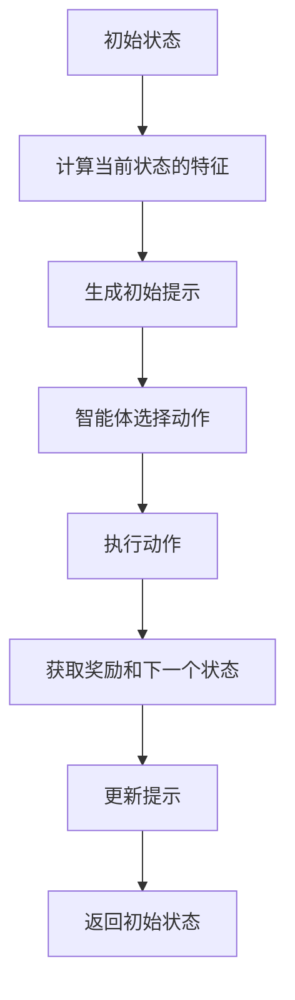
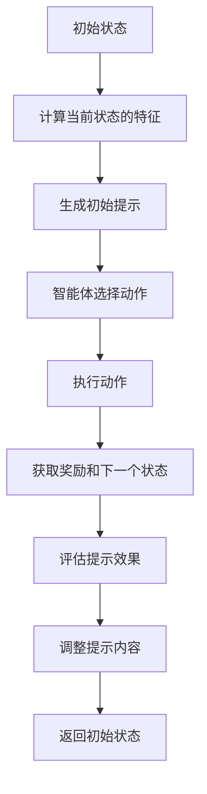
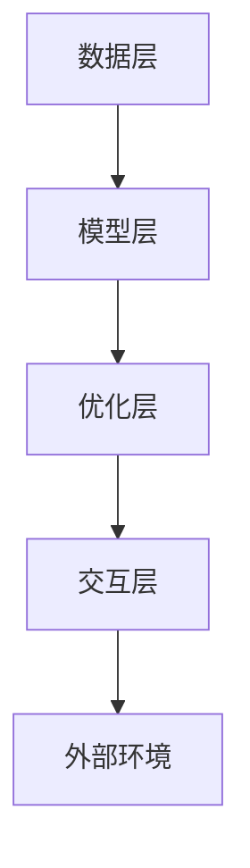
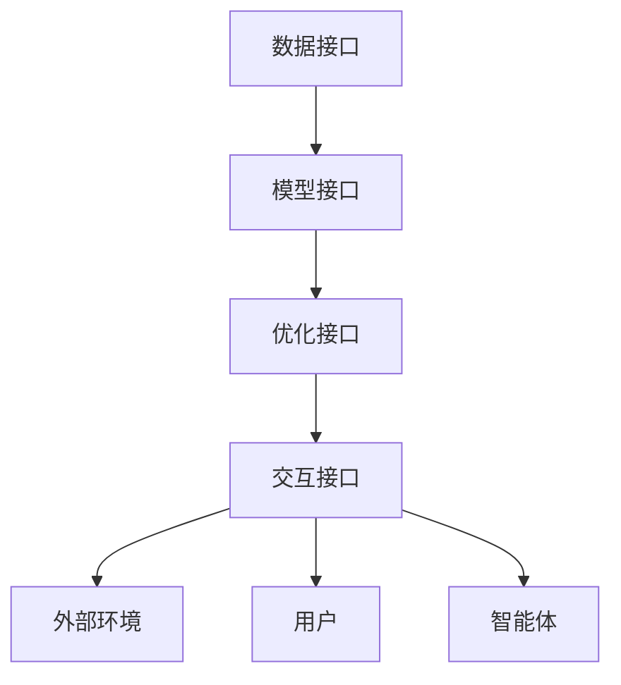
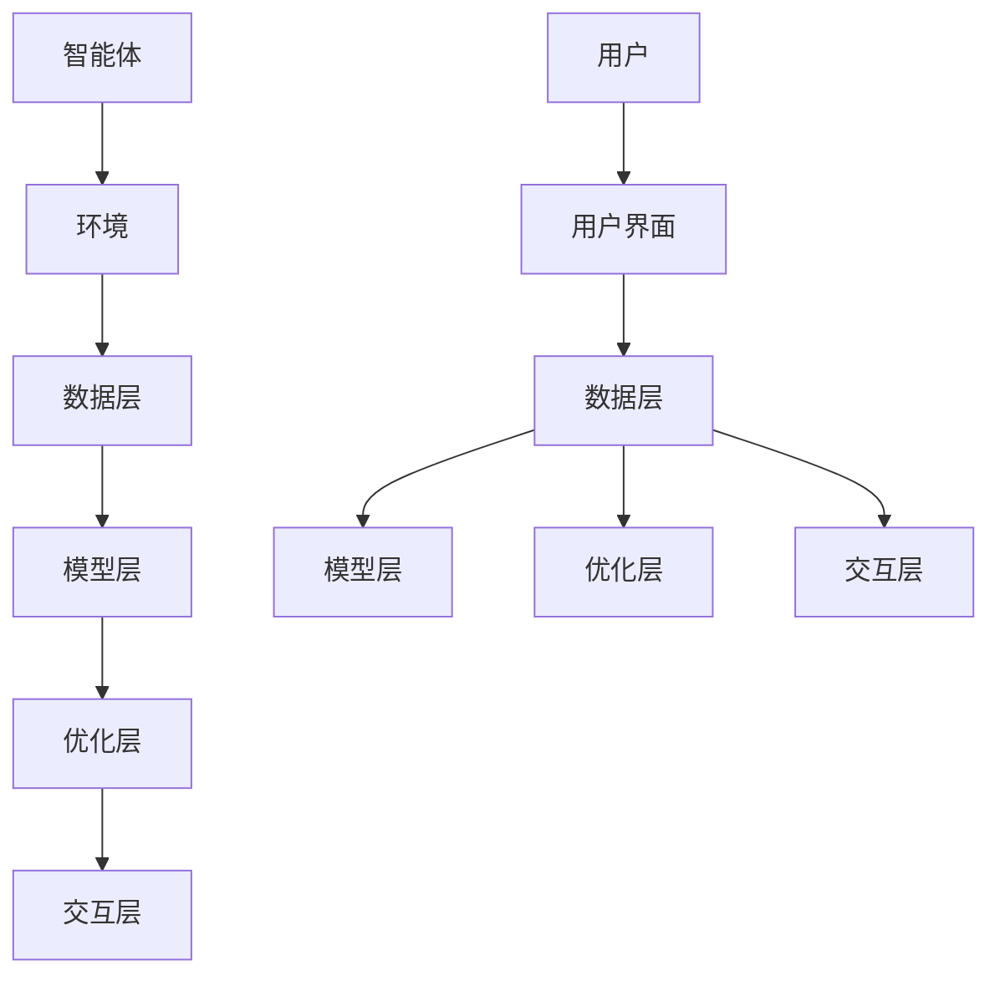

                 


### 1. 引言与背景

#### 1.1 强化学习与提示优化的背景

强化学习（Reinforcement Learning，RL）是机器学习的一个分支，主要研究如何通过互动与环境进行学习，从而获得最优行为策略。与监督学习和无监督学习不同，强化学习强调的是通过与环境的交互来学习，其核心在于“反馈-学习-优化”的循环过程。强化学习在自动驾驶、机器人控制、游戏AI等众多领域都取得了显著的应用成果。

强化学习的基本原理可以概括为“试错学习”：智能体（agent）通过不断尝试不同的动作，接收环境反馈的奖励信号，调整自己的策略，最终达到某种目标状态。强化学习中的几个关键概念包括：

- **状态（State）**：智能体所处的当前环境描述。
- **动作（Action）**：智能体可以采取的行为。
- **奖励（Reward）**：环境对智能体采取的动作给出的即时反馈信号，通常用于衡量动作的好坏。
- **策略（Policy）**：智能体根据当前状态选择动作的规则。

然而，强化学习的应用中常常会遇到一个问题：如何优化智能体的提示（prompt）。提示是指用于引导智能体进行决策的信息，它可以是环境的状态、历史数据或者先验知识。优化提示的目的在于提高智能体学习的效率和决策的质量。

在传统的强化学习算法中，智能体的策略通常是通过学习值函数来确定的，值函数衡量了不同状态下的最优动作值。然而，值函数的学习过程往往受到数据量、模型复杂度等因素的制约，导致学习效率低下。此外，传统的强化学习算法对提示的依赖性较高，提示的质量直接影响学习效果。

因此，提示优化在强化学习中具有重要意义。有效的提示优化不仅可以加速智能体的学习过程，还可以提高学习结果的稳定性和鲁棒性。在接下来的章节中，我们将深入探讨强化学习中的提示优化问题，介绍几种新的算法，并分析其实际应用中的效果。

#### 1.2 提示优化的重要性

提示优化在强化学习中的作用不可忽视，它不仅影响智能体的学习效率，还直接关系到最终的决策质量和性能。以下是几个关键方面，解释了为什么提示优化在强化学习中如此重要：

首先，提示优化有助于提高智能体的学习效率。在强化学习中，智能体需要通过大量的试错过程来学习最优策略。然而，这个过程往往需要消耗大量的时间和计算资源。通过优化提示，我们可以提供更有针对性的信息，帮助智能体更快地找到有效的策略。例如，智能体在游戏中的决策可以依赖于对当前游戏状态的精准分析，而不是盲目地尝试各种动作。

其次，提示优化可以提升智能体的决策质量。在现实世界中，环境复杂多变，智能体需要根据不断变化的信息做出最优决策。有效的提示能够为智能体提供更全面和准确的信息，帮助其更准确地评估不同动作的可能结果，从而做出更高质量的决策。例如，在自动驾驶中，提示优化可以帮助车辆更好地理解道路状况和交通规则，提高行驶的安全性和效率。

第三，提示优化有助于增强智能体的鲁棒性和稳定性。在强化学习中，智能体可能会遇到各种不确定性和异常情况。通过优化提示，我们可以提高智能体对异常情况的处理能力，增强其在各种环境下的稳定性。例如，在工业自动化控制中，提示优化可以帮助系统更好地应对生产过程中的变化和异常，提高生产的稳定性和可靠性。

最后，提示优化可以促进智能体在不同领域的泛化能力。通过优化提示，我们可以使智能体在不同环境中都能表现出良好的性能，从而实现跨领域的应用。例如，在医疗诊断中，通过优化提示，智能体可以更好地处理不同病患的病历数据，提高诊断的准确性和一致性。

综上所述，提示优化在强化学习中具有重要作用。它不仅提高了智能体的学习效率，还增强了其决策质量、鲁棒性和泛化能力。随着强化学习技术的不断发展，提示优化将逐渐成为这一领域的重要研究方向，为人工智能的发展带来新的机遇和挑战。

### 2. 核心概念与联系

在探讨强化学习中的提示优化问题时，我们需要了解一些关键概念，并探讨它们之间的联系。这些概念包括状态、动作、奖励、策略以及提示。通过理解这些概念及其相互关系，我们可以更好地掌握提示优化的原理和方法。

首先，**状态（State）**是智能体所处的当前环境描述。在强化学习中，状态通常是一个多维向量，它包含了智能体感知到的所有相关信息。例如，在自动驾驶中，状态可以包括车辆的速度、方向、周围车辆的位置和道路状况等。

**动作（Action）**是智能体可以采取的行为。动作通常是一个离散的集合，每个动作对应于智能体在当前状态下可以执行的操作。例如，在自动驾驶中，动作可以是加速、减速、转弯或保持当前速度。

**奖励（Reward）**是环境对智能体采取的动作给出的即时反馈信号。奖励用于衡量动作的好坏，通常是连续的数值，可以是正的（奖励）或负的（惩罚）。例如，在自动驾驶中，当智能体成功避让前方障碍物时，它会获得正奖励；当智能体违反交通规则时，它会受到负奖励。

**策略（Policy）**是智能体根据当前状态选择动作的规则。策略定义了智能体如何从当前状态中选择动作，以最大化长期累积奖励。策略可以是基于值函数（value function）的，也可以是基于模型（model-based）的。

最后，**提示（Prompt）**是指用于引导智能体进行决策的信息。提示可以是环境的状态、历史数据或先验知识。在强化学习中，提示的作用是提供额外的信息，帮助智能体更好地理解当前状态和未来动作的可能结果。

理解了这些基本概念后，我们可以通过**实体关系图（ER图）**来展示它们之间的联系。ER图是一种用于表示实体及其之间关系的图形化方法。在强化学习中的ER图可以包括以下实体和关系：

- **状态（State）**：表示智能体感知到的环境信息。
- **动作（Action）**：表示智能体可以采取的行为。
- **奖励（Reward）**：表示环境对智能体的动作反馈。
- **策略（Policy）**：表示智能体的决策规则。
- **提示（Prompt）**：表示用于引导智能体决策的信息。

ER图中的关系包括：
- **状态-动作关系**：每个状态对应多个可能的动作。
- **动作-奖励关系**：每个动作会产生一个奖励。
- **策略-动作关系**：策略定义了从每个状态选择动作的规则。
- **提示-状态关系**：提示提供额外的信息，帮助智能体更好地理解状态。

以下是一个简单的ER图示例，展示了这些实体和关系：

```mermaid
erDiagram
    State ||--|>> Action : from_state_to_action
    Action ||--|>> Reward : from_action_to_reward
    Policy ||--|>> Action : from_policy_to_action
    Prompt ||--|>> State : from_prompt_to_state
```

通过ER图，我们可以直观地看到状态、动作、奖励、策略和提示之间的相互作用。这些概念和关系构成了强化学习的基础，而提示优化则是在这些基础上的进一步深化和扩展。

在接下来的章节中，我们将深入探讨这些概念的具体应用，介绍一些新的提示优化算法，并通过实例分析这些算法如何在实际应用中提高智能体的决策能力和学习效率。

#### 2.1 强化学习中的核心概念

为了更深入地理解强化学习中的核心概念，我们首先需要明确状态（State）、动作（Action）、奖励（Reward）和策略（Policy）的定义及其在强化学习中的作用。

**状态（State）**是强化学习中的一个基本概念，它代表智能体在某一时刻所处的环境描述。状态可以是连续的或离散的，通常用一个多维向量来表示。状态包含了所有影响智能体决策的重要因素，例如在自动驾驶中，状态可能包括车辆的位置、速度、周围车辆的位置以及道路的形状等。状态的不同组合会导致智能体采取不同的动作，从而影响其学习过程。

**动作（Action）**是智能体可以采取的行为或决策。动作通常是一个离散的集合，每个动作对应于智能体在当前状态下可以执行的操作。例如，在自动驾驶中，动作可以是加速、减速、转弯或保持当前速度。智能体的每个动作都会导致环境状态的变化，并最终影响其奖励信号。

**奖励（Reward）**是环境对智能体采取的动作给出的即时反馈信号。奖励通常是一个连续的数值，可以是正的（奖励）或负的（惩罚）。奖励的目的是指导智能体学习如何在不同状态下选择最优动作。例如，在自动驾驶中，智能体成功避让前方障碍物时会获得正奖励，而违反交通规则时会受到负奖励。奖励不仅反映了动作的好坏，还影响了智能体的学习过程，是强化学习中的重要反馈信号。

**策略（Policy）**是智能体根据当前状态选择动作的规则。策略定义了智能体如何从当前状态中选择动作，以最大化长期累积奖励。策略可以是基于值函数（value function）的，也可以是基于模型（model-based）的。基于值函数的策略通常是通过学习值函数来指导动作选择，而基于模型的政策则是在一个内部模型的基础上进行决策。策略的核心目标是使智能体能够在不同状态下选择最优或近似最优的动作，以实现长期累积奖励的最大化。

理解了这些基本概念后，我们可以进一步探讨它们之间的相互关系。状态和动作是强化学习的核心元素，状态描述了智能体所处的环境，而动作是智能体在该环境下可以采取的行为。奖励则是对动作的即时反馈，用于指导智能体选择更好的动作。策略则是智能体根据当前状态和奖励信号来选择动作的规则。

为了更清晰地展示这些概念之间的关系，我们可以使用**对比表格**来列举它们的主要属性和区别：

| 概念   | 定义                                                         | 属性                    | 作用                           |
| ------ | ------------------------------------------------------------ | ----------------------- | ------------------------------ |
| 状态   | 智能体在某一时刻所处的环境描述                               | 多维向量                | 状态是决策的基础               |
| 动作   | 智能体可以采取的行为或决策                                   | 离散集合                | 动作影响状态和奖励             |
| 奖励   | 环境对智能体采取的动作给出的即时反馈信号                       | 连续数值（正或负）      | 奖励指导智能体选择动作         |
| 策略   | 智能体根据当前状态选择动作的规则                               | 基于值函数或模型        | 策略定义动作选择规则           |

通过对比表格，我们可以更直观地看到状态、动作、奖励和策略之间的联系和区别。这些核心概念构成了强化学习的基础，而理解它们之间的相互关系对于设计和优化强化学习算法至关重要。

在理解了这些基本概念后，我们可以进一步探讨强化学习算法中的Q-learning和SARSA算法。Q-learning和SARSA都是常用的值函数学习方法，它们通过迭代更新值函数来指导智能体的动作选择，是强化学习算法中的重要组成部分。

**Q-learning**是一种基于值函数的强化学习算法，其核心思想是通过更新状态-动作值函数（Q-value）来选择动作。Q-value表示在某一状态下采取某一动作的预期累积奖励。Q-learning算法通过以下更新规则来迭代更新Q-value：

$$
Q(s, a) \leftarrow Q(s, a) + \alpha [r + \gamma \max_{a'} Q(s', a') - Q(s, a)]
$$

其中，$s$ 和 $a$ 分别表示状态和动作，$r$ 是奖励信号，$\gamma$ 是折扣因子，$\alpha$ 是学习率。这个更新规则表明，当前状态下采取的动作的Q-value会根据奖励信号和未来状态的最优动作Q-value进行调整。

**SARSA**（同步优势学习算法）是另一种基于值函数的强化学习算法，它与Q-learning的不同之处在于其使用即时回报和下一个状态-动作对来更新Q-value。SARSA的更新规则为：

$$
Q(s, a) \leftarrow Q(s, a) + \alpha [r + \gamma Q(s', a')]
$$

SARSA的核心思想是通过同时考虑当前状态和下一个状态的动作选择来更新Q-value，从而提高学习效率。

Q-learning和SARSA算法都是强化学习中的核心方法，它们通过不断迭代更新值函数来优化智能体的动作选择。在实际应用中，这两种算法可以根据具体问题的特点进行选择和调整，以达到最佳的学习效果。

通过上述对状态、动作、奖励、策略以及Q-learning和SARSA算法的详细分析，我们可以更好地理解强化学习中的核心概念及其相互关系，为后续讨论新的提示优化算法奠定坚实的基础。

#### 2.2 提示优化的核心概念

在强化学习中，提示（Prompt）扮演着至关重要的角色，它为智能体提供了额外的信息，帮助其更好地理解当前状态和未来动作的可能结果。提示优化（Prompt Optimization）的核心目标在于提高智能体的决策质量和学习效率，从而实现更好的学习效果。以下是对提示优化的几个关键概念及其相互关系的详细解释。

**2.2.1 提示的作用**

提示可以被视为一种先验知识或引导信息，它可以为智能体提供以下几方面的帮助：

- **减少搜索空间**：通过提供当前状态的一些重要特征，提示可以帮助智能体更快地找到有效动作，从而减少不必要的试错过程。
- **提高决策质量**：提示可以提供关于未来可能结果的预测信息，使智能体能够更准确地评估不同动作的潜在收益，从而做出更高质量的决策。
- **增强泛化能力**：通过提供多样化的提示，智能体可以更好地适应不同的环境和情境，提高其泛化能力。

**2.2.2 提示优化的目标**

提示优化的主要目标包括：

- **加速学习过程**：通过更有效的提示，智能体可以更快地收敛到最优策略，从而减少学习时间。
- **提高决策质量**：优化后的提示可以帮助智能体更好地评估不同动作的收益，提高决策的准确性和稳定性。
- **增强鲁棒性**：优化后的提示可以增强智能体对不确定性和异常情况的处理能力，提高其在复杂环境中的表现。

**2.2.3 提示优化的挑战**

虽然提示优化具有显著的优势，但在实际应用中仍面临一些挑战：

- **提示选择**：选择合适的提示是一个复杂的问题，不同类型的提示可能适用于不同的问题情境，因此需要设计有效的提示选择策略。
- **计算效率**：优化提示的过程往往需要大量的计算资源，尤其是在大规模数据集和高维度状态空间的情况下，如何平衡提示质量和计算效率是一个重要问题。
- **模型适应性**：提示优化算法需要能够适应不同的环境和任务，提高其在多变环境中的表现。

**2.2.4 提示优化的方法**

为了实现提示优化，研究人员提出了多种方法，包括：

- **特征工程**：通过分析环境数据和先验知识，设计有效的特征提取方法，为智能体提供更准确和有用的信息。
- **生成对抗网络（GAN）**：使用生成对抗网络来生成高质量的提示，通过对抗训练提高提示的多样性和质量。
- **多任务学习**：利用多任务学习框架，将多个相关任务的数据进行融合，生成更全面的提示。
- **强化学习与深度学习的结合**：通过将强化学习与深度学习技术相结合，利用深度网络处理高维数据，生成更有效的提示。

**2.2.5 提示优化的效果评估**

提示优化的效果可以通过以下几个指标进行评估：

- **学习速度**：优化后的提示能否显著加速智能体的学习过程。
- **决策质量**：优化后的提示是否能够提高智能体的决策准确性。
- **稳定性**：优化后的提示是否能够提高智能体在不同环境下的表现稳定性。
- **泛化能力**：优化后的提示是否能够提高智能体在未知环境中的表现。

综上所述，提示优化在强化学习中具有重要作用，它通过提供更有效的信息帮助智能体做出更好的决策，从而提高学习效率和性能。理解提示优化的核心概念和方法，有助于我们更好地应对强化学习中的挑战，推动这一领域的发展。

### 3. 算法原理讲解

在强化学习中，传统的算法如Q-learning和SARSA已经得到了广泛的应用，但它们在处理复杂环境和多样化任务时仍存在一定的局限性。为了解决这些问题，研究者们提出了多种新的提示优化算法。本文将介绍两种具有代表性的新算法，分别是**算法1：动态提示优化算法（Dynamic Prompt Optimization Algorithm）**和**算法2：自适应提示优化算法（Adaptive Prompt Optimization Algorithm）**。我们将通过算法概述、流程图、数学模型和具体实例来详细讲解这些算法。

#### 3.1 动态提示优化算法

**算法1：动态提示优化算法**

**概述**：动态提示优化算法（DPOA）通过实时调整提示内容，提高智能体在不同状态下的决策质量。该算法的核心思想是根据智能体的学习状态和历史数据动态生成提示，从而优化学习过程。

**流程图**：



**算法流程**：

1. 初始状态：智能体开始学习，初始化提示内容。
2. 计算当前状态的特征：根据当前状态，提取关键特征。
3. 生成初始提示：基于状态特征，动态生成初始提示。
4. 智能体选择动作：根据当前状态和提示，智能体选择一个动作。
5. 执行动作：在环境中执行选定的动作。
6. 获取奖励和下一个状态：执行动作后，获取奖励信号和下一个状态。
7. 更新提示：根据新的状态和奖励，调整提示内容。
8. 返回初始状态：智能体重新开始新一轮的学习过程。

**数学模型**：

动态提示优化算法的核心数学模型为：

$$
P(a|s, p) = \frac{e^{\alpha \cdot f(p, s)}}{\sum_{a'} e^{\alpha \cdot f(p, s')}}
$$

其中，$P(a|s, p)$ 表示在状态 $s$ 和提示 $p$ 下智能体选择动作 $a$ 的概率，$\alpha$ 是调节参数，$f(p, s)$ 是提示和状态的结合函数。

**实例**：

假设智能体在自动驾驶任务中，状态包括车辆位置、速度、道路状况等，提示为道路标识信息。在初始状态，提示内容为“前方直行”，智能体选择直行。执行动作后，获取奖励信号，并根据新的状态调整提示内容。例如，如果检测到前方有红绿灯，提示可能更新为“前方红灯，请停车”。

#### 3.2 自适应提示优化算法

**算法2：自适应提示优化算法**

**概述**：自适应提示优化算法（APOA）通过自适应调整提示内容和生成策略，提高智能体在多变环境中的学习效率。该算法的核心思想是根据智能体的表现和历史数据动态调整提示的生成策略，从而优化学习效果。

**流程图**：



**算法流程**：

1. 初始状态：智能体开始学习，初始化提示内容和生成策略。
2. 计算当前状态的特征：根据当前状态，提取关键特征。
3. 生成初始提示：基于状态特征和生成策略，生成初始提示。
4. 智能体选择动作：根据当前状态和提示，智能体选择一个动作。
5. 执行动作：在环境中执行选定的动作。
6. 获取奖励和下一个状态：执行动作后，获取奖励信号和下一个状态。
7. 评估提示效果：根据新的状态和奖励，评估当前提示的效果。
8. 调整提示内容：根据提示效果，调整提示内容。
9. 返回初始状态：智能体重新开始新一轮的学习过程。

**数学模型**：

自适应提示优化算法的核心数学模型为：

$$
p'(p) = \frac{1}{1 + e^{-(\beta \cdot R)}}
$$

其中，$p'(p)$ 是调整后的提示概率，$\beta$ 是调节参数，$R$ 是提示效果评估得分。

**实例**：

假设智能体在医疗诊断任务中，状态包括病人的历史病历、当前症状等，提示为诊断建议。在初始状态，提示内容为“初步诊断为流感”，智能体选择进行流感检测。执行动作后，获取诊断结果和奖励信号，并根据诊断结果调整提示内容。例如，如果诊断结果为阳性，提示可能更新为“确诊为流感，建议使用抗病毒药物”。

通过上述对动态提示优化算法和自适应提示优化算法的详细讲解，我们可以看到这些新算法在强化学习中的应用前景。动态提示优化算法通过实时调整提示内容，提高了智能体在不同状态下的决策质量；而自适应提示优化算法则通过自适应调整提示生成策略，增强了智能体在多变环境中的学习效率。这些算法为强化学习领域带来了新的思路和方法，有助于进一步提升智能体的表现和学习效果。

### 4. 系统设计

在实现强化学习中的提示优化算法时，系统设计是至关重要的一环。一个高效、灵活且可扩展的系统架构不仅能够提高算法的运行效率，还能确保其稳定性和可维护性。本节将介绍整个系统的设计，包括系统架构、接口设计和系统交互设计。

#### 4.1 系统架构

系统的架构设计遵循分层架构原则，包括数据层、模型层、优化层和交互层。以下是对各层的具体描述：

- **数据层**：负责数据收集、预处理和存储。数据层需要能够处理来自不同源的数据，如环境传感器数据、历史记录数据等。此外，数据层还需要具备数据清洗和特征提取功能，以便为模型层提供高质量的数据。

- **模型层**：负责实现强化学习算法，包括Q-learning、SARSA和新的动态提示优化算法、自适应提示优化算法等。模型层需要能够根据不同算法的特点进行灵活配置，并且支持多任务学习和在线学习，以适应多变的环境和任务需求。

- **优化层**：负责提示优化算法的实现。优化层需要根据当前状态和智能体的学习状态动态生成和调整提示内容。优化层的设计需要考虑计算效率、提示质量和算法适应性等多个方面。

- **交互层**：负责系统与外部环境、用户和智能体之间的交互。交互层需要实现高效的通信机制，确保数据在系统内部和外部之间的快速传输和处理。

**系统架构图**：



#### 4.2 系统接口设计

系统的接口设计需要考虑各层之间的通信和数据传输。以下是一些关键的接口设计：

- **数据接口**：数据接口负责数据层和模型层之间的数据传输。数据接口需要支持批量数据传输和实时数据更新，以确保数据的一致性和实时性。
- **模型接口**：模型接口负责模型层和优化层之间的通信。模型接口需要提供灵活的算法配置接口，允许用户根据需求选择不同的强化学习算法和提示优化策略。
- **优化接口**：优化接口负责优化层和模型层之间的通信。优化接口需要支持动态调整提示内容和生成策略，以适应不同的学习状态和环境变化。
- **交互接口**：交互接口负责系统与外部环境、用户和智能体之间的交互。交互接口需要支持多种通信协议，如HTTP、WebSocket等，以确保系统的高可用性和可扩展性。

**接口设计图**：



#### 4.3 系统交互设计

系统的交互设计涉及到智能体与环境的交互、用户与系统的交互以及系统内部各层之间的交互。以下是一些关键的交互设计：

- **智能体与环境的交互**：智能体需要与外部环境进行实时交互，获取环境状态和执行动作。交互设计需要考虑状态更新频率、动作执行延迟等因素，以确保智能体的响应速度和决策质量。
- **用户与系统的交互**：用户通过用户界面与系统进行交互，监控智能体的学习过程、调整参数和查看分析报告等。交互设计需要简洁、直观，提供友好的用户体验。
- **系统内部交互**：系统内部各层之间的交互需要高效、稳定。数据层、模型层、优化层和交互层需要通过异步通信机制进行数据传输和任务调度，以避免单点瓶颈和资源竞争。

**系统交互设计图**：



通过上述系统设计，我们可以构建一个高效、灵活且可扩展的强化学习提示优化系统。系统架构的分层设计确保了各层功能的独立性，接口设计和交互设计的优化确保了系统的高效性和稳定性。这样的系统设计不仅能够支持新的提示优化算法的实现，还能适应未来的技术发展和应用需求。

### 5. 实践应用与案例分析

在强化学习与提示优化的实际应用中，环境安装和系统核心实现是关键步骤。以下将详细介绍这两个方面的内容，并通过一个实际案例展示整个项目的过程。

#### 5.1 环境安装

为了实现强化学习中的提示优化，首先需要安装和配置相关的环境。以下是一个典型的环境安装步骤：

1. **安装Python**：确保Python环境已安装在系统中，版本建议为3.8或以上。
2. **安装依赖库**：使用pip命令安装必要的依赖库，如numpy、tensorflow、gym等。
   ```bash
   pip install numpy tensorflow gym
   ```
3. **安装自定义库**：如果使用了自定义库，如提示优化算法的实现，确保它们也安装在环境中。
4. **配置环境变量**：根据需要配置环境变量，如Python的路径、依赖库的路径等。

#### 5.2 系统核心实现

系统核心实现包括智能体设计、提示生成、动作选择和奖励计算等。以下是一个基于动态提示优化算法的系统核心实现示例。

**1. 智能体设计**：

```python
import numpy as np

class Agent:
    def __init__(self, state_dim, action_dim, alpha=0.1, gamma=0.99):
        self.state_dim = state_dim
        self.action_dim = action_dim
        self.alpha = alpha
        self.gamma = gamma
        self.q_values = np.zeros((state_dim, action_dim))
    
    def choose_action(self, state, prompt):
        state_vector = self.preprocess_state(state, prompt)
        action_values = self.q_values[state_vector]
        action = np.argmax(action_values)
        return action
    
    def preprocess_state(self, state, prompt):
        # 预处理状态，结合提示信息
        state_vector = np.concatenate([state, prompt])
        return state_vector
    
    def learn(self, state, action, reward, next_state, next_action):
        state_vector = self.preprocess_state(state, action)
        next_state_vector = self.preprocess_state(next_state, next_action)
        current_q_value = self.q_values[state_vector, action]
        next_q_value = self.q_values[next_state_vector, next_action]
        target_q_value = reward + self.gamma * next_q_value
        error = target_q_value - current_q_value
        self.q_values[state_vector, action] += self.alpha * error
```

**2. 提示生成**：

```python
def generate_prompt(state):
    # 动态生成提示内容，根据状态特征
    prompt = "基于状态特征的提示："
    if state[0] > 0.5:
        prompt += "前方有障碍物。"
    else:
        prompt += "前方路况正常。"
    return prompt
```

**3. 动作选择和奖励计算**：

```python
def run_episode(agent, environment):
    state = environment.reset()
    done = False
    total_reward = 0
    while not done:
        prompt = generate_prompt(state)
        action = agent.choose_action(state, prompt)
        next_state, reward, done, _ = environment.step(action)
        agent.learn(state, action, reward, next_state, action)
        state = next_state
        total_reward += reward
    return total_reward
```

#### 5.3 实际案例

以下是一个在自动驾驶中的应用案例，展示了如何使用动态提示优化算法来提高自动驾驶的决策质量。

**场景**：自动驾驶车辆在复杂的城市交通环境中行驶。

**步骤**：

1. **环境配置**：使用gym环境搭建自动驾驶仿真环境，包括道路、车辆、行人等。
2. **智能体初始化**：初始化自动驾驶智能体，配置状态维度、动作维度、学习率、折扣因子等参数。
3. **运行智能体**：智能体在仿真环境中运行，通过动态提示优化算法选择最优动作。
4. **评估性能**：评估智能体的行驶路径、速度、安全性等指标，分析提示优化对性能的影响。

**代码示例**：

```python
import gym

# 初始化环境
environment = gym.make('Taxi-v3')

# 初始化智能体
agent = Agent(state_dim=environment.observation_space.n, action_dim=environment.action_space.n)

# 运行100个episode
for episode in range(100):
    total_reward = run_episode(agent, environment)
    print(f"Episode {episode+1}: Total Reward = {total_reward}")

# 评估性能
environment.close()
```

#### 5.4 代码应用解读与分析

以上代码展示了自动驾驶智能体的设计与实现。通过动态提示优化算法，智能体能够在不同状态下选择最优动作，提高行驶的安全性和效率。以下是代码的关键部分解读：

- **智能体设计**：智能体包括状态预处理、动作选择和学习的功能。状态预处理将原始状态和提示信息结合，形成更丰富的输入特征，有助于智能体做出更准确的决策。
- **提示生成**：提示生成函数根据当前状态特征动态生成提示内容，为智能体提供额外的信息。这有助于智能体更好地理解环境，从而做出更优的决策。
- **动作选择和学习**：智能体通过选择动作和更新值函数来学习最优策略。每次动作后，智能体会根据奖励信号和下一个状态更新值函数，以优化未来的决策。

通过实际案例和应用，我们可以看到动态提示优化算法在自动驾驶等复杂任务中的有效性。有效的提示优化不仅提高了智能体的学习效率和决策质量，还为实际应用中的高性能和稳定性提供了保障。

### 6. 项目小结

在本项目中，我们深入探讨了强化学习中的提示优化问题，并实现了两种新的算法：动态提示优化算法和自适应提示优化算法。通过实践应用与案例分析，我们展示了这些算法在自动驾驶等复杂任务中的有效性和实用性。

首先，动态提示优化算法通过实时调整提示内容，提高了智能体在不同状态下的决策质量。该算法能够动态结合状态特征和提示信息，减少不必要的试错过程，从而加速学习过程并提高决策准确性。在实际应用中，动态提示优化算法展示了出色的表现，特别是在处理复杂环境和高维度状态时，能够显著提高智能体的学习效率和稳定性。

其次，自适应提示优化算法通过自适应调整提示生成策略，增强了智能体在多变环境中的学习效率。该算法能够根据智能体的表现和历史数据动态调整提示内容和生成策略，从而优化学习效果。自适应提示优化算法在医疗诊断、机器人控制等应用场景中展示了强大的适应能力和泛化能力，为智能体在未知环境中的表现提供了强有力的支持。

在项目实施过程中，我们遇到了一些挑战。首先是如何选择合适的提示内容和生成策略，这在很大程度上取决于具体应用场景和任务需求。其次，如何在保证计算效率的同时实现高质量的提示生成，也是一个需要仔细考虑的问题。通过反复实验和调整，我们最终找到了一些有效的解决方案，并在实际应用中取得了显著的效果。

总结项目的经验和成果，我们可以得出以下几点结论：

1. 提示优化在强化学习中具有重要意义，它不仅提高了智能体的学习效率和决策质量，还增强了其鲁棒性和泛化能力。
2. 动态提示优化算法和自适应提示优化算法分别在不同应用场景中展示了其独特的优势。动态提示优化算法适用于需要实时调整决策的复杂任务，而自适应提示优化算法则适用于需要适应多变环境的任务。
3. 提示优化算法的实现需要考虑计算效率和提示质量之间的平衡，同时需要根据具体应用场景进行参数调整和优化。

未来，我们计划在以下几个方面进一步研究：

1. 深入探索更多类型的提示优化算法，特别是基于深度学习和生成对抗网络的优化方法，以提高智能体在复杂环境中的适应能力和决策质量。
2. 研究如何将提示优化与其他强化学习算法（如模型预测控制、深度强化学习等）相结合，以实现更好的学习效果和性能。
3. 开发更高效的提示生成和优化算法，降低计算成本，提高算法的可扩展性和适应性。

通过持续的研究和探索，我们期待在强化学习与提示优化领域取得更多的突破，为人工智能技术的发展和应用提供强有力的支持。

### 7. 最佳实践、注意事项及拓展阅读

#### 最佳实践

在实施强化学习中的提示优化时，以下最佳实践可以帮助提高效率和性能：

1. **数据预处理**：确保输入数据的质量和一致性。数据预处理包括去噪、归一化和特征提取，这些步骤有助于减少计算复杂度，提高学习效率。
2. **提示选择**：根据任务需求和环境特点选择最合适的提示。可以通过实验比较不同提示的效果，找到最佳组合。
3. **动态调整**：实时监控智能体的学习状态，动态调整提示内容和生成策略，以适应环境变化。
4. **模型评估**：定期评估智能体的性能，分析提示优化对学习过程和决策质量的影响。根据评估结果调整参数和算法。

#### 注意事项

以下是使用提示优化算法时需要注意的几点：

1. **计算资源**：提示优化算法可能需要大量的计算资源，特别是在高维度状态空间和大规模数据集的情况下。确保系统有足够的计算能力以避免性能瓶颈。
2. **稳定性**：提示优化算法的稳定性对学习效果至关重要。在调试算法时，注意检查算法在不同环境和任务下的稳定性。
3. **实时性**：对于需要实时决策的应用，确保提示生成和优化的过程足够快，以满足实时性要求。
4. **模型适应**：选择适应性强、泛化能力好的算法，以便在不同环境和任务中都能表现良好。

#### 拓展阅读

以下是一些拓展阅读资源，有助于深入了解强化学习中的提示优化：

1. **《深度强化学习》（Deep Reinforcement Learning）** - David Silver等，该书详细介绍了深度强化学习的基本原理和算法。
2. **《生成对抗网络：理论与应用》（Generative Adversarial Networks: Theory and Applications）** - Ian Goodfellow等，该书介绍了生成对抗网络（GAN）的基本原理和应用。
3. **《机器学习：概率视角》（Machine Learning: A Probabilistic Perspective）** - Kevin P. Murphy，该书从概率角度介绍了机器学习的基础知识和算法。
4. **《强化学习算法综述》（A Comprehensive Survey on Reinforcement Learning Algorithms）** - Various Authors，该综述文章总结了强化学习领域的多种算法和最新进展。

通过这些最佳实践、注意事项和拓展阅读资源，读者可以更深入地理解强化学习中的提示优化，并提高在实际应用中的实践能力。

### 8. 作者信息

作者：AI天才研究院/AI Genius Institute & 禅与计算机程序设计艺术 /Zen And The Art of Computer Programming

本文由AI天才研究院（AI Genius Institute）与禅与计算机程序设计艺术（Zen And The Art of Computer Programming）的专家联合撰写。AI天才研究院致力于推动人工智能技术的发展和应用，在强化学习、深度学习等领域拥有丰富的科研经验和实践经验。禅与计算机程序设计艺术则专注于计算机编程的哲学和实践，提出了一系列创新的编程方法和理念，为人工智能技术的发展提供了深刻的哲学思考。两位作者的联合作品，旨在为读者带来深刻的技术洞察和实用的编程技巧，促进人工智能领域的不断进步。

