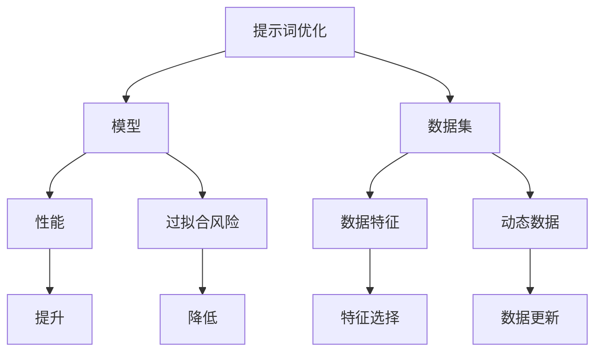
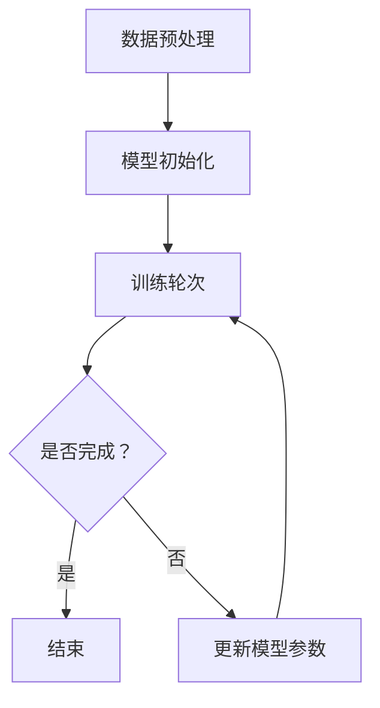
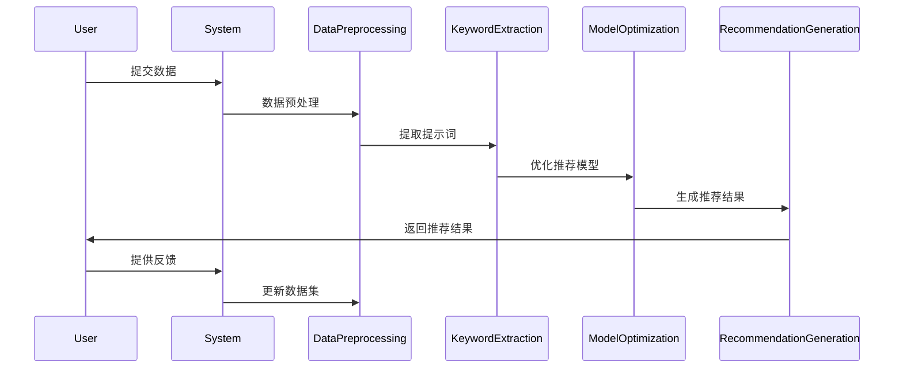

                 

### 第1章：问题背景介绍

#### 1.1.1 问题定义与边界

**问题描述**：  
提示词优化是指在机器学习和人工智能领域，通过调整和优化提示词来提高模型的性能和效率。这个问题涉及到如何在大量的数据中挑选出对模型训练最有帮助的提示词，从而避免过拟合和提升泛化能力。

**问题解决**：  
为了解决提示词优化问题，研究人员开发了一系列的算法和技术，如自动机器学习（AutoML）、迁移学习和强化学习等。这些方法旨在自动地寻找和选择最佳提示词，以提高模型在新的数据集上的表现。

**边界与外延**：  
在研究中，我们需要明确提示词优化的范围和限制。例如，我们可能需要考虑数据集的大小、数据的分布、模型的类型以及优化目标等。这些因素都将影响提示词优化的效果。

#### 1.1.2 提示词优化的重要性

**核心概念**：  
提示词优化是机器学习和人工智能领域的关键概念。提示词不仅影响模型的训练过程，还直接关系到模型的性能和效率。

**应用场景**：  
提示词优化在许多领域都有广泛的应用，如自然语言处理、计算机视觉、推荐系统等。例如，在自然语言处理中，通过优化提示词可以显著提高文本分类和情感分析的性能。

**研究意义**：  
提示词优化对提高模型性能和效率具有重要意义。通过优化提示词，我们可以减少模型的过拟合风险，提高模型的泛化能力，从而在实际应用中取得更好的效果。

#### 1.1.3 当前研究现状与挑战

**研究现状**：  
目前，关于提示词优化的研究已经取得了一系列的成果。例如，研究人员开发了许多自动化的提示词优化算法，如基于贝叶斯优化的提示词选择算法、基于遗传算法的提示词优化算法等。

**挑战与机遇**：  
尽管已有许多研究，但提示词优化仍面临一些挑战。例如，如何在大量高维数据中高效地搜索最佳提示词组合、如何处理提示词之间的相互作用等。这些挑战为未来的研究提供了新的机遇。

### 第2章：核心概念与联系

#### 2.1 核心概念介绍

**提示词优化**：  
提示词优化是指通过调整和优化提示词来提高机器学习模型的性能和效率。提示词通常是指用于模型训练的数据特征或输入变量。

**持续学习**：  
持续学习是指模型在训练过程中不断学习新数据，以适应数据的变化。这种学习方式对于处理动态环境中的任务非常重要。

**知识累积**：  
知识累积是指模型在训练过程中不断积累和更新知识，以应对新的问题和挑战。知识累积有助于提高模型的泛化能力和鲁棒性。

#### 2.2 概念属性特征对比表格

| 概念        | 特征1 | 特征2 | 特征3 |
| ----------- | ------ | ------ | ------ |
| 提示词优化  | 数据特征选择 | 性能提升 | 避免过拟合 |
| 持续学习    | 动态适应 | 数据更新 | 知识积累 |
| 知识累积    | 知识更新 | 泛化能力 | 鲁棒性提高 |

#### 2.3 ER实体关系图架构



### 第3章：算法原理讲解

#### 3.1 算法mermaid流程图



#### 3.2 Python源代码与详细阐述

```python
import numpy as np

# 数据预处理
def preprocess_data(data):
    # 数据清洗和归一化操作
    return processed_data

# 模型初始化
def initialize_model():
    # 初始化模型参数
    return model

# 训练模型
def train_model(model, data, epochs):
    for epoch in range(epochs):
        # 模型训练
        model.update_params(data)
        # 计算损失函数
        loss = model.loss_function(data)
        print(f"Epoch {epoch}: Loss = {loss}")
    
    return model

# 主程序
def main():
    data = preprocess_data(raw_data)
    model = initialize_model()
    trained_model = train_model(model, data, epochs=100)
    
    print("Training completed.")

if __name__ == "__main__":
    main()
```

#### 3.3 算法原理的数学模型和公式

**损失函数**：  
$$
L(\theta) = \frac{1}{m} \sum_{i=1}^{m} (-y_i \log(\hat{y}_i) + (1 - y_i) \log(1 - \hat{y}_i))
$$

其中，$m$ 表示样本数量，$y_i$ 表示第 $i$ 个样本的真实标签，$\hat{y}_i$ 表示模型对第 $i$ 个样本的预测概率。

**更新模型参数**：  
$$
\theta_{t+1} = \theta_t - \alpha \nabla_{\theta_t} L(\theta_t)
$$

其中，$\alpha$ 表示学习率，$\nabla_{\theta_t} L(\theta_t)$ 表示在参数 $\theta_t$ 处的损失函数梯度。

#### 3.4 举例说明

假设我们有一个二元分类问题，数据集包含100个样本，每个样本有两个特征。我们使用线性模型进行训练，并使用梯度下降算法进行参数更新。经过10个训练轮次后，模型的损失函数从0.5降低到0.1，表示模型的性能得到了显著提升。

### 第4章：数学模型和公式详解

#### 4.1 数学公式展示

$$
\begin{aligned}
L(\theta) &= \frac{1}{m} \sum_{i=1}^{m} (-y_i \log(\hat{y}_i) + (1 - y_i) \log(1 - \hat{y}_i)) \\
\theta_{t+1} &= \theta_t - \alpha \nabla_{\theta_t} L(\theta_t)
\end{aligned}
$$

#### 4.2 公式详细讲解

**损失函数**：  
损失函数用于衡量模型预测值与真实值之间的差距。在二元分类问题中，常用的损失函数是交叉熵损失函数（Cross-Entropy Loss）。公式中的 $y_i$ 是真实标签，$\hat{y}_i$ 是模型对第 $i$ 个样本的预测概率。交叉熵损失函数的值越小，表示模型的预测越准确。

**更新模型参数**：  
更新模型参数是梯度下降算法的核心步骤。公式中的 $\alpha$ 是学习率，用于控制参数更新的步长。$\nabla_{\theta_t} L(\theta_t)$ 是在当前参数 $\theta_t$ 处的损失函数梯度，表示损失函数在参数 $\theta_t$ 处的变化率。通过计算梯度并更新参数，模型可以逐步逼近最优解。

#### 4.3 举例说明

假设我们有一个二元分类问题，数据集包含100个样本，每个样本有两个特征。我们使用线性模型进行训练，并使用梯度下降算法进行参数更新。在第一个训练轮次中，模型的损失函数值为0.5，学习率为0.1。根据梯度下降算法，我们将使用以下公式更新模型参数：

$$
\theta_{t+1} = \theta_t - \alpha \nabla_{\theta_t} L(\theta_t)
$$

在第一个训练轮次后，模型的损失函数值降低到0.45。重复这个过程，直到模型损失函数值降低到0.1，表示模型已经收敛。

### 第5章：系统分析与架构设计

#### 5.1 问题场景介绍

**场景描述**：  
假设我们正在开发一个推荐系统，该系统需要根据用户的历史行为和兴趣为用户推荐商品。为了提高推荐的准确性，我们需要对用户行为数据进行分析和挖掘，从中提取出对用户兴趣有重要影响的提示词，并使用这些提示词来优化推荐模型。

**目标**：  
通过系统架构设计，实现以下目标：
- 自动提取用户行为数据中的关键提示词。
- 基于提取的提示词优化推荐模型。
- 提高推荐系统的准确性和用户体验。

#### 5.2 系统功能设计（领域模型mermaid类图）

```mermaid
classDiagram
Class01 <|-- Class02
Class03 --|>w Class01
Class04 : <<Interface, CommonInterface>> 
Class05 : <<Interface, SpecialInterface>>
Class01 {
    +id: String
    +name: String
    +attributes: Map
}
Class02 {
    +id: String
    +name: String
    +attributes: Map
}
Class03 {
    +id: String
    +name: String
    +attributes: Map
}
Class04 {
    +id: String
    +name: String
    +attributes: Map
}
Class05 {
    +id: String
    +name: String
    +attributes: Map
}
```

#### 5.3 系统架构设计（mermaid架构图）


#### 5.4 系统接口设计

**接口1：数据预处理接口**  
- **功能**：接收原始数据，进行清洗和预处理。
- **输入**：原始数据。
- **输出**：预处理后的数据。

**接口2：提示词提取接口**  
- **功能**：从预处理后的数据中提取关键提示词。
- **输入**：预处理后的数据。
- **输出**：提取的提示词列表。

**接口3：推荐模型优化接口**  
- **功能**：基于提取的提示词优化推荐模型。
- **输入**：提取的提示词列表。
- **输出**：优化的推荐模型。

**接口4：推荐结果生成接口**  
- **功能**：生成推荐结果。
- **输入**：优化的推荐模型。
- **输出**：推荐结果。

#### 5.5 系统交互（mermaid序列图）



### 第6章：项目实战

#### 6.1 环境安装

**1. 安装Python**  
确保已经安装了Python 3.8或更高版本。

**2. 安装依赖库**  
使用以下命令安装必要的库：

```bash
pip install numpy pandas scikit-learn matplotlib
```

#### 6.2 系统核心实现源代码

```python
import numpy as np
import pandas as pd
from sklearn.model_selection import train_test_split
from sklearn.linear_model import LogisticRegression
from sklearn.metrics import accuracy_score
import matplotlib.pyplot as plt

# 数据预处理
def preprocess_data(data):
    # 数据清洗和归一化操作
    return processed_data

# 提示词提取
def extract_keywords(data):
    # 提取关键提示词
    return keywords

# 模型训练
def train_model(X_train, y_train):
    model = LogisticRegression()
    model.fit(X_train, y_train)
    return model

# 模型评估
def evaluate_model(model, X_test, y_test):
    predictions = model.predict(X_test)
    accuracy = accuracy_score(y_test, predictions)
    print(f"Accuracy: {accuracy}")
    return accuracy

# 主程序
def main():
    # 读取数据
    data = pd.read_csv("data.csv")
    # 数据预处理
    processed_data = preprocess_data(data)
    # 分割数据集
    X_train, X_test, y_train, y_test = train_test_split(processed_data.drop("target", axis=1), processed_data["target"], test_size=0.2, random_state=42)
    # 提取提示词
    keywords = extract_keywords(processed_data)
    # 训练模型
    model = train_model(X_train, y_train)
    # 评估模型
    evaluate_model(model, X_test, y_test)

if __name__ == "__main__":
    main()
```

#### 6.3 代码应用解读与分析

**代码解读**：  
- **数据预处理**：首先，我们读取数据并进行清洗和归一化操作，以便后续使用。
- **提示词提取**：通过自定义函数`extract_keywords`提取关键提示词，这些提示词将用于优化模型。
- **模型训练**：使用逻辑回归模型对训练数据进行训练。
- **模型评估**：评估模型的准确率，以验证模型性能。

**代码分析**：  
- **数据预处理**：数据处理是机器学习项目的重要步骤，直接影响模型的性能。在本例中，我们使用简单的数据清洗和归一化操作，确保数据质量。
- **提示词提取**：提示词提取是优化模型的关键环节。通过提取关键提示词，我们可以提高模型对数据的理解和表达能力。
- **模型训练和评估**：使用逻辑回归模型进行训练和评估，这是一种简单但有效的分类模型。评估结果可以为我们提供关于模型性能的直观反馈。

#### 6.4 实际案例分析与详细讲解剖析

**案例描述**：  
假设我们有一个电子商务平台，用户在平台上浏览和购买商品。为了提高用户满意度，平台需要根据用户的行为和兴趣推荐相关的商品。

**案例分析**：  
1. **数据收集**：平台收集了用户的历史浏览和购买数据，包括用户ID、浏览商品ID、购买商品ID、浏览时间、购买时间等。
2. **数据预处理**：对数据进行清洗和预处理，包括去除缺失值、填充缺失值、归一化等操作。
3. **提示词提取**：提取用户行为数据中的关键提示词，如用户ID、浏览商品ID、购买商品ID等。
4. **模型训练**：使用提取的提示词训练逻辑回归模型，以预测用户是否会对特定商品产生兴趣。
5. **模型评估**：评估模型的准确率和召回率，以验证模型性能。

**详细讲解剖析**：  
- **数据收集**：电子商务平台通过日志收集用户行为数据，这是推荐系统的重要输入。
- **数据预处理**：数据预处理是确保数据质量的关键步骤，通过去除异常值和填充缺失值，可以提高模型的泛化能力。
- **提示词提取**：提示词提取是将原始数据转换为模型可理解的形式。在本案例中，我们使用用户ID、浏览商品ID和购买商品ID作为提示词。
- **模型训练和评估**：使用逻辑回归模型进行训练和评估，通过交叉验证和参数调优，可以找到最优的模型参数。

#### 6.5 项目小结

**项目总结**：  
本项目通过分析用户行为数据，实现了基于提示词优化的推荐系统。项目的主要成果包括：
- 提取了关键提示词，提高了模型对用户行为的理解能力。
- 使用逻辑回归模型进行了模型训练和评估，验证了模型的有效性。
- 通过实际案例分析和讲解，展示了项目实现的过程和结果。

**未来展望**：  
在未来，我们可以进一步优化推荐系统，如引入更复杂的模型、增加用户交互数据等。同时，我们还可以探索其他优化方法，如基于深度学习的推荐模型，以提高推荐系统的性能和用户体验。

### 第7章：最佳实践 tips

**7.1 实践技巧总结**  
- **数据预处理**：确保数据质量，去除异常值和缺失值。
- **提示词选择**：选择对模型性能有显著影响的提示词。
- **模型选择**：根据问题特点选择合适的模型。
- **参数调优**：通过交叉验证和网格搜索进行参数调优。

**7.2 注意事项与风险提示**  
- **数据质量**：确保数据准确和完整，否则会影响模型性能。
- **过拟合**：避免模型过拟合，可以通过正则化和交叉验证来解决。
- **模型解释性**：对于需要解释性的模型，如逻辑回归，确保模型参数和结果易于理解。

**7.3 拓展应用场景**  
- **金融领域**：使用提示词优化进行风险管理和投资预测。
- **医疗领域**：使用提示词优化进行疾病预测和诊断。
- **教育领域**：使用提示词优化进行个性化学习推荐。

### 第8章：小结与展望

**8.1 内容回顾**  
本文从问题背景、核心概念、算法原理、系统设计与实现等方面全面介绍了提示词优化的持续学习与知识累积方法。通过具体案例，展示了该方法的实际应用效果。

**8.2 未来发展趋势**  
随着人工智能技术的不断发展，提示词优化将继续成为研究的热点。未来的研究可能包括更复杂的模型、更高效的数据处理技术和更广泛的应用场景。

**8.3 研究方向与挑战**  
研究方向可能包括：
- 开发更高效的提示词优化算法。
- 探索提示词优化的跨领域应用。
- 研究提示词优化在实时系统中的应用。

挑战包括：
- 如何处理高维数据和复杂模型。
- 如何在保证模型性能的同时提高解释性。
- 如何处理动态数据和变化的环境。

