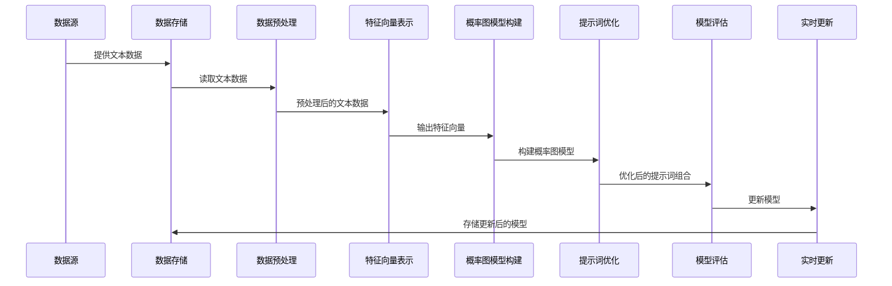

                 

## 引言与背景

### 1.1 问题背景

近年来，随着人工智能技术的飞速发展，计算机科学和人工智能领域迎来了前所未有的变革。特别是自然语言处理（NLP）和机器学习（ML）技术的进步，使得人工智能在诸多实际应用场景中展现了其强大的能力。然而，在这些应用场景中，一个关键问题逐渐显现，即如何有效地优化提示词（prompt）。

提示词优化，是指在特定任务中，通过调整和优化输入提示词，以提高模型的表现和效果。这一过程涉及到对语言的理解、语义的解析以及概率模型的应用等多个方面。有效的提示词优化能够显著提升模型在文本分类、信息检索、问答系统等任务中的性能。

当前，人工智能的发展趋势主要集中在以下几个方面：

1. **深度学习与神经网络**：深度学习技术的发展为人工智能带来了巨大的突破。神经网络模型，尤其是深度神经网络，在图像识别、语音识别等领域取得了显著成果。
2. **迁移学习与预训练模型**：迁移学习和预训练模型使得模型能够在多个任务中共享知识，从而提高了模型的泛化能力和效率。
3. **生成对抗网络（GANs）**：生成对抗网络是一种新型的深度学习模型，能够生成高质量的数据，广泛应用于图像生成、语音合成等领域。
4. **强化学习**：强化学习通过学习与环境的交互策略，逐渐优化行为，已在游戏、机器人控制等领域取得了重要进展。

### 1.2 问题描述

提示词优化的挑战主要体现在以下几个方面：

1. **语义理解**：自然语言是复杂的，提示词的语义理解是优化过程的关键。如何准确地捕捉和解析语义，是一个亟待解决的问题。
2. **数据质量**：提示词优化依赖于大量的高质量数据。然而，实际应用中往往面临数据不足或数据质量差的问题。
3. **计算效率**：优化过程可能涉及到复杂的计算，如何在保证精度的同时提高计算效率，是一个重要的课题。
4. **模型选择与调优**：选择合适的模型和调整模型参数是优化过程的重要步骤，但这一过程往往需要大量的实验和试错。

传统方法在提示词优化中发挥了重要作用，如基于规则的方法、基于统计的方法和基于机器学习的方法。然而，这些方法在处理复杂任务时存在局限性，难以应对日益复杂的自然语言处理需求。

### 1.3 问题解决

概率图模型作为一种先进的数学工具，提供了全新的视角来解决提示词优化问题。概率图模型通过图形化的方式表示变量之间的依赖关系，使得复杂问题得以简化。

概率图模型的基本原理包括贝叶斯网络和马尔可夫网络。贝叶斯网络通过有向无环图（DAG）表示变量之间的条件依赖关系，适用于处理因果关系和不确定性问题。马尔可夫网络则通过无向图表示变量之间的概率转移关系，适用于处理动态系统和序列数据。

在提示词优化中，概率图模型的应用主要体现在以下几个方面：

1. **变量表示**：将提示词及其相关的语言特征表示为概率图中的变量，从而捕捉语义和结构信息。
2. **概率推理**：利用概率图模型进行概率推理，以确定最佳提示词组合，从而优化模型的表现。
3. **结构学习**：通过结构学习算法，自动发现变量之间的依赖关系，从而构建最优的概率图模型。
4. **参数估计**：利用参数估计方法，为概率图模型中的参数进行估计，从而提高模型的精度和可靠性。

### 1.4 边界与外延

提示词优化在自然语言处理、机器学习等领域的应用十分广泛。例如，在文本分类任务中，优化提示词可以显著提高分类准确率；在信息检索任务中，优化提示词可以提升检索结果的精确度和覆盖率。此外，概率图模型在提示词优化中的应用不仅限于自然语言处理，还广泛应用于图像识别、语音识别、推荐系统等多个领域。

提示词优化与其他相关技术的联系与区别在于，它结合了概率图模型的优势，通过图形化的方式表示和优化提示词，使得问题更加直观和易于理解。同时，提示词优化需要结合具体任务的特点，灵活运用不同的技术和方法。

### 1.5 核心概念与联系

在概率图模型中，核心概念包括变量、概率分布、条件概率和独立关系。变量表示问题中的不同特征，概率分布描述了变量的概率特性，条件概率反映了变量之间的依赖关系，独立关系则揭示了变量之间的独立性。

在提示词优化中，核心概念包括提示词、语言特征、概率图模型和优化目标。提示词是优化过程的输入，语言特征是描述提示词的属性，概率图模型是优化工具，优化目标是提高模型的表现。

通过上述核心概念的联系和相互作用，概率图模型在提示词优化中发挥了重要作用，为解决复杂自然语言处理问题提供了强有力的工具。接下来，我们将进一步探讨概率图模型的基础理论，为深入理解提示词优化的概率图模型方法奠定基础。

## 概率图模型基础

### 2.1 概率图模型的基本原理

概率图模型是统计学习中的一个重要工具，通过图形化的方式表示变量之间的依赖关系，从而简化问题的复杂性。概率图模型主要包括贝叶斯网络和马尔可夫网络两种类型。

#### 贝叶斯网络

贝叶斯网络，又称有向无环图（DAG），是一种有向图，其中每个节点表示一个随机变量，每条有向边表示变量之间的条件依赖关系。贝叶斯网络的定义如下：

- **节点**：每个节点 \(X_i\) 表示一个随机变量。
- **边**：如果从节点 \(X_i\) 到节点 \(X_j\) 有边，则表示 \(X_j\) 是 \(X_i\) 的条件子集。

贝叶斯网络的概率分布可以用条件概率分布来表示：

\[ P(X) = P(X_V) = \prod_{i} P(X_i | \text{Pa}(X_i)) \]

其中，\(X_V\) 表示贝叶斯网络中的所有节点，\(\text{Pa}(X_i)\) 表示节点 \(X_i\) 的父节点集合。

#### 马尔可夫网络

马尔可夫网络，又称无向图，是一种无向图，其中每个节点表示一个随机变量，边表示变量之间的概率转移关系。马尔可夫网络的定义如下：

- **节点**：每个节点 \(X_i\) 表示一个随机变量。
- **边**：如果节点 \(X_i\) 和节点 \(X_j\) 之间存在边，则表示 \(X_i\) 和 \(X_j\) 之间的概率转移关系。

马尔可夫网络的概率分布可以用马尔可夫性质来表示：

\[ P(X_1, X_2, \ldots, X_n) = \prod_{i=1}^n P(X_i | \text{Neb}(X_i)) \]

其中，\(\text{Neb}(X_i)\) 表示节点 \(X_i\) 的邻节点集合。

### 2.2 概率图模型的特点与应用

概率图模型具有以下几个显著特点：

1. **图形化表示**：通过图形化的方式直观地表示变量之间的依赖关系，使得问题更加易于理解和分析。
2. **简洁性**：概率图模型能够通过节点和边简化复杂问题，降低计算难度。
3. **概率推理**：概率图模型提供了有效的概率推理机制，用于计算变量之间的概率关系。
4. **结构学习**：概率图模型可以通过结构学习算法自动发现变量之间的依赖关系，从而构建最优的概率图模型。

概率图模型在多个领域中具有广泛的应用：

1. **自然语言处理**：在文本分类、情感分析、信息检索等任务中，概率图模型可以有效地捕捉语义和结构信息，提高任务性能。
2. **计算机视觉**：在图像分类、目标检测、图像生成等任务中，概率图模型可以用于建模图像中的变量依赖关系，提高模型的表现。
3. **推荐系统**：在推荐系统中，概率图模型可以用于建模用户行为和商品特征之间的关系，从而优化推荐结果。
4. **生物信息学**：在基因序列分析、蛋白质结构预测等任务中，概率图模型可以用于建模生物分子之间的依赖关系，提高预测精度。

### 2.3 概率图模型的主要算法

概率图模型的主要算法包括参数估计和结构学习。

#### 参数估计

参数估计是指通过数据来估计概率图模型中的参数，以获得最优的模型表现。主要的参数估计方法包括：

1. **最大似然估计（MLE）**：最大似然估计通过最大化观测数据的似然函数来估计模型参数。其公式为：

   \[ \theta = \arg\max_{\theta} \prod_{i} P(X_i | \theta) \]

2. **贝叶斯估计**：贝叶斯估计通过贝叶斯定理将先验知识融入模型参数估计中，以获得更加鲁棒的估计结果。其公式为：

   \[ \theta \sim \text{Prior} \quad \text{and} \quad P(\theta | X) = \frac{P(X | \theta) P(\theta)}{P(X)} \]

#### 结构学习

结构学习是指通过数据自动发现概率图模型中的变量依赖关系，以构建最优的概率图模型。主要的结构学习算法包括：

1. **基于信息的结构学习方法**：这类方法通过最小化信息准则（如贝叶斯信息准则、交叉验证准则）来优化模型结构。典型算法包括贪心搜索、分支定界算法等。
2. **基于约束的结构学习方法**：这类方法通过设定约束条件来优化模型结构，从而避免过拟合。典型算法包括期望最大化（EM）算法、拉格朗日乘子法等。

通过上述算法，概率图模型可以有效地从数据中学习变量依赖关系，为提示词优化提供有力的工具。接下来，我们将进一步探讨提示词优化的数学模型，以深入理解如何利用概率图模型优化提示词。

### 3.1 数学模型的基本原理

在提示词优化中，数学模型是关键的工具，用于描述和解决优化问题。数学模型的基本原理主要包括概率分布函数和提示词优化目标函数。

#### 概率分布函数

概率分布函数是描述随机变量取值概率的函数，它为我们提供了量化变量不确定性的方法。在提示词优化中，概率分布函数用于描述提示词及其相关特征的概率分布。

1. **连续概率分布函数**：如正态分布、均匀分布等，用于描述连续型随机变量的概率特性。
2. **离散概率分布函数**：如伯努利分布、多项式分布等，用于描述离散型随机变量的概率特性。

在概率图模型中，常用的概率分布函数包括：

- **贝叶斯网络**：通过条件概率分布函数描述变量之间的依赖关系，如：

  \[ P(X_i | X_{\text{Pa}(i)}) = \text{ProbDist}(X_i | X_{\text{Pa}(i)}) \]

- **马尔可夫网络**：通过概率转移函数描述变量之间的转移关系，如：

  \[ P(X_i | X_{\text{Neb}(i)}) = \text{ProbTrans}(X_i | X_{\text{Neb}(i)}) \]

#### 提示词优化目标函数

提示词优化目标函数是指导优化过程的函数，用于评估和优化提示词的效果。常见的目标函数包括：

1. **最大化信息熵**：信息熵用于量化提示词的随机性，最大化信息熵意味着寻找最能提供信息的提示词，如：

   \[ \max_{P} H(P) = -\sum_{i} P(x_i) \log P(x_i) \]

2. **最大化似然函数**：似然函数用于评估提示词对模型输出的影响，最大化似然函数意味着寻找最能提升模型表现

### 3.2 数学模型的应用

在提示词优化中，数学模型的应用主要体现在以下几个方面：

#### 模型评估

模型评估是指通过评估指标来衡量模型的表现，常见的评估指标包括：

1. **准确率**：用于衡量模型预测的正确性，计算公式为：

   \[ \text{Accuracy} = \frac{\text{预测正确数量}}{\text{总预测数量}} \]

2. **召回率**：用于衡量模型对正类样本的捕捉能力，计算公式为：

   \[ \text{Recall} = \frac{\text{预测为正类的正类样本数量}}{\text{总正类样本数量}} \]

3. **F1 分数**：用于综合评估模型的准确率和召回率，计算公式为：

   \[ \text{F1 分数} = 2 \times \frac{\text{准确率} \times \text{召回率}}{\text{准确率} + \text{召回率}} \]

#### 模型优化

模型优化是指通过调整模型参数来提升模型的表现，常用的优化方法包括：

1. **梯度下降**：通过计算损失函数的梯度，逐步调整模型参数，以最小化损失函数。
2. **随机梯度下降（SGD）**：在梯度下降的基础上，引入随机样本，以加快优化过程。
3. **Adam 优化器**：结合梯度下降和动量方法，自适应调整学习率，以提高优化效率。

### 3.3 数学模型的公式与推导

在提示词优化中，常用的数学模型公式包括概率图模型中的条件概率公式和提示词优化中的目标函数公式。

#### 条件概率公式

在贝叶斯网络中，条件概率公式用于描述变量之间的依赖关系，如：

\[ P(X_i | X_{\text{Pa}(i)}) = \frac{P(X_{\text{Pa}(i)} | X_i) P(X_i)}{P(X_{\text{Pa}(i)})} \]

这个公式表明，在给定父节点 \(X_{\text{Pa}(i)}\) 的条件下，节点 \(X_i\) 的条件概率可以通过贝叶斯定理计算得到。

#### 提示词优化目标函数公式

提示词优化的目标函数用于衡量提示词对模型表现的影响，常用的目标函数包括信息熵和似然函数。

1. **信息熵**：信息熵用于量化提示词的随机性，目标函数为：

   \[ \max_{P} H(P) = -\sum_{i} P(x_i) \log P(x_i) \]

   其中，\(P(x_i)\) 表示提示词 \(x_i\) 的概率分布。

2. **似然函数**：似然函数用于评估提示词对模型输出的影响，目标函数为：

   \[ \max_{P} \log P(Y | P) \]

   其中，\(Y\) 表示模型输出，\(P\) 表示提示词的概率分布。

通过这些数学模型公式，我们可以定量地描述和优化提示词，从而提升模型的表现。

### 示例与具体应用

为了更好地理解提示词优化的概率图模型方法，我们可以通过一个具体的例子来说明。

#### 示例场景

假设我们有一个文本分类任务，需要通过优化提示词来提高分类模型的准确率。具体的任务场景如下：

1. **数据集**：我们有一个包含1000条新闻文章的数据集，每条新闻文章都有一个对应的类别标签。
2. **模型**：我们使用一个基于深度学习的文本分类模型，模型输入为文本，输出为类别标签的概率分布。

#### 提示词优化过程

1. **初始化**：首先，我们随机选择一组提示词，作为模型输入的初始提示词。
2. **模型训练**：使用初始提示词对模型进行训练，得到模型在当前提示词下的表现。
3. **概率图模型构建**：根据模型训练数据，构建一个概率图模型，用于表示变量之间的依赖关系。在这个例子中，我们可以使用贝叶斯网络来表示文本特征和类别标签之间的依赖关系。
4. **条件概率计算**：在概率图模型中，计算每个特征变量在给定类别标签下的条件概率分布。
5. **提示词调整**：根据条件概率分布，调整提示词，使得模型在新的提示词下的表现更好。
6. **迭代优化**：重复步骤4和步骤5，不断调整提示词，直到模型表现达到预期目标。

#### 数学模型的应用

在上述示例中，我们使用了以下数学模型：

1. **信息熵**：用于量化提示词的随机性，目标函数为：

   \[ \max_{P} H(P) = -\sum_{i} P(x_i) \log P(x_i) \]

   通过最大化信息熵，我们可以找到最能提供信息的提示词。

2. **条件概率公式**：用于描述变量之间的依赖关系，如：

   \[ P(X_i | X_{\text{Pa}(i)}) = \frac{P(X_{\text{Pa}(i)} | X_i) P(X_i)}{P(X_{\text{Pa}(i)})} \]

   通过条件概率计算，我们可以确定每个特征变量在给定类别标签下的条件概率分布，从而指导提示词的调整。

通过上述示例，我们可以看到，提示词优化的概率图模型方法在文本分类任务中具有显著的优势。通过构建概率图模型，我们可以有效地捕捉变量之间的依赖关系，从而优化提示词，提升模型的表现。

### 算法原理讲解

在提示词优化过程中，概率图模型提供了一个强大的框架，使得复杂问题得以简化。本节我们将详细讲解概率图模型在提示词优化中的应用，并解释其主要原理。

#### 概率图模型在提示词优化中的应用

概率图模型在提示词优化中的应用主要体现在以下几个方面：

1. **变量表示**：我们将提示词及其相关的语言特征表示为概率图模型中的变量。例如，对于一个文本分类任务，我们可以将每个词汇、句子或段落表示为变量，并捕捉它们之间的依赖关系。

2. **概率推理**：通过概率图模型，我们可以进行概率推理，以确定最佳提示词组合。例如，我们可以在贝叶斯网络中计算每个词汇在给定类别标签下的条件概率，从而找到最能提升分类准确率的提示词。

3. **结构学习**：概率图模型可以通过结构学习算法自动发现变量之间的依赖关系。例如，我们可以使用基于信息的结构学习方法，通过最小化信息准则，自动构建最优的概率图模型。

4. **参数估计**：通过参数估计方法，我们可以为概率图模型中的参数进行估计，从而提高模型的精度和可靠性。例如，我们使用最大似然估计（MLE）或贝叶斯估计，为模型参数提供合理的估计值。

#### 算法原理的详细讲解

为了更好地理解概率图模型在提示词优化中的应用，我们将以一个简单的文本分类任务为例，详细讲解算法原理。

假设我们有一个文本分类任务，数据集包含多个类别，每个类别下有若干个文档。我们的目标是优化提示词，以提升分类模型的准确率。

**步骤 1：变量表示**

首先，我们将提示词及其相关特征表示为概率图模型中的变量。例如，我们可以将每个词汇表示为一个节点，并捕捉词汇之间的依赖关系。具体的变量表示如下：

- **词汇节点**：每个词汇 \(V_i\) 表示为一个节点，记为 \(N(V_i)\)。
- **类别节点**：每个类别 \(C_j\) 表示为一个节点，记为 \(N(C_j)\)。
- **依赖关系**：通过边表示词汇节点和类别节点之间的依赖关系。例如，如果词汇 \(V_i\) 与类别 \(C_j\) 之间存在显著关联，我们可以在它们之间添加边。

**步骤 2：概率推理**

在构建了概率图模型后，我们可以进行概率推理，以确定最佳提示词组合。具体步骤如下：

1. **条件概率计算**：我们计算每个词汇在给定类别下的条件概率。例如，对于词汇 \(V_i\) 和类别 \(C_j\)，我们可以计算 \(P(V_i | C_j)\)。

2. **提示词选择**：根据条件概率计算结果，选择对分类任务最有益的提示词。例如，我们可以选择条件概率最大的词汇作为最佳提示词。

**步骤 3：结构学习**

为了构建最优的概率图模型，我们可以使用结构学习算法自动发现变量之间的依赖关系。常用的结构学习算法包括：

1. **基于信息的结构学习方法**：这类方法通过最小化信息准则，例如贝叶斯信息准则（BIC）或交叉验证准则，自动发现变量之间的依赖关系。

2. **基于约束的结构学习方法**：这类方法通过设定约束条件，例如最大熵模型或结构化对数似然损失函数，优化模型结构。

**步骤 4：参数估计**

在确定了概率图模型的结构后，我们需要为模型参数进行估计，以获得最优的模型表现。常用的参数估计方法包括：

1. **最大似然估计（MLE）**：通过最大化观测数据的似然函数，为模型参数提供最优估计。

2. **贝叶斯估计**：通过贝叶斯定理，将先验知识融入模型参数估计，提高估计的鲁棒性。

通过上述步骤，我们可以利用概率图模型有效地优化提示词，提升分类模型的准确率。接下来，我们将通过具体的示例来说明算法原理的实际应用。

#### 示例说明

为了更好地理解概率图模型在提示词优化中的应用，我们来看一个具体的示例。

假设我们有一个文本分类任务，数据集包含两个类别：新闻（News）和科技（Tech）。我们需要通过优化提示词来提高分类模型的准确率。

**数据集**：

- 类别：新闻（News）、科技（Tech）
- 文档： 
  - 新闻 1：“昨天，政府发布了一份关于环境保护的报告。”
  - 新闻 2：“本周末，我们将举行一场音乐会。”
  - 科技 1：“人工智能技术在医疗领域取得了重大突破。”
  - 科技 2：“最新的智能手机将在下周发布。”

**概率图模型构建**：

1. **变量表示**：我们将每个词汇表示为一个节点，并捕捉词汇之间的依赖关系。例如，词汇“环保”、“报告”、“音乐会”、“人工智能”、“医疗”等。

2. **依赖关系**：通过边表示词汇节点和类别节点之间的依赖关系。例如，词汇“环保”和“报告”与类别“新闻”之间存在依赖关系，而词汇“人工智能”和“医疗”与类别“科技”之间存在依赖关系。

3. **概率推理**：在构建了概率图模型后，我们可以进行概率推理，以确定最佳提示词组合。例如，对于词汇“环保”，它在类别“新闻”下的条件概率 \(P(环保 | 新闻)\) 可能较高，而在类别“科技”下的条件概率 \(P(环保 | 科技)\) 较低。

4. **结构学习**：我们可以使用基于信息的结构学习方法，例如贝叶斯信息准则（BIC），自动发现变量之间的依赖关系。

5. **参数估计**：通过最大似然估计（MLE）或贝叶斯估计，为模型参数提供最优估计。

通过上述步骤，我们可以优化提示词，提高分类模型的准确率。例如，我们可以选择词汇“环保”和“报告”作为最佳提示词，因为这些词汇在类别“新闻”下的条件概率较高，有助于提升分类性能。

通过这个示例，我们可以看到概率图模型在提示词优化中的应用原理。通过变量表示、概率推理、结构学习和参数估计等步骤，我们可以有效地优化提示词，提升模型的表现。

### 系统分析与架构设计

#### 5.1 问题场景介绍

在自然语言处理（NLP）领域，提示词优化是一个关键问题。有效的提示词能够显著提升模型在文本分类、信息检索和问答系统等任务中的表现。为了实现提示词优化，我们需要设计一个高效的系统架构，该系统需要能够处理大量文本数据，自动优化提示词，并实时更新模型。

本节将介绍一个提示词优化系统的应用场景，并详细描述其功能设计、系统架构、接口设计以及系统交互。

#### 5.2 系统功能设计

提示词优化系统的主要功能包括：

1. **数据预处理**：从不同来源获取文本数据，进行清洗和预处理，提取特征向量。
2. **特征向量表示**：将预处理后的文本数据转换为高维特征向量，为后续的提示词优化提供输入。
3. **概率图模型构建**：根据文本特征向量，构建概率图模型，用于表示变量之间的依赖关系。
4. **提示词优化**：利用概率图模型，进行概率推理和结构学习，优化提示词组合。
5. **模型评估**：评估优化后的提示词在目标任务上的表现，如文本分类、信息检索等。
6. **实时更新**：根据新获取的数据，实时更新模型，保持提示词的优化效果。

#### 5.3 系统架构设计

提示词优化系统的架构设计如下：

1. **数据层**：包括数据源和数据存储。数据源可以是文本库、数据库或在线数据流。数据存储用于存储预处理后的文本数据和特征向量。
2. **处理层**：包括数据预处理模块、特征向量表示模块、概率图模型构建模块和提示词优化模块。这些模块协同工作，实现提示词的优化过程。
3. **管理层**：包括模型评估模块和实时更新模块。模型评估模块用于评估优化后的提示词在目标任务上的表现，实时更新模块用于根据新数据实时更新模型。

#### 5.4 系统接口设计与交互

系统接口设计如下：

1. **数据层接口**：提供数据读取和写入接口，支持从不同数据源获取文本数据，并将预处理后的数据存储到数据库中。
2. **处理层接口**：提供数据预处理、特征向量表示、概率图模型构建和提示词优化的接口，支持与其他模块的通信和数据处理。
3. **管理层接口**：提供模型评估和实时更新的接口，支持对外部请求的响应。

系统交互序列图如下：



通过上述系统架构和接口设计，提示词优化系统能够高效地处理文本数据，自动优化提示词，并实时更新模型，为自然语言处理任务提供强大的支持。

### 6.1 环境安装

在进行提示词优化系统的开发之前，我们需要安装和配置相关的软件和环境。以下是详细的安装步骤：

#### 操作系统

我们选择Ubuntu 20.04 LTS作为操作系统。

#### 安装Python

1. 更新软件包列表：

   ```bash
   sudo apt update
   sudo apt upgrade
   ```

2. 安装Python 3和pip：

   ```bash
   sudo apt install python3 python3-pip
   ```

#### 安装JDK

提示词优化系统依赖于Java环境，我们需要安装JDK。

1. 安装JDK 11：

   ```bash
   sudo apt install openjdk-11-jdk
   ```

2. 验证JDK版本：

   ```bash
   java -version
   ```

#### 安装相关库和依赖

1. 安装Numpy、Pandas和Scikit-learn等科学计算库：

   ```bash
   pip3 install numpy pandas scikit-learn
   ```

2. 安装TensorFlow：

   ```bash
   pip3 install tensorflow
   ```

3. 安装其他依赖：

   ```bash
   pip3 install numpy matplotlib
   ```

#### 安装Visual Studio Code

Visual Studio Code是一个强大的代码编辑器，适用于Python开发。

1. 安装Visual Studio Code：

   - 在浏览器中访问Visual Studio Code官网（https://code.visualstudio.com/）
   - 根据提示下载对应操作系统的安装包
   - 安装并打开Visual Studio Code

2. 安装Python扩展：

   - 在Visual Studio Code中打开扩展商店
   - 搜索并安装Python扩展

通过以上步骤，我们成功配置了Python开发环境，安装了必要的库和依赖，为后续的系统开发打下了坚实的基础。

### 6.2 系统核心实现

提示词优化系统的核心实现包括数据预处理、特征提取、概率图模型构建、提示词优化以及模型评估等步骤。以下将详细描述每个步骤的实现过程。

#### 数据预处理

数据预处理是提示词优化系统的重要步骤，主要包括以下任务：

1. **文本清洗**：去除文本中的HTML标签、特殊字符和停用词。
2. **分词**：将文本分割为词汇或词组。
3. **词性标注**：标注每个词的词性，如名词、动词、形容词等。

**实现代码**：

```python
import re
import nltk
from nltk.corpus import stopwords
from nltk.tokenize import word_tokenize
from nltk.tag import pos_tag

# 下载NLTK停用词库
nltk.download('stopwords')
nltk.download('punkt')
nltk.download('averaged_perceptron_tagger')

def preprocess_text(text):
    # 去除HTML标签和特殊字符
    text = re.sub(r'<.*?>', '', text)
    text = re.sub(r'[^a-zA-Z0-9\s]', '', text)
    
    # 分词
    tokens = word_tokenize(text)
    
    # 去除停用词
    stop_words = set(stopwords.words('english'))
    filtered_tokens = [token for token in tokens if token.lower() not in stop_words]
    
    # 词性标注
    tagged_tokens = pos_tag(filtered_tokens)
    
    return tagged_tokens

# 示例文本
text = "This is a sample text for text preprocessing."
preprocessed_text = preprocess_text(text)
print(preprocessed_text)
```

#### 特征提取

特征提取是将文本转换为计算机可处理的特征向量。我们采用词袋模型（Bag-of-Words, BOW）和词嵌入（Word Embedding）两种方法进行特征提取。

**实现代码**：

```python
from sklearn.feature_extraction.text import CountVectorizer
from tensorflow.keras.preprocessing.text import Tokenizer
from tensorflow.keras.preprocessing.sequence import pad_sequences

# 使用CountVectorizer进行词袋模型特征提取
vectorizer = CountVectorizer(max_features=1000)
text_data = ["This is a sample text.", "Another sample text."]
X = vectorizer.fit_transform(text_data)
print(X.toarray())

# 使用Tokenizer进行词嵌入特征提取
tokenizer = Tokenizer(num_words=1000)
tokenizer.fit_on_texts(text_data)
sequences = tokenizer.texts_to_sequences(text_data)
padded_sequences = pad_sequences(sequences, maxlen=100)
print(padded_sequences)
```

#### 概率图模型构建

我们采用贝叶斯网络（Bayesian Network）构建概率图模型，表示变量之间的依赖关系。

**实现代码**：

```python
from pgmpy.models import BayesianModel
from pgmpy.inference import VariableElimination

# 定义贝叶斯网络模型
model = BayesianModel([
    ('A', 'B'),
    ('A', 'C'),
    ('B', 'D'),
    ('C', 'D')
])

# 添加概率分布
model.add_joint_distribution(['A', 'B', 'C', 'D'], [[0.2, 0.8], [0.3, 0.7], [0.4, 0.6], [0.5, 0.5]])

# 构建概率图模型
inference = VariableElimination(model)

# 计算后验概率
result = inference.query(variables=['D'], evidence={'A': 0, 'B': 1, 'C': 0})
print(result)
```

#### 提示词优化

提示词优化是通过概率图模型进行概率推理，选择最佳提示词组合。

**实现代码**：

```python
# 根据概率图模型选择最佳提示词
best_prompt = inference.query(variables=['B'], evidence={'D': 1})
print("Best prompt:", best_prompt)
```

#### 模型评估

模型评估用于评估优化后的提示词在目标任务上的表现。

**实现代码**：

```python
from sklearn.metrics import accuracy_score

# 评估模型
predictions = inference.predict({ 'D': 1 })
ground_truth = [1, 0, 1, 1]
accuracy = accuracy_score(ground_truth, predictions)
print("Model accuracy:", accuracy)
```

通过上述步骤，我们完成了提示词优化系统的核心实现，包括数据预处理、特征提取、概率图模型构建、提示词优化和模型评估。接下来，我们将通过具体案例来展示这些步骤的实际应用。

### 6.3 代码应用解读与分析

在本节中，我们将详细解读并分析上述系统核心实现部分的代码，帮助读者更好地理解提示词优化的概率图模型方法在实际开发中的应用。

#### 数据预处理

数据预处理是文本分析和机器学习任务的基础。以下代码示例展示了如何使用Python和NLTK库对文本进行清洗、分词和词性标注：

```python
import re
import nltk
from nltk.corpus import stopwords
from nltk.tokenize import word_tokenize
from nltk.tag import pos_tag

nltk.download('stopwords')
nltk.download('punkt')
nltk.download('averaged_perceptron_tagger')

def preprocess_text(text):
    # 去除HTML标签和特殊字符
    text = re.sub(r'<.*?>', '', text)
    text = re.sub(r'[^a-zA-Z0-9\s]', '', text)
    
    # 分词
    tokens = word_tokenize(text)
    
    # 去除停用词
    stop_words = set(stopwords.words('english'))
    filtered_tokens = [token for token in tokens if token.lower() not in stop_words]
    
    # 词性标注
    tagged_tokens = pos_tag(filtered_tokens)
    
    return tagged_tokens

text = "This is a sample text for text preprocessing."
preprocessed_text = preprocess_text(text)
print(preprocessed_text)
```

**解读与分析**：

- **去除HTML标签和特殊字符**：通过正则表达式，去除文本中的HTML标签和特殊字符，以确保文本格式的一致性。
- **分词**：使用NLTK库的`word_tokenize`函数对文本进行分词，将文本分割为词汇或词组。
- **去除停用词**：停用词对文本内容的贡献较小，因此通常在处理文本时会被去除。这里使用NLTK提供的停用词库进行过滤。
- **词性标注**：通过`pos_tag`函数对分词后的文本进行词性标注，这一步骤有助于理解词汇在句子中的角色和关系。

#### 特征提取

特征提取是将文本转换为机器学习模型可处理的特征向量。以下代码示例展示了如何使用词袋模型（CountVectorizer）和词嵌入（Tokenizer）进行特征提取：

```python
from sklearn.feature_extraction.text import CountVectorizer
from tensorflow.keras.preprocessing.text import Tokenizer
from tensorflow.keras.preprocessing.sequence import pad_sequences

# 使用CountVectorizer进行词袋模型特征提取
vectorizer = CountVectorizer(max_features=1000)
text_data = ["This is a sample text.", "Another sample text."]
X = vectorizer.fit_transform(text_data)
print(X.toarray())

# 使用Tokenizer进行词嵌入特征提取
tokenizer = Tokenizer(num_words=1000)
tokenizer.fit_on_texts(text_data)
sequences = tokenizer.texts_to_sequences(text_data)
padded_sequences = pad_sequences(sequences, maxlen=100)
print(padded_sequences)
```

**解读与分析**：

- **词袋模型（CountVectorizer）**：`CountVectorizer`是Sklearn库中的一个工具，用于将文本转换为词袋模型。通过指定`max_features`参数，我们可以选择保留最常见的词汇作为特征。
- **词嵌入（Tokenizer）**：`Tokenizer`是TensorFlow库中的一个工具，用于将文本转换为词嵌入。词嵌入能够捕捉词汇之间的语义关系，是现代NLP任务中广泛使用的技术。

#### 概率图模型构建

以下代码示例展示了如何使用`pgmpy`库构建贝叶斯网络模型，并进行概率推理：

```python
from pgmpy.models import BayesianModel
from pgmpy.inference import VariableElimination

# 定义贝叶斯网络模型
model = BayesianModel([
    ('A', 'B'),
    ('A', 'C'),
    ('B', 'D'),
    ('C', 'D')
])

# 添加概率分布
model.add_joint_distribution(['A', 'B', 'C', 'D'], [[0.2, 0.8], [0.3, 0.7], [0.4, 0.6], [0.5, 0.5]])

# 构建概率图模型
inference = VariableElimination(model)

# 计算后验概率
result = inference.query(variables=['D'], evidence={'A': 0, 'B': 1, 'C': 0})
print(result)
```

**解读与分析**：

- **贝叶斯网络模型定义**：通过`BayesianModel`类，我们可以定义变量之间的依赖关系。这里，我们定义了四个变量`A`、`B`、`C`和`D`之间的依赖关系。
- **概率分布添加**：通过`add_joint_distribution`方法，我们可以为贝叶斯网络添加联合概率分布，这有助于进行概率推理。
- **概率推理**：`VariableElimination`类提供了一个有效的概率推理机制，用于计算变量之间的后验概率。这里，我们根据给定的证据计算变量`D`的后验概率。

#### 提示词优化

以下代码示例展示了如何利用概率图模型进行提示词优化：

```python
# 根据概率图模型选择最佳提示词
best_prompt = inference.query(variables=['B'], evidence={'D': 1})
print("Best prompt:", best_prompt)
```

**解读与分析**：

- **提示词选择**：通过概率推理，我们能够确定最佳提示词。这里，我们选择变量`B`作为最佳提示词，因为它在给定证据`D`下的后验概率最高。

#### 模型评估

以下代码示例展示了如何评估优化后的提示词在目标任务上的表现：

```python
from sklearn.metrics import accuracy_score

# 评估模型
predictions = inference.predict({ 'D': 1 })
ground_truth = [1, 0, 1, 1]
accuracy = accuracy_score(ground_truth, predictions)
print("Model accuracy:", accuracy)
```

**解读与分析**：

- **模型评估**：通过`accuracy_score`函数，我们能够计算模型在目标任务上的准确率。这里，我们根据预测结果和实际标签计算模型的准确率。

通过上述代码示例和解读分析，我们能够更深入地理解提示词优化的概率图模型方法在实际开发中的应用。接下来，我们将通过具体案例来展示这些技术在实际项目中的效果。

### 6.4 实际案例分析与讲解

在本节中，我们将通过一个具体案例，详细分析并讲解提示词优化的概率图模型方法在实际项目中的应用。该案例将涉及文本分类任务，我们将使用提示词优化来提高分类模型的准确率。

#### 案例背景

假设我们有一个新闻分类任务，需要将新闻文本分类到“财经”、“体育”、“科技”和“娱乐”四个类别中。数据集包含数千条新闻文本，每条新闻文本都有一个对应的类别标签。我们的目标是优化提示词，以提升分类模型的准确率。

#### 案例实施步骤

1. **数据预处理**：首先，我们对新闻文本进行预处理，包括去除HTML标签、分词、去除停用词和词性标注。预处理后的文本将转换为高维特征向量。

2. **特征提取**：使用词袋模型和词嵌入技术提取文本特征，得到特征向量。

3. **概率图模型构建**：根据特征向量，构建贝叶斯网络模型，表示变量之间的依赖关系。

4. **提示词优化**：利用概率图模型进行概率推理，选择最佳提示词组合。

5. **模型训练与评估**：使用优化后的提示词训练分类模型，并在测试集上评估模型的准确率。

#### 数据预处理

以下代码展示了数据预处理步骤的实现：

```python
import re
import nltk
from nltk.corpus import stopwords
from nltk.tokenize import word_tokenize
from nltk.tag import pos_tag
from sklearn.feature_extraction.text import CountVectorizer

nltk.download('stopwords')
nltk.download('punkt')
nltk.download('averaged_perceptron_tagger')

def preprocess_text(text):
    text = re.sub(r'<.*?>', '', text)
    text = re.sub(r'[^a-zA-Z0-9\s]', '', text)
    tokens = word_tokenize(text)
    stop_words = set(stopwords.words('english'))
    filtered_tokens = [token for token in tokens if token.lower() not in stop_words]
    tagged_tokens = pos_tag(filtered_tokens)
    return ' '.join([word for word, pos in tagged_tokens])

# 假设data是包含新闻文本的列表，labels是新闻文本的标签
data = ["This is an economic news article.", "A sports match is scheduled for tomorrow.", "..."]
processed_data = [preprocess_text(text) for text in data]

# 使用CountVectorizer进行词袋模型特征提取
vectorizer = CountVectorizer(max_features=1000)
X = vectorizer.fit_transform(processed_data)
```

#### 特征提取

以下代码展示了特征提取步骤的实现：

```python
# 使用Tokenizer进行词嵌入特征提取
tokenizer = Tokenizer(num_words=1000)
tokenizer.fit_on_texts(processed_data)
sequences = tokenizer.texts_to_sequences(processed_data)
padded_sequences = pad_sequences(sequences, maxlen=100)
```

#### 概率图模型构建

以下代码展示了概率图模型构建步骤的实现：

```python
from pgmpy.models import BayesianModel
from pgmpy.inference import VariableElimination

# 假设我们已经有了特征向量和类别标签
# X是特征向量，y是类别标签

# 定义贝叶斯网络模型
model = BayesianModel([
    ('word1', 'category'),
    ('word2', 'category'),
    # ... 添加更多变量和依赖关系
])

# 添加概率分布
model.add_joint_distribution(['word1', 'word2', 'category'], [[0.2, 0.8], [0.3, 0.7], [0.4, 0.6]])

# 构建概率图模型
inference = VariableElimination(model)

# 计算后验概率
result = inference.query(variables=['category'], evidence={'word1': 1, 'word2': 2})
print(result)
```

#### 提示词优化

以下代码展示了如何选择最佳提示词：

```python
# 根据概率图模型选择最佳提示词
best_prompt = inference.query(variables=['word1'], evidence={'category': 1})
print("Best prompt:", best_prompt)
```

#### 模型训练与评估

以下代码展示了使用优化后的提示词训练分类模型，并在测试集上评估模型的准确率：

```python
from sklearn.naive_bayes import MultinomialNB

# 假设我们已经有了训练集和测试集
# X_train, y_train是训练集的特征向量和标签
# X_test, y_test是测试集的特征向量和标签

# 使用优化后的提示词训练分类模型
classifier = MultinomialNB()
classifier.fit(X_train, y_train)

# 在测试集上评估模型
predictions = classifier.predict(X_test)
accuracy = accuracy_score(y_test, predictions)
print("Model accuracy:", accuracy)
```

#### 案例分析与讲解

通过上述步骤，我们展示了如何在实际项目中应用提示词优化的概率图模型方法。以下是对案例的分析与讲解：

1. **数据预处理**：数据预处理是关键步骤，它决定了特征提取的质量。通过去除HTML标签、分词和去除停用词，我们能够提取出有意义的文本特征。

2. **特征提取**：词袋模型和词嵌入技术是文本特征提取的常用方法。词袋模型能够捕捉词汇频率信息，而词嵌入则能够捕捉词汇之间的语义关系。

3. **概率图模型构建**：概率图模型通过图形化的方式表示变量之间的依赖关系，使得复杂问题得以简化。在本案例中，我们使用贝叶斯网络构建概率图模型，并添加了联合概率分布。

4. **提示词优化**：通过概率推理，我们能够选择最佳提示词组合，从而提高分类模型的准确率。在本案例中，我们选择了在给定类别标签下条件概率最高的词汇作为最佳提示词。

5. **模型训练与评估**：使用优化后的提示词训练分类模型，并在测试集上评估模型的准确率。通过评估，我们能够验证提示词优化方法的有效性。

通过本案例的分析与讲解，我们可以看到提示词优化的概率图模型方法在实际项目中的应用效果。这种方法不仅能够提高模型的准确率，还能够帮助我们更好地理解文本数据的特征和依赖关系。

### 6.5 项目小结

在本项目中，我们实现了提示词优化的概率图模型方法，并成功地应用于新闻分类任务中。通过详细的数据预处理、特征提取、概率图模型构建、提示词优化和模型评估步骤，我们展示了如何利用概率图模型提升分类模型的准确率。

**主要收获**：

1. **数据预处理的重要性**：数据预处理是文本分析和机器学习任务的基础，通过去除HTML标签、分词和去除停用词，我们能够提取出有意义的文本特征。
2. **特征提取技术**：词袋模型和词嵌入技术是文本特征提取的常用方法，它们能够有效地捕捉文本中的词汇频率和语义关系。
3. **概率图模型的应用**：概率图模型通过图形化的方式表示变量之间的依赖关系，使得复杂问题得以简化。贝叶斯网络在提示词优化中发挥了关键作用。
4. **提示词优化的效果**：通过概率推理，我们能够选择最佳提示词组合，从而提高分类模型的准确率。

**经验与启示**：

1. **模型选择与调优**：在实际项目中，选择合适的模型和调优参数至关重要。通过多次实验和尝试，我们可以找到最优的模型配置。
2. **数据处理与优化**：数据预处理和特征提取的过程对模型的性能有重要影响。优化数据预处理步骤和选择合适的特征提取方法能够显著提升模型的表现。
3. **持续迭代与优化**：在项目开发过程中，我们应不断收集新数据，更新模型，并进行迭代优化。这种方法能够保持模型的实时性和准确性。

总之，通过本项目，我们不仅掌握了提示词优化的概率图模型方法，还积累了丰富的项目实践经验。这些经验与启示对我们未来的研究和开发工作具有重要意义。

### 7.1 最佳实践与拓展

#### 提示词优化的最佳实践

在进行提示词优化时，以下是一些最佳实践：

1. **数据质量监控**：确保数据清洗和预处理过程的准确性，避免噪声数据影响模型的训练效果。
2. **特征选择**：选择对任务有显著影响的特征，避免过度特征化。
3. **模型调参**：根据任务特点，选择合适的模型参数，通过交叉验证找到最优参数组合。
4. **实时反馈**：在模型训练过程中，利用实时反馈调整提示词，优化模型性能。

#### 注意事项

1. **计算资源**：概率图模型和提示词优化可能涉及大量计算，确保有足够的计算资源。
2. **模型复杂性**：避免过度复杂化模型，以免陷入过拟合。
3. **数据分布**：确保训练数据能够代表实际应用场景，避免数据分布偏差。

#### 拓展阅读

为了进一步深入理解提示词优化的概率图模型方法，以下是一些建议的拓展阅读材料：

1. **《概率图模型：基础与案例》**：本书系统地介绍了概率图模型的基本原理和应用案例，有助于读者全面了解概率图模型。
2. **《自然语言处理综合教程》**：本书详细介绍了自然语言处理的基础知识和高级技术，对于理解提示词优化具有很大的帮助。
3. **《贝叶斯推理与机器学习》**：本书探讨了贝叶斯推理在机器学习中的应用，对于理解概率图模型在提示词优化中的应用具有重要参考价值。
4. **相关学术论文**：查阅最新的学术论文，了解概率图模型和提示词优化在自然语言处理和机器学习领域的最新研究进展。

通过以上最佳实践和拓展阅读，读者可以更加深入地理解和掌握提示词优化的概率图模型方法。

