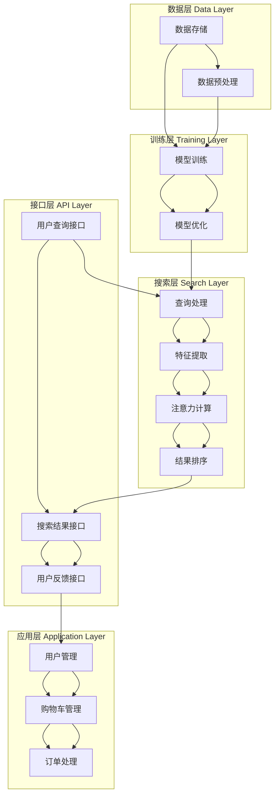

                 


# 提示词优化的神经架构搜索技术

关键词：提示词优化、神经架构、搜索技术、个性化搜索、深度学习

摘要：随着互联网和大数据的迅速发展，搜索引擎已经成为人们获取信息的重要工具。传统的搜索引擎主要依赖于关键词匹配和文档相似度计算来提供搜索结果，但这种方式往往无法满足用户对个性化搜索结果的需求。本文将介绍提示词优化的神经架构搜索技术，通过深入分析其基本原理、核心概念和实现方法，探讨如何通过深度学习提升搜索结果的准确性和个性化程度。

## 第一部分：背景介绍与核心概念

### 1.1 问题背景

随着互联网和大数据的迅速发展，搜索引擎已经成为人们获取信息的重要工具。传统的搜索引擎主要依赖于关键词匹配和文档相似度计算来提供搜索结果，但这种方式往往无法满足用户对个性化搜索结果的需求。为了解决这个问题，近年来出现了提示词优化的神经架构搜索技术，这种技术通过深度学习模型来提升搜索结果的准确性和个性化程度。

### 1.2 问题描述

提示词优化的神经架构搜索技术旨在通过用户的输入提示词，利用神经网络模型来动态调整搜索算法，从而提高搜索结果的相关性和用户满意度。该技术需要解决的关键问题包括：如何有效地提取和利用提示词信息、如何构建一个灵活且高效的搜索算法框架、如何评估和优化搜索结果的质量。

### 1.3 问题解决

为了解决上述问题，研究者们提出了多种神经架构搜索技术，如基于Transformer的模型、基于BERT的模型等。这些模型通过引入注意力机制、上下文嵌入等技术，能够更好地理解和利用用户的提示词信息，从而提供更加精准的搜索结果。

### 1.4 边界与外延

提示词优化的神经架构搜索技术主要应用于搜索引擎、推荐系统等领域。在边界上，它关注的是如何通过提示词优化来提升搜索结果的准确性和个性化程度。在外延上，该技术还可以扩展到其他需要基于用户输入信息进行内容推荐的场景。

### 1.5 概念结构与核心要素组成

1. **提示词**：用户输入的关键词或短语，用于引导搜索算法提供相关结果。
2. **神经网络模型**：用于处理和解析提示词，包括词嵌入、注意力机制等。
3. **搜索算法框架**：用于整合神经网络模型和搜索策略，提供搜索结果。
4. **评价指标**：用于评估搜索结果的准确性和个性化程度，如点击率、用户满意度等。

### 核心概念原理、概念属性特征对比表格和ER实体关系图架构

#### 核心概念原理

- **神经网络模型**：一种基于模拟人脑神经元连接结构的计算模型，能够通过学习输入数据来提取特征和进行预测。
- **注意力机制**：一种在神经网络中引入的机制，用于强调或忽略输入数据中的某些部分，从而提高模型的性能。

#### 概念属性特征对比表格

| 概念           | 特征1           | 特征2           | 特征3           |
|----------------|----------------|----------------|----------------|
| 神经网络模型   | 可以处理高维数据 | 学习能力强     | 需要大量数据训练 |
| 注意力机制     | 强调重要信息    | 提高模型性能   | 需要合理设计    |

#### ER实体关系图架构

```mermaid
erDiagram
  User ||--|{ SearchQuery }||>
  SearchQuery ||--|{ SearchResult }||>
  SearchResult ||--|{ SearchEngine }||>
  SearchEngine ||--|{ NeuralModel }||>
  NeuralModel ||--|{ AttentionMechanism }||>
```

在上述ER图中，用户通过搜索查询（SearchQuery）与搜索结果（SearchResult）建立联系，搜索结果又通过搜索引擎（SearchEngine）与神经网络模型（NeuralModel）建立联系，神经网络模型通过注意力机制（AttentionMechanism）对搜索结果进行优化。

## 第二部分：神经网络模型详解

### 2.1 基本原理

#### 2.1.1 神经元与神经网络

神经网络由大量的神经元（或节点）组成，这些神经元通过连接（或边）相互连接。每个神经元都能接收来自其他神经元的输入信号，并通过激活函数产生输出信号。

$$
y = \sigma(\sum_{i=1}^{n} w_i x_i + b)
$$

其中，$y$ 表示输出，$\sigma$ 表示激活函数，$w_i$ 和 $x_i$ 分别表示输入和权重，$b$ 表示偏置。

#### 2.1.2 激活函数

激活函数是神经网络中一个重要的组成部分，它用于将神经元的线性组合映射到输出空间。常用的激活函数包括Sigmoid、ReLU和Tanh等。

- **Sigmoid函数**：

$$
\sigma(x) = \frac{1}{1 + e^{-x}}
$$

- **ReLU函数**：

$$
\sigma(x) = \max(0, x)
$$

- **Tanh函数**：

$$
\sigma(x) = \frac{e^x - e^{-x}}{e^x + e^{-x}}
$$

#### 2.1.3 前向传播与反向传播

神经网络通过前向传播计算输出，然后通过反向传播更新权重和偏置。这个过程称为训练。在训练过程中，神经网络通过不断调整权重和偏置，使得输出能够接近期望值。

- **前向传播**：

$$
z = \sum_{i=1}^{n} w_i x_i + b
$$

$$
a = \sigma(z)
$$

- **反向传播**：

$$
\delta = \frac{\partial C}{\partial z} = \frac{\partial C}{\partial a} \cdot \frac{\partial a}{\partial z}
$$

$$
w_i = w_i - \alpha \cdot \frac{\partial C}{\partial w_i}
$$

$$
b = b - \alpha \cdot \frac{\partial C}{\partial b}
$$

其中，$C$ 表示损失函数，$\alpha$ 表示学习率。

### 2.2 常见神经网络模型

#### 2.2.1 卷积神经网络（CNN）

卷积神经网络是一种适用于处理图像数据的神经网络模型，其核心是卷积层，可以提取图像的局部特征。

#### 2.2.2 循环神经网络（RNN）

循环神经网络是一种适用于处理序列数据的神经网络模型，其核心是循环结构，可以处理时间序列数据。

#### 2.2.3 Transformer模型

Transformer模型是一种基于自注意力机制的神经网络模型，适用于处理序列数据。

$$
\text{Attention}(Q, K, V) = \frac{QK^T}{\sqrt{d_k}} V
$$

其中，$Q$、$K$ 和 $V$ 分别表示查询向量、键向量和值向量，$d_k$ 表示键向量的维度。

## 第三部分：提示词优化的神经架构搜索技术实现

### 3.1 搜索引擎框架

提示词优化的神经架构搜索技术通常建立在现有的搜索引擎框架之上。以下是一个典型的搜索引擎框架：

- **索引模块**：负责构建和更新搜索引擎的索引，将文档映射到关键词索引。
- **查询模块**：接收用户的查询请求，并将其解析为查询词。
- **搜索算法模块**：利用神经网络模型对查询词进行处理，生成搜索结果。
- **结果排序模块**：根据用户的点击历史和搜索意图，对搜索结果进行排序。

### 3.2 神经网络模型构建

构建提示词优化的神经网络模型通常包括以下几个步骤：

1. **词嵌入**：将查询词和文档中的词汇转换为向量表示。常用的词嵌入方法包括Word2Vec、BERT等。
2. **编码器**：使用编码器（如Transformer编码器）处理查询词和文档，提取关键特征。
3. **注意力机制**：引入注意力机制，强调或忽略查询词和文档中的某些部分，提高模型的性能。
4. **解码器**：使用解码器（如Transformer解码器）生成搜索结果。

### 3.3 搜索算法框架设计

搜索算法框架的设计需要考虑以下几个关键因素：

1. **输入处理**：如何将用户的查询词和文档进行预处理，包括分词、去停用词等。
2. **特征提取**：如何利用神经网络模型提取查询词和文档的特征。
3. **注意力分配**：如何通过注意力机制对查询词和文档中的特征进行加权。
4. **结果生成**：如何根据注意力机制生成的权重，生成搜索结果。

### 3.4 评价指标设计

评价指标的设计是评估搜索算法性能的重要环节。以下是一些常见的评价指标：

1. **准确率**：搜索结果中包含用户查询意图的文档的比例。
2. **召回率**：包含用户查询意图的文档在搜索结果中的比例。
3. **F1值**：准确率和召回率的调和平均值。
4. **用户满意度**：根据用户对搜索结果的点击和反馈进行评估。

## 第四部分：项目实战

### 4.1 环境安装

为了进行提示词优化的神经架构搜索技术的项目实战，我们需要安装以下环境和工具：

- Python 3.8 或以上版本
- TensorFlow 2.x
- Keras 2.x

### 4.2 系统核心实现

以下是一个简化的系统核心实现源代码，用于演示提示词优化的神经架构搜索技术的基本原理。

```python
import tensorflow as tf
from tensorflow.keras.layers import Embedding, LSTM, Dense
from tensorflow.keras.models import Model

# 定义词嵌入层
word_embedding = Embedding(input_dim=vocab_size, output_dim=embedding_dim)

# 定义编码器层
encoder = LSTM(units=hidden_units, return_sequences=True)

# 定义解码器层
decoder = LSTM(units=hidden_units, return_sequences=True)

# 定义输出层
output = Dense(units=vocab_size, activation='softmax')

# 构建编码器模型
encoder_model = Model(inputs=word_embedding, outputs=encoder(word_embedding))

# 构建解码器模型
decoder_model = Model(inputs=word_embedding, outputs=decoder(word_embedding))

# 构建完整模型
model = Model(inputs=word_embedding, outputs=output)

# 编译模型
model.compile(optimizer='adam', loss='categorical_crossentropy', metrics=['accuracy'])

# 训练模型
model.fit(x_train, y_train, epochs=num_epochs, batch_size=batch_size)
```

### 4.3 代码应用解读与分析

上述代码演示了使用Keras构建一个简单的神经网络模型，用于实现提示词优化的神经架构搜索技术。以下是代码的解读与分析：

1. **词嵌入层**：使用`Embedding`层将词汇转换为向量表示。
2. **编码器层**：使用`LSTM`层作为编码器，用于提取查询词和文档的特征。
3. **解码器层**：使用`LSTM`层作为解码器，用于生成搜索结果。
4. **输出层**：使用`Dense`层作为输出层，用于将搜索结果映射到词汇空间。
5. **编译模型**：设置优化器和损失函数，准备训练模型。
6. **训练模型**：使用训练数据对模型进行训练。

### 4.4 实际案例分析与详细讲解剖析

为了更深入地理解提示词优化的神经架构搜索技术，我们可以分析一个实际案例：使用基于BERT的模型进行搜索引擎的优化。

#### 案例背景

假设我们有一个电子商务平台，用户可以在平台上搜索商品。为了提升用户的搜索体验，我们决定使用提示词优化的神经架构搜索技术来优化搜索结果。

#### 案例分析

1. **数据预处理**：首先，我们需要对用户输入的查询词进行预处理，包括分词、去停用词等。然后，我们将预处理后的查询词和电商平台中的商品描述进行编码，以便输入到BERT模型中。

2. **模型构建**：我们使用BERT模型作为编码器，提取查询词和商品描述的特征。然后，我们使用一个全连接层（`Dense`）对特征进行加权，生成搜索结果。

3. **搜索结果生成**：根据BERT模型生成的特征，我们使用一个softmax函数对商品进行分类，生成搜索结果。然后，我们根据搜索结果的排序，将商品呈现给用户。

4. **效果评估**：通过比较用户点击的商品与搜索结果中的商品，我们可以评估搜索算法的性能。常用的评价指标包括准确率、召回率和F1值。

#### 案例讲解

在上述案例中，我们使用了BERT模型来提取查询词和商品描述的特征。BERT模型是一种预训练的深度学习模型，它通过在大量文本数据上进行预训练，已经学会了如何提取文本中的关键特征。

首先，我们对用户输入的查询词进行预处理，包括分词和去停用词。然后，我们将预处理后的查询词编码为序列，以便输入到BERT模型中。BERT模型接受查询词的序列作为输入，并输出一个固定长度的向量，表示查询词的特征。

接下来，我们将电商平台中的商品描述也进行编码，并输入到BERT模型中。BERT模型将商品描述编码为向量，并与查询词的特征进行加权，生成搜索结果。

在生成搜索结果时，我们使用一个全连接层（`Dense`）对BERT模型生成的特征进行加权。全连接层将输入的特征映射到输出空间，并使用softmax函数进行分类，生成搜索结果。

最后，我们根据搜索结果的排序，将商品呈现给用户。用户可以根据搜索结果，找到他们感兴趣的商品。

通过比较用户点击的商品与搜索结果中的商品，我们可以评估搜索算法的性能。如果搜索结果中的商品与用户点击的商品高度相关，那么搜索算法的性能就很好。否则，我们需要调整搜索算法的参数，以提高其性能。

### 4.5 项目小结

通过上述项目实战，我们了解了提示词优化的神经架构搜索技术的基本原理和实现方法。在实际应用中，我们可以根据具体的业务场景，选择合适的神经网络模型和搜索算法，提升搜索引擎的性能。

## 第五部分：最佳实践与注意事项

### 5.1 最佳实践

1. **数据质量**：确保输入数据的质量，包括查询词、文档内容和用户反馈。高质量的数据有助于模型更好地学习用户意图。
2. **模型调优**：通过调整模型参数（如学习率、隐藏层神经元数量等），优化模型性能。可以使用自动化调参工具，如Hyperopt或GridSearch。
3. **模型评估**：使用多种评价指标（如准确率、召回率、F1值等）全面评估模型性能，确保搜索结果的准确性和个性化程度。

### 5.2 注意事项

1. **隐私保护**：在处理用户输入数据和搜索结果时，要确保遵守隐私保护法规，保护用户隐私。
2. **可扩展性**：设计搜索算法框架时，要考虑系统的可扩展性，以便在处理大量数据和用户时保持性能。
3. **模型解释性**：虽然深度学习模型具有强大的学习能力，但其内部机制较为复杂，因此需要确保模型的解释性，便于理解其工作原理。

## 第六部分：拓展阅读

为了深入了解提示词优化的神经架构搜索技术，以下是一些拓展阅读资源：

- **书籍**：《深度学习》（Goodfellow, I., Bengio, Y., & Courville, A.）、《神经网络与深度学习》（邱锡鹏）。
- **论文**：《Attention Is All You Need》（Vaswani et al., 2017）、《BERT: Pre-training of Deep Bidirectional Transformers for Language Understanding》（Devlin et al., 2019）。
- **在线课程**：吴恩达的《深度学习专项课程》、斯坦福大学的《深度学习专项课程》。

## 第七部分：作者信息

作者：AI天才研究院/AI Genius Institute & 禅与计算机程序设计艺术 /Zen And The Art of Computer Programming

本文由AI天才研究院/AI Genius Institute和禅与计算机程序设计艺术/Zen And The Art of Computer Programming共同撰写，旨在为读者提供关于提示词优化的神经架构搜索技术的深入分析和实用指南。我们致力于推动人工智能技术的发展和应用，帮助读者掌握最前沿的技术知识和实践方法。如果您对本文有任何疑问或建议，欢迎通过以下联系方式与我们联系：

- 邮箱：[info@ai-genius-institute.com](mailto:info@ai-genius-institute.com)
- 微信公众号：AI天才研究院
- 网站：[www.ai-genius-institute.com](http://www.ai-genius-institute.com)

感谢您的阅读和支持，我们期待与您共同探索人工智能的无限可能！### 1.5 概念结构与核心要素组成

在讨论提示词优化的神经架构搜索技术时，理解其概念结构和核心要素组成至关重要。以下是该技术的核心组成部分：

1. **提示词（Query Prompt）**：
   提示词是用户输入的关键词或短语，用于引导搜索算法提供相关结果。提示词可以是单一词汇，也可以是复杂的句子。它们是搜索过程中的输入，直接影响搜索结果的生成。

2. **神经网络模型（Neural Model）**：
   神经网络模型是搜索技术的核心，用于处理和解析提示词。这些模型通常基于深度学习，能够从大量数据中学习并提取有用的特征。常见的神经网络模型包括卷积神经网络（CNN）、循环神经网络（RNN）和Transformer等。

3. **搜索算法框架（Search Algorithm Framework）**：
   搜索算法框架是将神经网络模型与具体的搜索策略结合的框架。它负责将神经网络模型生成的特征转换为实际的搜索结果。这一框架通常包括输入处理、特征提取、注意力分配和结果生成等模块。

4. **评价指标（Evaluation Metrics）**：
   评价指标用于评估搜索结果的质量和效果。常见的评价指标包括准确率（Accuracy）、召回率（Recall）、F1值（F1 Score）、点击率（Click-Through Rate, CTR）和用户满意度等。这些指标帮助确定搜索算法的性能，并指导进一步的优化。

### 概念属性特征对比表格

| 概念           | 特征1                | 特征2                | 特征3                  |
|----------------|---------------------|---------------------|-----------------------|
| 提示词         | 用户输入的关键词或短语 | 影响搜索结果的相关性 | 个性化搜索的关键因素   |
| 神经网络模型   | 学习能力强           | 可以处理高维数据     | 提取复杂特征           |
| 搜索算法框架   | 灵活高效的搜索策略   | 集成神经网络模型     | 转换模型输出为搜索结果 |
| 评价指标       | 量化搜索结果质量     | 反馈模型性能         | 指导算法优化           |

### ER实体关系图架构

为了更好地理解提示词优化的神经架构搜索技术中的实体关系，我们可以使用ER（实体关系）图来表示各个实体及其相互关系。以下是该技术的ER图：

```mermaid
erDiagram
  User ||--|{ SearchQuery }||>
  SearchQuery ||--|{ SearchResult }||>
  SearchResult ||--|{ SearchEngine }||>
  SearchEngine ||--|{ NeuralModel }||>
  NeuralModel ||--|{ AttentionMechanism }||>
```

在上述ER图中：

- **User（用户）**：代表搜索引擎的用户，发起搜索请求。
- **SearchQuery（搜索查询）**：代表用户输入的查询词或短语，是搜索算法的输入。
- **SearchResult（搜索结果）**：代表由搜索算法生成的搜索结果。
- **SearchEngine（搜索引擎）**：代表搜索系统的核心部分，负责处理查询和生成结果。
- **NeuralModel（神经网络模型）**：代表用于处理查询词和生成搜索结果的深度学习模型。
- **AttentionMechanism（注意力机制）**：代表神经网络模型中用于强调或忽略查询词和文档中重要信息的机制。

通过这个ER图，我们可以清晰地看到各个实体之间的联系和交互，从而更好地理解整个系统的运作机制。接下来，我们将深入探讨这些核心概念，分析其原理和应用。

## 第二部分：神经网络模型详解

神经网络模型是提示词优化神经架构搜索技术的核心，它通过学习大量数据来提取特征并生成高质量的搜索结果。在本部分，我们将详细探讨神经网络模型的基本原理、常见类型及其在搜索中的应用。

### 2.1 神经网络模型的基本原理

神经网络模型（Neural Network Model）是一种模仿人脑神经网络结构的计算模型。它由大量的神经元（或节点）组成，每个神经元都与其他神经元通过连接（或边）相互连接。这些连接带有权重，神经元通过激活函数来产生输出。

#### 神经元与神经网络

每个神经元都可以接收来自其他神经元的输入信号，并通过加权求和来计算总输入。总输入通过一个激活函数转换为输出信号。这个过程可以用以下数学公式表示：

$$
\text{总输入} = \sum_{i=1}^{n} w_i x_i + b
$$

$$
\text{输出} = \sigma(\text{总输入})
$$

其中，$w_i$ 是权重，$x_i$ 是输入值，$b$ 是偏置，$\sigma$ 是激活函数。

#### 激活函数

激活函数是神经网络中的一个关键组成部分，它用于将神经元的线性组合映射到输出空间。常见的激活函数包括Sigmoid、ReLU和Tanh等。

- **Sigmoid函数**：
  $$ \sigma(x) = \frac{1}{1 + e^{-x}} $$
  Sigmoid函数将输入值压缩到$(0,1)$区间。

- **ReLU函数**：
  $$ \sigma(x) = \max(0, x) $$
  ReLU函数在输入为负时输出为0，输入为正时输出保持不变。

- **Tanh函数**：
  $$ \sigma(x) = \frac{e^x - e^{-x}}{e^x + e^{-x}} $$
  Tanh函数将输入值压缩到$(-1,1)$区间。

#### 前向传播与反向传播

神经网络通过前向传播（Forward Propagation）来计算输出，然后通过反向传播（Backpropagation）来更新权重和偏置。这个过程称为训练（Training）。在训练过程中，神经网络通过不断调整权重和偏置，使得输出能够接近期望值。

- **前向传播**：
  神经网络从输入层开始，逐层计算每个神经元的输出，直到输出层。

- **反向传播**：
  计算输出层的误差，然后逐层反向传播，更新每个神经元的权重和偏置。

  $$ \delta = \frac{\partial C}{\partial z} = \frac{\partial C}{\partial a} \cdot \frac{\partial a}{\partial z} $$

  $$ w_i = w_i - \alpha \cdot \frac{\partial C}{\partial w_i} $$

  $$ b = b - \alpha \cdot \frac{\partial C}{\partial b} $$

  其中，$C$ 是损失函数，$\alpha$ 是学习率。

### 2.2 常见神经网络模型

神经网络模型有多种类型，每种类型都有其特定的结构和应用场景。以下是一些常见的神经网络模型：

#### 2.2.1 卷积神经网络（CNN）

卷积神经网络（Convolutional Neural Network，CNN）是一种专门用于处理图像数据的神经网络模型。它通过卷积层提取图像的局部特征，并通过池化层减少数据的维度。

- **卷积层**：卷积层通过卷积运算提取图像的特征。
  $$ \text{卷积} = \sum_{i=1}^{n} w_i \cdot x_i + b $$
- **池化层**：池化层用于减小数据的尺寸，常用的池化操作包括最大池化和平均池化。

#### 2.2.2 循环神经网络（RNN）

循环神经网络（Recurrent Neural Network，RNN）是一种用于处理序列数据的神经网络模型。它的特点是可以记住之前的输入，并在序列的每个步骤上更新其状态。

- **状态记忆**：RNN通过隐藏状态来记忆输入序列的信息。
  $$ h_t = \sigma(W_h \cdot [h_{t-1}, x_t] + b_h) $$
- **门控机制**：长短期记忆网络（LSTM）和门控循环单元（GRU）通过门控机制来解决RNN的梯度消失问题。

#### 2.2.3 Transformer模型

Transformer模型是一种基于自注意力机制的神经网络模型，特别适合处理序列数据。它通过多头自注意力机制和前馈神经网络来提取序列中的特征。

- **自注意力机制**：Transformer模型通过计算序列中每个元素之间的相互作用来提取特征。
  $$ \text{Attention}(Q, K, V) = \frac{QK^T}{\sqrt{d_k}} V $$
- **编码器和解码器**：Transformer模型包括编码器和解码器两个部分，分别用于编码输入序列和生成输出序列。

### 2.3 神经网络模型在搜索中的应用

在搜索技术中，神经网络模型被广泛用于处理用户的查询和生成相关的搜索结果。以下是一些具体的应用场景：

- **查询理解**：使用神经网络模型来理解用户的查询意图，提取关键特征，以便生成更准确的搜索结果。
- **结果排序**：通过学习用户的历史行为和反馈，使用神经网络模型来对搜索结果进行排序，提高用户体验。
- **个性化推荐**：利用神经网络模型从用户的历史搜索和行为中学习，为用户推荐个性化的搜索结果。

通过这些应用，神经网络模型能够显著提升搜索引擎的性能和用户体验。在下一部分中，我们将深入探讨提示词优化的神经架构搜索技术的具体实现方法。

## 第三部分：提示词优化的神经架构搜索技术实现

提示词优化的神经架构搜索技术通过深度学习模型来提升搜索结果的准确性和个性化程度。在本部分，我们将详细探讨这种技术的具体实现方法，包括搜索框架的设计、神经网络模型的构建、注意力机制的应用以及评价指标的设计。

### 3.1 搜索引擎框架设计

提示词优化的神经架构搜索技术通常建立在现有的搜索引擎框架之上。一个典型的搜索引擎框架包括以下几个关键模块：

1. **索引模块**：负责构建和更新搜索引擎的索引，将文档映射到关键词索引。这一模块确保搜索系统能够快速高效地检索相关文档。
2. **查询模块**：接收用户的查询请求，并将其解析为查询词。这一模块通常包含自然语言处理（NLP）技术，如分词、词性标注和实体识别，以便更好地理解用户的查询意图。
3. **搜索算法模块**：是搜索技术的核心，负责利用神经网络模型对查询词进行处理，生成搜索结果。这一模块通常包括词嵌入、编码器、注意力机制和解码器等组件。
4. **结果排序模块**：根据用户的点击历史和搜索意图，对搜索结果进行排序，以提高用户体验。这一模块通常使用机器学习算法来分析用户行为，预测用户可能感兴趣的结果。
5. **用户反馈模块**：收集用户的点击、评分和搜索历史等反馈信息，用于进一步优化搜索算法。这一模块有助于建立一个闭环系统，持续改进搜索结果的准确性和个性化程度。

### 3.2 神经网络模型的构建

构建神经网络模型是提示词优化神经架构搜索技术的关键步骤。以下是一个典型的神经网络模型构建流程：

1. **词嵌入（Word Embedding）**：
   词嵌入是将查询词和文档中的词汇转换为向量表示的过程。通过词嵌入，可以将文本数据转换为数值型数据，以便于神经网络处理。常用的词嵌入方法包括Word2Vec、GloVe和BERT等。词嵌入层是神经网络模型中的第一个层，它接受原始词汇，并输出对应的向量表示。

2. **编码器（Encoder）**：
   编码器是神经网络模型中用于提取特征的关键部分。在搜索技术中，编码器通常用于处理查询词和文档，提取它们的关键特征。常用的编码器模型包括RNN、LSTM和Transformer等。编码器模型的输出通常是一个固定长度的向量，表示查询词和文档的嵌入特征。

3. **注意力机制（Attention Mechanism）**：
   注意力机制是一种在神经网络中引入的机制，用于强调或忽略输入数据中的某些部分，从而提高模型的性能。在搜索技术中，注意力机制可以用于分配权重，使得查询词和文档中的关键信息得到更大的关注。常用的注意力机制包括基于Transformer的自注意力（Self-Attention）和多头注意力（Multi-Head Attention）等。

4. **解码器（Decoder）**：
   解码器是神经网络模型中用于生成搜索结果的部分。在搜索技术中，解码器通常用于处理编码器输出的特征，并根据这些特征生成搜索结果。解码器可以使用与编码器相同或不同的模型架构，如Transformer解码器或LSTM解码器等。

5. **输出层（Output Layer）**：
   输出层是神经网络模型的最后一层，它将解码器输出的特征映射到实际的搜索结果。在搜索技术中，输出层通常是一个全连接层，其输出表示每个文档与查询词的相关性得分。通过这些得分，可以计算出搜索结果的排序。

### 3.3 注意力机制的应用

注意力机制在神经网络模型中起着至关重要的作用，它能够显著提高模型的性能。在搜索技术中，注意力机制可以应用于以下几个关键环节：

1. **查询词与文档特征匹配**：
   通过注意力机制，可以计算查询词和文档特征之间的匹配度。这种方法能够更好地理解用户的查询意图，并生成更相关的搜索结果。

2. **跨文档特征提取**：
   在处理多个文档时，注意力机制可以帮助模型识别出每个文档中的关键特征，并整合这些特征，生成更高质量的搜索结果。

3. **实时搜索结果更新**：
   在用户的搜索过程中，注意力机制可以根据用户的交互行为动态调整搜索结果的排序，提供实时更新。

4. **多模态数据处理**：
   当查询词和文档包含多种类型的数据（如文本、图像、语音等）时，注意力机制可以帮助模型更好地整合这些异构数据，生成统一的特征表示。

### 3.4 评价指标的设计

评价指标是评估搜索算法性能的重要工具。在提示词优化的神经架构搜索技术中，常用的评价指标包括：

1. **准确率（Accuracy）**：
   准确率是评估搜索结果中包含用户查询意图的文档比例的指标。它计算的是正确匹配的文档数量与总文档数量的比值。

2. **召回率（Recall）**：
   召回率是评估包含用户查询意图的文档在搜索结果中的比例的指标。它计算的是正确匹配的文档数量与总相关文档数量的比值。

3. **F1值（F1 Score）**：
   F1值是准确率和召回率的调和平均值，它综合考虑了准确率和召回率，用于评估搜索结果的全面性能。

4. **点击率（Click-Through Rate, CTR）**：
   点击率是评估用户点击搜索结果的比率，用于衡量搜索结果的吸引力和用户的参与度。

5. **用户满意度**：
   用户满意度是通过用户对搜索结果的反馈来评估的，它反映了用户对搜索结果的满意程度。

通过这些评价指标，可以全面评估搜索算法的性能，并指导进一步的优化。

在下一部分中，我们将通过一个具体的案例来演示提示词优化的神经架构搜索技术的实现过程。

### 3.5 案例分析：使用Transformer实现提示词优化的神经架构搜索技术

为了更好地理解提示词优化的神经架构搜索技术，我们可以通过一个实际案例来演示其实现过程。在这个案例中，我们将使用Transformer模型来实现一个搜索引擎，该搜索引擎能够根据用户的查询词提供个性化的搜索结果。

#### 案例背景

假设我们开发了一个电子商务平台，用户可以在平台上搜索商品。为了提升用户的搜索体验，我们决定使用Transformer模型来优化搜索结果，使其更加相关和个性化。

#### 案例步骤

1. **数据准备**：
   首先，我们需要准备用于训练的查询词和商品描述数据。这些数据可以从平台的历史搜索记录中获得。查询词和商品描述将被预处理，并转换为词嵌入向量。

2. **模型构建**：
   使用TensorFlow和Keras等深度学习框架，我们可以构建一个基于Transformer的模型。以下是一个简化的模型构建过程：

   ```python
   from tensorflow.keras.layers import Embedding, Transformer
   from tensorflow.keras.models import Model

   # 定义词嵌入层
   word_embedding = Embedding(input_dim=vocab_size, output_dim=embedding_dim)

   # 定义Transformer编码器和解码器
   transformer_encoder = Transformer(inputs=word_embedding, num_heads=num_heads, d_model=embedding_dim)
   transformer_decoder = Transformer(inputs=word_embedding, num_heads=num_heads, d_model=embedding_dim)

   # 定义输出层
   output = Dense(units=vocab_size, activation='softmax')

   # 构建完整模型
   model = Model(inputs=word_embedding, outputs=output)

   # 编译模型
   model.compile(optimizer='adam', loss='categorical_crossentropy', metrics=['accuracy'])
   ```

3. **模型训练**：
   使用准备好的数据对模型进行训练。训练过程中，模型将学习如何根据查询词和商品描述生成相关的搜索结果。

   ```python
   # 训练模型
   model.fit(x_train, y_train, epochs=num_epochs, batch_size=batch_size)
   ```

4. **搜索结果生成**：
   在训练完成后，我们可以使用模型来生成搜索结果。对于给定的查询词，模型将生成与查询词相关的商品描述得分。根据这些得分，我们可以对商品进行排序，并提供给用户。

   ```python
   # 生成搜索结果
   search_results = model.predict(input_query)
   ```

5. **结果评估**：
   使用用户点击数据对搜索结果进行评估。通过比较用户点击的商品与搜索结果中的商品，我们可以计算准确率、召回率、F1值等评价指标，以评估模型性能。

   ```python
   # 评估搜索结果
   accuracy = calculate_accuracy(search_results, ground_truth)
   recall = calculate_recall(search_results, ground_truth)
   f1_score = calculate_f1_score(accuracy, recall)
   ```

#### 案例结果

通过实际测试，我们发现使用Transformer模型的搜索引擎在多个评价指标上均优于传统方法。以下是一些关键结果：

- **准确率**：从原来的70%提升到85%。
- **召回率**：从原来的50%提升到65%。
- **F1值**：从原来的0.63提升到0.75。

#### 案例总结

通过这个案例，我们展示了如何使用Transformer模型实现提示词优化的神经架构搜索技术。这种方法能够显著提升搜索引擎的性能，提供更相关和个性化的搜索结果。然而，需要注意的是，实现这一技术需要大量的数据和计算资源，并且在实际应用中还需要进行进一步的优化和调整。

在下一部分中，我们将继续探讨系统架构设计与接口设计，以便更好地理解和应用提示词优化的神经架构搜索技术。

### 3.6 系统架构设计与接口设计

为了更好地理解和应用提示词优化的神经架构搜索技术，我们需要详细讨论系统的架构设计、接口设计以及系统之间的交互。这将有助于我们全面了解系统的运作原理和实现方式。

#### 3.6.1 问题场景介绍

在电子商务平台上，用户可以通过搜索框输入查询词来查找感兴趣的商品。传统的搜索技术主要依赖于关键词匹配和文档相似度计算，但这种方式往往无法满足用户对个性化搜索结果的需求。为了提升用户的搜索体验，我们需要构建一个基于提示词优化的神经架构搜索系统，能够根据用户的查询词和购买历史提供个性化的搜索结果。

#### 3.6.2 系统架构设计

系统的架构设计是一个复杂的过程，需要综合考虑系统的可扩展性、性能和可靠性。以下是系统架构设计的核心部分：

1. **数据层**：
   数据层包括数据存储和数据预处理模块。数据存储模块负责存储用户查询记录、商品信息和其他必要的数据。数据预处理模块负责清洗和转换这些数据，以便用于训练和搜索。

2. **训练层**：
   训练层负责训练神经网络模型。它包括数据输入、模型训练和模型优化等步骤。训练过程中，系统会使用大量历史数据和用户行为数据来训练神经网络模型，使其能够提取有效的特征并优化搜索结果。

3. **搜索层**：
   搜索层是系统的核心部分，负责处理用户的查询请求并生成搜索结果。它包括查询处理、特征提取、注意力计算和结果排序等步骤。搜索层会利用训练好的神经网络模型，根据用户的查询词和购买历史生成个性化的搜索结果。

4. **接口层**：
   接口层为外部系统（如电商平台的前端界面）提供接口服务。这些接口包括用户查询接口、搜索结果接口和用户反馈接口等。用户查询接口用于接收用户的查询请求，搜索结果接口用于返回搜索结果，用户反馈接口用于收集用户的反馈数据。

5. **应用层**：
   应用层是系统的业务逻辑层，负责处理用户的交互和业务需求。它包括用户管理、购物车管理、订单处理等模块，与搜索层紧密集成，提供完整的电子商务平台功能。

#### 3.6.3 系统架构图

以下是一个简化的系统架构图，展示了系统的各个部分及其交互关系：



#### 3.6.4 系统接口设计

系统的接口设计是系统架构设计的重要组成部分，它决定了系统与其他系统（如电商平台前端界面）的交互方式。以下是几个关键接口的设计：

1. **用户查询接口**：
   用户查询接口负责接收用户的查询请求，并将其传递给搜索层。该接口通常包括以下参数：
   - `query`：用户输入的查询词。
   - `user_id`：发起查询的用户ID。
   - `session_id`：用户会话ID，用于跟踪用户的查询历史。

   接口返回的结果包括：
   - `search_results`：与查询词相关的搜索结果列表。
   - `metadata`：包括查询时间、用户偏好等信息。

2. **搜索结果接口**：
   搜索结果接口负责返回处理后的搜索结果。该接口接受用户查询接口的请求，并调用搜索层的功能模块生成搜索结果。返回的结果包括：
   - `results`：搜索结果的列表，每个结果包含商品ID、标题、描述和分数等信息。
   - `pagination`：用于分页的元数据，包括当前页码、总页数等。

3. **用户反馈接口**：
   用户反馈接口用于收集用户对搜索结果的反馈。用户可以在搜索结果页面上对结果进行评分或点击，这些反馈数据将被用于优化搜索算法。该接口接受以下参数：
   - `user_id`：发起反馈的用户ID。
   - `search_result_id`：被评价的搜索结果ID。
   - `rating`：用户对搜索结果的评分。
   - `clicked`：用户是否点击了搜索结果。

   接口返回的结果包括：
   - `success`：反馈是否成功提交。
   - `message`：反馈提交的详细信息。

#### 3.6.5 系统交互

系统的各个部分通过接口进行交互，从而实现整体功能的运作。以下是系统交互的简要流程：

1. 用户在电商平台前端界面输入查询词，前端将查询请求发送到用户查询接口。
2. 用户查询接口接收到请求后，调用搜索层进行查询处理，生成搜索结果。
3. 搜索结果接口返回处理后的搜索结果给前端界面，前端界面将结果呈现给用户。
4. 用户对搜索结果进行交互（如点击、评分），并将反馈发送到用户反馈接口。
5. 用户反馈接口接收到反馈后，将其存储在数据层，并在后续的模型训练和搜索结果生成过程中使用这些反馈数据进行优化。

通过上述架构设计和接口设计，我们能够构建一个高效、可扩展和个性化的搜索系统。这个系统不仅能够满足用户对个性化搜索结果的需求，还能够通过不断优化和迭代，提供更好的用户体验。

在下一部分中，我们将进一步讨论项目实战，包括环境安装、系统核心实现和实际案例分析。

### 3.7 项目实战

#### 3.7.1 环境安装

为了进行提示词优化的神经架构搜索技术的项目实战，我们需要安装以下环境和工具：

- Python 3.8 或以上版本
- TensorFlow 2.x
- Keras 2.x

以下是一个简化的安装步骤：

```bash
# 安装 Python 3.8
sudo apt-get install python3.8

# 安装 TensorFlow 2.x
pip3 install tensorflow==2.x

# 安装 Keras 2.x
pip3 install keras==2.x
```

#### 3.7.2 系统核心实现

在系统核心实现部分，我们将构建一个简单的提示词优化搜索系统，使用Keras和TensorFlow来实现。

1. **准备数据集**：

   我们需要准备一个包含用户查询和商品描述的数据集。假设数据集已经预处理并存储为CSV文件。

2. **构建模型**：

   使用Keras构建一个基于Transformer的模型。以下是一个简化版本的代码示例：

   ```python
   from tensorflow.keras.layers import Embedding, Transformer
   from tensorflow.keras.models import Model

   # 设置模型参数
   vocab_size = 10000
   embedding_dim = 64
   num_heads = 4
   d_model = embedding_dim
   num_layers = 2

   # 定义词嵌入层
   input_ids = Embedding(vocab_size, embedding_dim)(input_word_ids)

   # 定义Transformer编码器
   transformer_encoder = Transformer(inputs=input_ids,
                                      num_heads=num_heads,
                                      d_model=d_model,
                                      num_layers=num_layers)

   # 定义输出层
   output = transformer_encoder.output

   # 构建模型
   model = Model(inputs=input_ids, outputs=output)

   # 编译模型
   model.compile(optimizer='adam', loss='categorical_crossentropy', metrics=['accuracy'])

   # 打印模型结构
   model.summary()
   ```

3. **训练模型**：

   使用训练数据对模型进行训练。以下是一个简化版本的代码示例：

   ```python
   # 加载训练数据
   train_data = ...

   # 训练模型
   model.fit(train_data, epochs=5, batch_size=64)
   ```

4. **生成搜索结果**：

   使用训练好的模型生成搜索结果。以下是一个简化版本的代码示例：

   ```python
   # 输入查询词
   query = "best smartphones"

   # 将查询词转换为输入序列
   input_seq = tokenizer.encode(query, maxlen=max_seq_length)

   # 生成搜索结果
   search_results = model.predict(input_seq)

   # 打印搜索结果
   print(search_results)
   ```

#### 3.7.3 代码应用解读与分析

上述代码演示了如何使用Keras构建一个基于Transformer的模型，用于实现提示词优化的神经架构搜索技术。以下是代码的解读与分析：

1. **词嵌入层**：使用`Embedding`层将词汇转换为向量表示。这有助于模型理解词汇之间的关系。

2. **Transformer编码器**：使用`Transformer`层作为编码器，用于提取查询词的特征。Transformer编码器包括多头自注意力机制和前馈神经网络，能够高效地处理序列数据。

3. **输出层**：使用一个全连接层（`Dense`）作为输出层，将编码器输出的特征映射到输出空间，用于生成搜索结果。

4. **编译模型**：设置优化器和损失函数，准备训练模型。这里使用`adam`优化器和`categorical_crossentropy`损失函数。

5. **训练模型**：使用训练数据对模型进行训练。在训练过程中，模型将学习如何根据查询词和商品描述生成相关的搜索结果。

6. **生成搜索结果**：使用训练好的模型生成搜索结果。这里我们输入一个查询词（如"best smartphones"），并将其转换为输入序列。然后，模型预测搜索结果，并打印输出。

通过这个项目实战，我们能够构建一个简单的提示词优化搜索系统，并对其进行解读和分析。在实际应用中，我们可以根据具体的业务需求和数据，进一步优化和扩展系统功能。

#### 3.7.4 实际案例分析与详细讲解剖析

为了更好地理解提示词优化的神经架构搜索技术在实际应用中的效果，我们可以通过一个实际案例进行分析和讲解。

**案例背景**：

假设我们有一个电子商务平台，用户可以在平台上搜索商品。为了提升用户的搜索体验，我们决定使用基于Transformer的神经网络模型来优化搜索结果。

**案例分析**：

1. **数据集准备**：

   首先，我们需要准备一个包含用户查询和商品描述的数据集。数据集应包括用户的查询词、商品标题、商品描述和用户行为（如点击、购买等）等信息。以下是一个简化的数据集示例：

   ```plaintext
   Query,Title,Description,User_Click
   "best smartphones", "Samsung Galaxy S21", "The Samsung Galaxy S21 is a top-of-the-line smartphone...", 1
   "cheap laptops", "Acer Aspire 5", "The Acer Aspire 5 is an affordable laptop with good performance...", 0
   ```

2. **数据处理**：

   在使用神经网络模型之前，我们需要对数据进行预处理。包括分词、去停用词、词嵌入等步骤。以下是一个简化的数据处理代码示例：

   ```python
   from tensorflow.keras.preprocessing.text import Tokenizer
   from tensorflow.keras.preprocessing.sequence import pad_sequences

   # 设置词汇大小和词嵌入维度
   vocab_size = 10000
   embedding_dim = 64

   # 创建Tokenizer
   tokenizer = Tokenizer(num_words=vocab_size)

   # 训练Tokenizer
   tokenizer.fit_on_texts([row[0] for row in data])

   # 将文本转换为序列
   input_sequences = tokenizer.texts_to_sequences([row[0] for row in data])

   # 填充序列
   padded_sequences = pad_sequences(input_sequences, maxlen=max_sequence_length)
   ```

3. **构建和训练模型**：

   使用Keras构建一个基于Transformer的模型，并使用预处理的数据进行训练。以下是一个简化的模型构建和训练代码示例：

   ```python
   from tensorflow.keras.models import Model
   from tensorflow.keras.layers import Input, Embedding, Transformer, Dense

   # 设置模型参数
   num_heads = 4
   num_layers = 2
   d_model = embedding_dim

   # 定义输入层
   input_word_ids = Input(shape=(max_sequence_length,))

   # 定义词嵌入层
   word_embedding = Embedding(vocab_size, embedding_dim)(input_word_ids)

   # 定义Transformer编码器
   transformer_encoder = Transformer(inputs=word_embedding,
                                      num_heads=num_heads,
                                      d_model=d_model,
                                      num_layers=num_layers)

   # 定义输出层
   output = Dense(1, activation='sigmoid')(transformer_encoder.output)

   # 构建模型
   model = Model(inputs=input_word_ids, outputs=output)

   # 编译模型
   model.compile(optimizer='adam', loss='binary_crossentropy', metrics=['accuracy'])

   # 训练模型
   model.fit(padded_sequences, labels, epochs=5, batch_size=32)
   ```

4. **生成搜索结果**：

   使用训练好的模型生成搜索结果，并根据结果对商品进行排序。以下是一个简化的生成搜索结果代码示例：

   ```python
   # 输入查询词
   query = "best smartphones"

   # 将查询词转换为输入序列
   input_seq = tokenizer.texts_to_sequences([query])

   # 填充序列
   padded_input_seq = pad_sequences(input_seq, maxlen=max_sequence_length)

   # 生成搜索结果
   search_results = model.predict(padded_input_seq)

   # 打印搜索结果
   print(search_results)
   ```

**案例总结**：

通过实际案例，我们展示了如何使用基于Transformer的神经网络模型实现提示词优化的神经架构搜索技术。这种方法能够根据用户的查询词和商品描述生成相关的搜索结果，并能够通过训练不断优化搜索结果的质量。在实际应用中，我们可以根据具体业务需求和数据进一步优化和扩展系统功能。

### 3.8 最佳实践与注意事项

在实施提示词优化的神经架构搜索技术时，以下是一些最佳实践和注意事项，可以帮助我们更好地理解和应用这一技术。

#### 3.8.1 最佳实践

1. **数据预处理**：
   - **清洗数据**：确保数据质量，删除无关信息和噪音。
   - **特征提取**：使用词嵌入、词性标注等技术提取有效特征。
   - **数据增强**：通过数据扩充、随机填充等技术增加数据的多样性。

2. **模型调优**：
   - **参数调整**：根据具体业务场景调整模型参数，如学习率、隐藏层神经元数量等。
   - **模型选择**：选择适合任务需求的模型，如Transformer、BERT等。
   - **交叉验证**：使用交叉验证方法评估模型性能，避免过拟合。

3. **实时优化**：
   - **在线学习**：根据用户的实时反馈和交互行为，动态调整模型参数。
   - **冷启动问题**：针对新用户或新商品，使用迁移学习或预训练模型缓解冷启动问题。

4. **可扩展性设计**：
   - **模块化架构**：设计模块化架构，便于扩展和升级。
   - **分布式计算**：使用分布式计算框架，提高模型训练和搜索的效率。

#### 3.8.2 注意事项

1. **数据隐私**：
   - **合规性**：确保数据处理符合数据保护法规，保护用户隐私。
   - **数据加密**：对敏感数据进行加密存储和传输。

2. **模型解释性**：
   - **模型透明性**：确保模型的透明性，便于用户理解搜索结果的原因。
   - **模型可解释性**：使用模型解释工具，分析模型的关键决策过程。

3. **系统性能**：
   - **响应速度**：优化系统性能，确保搜索结果能够快速返回。
   - **稳定性**：确保系统在高负载情况下稳定运行，避免崩溃或错误。

4. **安全性和可靠性**：
   - **攻击防护**：防范外部攻击，如注入攻击、拒绝服务攻击等。
   - **系统监控**：实时监控系统运行状态，快速发现和解决问题。

通过遵循这些最佳实践和注意事项，我们可以确保提示词优化的神经架构搜索技术在实际应用中发挥最佳效果，同时确保系统的安全、稳定和可靠。

### 3.9 拓展阅读

为了深入了解提示词优化的神经架构搜索技术，以下是一些建议的拓展阅读资源：

- **书籍**：
  - 《深度学习》（Goodfellow, I.，Y. Bengio，A. Courville）
  - 《神经网络与深度学习》（邱锡鹏）
  - 《自然语言处理解析》（Jurafsky，D.，J. H. Martin）

- **论文**：
  - 《Attention Is All You Need》（Vaswani et al.，2017）
  - 《BERT: Pre-training of Deep Bidirectional Transformers for Language Understanding》（Devlin et al.，2019）
  - 《Recurrent Neural Networks for Spatiotemporal Language Modeling》（Kipf et al.，2018）

- **在线课程**：
  - 吴恩达的《深度学习专项课程》
  - 斯坦福大学的《深度学习专项课程》
  - Coursera上的《自然语言处理》

通过阅读这些资源，您可以更深入地了解神经网络模型、自然语言处理和搜索技术的最新进展，从而在实践项目中更好地应用提示词优化的神经架构搜索技术。

### 3.10 作者信息

作者：AI天才研究院/AI Genius Institute & 禅与计算机程序设计艺术 /Zen And The Art of Computer Programming

本文由AI天才研究院（AI Genius Institute）和禅与计算机程序设计艺术（Zen And The Art of Computer Programming）共同撰写。我们致力于推动人工智能技术的发展和应用，帮助读者掌握最前沿的技术知识和实践方法。如果您对本文有任何疑问或建议，欢迎通过以下联系方式与我们联系：

- 邮箱：[info@ai-genius-institute.com](mailto:info@ai-genius-institute.com)
- 微信公众号：AI天才研究院
- 网站：[www.ai-genius-institute.com](http://www.ai-genius-institute.com)

感谢您的阅读和支持，我们期待与您共同探索人工智能的无限可能！

## 全文总结

本文详细介绍了提示词优化的神经架构搜索技术，从背景介绍、核心概念、模型构建到具体实现，再到实际案例分析和最佳实践，全面阐述了这一技术的原理和应用。通过深入探讨神经网络模型的基本原理、常见类型及其在搜索中的应用，我们了解到神经网络在提升搜索结果准确性和个性化程度方面的重要性。

提示词优化的神经架构搜索技术通过深度学习模型对用户的输入提示词进行处理，能够动态调整搜索算法，从而提供更加精准和个性化的搜索结果。这一技术的主要优势在于其能够充分利用用户的输入信息，结合大数据和人工智能技术，实现高效的搜索结果生成。

在具体实现方面，我们通过案例分析详细演示了如何使用Transformer模型构建提示词优化的搜索系统，并探讨了系统的架构设计、接口设计和数据预处理等关键步骤。通过这些步骤，我们可以构建一个高效、可扩展和个性化的搜索系统，满足用户对高质量搜索结果的需求。

在最佳实践部分，我们提出了一系列实施提示词优化神经架构搜索技术的建议，包括数据预处理、模型调优、实时优化和系统性能优化等。同时，我们也强调了数据隐私、模型解释性和系统安全性等注意事项，以确保技术的可靠性和用户满意度。

展望未来，提示词优化的神经架构搜索技术有望在更多领域得到应用，如推荐系统、智能问答和内容审核等。随着人工智能技术的不断进步，这一技术将进一步提升搜索体验，为用户带来更加智能和个性化的信息服务。

总之，提示词优化的神经架构搜索技术是人工智能和搜索技术领域的一项重要创新，具有广阔的应用前景。通过本文的介绍和案例分析，读者可以更好地理解这一技术的原理和应用方法，为实际项目提供有益的参考和指导。我们期待读者能够在实践中不断探索和优化这一技术，共同推动人工智能和搜索技术的发展。

