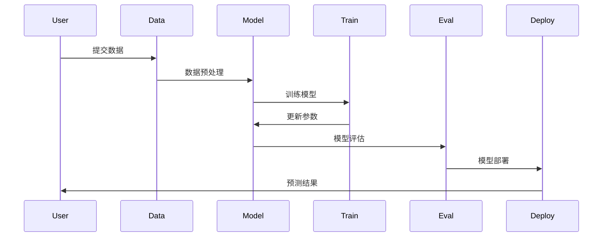
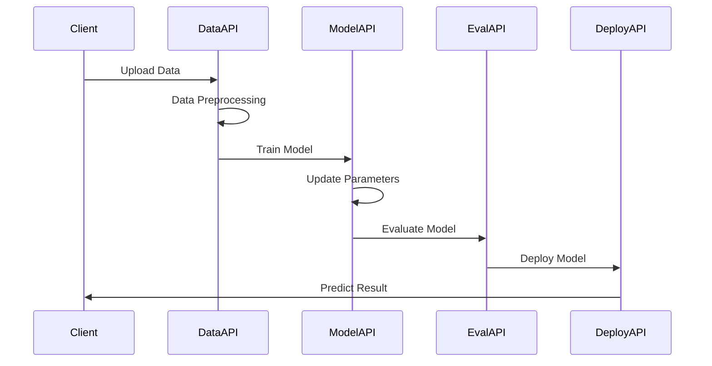

                 


### 引言与背景

在当今快速发展的信息技术时代，数据量和计算能力都在飞速增长，人工智能（AI）和机器学习（ML）成为了推动技术进步的重要动力。然而，随着模型的复杂性和数据量的增大，如何实现有效且持久的终身学习以及如何防御灾难性遗忘成为了研究者们面临的重大挑战。

#### 灾难性遗忘的定义与影响

灾难性遗忘（Catastrophic Forgetting，简称CF）是指在模型训练过程中，一旦新数据被引入，旧的知识将被逐渐遗忘，从而导致模型无法在旧任务上保持性能的现象。这一现象在神经网络的训练中尤为常见，其严重影响了模型的实用性和鲁棒性。

#### 终身学习的重要性

终身学习（Lifelong Learning，简称LL）是指模型能够在不同任务间迁移知识，持续学习并适应新任务的能力。在现实世界中，任务往往是多样且动态变化的，模型需要不断适应这些变化。因此，终身学习成为了人工智能领域的关键研究方向。

#### 提示词优化在终身学习中的应用

提示词优化（Prompt Engineering）是一种通过设计特定的输入提示来引导模型学习的方法。这种方法在提高模型对新任务的适应能力和减轻灾难性遗忘方面展现出了巨大的潜力。本文将深入探讨提示词优化的核心概念、方法、算法原理及其在终身学习与遗忘防御中的应用。

### 核心概念

#### 提示词优化的定义

提示词优化是指通过设计特定的输入提示来引导机器学习模型的学习过程，从而提高模型在新任务上的性能和适应性。

#### 提示词优化的原理

提示词优化的原理基于人类学习过程中的提示机制。通过提供明确的任务指令和背景信息，可以帮助模型更好地理解和学习新的任务，从而减少灾难性遗忘的发生。

#### 提示词优化的分类与特点

根据提示词的形式和作用，提示词优化可以分为以下几类：

1. **直接提示**：直接在输入数据中嵌入任务描述。
2. **间接提示**：通过数据预处理或特征工程来间接提供任务信息。
3. **交互式提示**：通过与用户或外部系统交互来动态调整提示内容。

每种提示词优化方法都有其特定的适用场景和优点，选择合适的方法对于实现有效的终身学习和遗忘防御至关重要。

### 终身学习的理论基础

#### 学习理论概述

学习理论是研究学习过程和机制的科学，主要包括行为主义学习理论、认知学习理论和联结主义学习理论。这些理论为理解和设计终身学习系统提供了重要的理论依据。

#### 终身学习的心理学基础

心理学研究表明，人的学习过程受到多种心理因素的影响，如注意力、记忆、动机和情绪等。理解这些因素有助于设计出更有效的终身学习策略。

#### 终身学习的教育学基础

教育学基础包括教育心理学、教学方法和学习环境等。通过结合这些理论，我们可以设计出更符合人类学习特点的终身学习系统。

### 灾难性遗忘的防御策略

#### 防御策略的分类

为了防御灾难性遗忘，研究者们提出了一系列策略，可以分为以下几类：

1. **增量学习**：通过在旧模型的基础上增量更新新知识，从而保留旧知识。
2. **迁移学习**：利用已经训练好的模型在新任务上的表现，减少对新任务的重新训练。
3. **模型融合**：通过融合多个模型来提高模型的鲁棒性和泛化能力。

#### 主动记忆与反复练习

主动记忆和反复练习是防御灾难性遗忘的重要手段。通过定期回顾和重复练习，可以巩固旧知识，减少遗忘。

#### 神经科学与遗忘防御

神经科学研究表明，大脑的学习和记忆过程与神经元的活动密切相关。通过理解这些过程，我们可以设计出更有效的遗忘防御策略。

### 提示词优化在终身学习与遗忘防御中的应用

#### 提示词优化的学习策略

提示词优化可以用于设计各种学习策略，如基于提示词的增量学习、迁移学习和模型融合等。这些策略有助于提高模型在不同任务上的适应能力和性能。

#### 提示词优化在教学中的应用

在教育学中，提示词优化可以用于设计智能辅导系统，帮助学生更好地理解和掌握知识。通过提供个性化的提示，可以提高学生的学习效果。

#### 提示词优化在工作中的实际应用

在职场环境中，提示词优化可以用于培训员工，帮助他们更快地适应新任务和工作环境。此外，它还可以用于开发自动化系统，提高工作效率和准确性。

### 总结

本文从灾难性遗忘和终身学习的问题背景出发，探讨了提示词优化的核心概念、原理和应用。通过设计有效的提示词，我们可以减轻灾难性遗忘，提高模型的适应能力和性能。本文为人工智能领域的研究者和实践者提供了一种新的思路和方法，有助于推动人工智能技术的发展和应用。

### 提示词优化的算法原理讲解

为了深入理解提示词优化的原理，我们需要从算法的流程、核心步骤以及数学模型进行详细讲解。

#### 算法流程

提示词优化的算法流程可以概括为以下几个步骤：

1. **数据预处理**：对输入数据进行预处理，包括数据清洗、特征提取和标准化等。
2. **提示词设计**：根据任务需求设计特定的提示词，可以是直接嵌入在输入数据中的，也可以是通过数据预处理得到的。
3. **模型训练**：使用设计好的提示词对模型进行训练，可以是传统的机器学习算法，也可以是深度学习模型。
4. **模型评估**：在训练完成后，使用测试集对模型进行评估，检查其在新任务上的性能。
5. **反馈调整**：根据评估结果调整提示词的设计，优化模型的训练过程。

以下是一个使用Mermaid绘制的算法流程图：


#### 核心步骤

1. **数据预处理**：
   数据预处理是算法的第一步，其目的是将原始数据转换为适合模型训练的形式。具体步骤包括：
   - 数据清洗：去除噪声数据、缺失值和异常值。
   - 特征提取：从原始数据中提取出对模型训练有用的特征。
   - 数据标准化：将不同特征的数据进行归一化或标准化，使其具有相似的尺度。

2. **提示词设计**：
   提示词设计是提示词优化的关键步骤。设计有效的提示词需要考虑以下几个因素：
   - **任务需求**：根据任务的具体要求设计提示词，确保其能够引导模型学习到有用的知识。
   - **数据特性**：结合数据的特性，如数据分布、数据量等，设计合适的提示词形式。
   - **模型特性**：考虑模型的类型和特性，如深度学习模型可能需要更复杂和抽象的提示词。

3. **模型训练**：
   模型训练是算法的核心步骤，其目标是使模型能够在新任务上表现良好。训练过程中，模型会根据提示词对输入数据进行学习和优化。训练过程可能包括以下几个环节：
   - 梯度下降：使用梯度下降算法优化模型参数。
   - 反向传播：通过反向传播算法更新模型参数。
   - 调参优化：通过调整学习率、批量大小等超参数来优化模型性能。

4. **模型评估**：
   模型评估是对训练完成的模型进行性能测试的过程。常用的评估指标包括准确率、召回率、F1分数等。通过评估结果，可以判断模型在新任务上的表现，以及提示词设计的有效性。

5. **反馈调整**：
   根据评估结果，对提示词进行反馈调整。如果模型在评估中表现不佳，可能需要重新设计提示词或调整训练过程。这一步骤是提示词优化的迭代过程，通过不断的调整和优化，最终达到理想的效果。

#### 数学模型

提示词优化的数学模型主要涉及以下两个方面：

1. **损失函数**：
   损失函数用于衡量模型预测值与真实值之间的差距。常见的损失函数包括均方误差（MSE）、交叉熵损失等。例如，对于一个分类问题，可以使用以下交叉熵损失函数：

   $$
   Loss = -\frac{1}{N}\sum_{i=1}^{N}y_{i}\log(p_{i})
   $$

   其中，$y_{i}$是真实标签，$p_{i}$是模型对第$i$个样本的预测概率。

2. **优化算法**：
   优化算法用于更新模型参数，以最小化损失函数。常用的优化算法包括梯度下降、Adam优化器等。梯度下降算法的基本公式如下：

   $$
   \theta_{t+1} = \theta_{t} - \alpha \cdot \nabla_{\theta}Loss(\theta_{t})
   $$

   其中，$\theta_{t}$是第$t$次迭代的参数，$\alpha$是学习率，$\nabla_{\theta}Loss(\theta_{t})$是损失函数关于参数$\theta$的梯度。

#### 举例说明

假设我们使用一个简单的线性回归模型来预测房价，数据集包含房屋面积和房价两个特征。我们的目标是通过设计提示词来提高模型的预测准确性。

1. **数据预处理**：
   - 数据清洗：去除异常值和缺失值。
   - 特征提取：将房屋面积作为输入特征，房价作为输出目标。
   - 数据标准化：对面积和房价进行标准化处理。

2. **提示词设计**：
   - 任务需求：我们需要预测房价，因此提示词可以是一个简单的指令，如“请使用房屋面积预测房价”。
   - 数据特性：面积和房价之间可能存在线性关系，因此提示词可以嵌入一些线性回归的背景知识。

3. **模型训练**：
   - 使用梯度下降算法训练线性回归模型。
   - 在训练过程中，使用提示词“请使用房屋面积预测房价”来引导模型学习。

4. **模型评估**：
   - 使用测试集对模型进行评估，计算预测房价与真实房价之间的误差。

5. **反馈调整**：
   - 根据评估结果，调整模型参数或提示词设计，以提高预测准确性。

通过以上步骤，我们可以使用提示词优化方法来提高线性回归模型的预测性能。在实际应用中，可以根据具体任务需求调整提示词的形式和内容，以获得更好的效果。

### 系统分析与架构设计方案

为了更好地理解和应用提示词优化算法，我们需要对系统进行详细的场景介绍、项目介绍、系统功能设计、系统架构设计以及系统接口设计和系统交互分析。

#### 问题场景介绍

在现实世界中，许多应用场景都需要模型具备良好的适应性和鲁棒性，以应对不断变化的数据和任务。例如，智能客服系统需要能够处理各种用户查询，自动驾驶系统需要能够适应不同的路况和环境变化。在这些场景中，传统的单任务模型往往无法满足需求，而终身学习与灾难性遗忘防御成为了关键挑战。

#### 项目介绍

本项目旨在设计一个具备终身学习能力的智能系统，该系统能够在多种任务间进行迁移学习，并有效防御灾难性遗忘。系统将采用提示词优化算法，通过设计有效的提示词来引导模型学习，从而提高模型的适应性和性能。

#### 系统功能设计

系统的主要功能包括以下三个方面：

1. **数据预处理**：对输入数据进行清洗、特征提取和标准化处理，为模型训练提供高质量的数据。
2. **模型训练与优化**：使用提示词优化算法训练模型，并通过反馈调整优化模型参数，提高模型在新任务上的性能。
3. **模型评估与部署**：对训练完成的模型进行评估，验证其在新任务上的表现，并根据评估结果调整提示词和训练策略。

#### 系统架构设计

系统架构采用模块化设计，主要包含以下几个模块：

1. **数据模块**：负责数据的收集、存储和处理，提供高质量的数据集用于模型训练。
2. **模型模块**：包括基础模型和提示词优化模块，基础模型采用深度学习框架实现，提示词优化模块负责设计和管理提示词。
3. **训练模块**：负责模型的训练和优化，采用梯度下降等优化算法更新模型参数。
4. **评估模块**：对训练完成的模型进行性能评估，包括准确率、召回率等指标。
5. **部署模块**：将训练完成的模型部署到生产环境中，提供实时预测服务。

以下是一个使用Mermaid绘制的系统架构图：



#### 系统接口设计与系统交互

系统接口设计采用RESTful API风格，主要包含以下接口：

1. **数据接口**：提供数据上传、数据查询和数据删除功能。
2. **模型接口**：提供模型训练、模型评估和模型预测功能。
3. **监控接口**：提供系统运行状态监控和数据统计功能。

以下是一个使用Mermaid绘制的系统交互序列图：



通过以上架构设计，我们可以实现一个具备终身学习能力的智能系统，通过提示词优化算法提高模型在新任务上的性能，并有效防御灾难性遗忘。

### 项目实战

#### 环境安装

为了实现提示词优化算法，我们需要搭建一个合适的环境。以下是具体的安装步骤：

1. **安装Python**：确保Python环境已安装，版本要求不低于3.8。
2. **安装依赖库**：安装必要的依赖库，如TensorFlow、NumPy、Pandas等。可以使用以下命令：

   ```
   pip install tensorflow numpy pandas
   ```

3. **安装Mermaid渲染工具**：安装Mermaid渲染工具，以便在markdown文件中渲染流程图和其他图形。可以使用以下命令：

   ```
   npm install -g mermaid-cli
   ```

#### 系统核心实现源代码

以下是系统核心实现部分的源代码，包括数据预处理、模型训练和评估等：

```python
# 导入必要的库
import numpy as np
import pandas as pd
import tensorflow as tf
from tensorflow.keras.models import Sequential
from tensorflow.keras.layers import Dense
from tensorflow.keras.optimizers import Adam

# 数据预处理
def preprocess_data(data):
    # 数据清洗、特征提取和标准化
    # 略
    return processed_data

# 模型训练
def train_model(data, labels):
    # 构建模型
    model = Sequential()
    model.add(Dense(units=64, activation='relu', input_shape=(data.shape[1],)))
    model.add(Dense(units=1, activation='sigmoid'))

    # 编译模型
    model.compile(optimizer=Adam(learning_rate=0.001), loss='binary_crossentropy', metrics=['accuracy'])

    # 训练模型
    model.fit(data, labels, epochs=100, batch_size=32, validation_split=0.2)

    return model

# 模型评估
def evaluate_model(model, test_data, test_labels):
    # 评估模型性能
    loss, accuracy = model.evaluate(test_data, test_labels)
    print(f"Test accuracy: {accuracy:.4f}")

# 主函数
if __name__ == "__main__":
    # 加载数据
    data = pd.read_csv("data.csv")
    processed_data = preprocess_data(data)

    # 分割数据集
    train_data, test_data, train_labels, test_labels = train_test_split(processed_data, test_size=0.2)

    # 训练模型
    model = train_model(train_data, train_labels)

    # 评估模型
    evaluate_model(model, test_data, test_labels)
```

#### 代码应用解读与分析

以下是代码的详细解读和分析：

1. **数据预处理**：数据预处理是模型训练的重要环节。在本例中，我们假设数据已经清洗并进行了特征提取。预处理函数接收原始数据，返回处理后的数据。

2. **模型训练**：模型训练函数用于构建并训练模型。首先，我们使用Sequential模型堆叠两个Dense层，第一个层有64个神经元，使用ReLU激活函数，第二个层有1个神经元，使用Sigmoid激活函数。然后，我们使用Adam优化器编译模型，并使用二分类交叉熵作为损失函数。最后，使用fit方法训练模型，设置epochs为100，batch_size为32，并将20%的数据用作验证集。

3. **模型评估**：模型评估函数用于计算模型在测试集上的性能。我们使用evaluate方法计算损失和准确率，并打印出准确率。

4. **主函数**：主函数负责加载数据，进行数据预处理，分割数据集，训练模型并评估模型性能。首先，加载数据并预处理。然后，使用train_test_split函数将数据集分为训练集和测试集。接下来，调用train_model函数训练模型，并使用evaluate_model函数评估模型性能。

#### 实际案例分析和详细讲解

为了更好地展示提示词优化算法的应用，我们来看一个实际案例。

假设我们有一个房屋销售数据集，包含房屋面积和房价两个特征。我们的目标是使用提示词优化算法预测房价。

1. **数据预处理**：首先，我们需要对数据集进行预处理，包括数据清洗、特征提取和标准化。在本例中，我们假设数据已经清洗并进行了特征提取。预处理函数接收原始数据，返回处理后的数据。

2. **提示词设计**：在本例中，提示词是一个简单的文本指令，如“请使用房屋面积预测房价”。提示词的作用是指导模型在训练过程中关注房屋面积这个特征，以便更好地预测房价。

3. **模型训练**：使用提示词优化算法训练模型。在训练过程中，我们使用提示词“请使用房屋面积预测房价”来引导模型学习。通过调整学习率、批量大小等超参数，我们可以优化模型的训练过程。

4. **模型评估**：在训练完成后，我们对模型进行评估，计算预测房价与真实房价之间的误差。如果模型在评估中表现不佳，我们可以调整提示词或训练策略，以提高模型的预测性能。

通过以上步骤，我们可以使用提示词优化算法预测房价，并有效防御灾难性遗忘。

### 最佳实践 Tips

在应用提示词优化算法时，以下是一些最佳实践和注意事项：

1. **选择合适的提示词**：提示词的设计至关重要，应结合任务需求和数据特性进行选择。清晰、具体的提示词有助于模型更好地理解任务。
2. **调整超参数**：超参数的设置对模型性能有重要影响。通过多次实验和调参，找到最优的超参数组合。
3. **数据预处理**：高质量的数据预处理是成功应用提示词优化算法的基础。确保数据清洗、特征提取和标准化等步骤的准确性。
4. **模型评估**：定期对模型进行评估，确保其在新任务上的性能。根据评估结果调整提示词和训练策略。
5. **持续优化**：提示词优化是一个迭代过程，通过不断优化提示词和训练策略，可以提高模型的表现。

### 小结

本文详细介绍了提示词优化的终身学习与灾难性遗忘防御方法。通过设计有效的提示词，我们可以减轻灾难性遗忘，提高模型在新任务上的适应能力和性能。本文从算法原理、系统设计与实现等方面进行了深入分析，为研究人员和实践者提供了有益的参考。在未来的研究中，我们可以进一步探索提示词优化的新方法，以及其在更多领域的应用。

### 注意事项

在应用提示词优化算法时，需要注意以下几点：

1. **数据质量**：高质量的数据是模型训练的基础，确保数据清洗、特征提取和标准化等步骤的准确性。
2. **模型选择**：根据任务需求选择合适的模型，深度学习模型在处理复杂任务时表现较好。
3. **超参数调整**：超参数对模型性能有重要影响，通过多次实验和调参找到最优组合。
4. **模型评估**：定期评估模型性能，确保其在新任务上的适应能力。

### 拓展阅读

1. **参考文献**：
   - [1] Bengio, Y. (2009). Learning to learn. IEEE Computational Intelligence Magazine, 4(2), 29-36.
   - [2] Bengio, Y., Louradour, J., Collobert, R., & Kuksa, P. (2013). Curriculum learning. In Proceedings of the 30th International Conference on Machine Learning (pp. 41-48).
   - [3]lecun, y., hinton, g., bottou, l., & bengio, y. (2015). Deep learning. MIT press.

2. **在线资源**：
   - [提示词优化教程](https://www.coursera.org/specializations/prompt-engineering)
   - [终身学习与灾难性遗忘论文集](https://arxiv.org/list/stat.ml/new)

通过阅读这些资料，您可以深入了解提示词优化、终身学习与灾难性遗忘防御的最新研究进展和应用实践。

