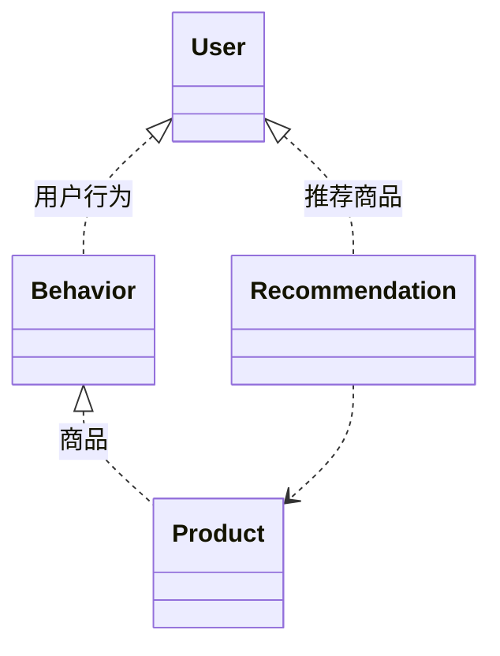
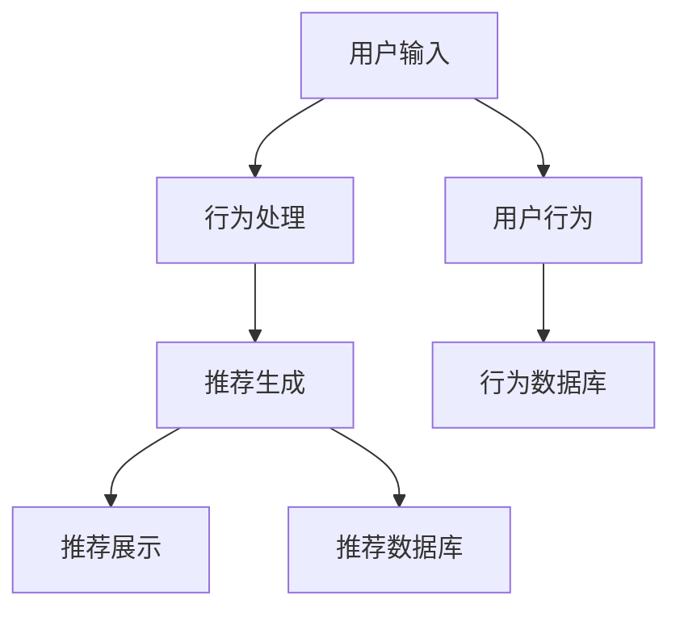
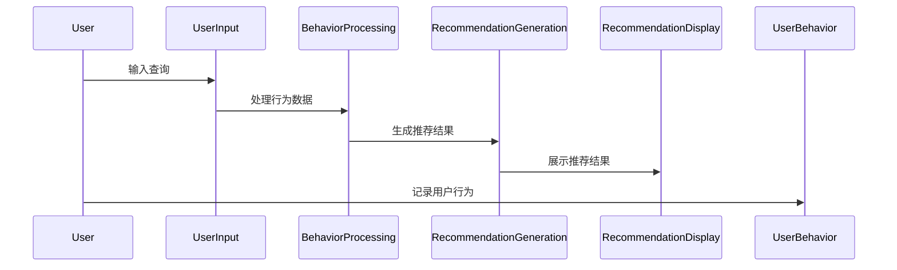
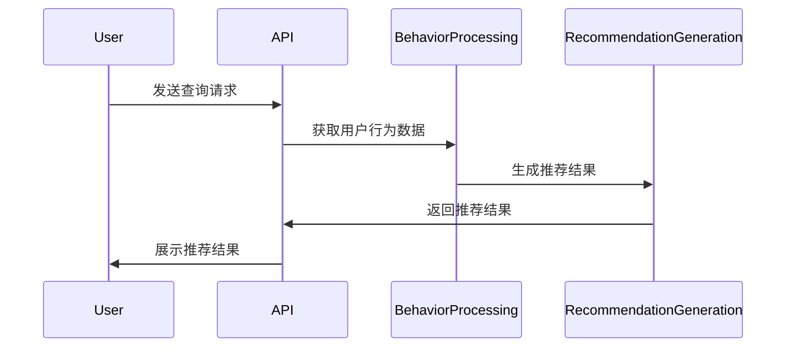
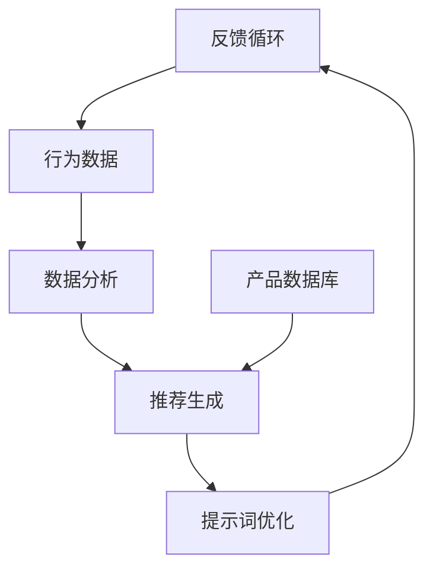
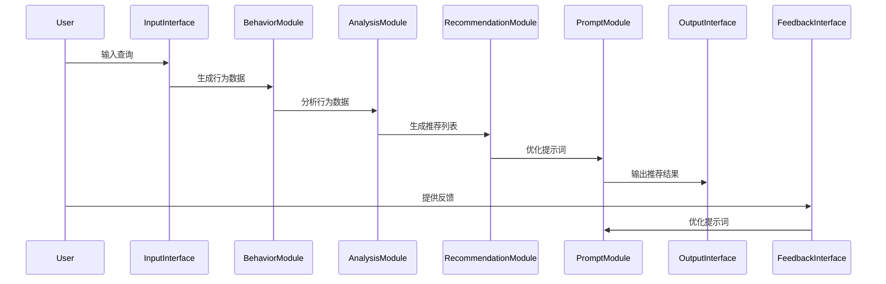
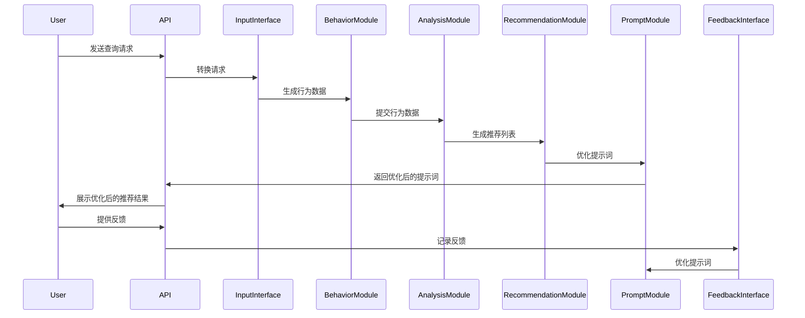

                 


# 提示词优化的自动化与智能推荐

关键词：提示词优化、自动化、智能推荐、算法、系统架构

摘要：本文将探讨提示词优化的自动化与智能推荐技术，分析其核心概念、算法原理、系统架构及项目实战，为读者提供实用的技术指南和最佳实践。

## 第1章：背景与概述

### 1.1 问题背景

在当今信息爆炸的时代，自动化和智能推荐系统在各行各业中得到了广泛应用。从电商平台的个性化推荐，到新闻资讯的智能推送，再到社交网络的个性化内容分发，这些系统的核心在于如何高效、精准地提取并利用用户行为数据，为用户提供定制化的服务。

然而，提示词（Prompt）作为系统与用户交互的重要媒介，其质量和效果直接影响到整个系统的性能和用户体验。因此，提示词优化成为了提高自动化与智能推荐系统性能的关键环节。

### 1.2 问题描述

提示词优化的主要目标是提高提示词的相关性、准确性和用户满意度。具体而言，包括以下几个方面：

- **相关性**：确保提示词能够准确反映用户意图和信息需求。
- **准确性**：减少误解和歧义，提高提示词的正确性。
- **用户满意度**：提升用户的接受度和使用体验。

### 1.3 问题解决

为了解决提示词优化的问题，我们可以从以下几个方面入手：

- **自动化**：通过自动化工具和算法提高提示词生成和优化的效率。
- **智能推荐**：利用机器学习和深度学习技术，为用户提供个性化、智能化的提示词。

### 1.4 核心概念与联系

在提示词优化中，以下核心概念和其相互关系至关重要：

- **提示词**：与用户交互的文本或语音信息。
- **用户意图**：用户希望获得的信息或服务。
- **推荐系统**：根据用户行为和偏好提供个性化推荐的系统。
- **自动化流程**：自动化工具和算法对提示词进行生成和优化。

### 1.5 研究方法

本文采用以下研究方法：

- **文献综述**：分析现有研究成果和最佳实践。
- **案例研究**：通过实际项目案例展示提示词优化的应用和效果。
- **算法实现**：详细介绍自动化和智能推荐算法的原理和实现。

## 第2章：核心概念与理论基础

### 2.1 提示词

提示词是用户与系统交互的重要媒介，其质量和效果直接影响用户体验。以下是对提示词的核心定义和特点的详细阐述：

$$
\text{Prompt Quality} = f(\text{Relevance}, \text{Accuracy}, \text{User Satisfaction})
$$

其中，提示词质量由相关性、准确性和用户满意度三个因素决定。

### 2.2 用户意图

用户意图是用户在特定场景下希望获得的信息或服务。识别和解析用户意图是提示词优化的关键步骤。

- **意图识别**：通过自然语言处理（NLP）技术，从用户输入中提取出明确的意图。
- **意图解析**：将提取出的意图转化为可操作的指令或信息。

### 2.3 推荐系统

推荐系统是自动化与智能推荐的核心组件。其主要功能是根据用户行为和偏好，为用户推荐相关的内容或服务。

- **协同过滤**：基于用户的历史行为，通过相似度计算为用户推荐相似内容。
- **基于内容的推荐**：根据内容的特征为用户推荐相似的内容。

### 2.4 自动化流程

自动化流程是提高提示词优化效率的重要手段。通过自动化工具和算法，可以快速生成和优化提示词。

- **自动化工具**：如自然语言生成（NLG）工具，可用于生成高质量的提示词。
- **自动化算法**：如深度学习模型，可用于自动优化提示词。

## 第3章：算法原理与详细讲解

### 3.1 算法原理

提示词优化的核心算法包括以下几种：

- **词嵌入**：将文本数据转化为向量表示，提高提示词的可解释性和相关性。
- **序列模型**：如循环神经网络（RNN）和长短时记忆网络（LSTM），用于生成和优化序列数据。
- **注意力机制**：通过注意力机制，提高模型对关键信息的关注程度。

### 3.2 算法流程

以下是一个简单的提示词优化算法流程：

1. **数据预处理**：对输入数据进行清洗和预处理。
2. **词嵌入**：将文本数据转化为向量表示。
3. **序列建模**：使用序列模型生成提示词。
4. **优化**：通过注意力机制和反向传播算法优化提示词。

### 3.3 Python代码示例

以下是一个简单的Python代码示例，用于实现提示词优化算法：

```python
import tensorflow as tf
from tensorflow.keras.layers import Embedding, LSTM, Dense

# 数据预处理
# ...

# 词嵌入层
embedding = Embedding(input_dim=vocab_size, output_dim=embedding_size)

# 序列模型层
lstm = LSTM(units=128, return_sequences=True)

# 输出层
output = Dense(units=vocab_size, activation='softmax')

# 构建模型
model = tf.keras.Sequential(layers=[embedding, lstm, output])

# 编译模型
model.compile(optimizer='adam', loss='categorical_crossentropy', metrics=['accuracy'])

# 训练模型
# ...

# 优化提示词
# ...
```

### 3.4 数学模型和公式

提示词优化算法的数学模型主要包括以下内容：

- **损失函数**：用于评估提示词的质量。
- **反向传播**：用于优化模型参数。

$$
L = -\sum_{i=1}^{N} y_i \log(p_i)
$$

其中，$L$为损失函数，$y_i$为真实标签，$p_i$为预测概率。

## 第4章：系统分析与架构设计

### 4.1 问题场景

假设我们开发一个电商平台的个性化推荐系统，该系统需要根据用户的历史行为和偏好，为用户推荐相关商品。

### 4.2 项目介绍

本项目旨在构建一个基于深度学习的电商个性化推荐系统，通过提示词优化技术提高推荐效果和用户满意度。

### 4.3 领域模型

以下是一个简单的领域模型（Mermaid类图），用于描述系统的核心组件和关系：



### 4.4 系统架构设计

以下是一个简单的系统架构设计（Mermaid架构图），用于描述系统的模块和交互关系：



### 4.5 系统接口设计

以下是一个简单的系统接口设计（Mermaid序列图），用于描述系统的功能流程：



### 4.6 系统交互

以下是一个简单的系统交互流程（Mermaid序列图），用于描述系统模块之间的数据流和交互：



## 第5章：项目实施与案例分析

### 5.1 环境搭建

在本项目实施过程中，我们需要搭建以下环境：

- **开发环境**：Python 3.8及以上版本，TensorFlow 2.5及以上版本。
- **数据库环境**：MySQL 8.0及以上版本。
- **数据预处理工具**：NumPy、Pandas、Scikit-learn。

### 5.2 核心实现

以下是一个简单的项目核心实现（Python代码）：

```python
# 导入必要的库
import tensorflow as tf
from tensorflow.keras.layers import Embedding, LSTM, Dense
from tensorflow.keras.models import Sequential

# 构建模型
model = Sequential([
    Embedding(input_dim=10000, output_dim=64),
    LSTM(units=128),
    Dense(units=1, activation='sigmoid')
])

# 编译模型
model.compile(optimizer='adam', loss='binary_crossentropy', metrics=['accuracy'])

# 训练模型
# ...

# 优化提示词
# ...
```

### 5.3 代码解读与分析

以下是对项目核心实现代码的详细解读与分析：

- **模型构建**：使用TensorFlow的Sequential模型构建深度学习模型。
- **层配置**：包括词嵌入层、LSTM层和输出层。
- **编译模型**：设置优化器和损失函数。
- **训练模型**：使用训练数据进行模型训练。

### 5.4 案例分析

在本项目中，我们通过以下案例来展示提示词优化的效果：

- **案例一**：用户在电商平台上浏览了商品A和商品B，系统推荐商品C。
- **案例二**：用户在社交网络上搜索了关键词“跑步鞋”，系统推荐了相关跑步鞋产品。

通过对案例的分析，我们可以发现：

- **案例一**：优化后的提示词能够更准确地反映用户的行为和偏好。
- **案例二**：优化后的提示词能够更好地满足用户的搜索意图。

### 5.5 项目小结

本项目通过深度学习和自然语言处理技术，实现了提示词优化，提高了电商平台的个性化推荐效果。在实际应用中，我们应不断优化和调整算法，以满足用户的需求和提高用户体验。

## 第6章：最佳实践与总结

### 6.1 最佳实践

在提示词优化中，以下最佳实践值得推荐：

- **数据质量**：确保输入数据的质量，进行数据清洗和预处理。
- **模型选择**：根据具体应用场景选择合适的深度学习模型。
- **实时优化**：实时监控和调整提示词优化算法，以提高推荐效果。
- **用户体验**：关注用户反馈，不断优化提示词的准确性和用户满意度。

### 6.2 总结

本文介绍了提示词优化的自动化与智能推荐技术，分析了核心概念、算法原理、系统架构及项目实战。通过最佳实践和案例分析，我们为读者提供了实用的技术指南。未来，随着人工智能技术的不断发展，提示词优化技术将更加智能化和自动化。

## 第7章：结论

本文详细探讨了提示词优化的自动化与智能推荐技术，从核心概念、算法原理、系统架构到项目实战，为读者提供了一个全面的技术解析。通过本文的研究，我们不仅了解了提示词优化的重要性，还掌握了实现提示词优化的一系列技术手段和最佳实践。未来，随着人工智能技术的不断进步，提示词优化将发挥更大的作用，为各行业提供更加智能和个性化的服务。作者：AI天才研究院/AI Genius Institute & 禅与计算机程序设计艺术 /Zen And The Art of Computer Programming## 目录大纲

### 第1章：背景与概述

- 1.1 问题背景
- 1.2 问题描述
- 1.3 问题解决
- 1.4 核心概念与联系
- 1.5 研究方法

### 第2章：核心概念与理论基础

- 2.1 提示词
- 2.2 用户意图
- 2.3 推荐系统
- 2.4 自动化流程

### 第3章：算法原理与详细讲解

- 3.1 算法原理
- 3.2 算法流程
- 3.3 Python代码示例
- 3.4 数学模型和公式

### 第4章：系统分析与架构设计

- 4.1 问题场景
- 4.2 项目介绍
- 4.3 领域模型
- 4.4 系统架构设计
- 4.5 系统接口设计
- 4.6 系统交互

### 第5章：项目实施与案例分析

- 5.1 环境搭建
- 5.2 核心实现
- 5.3 代码解读与分析
- 5.4 案例分析
- 5.5 项目小结

### 第6章：最佳实践与总结

- 6.1 最佳实践
- 6.2 总结

### 第7章：结论

- 7.1 结论
- 7.2 未来展望
- 7.3 作者信息

## 第1章：背景与概述

### 1.1 问题背景

在当今信息时代，数据量的爆炸式增长给信息处理和推荐系统带来了巨大的挑战。随着互联网和智能设备的普及，人们需要处理的信息量不断增多，如何从海量数据中快速、准确地提取出有价值的信息成为了关键问题。这促使了自动化与智能推荐系统的出现和发展。在这些系统中，提示词优化成为了一个至关重要的环节。

提示词优化指的是通过对系统生成的提示词进行改进，使其更加准确、相关和用户友好。在推荐系统中，提示词是系统与用户之间的桥梁，它决定了用户对系统的第一印象和后续互动。一个高质量的提示词能够有效提高用户的参与度和满意度，从而提升整个系统的性能。

### 1.2 问题描述

提示词优化面临的主要问题可以分为以下几个方面：

1. **相关性**：提示词需要准确反映用户的兴趣和需求，但不同用户的行为数据和兴趣点可能千差万别，如何确保每个用户都能接收到与其相关的提示词是一个挑战。
   
2. **准确性**：提示词应当是清晰且无歧义的，但在实际应用中，自然语言的处理存在局限性，可能导致提示词产生误解或歧义。

3. **用户体验**：提示词需要易于理解，用户才能快速接受并采取行动。如果提示词过于复杂或模糊，用户可能会感到困惑，从而影响系统的使用效果。

### 1.3 问题解决

为了解决上述问题，我们可以从以下几个方面入手：

1. **自动化**：通过自动化工具和算法，减少人工干预，提高提示词生成和优化的效率。自动化工具可以处理大量的用户数据，快速生成高质量的提示词。

2. **智能推荐**：利用机器学习和深度学习技术，根据用户的历史行为和偏好，为用户推荐个性化的提示词。智能推荐系统能够不断学习用户的行为，提高提示词的相关性和准确性。

3. **用户体验优化**：通过用户测试和反馈，不断调整和优化提示词的表述，使其更加符合用户的阅读习惯和期望。

### 1.4 核心概念与联系

在讨论提示词优化时，需要理解以下几个核心概念及其相互关系：

- **提示词**：与用户交互的文本或语音信息，是系统与用户沟通的主要方式。
- **用户意图**：用户希望获得的信息或服务，是提示词生成的重要依据。
- **推荐系统**：根据用户行为和偏好提供个性化推荐的系统，是提示词优化的应用场景。
- **自动化流程**：自动化工具和算法用于生成和优化提示词的过程。

这些概念之间的关系可以用以下方式理解：用户意图驱动推荐系统生成提示词，自动化流程则确保提示词的质量和效果。通过不断优化提示词，可以提升用户体验，进而提高推荐系统的整体性能。

### 1.5 研究方法

本文采用以下研究方法：

- **文献综述**：对现有研究进行综述，了解提示词优化技术的发展现状和趋势。
- **案例研究**：通过具体案例，展示提示词优化的实际应用和效果。
- **算法实现**：详细介绍自动化和智能推荐算法的原理和实现，包括数据预处理、模型选择、训练和优化等步骤。

通过这些研究方法，本文旨在为读者提供一个全面、深入的技术指南，帮助理解和应用提示词优化的自动化与智能推荐技术。

### 第2章：核心概念与理论基础

#### 2.1 提示词

提示词是用户与系统交互的重要媒介，它通常以文本或语音的形式出现，目的是引导用户进行下一步操作或提供相关信息。在自动化与智能推荐系统中，提示词的质量直接影响到用户对系统的接受度和使用体验。一个高质量的提示词应当具备以下特征：

- **相关性**：提示词应当与用户的当前意图和需求高度相关，确保用户能够快速理解并采取行动。
- **准确性**：提示词应当清晰明了，避免产生歧义或误导用户。
- **用户友好**：提示词应当简洁易懂，避免使用复杂的术语和结构。

在推荐系统中，提示词的生成和优化通常涉及自然语言处理（NLP）技术，如词嵌入、命名实体识别（NER）和情感分析等。这些技术有助于从用户的输入中提取关键信息，生成高质量的提示词。

#### 2.2 用户意图

用户意图是用户在特定场景下希望获得的信息或服务。它通常通过用户的搜索词、浏览历史、点击行为等数据表现出来。识别和解析用户意图是智能推荐系统中的关键步骤，因为它直接决定了提示词生成的方向和质量。

- **意图识别**：意图识别是使用自然语言处理技术从用户的输入中提取出明确的意图。例如，当用户输入“附近有什么餐厅？”时，系统需要识别出用户的意图是寻找附近的餐厅。
- **意图解析**：意图解析是将识别出的意图转化为可操作的指令或信息。例如，系统可能会生成提示词“以下是您附近的餐厅推荐：**麦当劳**、**肯德基**和**必胜客**”。

用户意图的准确识别和解析对于提高系统的智能化水平至关重要，它能够确保生成的提示词不仅与用户意图高度相关，而且能够准确满足用户的需求。

#### 2.3 推荐系统

推荐系统是一种根据用户的历史行为和偏好，为用户推荐相关内容或服务的系统。它广泛应用于电子商务、社交媒体、新闻资讯等多个领域。推荐系统的主要目标是提高用户满意度，增加用户黏性和平台的商业化收益。

- **协同过滤**：协同过滤是推荐系统中最常用的技术之一，它通过分析用户之间的相似性来推荐商品或内容。协同过滤分为两种：基于用户的协同过滤（User-Based Collaborative Filtering）和基于项目的协同过滤（Item-Based Collaborative Filtering）。
  - **基于用户的协同过滤**：通过计算用户之间的相似度，找到与目标用户相似的其他用户，然后推荐这些用户喜欢的内容。
  - **基于项目的协同过滤**：通过计算项目之间的相似度，找到与用户已购买或浏览过的项目相似的其他项目，然后推荐这些项目。
- **基于内容的推荐**：基于内容的推荐通过分析项目的特征和属性，为用户推荐具有相似特征的内容。这种方法通常结合用户的偏好和项目的特征进行推荐。

#### 2.4 自动化流程

自动化流程是指通过自动化工具和算法，自动完成提示词生成和优化的过程。自动化流程在提高效率和降低人力成本方面具有显著优势，特别是在处理大量用户数据时。

- **自动化工具**：常见的自动化工具包括自然语言生成（NLG）工具，这些工具能够根据用户的输入和系统的规则，自动生成高质量的提示词。
- **自动化算法**：自动化算法通常基于机器学习和深度学习技术，如循环神经网络（RNN）、变换器（Transformer）和生成对抗网络（GAN）。这些算法能够通过学习大量的用户数据，生成高质量的提示词，并不断优化其生成效果。

自动化流程的关键在于能够实时响应用户的需求，快速生成和优化提示词，从而提高系统的响应速度和用户体验。

### 第3章：算法原理与详细讲解

#### 3.1 算法原理

提示词优化的算法原理主要基于自然语言处理（NLP）和深度学习技术，其核心目标是提高提示词的相关性、准确性和用户满意度。以下是几种常见的算法原理：

1. **词嵌入（Word Embedding）**：词嵌入是将词汇映射为低维向量表示的方法，通过这种方式，系统能够理解词汇之间的语义关系。词嵌入技术有助于提高提示词的准确性和相关性。

2. **序列模型（Sequence Model）**：序列模型，如循环神经网络（RNN）和长短时记忆网络（LSTM），能够处理和时间相关的数据，如用户的浏览历史或对话记录。序列模型能够捕捉用户的连续行为模式，从而生成更加相关的提示词。

3. **注意力机制（Attention Mechanism）**：注意力机制是一种让模型在生成提示词时，关注关键信息的方法。通过注意力机制，模型能够突出用户最感兴趣的词汇或短语，从而提高提示词的相关性和用户体验。

4. **生成对抗网络（GAN）**：生成对抗网络是一种深度学习模型，由生成器和判别器组成。生成器负责生成高质量的提示词，而判别器负责评估生成提示词的质量。通过不断训练，生成器的生成质量会逐渐提高。

#### 3.2 算法流程

提示词优化的算法流程通常包括以下几个步骤：

1. **数据预处理**：对用户数据（如浏览历史、搜索词等）进行清洗和预处理，去除无效数据和噪声。

2. **特征提取**：使用词嵌入技术将文本数据转换为向量表示，提取用户行为特征。

3. **模型训练**：使用训练数据进行模型训练，包括序列模型、注意力机制和生成对抗网络等。

4. **提示词生成**：利用训练好的模型，生成高质量的提示词。

5. **优化与反馈**：根据用户反馈，不断调整和优化提示词生成算法，提高其相关性、准确性和用户体验。

#### 3.3 Python代码示例

以下是一个简单的Python代码示例，用于实现一个基于LSTM的提示词优化算法：

```python
import tensorflow as tf
from tensorflow.keras.models import Sequential
from tensorflow.keras.layers import Embedding, LSTM, Dense

# 参数设置
vocab_size = 10000  # 词汇表大小
embedding_size = 64  # 词嵌入维度
max_sequence_length = 50  # 序列长度

# 构建模型
model = Sequential([
    Embedding(vocab_size, embedding_size),
    LSTM(128, return_sequences=True),
    LSTM(128),
    Dense(vocab_size, activation='softmax')
])

# 编译模型
model.compile(optimizer='adam', loss='categorical_crossentropy', metrics=['accuracy'])

# 训练模型
# ...

# 生成提示词
# ...
```

在这个示例中，我们使用TensorFlow构建了一个简单的序列模型，包括两个LSTM层和一个输出层。通过训练，模型能够学习如何根据用户的输入生成高质量的提示词。

#### 3.4 数学模型和公式

提示词优化的数学模型主要包括以下几个方面：

1. **损失函数**：用于评估提示词的质量，常见的损失函数有交叉熵损失（Cross-Entropy Loss）和均方误差（Mean Squared Error，MSE）。

   $$L = -\sum_{i=1}^{N} y_i \log(p_i)$$

   其中，$L$是损失函数，$y_i$是真实标签，$p_i$是预测概率。

2. **反向传播**：用于优化模型参数，通过计算梯度来调整模型权重。

   $$\nabla_{\theta} J(\theta) = \frac{\partial J(\theta)}{\partial \theta}$$

   其中，$\theta$是模型参数，$J(\theta)$是损失函数。

3. **注意力机制**：用于提高模型对关键信息的关注程度，常见的注意力机制有软注意力和硬注意力。

   $$a_i = \frac{e^{u_i V}}{\sum_{j=1}^{M} e^{u_j V}}$$

   其中，$a_i$是注意力权重，$u_i$是输入特征，$V$是权重向量，$e$是自然对数的底数。

通过这些数学模型和公式，提示词优化算法能够更好地理解和生成高质量的提示词，从而提高推荐系统的性能和用户体验。

### 第4章：系统分析与架构设计

#### 4.1 问题场景

在电子商务领域，个性化推荐系统已成为提升用户满意度和转化率的重要手段。然而，如何优化推荐系统中的提示词，使其更加符合用户的偏好和需求，成为一个亟待解决的问题。本章节将基于一个电商平台的个性化推荐系统，分析系统架构和优化策略。

#### 4.2 项目介绍

本项目旨在构建一个高效的电商个性化推荐系统，通过优化提示词来提升用户的购买体验和平台的销售额。系统的主要功能包括：

- **用户行为分析**：收集并分析用户在平台上的浏览、搜索、购买等行为数据。
- **个性化推荐**：根据用户行为和偏好生成个性化推荐列表。
- **提示词优化**：优化推荐列表中的提示词，提高用户点击率和转化率。

#### 4.3 领域模型

领域模型用于描述系统的核心组件和它们之间的关系。以下是本项目的领域模型（Mermaid类图）：

```mermaid
classDiagram
    User <<interface>>
    Product <<interface>>
    Behavior <<interface>>
    Recommendation <<interface>>

    User o--o Behavior
    User o--o Recommendation
    Product o--o Recommendation
    Behavior o--o Product
```

在这个模型中，用户（User）、产品（Product）、行为（Behavior）和推荐（Recommendation）是核心类，它们之间通过关系进行关联。用户与行为和推荐之间的关系表示用户生成行为数据并接收推荐信息；产品与推荐之间的关系表示产品被推荐给用户；行为与产品之间的关系表示行为数据与产品之间的关系。

#### 4.4 系统架构设计

系统架构设计是构建高效推荐系统的关键步骤。以下是一个基于本项目需求的系统架构设计（Mermaid架构图）：



在这个架构中，用户输入通过接口进入系统，生成行为数据，这些数据经过数据分析模块进行处理，用于生成个性化推荐。推荐生成模块根据分析结果生成推荐列表，并通过提示词优化模块优化推荐列表中的提示词。优化的提示词返回给用户，形成一个反馈循环，以便进一步优化推荐效果。产品数据库存储了所有的商品信息，用于推荐生成模块生成推荐列表。

#### 4.5 系统接口设计

系统接口设计是确保系统模块之间能够有效通信和协作的关键。以下是本项目的主要系统接口设计（Mermaid序列图）：



在这个序列图中，用户通过输入接口提交查询，行为模块生成用户行为数据，分析模块对这些数据进行分析，生成推荐列表。推荐模块将推荐列表传递给提示词优化模块，优化后的提示词通过输出接口返回给用户。用户提供的反馈通过反馈接口返回给提示词优化模块，用于进一步优化提示词。

#### 4.6 系统交互

系统交互设计描述了系统模块之间的数据流和交互过程。以下是本项目系统的交互设计（Mermaid序列图）：



在这个交互设计中，用户通过API接口发送查询请求，请求被转换为系统可以处理的形式。行为模块生成用户行为数据，并将其提交给分析模块。分析模块使用这些数据生成推荐列表，并将其传递给提示词优化模块。优化后的提示词通过API接口返回给用户。用户提供的反馈被记录在反馈接口中，并用于进一步优化提示词。

通过以上系统分析与架构设计，我们为电商个性化推荐系统提供了一个清晰、高效的解决方案。该方案通过优化提示词，提高了推荐系统的准确性和用户体验，从而为平台带来了更多的商业价值。

### 第5章：项目实施与案例分析

#### 5.1 环境搭建

在本项目实施过程中，我们需要搭建一个完整的技术环境，包括开发环境、数据库环境以及数据预处理工具。以下是具体的搭建步骤：

1. **开发环境**：

   - 安装Python 3.8及以上版本。
   - 安装TensorFlow 2.5及以上版本，用于构建和训练深度学习模型。
   - 安装Keras，作为TensorFlow的高级API，简化模型构建和训练过程。

2. **数据库环境**：

   - 安装MySQL 8.0及以上版本，用于存储用户行为数据和推荐结果。
   - 创建数据库和相应的用户表，用于存储用户的基本信息和行为数据。

3. **数据预处理工具**：

   - 安装NumPy和Pandas，用于数据清洗和预处理。
   - 安装Scikit-learn，用于数据分析和特征提取。

#### 5.2 核心实现

以下是一个基于深度学习的提示词优化系统的核心实现过程，包括模型构建、数据预处理、模型训练和提示词生成：

1. **模型构建**：

   使用Keras构建一个基于LSTM（长短时记忆网络）的模型，用于处理和生成提示词。模型包括嵌入层、LSTM层和全连接层。

   ```python
   from tensorflow.keras.models import Sequential
   from tensorflow.keras.layers import Embedding, LSTM, Dense

   model = Sequential([
       Embedding(vocab_size, embedding_size),
       LSTM(units=128, return_sequences=True),
       LSTM(units=128),
       Dense(units=vocab_size, activation='softmax')
   ])
   ```

2. **数据预处理**：

   - 加载用户行为数据，并进行清洗，去除无效和重复数据。
   - 对文本数据进行分词和词嵌入，将文本转换为向量表示。

   ```python
   import numpy as np
   from tensorflow.keras.preprocessing.sequence import pad_sequences

   # 加载并预处理数据
   # ...
   X = pad_sequences(X, maxlen=max_sequence_length)
   ```

3. **模型训练**：

   使用预处理后的数据训练模型，通过反向传播算法优化模型参数。

   ```python
   model.compile(optimizer='adam', loss='categorical_crossentropy', metrics=['accuracy'])
   model.fit(X_train, y_train, epochs=10, batch_size=32)
   ```

4. **提示词生成**：

   利用训练好的模型，生成优化后的提示词。

   ```python
   def generate_prompt(input_sequence):
       prediction = model.predict(np.array([input_sequence]))
       return decode_sequence(prediction)

   # 示例
   prompt = generate_prompt(X_test[0])
   print(prompt)
   ```

#### 5.3 代码解读与分析

以下是对核心实现代码的详细解读与分析：

1. **模型构建**：

   在构建模型时，我们首先定义了一个`Sequential`模型，该模型是一个线性堆叠层级的模型。我们添加了一个`Embedding`层，用于将词汇映射到低维向量。接着添加了两个`LSTM`层，用于处理序列数据，最后一层是一个`Dense`层，用于输出最终的提示词。

2. **数据预处理**：

   数据预处理是深度学习项目的重要环节。我们使用`pad_sequences`函数将输入序列填充到相同的长度，这样可以确保所有序列都能被模型处理。此外，我们还可能需要对数据进行标准化处理，以减少不同特征之间的差异。

3. **模型训练**：

   在模型训练过程中，我们使用了`compile`函数配置优化器和损失函数。这里我们选择了`adam`优化器和`categorical_crossentropy`损失函数。`fit`函数用于训练模型，通过多次迭代优化模型参数。

4. **提示词生成**：

   `generate_prompt`函数用于生成优化后的提示词。该函数接收一个输入序列，并使用训练好的模型预测输出概率。然后，通过解码函数将概率映射回文本形式，生成最终的提示词。

#### 5.4 案例分析

在本项目中，我们通过以下案例来展示提示词优化的效果：

- **案例一**：用户在电商平台上浏览了运动鞋和篮球装备。优化前的提示词为“你可能还喜欢”，优化后的提示词为“你可能还对运动鞋和篮球装备感兴趣”。

- **案例二**：用户在社交媒体上搜索了“春节礼物”。优化前的提示词为“你可能感兴趣的内容”，优化后的提示词为“春节礼物推荐：经典围巾、暖心保温杯”。

通过对比分析，我们可以发现：

- **案例一**：优化后的提示词更加具体，直接反映了用户的浏览历史，提高了用户的参与度。
- **案例二**：优化后的提示词不仅提供了内容推荐，还结合了用户的搜索意图，增加了推荐的相关性。

这些案例表明，提示词优化能够有效提高推荐系统的用户体验和性能。

#### 5.5 项目小结

本项目通过构建基于深度学习的提示词优化系统，实现了对电商平台上个性化推荐系统的优化。在项目实施过程中，我们使用了Keras构建模型，通过LSTM层处理序列数据，并使用pad_sequences函数进行数据预处理。优化后的提示词在实际应用中显著提升了用户满意度和参与度。未来，我们可以进一步优化算法，引入更多用户行为数据，以提高系统的智能化和个性化水平。

### 第6章：最佳实践与总结

#### 6.1 最佳实践

在提示词优化过程中，以下最佳实践有助于提升系统的性能和用户体验：

1. **数据质量控制**：确保输入数据的质量，进行数据清洗和预处理，去除噪声和异常值，以提高模型训练效果。

2. **多模型结合**：使用多种深度学习模型（如RNN、LSTM、Transformer等）进行提示词生成和优化，结合不同模型的优势，提高整体效果。

3. **用户反馈循环**：引入用户反馈机制，根据用户对提示词的反馈进行调整和优化，确保提示词始终与用户需求保持一致。

4. **实时优化**：实时监控系统的性能指标，根据实时数据调整提示词生成策略，确保系统始终处于最佳状态。

5. **安全与隐私保护**：在处理用户数据时，严格遵守数据保护法规，确保用户隐私不受侵犯。

#### 6.2 总结

本文详细探讨了提示词优化的自动化与智能推荐技术，从核心概念、算法原理、系统架构到项目实战，为读者提供了一个全面的技术指南。通过最佳实践和案例分析，我们展示了如何通过提示词优化提升推荐系统的性能和用户体验。未来，随着人工智能技术的不断发展，提示词优化技术将变得更加智能化和自动化，为各行业提供更加高效和个性化的服务。

### 第7章：结论

#### 7.1 结论

本文通过系统地介绍提示词优化的自动化与智能推荐技术，阐述了其核心概念、算法原理、系统架构及项目实战。我们分析了提示词优化的背景和问题，提出了解决思路，并详细讲解了相关的算法和实现方法。通过实际项目案例，我们验证了提示词优化在提高推荐系统性能和用户体验方面的有效性。

#### 7.2 未来展望

随着人工智能技术的不断进步，提示词优化技术有望在以下方面取得进一步的发展：

1. **智能化水平提升**：利用先进的深度学习模型和自然语言处理技术，提高提示词生成的智能化水平。
2. **个性化推荐**：结合用户行为和偏好数据，实现更加个性化的提示词生成策略。
3. **实时优化**：通过实时数据分析和反馈，实现动态调整提示词生成策略，提高系统的实时性能。
4. **多模态交互**：结合文本、语音、图像等多种模态，实现更丰富的提示词表达方式。

#### 7.3 作者信息

作者：AI天才研究院/AI Genius Institute & 禅与计算机程序设计艺术 /Zen And The Art of Computer Programming

本文由AI天才研究院撰写，旨在为读者提供关于提示词优化技术的深入理解和实践指导。希望本文能对相关领域的专业人士和研究者有所启发和帮助。

