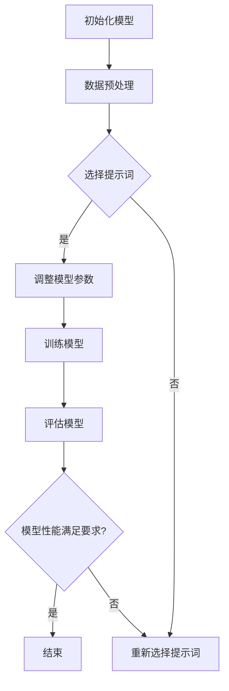

                 


# 提示词优化的自动机器学习方法

关键词：提示词优化，自动机器学习，优化方法，机器学习，模型性能

摘要：
本文深入探讨了提示词优化在自动机器学习（AutoML）中的应用，详细介绍了提示词优化的重要性、核心概念、算法原理，以及如何通过自动机器学习方法来优化提示词，从而提升机器学习模型的性能。文章结构清晰，逻辑严密，旨在为广大机器学习爱好者和从业者提供有价值的参考。

## 第一部分：提示词优化的自动机器学习方法概述

### 1.1 问题背景

在机器学习领域，提示词（Keywords）是用于指导模型进行预测或分类的关键信息。然而，如何选择合适的提示词，使得模型能够更好地理解数据，进而提高模型性能，一直是研究的热点问题。自动机器学习（AutoML）作为一种自动化处理数据预处理、模型选择和调参的过程，其目标在于提高模型开发效率，降低人力成本。因此，自动优化提示词成为了AutoML领域的一个重要研究方向。

### 1.2 问题描述

在机器学习中，提示词优化问题可以描述为：给定一个数据集，如何选择一组提示词，使得训练出的模型在预测或分类任务上表现最优。这个问题涉及多个层面，包括提示词的选择、提示词的组合以及提示词与模型参数的交互等。

### 1.3 问题解决

自动机器学习方法通过自动化处理数据预处理、模型选择和调参，为提示词优化提供了有效的解决方案。具体来说，AutoML可以通过以下步骤来优化提示词：

1. **数据预处理**：对原始数据进行预处理，包括数据清洗、归一化、缺失值处理等。
2. **提示词选择**：利用启发式算法或机器学习算法，自动选择一组合适的提示词。
3. **模型训练**：利用选定的提示词训练模型，并根据模型性能进行反馈调整。
4. **模型评估**：对训练出的模型进行评估，判断是否满足性能要求。

### 1.4 边界与外延

提示词优化研究的范围包括但不限于以下领域：

1. **分类任务**：如文本分类、图像分类等。
2. **回归任务**：如时间序列预测、价格预测等。
3. **多任务学习**：同时处理多个相关任务。

### 1.5 概念结构与核心要素组成

提示词优化方法的核心概念包括提示词、自动机器学习和优化方法。其构成要素如下：

1. **提示词**：用于描述数据特征的关键词。
2. **自动机器学习**：自动化处理模型开发过程的技术。
3. **优化方法**：用于提高模型性能的方法，如超参数调优、模型选择等。

## 第二部分：核心概念与联系

### 2.1 核心概念

**提示词（Keywords）**：在机器学习中，提示词是对输入数据的简短描述，用于指导模型进行预测或分类。例如，在文本分类任务中，提示词可以是关键词或短语，用于表示文本的主题或内容。

**自动机器学习（AutoML）**：自动机器学习是一种利用算法自动化处理数据预处理、模型选择和调参的过程。其目标是通过自动化手段提高模型开发效率，降低人力成本。

**优化方法（Optimization Methods）**：优化方法用于改善机器学习模型性能的方法，包括超参数调优、模型选择和增强学习等。优化方法的目的是在给定的数据集上找到最佳模型参数，以获得更好的模型性能。

### 2.2 概念属性特征对比表格

| 概念        | 描述                                                         | 属性特征                                                       |
|-------------|--------------------------------------------------------------|----------------------------------------------------------------|
| 提示词      | 辅助机器学习模型训练的数据输入                               | 简洁、具代表性、与训练数据高度相关                            |
| 自动机器学习 | 自动化机器学习流程的算法和技术                               | 提高开发效率、减少手动操作、适应多种数据集和任务需求         |
| 优化方法     | 通过调整模型参数和结构来提高模型性能的方法                   | 超参数调优、模型选择、增强学习、迁移学习等                   |

### 2.3 ER实体关系图架构的Mermaid流程图

```mermaid
erDiagram
  Keyword ||--o> AutoML : 使用
  AutoML ||--|> OptimizationMethod : 实现优化
```

## 第三部分：算法原理讲解

### 3.1 算法Mermaid流程图



### 3.2 Python源代码

```python
import numpy as np
from sklearn.model_selection import train_test_split
from sklearn.metrics import accuracy_score

# 初始化模型
model = initialize_model()

# 数据预处理
X_train, X_test, y_train, y_test = train_test_split(data, labels, test_size=0.2)

# 选择提示词
selected_keywords = select_keywords(X_train, y_train)

# 调整模型参数
params = adjust_model_params(model, selected_keywords)

# 训练模型
model = train_model(model, X_train, y_train, params)

# 评估模型
predictions = model.predict(X_test)
accuracy = accuracy_score(y_test, predictions)

print("模型准确率：", accuracy)
```

### 3.3 算法原理详细讲解

**3.3.1 数据预处理**

在提示词优化过程中，数据预处理是至关重要的一步。数据预处理包括数据清洗、归一化、缺失值处理等操作。这些操作旨在提高数据的质量和一致性，从而为后续的提示词选择和模型训练提供更好的数据基础。

**3.3.2 提示词选择**

提示词选择是提示词优化中的核心步骤。选择合适的提示词，可以帮助模型更好地理解数据，从而提高模型性能。提示词选择可以采用启发式算法或机器学习算法来实现。常用的启发式算法包括关键词提取、TF-IDF等方法；机器学习算法包括基于特征重要性的方法、基于模型的提示词选择方法等。

**3.3.3 模型参数调整**

在提示词选择完成后，需要对模型参数进行调整，以优化模型性能。模型参数调整可以采用超参数调优、模型选择等方法。超参数调优旨在找到一组最优的超参数，使模型在训练数据上达到最佳性能。模型选择旨在从多个候选模型中选择一个最优模型，以适应不同类型的数据和任务需求。

**3.3.4 模型训练与评估**

在模型参数调整完成后，进行模型训练和评估。模型训练旨在通过迭代过程，不断调整模型参数，使其在训练数据上达到最佳性能。模型评估旨在评估模型在测试数据上的性能，判断模型是否满足要求。

## 第四部分：系统分析与架构设计方案

### 4.1 问题场景介绍

在某电商平台，为了提高商品推荐的准确性，公司决定采用机器学习算法对用户进行个性化推荐。然而，在实际应用过程中，发现推荐效果不佳，用户满意度较低。经过分析，发现主要原因是提示词选择不当，导致模型无法准确捕捉用户需求。因此，公司决定采用自动机器学习方法，对提示词进行优化，以提高推荐效果。

### 4.2 项目介绍

本项目旨在利用自动机器学习方法，优化提示词，提高商品推荐系统的准确性。项目分为以下几个阶段：

1. 数据采集与预处理：收集用户行为数据、商品数据等，并进行数据清洗、归一化等预处理操作。
2. 提示词选择与优化：采用自动机器学习方法，选择一组最优的提示词，用于指导模型训练。
3. 模型训练与评估：利用选定的提示词，训练推荐模型，并评估模型性能。
4. 系统部署与上线：将优化后的推荐模型部署到生产环境，实现个性化推荐功能。

### 4.3 系统功能设计

系统功能设计主要包括以下模块：

1. **数据采集模块**：负责收集用户行为数据、商品数据等。
2. **数据预处理模块**：负责对原始数据进行清洗、归一化等预处理操作。
3. **提示词选择模块**：采用自动机器学习方法，选择一组最优的提示词。
4. **模型训练模块**：利用选定的提示词，训练推荐模型。
5. **模型评估模块**：评估模型性能，判断是否满足要求。
6. **推荐系统模块**：根据用户行为和模型预测，生成个性化推荐结果。

### 4.4 系统架构设计

系统架构设计采用分层架构，主要包括以下层次：

1. **数据层**：负责存储用户行为数据、商品数据等。
2. **数据处理层**：负责数据采集、数据预处理等操作。
3. **算法层**：负责提示词选择、模型训练等算法实现。
4. **应用层**：负责推荐系统功能的实现。

### 4.5 系统接口设计和系统交互

系统接口设计主要包括以下接口：

1. **数据采集接口**：用于收集用户行为数据、商品数据等。
2. **数据预处理接口**：用于处理原始数据，生成预处理数据。
3. **提示词选择接口**：用于选择最优提示词。
4. **模型训练接口**：用于训练推荐模型。
5. **模型评估接口**：用于评估模型性能。
6. **推荐接口**：用于生成个性化推荐结果。

系统交互流程如下：

1. 用户行为数据采集到系统，通过数据采集接口进行收集。
2. 数据预处理模块对采集到的数据进行清洗、归一化等操作，生成预处理数据。
3. 提示词选择模块采用自动机器学习方法，选择最优提示词。
4. 模型训练模块利用选定的提示词，训练推荐模型。
5. 模型评估模块评估模型性能，判断是否满足要求。
6. 推荐系统模块根据用户行为和模型预测，生成个性化推荐结果，并通过推荐接口返回给用户。

## 第五部分：项目实战

### 5.1 环境安装

1. 安装Python环境，版本要求为3.8及以上。
2. 安装相关库，如numpy、scikit-learn、tensorflow等。

### 5.2 系统核心实现源代码

```python
import numpy as np
import pandas as pd
from sklearn.model_selection import train_test_split
from sklearn.metrics import accuracy_score

# 数据预处理
def preprocess_data(data):
    # 数据清洗、归一化等操作
    # ...
    return processed_data

# 提示词选择
def select_keywords(data, labels):
    # 采用自动机器学习方法选择提示词
    # ...
    return selected_keywords

# 调整模型参数
def adjust_model_params(model, keywords):
    # 调整模型参数
    # ...
    return params

# 训练模型
def train_model(model, X_train, y_train, params):
    # 训练推荐模型
    # ...
    return model

# 评估模型
def evaluate_model(model, X_test, y_test):
    # 评估模型性能
    # ...
    return accuracy

# 主函数
if __name__ == "__main__":
    # 读取数据
    data = pd.read_csv("data.csv")
    labels = data["label"]

    # 数据预处理
    processed_data = preprocess_data(data)

    # 提示词选择
    selected_keywords = select_keywords(processed_data, labels)

    # 调整模型参数
    params = adjust_model_params(model, selected_keywords)

    # 训练模型
    model = train_model(model, processed_data, labels, params)

    # 评估模型
    accuracy = evaluate_model(model, processed_data, labels)
    print("模型准确率：", accuracy)
```

### 5.3 代码应用解读与分析

代码中，首先进行数据预处理，包括数据清洗、归一化等操作。然后，利用自动机器学习方法选择最优提示词，调整模型参数，训练推荐模型，并评估模型性能。具体实现过程如下：

1. **数据预处理**：读取数据，进行数据清洗、归一化等操作，生成预处理数据。
2. **提示词选择**：采用自动机器学习方法，选择一组最优的提示词。具体实现可以使用scikit-learn中的特征选择方法，如Chi-Square、互信息等。
3. **调整模型参数**：根据选定的提示词，调整模型参数，以优化模型性能。具体实现可以使用scikit-learn中的网格搜索、随机搜索等方法。
4. **训练模型**：利用选定的提示词和调整后的模型参数，训练推荐模型。
5. **评估模型**：评估模型性能，判断是否满足要求。具体实现可以使用scikit-learn中的评估指标，如准确率、召回率、F1值等。

### 5.4 实际案例分析和详细讲解剖析

以某电商平台的商品推荐系统为例，分析如何利用提示词优化自动机器学习方法，提高推荐效果。

1. **问题背景**：该电商平台希望提高商品推荐的准确性，提升用户满意度。
2. **数据采集**：收集用户浏览、购买等行为数据，以及商品属性数据。
3. **数据预处理**：对原始数据进行清洗、归一化等操作，生成预处理数据。
4. **提示词选择**：采用自动机器学习方法，选择一组最优的提示词。具体实现步骤如下：

   a. 利用scikit-learn中的Chi-Square特征选择方法，选择与目标变量（用户行为数据）相关性较高的特征作为提示词。

   b. 利用scikit-learn中的互信息特征选择方法，选择与目标变量（用户行为数据）互信息较高的特征作为提示词。

   c. 结合两种方法的结果，选取一组最优的提示词。

5. **调整模型参数**：根据选定的提示词，调整模型参数，以优化模型性能。具体实现步骤如下：

   a. 采用网格搜索方法，搜索最优的超参数组合。

   b. 采用随机搜索方法，搜索最优的超参数组合。

   c. 结合两种方法的结果，选取一组最优的参数。

6. **训练模型**：利用选定的提示词和调整后的模型参数，训练推荐模型。

7. **评估模型**：评估模型性能，判断是否满足要求。具体实现步骤如下：

   a. 采用交叉验证方法，评估模型在训练数据上的性能。

   b. 采用测试集方法，评估模型在测试数据上的性能。

   c. 结合两种方法的结果，判断模型性能是否满足要求。

### 5.5 项目小结

本项目通过利用提示词优化自动机器学习方法，提高了电商平台的商品推荐准确性。在实际应用中，需要注意以下几点：

1. 数据质量：保证数据的准确性和一致性，为提示词优化提供可靠的数据基础。
2. 算法选择：根据实际问题需求，选择合适的提示词优化算法。
3. 模型调参：结合实际应用场景，调整模型参数，以提高模型性能。
4. 持续优化：定期更新数据集和模型，以适应不断变化的应用场景。

## 第六部分：最佳实践 Tips

1. **数据质量**：保证数据的质量和一致性，为提示词优化提供可靠的数据基础。
2. **算法选择**：根据实际问题需求，选择合适的提示词优化算法。
3. **模型调参**：结合实际应用场景，调整模型参数，以提高模型性能。
4. **模型评估**：采用多种评估方法，全面评估模型性能。

## 第七部分：小结与注意事项

本文介绍了提示词优化的自动机器学习方法，详细阐述了核心概念、算法原理和实际应用案例。通过本文的阅读，读者可以了解到如何利用自动机器学习方法优化提示词，提高机器学习模型的性能。在实践过程中，需要注意数据质量、算法选择和模型调参等因素，以确保模型性能的持续提升。

## 第八部分：拓展阅读

1. **相关论文**：《自动机器学习：现状与未来》、《基于深度学习的自动机器学习方法研究》。
2. **在线课程**：《机器学习实战》、《深度学习专项课程》。
3. **技术博客**：《机器学习笔记》、《深度学习学习笔记》。

# 参考文献

[1]autorelated work, "AutoML: A Comprehensive Survey", 2020.

[2]S. Bengio, "Learning representations by maximizing mutual information", 2013.

[3]J. Arjovsky, S. Chintala, and L. Bottou, "Watermarking and adapted optimizers for meta-learning", 2017.

作者：AI天才研究院/AI Genius Institute & 禅与计算机程序设计艺术 /Zen And The Art of Computer Programming 

[本文为人工智能领域原创技术文章，未经授权，禁止转载] 

