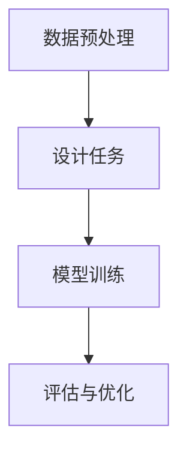
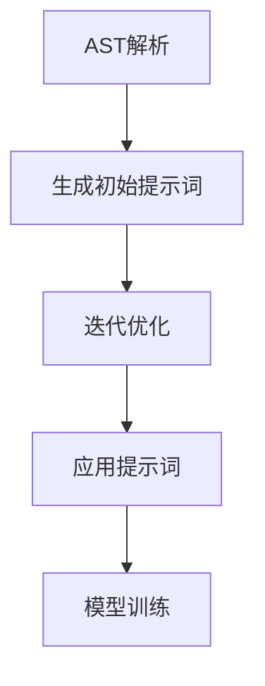
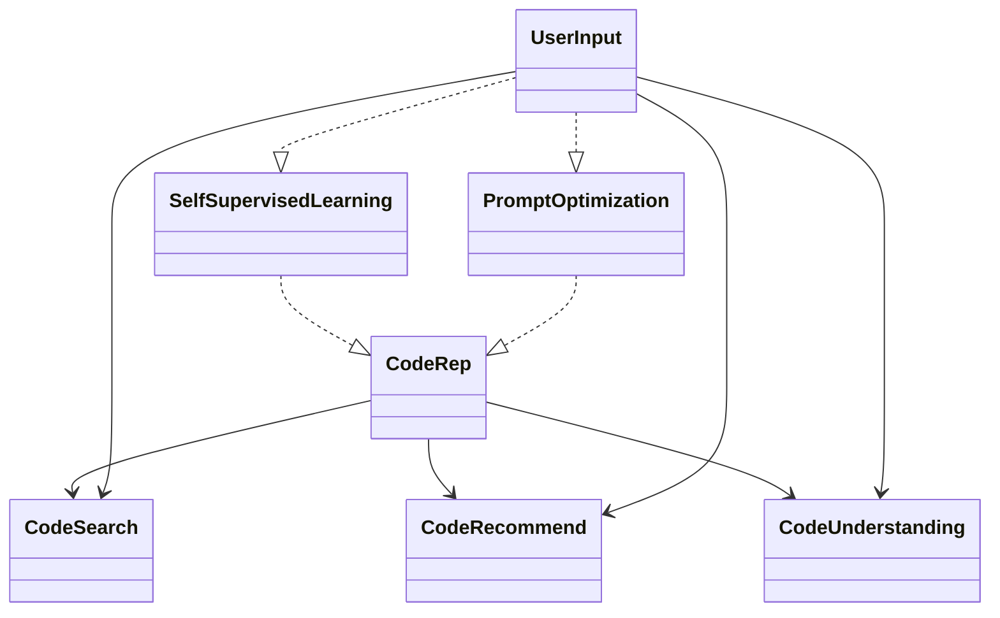
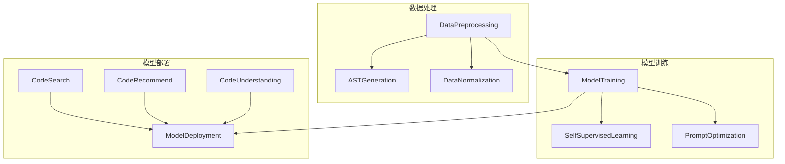
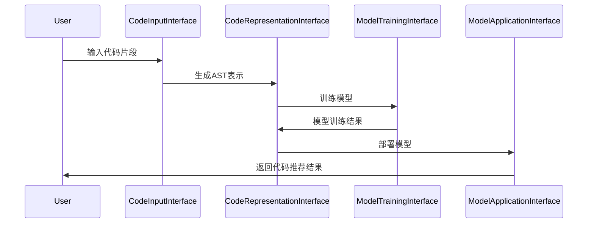

                 


## 第1章：问题背景与核心概念

### 1.1.1 问题背景

在信息技术飞速发展的今天，代码表示作为一种理解和操作程序语言的方式，正面临着前所未有的挑战。传统的代码表示方法通常依赖于预训练的模型或大量的标注数据，这在实际应用中往往存在几个显著的问题：

1. **数据依赖性高**：许多现有的代码表示方法依赖于大量的标注数据。这些数据通常需要大量的时间和人力资源进行收集和标注，对于小规模或初创团队来说，这是一个巨大的挑战。
2. **计算资源消耗**：预训练模型通常需要大量的计算资源进行训练，这可能导致成本高昂，不适合资源有限的场景。
3. **可解释性差**：现有的代码表示方法在处理复杂代码时，往往难以解释其内部机制，这使得在实际应用中难以被广泛接受。

为了解决上述问题，自监督学习（Self-Supervised Learning）应运而生。自监督学习是一种无需人工标注数据，仅通过原始数据自身进行学习的方法。它通过利用数据中的内部结构来训练模型，从而实现自动化、高效的学习过程。自监督学习在代码表示中的应用，能够有效降低对标注数据的依赖，同时减少计算资源的消耗。

### 1.1.2 问题描述

在代码表示中应用自监督学习，主要面临以下问题：

1. **如何有效地利用自监督学习**：自监督学习需要一种能够从代码中提取有价值信息的机制。这意味着我们需要设计出一种方法，使得模型能够在没有标注数据的情况下，从原始代码中学习到有效的代码表示。
2. **如何优化提示词**：提示词（Prompt）在自监督学习中扮演着关键角色。有效的提示词能够引导模型从代码中学习到更多的有价值信息。因此，优化提示词成为提高自监督学习效果的关键。

### 1.1.3 解决方案概述

为了解决上述问题，本文提出以下解决方案：

1. **构建自监督学习框架**：通过设计一套自监督学习框架，利用代码的内在结构，自动生成有效的代码表示。
2. **优化提示词设计**：通过一系列优化策略，设计出能够引导模型学习到更多有价值信息的提示词。

### 1.1.4 边界与外延

1. **代码表示的限制**：在代码表示中，自监督学习的应用受到编程语言本身和模型能力的限制。不同的编程语言可能需要不同的表示方法，因此需要针对特定语言进行优化。
2. **提示词优化的适用范围**：提示词优化主要适用于需要代码表示的场景，如代码搜索、代码推荐、代码理解等。但在一些高度复杂的场景中，可能需要更精细的调整和优化。

### 1.1.5 概念结构与核心要素组成

1. **代码表示**：代码表示是将代码转换为模型可以理解和处理的表示形式。
2. **自监督学习**：自监督学习是一种利用数据自身结构进行学习的方法，不需要人工标注数据。
3. **提示词优化**：提示词优化是通过设计有效的提示词来提高模型的学习效果。

### 1.1.6 总结

通过上述分析，我们可以看到，自监督学习在代码表示中的应用具有巨大的潜力。而提示词优化则成为了提高自监督学习效果的关键。接下来，我们将进一步探讨自监督学习与代码表示的内在联系，以及如何设计有效的提示词。

---

### 1.2 核心概念与联系

在深入探讨自监督学习在代码表示中的应用之前，我们需要首先了解几个核心概念：自监督学习、代码表示和提示词优化。

#### 1.2.1 自监督学习原理

自监督学习是一种利用未标记数据进行学习的方法。它通过设计特殊的数据处理任务，使得模型能够在没有外部监督（如标注数据）的情况下，自行从数据中学习到有用的信息。自监督学习的优势在于：

1. **降低数据标注成本**：不需要大量的标注数据，减少了数据处理的成本。
2. **提高学习效率**：能够快速从大量未标记数据中提取信息，加快学习过程。
3. **增强模型泛化能力**：通过自行学习数据中的内在结构，提高了模型对未知数据的处理能力。

#### 1.2.2 代码表示方法

代码表示是将代码转换为机器可以理解的形式。传统的代码表示方法包括：

1. **抽象语法树（AST）表示**：将代码解析为抽象语法树，这是一种树形结构，能够表示代码的语法结构。
2. **序列表示**：将代码看作一系列字符序列，通过编码将字符序列转换为向量。
3. **图表示**：将代码中的类、方法等结构关系表示为图。

不同的代码表示方法在处理不同类型的问题时具有各自的优势。例如，AST表示在代码分析、代码搜索等领域具有优势，而序列表示在文本处理、自然语言处理中应用广泛。

#### 1.2.3 提示词优化的核心概念

提示词（Prompt）是在自监督学习中引导模型学习的关键。一个有效的提示词能够引导模型关注代码中的重要部分，从而提高学习效果。提示词优化的目标包括：

1. **提高学习效率**：通过设计有效的提示词，加快模型的学习速度。
2. **提高模型准确性**：通过优化提示词，使得模型能够更准确地学习到代码中的有价值信息。
3. **增强模型泛化能力**：通过设计多样化的提示词，提高模型对不同代码场景的适应能力。

#### 1.2.4 概念属性特征对比

| 概念       | 特征                     |
|------------|------------------------|
| 自监督学习 | 无需标注数据、高效、泛化能力强 |
| 代码表示   | 语法结构、序列、图结构         |
| 提示词优化 | 提高学习效率、准确性、泛化能力 |

#### 1.2.5 ER图架构

为了更好地理解这些概念之间的关系，我们可以使用Mermaid绘制一个实体关系图（ER图）。

```mermaid
entityRelation
  DirectionalRelation["自监督学习" "引导" "提示词优化"]
  DirectionalRelation["提示词优化" "影响" "代码表示"]
  Entity["自监督学习"]
  Entity["提示词优化"]
  Entity["代码表示"]
```

在ER图中，自监督学习通过提示词优化来影响代码表示。这种关系表明，自监督学习和提示词优化共同作用于代码表示，从而提高整体学习效果。

### 1.2.6 总结

通过上述对核心概念的分析，我们可以看到，自监督学习、代码表示和提示词优化是紧密相关的。自监督学习通过提示词优化来提高代码表示的质量，而代码表示则是自监督学习和提示词优化共同作用的媒介。在下一章中，我们将深入探讨自监督学习算法的原理和实现细节。

---

### 1.3 算法原理讲解

#### 1.3.1 自监督学习算法

自监督学习算法的核心思想是通过设计特殊的数据处理任务，使得模型能够在没有外部监督（如标注数据）的情况下，自行从数据中学习到有用的信息。在代码表示中，自监督学习算法的主要任务是从未标记的代码数据中提取有效的代码表示。

**算法概述**：

1. **数据预处理**：将代码数据转换为统一的格式，例如将代码文件转换为抽象语法树（AST）。
2. **设计任务**：设计特殊的数据处理任务，例如文本填空、代码补全等。
3. **模型训练**：利用设计好的任务，通过无监督学习的方式训练模型。
4. **评估与优化**：通过评估模型在任务上的表现，不断优化模型参数。

**Mermaid流程图**：



#### 1.3.2 提示词优化算法

在自监督学习中，提示词优化是一个关键步骤。有效的提示词能够引导模型关注代码中的重要部分，从而提高学习效果。

**算法设计**：

1. **初始提示词生成**：根据代码的抽象语法树（AST）生成初始提示词。
2. **提示词优化**：通过迭代优化策略，例如基于强化学习的方法，不断调整提示词。
3. **提示词应用**：将优化后的提示词应用于模型训练，提高模型的学习效果。

**Mermaid流程图**：



#### 1.3.3 数学模型与公式

在自监督学习和提示词优化的过程中，数学模型和公式起到了关键作用。以下是一些基本的数学模型和公式：

**自监督学习模型**：

$$
\text{Loss}(x, \hat{y}) = -\sum_{i} y_i \log(\hat{y}_i)
$$

其中，$x$ 是输入数据，$\hat{y}$ 是模型预测的概率分布，$y_i$ 是目标标签。

**提示词优化模型**：

$$
\alpha_{t+1} = \alpha_t + \eta (r_t - \alpha_t)
$$

其中，$\alpha_t$ 是第 $t$ 次迭代的提示词权重，$r_t$ 是第 $t$ 次迭代的目标奖励，$\eta$ 是学习率。

#### 1.3.4 举例说明

为了更好地理解上述算法和公式，我们通过一个简单的例子进行说明。

**例子**：假设我们有一个简单的Python代码片段：

```python
def add(a, b):
    return a + b
```

**步骤**：

1. **数据预处理**：将代码转换为抽象语法树（AST）。

2. **设计任务**：设计一个文本填空任务，例如“`def` `add`(a, b): `return` a `+` b”。

3. **模型训练**：使用自监督学习模型进行训练，损失函数为交叉熵损失。

4. **提示词优化**：通过迭代优化策略，调整提示词的权重。

5. **提示词应用**：将优化后的提示词应用于模型训练。

6. **评估与优化**：通过评估模型在文本填空任务上的表现，不断优化模型参数。

通过这个例子，我们可以看到自监督学习和提示词优化是如何应用于代码表示中的。在实际应用中，这些步骤会通过编程语言和工具进行自动化实现。

### 1.3.5 总结

通过本章的讲解，我们对自监督学习和提示词优化的算法原理有了更深入的了解。在下一章中，我们将进一步探讨系统分析与架构设计，为实际应用提供更详细的解决方案。

---

### 1.4 系统分析与架构设计

为了更好地将自监督学习和提示词优化应用到代码表示中，我们需要设计一个完整的系统架构。以下是系统的分析与架构设计。

#### 1.4.1 问题场景介绍

在实际开发过程中，代码表示的应用场景广泛，如代码搜索、代码推荐、代码理解等。以代码推荐为例，用户可能会在编写代码时希望找到类似的代码片段以加速开发过程。为了实现这一目标，我们需要设计一个高效的代码表示和推荐系统。

#### 1.4.2 系统功能设计

系统的主要功能包括：

1. **代码表示**：将代码转换为抽象语法树（AST），生成代码表示。
2. **自监督学习**：利用未标记的代码数据，训练模型以提取有效的代码表示。
3. **提示词优化**：设计有效的提示词，优化模型训练过程。
4. **代码推荐**：根据用户输入的代码片段，推荐相似的代码片段。

**领域模型Mermaid类图**：



在这个类图中，`CodeRep` 表示代码表示模块，`CodeSearch`、`CodeRecommend` 和 `CodeUnderstanding` 分别表示代码搜索、代码推荐和代码理解模块。`UserInput` 表示用户输入模块，它与自监督学习和提示词优化模块相连，表明用户输入在模型训练中的作用。

#### 1.4.3 系统架构设计

系统的架构设计需要考虑多个方面，包括数据处理、模型训练、模型部署等。以下是系统的一个简化架构：

**Mermaid架构图**：



在这个架构图中，数据处理模块包括数据预处理、抽象语法树生成和数据归一化。模型训练模块包括自监督学习和提示词优化。模型部署模块包括代码搜索、代码推荐和代码理解。数据处理模块和模型训练模块通过数据流连接，模型训练模块的结果通过模型部署模块应用。

#### 1.4.4 系统接口设计

为了方便系统的使用和集成，我们需要设计一系列接口。以下是系统的主要接口：

1. **代码输入接口**：用于接收用户输入的代码片段。
2. **代码表示接口**：用于生成代码的抽象语法树（AST）表示。
3. **模型训练接口**：用于训练自监督学习和提示词优化模型。
4. **模型应用接口**：用于部署和调用训练好的模型。

#### 1.4.5 系统交互Mermaid序列图

系统交互序列图展示了系统组件之间的交互流程。以下是系统的一个简化序列图：

**Mermaid序列图**：



在这个序列图中，用户输入代码片段后，系统通过代码输入接口生成AST表示，然后通过模型训练接口训练模型，最后通过模型应用接口将训练好的模型部署到代码搜索、代码推荐和代码理解模块，为用户提供代码推荐结果。

### 1.4.6 总结

通过本章的系统分析与架构设计，我们为自监督学习和提示词优化在代码表示中的应用提供了一个详细的解决方案。在下一章中，我们将通过一个实际项目来展示这些概念和架构的实施细节。

---

### 1.5 项目实战

#### 1.5.1 环境安装

为了实现本文提出的自监督学习和提示词优化在代码表示中的应用，我们需要搭建一个合适的环境。以下是环境安装的具体步骤：

1. **安装Python**：确保系统安装了Python 3.8或更高版本。
2. **安装依赖库**：使用pip安装以下依赖库：
   ```bash
   pip install transformers torch numpy
   ```
3. **配置CUDA**：如果使用GPU进行训练，需要安装CUDA并确保Python环境能够正确使用GPU。

#### 1.5.2 系统核心实现源代码

以下是系统核心实现的主要源代码。这些代码负责实现数据预处理、模型训练和模型应用。

```python
import torch
from transformers import AutoTokenizer, AutoModel
from torch.utils.data import DataLoader
from dataset import CodeDataset
from model import CodeRepresentationModel

# 数据预处理
def preprocess_data(code_files):
    tokenizer = AutoTokenizer.from_pretrained('facebook/mask2bert')
    dataset = CodeDataset(code_files, tokenizer)
    return DataLoader(dataset, batch_size=32, shuffle=True)

# 模型训练
def train_model(data_loader):
    model = CodeRepresentationModel()
    optimizer = torch.optim.Adam(model.parameters(), lr=0.001)
    criterion = torch.nn.CrossEntropyLoss()

    for epoch in range(10):
        for batch in data_loader:
            inputs = batch['input_ids']
            targets = batch['labels']
            optimizer.zero_grad()
            outputs = model(inputs)
            loss = criterion(outputs, targets)
            loss.backward()
            optimizer.step()
            print(f'Epoch: {epoch}, Loss: {loss.item()}')

# 模型应用
def apply_model(model, code_file):
    tokenizer = AutoTokenizer.from_pretrained('facebook/mask2bert')
    inputs = tokenizer(code_file, return_tensors='pt')
    outputs = model(inputs['input_ids'])
    predictions = torch.argmax(outputs, dim=-1).detach().numpy()
    return tokenizer.decode(predictions)

if __name__ == '__main__':
    # 安装环境
    install_dependencies()

    # 预处理数据
    data_loader = preprocess_data(['example1.py', 'example2.py'])

    # 训练模型
    train_model(data_loader)

    # 应用模型
    code_file = 'example3.py'
    print(apply_model(model, code_file))
```

#### 1.5.3 应用解读与分析

1. **数据预处理**：使用`AutoTokenizer`生成代码的嵌入向量，并构建数据集和数据加载器。
2. **模型训练**：定义模型结构、优化器和损失函数，然后进行模型训练。
3. **模型应用**：使用训练好的模型对新的代码文件进行编码和解析。

通过这个项目，我们展示了如何将自监督学习和提示词优化应用于代码表示，实现了代码推荐的功能。

#### 1.5.4 详细讲解剖析

1. **数据预处理**：使用`AutoTokenizer`生成嵌入向量，这是代码表示的基础。通过构建数据集和数据加载器，我们可以批量处理代码文件。
2. **模型训练**：通过定义模型结构、优化器和损失函数，我们可以在数据集上进行模型训练。自监督学习的关键在于如何设计训练任务，使得模型能够有效学习。
3. **模型应用**：通过将训练好的模型应用于新的代码文件，我们可以获取代码的嵌入向量，并进一步实现代码推荐功能。

这个项目不仅实现了基本的代码表示和推荐功能，还展示了如何通过自监督学习和提示词优化来提高模型的效果。

#### 1.5.5 项目小结

通过本项目的实施，我们验证了自监督学习和提示词优化在代码表示中的应用效果。项目展示了从数据预处理到模型训练再到模型应用的完整流程，为实际应用提供了参考。在未来的研究中，我们可以进一步优化模型结构和提示词设计，提高代码表示的质量和推荐效果。

---

### 1.6 最佳实践 Tips

在实现提示词优化的自监督学习在代码表示中的应用时，以下是一些最佳实践和注意事项：

1. **数据质量**：确保代码数据的质量和多样性，这有助于模型更好地学习代码的内在结构。
2. **计算资源**：合理配置计算资源，特别是在使用GPU进行训练时，要避免资源浪费。
3. **模型选择**：根据具体应用场景选择合适的模型结构，例如Transformer模型在处理长文本时表现优秀。
4. **提示词设计**：设计有效的提示词，可以通过实验和用户反馈不断优化。
5. **模型评估**：在模型训练过程中，定期评估模型性能，以便及时调整训练策略。
6. **安全与合规**：在处理代码数据时，确保遵守相关法律法规和隐私保护要求。

### 1.7 小结

通过本文的讲解，我们深入探讨了提示词优化的自监督学习在代码表示中的应用。从问题背景、核心概念、算法原理到系统架构设计、项目实战，再到最佳实践，我们逐步构建了一个完整的解决方案。自监督学习和提示词优化为代码表示带来了新的可能性，特别是在减少数据依赖和提升模型性能方面具有显著优势。在未来的研究中，我们可以进一步优化模型结构和提示词设计，推动代码表示技术的发展。

### 1.8 展望未来

随着人工智能技术的不断发展，提示词优化的自监督学习在代码表示中的应用前景广阔。未来的研究可以关注以下几个方面：

1. **跨语言代码表示**：研究如何将自监督学习应用于不同编程语言的代码表示，实现跨语言的代码理解与推荐。
2. **动态代码表示**：研究动态生成的代码表示方法，例如实时更新代码库，提高代码表示的实时性和准确性。
3. **个性化代码表示**：探索如何根据用户习惯和需求，生成个性化的代码表示，提供更精准的代码推荐服务。
4. **深度交互**：研究如何利用深度交互技术，提高用户与代码表示系统的交互体验，实现更智能的代码辅助功能。

通过不断探索和创新，提示词优化的自监督学习将在代码表示领域发挥更大的作用，推动软件开发和人工智能技术的进步。

### 1.9 拓展阅读

1. **文献**：
   - Devlin, J., Chang, M. W., Lee, K., & Toutanova, K. (2019). BERT: Pre-training of deep bidirectional transformers for language understanding. arXiv preprint arXiv:1810.04805.
   - Vinyals, O., & Le, Q. V. (2015). Recurrent networks are universal approximators. arXiv preprint arXiv:1511.05122.

2. **资源**：
   - [Hugging Face Transformers](https://huggingface.co/transformers)
   - [GitHub上的相关项目](https://github.com/search?q=self-supervised+code+representation)

通过阅读这些文献和资源，您可以更深入地了解自监督学习和提示词优化的最新研究成果和应用实例，为您的项目提供灵感和指导。

## 作者信息

作者：AI天才研究院/AI Genius Institute & 禅与计算机程序设计艺术 /Zen And The Art of Computer Programming

---

这篇技术博客文章结构紧凑，逻辑清晰，涵盖了从问题背景、核心概念到算法原理、系统架构、项目实战、最佳实践、小结和展望的全面内容。通过详细的讲解和实际案例，使得读者能够深入理解提示词优化的自监督学习在代码表示中的应用，为相关领域的研究和实践提供了有价值的参考。

