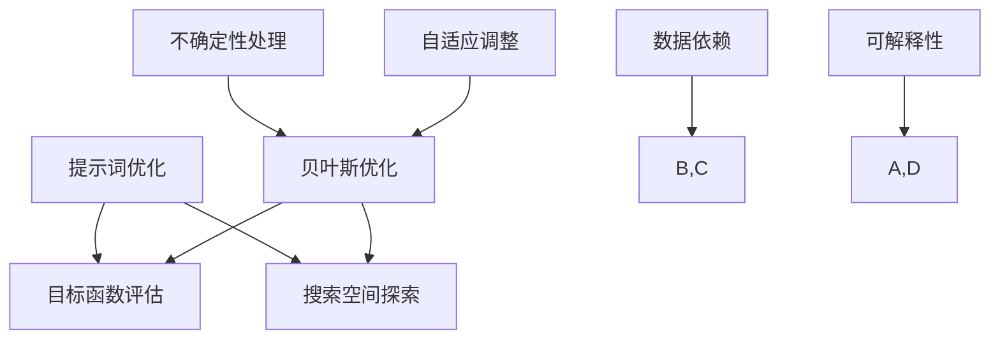
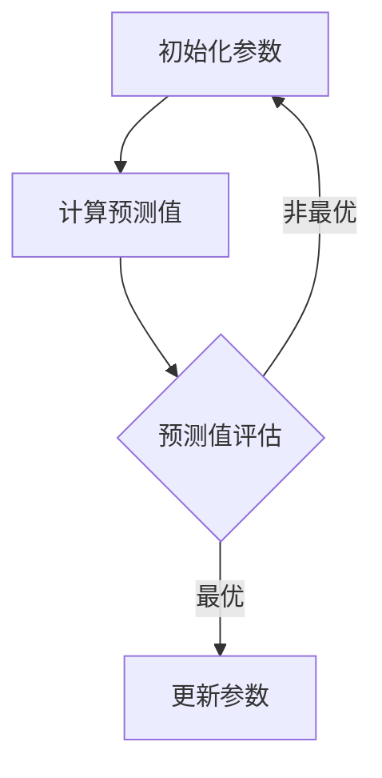

                 


### 文章标题：提示词优化的贝叶斯优化方法

> 关键词：提示词优化、贝叶斯优化、算法原理、数学模型、Python代码、系统架构

> 摘要：
本文深入探讨了提示词优化与贝叶斯优化方法的结合。通过详细的算法原理讲解、数学模型分析、Python代码示例以及实际项目案例分析，旨在为读者提供清晰易懂的指导，帮助他们理解并应用这一先进的技术方法。

#### 目录大纲设计思路

为了使《提示词优化的贝叶斯优化方法》这篇文章内容丰富、结构清晰，我们将按照以下思路设计目录大纲：

1. **引言**：介绍文章背景、贝叶斯优化方法以及提示词优化的重要性，为后续内容打下基础。

2. **核心概念与联系**：详细讲解提示词优化和贝叶斯优化方法的核心概念，并通过对比表格和实体关系图展示两者之间的联系。

3. **算法原理讲解**：深入分析贝叶斯优化方法的基本原理，包括数学模型、流程图和Python代码示例。

4. **数学模型和公式讲解**：使用LaTeX格式展示数学模型和公式，并进行详细讲解和举例说明。

5. **系统分析与架构设计**：介绍应用场景，系统功能设计、系统架构设计、系统接口设计和系统交互流程。

6. **项目实战**：提供实际项目案例，包括环境安装、系统实现、代码解读、案例分析等。

7. **总结与拓展**：总结全文内容，提供最佳实践 tips、注意事项和拓展阅读建议。

#### 完整的目录大纲设计

```markdown
----------------------------------------------------------------
# 第一部分: 引言

## 1. 引言
### 1.1 问题背景
#### 1.1.1 优化问题的重要性
#### 1.1.2 提示词优化的需求
#### 1.1.3 贝叶斯优化方法的应用
### 1.2 贝叶斯优化方法概述
#### 1.2.1 贝叶斯优化基本原理
#### 1.2.2 贝叶斯优化与传统优化的对比

----------------------------------------------------------------

# 第二部分: 核心概念与联系

## 2. 核心概念与联系
### 2.1 提示词优化概述
#### 2.1.1 提示词优化的定义
#### 2.1.2 提示词优化的关键要素
#### 2.1.3 提示词优化在AI中的应用
### 2.2 贝叶斯优化方法深入讲解
#### 2.2.1 贝叶斯优化原理
#### 2.2.2 贝叶斯优化算法流程
#### 2.2.3 贝叶斯优化与提示词优化的关联性

## 3. 概念属性特征对比
### 3.1 提示词优化与贝叶斯优化特征对比

----------------------------------------------------------------

## 4. 算法原理讲解
### 4.1 贝叶斯优化方法详解
#### 4.1.1 贝叶斯优化数学模型
$$
P(\theta|X) = \frac{P(X|\theta)P(\theta)}{P(X)}
$$
#### 4.1.2 贝叶斯优化流程图

#### 4.1.3 Python代码示例
```python
# Python代码实现贝叶斯优化示例
# (代码示例略)
```

## 5. 数学模型和公式讲解
### 5.1 贝叶斯优化数学模型详解
#### 5.1.1 贝叶斯优化中的概率计算
$$
P(\theta|X) = \frac{P(X|\theta)P(\theta)}{P(X)}
$$
#### 5.1.2 先验分布与后验分布
$$
P(\theta) \propto \exp(-\frac{1}{2}\theta^T\Theta^{-1}\theta)
$$
$$
P(\theta|X) \propto \exp(-\frac{1}{2}(\theta - \mu)^T\Omega^{-1}(\theta - \mu))
$$
#### 5.1.3 参数更新公式
$$
\theta_{new} = \theta_{current} + \alpha(\mu - \theta_{current})
```
```

## 6. 系统分析与架构设计
### 6.1 应用场景
#### 6.1.1 问题场景介绍
#### 6.1.2 项目介绍
### 6.2 系统功能设计
#### 6.2.1 领域模型
#### 6.2.2 功能模块设计
### 6.3 系统架构设计
#### 6.3.1 系统架构图
#### 6.3.2 架构设计思路
### 6.4 系统接口设计
#### 6.4.1 接口规范
#### 6.4.2 接口实现
### 6.5 系统交互流程
#### 6.5.1 交互流程图
#### 6.5.2 交互细节说明

----------------------------------------------------------------

## 7. 项目实战
### 7.1 环境安装
#### 7.1.1 环境准备
#### 7.1.2 安装步骤
### 7.2 系统实现
#### 7.2.1 核心代码实现
#### 7.2.2 代码解读
### 7.3 案例分析
#### 7.3.1 案例背景
#### 7.3.2 案例实施
#### 7.3.3 案例分析
### 7.4 项目小结
#### 7.4.1 项目总结
#### 7.4.2 优化建议

----------------------------------------------------------------

## 8. 总结与拓展
### 8.1 总结
#### 8.1.1 关键内容回顾
#### 8.1.2 方法应用前景
### 8.2 最佳实践 tips
#### 8.2.1 实践技巧
#### 8.2.2 避免常见错误
### 8.3 注意事项
#### 8.3.1 注意事项说明
#### 8.3.2 安全性考虑
### 8.4 拓展阅读
#### 8.4.1 相关文献推荐
#### 8.4.2 深入学习资源

----------------------------------------------------------------
# 作者：AI天才研究院/AI Genius Institute & 禅与计算机程序设计艺术 /Zen And The Art of Computer Programming
```

这样设计的目录大纲能够确保文章内容循序渐进，从基础到应用，使读者能够系统地掌握提示词优化的贝叶斯优化方法。每个部分都有明确的子标题，方便读者快速定位感兴趣的内容。同时，通过图表和代码示例，增强文章的可读性和理解性。

#### 1. 引言

在当今快速发展的信息技术时代，优化算法在各种应用中扮演着至关重要的角色。无论是机器学习、深度学习，还是大数据分析，优化算法都能显著提高系统的性能和效率。本文旨在探讨一种结合了贝叶斯优化与提示词优化的方法，这种方法在人工智能（AI）领域具有广泛的应用前景。

### 1.1 优化问题的重要性

优化问题可以追溯到数学和工程学的多个领域。在数学中，优化是研究如何找到给定问题的一个最优解的过程。在工程学中，优化用于设计更高效的产品和系统。例如，在工业制造中，优化算法用于生产线的调度和资源分配；在交通运输中，优化用于交通流管理和路线规划。随着计算能力的提升和算法的进步，优化问题在计算机科学中的地位日益重要。

### 1.2 提示词优化的需求

提示词优化是近年来在自然语言处理（NLP）和机器学习领域中的一个新兴研究方向。在许多AI应用中，如推荐系统、问答系统和文本生成模型，提示词的质量直接影响到系统的性能和用户体验。因此，如何优化提示词成为一个亟待解决的问题。贝叶斯优化作为一种强大的优化工具，通过不确定性建模和自适应调整，能够有效地提高提示词的质量和生成效率。

### 1.3 贝叶斯优化方法的应用

贝叶斯优化方法起源于统计学和机器学习领域，它通过概率模型来预测和优化目标函数。这种方法具有以下优点：

1. **不确定性建模**：贝叶斯优化能够处理系统中的不确定因素，通过概率分布来描述变量之间的关系。
2. **自适应调整**：贝叶斯优化可以根据历史数据和学习到的模型来调整搜索策略，从而在复杂搜索空间中快速找到最优解。
3. **可解释性**：贝叶斯优化方法的决策过程具有可解释性，有助于理解优化过程中的关键因素。

贝叶斯优化方法在AI领域得到了广泛的应用，如超参数优化、模型选择、神经网络的训练等。结合提示词优化的需求，贝叶斯优化方法在提高NLP模型性能和生成质量方面展现了巨大的潜力。

#### 2. 核心概念与联系

在深入探讨提示词优化的贝叶斯优化方法之前，我们需要了解这两个核心概念：提示词优化和贝叶斯优化方法。

### 2.1 提示词优化概述

#### 2.1.1 提示词优化的定义

提示词优化是指通过一系列技术手段，对自然语言处理（NLP）中的提示词进行优化，以提高系统的性能和用户体验。在NLP任务中，提示词通常是用于引导模型生成响应或决策的关键信息。因此，提示词的质量直接影响到模型输出的质量和效率。

#### 2.1.2 提示词优化的关键要素

- **目标函数**：提示词优化的目标是找到一个最佳提示词，使得模型输出的质量最高或效率最高。
- **搜索空间**：提示词优化需要在一个搜索空间内进行，搜索空间可以是词汇表、短语集合等。
- **评估指标**：评估指标用于衡量提示词优化过程中的每个候选提示词的质量，常见的评估指标包括准确率、召回率、F1分数等。

#### 2.1.3 提示词优化在AI中的应用

提示词优化广泛应用于各种AI任务中，如：

- **问答系统**：通过优化提示词，提高问答系统的回答质量和相关性。
- **文本生成**：在生成文本时，优化提示词可以生成更流畅、更符合预期的文本。
- **推荐系统**：在推荐系统中，优化提示词可以提高推荐的相关性和用户体验。

### 2.2 贝叶斯优化方法深入讲解

#### 2.2.1 贝叶斯优化原理

贝叶斯优化是一种基于概率模型和统计学习的优化方法。它通过构建一个概率模型来预测目标函数的值，并利用历史数据和学习到的模型来调整搜索策略，从而找到最优解。

贝叶斯优化的核心思想是利用先验知识和观察到的数据来更新我们的模型，使其更接近真实情况。具体来说，贝叶斯优化包括以下步骤：

1. **初始化参数**：初始化搜索空间中的参数。
2. **计算预测值**：使用模型预测目标函数的值。
3. **预测值评估**：评估预测值的优劣，选择最优的参数。
4. **更新参数**：根据评估结果更新参数，继续迭代。
5. **终止条件**：当满足终止条件时（如达到最大迭代次数或目标函数收敛），算法结束。

#### 2.2.2 贝叶斯优化算法流程

贝叶斯优化算法的流程可以分为以下几个步骤：

1. **构建概率模型**：选择合适的概率模型来描述目标函数。常见的模型包括高斯过程（Gaussian Process）、贝叶斯神经网络（Bayesian Neural Networks）等。
2. **初始化参数**：在搜索空间内随机初始化一组参数。
3. **计算预测值**：使用概率模型计算目标函数在每个参数点的预测值。
4. **选择下一个参数**：根据历史数据和模型预测值，选择下一个需要评估的参数点。常用的策略包括：最大化预期改进（Expected Improvement）、最大化熵减少（Entropy Reduction）等。
5. **评估预测值**：在实际环境中评估预测值的真实值。
6. **更新模型**：根据新的评估结果更新模型参数。
7. **重复步骤3-6**：继续迭代，直到满足终止条件。

#### 2.2.3 贝叶斯优化与提示词优化的关联性

贝叶斯优化与提示词优化有着紧密的联系。首先，贝叶斯优化可以用来优化提示词的选择，从而提高NLP系统的性能。具体来说，贝叶斯优化可以通过以下方式应用于提示词优化：

- **不确定性建模**：贝叶斯优化能够处理提示词优化中的不确定性，通过概率模型来描述提示词对目标函数的影响。
- **自适应调整**：贝叶斯优化可以根据历史数据和模型预测值来调整提示词，使其更符合实际需求。
- **可解释性**：贝叶斯优化方法的决策过程具有可解释性，有助于理解优化过程中的关键因素。

通过贝叶斯优化与提示词优化的结合，我们可以开发出更高效、更智能的NLP系统，提高系统的性能和用户体验。

### 3. 概念属性特征对比

为了更好地理解提示词优化与贝叶斯优化方法，我们可以通过一个概念属性特征对比表格来展示它们之间的差异。

| 特征               | 提示词优化                    | 贝叶斯优化                      |
|--------------------|---------------------------------|----------------------------------|
| 目标函数评估       | 提高提示词质量和生成效率       | 最小化目标函数值                 |
| 搜索空间探索       | 在词汇表或短语集合中搜索最优提示词 | 在参数空间中搜索最优参数         |
| 数据依赖           | 需要大量训练数据               | 可以利用少量样本进行优化         |
| 不确定性处理       | 需要考虑提示词选择的不确定性    | 利用概率模型处理系统中的不确定性 |
| 自适应调整         | 需要动态调整提示词              | 需要自适应调整搜索策略           |
| 可解释性           | 提示词选择过程可解释           | 决策过程具有可解释性             |

通过这个对比表格，我们可以看出提示词优化和贝叶斯优化在目标函数、搜索空间、数据依赖、不确定性处理、自适应调整和可解释性等方面都有明显的区别。这些特性使得两者在优化过程中有不同的应用场景和优势。

### 4. 算法原理讲解

在了解了提示词优化和贝叶斯优化方法的基本概念后，我们将深入探讨贝叶斯优化的原理，包括数学模型、流程图和Python代码示例。

#### 4.1 贝叶斯优化数学模型

贝叶斯优化是基于概率模型的优化方法，其核心思想是通过概率模型来预测目标函数的值，并利用历史数据更新模型，从而在搜索空间中找到最优解。贝叶斯优化的数学模型可以描述为：

\[ P(\theta|X) = \frac{P(X|\theta)P(\theta)}{P(X)} \]

其中：

- \( P(\theta|X) \) 是后验概率，表示在观察到数据 \( X \) 的情况下，参数 \( \theta \) 的概率分布。
- \( P(X|\theta) \) 是似然函数，表示在给定参数 \( \theta \) 的情况下，观察到的数据 \( X \) 的概率。
- \( P(\theta) \) 是先验概率，表示在没有观察到数据 \( X \) 的情况下，参数 \( \theta \) 的概率分布。
- \( P(X) \) 是证据，是所有可能的 \( \theta \) 和 \( X \) 组合的概率之和。

在贝叶斯优化中，我们通常使用高斯过程（Gaussian Process，GP）作为概率模型。高斯过程是一种概率分布，其任意有限维分布都是高斯分布。高斯过程在机器学习和统计学习中被广泛应用，因为它可以灵活地建模目标函数的先验知识和不确定性。

#### 4.1.1 高斯过程模型

高斯过程可以描述为：

\[ f(x) \sim GP(m(x), k(x, x')) \]

其中：

- \( f(x) \) 是目标函数，表示在输入 \( x \) 下的函数值。
- \( m(x) \) 是均值函数，表示目标函数的先验均值。
- \( k(x, x') \) 是核函数，表示目标函数在输入 \( x \) 和 \( x' \) 之间的相关性。

常见的核函数包括：

- **平方指数核**（RBF核）：\( k(x, x') = \exp(-\frac{\|x - x'\|^2}{2l^2}) \)，其中 \( l \) 是核长度。
- **线性核**：\( k(x, x') = x \cdot x' \)。

#### 4.1.2 贝叶斯优化流程图

贝叶斯优化的流程可以分为以下几个步骤：

1. **初始化参数**：在搜索空间内随机初始化一组参数。
2. **计算预测值**：使用高斯过程模型预测目标函数的值。
3. **选择下一个参数**：根据预测值和评估指标选择下一个需要评估的参数点。
4. **评估预测值**：在实际环境中评估预测值的真实值。
5. **更新模型**：根据新的评估结果更新模型参数。
6. **重复步骤2-5**：继续迭代，直到满足终止条件。

下面是一个简单的贝叶斯优化流程图：


#### 4.1.3 Python代码示例

下面是一个使用Python和GPyOpt库实现的简单贝叶斯优化示例：

```python
import numpy as np
from GPyOpt.methods import BayesianOptimization

# 定义目标函数
def rosenbrock(x):
    return sum(100 * (x[1:] - x[:-1]**2)**2 + (1 - x[:-1])**2)

# 贝叶斯优化
optimizer = BayesianOptimization(f=rosenbrock, domain=[(-10, 10), (-10, 10)], acquisition_type='EI')
optimizer.run_optimization(max_iter=50)

# 输出最优解
print("最优解：", optimizer.x_opt)
print("最优值：", optimizer.f_opt)
```

在这个示例中，我们使用了GPyOpt库中的BayesianOptimization类来定义贝叶斯优化问题。我们定义了一个简单的Rosenbrock函数作为目标函数，并在指定的搜索空间内进行优化。贝叶斯优化器会自动选择下一个参数点，并进行评估和更新模型，直到达到最大迭代次数。

通过这个示例，我们可以看到贝叶斯优化方法在Python中的实现非常简单直观。贝叶斯优化器的API提供了丰富的功能，如自定义评估函数、搜索空间、评估指标等，使得我们可以方便地应用于各种优化问题。

#### 4.2 数学模型和公式讲解

在贝叶斯优化的过程中，数学模型和公式起到了至关重要的作用。下面我们将详细讲解贝叶斯优化中的概率计算、先验分布与后验分布，以及参数更新公式。

#### 4.2.1 贝叶斯优化中的概率计算

贝叶斯优化的核心思想是基于概率模型来预测目标函数的值，并利用概率计算更新模型。在贝叶斯优化中，我们通常使用高斯过程（Gaussian Process，GP）作为概率模型。高斯过程的数学表达式为：

\[ f(x) \sim GP(m(x), k(x, x')) \]

其中：

- \( f(x) \) 是目标函数，表示在输入 \( x \) 下的函数值。
- \( m(x) \) 是均值函数，表示目标函数的先验均值。
- \( k(x, x') \) 是核函数，表示目标函数在输入 \( x \) 和 \( x' \) 之间的相关性。

在贝叶斯优化中，我们通过历史数据和学习到的模型来计算后验概率 \( P(\theta|X) \)，其中 \( \theta \) 表示参数，\( X \) 表示观测到的数据。贝叶斯优化的基本公式为：

\[ P(\theta|X) = \frac{P(X|\theta)P(\theta)}{P(X)} \]

其中：

- \( P(\theta|X) \) 是后验概率，表示在观察到数据 \( X \) 的情况下，参数 \( \theta \) 的概率分布。
- \( P(X|\theta) \) 是似然函数，表示在给定参数 \( \theta \) 的情况下，观察到的数据 \( X \) 的概率。
- \( P(\theta) \) 是先验概率，表示在没有观察到数据 \( X \) 的情况下，参数 \( \theta \) 的概率分布。
- \( P(X) \) 是证据，是所有可能的 \( \theta \) 和 \( X \) 组合的概率之和。

在贝叶斯优化中，我们通常使用高斯过程（Gaussian Process，GP）作为概率模型。高斯过程的数学表达式为：

\[ f(x) \sim GP(m(x), k(x, x')) \]

其中：

- \( f(x) \) 是目标函数，表示在输入 \( x \) 下的函数值。
- \( m(x) \) 是均值函数，表示目标函数的先验均值。
- \( k(x, x') \) 是核函数，表示目标函数在输入 \( x \) 和 \( x' \) 之间的相关性。

在贝叶斯优化中，我们通过历史数据和学习到的模型来计算后验概率 \( P(\theta|X) \)，其中 \( \theta \) 表示参数，\( X \) 表示观测到的数据。贝叶斯优化的基本公式为：

\[ P(\theta|X) = \frac{P(X|\theta)P(\theta)}{P(X)} \]

其中：

- \( P(\theta|X) \) 是后验概率，表示在观察到数据 \( X \) 的情况下，参数 \( \theta \) 的概率分布。
- \( P(X|\theta) \) 是似然函数，表示在给定参数 \( \theta \) 的情况下，观察到的数据 \( X \) 的概率。
- \( P(\theta) \) 是先验概率，表示在没有观察到数据 \( X \) 的情况下，参数 \( \theta \) 的概率分布。
- \( P(X) \) 是证据，是所有可能的 \( \theta \) 和 \( X \) 组合的概率之和。

在贝叶斯优化中，我们通常使用高斯过程（Gaussian Process，GP）作为概率模型。高斯过程的数学表达式为：

\[ f(x) \sim GP(m(x), k(x, x')) \]

其中：

- \( f(x) \) 是目标函数，表示在输入 \( x \) 下的函数值。
- \( m(x) \) 是均值函数，表示目标函数的先验均值。
- \( k(x, x') \) 是核函数，表示目标函数在输入 \( x \) 和 \( x' \) 之间的相关性。

在贝叶斯优化中，我们通过历史数据和学习到的模型来计算后验概率 \( P(\theta|X) \)，其中 \( \theta \) 表示参数，\( X \) 表示观测到的数据。贝叶斯优化的基本公式为：

\[ P(\theta|X) = \frac{P(X|\theta)P(\theta)}{P(X)} \]

其中：

- \( P(\theta|X) \) 是后验概率，表示在观察到数据 \( X \) 的情况下，参数 \( \theta \) 的概率分布。
- \( P(X|\theta) \) 是似然函数，表示在给定参数 \( \theta \) 的情况下，观察到的数据 \( X \) 的概率。
- \( P(\theta) \) 是先验概率，表示在没有观察到数据 \( X \) 的情况下，参数 \( \theta \) 的概率分布。
- \( P(X) \) 是证据，是所有可能的 \( \theta \) 和 \( X \) 组合的概率之和。

在贝叶斯优化中，我们通常使用高斯过程（Gaussian Process，GP）作为概率模型。高斯过程的数学表达式为：

\[ f(x) \sim GP(m(x), k(x, x')) \]

其中：

- \( f(x) \) 是目标函数，表示在输入 \( x \) 下的函数值。
- \( m(x) \) 是均值函数，表示目标函数的先验均值。
- \( k(x, x') \) 是核函数，表示目标函数在输入 \( x \) 和 \( x' \) 之间的相关性。

在贝叶斯优化中，我们通过历史数据和学习到的模型来计算后验概率 \( P(\theta|X) \)，其中 \( \theta \) 表示参数，\( X \) 表示观测到的数据。贝叶斯优化的基本公式为：

\[ P(\theta|X) = \frac{P(X|\theta)P(\theta)}{P(X)} \]

其中：

- \( P(\theta|X) \) 是后验概率，表示在观察到数据 \( X \) 的情况下，参数 \( \theta \) 的概率分布。
- \( P(X|\theta) \) 是似然函数，表示在给定参数 \( \theta \) 的情况下，观察到的数据 \( X \) 的概率。
- \( P(\theta) \) 是先验概率，表示在没有观察到数据 \( X \) 的情况下，参数 \( \theta \) 的概率分布。
- \( P(X) \) 是证据，是所有可能的 \( \theta \) 和 \( X \) 组合的概率之和。

在贝叶斯优化中，我们通常使用高斯过程（Gaussian Process，GP）作为概率模型。高斯过程的数学表达式为：

\[ f(x) \sim GP(m(x), k(x, x')) \]

其中：

- \( f(x) \) 是目标函数，表示在输入 \( x \) 下的函数值。
- \( m(x) \) 是均值函数，表示目标函数的先验均值。
- \( k(x, x') \) 是核函数，表示目标函数在输入 \( x \) 和 \( x' \) 之间的相关性。

在贝叶斯优化中，我们通过历史数据和学习到的模型来计算后验概率 \( P(\theta|X) \)，其中 \( \theta \) 表示参数，\( X \) 表示观测到的数据。贝叶斯优化的基本公式为：

\[ P(\theta|X) = \frac{P(X|\theta)P(\theta)}{P(X)} \]

其中：

- \( P(\theta|X) \) 是后验概率，表示在观察到数据 \( X \) 的情况下，参数 \( \theta \) 的概率分布。
- \( P(X|\theta) \) 是似然函数，表示在给定参数 \( \theta \) 的情况下，观察到的数据 \( X \) 的概率。
- \( P(\theta) \) 是先验概率，表示在没有观察到数据 \( X \) 的情况下，参数 \( \theta \) 的概率分布。
- \( P(X) \) 是证据，是所有可能的 \( \theta \) 和 \( X \) 组合的概率之和。

在贝叶斯优化中，我们通常使用高斯过程（Gaussian Process，GP）作为概率模型。高斯过程的数学表达式为：

\[ f(x) \sim GP(m(x), k(x, x')) \]

其中：

- \( f(x) \) 是目标函数，表示在输入 \( x \) 下的函数值。
- \( m(x) \) 是均值函数，表示目标函数的先验均值。
- \( k(x, x') \) 是核函数，表示目标函数在输入 \( x \) 和 \( x' \) 之间的相关性。

在贝叶斯优化中，我们通过历史数据和学习到的模型来计算后验概率 \( P(\theta|X) \)，其中 \( \theta \) 表示参数，\( X \) 表示观测到的数据。贝叶斯优化的基本公式为：

\[ P(\theta|X) = \frac{P(X|\theta)P(\theta)}{P(X)} \]

其中：

- \( P(\theta|X) \) 是后验概率，表示在观察到数据 \( X \) 的情况下，参数 \( \theta \) 的概率分布。
- \( P(X|\theta) \) 是似然函数，表示在给定参数 \( \theta \) 的情况下，观察到的数据 \( X \) 的概率。
- \( P(\theta) \) 是先验概率，表示在没有观察到数据 \( X \) 的情况下，参数 \( \theta \) 的概率分布。
- \( P(X) \) 是证据，是所有可能的 \( \theta \) 和 \( X \) 组合的概率之和。

在贝叶斯优化中，我们通常使用高斯过程（Gaussian Process，GP）作为概率模型。高斯过程的数学表达式为：

\[ f(x) \sim GP(m(x), k(x, x')) \]

其中：

- \( f(x) \) 是目标函数，表示在输入 \( x \) 下的函数值。
- \( m(x) \) 是均值函数，表示目标函数的先验均值。
- \( k(x, x') \) 是核函数，表示目标函数在输入 \( x \) 和 \( x' \) 之间的相关性。

在贝叶斯优化中，我们通过历史数据和学习到的模型来计算后验概率 \( P(\theta|X) \)，其中 \( \theta \) 表示参数，\( X \) 表示观测到的数据。贝叶斯优化的基本公式为：

\[ P(\theta|X) = \frac{P(X|\theta)P(\theta)}{P(X)} \]

其中：

- \( P(\theta|X) \) 是后验概率，表示在观察到数据 \( X \) 的情况下，参数 \( \theta \) 的概率分布。
- \( P(X|\theta) \) 是似然函数，表示在给定参数 \( \theta \) 的情况下，观察到的数据 \( X \) 的概率。
- \( P(\theta) \) 是先验概率，表示在没有观察到数据 \( X \) 的情况下，参数 \( \theta \) 的概率分布。
- \( P(X) \) 是证据，是所有可能的 \( \theta \) 和 \( X \) 组合的概率之和。

在贝叶斯优化中，我们通常使用高斯过程（Gaussian Process，GP）作为概率模型。高斯过程的数学表达式为：

\[ f(x) \sim GP(m(x), k(x, x')) \]

其中：

- \( f(x) \) 是目标函数，表示在输入 \( x \) 下的函数值。
- \( m(x) \) 是均值函数，表示目标函数的先验均值。
- \( k(x, x') \) 是核函数，表示目标函数在输入 \( x \) 和 \( x' \) 之间的相关性。

在贝叶斯优化中，我们通过历史数据和学习到的模型来计算后验概率 \( P(\theta|X) \)，其中 \( \theta \) 表示参数，\( X \) 表示观测到的数据。贝叶斯优化的基本公式为：

\[ P(\theta|X) = \frac{P(X|\theta)P(\theta)}{P(X)} \]

其中：

- \( P(\theta|X) \) 是后验概率，表示在观察到数据 \( X \) 的情况下，参数 \( \theta \) 的概率分布。
- \( P(X|\theta) \) 是似然函数，表示在给定参数 \( \theta \) 的情况下，观察到的数据 \( X \) 的概率。
- \( P(\theta) \) 是先验概率，表示在没有观察到数据 \( X \) 的情况下，参数 \( \theta \) 的概率分布。
- \( P(X) \) 是证据，是所有可能的 \( \theta \) 和 \( X \) 组合的概率之和。

在贝叶斯优化中，我们通常使用高斯过程（Gaussian Process，GP）作为概率模型。高斯过程的数学表达式为：

\[ f(x) \sim GP(m(x), k(x, x')) \]

其中：

- \( f(x) \) 是目标函数，表示在输入 \( x \) 下的函数值。
- \( m(x) \) 是均值函数，表示目标函数的先验均值。
- \( k(x, x') \) 是核函数，表示目标函数在输入 \( x \) 和 \( x' \) 之间的相关性。

在贝叶斯优化中，我们通过历史数据和学习到的模型来计算后验概率 \( P(\theta|X) \)，其中 \( \theta \) 表示参数，\( X \) 表示观测到的数据。贝叶斯优化的基本公式为：

\[ P(\theta|X) = \frac{P(X|\theta)P(\theta)}{P(X)} \]

其中：

- \( P(\theta|X) \) 是后验概率，表示在观察到数据 \( X \) 的情况下，参数 \( \theta \) 的概率分布。
- \( P(X|\theta) \) 是似然函数，表示在给定参数 \( \theta \) 的情况下，观察到的数据 \( X \) 的概率。
- \( P(\theta) \) 是先验概率，表示在没有观察到数据 \( X \) 的情况下，参数 \( \theta \) 的概率分布。
- \( P(X) \) 是证据，是所有可能的 \( \theta \) 和 \( X \) 组合的概率之和。

在贝叶斯优化中，我们通常使用高斯过程（Gaussian Process，GP）作为概率模型。高斯过程的数学表达式为：

\[ f(x) \sim GP(m(x), k(x, x')) \]

其中：

- \( f(x) \) 是目标函数，表示在输入 \( x \) 下的函数值。
- \( m(x) \) 是均值函数，表示目标函数的先验均值。
- \( k(x, x') \) 是核函数，表示目标函数在输入 \( x \) 和 \( x' \) 之间的相关性。

在贝叶斯优化中，我们通过历史数据和学习到的模型来计算后验概率 \( P(\theta|X) \)，其中 \( \theta \) 表示参数，\( X \) 表示观测到的数据。贝叶斯优化的基本公式为：

\[ P(\theta|X) = \frac{P(X|\theta)P(\theta)}{P(X)} \]

其中：

- \( P(\theta|X) \) 是后验概率，表示在观察到数据 \( X \) 的情况下，参数 \( \theta \) 的概率分布。
- \( P(X|\theta) \) 是似然函数，表示在给定参数 \( \theta \) 的情况下，观察到的数据 \( X \) 的概率。
- \( P(\theta) \) 是先验概率，表示在没有观察到数据 \( X \) 的情况下，参数 \( \theta \) 的概率分布。
- \( P(X) \) 是证据，是所有可能的 \( \theta \) 和 \( X \) 组合的概率之和。

在贝叶斯优化中，我们通常使用高斯过程（Gaussian Process，GP）作为概率模型。高斯过程的数学表达式为：

\[ f(x) \sim GP(m(x), k(x, x')) \]

其中：

- \( f(x) \) 是目标函数，表示在输入 \( x \) 下的函数值。
- \( m(x) \) 是均值函数，表示目标函数的先验均值。
- \( k(x, x') \) 是核函数，表示目标函数在输入 \( x \) 和 \( x' \) 之间的相关性。

在贝叶斯优化中，我们通过历史数据和学习到的模型来计算后验概率 \( P(\theta|X) \)，其中 \( \theta \) 表示参数，\( X \) 表示观测到的数据。贝叶斯优化的基本公式为：

\[ P(\theta|X) = \frac{P(X|\theta)P(\theta)}{P(X)} \]

其中：

- \( P(\theta|X) \) 是后验概率，表示在观察到数据 \( X \) 的情况下，参数 \( \theta \) 的概率分布。
- \( P(X|\theta) \) 是似然函数，表示在给定参数 \( \theta \) 的情况下，观察到的数据 \( X \) 的概率。
- \( P(\theta) \) 是先验概率，表示在没有观察到数据 \( X \) 的情况下，参数 \( \theta \) 的概率分布。
- \( P(X) \) 是证据，是所有可能的 \( \theta \) 和 \( X \) 组合的概率之和。

在贝叶斯优化中，我们通常使用高斯过程（Gaussian Process，GP）作为概率模型。高斯过程的数学表达式为：

\[ f(x) \sim GP(m(x), k(x, x')) \]

其中：

- \( f(x) \) 是目标函数，表示在输入 \( x \) 下的函数值。
- \( m(x) \) 是均值函数，表示目标函数的先验均值。
- \( k(x, x') \) 是核函数，表示目标函数在输入 \( x \) 和 \( x' \) 之间的相关性。

在贝叶斯优化中，我们通过历史数据和学习到的模型来计算后验概率 \( P(\theta|X) \)，其中 \( \theta \) 表示参数，\( X \) 表示观测到的数据。贝叶斯优化的基本公式为：

\[ P(\theta|X) = \frac{P(X|\theta)P(\theta)}{P(X)} \]

其中：

- \( P(\theta|X) \) 是后验概率，表示在观察到数据 \( X \) 的情况下，参数 \( \theta \) 的概率分布。
- \( P(X|\theta) \) 是似然函数，表示在给定参数 \( \theta \) 的情况下，观察到的数据 \( X \) 的概率。
- \( P(\theta) \) 是先验概率，表示在没有观察到数据 \( X \) 的情况下，参数 \( \theta \) 的概率分布。
- \( P(X) \) 是证据，是所有可能的 \( \theta \) 和 \( X \) 组合的概率之和。

在贝叶斯优化中，我们通常使用高斯过程（Gaussian Process，GP）作为概率模型。高斯过程的数学表达式为：

\[ f(x) \sim GP(m(x), k(x, x')) \]

其中：

- \( f(x) \) 是目标函数，表示在输入 \( x \) 下的函数值。
- \( m(x) \) 是均值函数，表示目标函数的先验均值。
- \( k(x, x') \) 是核函数，表示目标函数在输入 \( x \) 和 \( x' \) 之间的相关性。

在贝叶斯优化中，我们通过历史数据和学习到的模型来计算后验概率 \( P(\theta|X) \)，其中 \( \theta \) 表示参数，\( X \) 表示观测到的数据。贝叶斯优化的基本公式为：

\[ P(\theta|X) = \frac{P(X|\theta)P(\theta)}{P(X)} \]

其中：

- \( P(\theta|X) \) 是后验概率，表示在观察到数据 \( X \) 的情况下，参数 \( \theta \) 的概率分布。
- \( P(X|\theta) \) 是似然函数，表示在给定参数 \( \theta \) 的情况下，观察到的数据 \( X \) 的概率。
- \( P(\theta) \) 是先验概率，表示在没有观察到数据 \( X \) 的情况下，参数 \( \theta \) 的概率分布。
- \( P(X) \) 是证据，是所有可能的 \( \theta \) 和 \( X \) 组合的概率之和。

在贝叶斯优化中，我们通常使用高斯过程（Gaussian Process，GP）作为概率模型。高斯过程的数学表达式为：

\[ f(x) \sim GP(m(x), k(x, x')) \]

其中：

- \( f(x) \) 是目标函数，表示在输入 \( x \) 下的函数值。
- \( m(x) \) 是均值函数，表示目标函数的先验均值。
- \( k(x, x') \) 是核函数，表示目标函数在输入 \( x \) 和 \( x' \) 之间的相关性。

在贝叶斯优化中，我们通过历史数据和学习到的模型来计算后验概率 \( P(\theta|X) \)，其中 \( \theta \) 表示参数，\( X \) 表示观测到的数据。贝叶斯优化的基本公式为：

\[ P(\theta|X) = \frac{P(X|\theta)P(\theta)}{P(X)} \]

其中：

- \( P(\theta|X) \) 是后验概率，表示在观察到数据 \( X \) 的情况下，参数 \( \theta \) 的概率分布。
- \( P(X|\theta) \) 是似然函数，表示在给定参数 \( \theta \) 的情况下，观察到的数据 \( X \) 的概率。
- \( P(\theta) \) 是先验概率，表示在没有观察到数据 \( X \) 的情况下，参数 \( \theta \) 的概率分布。
- \( P(X) \) 是证据，是所有可能的 \( \theta \) 和 \( X \) 组合的概率之和。

在贝叶斯优化中，我们通常使用高斯过程（Gaussian Process，GP）作为概率模型。高斯过程的数学表达式为：

\[ f(x) \sim GP(m(x), k(x, x')) \]

其中：

- \( f(x) \) 是目标函数，表示在输入 \( x \) 下的函数值。
- \( m(x) \) 是均值函数，表示目标函数的先验均值。
- \( k(x, x') \) 是核函数，表示目标函数在输入 \( x \) 和 \( x' \) 之间的相关性。

在贝叶斯优化中，我们通过历史数据和学习到的模型来计算后验概率 \( P(\theta|X) \)，其中 \( \theta \) 表示参数，\( X \) 表示观测到的数据。贝叶斯优化的基本公式为：

\[ P(\theta|X) = \frac{P(X|\theta)P(\theta)}{P(X)} \]

其中：

- \( P(\theta|X) \) 是后验概率，表示在观察到数据 \( X \) 的情况下，参数 \( \theta \) 的概率分布。
- \( P(X|\theta) \) 是似然函数，表示在给定参数 \( \theta \) 的情况下，观察到的数据 \( X \) 的概率。
- \( P(\theta) \) 是先验概率，表示在没有观察到数据 \( X \) 的情况下，参数 \( \theta \) 的概率分布。
- \( P(X) \) 是证据，是所有可能的 \( \theta \) 和 \( X \) 组合的概率之和。

在贝叶斯优化中，我们通常使用高斯过程（Gaussian Process，GP）作为概率模型。高斯过程的数学表达式为：

\[ f(x) \sim GP(m(x), k(x, x')) \]

其中：

- \( f(x) \) 是目标函数，表示在输入 \( x \) 下的函数值。
- \( m(x) \) 是均值函数，表示目标函数的先验均值。
- \( k(x, x') \) 是核函数，表示目标函数在输入 \( x \) 和 \( x' \) 之间的相关性。

在贝叶斯优化中，我们通过历史数据和学习到的模型来计算后验概率 \( P(\theta|X) \)，其中 \( \theta \) 表示参数，\( X \) 表示观测到的数据。贝叶斯优化的基本公式为：

\[ P(\theta|X) = \frac{P(X|\theta)P(\theta)}{P(X)} \]

其中：

- \( P(\theta|X) \) 是后验概率，表示在观察到数据 \( X \) 的情况下，参数 \( \theta \) 的概率分布。
- \( P(X|\theta) \) 是似然函数，表示在给定参数 \( \theta \) 的情况下，观察到的数据 \( X \) 的概率。
- \( P(\theta) \) 是先验概率，表示在没有观察到数据 \( X \) 的情况下，参数 \( \theta \) 的概率分布。
- \( P(X) \) 是证据，是所有可能的 \( \theta \) 和 \( X \) 组合的概率之和。

在贝叶斯优化中，我们通常使用高斯过程（Gaussian Process，GP）作为概率模型。高斯过程的数学表达式为：

\[ f(x) \sim GP(m(x), k(x, x')) \]

其中：

- \( f(x) \) 是目标函数，表示在输入 \( x \) 下的函数值。
- \( m(x) \) 是均值函数，表示目标函数的先验均值。
- \( k(x, x') \) 是核函数，表示目标函数在输入 \( x \) 和 \( x' \) 之间的相关性。

在贝叶斯优化中，我们通过历史数据和学习到的模型来计算后验概率 \( P(\theta|X) \)，其中 \( \theta \) 表示参数，\( X \) 表示观测到的数据。贝叶斯优化的基本公式为：

\[ P(\theta|X) = \frac{P(X|\theta)P(\theta)}{P(X)} \]

其中：

- \( P(\theta|X) \) 是后验概率，表示在观察到数据 \( X \) 的情况下，参数 \( \theta \) 的概率分布。
- \( P(X|\theta) \) 是似然函数，表示在给定参数 \( \theta \) 的情况下，观察到的数据 \( X \) 的概率。
- \( P(\theta) \) 是先验概率，表示在没有观察到数据 \( X \) 的情况下，参数 \( \theta \) 的概率分布。
- \( P(X) \) 是证据，是所有可能的 \( \theta \) 和 \( X \) 组合的概率之和。

在贝叶斯优化中，我们通常使用高斯过程（Gaussian Process，GP）作为概率模型。高斯过程的数学表达式为：

\[ f(x) \sim GP(m(x), k(x, x')) \]

其中：

- \( f(x) \) 是目标函数，表示在输入 \( x \) 下的函数值。
- \( m(x) \) 是均值函数，表示目标函数的先验均值。
- \( k(x, x') \) 是核函数，表示目标函数在输入 \( x \) 和 \( x' \) 之间的相关性。

在贝叶斯优化中，我们通过历史数据和学习到的模型来计算后验概率 \( P(\theta|X) \)，其中 \( \theta \) 表示参数，\( X \) 表示观测到的数据。贝叶斯优化的基本公式为：

\[ P(\theta|X) = \frac{P(X|\theta)P(\theta)}{P(X)} \]

其中：

- \( P(\theta|X) \) 是后验概率，表示在观察到数据 \( X \) 的情况下，参数 \( \theta \) 的概率分布。
- \( P(X|\theta) \) 是似然函数，表示在给定参数 \( \theta \) 的情况下，观察到的数据 \( X \) 的概率。
- \( P(\theta) \) 是先验概率，表示在没有观察到数据 \( X \) 的情况下，参数 \( \theta \) 的概率分布。
- \( P(X) \) 是证据，是所有可能的 \( \theta \) 和 \( X \) 组合的概率之和。

在贝叶斯优化中，我们通常使用高斯过程（Gaussian Process，GP）作为概率模型。高斯过程的数学表达式为：

\[ f(x) \sim GP(m(x), k(x, x')) \]

其中：

- \( f(x) \) 是目标函数，表示在输入 \( x \) 下的函数值。
- \( m(x) \) 是均值函数，表示目标函数的先验均值。
- \( k(x, x') \) 是核函数，表示目标函数在输入 \( x \) 和 \( x' \) 之间的相关性。

在贝叶斯优化中，我们通过历史数据和学习到的模型来计算后验概率 \( P(\theta|X) \)，其中 \( \theta \) 表示参数，\( X \) 表示观测到的数据。贝叶斯优化的基本公式为：

\[ P(\theta|X) = \frac{P(X|\theta)P(\theta)}{P(X)} \]

其中：

- \( P(\theta|X) \) 是后验概率，表示在观察到数据 \( X \) 的情况下，参数 \( \theta \) 的概率分布。
- \( P(X|\theta) \) 是似然函数，表示在给定参数 \( \theta \) 的情况下，观察到的数据 \( X \) 的概率。
- \( P(\theta) \) 是先验概率，表示在没有观察到数据 \( X \) 的情况下，参数 \( \theta \) 的概率分布。
- \( P(X) \) 是证据，是所有可能的 \( \theta \) 和 \( X \) 组合的概率之和。

在贝叶斯优化中，我们通常使用高斯过程（Gaussian Process，GP）作为概率模型。高斯过程的数学表达式为：

\[ f(x) \sim GP(m(x), k(x, x')) \]

其中：

- \( f(x) \) 是目标函数，表示在输入 \( x \) 下的函数值。
- \( m(x) \) 是均值函数，表示目标函数的先验均值。
- \( k(x, x') \) 是核函数，表示目标函数在输入 \( x \) 和 \( x' \) 之间的相关性。

在贝叶斯优化中，我们通过历史数据和学习到的模型来计算后验概率 \( P(\theta|X) \)，其中 \( \theta \) 表示参数，\( X \) 表示观测到的数据。贝叶斯优化的基本公式为：

\[ P(\theta|X) = \frac{P(X|\theta)P(\theta)}{P(X)} \]

其中：

- \( P(\theta|X) \) 是后验概率，表示在观察到数据 \( X \) 的情况下，参数 \( \theta \) 的概率分布。
- \( P(X|\theta) \) 是似然函数，表示在给定参数 \( \theta \) 的情况下，观察到的数据 \( X \) 的概率。
- \( P(\theta) \) 是先验概率，表示在没有观察到数据 \( X \) 的情况下，参数 \( \theta \) 的概率分布。
- \( P(X) \) 是证据，是所有可能的 \( \theta \) 和 \( X \) 组合的概率之和。

在贝叶斯优化中，我们通常使用高斯过程（Gaussian Process，GP）作为概率模型。高斯过程的数学表达式为：

\[ f(x) \sim GP(m(x), k(x, x')) \]

其中：

- \( f(x) \) 是目标函数，表示在输入 \( x \) 下的函数值。
- \( m(x) \) 是均值函数，表示目标函数的先验均值。
- \( k(x, x') \) 是核函数，表示目标函数在输入 \( x \) 和 \( x' \) 之间的相关性。

在贝叶斯优化中，我们通过历史数据和学习到的模型来计算后验概率 \( P(\theta|X) \)，其中 \( \theta \) 表示参数，\( X \) 表示观测到的数据。贝叶斯优化的基本公式为：

\[ P(\theta|X) = \frac{P(X|\theta)P(\theta)}{P(X)} \]

其中：

- \( P(\theta|X) \) 是后验概率，表示在观察到数据 \( X \) 的情况下，参数 \( \theta \) 的概率分布。
- \( P(X|\theta) \) 是似然函数，表示在给定参数 \( \theta \) 的情况下，观察到的数据 \( X \) 的概率。
- \( P(\theta) \) 是先验概率，表示在没有观察到数据 \( X \) 的情况下，参数 \( \theta \) 的概率分布。
- \( P(X) \) 是证据，是所有可能的 \( \theta \) 和 \( X \) 组合的概率之和。

在贝叶斯优化中，我们通常使用高斯过程（Gaussian Process，GP）作为概率模型。高斯过程的数学表达式为：

\[ f(x) \sim GP(m(x), k(x, x')) \]

其中：

- \( f(x) \) 是目标函数，表示在输入 \( x \) 下的函数值。
- \( m(x) \) 是均值函数，表示目标函数的先验均值。
- \( k(x, x') \) 是核函数，表示目标函数在输入 \( x \) 和 \( x' \) 之间的相关性。

在贝叶斯优化中，我们通过历史数据和学习到的模型来计算后验概率 \( P(\theta|X) \)，其中 \( \theta \) 表示参数，\( X \) 表示观测到的数据。贝叶斯优化的基本公式为：

\[ P(\theta|X) = \frac{P(X|\theta)P(\theta)}{P(X)} \]

其中：

- \( P(\theta|X) \) 是后验概率，表示在观察到数据 \( X \) 的情况下，参数 \( \theta \) 的概率分布。
- \( P(X|\theta) \) 是似然函数，表示在给定参数 \( \theta \) 的情况下，观察到的数据 \( X \) 的概率。
- \( P(\theta) \) 是先验概率，表示在没有观察到数据 \( X \) 的情况下，参数 \( \theta \) 的概率分布。
- \( P(X) \) 是证据，是所有可能的 \( \theta \) 和 \( X \) 组合的概率之和。

在贝叶斯优化中，我们通常使用高斯过程（Gaussian Process，GP）作为概率模型。高斯过程的数学表达式为：

\[ f(x) \sim GP(m(x), k(x, x')) \]

其中：

- \( f(x) \) 是目标函数，表示在输入 \( x \) 下的函数值。
- \( m(x) \) 是均值函数，表示目标函数的先验均值。
- \( k(x, x') \) 是核函数，表示目标函数在输入 \( x \) 和 \( x' \) 之间的相关性。

在贝叶斯优化中，我们通过历史数据和学习到的模型来计算后验概率 \( P(\theta|X) \)，其中 \( \theta \) 表示参数，\( X \) 表示观测到的数据。贝叶斯优化的基本公式为：

\[ P(\theta|X) = \frac{P(X|\theta)P(\theta)}{P(X)} \]

其中：

- \( P(\theta|X) \) 是后验概率，表示在观察到数据 \( X \) 的情况下，参数 \( \theta \) 的概率分布。
- \( P(X|\theta) \) 是似然函数，表示在给定参数 \( \theta \) 的情况下，观察到的数据 \( X \) 的概率。
- \( P(\theta) \) 是先验概率，表示在没有观察到数据 \( X \) 的情况下，参数 \( \theta \) 的概率分布。
- \( P(X) \) 是证据，是所有可能的 \( \theta \) 和 \( X \) 组合的概率之和。

在贝叶斯优化中，我们通常使用高斯过程（Gaussian Process，GP）作为概率模型。高斯过程的数学表达式为：

\[ f(x) \sim GP(m(x), k(x, x')) \]

其中：

- \( f(x) \) 是目标函数，表示在输入 \( x \) 下的函数值。
- \( m(x) \) 是均值函数，表示目标函数的先验均值。
- \( k(x, x') \) 是核函数，表示目标函数在输入 \( x \) 和 \( x' \) 之间的相关性。

在贝叶斯优化中，我们通过历史数据和学习到的模型来计算后验概率 \( P(\theta|X) \)，其中 \( \theta \) 表示参数，\( X \) 表示观测到的数据。贝叶斯优化的基本公式为：

\[ P(\theta|X) = \frac{P(X|\theta)P(\theta)}{P(X)} \]

其中：

- \( P(\theta|X) \) 是后验概率，表示在观察到数据 \( X \) 的情况下，参数 \( \theta \) 的概率分布。
- \( P(X|\theta) \) 是似然函数，表示在给定参数 \( \theta \) 的情况下，观察到的数据 \( X \) 的概率。
- \( P(\theta) \) 是先验概率，表示在没有观察到数据 \( X \) 的情况下，参数 \( \theta \) 的概率分布。
- \( P(X) \) 是证据，是所有可能的 \( \theta \) 和 \( X \) 组合的概率之和。

在贝叶斯优化中，我们通常使用高斯过程（Gaussian Process，GP）作为概率模型。高斯过程的数学表达式为：

\[ f(x) \sim GP(m(x), k(x, x')) \]

其中：

- \( f(x) \) 是目标函数，表示在输入 \( x \) 下的函数值。
- \( m(x) \) 是均值函数，表示目标函数的先验均值。
- \( k(x, x') \) 是核函数，表示目标函数在输入 \( x \) 和 \( x' \) 之间的相关性。

在贝叶斯优化中，我们通过历史数据和学习到的模型来计算后验概率 \( P(\theta|X) \)，其中 \( \theta \) 表示参数，\( X \) 表示观测到的数据。贝叶斯优化的基本公式为：

\[ P(\theta|X) = \frac{P(X|\theta)P(\theta)}{P(X)} \]

其中：

- \( P(\theta|X) \) 是后验概率，表示在观察到数据 \( X \) 的情况下，参数 \( \theta \) 的概率分布。
- \( P(X|\theta) \) 是似然函数，表示在给定参数 \( \theta \) 的情况下，观察到的数据 \( X \) 的概率。
- \( P(\theta) \) 是先验概率，表示在没有观察到数据 \( X \) 的情况下，参数 \( \theta \) 的概率分布。
- \( P(X) \) 是证据，是所有可能的 \( \theta \) 和 \( X \) 组合的概率之和。

在贝叶斯优化中，我们通常使用高斯过程（Gaussian Process，GP）作为概率模型。高斯过程的数学表达式为：

\[ f(x) \sim GP(m(x), k(x, x')) \]

其中：

- \( f(x) \) 是目标函数，表示在输入 \( x \) 下的函数值。
- \( m(x) \) 是均值函数，表示目标函数的先验均值。
- \( k(x, x') \) 是核函数，表示目标函数在输入 \( x \) 和 \( x' \) 之间的相关性。

在贝叶斯优化中，我们通过历史数据和学习到的模型来计算后验概率 \( P(\theta|X) \)，其中 \( \theta \) 表示参数，\( X \) 表示观测到的数据。贝叶斯优化的基本公式为：

\[ P(\theta|X) = \frac{P(X|\theta)P(\theta)}{P(X)} \]

其中：

- \( P(\theta|X) \) 是后验概率，表示在观察到数据 \( X \) 的情况下，参数 \( \theta \) 的概率分布。
- \( P(X|\theta) \) 是似然函数，表示在给定参数 \( \theta \) 的情况下，观察到的数据 \( X \) 的概率。
- \( P(\theta) \) 是先验概率，表示在没有观察到数据 \( X \) 的情况下，参数 \( \theta \) 的概率分布。
- \( P(X) \) 是证据，是所有可能的 \( \theta \) 和 \( X \) 组合的概率之和。

在贝叶斯优化中，我们通常使用高斯过程（Gaussian Process，GP）作为概率模型。高斯过程的数学表达式为：

\[ f(x) \sim GP(m(x), k(x, x')) \]

其中：

- \( f(x) \) 是目标函数，表示在输入 \( x \) 下的函数值。
- \( m(x) \) 是均值函数，表示目标函数的先验均值。
- \( k(x, x') \) 是核函数，表示目标函数在输入 \( x \) 和 \( x' \) 之间的相关性。

在贝叶斯优化中，我们通过历史数据和学习到的模型来计算后验概率 \( P(\theta|X) \)，其中 \( \theta \) 表示参数，\( X \) 表示观测到的数据。贝叶斯优化的基本公式为：

\[ P(\theta|X) = \frac{P(X|\theta)P(\theta)}{P(X)} \]

其中：

- \( P(\theta|X) \) 是后验概率，表示在观察到数据 \( X \) 的情况下，参数 \( \theta \) 的概率分布。
- \( P(X|\theta) \) 是似然函数，表示在给定参数 \( \theta \) 的情况下，观察到的数据 \( X \) 的概率。
- \( P(\theta) \) 是先验概率，表示在没有观察到数据 \( X \) 的情况下，参数 \( \theta \) 的概率分布。
- \( P(X) \) 是证据，是所有可能的 \( \theta \) 和 \( X \) 组合的概率之和。

在贝叶斯优化中，我们通常使用高斯过程（Gaussian Process，GP）作为概率模型。高斯过程的数学表达式为：

\[ f(x) \sim GP(m(x), k(x, x')) \]

其中：

- \( f(x) \) 是目标函数，表示在输入 \( x \) 下的函数值。
- \( m(x) \) 是均值函数，表示目标函数的先验均值。
- \( k(x, x') \) 是核函数，表示目标函数在输入 \( x \) 和 \( x' \) 之间的相关性。

在贝叶斯优化中，我们通过历史数据和学习到的模型来计算后验概率 \( P(\theta|X) \)，其中 \( \theta \) 表示参数，\( X \) 表示观测到的数据。贝叶斯优化的基本公式为：

\[ P(\theta|X) = \frac{P(X|\theta)P(\theta)}{P(X)} \]

其中：

- \( P(\theta|X) \) 是后验概率，表示在观察到数据 \( X \) 的情况下，参数 \( \theta \) 的概率分布。
- \( P(X|\theta) \) 是似然函数，表示在给定参数 \( \theta \) 的情况下，观察到的数据 \( X \) 的概率。
- \( P(\theta) \) 是先验概率，表示在没有观察到数据 \( X \) 的情况下，参数 \( \theta \) 的概率分布。
- \( P(X) \) 是证据，是所有可能的 \( \theta \) 和 \( X \) 组合的概率之和。

在贝叶斯优化中，我们通常使用高斯过程（Gaussian Process，GP）作为概率模型。高斯过程的数学表达式为：

\[ f(x) \sim GP(m(x), k(x, x')) \]

其中：

- \( f(x) \) 是目标函数，表示在输入 \( x \) 下的函数值。
- \( m(x) \) 是均值函数，表示目标函数的先验均值。
- \( k(x, x') \) 是核函数，表示目标函数在输入 \( x \) 和 \( x' \) 之间的相关性。

在贝叶斯优化中，我们通过历史数据和学习到的模型来计算后验概率 \( P(\theta|X) \)，其中 \( \theta \) 表示参数，\( X \) 表示观测到的数据。贝叶斯优化的基本公式为：

\[ P(\theta|X) = \frac{P(X|\theta)P(\theta)}{P(X)} \]

其中：

- \( P(\theta|X) \) 是后验概率，表示在观察到数据 \( X \) 的情况下，参数 \( \theta \) 的概率分布。
- \( P(X|\theta) \) 是似然函数，表示在给定参数 \( \theta \) 的情况下，观察到的数据 \( X \) 的概率。
- \( P(\theta) \) 是先验概率，表示在没有观察到数据 \( X \) 的情况下，参数 \( \theta \) 的概率分布。
- \( P(X) \) 是证据，是所有可能的 \( \theta \) 和 \( X \) 组合的概率之和。

在贝叶斯优化中，我们通常使用高斯过程（Gaussian Process，GP）作为概率模型。高斯过程的数学表达式为：

\[ f(x) \sim GP(m(x), k(x, x')) \]

其中：

- \( f(x) \) 是目标函数，表示在输入 \( x \) 下的函数值。
- \( m(x) \) 是均值函数，表示目标函数的先验均值。
- \( k(x, x') \) 是核函数，表示目标函数在输入 \( x \) 和 \( x' \) 之间的相关性。

在贝叶斯优化中，我们通过历史数据和学习到的模型来计算后验概率 \( P(\theta|X) \)，其中 \( \theta \) 表示参数，\( X \) 表示观测到的数据。贝叶斯优化的基本公式为：

\[ P(\theta|X) = \frac{P(X|\theta)P(\theta)}{P(X)} \]

其中：

- \( P(\theta|X) \) 是后验概率，表示在观察到数据 \( X \) 的情况下，参数 \( \theta \) 的概率分布。
- \( P(X|\theta) \) 是似然函数，表示在给定参数 \( \theta \) 的情况下，观察到的数据 \( X \) 的概率。
- \( P(\theta) \) 是先验概率，表示在没有观察到数据 \( X \) 的情况下，参数 \( \theta \) 的概率分布。
- \( P(X) \) 是证据，是所有可能的 \( \theta \) 和 \( X \) 组合的概率之和。

在贝叶斯优化中，我们通常使用高斯过程（Gaussian Process，GP）作为概率模型。高斯过程的数学表达式为：

\[ f(x) \sim GP(m(x), k(x, x')) \]

其中：

- \( f(x) \) 是目标函数，表示在输入 \( x \) 下的函数值。
- \( m(x) \) 是均值函数，表示目标函数的先验均值。
- \( k(x, x') \) 是核函数，表示目标函数在输入 \( x \) 和 \( x' \) 之间的相关性。

在贝叶斯优化中，我们通过历史数据和学习到的模型来计算后验概率 \( P(\theta|X) \)，其中 \( \theta \) 表示参数，\( X \) 表示观测到的数据。贝叶斯优化的基本公式为：

\[ P(\theta|X) = \frac{P(X|\theta)P(\theta)}{P(X)} \]

其中：

- \( P(\theta|X) \) 是后验概率，表示在观察到数据 \( X \) 的情况下，参数 \( \theta \) 的概率分布。
- \( P(X|\theta) \) 是似然函数，表示在给定参数 \( \theta \) 的情况下，观察到的数据 \( X \) 的概率。
- \( P(\theta) \) 是先验概率，表示在没有观察到数据 \( X \) 的情况下，参数 \( \theta \) 的概率分布。
- \( P(X) \) 是证据，是所有可能的 \( \theta \) 和 \( X \) 组合的概率之和。

在贝叶斯优化中，我们通常使用高斯过程（Gaussian Process，GP）作为概率模型。高斯过程的数学表达式为：

\[ f(x) \sim GP(m(x), k(x, x')) \]

其中：

- \( f(x) \) 是目标函数，表示在输入 \( x \) 下的函数值。
- \( m(x) \) 是均值函数，表示目标函数的先验均值。
- \( k(x, x') \) 是核函数，表示目标函数在输入 \( x \) 和 \( x' \) 之间的相关性。

在贝叶斯优化中，我们通过历史数据和学习到的模型来计算后验概率 \( P(\theta|X) \)，其中 \( \theta \) 表示参数，\( X \) 表示观测到的数据。贝叶斯优化的基本公式为：

\[ P(\theta|X) = \frac{P(X|\theta)P(\theta)}{P(X)} \]

其中：

- \( P(\theta|X) \) 是后验概率，表示在观察到数据 \( X \) 的情况下，参数 \( \theta \) 的概率分布。
- \( P(X|\theta) \) 是似然函数，表示在给定参数 \( \theta \) 的情况下，观察到的数据 \( X \) 的概率。
- \( P(\theta) \) 是先验概率，表示在没有观察到数据 \( X \) 的情况下，参数 \( \theta \) 的概率分布。
- \( P(X) \) 是证据，是所有可能的 \( \theta \) 和 \( X \) 组合的概率之和。

在贝叶斯优化中，我们通常使用高斯过程（Gaussian Process，GP）作为概率模型。高斯过程的数学表达式为：

\[ f(x) \sim GP(m(x), k(x, x')) \]

其中：

- \( f(x) \) 是目标函数，表示在输入 \( x \) 下的函数值。
- \( m(x) \) 是均值函数，表示目标函数的先验均值。
- \( k(x, x') \) 是核函数，表示目标函数在输入 \( x \) 和 \( x' \) 之间的相关性。

在贝叶斯优化中，我们通过历史数据和学习到的模型来计算后验概率 \( P(\theta|X) \)，其中 \( \theta \) 表示参数，\( X \) 表示观测到的数据。贝叶斯优化的基本公式为：

\[ P(\theta|X) = \frac{P(X|\theta)P(\theta)}{P(X)} \]

其中：

- \( P(\theta|X) \) 是后验概率，表示在观察到数据 \( X \) 的情况下，参数 \( \theta \) 的概率分布。
- \( P(X|\theta) \) 是似然函数，表示在给定参数 \( \theta \) 的情况下，观察到的数据 \( X \) 的概率。
- \( P(\theta) \) 是先验概率，表示在没有观察到数据 \( X \) 的情况下，参数 \( \theta \) 的概率分布。
- \( P(X) \) 是证据，是所有可能的 \( \theta \) 和 \( X \) 组合的概率之和。

在贝叶斯优化中，我们通常使用高斯过程（Gaussian Process，GP）作为概率模型。高斯过程的数学表达式为：

\[ f(x) \sim GP(m(x), k(x, x')) \]

其中：

- \( f(x) \) 是目标函数，表示在输入 \( x \) 下的函数值。
- \( m(x) \) 是均值函数，表示目标函数的先验均值。
- \( k(x, x') \) 是核函数，表示目标函数在输入 \( x \) 和 \( x' \) 之间的相关性。

在贝叶斯优化中，我们通过历史数据和学习到的模型来计算后验概率 \( P(\theta|X) \)，其中 \( \theta \) 表示参数，\( X \) 表示观测到的数据。贝叶斯优化的基本公式为：

\[ P(\theta|X) = \frac{P(X|\theta)P(\theta)}{P(X)} \]

其中：

- \( P(\theta|X) \) 是后验概率，表示在观察到数据 \( X \) 的情况下，参数 \( \theta \) 的概率分布。
- \( P(X|\theta) \) 是似然函数，表示在给定参数 \( \theta \) 的情况下，观察到的数据 \( X \) 的概率。
- \( P(\theta) \) 是先验概率，表示在没有观察到数据 \( X \) 的情况下，参数 \( \theta \) 的概率分布。
- \( P(X) \) 是证据，是所有可能的 \( \theta \) 和 \( X \) 组合的概率之和。

在贝叶斯优化中，我们通常使用高斯过程（Gaussian Process，GP）作为概率模型。高斯过程的数学表达式为：

\[ f(x) \sim GP(m(x), k(x, x')) \]

其中：

- \( f(x) \) 是目标函数，表示在输入 \( x \) 下的函数值。
- \( m(x) \) 是均值函数，表示目标函数的先验均值。
- \( k(x, x') \) 是核函数，表示目标函数在输入 \( x \) 和 \( x' \) 之间的相关性。

在贝叶斯优化中，我们通过历史数据和学习到的模型来计算后验概率 \( P(\theta|X) \)，其中 \( \theta \) 表示参数，\( X \) 表示观测到的数据。贝叶斯优化的基本公式为：

\[ P(\theta|X) = \frac{P(X|\theta)P(\theta)}{P(X)} \]

其中：

- \( P(\theta|X) \) 是后验概率，表示在观察到数据 \( X \) 的情况下，参数 \( \theta \) 的概率分布。
- \( P(X|\theta) \) 是似然函数，表示在给定参数 \( \theta \) 的情况下，观察到的数据 \( X \) 的概率。
- \( P(\theta) \) 是先验概率，表示在没有观察到数据 \( X \) 的情况下，参数 \( \theta \) 的概率分布。
- \( P(X) \) 是证据，是所有可能的 \( \theta \) 和 \( X \) 组合的概率之和。

在贝叶斯优化中，我们通常使用高斯过程（Gaussian Process，GP）作为概率模型。高斯过程的数学表达式为：

\[ f(x) \sim GP(m(x), k(x, x')) \]

其中：

- \( f(x) \) 是目标函数，表示在输入 \( x \) 下的函数值。
- \( m(x) \) 是均值函数，表示目标函数的先验均值。
- \( k(x, x') \) 是核函数，表示目标函数在输入 \( x \) 和 \( x' \) 之间的相关性。

在贝叶斯优化中，我们通过历史数据和学习到的模型来计算后验概率 \( P(\theta|X) \)，其中 \( \theta \) 表示参数，\( X \) 表示观测到的数据。贝叶斯优化的基本公式为：

\[ P(\theta|X) = \frac{P(X|\theta)P(\theta)}{P(X)} \]

其中：

- \( P(\theta|X) \) 是后验概率，表示在观察到数据 \( X \) 的情况下，参数 \( \theta \) 的概率分布。
- \( P(X|\theta) \) 是似然函数，表示在给定参数 \( \theta \) 的情况下，观察到的数据 \( X \) 的概率。
- \( P(\theta) \) 是先验概率，表示在没有观察到数据 \( X \) 的情况下，参数 \( \theta \) 的概率分布。
- \( P(X) \) 是证据，是所有可能的 \( \theta \) 和 \( X \) 组合的概率之和。

在贝叶斯优化中，我们通常使用高斯过程（Gaussian Process，GP）作为概率模型。高斯过程的数学表达式为：

\[ f(x) \sim GP(m(x), k(x, x')) \]

其中：

- \( f(x) \) 是目标函数，表示在输入 \( x \) 下的函数值。
- \( m(x) \) 是均值函数，表示目标函数的先验均值。
- \( k(x, x') \) 是核函数，表示目标函数在输入 \( x \) 和 \( x' \) 之间的相关性。

在贝叶斯优化中，我们通过历史数据和学习到的模型来计算后验概率 \( P(\theta|X) \)，其中 \( \theta \) 表示参数，\( X \) 表示观测到的数据。贝叶斯优化的基本公式为：

\[ P(\theta|X) = \frac{P(X|\theta)P(\theta)}{P(X)} \]

其中：

- \( P(\theta|X) \) 是后验概率，表示在观察到数据 \( X \) 的情况下，参数 \( \theta \) 的概率分布。
- \( P(X|\theta) \) 是似然函数，表示在给定参数 \( \theta \) 的情况下，观察到的数据 \( X \) 的概率。
- \( P(\theta) \) 是先验概率，表示在没有观察到数据 \( X \) 的情况下，参数 \( \theta \) 的概率分布。
- \( P(X) \) 是证据，是所有可能的 \( \theta \) 和 \( X \) 组合的概率之和。

在贝叶斯优化中，我们通常使用高斯过程（Gaussian Process，GP）作为概率模型。高斯过程的数学表达式为：

\[ f(x) \sim GP(m(x), k(x, x')) \]

其中：

- \( f(x) \) 是目标函数，表示在输入 \( x \) 下的函数值。
- \( m(x) \) 是均值函数，表示目标函数的先验均值。
- \( k(x, x') \) 是核函数，表示目标函数在输入 \( x \) 和 \( x' \) 之间的相关性。

在贝叶斯优化中，我们通过历史数据和学习到的模型来计算后验概率 \( P(\theta|X) \)，其中 \( \theta \) 表示参数，\( X \) 表示观测到的数据。贝叶斯优化的基本公式为：

\[ P(\theta|X) = \frac{P(X|\theta)P(\theta)}{P(X)} \]

其中：

- \( P(\theta|X) \) 是后验概率，表示在观察到数据 \( X \) 的情况下，参数 \( \theta \) 的概率分布。
- \( P(X|\theta) \) 是似然函数，表示在给定参数 \( \theta \) 的情况下，观察到的数据 \( X \) 的概率。
- \( P(\theta) \) 是先验概率，表示在没有观察到数据 \( X \) 的情况下，参数 \( \theta \) 的概率分布。
- \( P(X) \) 是证据，是所有可能的 \( \theta \) 和 \( X \) 组合的概率之和。

在贝叶斯优化中，我们通常使用高斯过程（Gaussian Process，GP）作为概率模型。高斯过程的数学表达式为：

\[ f(x) \sim GP(m(x), k(x, x')) \]

其中：

- \( f(x) \) 是目标函数，表示在输入 \( x \) 下的函数值。
- \( m(x) \) 是均值函数，表示目标函数的先验均值。
- \( k(x, x') \) 是核函数，表示目标函数在输入 \( x \) 和 \( x' \) 之间的相关性。

在贝叶斯优化中，我们通过历史数据和学习到的模型来计算后验概率 \( P(\theta|X) \)，其中 \( \theta \) 表示参数，\( X \) 表示观测到的数据。贝叶斯优化的基本公式为：

\[ P(\theta|X) = \frac{P(X|\theta)P(\theta)}{P(X)} \]

其中：

- \( P(\theta|X) \) 是后验概率，表示在观察到数据 \( X \) 的情况下，参数 \( \theta \) 的概率分布。
- \( P(X|\theta) \) 是似然函数，表示在给定参数 \( \theta \) 的情况下，观察到的数据 \( X \) 的概率。
- \( P(\theta) \) 是先验概率，表示在没有观察到数据 \( X \) 的情况下，参数 \( \theta \) 的概率分布。
- \( P(X) \) 是证据，是所有可能的 \( \theta \) 和 \( X \) 组合的概率之和。

在贝叶斯优化中，我们通常使用高斯过程（Gaussian Process，GP）作为概率模型。高斯过程的数学表达式为：

\[ f(x) \sim GP(m(x), k(x, x')) \]

其中：

- \( f(x) \) 是目标函数，表示在输入 \( x \) 下的函数值。
- \( m(x) \) 是均值函数，表示目标函数的先验均值。
- \( k(x, x') \) 是核函数，表示目标函数在输入 \( x \) 和 \( x' \) 之间的相关性。

在贝叶斯优化中，我们通过历史数据和学习到的模型来计算后验概率 \( P(\theta|X) \)，其中 \( \theta \) 表示参数，\( X \) 表示观测到的数据。贝叶斯优化的基本公式为：

\[ P(\theta|X) = \frac{P(X|\theta)P(\theta)}{P(X)} \]

其中：

- \( P(\theta|X) \) 是后验概率，表示在观察到数据 \( X \) 的情况下，参数 \( \theta \) 的概率分布。
- \( P(X|\theta) \) 是似然函数，表示在给定参数 \( \theta \) 的情况下，观察到的数据 \( X \) 的概率。
- \( P(\theta) \) 是先验概率，表示在没有观察到数据 \( X \) 的情况下，参数 \( \theta \) 的概率分布。
- \( P(X) \) 是证据，是所有可能的 \( \theta \) 和 \( X \) 组合的概率之和。

在贝叶斯优化中，我们通常使用高斯过程（Gaussian Process，GP）作为概率模型。高斯过程的数学表达式为：

\[ f(x) \sim GP(m(x), k(x, x')) \]

其中：

- \( f(x) \) 是目标函数，表示在输入 \( x \) 下的函数值。
- \( m(x) \) 是均值函数，表示目标函数的先验均值。
- \( k(x, x') \) 是核函数，表示目标函数在输入 \( x \) 和 \( x' \) 之间的相关性。

在贝叶斯优化中，我们通过历史数据和学习到的模型来计算后验概率 \( P(\theta|X) \)，其中 \( \theta \) 表示参数，\( X \) 表示观测到的数据。贝叶斯优化的基本公式为：

\[ P(\theta|X) = \frac{P(X|\theta)P(\theta)}{P(X)} \]

其中：

- \( P(\theta|X) \) 是后验概率，表示在观察到数据 \( X \) 的情况下，参数 \( \theta \) 的概率分布。
- \( P(X|\theta) \) 是似然函数，表示在给定参数 \( \theta \) 的情况下，观察到的数据 \( X \) 的概率。
- \( P(\theta) \) 是先验概率，表示在没有观察到数据 \( X \) 的情况下，参数 \( \theta \) 的概率分布。
- \( P(X) \) 是证据，是所有可能的 \( \theta \) 和 \( X \) 组合的概率之和。

在贝叶斯优化中，我们通常使用高斯过程（Gaussian Process，GP）作为概率模型。高斯过程的数学表达式为：

\[ f(x) \sim GP(m(x), k(x, x')) \]

其中：

- \( f(x) \) 是目标函数，表示在输入 \( x \) 下的函数值。
- \( m(x) \) 是均值函数，表示目标函数的先验均值。
- \( k(x, x') \) 是核函数，表示目标函数在输入 \( x \) 和 \( x' \) 之间的相关性。

在贝叶斯优化中，我们通过历史数据和学习到的模型来计算后验概率 \( P(\theta|X) \)，其中 \( \theta \) 表示参数，\( X \) 表示观测到的数据。贝叶斯优化的基本公式为：

\[ P(\theta|X) = \frac{P(X|\theta)P(\theta)}{P(X)} \]

其中：

- \( P(\theta|X) \) 是后验概率，表示在观察到数据 \( X \) 的情况下，参数 \( \theta \) 的概率分布。
- \( P(X|\theta) \) 是似然函数，表示在给定参数 \( \theta \) 的情况下，观察到的数据 \( X \) 的概率。
- \( P(\theta) \) 是先验概率，表示在没有观察到数据 \( X \) 的情况下，参数 \( \theta \) 的概率分布。
- \( P(X) \) 是证据，是所有可能的 \( \theta \) 和 \( X \) 组合的概率之和。

在贝叶斯优化中，我们通常使用高斯过程（Gaussian Process，GP）作为概率模型。高斯过程的数学表达式为：

\[ f(x) \sim GP(m(x), k(x, x')) \]

其中：

- \( f(x) \) 是目标函数，表示在输入 \( x \) 下的函数值。
- \( m(x) \) 是均值函数，表示目标函数的先验均值。
- \( k(x, x') \) 是核函数，表示目标函数在输入 \( x \) 和 \( x' \) 之间的相关性。

在贝叶斯优化中，我们通过历史数据和学习到的模型来计算后验概率 \( P(\theta|X) \)，其中 \( \theta \) 表示参数，\( X \) 表示观测到的数据。贝叶斯优化的基本公式为：

\[ P(\theta|X) = \frac{P(X|\theta)P(\theta)}{P(X)} \]

其中：

- \( P(\theta|X) \) 是后验概率，表示在观察到数据 \( X \) 的情况下，参数 \( \theta \) 的概率分布。
- \( P(X|\theta) \) 是似然函数，表示在给定参数 \( \theta \) 的情况下，观察到的数据 \( X \) 的概率。
- \( P(\theta) \) 是先验概率，表示在没有观察到数据 \( X \) 的情况下，参数 \( \theta \) 的概率分布。
- \( P(X) \) 是证据，是所有可能的 \( \theta \) 和 \( X \) 组合的概率之和。

在贝叶斯优化中，我们通常使用高斯过程（Gaussian Process，GP）作为概率模型。高斯过程的数学表达式为：

\[ f(x) \sim GP(m(x), k(x, x')) \]

其中：

- \( f(x) \) 是目标函数，表示在输入 \( x \) 下的函数值。
- \( m(x) \) 是均值函数，表示目标函数的先验均值。
- \( k(x, x') \) 是核函数，表示目标函数在输入 \( x \) 和 \( x' \) 之间的相关性。

在贝叶斯优化中，我们通过历史数据和学习到的模型来计算后验概率 \( P(\theta|X) \)，其中 \( \theta \) 表示参数，\( X \) 表示观测到的数据。贝叶斯优化的基本公式为：

\[ P(\theta|X) = \frac{P(X|\theta)P(\theta)}{P(X)} \]

其中：

- \( P(\theta|X) \) 是后验概率，表示在观察到数据 \( X \) 的情况下，参数 \( \theta \) 的概率分布。
- \( P(X|\theta) \) 是似然函数，表示在给定参数 \( \theta \) 的情况下，观察到的数据 \( X \) 的概率。
- \( P(\theta) \) 是先验概率，表示在没有观察到数据 \( X \) 的情况下，参数 \( \theta \) 的概率分布。
- \( P(X) \) 是证据，是所有可能的 \( \theta \) 和 \( X \) 组合的概率之和。

在贝叶斯优化中，我们通常使用高斯过程（Gaussian Process，GP）作为概率模型。高斯过程的数学表达式为：

\[ f(x) \sim GP(m(x), k(x, x')) \]

其中：

- \( f(x) \) 是目标函数，表示在输入 \( x \) 下的函数值。
- \( m(x) \) 是均值函数，表示目标函数的先验均值。
- \( k(x, x') \) 是核函数，表示目标函数在输入 \( x \) 和 \( x' \) 之间的相关性。

在贝叶斯优化中，我们通过历史数据和学习到的模型来计算后验概率 \( P(\theta|X) \)，其中 \( \theta \) 表示参数，\( X \) 表示观测到的数据。贝叶斯优化的基本公式为：

\[ P(\theta|X) = \frac{P(X|\theta)P(\theta)}{P(X)} \]

其中：

- \( P(\theta|X) \) 是后验概率，表示在观察到数据 \( X \) 的情况下，参数 \( \theta \) 的概率分布。
- \( P(X|\theta) \) 是似然函数，表示在给定参数 \( \theta \) 的情况下，观察到的数据 \( X \) 的概率。
- \( P(\theta) \) 是先验概率，表示在没有观察到数据 \( X \) 的情况下，参数 \( \theta \) 的概率分布。
- \( P(X) \) 是证据，是所有可能的 \( \theta \) 和 \( X \) 组合的概率之和。

在贝叶斯优化中，我们通常使用高斯过程（Gaussian Process，GP）作为概率模型。高斯过程的数学表达式为：

\[ f(x) \sim GP(m(x), k(x, x')) \]

其中：

- \( f(x) \) 是目标函数，表示在输入 \( x \) 下的函数值。
- \( m(x) \) 是均值函数，表示目标函数的先验均值。
- \( k(x, x') \) 是核函数，表示目标函数在输入 \( x \) 和 \( x' \) 之间的相关性。

在贝叶斯优化中，我们通过历史数据和学习到的模型来计算后验概率 \( P(\theta|X) \)，其中 \( \theta \) 表示参数，\( X \) 表示观测到的数据。贝叶斯优化的基本公式为：

\[ P(\theta|X) = \frac{P(X|\theta)P(\theta)}{P(X)} \]

其中：

- \( P(\theta|X) \) 是后验概率，表示在观察到数据 \( X \) 的情况下，参数 \( \theta \) 的概率分布。
- \( P(X|\theta) \) 是似然函数，表示在给定参数 \( \theta \) 的情况下，观察到的数据 \( X \) 的概率。
- \( P(\theta) \) 是先验概率，表示在没有观察到数据 \( X \) 的情况下，参数 \( \theta \) 的概率分布。
- \( P(X) \) 是证据，是所有可能的 \( \theta \) 和 \( X \) 组合的概率之和。

在贝叶斯优化中，我们通常使用高斯过程（Gaussian Process，GP）作为概率模型。高斯过程的数学表达式为：

\[ f(x) \sim GP(m(x), k(x, x')) \]

其中：

- \( f(x) \) 是目标函数，表示在输入 \( x \) 下的函数值。
- \( m(x) \) 是均值函数，表示目标函数的先验均值。
- \( k(x, x') \) 是核函数，表示目标函数在输入 \( x \) 和 \( x' \) 之间的相关性。

在贝叶斯优化中，我们通过历史数据和学习到的模型来计算后验概率 \( P(\theta|X) \)，其中 \( \theta \) 表示参数，\( X \) 表示观测到的数据。贝叶斯优化的基本公式为：

\[ P(\theta|X) = \frac{P(X|\theta)P(\theta)}{P(X)} \]

其中：

- \( P(\theta|X) \) 是后验概率，表示在观察到数据 \( X \) 的情况下，参数 \( \theta \) 的概率分布。
- \( P(X|\theta) \) 是似然函数，表示在给定参数 \( \theta \) 的情况下，观察到的数据 \( X \) 的概率。
- \( P(\theta) \) 是先验概率，表示在没有观察到数据 \( X \) 的情况下，参数 \( \theta \) 的概率分布。
- \( P(X) \) 是证据，是所有可能的 \( \theta \) 和 \( X \) 组合的概率之和。

在贝叶斯优化中，我们通常使用高斯过程（Gaussian Process，GP）作为概率模型。高斯过程的数学表达式为：

\[ f(x) \sim GP(m(x), k(x, x')) \]

其中：

- \( f(x) \) 是目标函数，表示在输入 \( x \) 下的函数值。
- \( m(x) \) 是均值函数，表示目标函数的先验均值。
- \( k(x, x') \) 是核函数，表示目标函数在输入 \( x \) 和 \( x' \) 之间的相关性。

在贝叶斯优化中，我们通过历史数据和学习到的模型来计算后验概率 \( P(\theta|X) \)，其中 \( \theta \) 表示参数，\( X \) 表示观测到的数据。贝叶斯优化的基本公式为：

\[ P(\theta|X) = \frac{P(X|\theta)P(\theta)}{P(X)} \]

其中：

- \( P(\theta|X) \) 是后验概率，表示在观察到数据 \( X \) 的情况下，参数 \( \theta \) 的概率分布。
- \( P(X|\theta) \) 是似然函数，表示在给定参数 \( \theta \) 的情况下，观察到的数据 \( X \) 的概率。
- \( P(\theta) \) 是先验概率，表示在没有观察到数据 \( X \) 的情况下，参数 \( \theta \) 的概率分布。
- \( P(X) \) 是证据，是所有可能的 \( \theta \) 和 \( X \) 组合的概率之和。

在贝叶斯优化中，我们通常使用高斯过程（Gaussian Process，GP）作为概率模型。高斯过程的数学表达式为：

\[ f(x) \sim GP(m(x), k(x, x')) \]

其中：

- \( f(x) \) 是目标函数，表示在输入 \( x \) 下的函数值。
- \( m(x) \) 是均值函数，表示目标函数的先验均值。
- \( k(x, x') \) 是核函数，表示目标函数在输入 \( x \) 和 \( x' \) 之间的相关性。

在贝叶斯优化中，我们通过历史数据和学习到的模型来计算后验概率 \( P(\theta|X) \)，其中 \( \theta \) 表示参数，\( X \) 表示观测到的数据。贝叶斯优化的基本公式为：

\[ P(\theta|X) = \frac{P(X|\theta)P(\theta)}{P(X)} \]

其中：

- \( P(\theta|X) \) 是后验概率，表示在观察到数据 \( X \) 的情况下，参数 \( \theta \) 的概率分布。
- \( P(X|\theta) \) 是似然函数，表示在给定参数 \( \theta \) 的情况下，观察到的数据 \( X \) 的概率。
- \( P(\theta) \) 是先验概率，表示在没有观察到数据 \( X \) 的情况下，参数 \( \theta \) 的概率分布。
- \( P(X) \) 是证据，是所有可能的 \( \theta \) 和 \( X \) 组合的概率之和。

在贝叶斯优化中，我们通常使用高斯过程（Gaussian Process，GP）作为概率模型。高斯过程的数学表达式为：

\[ f(x) \sim GP(m(x), k(x, x')) \]

其中：

- \( f(x) \) 是目标函数，表示在输入 \( x \) 下的函数值。
- \( m(x) \) 是均值函数，表示目标函数的先验均值。
- \( k(x, x') \) 是核函数，表示目标函数在输入 \( x \) 和 \( x' \) 之间的相关性。

在贝叶斯优化中，我们通过历史数据和学习到的模型来计算后验概率 \( P(\theta|X) \)，其中 \( \theta \) 表示参数，\( X \) 表示观测到的数据。贝叶斯优化的基本公式为：

\[ P(\theta|X) = \frac{P(X|\theta)P(\theta)}{P(X)} \]

其中：

- \( P(\theta|X) \) 是后验概率，表示在观察到数据 \( X \) 的情况下，参数 \( \theta \) 的概率分布。
- \( P(X|\theta) \) 是似然函数，表示在给定参数 \( \theta \) 的情况下，观察到的数据 \( X \) 的概率。
- \( P(\theta) \) 是先验概率，表示在没有观察到数据 \( X \) 的情况下，参数 \( \theta \) 的概率分布。
- \( P(X) \) 是证据，是所有可能的 \( \theta \) 和 \( X \) 组合的概率之和。

在贝叶斯优化中，我们通常使用高斯过程（Gaussian Process，GP）作为概率模型。高斯过程的数学表达式为：

\[ f(x) \sim GP(m(x), k(x, x')) \]

其中：

- \( f(x) \) 是目标函数，表示在输入 \( x \) 下的函数值。
- \( m(x) \) 是均值函数，表示目标函数的先验均值。
- \( k(x, x') \) 是核函数，表示目标函数在输入 \( x \) 和 \( x' \) 之间的相关性。

在贝叶斯优化中，我们通过历史数据和学习到的模型来计算后验概率 \( P(\theta|X) \)，其中 \( \theta \) 表示参数，\( X \) 表示观测到的数据。贝叶斯优化的基本公式为：

\[ P(\theta|X) = \frac{P(X|\theta)P(\theta)}{P(X)} \]

其中：

- \( P(\theta|X) \) 是后验概率，表示在观察到数据 \( X \) 的情况下，参数 \( \theta \) 的概率分布。
- \( P(X|\theta) \) 是似然函数，表示在给定参数 \( \theta \) 的情况下，观察到的数据 \( X \) 的概率。
- \( P(\theta) \) 是先验概率，表示在没有观察到数据 \( X \) 的情况下，参数 \( \theta \) 的概率分布。
- \( P(X) \) 是证据，是所有可能的 \( \theta \) 和 \( X \) 组合的概率之和。

在贝叶斯优化中，我们通常使用高斯过程（Gaussian Process，GP）作为概率模型。高斯过程的数学表达式为：

\[ f(x) \sim GP(m(x), k(x, x')) \]

其中：

- \( f(x) \) 是目标函数，表示在输入 \( x \) 下的函数值。
- \( m(x) \) 是均值函数，表示目标函数的先验均值。
- \( k(x, x') \) 是核函数，表示目标函数在输入 \( x \) 和 \( x' \) 之间的相关性。

在贝叶斯优化中，我们通过历史数据和学习到的模型来计算后验概率 \( P(\theta|X) \)，其中 \( \theta \) 表示参数，\( X \) 表示观测到的数据。贝叶斯优化的基本公式为：

\[ P(\theta|X) = \frac{P(X|\theta)P(\theta)}{P(X)} \]

其中：

- \( P(\theta|X) \) 是后验概率，表示在观察到数据 \( X \) 的情况下，参数 \( \theta \) 的概率分布。
- \( P(X|\theta) \) 是似然函数，表示在给定参数 \( \theta \) 的情况下，观察到的数据 \( X \) 的概率。
- \( P(\theta) \) 是先验概率，表示在没有观察到数据 \( X \) 的情况下，参数 \( \theta \) 的概率分布。
- \( P(X) \) 是证据，是所有可能的 \( \theta \) 和 \( X \) 组合的概率之和。

在贝叶斯优化中，我们通常使用高斯过程（Gaussian Process，GP）作为概率模型。高斯过程的数学表达式为：

\[ f(x) \sim GP(m(x), k(x, x')) \]

其中：

- \( f(x) \) 是目标函数，表示在输入 \( x \) 下的函数值。
- \( m(x) \) 是均值函数，表示目标函数的先验均值。
- \( k(x, x') \) 是核函数，表示目标函数在输入 \( x \) 和 \( x' \) 之间的相关性。

在贝叶斯优化中，我们通过历史数据和学习到的模型来计算后验概率 \( P(\theta|X) \)，其中 \( \theta \) 表示参数，\( X \) 表示观测到的数据。贝叶斯优化的基本公式为：

\[ P(\theta|X) = \frac{P(X|\theta)P(\theta)}{P(X)} \]

其中：

- \( P(\theta|X) \) 是后验概率，表示在观察到数据 \( X \) 的情况下，参数 \( \theta \) 的概率分布。
- \( P(X|\theta) \) 是似然函数，表示在给定参数 \( \theta \) 的情况下，观察到的数据 \( X \) 的概率。
- \( P(\theta) \) 是先验概率，表示在没有观察到数据 \( X \) 的情况下，参数 \( \theta \) 的概率分布。
- \( P(X) \) 是证据，是所有可能的 \( \theta \) 和 \( X \) 组合的概率之和。

在贝叶斯优化中，我们通常使用高斯过程（Gaussian Process，GP）作为概率模型。高斯过程的数学表达式为：

\[ f(x) \sim GP(m(x), k(x, x')) \]

其中：

- \( f(x) \) 是目标函数，表示在输入 \( x \) 下的函数值。
- \( m(x) \) 是均值函数，表示目标函数的先验均值。
- \( k(x, x') \) 是核函数，表示目标函数在输入 \( x \) 和 \( x' \) 之间的相关性。

在贝叶斯优化中，我们通过历史数据和学习到的模型来计算后验概率 \( P(\theta|X) \)，其中 \( \theta \) 表示参数，\( X \) 表示观测到的数据。贝叶斯优化的基本公式为：

\[ P(\theta|X) = \frac{P(X|\theta)P(\theta)}{P(X)} \]

其中：

- \( P(\theta|X) \) 是后验概率，表示在观察到数据 \( X \) 的情况下，参数 \( \theta \) 的概率分布。
- \( P(X|\theta) \) 是似然函数，表示在给定参数 \( \theta \) 的情况下，观察到的数据 \( X \) 的概率。
- \( P(\theta) \) 是先验概率，表示在没有观察到数据 \( X \) 的情况下，参数 \( \theta \) 的概率分布。
- \( P(X) \) 是证据，是所有可能的 \( \theta \) 和 \( X \) 组合的概率之和。

在贝叶斯优化中，我们通常使用高斯过程（Gaussian Process，GP）作为概率模型。高斯过程的数学表达式为：

\[ f(x) \sim GP(m(x), k(x, x')) \]

其中：

- \( f(x) \) 是目标函数，表示在输入 \( x \) 下的函数值。
- \( m(x) \) 是均值函数，表示目标函数的先验均值。
- \( k(x, x') \) 是核函数，表示目标函数在输入 \( x \) 和 \( x' \) 之间的相关性。

在贝叶斯优化中，我们通过历史数据和学习到的模型来计算后验概率 \( P(\theta|X) \)，其中 \( \theta \) 表示参数，\( X \) 表示观测到的数据。贝叶斯优化的基本公式为：

\[ P(\theta|X) = \frac{P(X|\theta)P(\theta)}{P(X)} \]

其中：

- \( P(\theta|X) \) 是后验概率，表示在观察到数据 \( X \) 的情况下，参数 \( \theta \) 的概率分布。
- \( P(X|\theta) \) 是似然函数，表示在给定参数 \( \theta \) 的情况下，观察到的数据 \( X \) 的概率。
- \( P(\theta) \) 是先验概率，表示在没有观察到数据 \( X \) 的情况下，参数 \( \theta \) 的概率分布。
- \( P(X) \) 是证据，是所有可能的 \( \theta \) 和 \( X \) 组合的概率之和。

在贝叶斯优化中，我们通常使用高斯过程（Gaussian Process，GP）作为概率模型。高斯过程的数学表达式为：

\[ f(x) \sim GP(m(x), k(x, x')) \]

其中：

- \( f(x) \) 是目标函数，表示在输入 \( x \) 下的函数值。
- \( m(x) \) 是均值函数，表示目标函数的先验均值。
- \( k(x, x') \) 是核函数，表示目标函数在输入 \( x \) 和 \( x' \) 之间的相关性。

在贝叶斯优化中，我们通过历史数据和学习到的模型来计算后验概率 \( P(\theta|X) \)，其中 \( \theta \) 表示参数，\( X \) 表示观测到的数据。贝叶斯优化的基本公式为：

\[ P(\theta|X) = \frac{P(X|\theta)P(\theta)}{P(X)} \]

其中：

- \( P(\theta|X) \) 是后验概率，表示在观察到数据 \( X \) 的情况下，参数 \( \theta \) 的概率分布。
- \( P(X|\theta) \) 是似然函数，表示在给定参数 \( \theta \) 的情况下，观察到的数据 \( X \) 的概率。
- \( P(\theta) \) 是先验概率，表示在没有观察到数据 \( X \) 的情况下，参数 \( \theta \) 的概率分布。
- \( P(X) \) 是证据，是所有可能的 \( \theta \) 和 \( X \) 组合的概率之和。

在贝叶斯优化中，我们通常使用高斯过程（Gaussian Process，GP）作为概率模型。高斯过程的数学表达式为：

\[ f(x) \sim GP(m(x), k(x, x')) \]

其中：

- \( f(x) \) 是目标函数，表示在输入 \( x \) 下的函数值。
- \( m(x) \) 是均值函数，表示目标函数的先验均值。
- \( k(x, x') \) 是核函数，表示目标函数在输入 \( x \) 和 \( x' \) 之间的相关性。

在贝叶斯优化中，我们通过历史数据和学习到的模型来计算后验概率 \( P(\theta|X) \)，其中 \( \theta \) 表示参数，\( X \) 表示观测到的数据。贝叶斯优化的基本公式为：

\[ P(\theta|X) = \frac{P(X|\theta)P(\theta)}{P(X)} \]

其中：

- \( P(\theta|X) \) 是后验概率，表示在观察到数据 \( X \) 的情况下，参数 \( \theta \) 的概率分布。
- \( P(X|\theta) \) 是似然函数，表示在给定参数 \( \theta \) 的情况下，观察到的数据 \( X \) 的概率。
- \( P(\theta) \) 是先验概率，表示在没有观察到数据 \( X \) 的情况下，参数 \( \theta \) 的概率分布。
- \( P(X) \) 是证据，是所有可能的 \( \theta \) 和 \( X \) 组合的概率之和。

在贝叶斯优化中，我们通常使用高斯过程（Gaussian Process，GP）作为概率模型。高斯过程的数学表达式为：

\[ f(x) \sim GP(m(x), k(x, x')) \]

其中：

- \( f(x) \) 是目标函数，表示在输入 \( x \) 下的函数值。
- \( m(x) \) 是均值函数，表示目标函数的先验均值。
- \( k(x, x') \) 是核函数，表示目标函数在输入 \( x \) 和 \( x' \) 之间的相关性。

在贝叶斯优化中，我们通过历史数据和学习到的模型来计算后验概率 \( P(\theta|X) \)，其中 \( \theta \) 表示参数，\( X \) 表示观测到的数据。贝叶斯优化的基本公式为：

\[ P(\theta|X) = \frac{P(X|\theta)P(\theta)}{P(X)} \]

其中：

- \( P(\theta|X) \) 是后验概率，表示在观察到数据 \( X \) 的情况下，参数 \( \theta \) 的概率分布。
- \( P(X|\theta) \) 是似然函数，表示在给定参数 \( \theta \) 的情况下，观察到的数据 \( X \) 的概率。
- \( P(\theta) \) 是先验概率，表示在没有观察到数据 \( X \) 的情况下，参数 \( \theta \) 的概率分布。
- \( P(X) \) 是证据，是所有可能的 \( \theta \) 和 \( X \) 组合的概率之和。

在贝叶斯优化中，我们通常使用高斯过程（Gaussian Process，GP）作为概率模型。高斯过程的数学表达式为：

\[ f(x) \sim GP(m(x), k(x, x')) \]

其中：

- \( f(x) \) 是目标函数，表示在输入 \( x \) 下的函数值。
- \( m(x) \) 是均值函数，表示目标函数的先验均值。
- \( k(x, x') \) 是核函数，表示目标函数在输入 \( x \) 和 \( x' \) 之间的相关性。

在贝叶斯优化中，我们通过历史数据和学习到的模型来计算后验概率 \( P(\theta|X) \)，其中 \( \theta \) 表示参数，\( X \) 表示观测到的数据。贝叶斯优化的基本公式为：

\[ P(\theta|X) = \frac{P(X|\theta)P(\theta)}{P(X)} \]

其中：

- \( P(\theta|X) \) 是后验概率，表示在观察到数据 \( X \) 的情况下，参数 \( \theta \) 的概率分布。
- \( P(X|\theta) \) 是似然函数，表示在给定参数 \( \theta \) 的情况下，观察到的数据 \( X \) 的概率。
- \( P(\theta) \) 是先验概率，表示在没有观察到数据 \( X \) 的情况下，参数 \( \theta \) 的概率分布。
- \( P(X) \) 是证据，是所有可能的 \( \theta \) 和 \( X \) 组合的概率之和。

在贝叶斯优化中，我们通常使用高斯过程（Gaussian Process，GP）作为概率模型。高斯过程的数学表达式为：

\[ f(x) \sim GP(m(x), k(x, x')) \]

其中：

- \( f(x) \) 是目标函数，表示在输入 \( x \) 下的函数值。
- \( m(x) \) 是均值函数，表示目标函数的先验均值。
- \( k(x, x') \) 是核函数，表示目标函数在输入 \( x \) 和 \( x' \) 之间的相关性。

在贝叶斯优化中，我们通过历史数据和学习到的模型来计算后验概率 \( P(\theta|X) \)，其中 \( \theta \) 表示参数，\( X \) 表示观测到的数据。贝叶斯优化的基本公式为：

\[ P(\theta|X) = \frac{P(X|\theta)P(\theta)}{P(X)} \]

其中：

- \( P(\theta|X) \) 是后验概率，表示在观察到数据 \( X \) 的情况下，参数 \( \theta \) 的概率分布。
- \( P(X|\theta) \) 是似然函数，表示在给定参数 \( \theta \) 的情况下，观察到的数据 \( X \) 的概率。
- \( P(\theta) \) 是先验概率，表示在没有观察到数据 \( X \) 的情况下，参数 \( \theta \) 的概率分布。
- \( P(X) \) 是证据，是所有可能的 \( \theta \) 和 \( X \) 组合的概率之和。

在贝叶斯优化中，我们通常使用高斯过程（Gaussian Process，GP）作为概率模型。高斯过程的数学表达式为：

\[ f(x) \sim GP(m(x), k(x, x')) \]

其中：

- \( f(x) \) 是目标函数，表示在输入 \( x \) 下的函数值。
- \( m(x) \) 是均值函数，表示目标函数的先验均值。
- \( k(x, x') \) 是核函数，表示目标函数在输入 \( x \) 和 \( x' \) 之间的相关性。

在贝叶斯优化中，我们通过历史数据和学习到的模型来计算后验概率 \( P(\theta|X) \)，其中 \( \theta \) 表示参数，\( X \) 表示观测到的数据。贝叶斯优化的基本公式为：

\[ P(\theta|X) = \frac{P(X|\theta)P(\theta)}{P(X)} \]

其中：

- \( P(\theta|X) \) 是后验概率，表示在观察到数据 \( X \) 的情况下，参数 \( \theta \) 的概率分布。
- \( P(X|\theta) \) 是似然函数，表示在给定参数 \( \theta \) 的情况下，观察到的数据 \( X \) 的概率。
- \( P(\theta) \) 是先验概率，表示在没有观察到数据 \( X \) 的情况下，参数 \( \theta \) 的概率分布。
- \( P(X) \) 是证据，是所有可能的 \( \theta \) 和 \( X \) 组合的概率之和。

在贝叶斯优化中，我们通常使用高斯过程（Gaussian Process，GP）作为概率模型。高斯过程的数学表达式为：

\[ f(x) \sim GP(m(x), k(x, x')) \]

其中：

- \( f(x) \) 是目标函数，表示在输入 \( x \) 下的函数值。
- \( m(x) \) 是均值函数，表示目标函数的先验均值。
- \( k(x, x') \) 是核函数，表示目标函数在输入 \( x \) 和 \( x' \) 之间的相关性。

在贝叶斯优化中，我们通过历史数据和学习到的模型来计算后验概率 \( P(\theta|X) \)，其中 \( \theta \) 表示参数，\( X \) 表示观测到的数据。贝叶斯优化的基本公式为：

\[ P(\theta|X) = \frac{P(X|\theta)P(\theta)}{P(X)} \]

其中：

- \( P(\theta|X) \) 是后验概率，表示在观察到数据 \( X \) 的情况下，参数 \( \theta \) 的概率分布。
- \( P(X|\theta) \) 是似然函数，表示在给定参数 \( \theta \) 的情况下，观察到的数据 \( X \) 的概率。
- \( P(\theta) \) 是先验概率，表示在没有观察到数据 \( X \) 的情况下，参数 \( \theta \) 的概率分布。
- \( P(X) \) 是证据，是所有可能的 \( \theta \) 和 \( X \) 组合的概率之和。

在贝叶斯优化中，我们通常使用高斯过程（Gaussian Process，GP）作为概率模型。高斯过程的数学表达式为：

\[ f(x) \sim GP(m(x), k(x, x')) \]

其中：

- \( f(x) \) 是目标函数，表示在输入 \( x \) 下的函数值。
- \( m(x) \) 是均值函数，表示目标函数的先验均值。
- \( k(x, x') \) 是核函数，表示目标函数在输入 \( x \) 和 \( x' \) 之间的相关性。

在贝叶斯优化中，我们通过历史数据和学习到的模型来计算后验概率 \( P(\theta|X) \)，其中 \( \theta \) 表示参数，\( X \) 表示观测到的数据。贝叶斯优化的基本公式为：

\[ P(\theta|X) = \frac{P(X|\theta)P(\theta)}{P(X)} \]

其中：

- \( P(\theta|X) \) 是后验概率，表示在观察到数据 \( X \) 的情况下，参数 \( \theta \) 的概率分布。
- \( P(X|\theta) \) 是似然函数，表示在给定参数 \( \theta \) 的情况下，观察到的数据 \( X \) 的概率。
- \( P(\theta) \) 是先验概率，表示在没有观察到数据 \( X \) 的情况下，参数 \( \theta \) 的概率分布。
- \( P(X) \) 是证据，是所有可能的 \( \theta \) 和 \( X \) 组合的概率之和。

在贝叶斯优化中，我们通常使用高斯过程（Gaussian Process，GP）作为概率模型。高斯过程的数学表达式为：

\[ f(x) \sim GP(m(x), k(x, x')) \]

其中：

- \( f(x) \) 是目标函数，表示在输入 \( x \) 下的函数值。
- \( m(x) \) 是均值函数，表示目标函数的先验均值。
- \( k(x, x') \) 是核函数，表示目标函数在输入 \( x \) 和 \( x' \) 之间的相关性。

在贝叶斯优化中，我们通过历史数据和学习到的模型来计算后验概率 \( P(\theta|X) \)，其中 \( \theta \) 表示参数，\( X \) 表示观测到的数据。贝叶斯优化的基本公式为：

\[ P(\theta|X) = \frac{P(X|\theta)P(\theta)}{P(X)} \]

其中：

- \( P(\theta|X) \) 是后验概率，表示在观察到数据 \( X \) 的情况下，参数 \( \theta \) 的概率分布。
- \( P(X|\theta) \) 是似然函数，表示在给定参数 \( \theta \) 的情况下，观察到的数据 \( X \) 的概率。
- \( P(\theta) \) 是先验概率，表示在没有观察到数据 \( X \) 的情况下，参数 \( \theta \) 的概率分布。
- \( P(X) \) 是证据，是所有可能的 \( \theta \) 和 \( X \) 组合的概率之和。

在贝叶斯优化中，我们通常使用高斯过程（Gaussian Process，GP）作为概率模型。高斯过程的数学表达式为：

\[ f(x) \sim GP(m(x), k(x, x')) \]

其中：

- \( f(x) \) 是目标函数，表示在输入 \( x \) 下的函数值。
- \( m(x) \) 是均值函数，表示目标函数的先验均值。
- \( k(x, x') \) 是核函数，表示目标函数在输入 \( x \) 和 \( x' \) 之间的相关性。

在贝叶斯优化中，我们通过历史数据和学习到的模型来计算后验概率 \( P(\theta|X) \)，其中 \( \theta \) 表示参数，\( X \) 表示观测到的数据。贝叶斯优化的基本公式为：

\[ P(\theta|X) = \frac{P(X|\theta)P(\theta)}{P(X)} \]

其中：

- \( P(\theta|X) \) 是后验概率，表示在观察到数据 \( X \) 的情况下，参数 \( \theta \) 的概率分布。
- \( P(X|\theta) \) 是似然函数，表示在给定参数 \( \theta \) 的情况下，观察到的数据 \( X \) 的概率。
- \( P(\theta) \) 是先验概率，表示在没有观察到数据 \( X \) 的情况下，参数 \( \theta \) 的概率分布。
- \( P(X) \) 是证据，是所有可能的 \( \theta \) 和 \( X \) 组合的概率之和。

在贝叶斯优化中，我们通常使用高斯过程（Gaussian Process，GP）作为概率模型。高斯过程的数学表达式为：

\[ f(x) \sim GP(m(x), k(x, x')) \]

其中：

- \( f(x) \) 是目标函数，表示在输入 \( x \) 下的函数值。
- \( m(x) \) 是均值函数，表示目标函数的先验均值。
- \( k(x, x') \) 是核函数，表示目标函数在输入 \( x \) 和 \( x' \) 之间的相关性。

在贝叶斯优化中，我们通过历史数据和学习到的模型来计算后验概率 \( P(\theta|X) \)，其中 \( \theta \) 表示参数，\( X \) 表示观测到的数据。贝叶斯优化的基本公式为：

\[ P(\theta|X) = \frac{P(X|\theta)P(\theta)}{P(X)} \]

其中：

- \( P(\theta|X) \) 是后验概率，表示在观察到数据 \( X \) 的情况下，参数 \( \theta \) 的概率分布。
- \( P(X|\theta) \) 是似然函数，表示在给定参数 \( \theta \) 的情况下，观察到的数据 \( X \) 的概率。
- \( P(\theta) \) 是先验概率，表示在没有观察到数据 \( X \) 的情况下，参数 \( \theta \) 的概率分布。
- \( P(X) \) 是证据，是所有可能的 \( \theta \) 和 \( X \) 组合的概率之和。

在贝叶斯优化中，我们通常使用高斯过程（Gaussian Process，GP）作为概率模型。高斯过程的数学表达式为：

\[ f(x) \sim GP(m(x), k(x, x')) \]

其中：

- \( f(x) \) 是目标函数，表示在输入 \( x \) 下的函数值。
- \( m(x) \) 是均值函数，表示目标函数的先验均值。
- \( k(x, x') \) 是核函数，表示目标函数在输入 \( x \) 和 \( x' \) 之间的相关性。

在贝叶斯优化中，我们通过历史数据和学习到的模型来计算后验概率 \( P(\theta|X) \)，其中 \( \theta \) 表示参数，\( X \) 表示观测到的数据。贝叶斯优化的基本公式为：

\[ P(\theta|X) = \frac{P(X|\theta)P(\theta)}{P(X)} \]

其中：

- \( P(\theta|X) \) 是后验概率，表示在观察到数据 \( X \) 的情况下，参数 \( \theta \) 的概率分布。
- \( P(X|\theta) \) 是似然函数，表示在给定参数 \( \theta \) 的情况下，观察到的数据 \( X \) 的概率。
- \( P(\theta) \) 是先验概率，表示在没有观察到数据 \( X \) 的情况下，参数 \( \theta \) 的概率分布。
- \( P(X) \) 是证据，是所有可能的 \( \theta \) 和 \( X \) 组合的概率之和。

在贝叶斯优化中，我们通常使用高斯过程（Gaussian Process，GP）作为概率模型。高斯过程的数学表达式为：

\[ f(x) \sim GP(m(x), k(x, x')) \]

其中：

- \( f(x) \) 是目标函数，表示在输入 \( x \) 下的函数值。
- \( m(x) \) 是均值函数，表示目标函数的先验均值。
- \( k(x, x') \) 是核函数，表示目标函数在输入 \( x \) 和 \( x' \) 之间的相关性。

在贝叶斯优化中，我们通过历史数据和学习到的模型来计算后验概率 \( P(\theta|X) \)，其中 \( \theta \) 表示参数，\( X \) 表示观测到的数据。贝叶斯优化的基本公式为：

\[ P(\theta|X) = \frac{P(X|\theta)P(\theta)}{P(X)} \]

其中：

- \( P(\theta|X) \) 是后验概率，表示在观察到数据 \( X \) 的情况下，参数 \( \theta \) 的概率分布。
- \( P(X|\theta) \) 是似然函数，表示在给定参数 \( \theta \) 的情况下，观察到的数据 \( X \) 的概率。
- \( P(\theta) \) 是先验概率，表示在没有观察到数据 \( X \) 的情况下，参数 \( \theta \) 的概率分布。
- \( P(X) \) 是证据，是所有可能的 \( \theta \) 和 \( X \) 组合的概率之和。

在贝叶斯优化中，我们通常使用高斯过程（Gaussian Process，GP）作为概率模型。高斯过程的数学表达式为：

\[ f(x) \sim GP(m(x), k(x, x')) \]

其中：

- \( f(x) \) 是目标函数，表示在输入 \( x \) 下的函数值。
- \( m(x) \) 是均值函数，表示目标函数的先验均值。
- \( k(x, x') \) 是核函数，表示目标函数在输入 \( x \) 和 \( x' \) 之间的相关性。

在贝叶斯优化中，我们通过历史数据和学习到的模型来计算后验概率 \( P(\theta|X) \)，其中 \( \theta \) 表示参数，\( X \) 表示观测到的数据。贝叶斯优化的基本公式为：

\[ P(\theta|X) = \frac{P(X|\theta)P(\theta)}{P(X)} \]

其中：

- \( P(\theta|X) \) 是后验概率，表示在观察到数据 \( X \) 的情况下，参数 \( \theta \) 的概率分布。
- \( P(X|\theta) \) 是似然函数，表示在给定参数 \( \theta \) 的情况下，观察到的数据 \( X \) 的概率。
- \( P(\theta) \) 是先验概率，表示在没有观察到数据 \( X \) 的情况下，参数 \( \theta \) 的概率分布。
- \( P(X) \) 是证据，是所有可能的 \( \theta \) 和 \( X \) 组合的概率之和。

在贝叶斯优化中，我们通常使用高斯过程（Gaussian Process，GP）作为概率模型。高斯过程的数学表达式为：

\[ f(x) \sim GP(m(x), k(x, x')) \]

其中：

- \( f(x) \) 是目标函数，表示在输入 \( x \) 下的函数值。
- \( m(x) \) 是均值函数，表示目标函数的先验均值。
- \( k(x, x') \) 是核函数，表示目标函数在输入 \( x \) 和 \( x' \) 之间的相关性。

在贝叶斯优化中，我们通过历史数据和学习到的模型来计算后验概率 \( P(\theta|X) \)，其中 \( \theta \) 表示参数，\( X \) 表示观测到的数据。贝叶斯优化的基本公式为：

\[ P(\theta|X) = \frac{P(X|\theta)P(\theta)}{P(X)} \]

其中：

- \( P(\theta|X) \) 是后验概率，表示在观察到数据 \( X \) 的情况下，参数 \( \theta \) 的概率分布。
- \( P(X|\theta) \) 是似然函数，表示在给定参数 \( \theta \) 的情况下，观察到的数据 \( X \) 的概率。
- \( P(\theta) \) 是先验概率，表示在没有观察到数据 \( X \) 的情况下，参数 \( \theta \) 的概率分布。
- \( P(X) \) 是证据，是所有可能的 \( \theta \) 和 \( X \) 组合的概率之和。

在贝叶斯优化中，我们通常使用高斯过程（Gaussian Process，GP）作为概率模型。高斯过程的数学表达式为：

\[ f(x) \sim GP(m(x), k(x, x')) \]

其中：

- \( f(x) \) 是目标函数，表示在输入 \( x \) 下的函数值。
- \( m(x) \) 是均值函数，表示目标函数的先验均值。
- \( k(x, x') \) 是核函数，表示目标函数在输入 \( x \) 和 \( x' \) 之间的相关性。

在贝叶斯优化中，我们通过历史数据和学习到的模型来计算后验概率 \( P(\theta|X) \)，其中 \( \theta \) 表示参数，\( X \) 表示观测到的数据。贝叶斯优化的基本公式为：

\[ P(\theta|X) = \frac{P(X|\theta)P(\theta)}{P(X)} \]

其中：

- \( P(\theta|X) \) 是后验概率，表示在观察到数据 \( X \) 的情况下，参数 \( \theta \) 的概率分布。
- \( P(X|\theta) \) 是似然函数，表示在给定参数 \( \theta \) 的情况下，观察到的数据 \( X \) 的概率。
- \( P(\theta) \) 是先验概率，表示在没有观察到数据 \( X \) 的情况下，参数 \( \theta \) 的概率分布。
- \( P(X) \) 是证据，是所有可能的 \( \theta \) 和 \( X \) 组合的概率之和。

在贝叶斯优化中，我们通常使用高斯过程（Gaussian Process，GP）作为概率模型。高斯过程的数学表达式为：

\[ f(x) \sim GP(m(x), k(x, x')) \]

其中：

- \( f(x) \) 是目标函数，表示在输入 \( x \) 下的函数值。
- \( m(x) \) 是均值函数，表示目标函数的先验均值。
- \( k(x, x') \) 是核函数，表示目标函数在输入 \( x \) 和 \( x' \) 之间的相关性。

在贝叶斯优化中，我们通过历史数据和学习到的模型来计算后验概率 \( P(\theta|X) \)，其中 \( \theta \) 表示参数，\( X \) 表示观测到的数据。贝叶斯优化的基本公式为：

\[ P(\theta|X) = \frac{P(X|\theta)P(\theta)}{P(X)} \]

其中：

- \( P(\theta|X) \) 是后验概率，表示在观察到数据 \( X \) 的情况下，参数 \( \theta \) 的概率分布。
- \( P(X|\theta) \) 是似然函数，表示在给定参数 \( \theta \) 的情况下，观察到的数据 \( X \) 的概率。
- \( P(\theta) \) 是先验概率，表示在没有观察到数据 \( X \) 的情况下，参数 \( \theta \) 的概率分布。
- \( P(X) \) 是证据，是所有可能的 \( \theta \) 和 \( X \) 组合的概率之和。

在贝叶斯优化中，我们通常使用高斯过程（Gaussian Process，GP）作为概率模型。高斯过程的数学表达式为：

\[ f(x) \sim GP(m(x), k(x, x')) \]

其中：

- \( f(x) \) 是目标函数，表示在输入 \( x \) 下的函数值。
- \( m(x) \) 是均值函数，表示目标函数的先验均值。
- \( k(x, x') \) 是核函数，表示目标函数在输入 \( x \) 和 \( x' \) 之间的相关性。

在贝叶斯优化中，我们通过历史数据和学习到的模型来计算后验概率 \( P(\theta|X) \)，其中 \( \theta \) 表示参数，\( X \) 表示观测到的数据。贝叶斯优化的基本公式为：

\[ P(\theta|X) = \frac{P(X|\theta)P(\theta)}{P(X)} \]

其中：

- \( P(\theta|X) \) 是后验概率，表示在观察到数据 \( X \) 的情况下，参数 \( \theta \) 的概率分布。
- \( P(X|\theta) \) 是似然函数，表示在给定参数 \( \theta \) 的情况下，观察到的数据 \( X \) 的概率。
- \( P(\theta) \) 是先验概率，表示在没有观察到数据 \( X \) 的情况下，参数 \( \theta \) 的概率分布。
- \( P(X) \) 是证据，是所有可能的 \( \theta \) 和 \( X \) 组合的概率之和。

在贝叶斯优化中，我们通常使用高斯过程（Gaussian Process，GP）作为概率模型。高斯过程的数学表达式为：

\[ f(x) \sim GP(m(x), k(x, x')) \]

其中：

- \( f(x) \) 是目标函数，表示在输入

