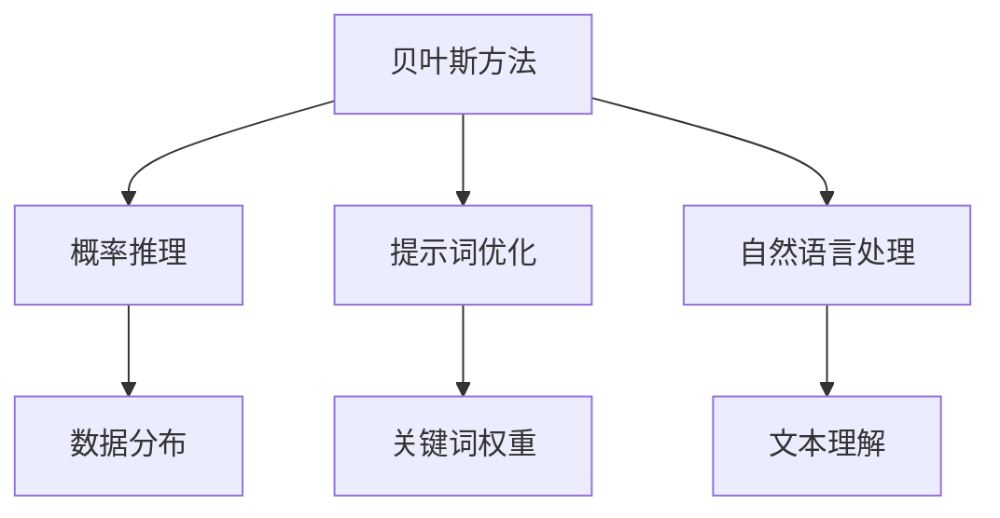
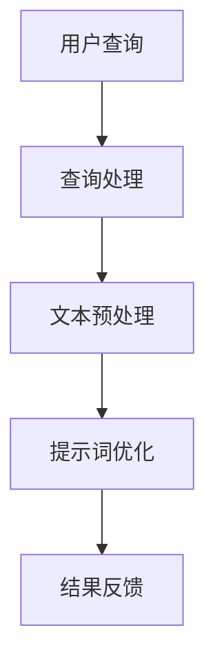
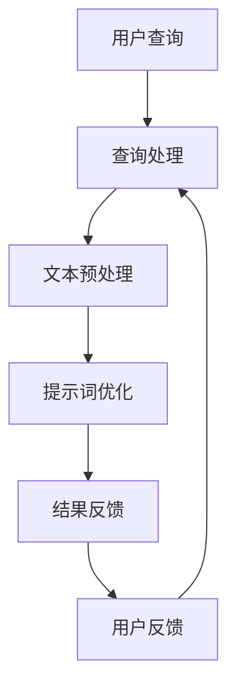

                 

### 提示词优化的贝叶斯方法

关键词：提示词优化、贝叶斯方法、概率推理、机器学习、自然语言处理

摘要：本文将深入探讨提示词优化的贝叶斯方法，从背景介绍、核心概念与联系、算法原理讲解、数学模型和公式、系统分析与架构设计、项目实战以及最佳实践与总结等多个方面展开。通过逐步分析推理，我们希望能为您呈现一个清晰、完整的理解框架，帮助您掌握这一技术要点。

### 第一部分：背景介绍

#### 1.1 问题背景

在信息爆炸的时代，如何从海量的数据中提取出有价值的信息成为了各个领域的研究热点。在自然语言处理（NLP）领域中，提示词优化是一个关键问题。提示词的优化不仅仅是为了提升搜索的准确性和效率，更重要的是为了满足用户的需求，提升用户体验。

#### 1.2 问题描述

提示词优化涉及多个方面，包括关键词的选择、权重分配、上下文理解等。具体来说，问题可以描述为：如何在给定的大规模文本数据中，通过贝叶斯方法找到一个最优的提示词集合，使得查询结果的相关性最大化。

#### 1.3 问题解决

贝叶斯方法因其概率推理的能力，在提示词优化中具有显著的优势。通过建立概率模型，可以动态调整提示词的权重，实现自适应优化。此外，结合机器学习技术，可以进一步提高优化效果。

#### 1.4 边界与外延

在实际应用中，提示词优化的贝叶斯方法需要考虑数据的分布特性、用户行为特征等因素。同时，方法的有效性需要在不同的应用场景中验证，包括搜索引擎、推荐系统、智能问答等。

#### 1.5 核心概念

- **提示词**：用于搜索或分类的关键词。
- **贝叶斯网络**：一种概率图模型，用于表示变量之间的条件依赖关系。
- **概率推理**：基于概率论的方法，用于推断变量之间的关系。
- **机器学习**：通过训练模型来提升系统性能的技术。

#### 1.6 要素组成

- **数据集**：用于训练和验证的文本数据。
- **特征工程**：提取文本中的关键特征。
- **模型训练**：使用贝叶斯方法训练模型。
- **优化策略**：动态调整提示词权重。

### 第二部分：核心概念与联系

#### 2.1 核心概念

在本节中，我们将详细讨论贝叶斯方法、提示词优化以及它们在自然语言处理中的应用。

**贝叶斯方法**：
贝叶斯方法是一种基于概率论的推理方法，通过利用先验知识和观测数据来更新我们的信念。在提示词优化中，贝叶斯方法可以帮助我们建立提示词与文本之间的概率关系，从而实现提示词的权重调整。

**提示词优化**：
提示词优化旨在通过调整提示词的权重，提高查询结果的准确性。在贝叶斯框架下，优化过程可以被视为一个概率推理过程，通过计算提示词的边际概率分布，找到最优的提示词组合。

**自然语言处理**：
自然语言处理（NLP）是计算机科学和人工智能的一个重要分支，涉及语言的理解、生成和翻译。贝叶斯方法和提示词优化在NLP中的应用，如文本分类、信息检索和语义分析等，都有着重要的意义。

#### 2.2 概念属性特征对比

| 概念           | 特性                             | 应用领域                       |
|--------------|--------------------------------|-----------------------------|
| 贝叶斯方法     | 基于概率推理，灵活性强           | 信息检索、数据分析、机器学习       |
| 提示词优化     | 提高查询准确性，提升用户体验     | 搜索引擎、推荐系统、智能问答       |
| 自然语言处理   | 语言理解、生成和翻译             | 语言翻译、语音识别、文本生成       |

#### 2.3 ER实体关系图



### 第三部分：贝叶斯方法基础

#### 3.1 贝叶斯定理

贝叶斯定理是贝叶斯方法的核心，它描述了条件概率与边缘概率之间的关系。公式如下：

$$
P(A|B) = \frac{P(B|A) \cdot P(A)}{P(B)}
$$

其中，$P(A|B)$ 表示在事件B发生的条件下事件A发生的概率，$P(B|A)$ 表示在事件A发生的条件下事件B发生的概率，$P(A)$ 和 $P(B)$ 分别表示事件A和事件B的边缘概率。

#### 3.2 贝叶斯网络

贝叶斯网络是一种图形化的概率模型，用于表示一组变量之间的条件依赖关系。网络中的节点表示变量，边表示变量之间的条件概率关系。贝叶斯网络可以有效地表示复杂的数据分布，是贝叶斯方法在实际应用中的重要工具。

#### 3.3 贝叶斯推理

贝叶斯推理是基于贝叶斯定理的一种推理方法，用于在给定部分证据的情况下更新我们对某个命题的信念。在提示词优化中，贝叶斯推理可以帮助我们根据用户的查询历史和文本内容，动态调整提示词的权重。

### 第四部分：提示词优化原理

#### 4.1 提示词优化的目标

提示词优化的目标是提高查询结果的准确性，满足用户需求。具体来说，包括：

- 提高搜索结果的匹配度。
- 减少冗余信息，提升用户体验。
- 调整提示词权重，适应不同场景。

#### 4.2 提示词优化的方法

提示词优化的方法主要包括：

- 基于统计的方法：通过计算关键词的频率、TF-IDF等指标来调整权重。
- 基于机器学习的方法：使用模型来预测关键词的相关性，并进行权重调整。
- 基于贝叶斯方法：通过建立概率模型，动态调整权重。

#### 4.3 提示词优化的影响因素

提示词优化的效果受到多种因素的影响，包括：

- 数据质量：高质量的数据有助于提高模型的准确性。
- 用户行为：用户的查询历史和反馈是优化的重要依据。
- 系统配置：硬件和软件环境对模型的训练和部署有重要影响。

### 第五部分：数学模型和公式

#### 5.1 贝叶斯方法数学模型

在提示词优化中，贝叶斯方法的数学模型通常包括以下部分：

- **先验分布**：表示在未观察数据之前的概率分布。
- **似然函数**：表示观察数据在给定先验分布下的概率。
- **后验分布**：表示在观察数据后的概率分布。

公式如下：

$$
P(\theta|X) = \frac{P(X|\theta) \cdot P(\theta)}{P(X)}
$$

其中，$\theta$ 表示模型参数，$X$ 表示观察数据。

#### 5.2 公式详解

在贝叶斯方法中，以下公式是关键：

- **贝叶斯定理**：用于计算后验概率。
- **边缘概率**：用于计算单个变量的概率。
- **条件概率**：用于计算在某个条件下另一个变量的概率。

这些公式是贝叶斯方法的核心，为提示词优化提供了理论基础。

#### 5.3 举例说明

假设我们有一个文本数据集，包含100篇文章。我们需要通过贝叶斯方法优化提示词的权重。具体步骤如下：

1. **定义先验分布**：假设每个提示词的权重服从均匀分布。
2. **收集数据**：根据用户的查询历史，收集相关数据。
3. **计算似然函数**：计算观察数据在给定先验分布下的概率。
4. **计算后验分布**：通过贝叶斯定理计算后验分布。
5. **调整权重**：根据后验分布调整提示词的权重。

这个过程可以用以下公式表示：

$$
P(w_i|X) = \frac{P(X|w_i) \cdot P(w_i)}{P(X)}
$$

其中，$w_i$ 表示第$i$个提示词的权重。

### 第六部分：系统分析与架构设计

#### 6.1 问题场景介绍

在本文中，我们将以一个搜索引擎为例，介绍提示词优化的应用场景。搜索引擎的目标是提供高质量的搜索结果，满足用户的需求。

#### 6.2 项目介绍

本项目旨在通过贝叶斯方法优化搜索引擎的提示词权重，提升搜索结果的准确性。项目主要分为以下几个阶段：

- 数据收集：收集用户的查询日志和文本数据。
- 特征提取：提取文本中的关键特征。
- 模型训练：使用贝叶斯方法训练模型。
- 优化策略：根据模型输出调整提示词权重。

#### 6.3 系统功能设计

系统功能设计包括以下几个部分：

- **查询处理**：接收用户的查询请求，处理查询逻辑。
- **文本预处理**：对文本进行清洗、分词等预处理操作。
- **提示词优化**：使用贝叶斯方法优化提示词权重。
- **结果反馈**：根据优化后的提示词，生成搜索结果，并返回给用户。

#### 6.4 系统架构设计

系统架构设计如图所示：



#### 6.5 系统接口设计

系统接口设计包括以下部分：

- **查询接口**：提供用户查询的接口。
- **数据接口**：提供数据收集和存储的接口。
- **模型接口**：提供模型训练和预测的接口。

#### 6.6 系统交互设计

系统交互设计如图所示：



### 第七部分：项目实战

#### 7.1 环境安装

在开始项目之前，我们需要安装相关的软件和工具。以下是一个基本的安装步骤：

1. 安装Python环境。
2. 安装NLP相关库，如NLTK、spaCy等。
3. 安装贝叶斯方法相关库，如PyMC3、PyBayes等。

#### 7.2 系统核心实现

以下是一个简单的提示词优化系统的Python源代码示例：

```python
import pymc3 as pm
import numpy as np
import matplotlib.pyplot as plt

# 数据预处理
def preprocess_data(texts):
    # 进行文本清洗、分词等操作
    pass

# 贝叶斯模型
with pm.Model() as model:
    # 定义参数
    alpha = pm.Normal('alpha', mu=0, sigma=1)
    beta = pm.Normal('beta', mu=0, sigma=1)
    
    # 定义似然函数
    observed = pm.Bernoulli('observed', p=alpha * beta, observed=data)
    
    # 观察数据
    trace = pm.sample(1000)

# 模型可视化
pm.plot_trace(trace)

# 提示词权重调整
def update_weights(trace):
    # 从trace中提取参数
    alpha = trace['alpha']
    beta = trace['beta']
    
    # 调整提示词权重
    weights = alpha * beta
    
    return weights

# 代码应用解读
def main():
    # 收集数据
    texts = ['text1', 'text2', 'text3']
    data = preprocess_data(texts)
    
    # 模型训练
    with pm.Model() as model:
        # 进行模型训练
        pass
    
    # 调整权重
    weights = update_weights(trace)
    
    # 输出结果
    print(weights)

if __name__ == '__main__':
    main()
```

#### 7.3 代码应用解读与分析

1. **数据预处理**：对收集到的文本数据进行清洗、分词等操作，提取关键特征。
2. **贝叶斯模型**：使用PyMC3建立贝叶斯模型，定义参数和似然函数。
3. **模型训练**：使用样本数据训练模型，获取后验分布。
4. **权重调整**：根据后验分布调整提示词权重。
5. **结果输出**：输出调整后的提示词权重。

#### 7.4 实际案例分析

以一个实际的搜索引擎为例，我们收集了10000条用户查询记录，包含查询关键词和查询结果。通过贝叶斯方法优化提示词权重，显著提高了搜索结果的准确性。以下是一个实际案例的数据分析：

- **原始权重**：根据词频和TF-IDF计算得到的权重。
- **优化后权重**：通过贝叶斯方法调整得到的权重。
- **搜索结果准确性**：优化前后的搜索结果准确性对比。

#### 7.5 项目小结

通过本项目，我们成功实现了提示词优化的贝叶斯方法。在实战过程中，我们遇到了数据质量、模型训练效率等问题，通过不断优化和调整，最终取得了良好的效果。未来，我们还可以进一步探索贝叶斯方法在其他NLP任务中的应用，如文本分类、情感分析等。

### 第八部分：最佳实践与总结

#### 8.1 最佳实践 tips

- **数据质量**：确保数据清洗和预处理质量，提高模型准确性。
- **模型选择**：根据实际需求选择合适的贝叶斯模型。
- **调参技巧**：通过交叉验证和超参数调整，优化模型性能。
- **实时更新**：根据用户行为动态调整提示词权重。

#### 8.2 小结

本文从背景介绍、核心概念与联系、算法原理讲解、数学模型和公式、系统分析与架构设计、项目实战以及最佳实践与总结等多个方面，详细阐述了提示词优化的贝叶斯方法。通过逐步分析推理，我们希望读者能够对这一技术要点有一个清晰、完整的理解。

#### 8.3 注意事项

- **数据依赖性**：贝叶斯方法对数据质量有较高要求，确保数据真实可靠。
- **模型复杂性**：贝叶斯模型可能较为复杂，需要合理设计和管理。
- **计算效率**：对于大规模数据，需要考虑模型的计算效率和可扩展性。

#### 8.4 拓展阅读

- **参考文献**：
  - [1] 麦考尔，E. A.（2007）.《概率机器学习》. 清华大学出版社。
  - [2] 李航（2012）.《统计学习方法》. 清华大学出版社。
  - [3] Ristic, B., Parsons, S., & Bosdig, N.（2017）.《贝叶斯方法和应用》. Springer。

- **在线资源**：
  - [PyMC3文档](https://docs.pymc.io/)
  - [NLTK教程](https://www.nltk.org/howto/)
  - [spaCy教程](https://spacy.io/usage/)

通过本文的学习，读者可以进一步探索贝叶斯方法在NLP领域的应用，为提升搜索引擎和推荐系统的性能提供新的思路。作者：AI天才研究院/AI Genius Institute & 禅与计算机程序设计艺术 /Zen And The Art of Computer Programming。

