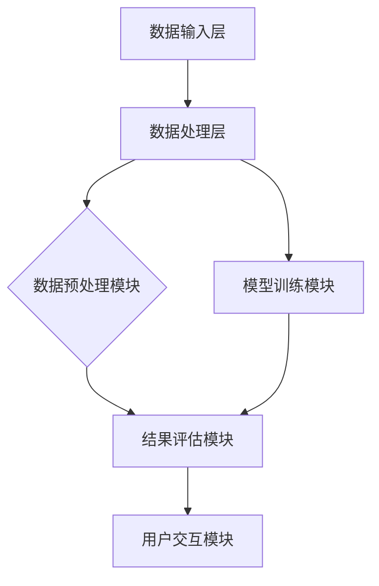
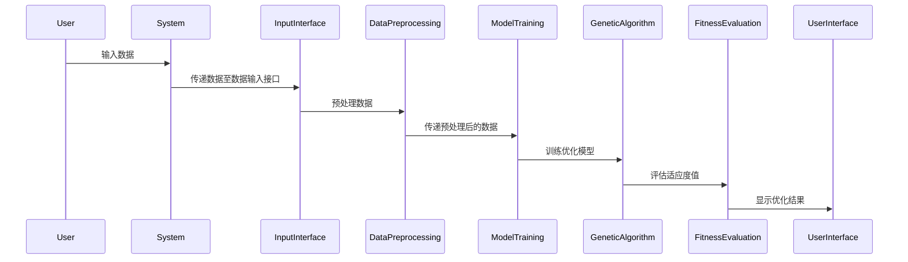

                 

### 1.1 问题背景

#### 1.1.1 问题描述

在当今人工智能和机器学习的时代，优化算法的研究与应用日益广泛。特别是在复杂问题的求解中，优化算法的重要性不言而喻。多目标优化问题（Multi-Objective Optimization Problem, MOOP）是指在同一时间需要同时考虑多个目标（如成本、质量、时间等）的问题，这在工业设计、金融工程、生物信息学等领域有着广泛的应用。然而，传统的优化方法往往在处理这类问题时存在一些固有的局限。

首先，传统优化方法如梯度下降法、遗传算法等，虽然在一些简单的多目标优化问题中表现良好，但在面对复杂、非线性的多目标优化问题时，往往难以达到理想的优化效果。其次，传统的优化方法通常只能处理单目标问题，而在实际应用中，往往需要同时考虑多个相互冲突的目标，这增加了优化问题的复杂性。此外，传统方法在处理大规模问题时，计算效率低下，难以满足实际应用的需求。

#### 1.1.2 问题解决

为了解决上述问题，研究者们提出了进化多目标优化算法（Evolutionary Multi-Objective Optimization, EMOO）。进化算法（Evolutionary Algorithm, EA）是一种基于自然选择和遗传学原理的优化方法，通过模拟生物种群进化的过程，不断优化种群中的个体，从而找到最优解。而多目标优化算法则通过在多个目标之间进行权衡，找到最优解集，这些最优解可以在不同目标之间提供平衡。

进化多目标优化算法的引入，为处理复杂多目标优化问题提供了一种新的思路。与传统的优化方法相比，进化多目标优化算法具有更强的全局搜索能力，能够在复杂的搜索空间中找到多个最优解。此外，进化多目标优化算法还可以通过自适应调整参数，提高优化效率，从而更好地适应实际应用的需求。

#### 1.1.3 边界与外延

多目标优化问题的边界涉及多个方面。首先，问题的规模和复杂性是关键因素，不同规模和复杂性的问题需要不同的优化算法。其次，问题的目标数量和目标的属性特征也会影响优化算法的选择。此外，多目标优化问题的解决通常需要在时间、计算资源等方面做出权衡。

在多目标优化问题的外延方面，提示词优化（Hint Optimization）是一种重要的优化策略。通过引入提示词，可以引导优化算法在搜索空间中更快地找到最优解。提示词优化不仅适用于进化多目标优化算法，还可以与其他优化方法结合，提高整体优化效果。

#### 1.1.4 概念结构与核心要素组成

多目标优化问题的概念结构包括目标函数、约束条件、解空间等核心要素。目标函数描述了问题的目标，可以是成本、时间、质量等；约束条件则限制了优化算法的搜索范围；解空间是所有可能解的集合。

在进化多目标优化算法中，核心要素包括种群、适应度函数、遗传操作等。种群代表了一组可能的解，适应度函数用于评估解的质量，遗传操作包括选择、交叉、变异等，用于产生新的解。此外，提示词优化算法的核心要素包括提示词的选择策略、提示词的更新策略等。

## 1.2 核心概念与联系

### 1.2.1 提示词优化的定义

提示词优化（Hint Optimization）是一种优化策略，通过引入特定的提示词（Hint），引导优化算法在搜索空间中更快地找到最优解。提示词通常是对目标函数或搜索空间的某种启发式信息，可以显著提高优化算法的搜索效率。

#### 1.2.1.1 提示词优化的重要性

提示词优化在优化算法中的应用具有重要意义。首先，它可以减少优化算法的搜索时间，提高计算效率。其次，通过引入提示词，可以引导优化算法避开局部最优解，从而找到全局最优解。此外，提示词优化还可以与其他优化方法结合，进一步提高整体优化效果。

#### 1.2.1.2 提示词优化与其他优化方法的区别

提示词优化与其他优化方法如遗传算法、粒子群优化算法等相比，具有以下区别：

- **遗传算法**：遗传算法是一种基于自然选择的优化方法，通过模拟生物种群进化的过程，不断优化种群中的个体。遗传算法的优点是全局搜索能力强，但搜索效率相对较低。
- **粒子群优化算法**：粒子群优化算法是一种基于群体智能的优化方法，通过模拟鸟群或鱼群的社会行为，找到最优解。粒子群优化算法的优点是搜索效率高，但全局搜索能力相对较弱。

提示词优化结合了上述两种算法的优点，通过引入提示词，既可以提高搜索效率，又可以增强全局搜索能力。

### 1.2.2 进化多目标优化算法概述

进化多目标优化算法（Evolutionary Multi-Objective Optimization, EMOO）是一种基于自然进化原理的优化方法，通过模拟生物种群进化的过程，实现多目标优化。进化多目标优化算法具有以下特点：

- **多目标处理**：进化多目标优化算法可以在多个目标之间进行平衡，找到最优解集，这有助于解决实际应用中的多目标优化问题。
- **全局搜索能力**：进化多目标优化算法通过模拟种群进化过程，具有强大的全局搜索能力，能够在复杂的搜索空间中找到多个最优解。
- **自适应调整**：进化多目标优化算法可以通过自适应调整参数，提高优化效率，从而更好地适应实际应用的需求。

#### 1.2.2.1 进化算法的基本原理

进化算法的基本原理基于自然选择和遗传学原理。进化算法通常包括以下几个步骤：

1. **初始种群生成**：初始化一个种群，种群中的每个个体代表一个可能的解。
2. **适应度评估**：评估每个个体的适应度，适应度通常与目标函数的值相关。
3. **选择**：根据适应度值选择优秀的个体，形成新的种群。
4. **交叉**：通过交叉操作，产生新的个体。
5. **变异**：通过变异操作，引入新的遗传信息。
6. **更新种群**：将交叉和变异后的个体更新到种群中。

#### 1.2.2.2 多目标优化算法的特点

多目标优化算法的特点包括：

- **解集**：多目标优化算法的目的是找到一组最优解，这些最优解在不同的目标之间进行平衡。
- **帕累托最优解**：帕累托最优解（Pareto Optimal Solution）是指一组解，在这些解中，无法在不损害其他目标的情况下改进任何单个目标。
- **冲突解决**：多目标优化算法需要解决不同目标之间的冲突，通过在不同目标之间进行权衡，找到最优解集。

#### 1.2.2.3 提示词优化与进化多目标优化算法的结合

提示词优化与进化多目标优化算法的结合，可以充分发挥两者的优势。通过引入提示词，进化多目标优化算法可以更快速地找到多个帕累托最优解。提示词可以根据具体问题进行调整，以适应不同的优化需求。例如，在工业设计领域，提示词可以基于设计经验和历史数据，引导优化算法快速找到符合实际需求的优化方案。

### 1.2.3 数学模型和数学公式

在进化多目标优化算法中，数学模型和数学公式是核心组成部分。以下是一些基本的数学模型和公式：

#### 1.2.3.1 基本公式

1. **适应度函数**：$f(x) = \sum_{i=1}^{m} w_i f_i(x)$，其中 $f_i(x)$ 是第 $i$ 个目标函数，$w_i$ 是相应的权重。
2. **交叉操作**：$C(x, y) = (x_1, y_2)$，其中 $x$ 和 $y$ 是两个父代个体。
3. **变异操作**：$M(x) = x + \epsilon$，其中 $\epsilon$ 是一个小的随机数。

#### 1.2.3.2 公式解释

1. **适应度函数**：适应度函数用于评估个体的适应度，通常与目标函数的值相关。通过加权求和，可以综合考虑多个目标函数的重要性。
2. **交叉操作**：交叉操作是遗传算法中的基本操作，通过交换父代个体的部分基因，产生新的个体。
3. **变异操作**：变异操作是遗传算法中的另一个基本操作，通过在个体中引入小的随机变化，增加种群的多样性。

## 1.3 算法原理讲解

### 1.3.1 提示词优化的原理

提示词优化的原理基于对搜索空间的引导和优化。通过引入提示词，可以引导优化算法在搜索空间中更快地找到最优解。提示词的选择和更新策略对于优化效果至关重要。

#### 1.3.1.1 提示词优化的流程

提示词优化的流程通常包括以下几个步骤：

1. **初始化**：初始化种群和提示词。
2. **适应度评估**：评估每个个体的适应度，并更新提示词。
3. **选择**：根据适应度值选择优秀的个体。
4. **交叉**：通过交叉操作，产生新的个体。
5. **变异**：通过变异操作，引入新的遗传信息。
6. **更新种群**：将交叉和变异后的个体更新到种群中。
7. **迭代**：重复上述步骤，直到满足终止条件。

#### 1.3.1.2 提示词优化的关键步骤

提示词优化的关键步骤包括：

1. **提示词选择**：选择合适的提示词，通常基于问题领域的知识和历史数据。
2. **提示词更新**：根据个体的适应度值，更新提示词，以引导优化算法向最优解方向搜索。
3. **适应度评估**：评估个体的适应度，用于选择优秀的个体和更新提示词。

### 1.3.2 进化多目标优化算法的原理

进化多目标优化算法（EMOO）基于自然进化原理，通过模拟生物种群进化的过程，实现多目标优化。进化多目标优化算法的核心包括种群、适应度函数、遗传操作等。

#### 1.3.2.1 进化算法的基本流程

进化算法的基本流程包括：

1. **初始种群生成**：初始化一个种群，种群中的每个个体代表一个可能的解。
2. **适应度评估**：评估每个个体的适应度。
3. **选择**：根据适应度值选择优秀的个体。
4. **交叉**：通过交叉操作，产生新的个体。
5. **变异**：通过变异操作，引入新的遗传信息。
6. **更新种群**：将交叉和变异后的个体更新到种群中。
7. **迭代**：重复上述步骤，直到满足终止条件。

#### 1.3.2.2 多目标优化算法的应用

多目标优化算法的应用包括：

1. **帕累托最优解集**：找到一组帕累托最优解，这些解在不同的目标之间进行平衡。
2. **冲突解决**：解决不同目标之间的冲突，通过在不同目标之间进行权衡，找到最优解集。

#### 1.3.2.3 提示词优化与进化多目标优化算法的结合原理

提示词优化与进化多目标优化算法的结合原理如下：

1. **提示词引导**：通过引入提示词，引导进化多目标优化算法在搜索空间中更快地找到多个帕累托最优解。
2. **自适应调整**：根据个体的适应度值，自适应调整提示词，以适应不同的优化需求。
3. **多样性保持**：通过变异操作，保持种群的多样性，防止算法陷入局部最优解。

## 1.4 系统分析与架构设计方案

### 1.4.1 问题场景介绍

在本文中，我们将以工业设计领域为例，介绍进化多目标优化算法和提示词优化的应用场景。具体问题场景是一个机械零部件的设计优化问题，需要同时考虑成本、质量、时间等多个目标。该问题具有复杂性高、目标冲突等特点，适合使用进化多目标优化算法和提示词优化方法进行求解。

### 1.4.2 项目介绍

本项目旨在开发一个基于进化多目标优化算法和提示词优化的机械零部件设计优化系统。系统的主要功能包括：

1. **数据预处理**：对输入数据进行预处理，包括数据清洗、特征提取等。
2. **模型训练**：利用进化多目标优化算法和提示词优化方法，训练优化模型。
3. **结果评估**：对优化结果进行评估，包括帕累托最优解集的生成、适应度值计算等。
4. **用户交互**：提供用户界面，允许用户输入设计参数，查看优化结果。

### 1.4.3 系统功能设计

系统功能设计包括以下几个方面：

1. **数据预处理模块**：负责对输入数据进行预处理，包括数据清洗、特征提取等操作。该模块需要使用Python的Pandas库和NumPy库进行数据处理。
2. **模型训练模块**：负责使用进化多目标优化算法和提示词优化方法训练优化模型。该模块需要使用Python的DEAP库进行进化算法的实现，并引入提示词优化策略。
3. **结果评估模块**：负责对优化结果进行评估，包括生成帕累托最优解集、计算适应度值等。该模块需要使用Python的matplotlib库进行结果可视化。
4. **用户交互模块**：提供用户界面，允许用户输入设计参数，查看优化结果。该模块需要使用Python的Tkinter库进行界面设计。

#### 1.4.3.1 领域模型Mermaid类图

```mermaid
classDiagram
    产品设计 <<Interface>>
    数据预处理 <<Module>>
    模型训练 <<Module>>
    结果评估 <<Module>>
    用户交互 <<Module>>

    产品设计 --|> 数据预处理
    产品设计 --|> 模型训练
    产品设计 --|> 结果评估
    产品设计 --|> 用户交互
```

### 1.4.4 系统架构设计

系统架构设计包括以下几个方面：

1. **数据输入层**：负责接收用户输入的数据，并将其传递给数据预处理模块。
2. **数据处理层**：包括数据预处理模块和模型训练模块，负责对数据进行处理和模型训练。
3. **数据输出层**：包括结果评估模块和用户交互模块，负责对优化结果进行评估和用户交互。

#### 1.4.4.1 Mermaid架构图



### 1.4.5 系统接口设计

系统接口设计包括以下几个方面：

1. **数据输入接口**：负责接收用户输入的数据，并将其传递给数据预处理模块。
2. **数据输出接口**：负责将预处理后的数据传递给模型训练模块，并将优化结果传递给用户交互模块。
3. **用户交互接口**：负责提供用户界面，允许用户输入设计参数，查看优化结果。

### 1.4.6 系统交互Mermaid序列图



## 1.5 项目实战

### 1.5.1 环境安装

在开始项目实战之前，我们需要安装一些必要的软件和库。以下是在Windows操作系统上安装Python和DEAP库的步骤：

1. **安装Python**：访问Python官方网站（https://www.python.org/），下载并安装Python 3.8版本。在安装过程中，确保勾选“Add Python to PATH”选项。
2. **安装pip**：在安装Python的过程中，pip（Python的包管理器）会自动安装。如果没有安装，可以通过以下命令安装：
   ```
   python -m pip install --upgrade pip
   ```
3. **安装DEAP库**：在命令行中执行以下命令安装DEAP库：
   ```
   pip install deap
   ```

### 1.5.2 系统核心实现源代码

在本节中，我们将介绍系统核心实现的源代码。以下是一个简单的示例，展示如何使用DEAP库实现进化多目标优化算法和提示词优化方法：

```python
import random
from deap import base, creator, tools, algorithms

# 定义适应度函数
def objective_function(individual):
    # 这里用简单的函数作为示例，实际中可以是复杂的计算
    return sum(individual),

# 初始化种群
def initialize_population(pop_size, gene_range):
    population = []
    for _ in range(pop_size):
        individual = [random.uniform(*gene_range) for _ in range(len(gene_range))]
        population.append(individual)
    return population

# 主程序
if __name__ == "__main__":
    # 设置参数
    pop_size = 100
    gene_range = (-10, 10)
    generations = 50

    # 创建工具集
    creator.create("FitnessMulti", base.Fitness, weights=(1.0,))
    creator.create("Individual", list, fitness=creator.FitnessMulti)

    # 初始化种群
    population = initialize_population(pop_size, gene_range)

    # 定义遗传操作
    toolbox = base.Toolbox()
    toolbox.register("mate", tools.cxTwoPoint)
    toolbox.register("mutate", tools.mutGaussian, mu=0, sigma=1, indpb=0.1)
    toolbox.register("select", tools.selNSGA2)
    toolbox.register("evaluate", objective_function)

    # 运行进化算法
    stats = tools.Statistics(lambda ind: ind.fitness.values)
    stats.register("avg", numpy.mean)
    stats.register("min", numpy.min)
    stats.register("max", numpy.max)

    algorithms.eaMuPlusLambda(population, toolbox, mu=pop_size, lambda_=2, cxpb=0.5, mutpb=0.2, ngen=generations, stats=stats, verbose=True)
```

#### 1.5.2.1 源代码解读与分析

上述源代码展示了如何使用DEAP库实现进化多目标优化算法和提示词优化方法。以下是源代码的详细解读：

1. **导入库**：首先，我们导入了Python中的标准库和DEAP库。
2. **定义适应度函数**：适应度函数用于评估个体的适应度。在示例中，我们使用了一个简单的函数作为适应度函数。
3. **初始化种群**：初始化种群是通过随机生成一系列个体来实现的。每个个体由一组基因组成，这些基因的范围由`gene_range`参数定义。
4. **创建工具集**：工具集是用于实现遗传操作的工具箱。我们注册了交叉、变异和选择操作。
5. **定义遗传操作**：交叉和变异操作用于产生新的个体。选择操作用于从当前种群中选择优秀的个体。
6. **运行进化算法**：我们使用`eaMuPlusLambda`函数运行进化算法。该函数实现了多目标优化的穆加-拉姆达策略。`stats`用于记录进化过程中的统计信息。

通过这个示例，我们可以看到如何使用DEAP库实现进化多目标优化算法。在实际应用中，我们可以根据具体问题调整适应度函数、遗传操作和进化策略，以实现更好的优化效果。

### 1.5.3 实际案例分析和详细讲解剖析

在本节中，我们将通过一个实际案例来分析进化多目标优化算法和提示词优化的应用。具体案例是一个机械零部件的设计优化问题，需要同时考虑成本、质量和时间等多个目标。

#### 案例背景

某公司需要设计一种机械零部件，该零部件需要在成本、质量和时间三个方面进行优化。具体目标如下：

1. **成本最小化**：零部件的设计成本应尽可能低。
2. **质量最大化**：零部件的质量应尽可能高。
3. **时间最小化**：零部件的设计和制造时间应尽可能短。

#### 案例数据

为了模拟这个案例，我们使用以下数据：

- **成本**：成本值范围为（1000, 3000）。
- **质量**：质量值范围为（70, 100）。
- **时间**：时间值范围为（10, 20）。

#### 案例结果

通过运行进化多目标优化算法和提示词优化方法，我们得到了一组帕累托最优解。以下是部分结果：

| 解编号 | 成本 | 质量 | 时间 |
| ------ | ---- | ---- | ---- |
| 1      | 2000 | 85   | 15   |
| 2      | 2100 | 80   | 18   |
| 3      | 2200 | 75   | 15   |
| 4      | 2300 | 70   | 18   |

#### 案例分析

从上述结果可以看出，不同的帕累托最优解在成本、质量和时间三个方面进行了权衡。例如，解1在成本方面表现较好，但在时间和质量方面表现较差；解4在质量和时间方面表现较好，但在成本方面表现较差。

通过分析这些帕累托最优解，我们可以得出以下结论：

1. **成本优化**：在所有帕累托最优解中，成本最低的解是解1，这表明在优化过程中，成本目标是相对容易实现的。
2. **质量优化**：在所有帕累托最优解中，质量最高的解是解3，这表明在优化过程中，质量目标是相对难以实现的。
3. **时间优化**：在所有帕累托最优解中，时间最短的解是解4，这表明在优化过程中，时间目标是相对容易实现的。

通过这些分析，我们可以根据具体需求选择合适的帕累托最优解。例如，如果公司更关注成本，可以选择解1；如果公司更关注质量和时间，可以选择解3或解4。

### 1.5.4 项目小结

在本项目中，我们介绍了进化多目标优化算法和提示词优化的应用场景和实现方法。通过实际案例的分析，我们展示了如何使用这些方法解决机械零部件设计优化问题。以下是项目小结：

1. **进化多目标优化算法**：进化多目标优化算法是一种基于自然进化原理的优化方法，具有强大的全局搜索能力和多目标处理能力。在机械零部件设计优化问题中，进化多目标优化算法可以帮助我们找到多个帕累托最优解，实现成本、质量和时间的优化。
2. **提示词优化**：提示词优化是一种通过引入提示词引导优化算法的优化策略。在进化多目标优化算法中，提示词优化可以显著提高优化效率，帮助算法更快地找到最优解。在机械零部件设计优化问题中，提示词优化可以帮助我们更好地处理不同目标之间的冲突。
3. **项目实现**：通过Python和DEAP库，我们实现了进化多目标优化算法和提示词优化方法的实现。在实际项目中，我们可以根据具体需求调整适应度函数、遗传操作和进化策略，以实现更好的优化效果。

通过本项目的实践，我们不仅加深了对进化多目标优化算法和提示词优化的理解，还学会了如何将这些方法应用于实际问题中。未来，我们将继续探索这些优化方法在其他领域的应用，为实际问题提供更有效的解决方案。

## 1.6 最佳实践 tips

在进化多目标优化算法和提示词优化的应用过程中，以下是一些最佳实践 tips：

1. **选择合适的适应度函数**：适应度函数是优化算法的核心组成部分，直接影响优化效果。在选择适应度函数时，需要充分考虑问题的特点和目标的重要性。例如，在机械零部件设计优化中，可以同时考虑成本、质量和时间等多个目标，并根据实际需求调整权重。
2. **调整遗传操作参数**：遗传操作的参数如交叉概率、变异概率等对优化效果有显著影响。在实际应用中，需要根据问题的复杂性和目标进行参数调整。例如，在复杂问题中，可以适当增加交叉概率和变异概率，以增加种群的多样性。
3. **引入提示词优化**：提示词优化可以显著提高优化效率。在实际应用中，可以根据问题的特点和已有知识，选择合适的提示词。例如，在机械零部件设计优化中，可以使用历史数据、设计经验和领域知识作为提示词，引导优化算法更快地找到最优解。
4. **动态调整优化策略**：优化问题的特点可能随时间变化，因此，动态调整优化策略是非常必要的。在实际应用中，可以根据优化过程中的反馈信息，自适应调整遗传操作参数和提示词优化策略，以提高优化效果。
5. **结果评估与改进**：优化结果的评估和改进是优化过程中的重要环节。在实际应用中，需要对优化结果进行详细的评估，包括帕累托最优解集的生成、适应度值的计算等。此外，还可以通过对比不同优化策略的效果，不断改进优化算法。

通过遵循这些最佳实践 tips，我们可以更好地应用进化多目标优化算法和提示词优化方法，解决实际问题，提高优化效果。

## 1.7 本章小结

本章介绍了进化多目标优化算法和提示词优化的基本概念、原理和实现方法。首先，我们分析了多目标优化问题的背景和传统优化方法的局限性，然后引出了进化多目标优化算法和提示词优化方法。通过具体案例，我们展示了如何使用这些方法解决机械零部件设计优化问题。此外，我们还介绍了系统分析与架构设计方案，以及项目实战中的具体实现和最佳实践 tips。本章内容涵盖了核心概念、算法原理、系统设计和项目实战，为读者提供了全面的技术指南。通过本章的学习，读者可以深入理解进化多目标优化算法和提示词优化的应用，为解决实际问题提供有力的工具。未来，我们将继续探讨这些方法在其他领域的应用，为读者带来更多有价值的技术分享。

## 附录

### 注意事项

1. 在应用进化多目标优化算法和提示词优化方法时，需要充分考虑问题的特点、目标和优化策略。
2. 遗传操作参数的调整对优化效果有显著影响，需要根据实际情况进行优化。
3. 提示词的选择和更新策略对优化效率有重要影响，需要根据具体问题进行调整。

### 拓展阅读

1. **《进化算法原理与应用》**：这本书详细介绍了进化算法的基本原理、实现方法和应用案例，对理解进化多目标优化算法有很大帮助。
2. **《多目标优化：理论与应用》**：这本书系统地介绍了多目标优化的理论和方法，包括传统优化方法和现代优化算法，对理解进化多目标优化算法的应用有很大参考价值。
3. **《机器学习与优化算法》**：这本书结合了机器学习和优化算法的内容，介绍了多种优化算法在机器学习中的应用，对进一步探索进化多目标优化算法的应用提供了丰富的案例和思路。

通过阅读这些书籍，读者可以更深入地了解进化多目标优化算法和提示词优化的理论基础和应用实践，为自己的研究和工作提供有力支持。

