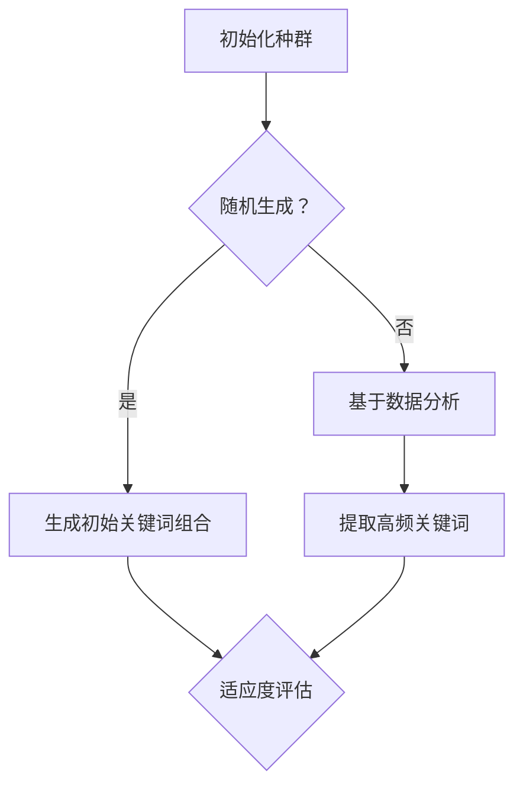
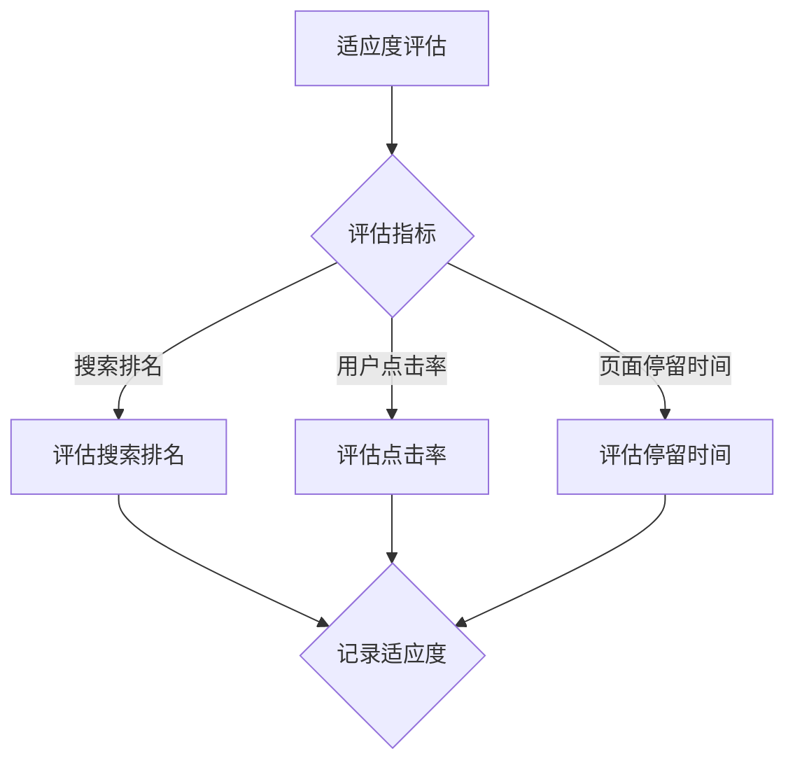
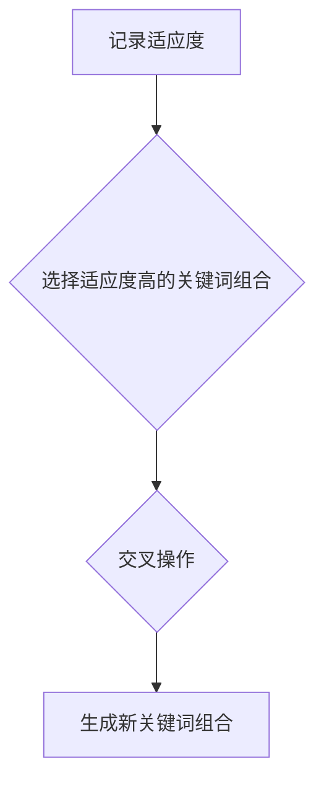
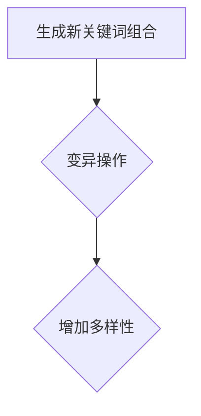
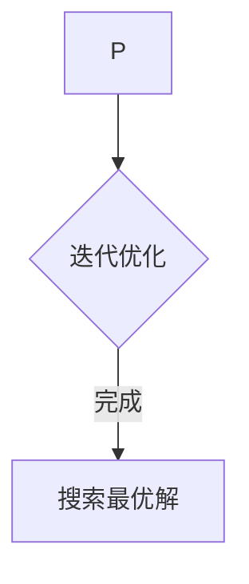

                 

### 提示词优化的概念与历史发展

**1.1.1 提示词优化的定义与重要性**

提示词优化（Keyword Optimization）是指通过分析和调整文本中的关键词，以提高文本的搜索排名、用户点击率或相关性。在搜索引擎优化（SEO）领域，提示词优化尤为重要。它不仅关系到网站在搜索引擎结果页面（SERP）中的位置，还影响用户对网站内容的初次感知和后续访问行为。

关键词在搜索引擎中的重要性主要体现在以下几个方面：

1. **提升搜索排名**：选择适当的关键词可以显著提高网站在搜索引擎结果中的排名，从而增加网站曝光度。
2. **提高用户点击率**：合理的关键词能够吸引用户点击，增加网站流量。
3. **增强内容相关性**：准确的关键词可以提升内容与用户需求的匹配度，提高用户体验。

**1.1.2 提示词优化的历史发展**

提示词优化并不是一个新兴的概念，它的历史可以追溯到搜索引擎诞生之初。以下是一些关键的发展阶段：

- **早期优化方法**：在搜索引擎早期，优化者主要通过增加关键词密度、构建外部链接等方式来提升网站排名。这种方法相对简单，但也容易导致过度优化和搜索结果的质量下降。
- **关键词研究工具的出现**：随着搜索引擎算法的复杂化，优化者开始使用关键词研究工具（如Google AdWords Keyword Planner）来帮助选择合适的关键词。
- **语义搜索的兴起**：现代搜索引擎更注重理解用户的真实意图，而非简单地匹配关键词。因此，语义搜索和自然语言处理（NLP）技术逐渐成为提示词优化的重要手段。
- **进化策略的应用**：近年来，进化策略（Evolutionary Strategies，简称ES）等基于人工智能的优化方法开始应用于提示词优化，为解决复杂优化问题提供了新的思路。

**1.1.3 提示词优化与其他优化方法的比较**

提示词优化与其他优化方法在目标和手段上有所不同。以下是几种常见优化方法的对比：

- **SEO（搜索引擎优化）**：SEO旨在提高网站在搜索引擎中的排名，方法包括关键词优化、内容优化、链接建设等。SEO强调长期策略和内容质量，而提示词优化则是SEO的一部分，更侧重于关键词的选择和调整。
- **SEM（搜索引擎营销）**：SEM通过在搜索引擎上投放广告来吸引用户，关键词优化是SEM中的一项重要策略。与SEO相比，SEM更注重短期效果和广告投放策略。
- **A/B 测试**：A/B 测试是通过对比不同版本的内容，以确定哪个版本更能满足用户需求和提升转化率。A/B 测试可以应用于提示词优化，通过测试不同关键词的效果来找到最佳选择。

总的来说，提示词优化是一个多维度、多层次的优化过程，需要综合考虑关键词选择、内容质量、用户行为等多方面因素。通过历史发展和比较分析，我们可以更清晰地理解提示词优化的本质和其在现代互联网环境中的重要性。

### 提示词优化的历史发展

提示词优化作为搜索引擎优化（SEO）的重要组成部分，其历史发展可以追溯到互联网的早期。在互联网初期，搜索引擎的功能相对简单，主要依靠关键词匹配来呈现搜索结果。因此，提示词优化的核心手段主要是通过增加关键词密度、构建外部链接等来提高网站在搜索引擎结果中的排名。

#### 早期优化方法

在互联网初期，优化者主要采用以下几种方法进行提示词优化：

1. **增加关键词密度**：通过在网页内容中多次重复目标关键词，以提高搜索引擎对关键词的识别度。这种方法被称为“关键词堆砌”（keyword stuffing）。
2. **构建外部链接**：通过在其他网站上建立指向自己网站的链接，增加网站的权重和可信度。这种方法被称为“链接建设”（link building）。
3. **元标签优化**：在网页的元标签（如`<title>`和`<meta name="description">`）中添加关键词，以提高搜索结果的相关性。

然而，这些早期方法存在一些缺陷。例如，关键词堆砌可能导致内容质量下降，搜索引擎算法的改进使其效果减弱。此外，过度依赖外部链接可能导致网站权重的不稳定。

#### 进化策略的兴起

随着搜索引擎算法的日益复杂，优化者开始寻求更加智能和高效的优化方法。进化策略（Evolutionary Strategies，简称ES）作为一类基于自然进化原理的优化算法，逐渐在提示词优化领域崭露头角。

进化策略的核心思想是通过模拟生物进化过程，逐步搜索到最优解。其基本步骤包括：

1. **初始化种群**：随机生成一组初始关键词组合，作为初始种群。
2. **适应度评估**：通过搜索引擎的搜索结果和用户行为数据，评估每个关键词组合的适应度。适应度越高，意味着关键词组合越符合用户需求。
3. **选择与交叉**：根据适应度，选择适应度较高的关键词组合进行交叉，生成新的关键词组合。
4. **变异与更新**：对部分关键词组合进行随机变异，以增加种群的多样性。
5. **迭代优化**：重复上述步骤，逐步优化关键词组合。

相比传统优化方法，进化策略具有以下优势：

1. **全局搜索能力**：进化策略通过模拟自然进化过程，可以在搜索空间中全局搜索最优解，而不仅仅是局部最优。
2. **自动调整策略**：进化策略可以根据适应度动态调整优化策略，提高优化效果。
3. **适应性**：进化策略可以适应不同场景和数据集，具有广泛的应用前景。

#### 进化策略的应用

进化策略在提示词优化中的应用主要体现在以下几个方面：

1. **关键词组合优化**：进化策略可以通过多次迭代，找到最佳的关键词组合，从而提高网站在搜索引擎中的排名和用户点击率。
2. **多目标优化**：进化策略可以同时优化多个目标，如搜索排名、用户点击率和内容相关性。
3. **动态调整**：进化策略可以根据用户行为和搜索引擎算法的更新，动态调整关键词组合，以适应不断变化的市场环境。

总之，提示词优化的历史发展从早期的简单方法到进化策略的应用，体现了优化技术的发展和进步。进化策略以其强大的全局搜索能力和自动调整能力，为提示词优化提供了新的思路和工具，有助于优化者在复杂的搜索环境中获得更好的效果。

### 提示词优化与其他优化方法的比较

提示词优化作为SEO（搜索引擎优化）的核心环节，与其他优化方法在目标和实现手段上各有侧重。以下将对比SEO、SEM和A/B测试等优化方法，探讨各自的优势和适用场景。

#### SEO（搜索引擎优化）

SEO的目标是通过优化网站结构和内容，提高网站在搜索引擎中的自然排名，从而吸引更多有机流量。SEO的核心手段包括：

1. **关键词研究**：选择与用户需求高度匹配的关键词，并合理分布在网页的标题、元标签、内容等位置。
2. **内容优化**：创建高质量、对用户有价值的内容，提高用户停留时间和页面交互率。
3. **链接建设**：通过获取高质量的外部链接，提升网站权威性和可信度。
4. **技术优化**：优化网站技术细节，如网站速度、移动适配、安全性等，以提高搜索引擎的抓取和索引效率。

SEO的优点在于：

- **长期性**：通过持续优化，网站可以在较长时间内维持较好的搜索排名。
- **成本效益**：相较于SEM，SEO带来的流量成本较低。

但SEO的缺点也较为明显：

- **优化周期长**：SEO效果显现需要时间，优化效果不如SEM立竿见影。
- **竞争激烈**：热门关键词的竞争激烈，优化难度大。

适用场景：适用于那些追求长期流量和品牌建设的网站，如电商平台、内容平台等。

#### SEM（搜索引擎营销）

SEM通过在搜索引擎上投放付费广告，吸引用户点击并访问网站。SEM的关键词优化主要包括：

1. **关键词选择**：选择与广告内容和目标用户群体高度相关的关键词。
2. **广告撰写**：撰写吸引人的广告文案，提高点击率。
3. **竞价策略**：通过调整竞价策略，优化广告投放效果。

SEM的优点包括：

- **短期效果显著**：通过付费广告，可以快速提高网站曝光度和访问量。
- **可控性**：广告投放和预算可控，可以根据需求灵活调整。

缺点包括：

- **成本较高**：SEM需要支付广告费用，成本相对较高。
- **依赖广告平台**：SEM效果受搜索引擎广告平台政策的影响。

适用场景：适用于那些需要快速获取流量和转化的企业，如电子商务、在线教育等。

#### A/B 测试

A/B 测试是一种通过对比不同版本的内容，确定哪种版本更能满足用户需求和提升转化率的方法。在提示词优化中，A/B 测试可以用于测试不同关键词组合的效果。

A/B 测试的优点包括：

- **科学性**：通过数据驱动的方式，科学地比较不同版本的差异。
- **灵活性**：可以根据测试结果灵活调整优化策略。

缺点包括：

- **成本和资源消耗**：A/B 测试需要大量的测试数据和资源。
- **适用场景有限**：主要适用于优化特定的指标，如点击率、转化率等。

适用场景：适用于那些需要快速迭代和优化的场景，如广告创意、网页设计等。

总的来说，提示词优化需要综合考虑SEO、SEM和A/B测试等多种优化方法，根据具体目标和场景选择合适的优化策略。SEO注重长期流量和品牌建设，SEM追求短期流量和转化，A/B测试提供数据驱动的决策依据。通过多种方法的有机结合，可以更全面地提升网站在搜索引擎中的表现。

### 进化策略的基本原理

进化策略（Evolutionary Strategies，简称ES）是一种基于自然进化原理的优化算法，广泛应用于机器学习、人工智能等领域。其核心思想是通过模拟生物进化过程，逐步搜索到最优解。以下是进化策略的基本原理：

#### 1. 初始化种群

进化策略的第一步是初始化种群。在提示词优化中，种群可以看作是一组关键词组合。初始化种群的方法可以是随机生成，也可以是基于已有数据的统计分析。例如，可以从网站的历史搜索数据中提取高频关键词，作为初始种群的候选关键词。



#### 2. 适应度评估

适应度评估是进化策略中的关键环节。通过模拟搜索引擎的搜索结果和用户行为数据，评估每个关键词组合的适应度。适应度越高，意味着关键词组合越符合用户需求。常见的评估指标包括搜索排名、用户点击率、页面停留时间等。



#### 3. 选择与交叉

在评估完种群的适应度后，进化策略会根据适应度值选择适应度较高的关键词组合进行交叉。交叉操作可以看作是关键词组合的“交配”，通过随机组合种群中的关键词，生成新的关键词组合。



#### 4. 变异与更新

在生成新关键词组合后，进化策略会对部分关键词组合进行变异操作。变异可以看作是关键词组合的“突变”，通过随机改变关键词组合中的某个或某些关键词，增加种群的多样性。



#### 5. 迭代优化

最后，进化策略会重复上述步骤，通过迭代优化逐步搜索到最优解。每次迭代都会根据新的适应度值调整种群，优化关键词组合。这个过程可以看作是关键词组合的不断进化，逐渐适应用户需求。



总之，进化策略通过模拟自然进化过程，逐步优化关键词组合，从而提高搜索效果。其核心原理包括初始化种群、适应度评估、选择与交叉、变异与更新以及迭代优化。通过这些步骤，进化策略能够在复杂的搜索空间中高效地搜索到最优解。

### 进化策略的数学模型

进化策略（Evolutionary Strategies，简称ES）是一种基于自然进化原理的优化算法，其核心在于通过迭代过程不断优化解空间中的个体。为了更好地理解和应用进化策略，我们需要从数学模型的角度对其进行详细分析。

#### 数学模型概述

进化策略的数学模型可以表述为：

$$
x_{t+1} = x_t + \eta \cdot \sum_{i=1}^N \alpha_i (x_i - x_t)
$$

其中，$x_t$ 表示第 $t$ 代个体的位置，$x_{t+1}$ 表示第 $t+1$ 代个体的位置，$\eta$ 表示学习率，$N$ 表示种群大小，$\alpha_i$ 表示第 $i$ 个个体的适应度。

#### 变异和交叉操作

在进化策略中，变异和交叉操作是关键步骤。变异操作可以通过以下公式进行：

$$
x_i' = x_i + \eta \cdot \epsilon
$$

其中，$\epsilon$ 是一个小的随机扰动，用于增加种群的多样性。

交叉操作则是通过组合两个或多个个体的位置来生成新的个体。一个简单的交叉公式可以是：

$$
x_{t+1} = (1 - \rho) \cdot x_1 + \rho \cdot x_2
$$

其中，$\rho$ 是交叉概率。

#### 适应度函数

适应度函数是评估个体优劣的重要工具。在提示词优化中，适应度函数通常与搜索排名、点击率等指标相关。一个常见的适应度函数可以定义为：

$$
f(x) = \frac{1}{1 + e^{-\beta \cdot (rank(x) - target\_rank)}}
$$

其中，$rank(x)$ 表示个体 $x$ 在搜索结果中的排名，$target\_rank$ 表示目标排名，$\beta$ 是调节参数。

#### 进化策略的过程

进化策略的迭代过程可以概括为以下步骤：

1. **初始化**：随机生成初始种群 $x_0, x_1, ..., x_{N-1}$。
2. **适应度评估**：计算每个个体的适应度 $f(x_0), f(x_1), ..., f(x_{N-1})$。
3. **选择**：根据适应度值选择适应度较高的个体进行交叉和变异。
4. **交叉**：使用交叉操作生成新的个体。
5. **变异**：对部分个体进行变异操作。
6. **更新**：将新个体加入种群，进行下一次迭代。

通过不断迭代，进化策略能够逐步优化个体的位置，找到最优解。

#### 实例说明

假设我们有一个关键词优化问题，需要找到一组最优的关键词组合来提高搜索排名。初始种群为：

$$
x_0 = [0.1, 0.2, 0.3], \quad x_1 = [0.4, 0.5, 0.6], \quad x_2 = [0.7, 0.8, 0.9]
$$

适应度函数为：

$$
f(x) = \frac{1}{1 + e^{-\beta \cdot (rank(x) - 10)}}
$$

设 $\eta = 0.1, N = 3, \alpha_0 = 0.8, \alpha_1 = 0.2, \alpha_2 = 0.1$。

第一次迭代：

- **适应度评估**：$f(x_0) = 0.5, f(x_1) = 0.6, f(x_2) = 0.4$。
- **选择**：选择 $x_1$ 和 $x_2$ 进行交叉。
- **交叉**：$x_{t+1} = (1 - \rho) \cdot x_1 + \rho \cdot x_2$，假设 $\rho = 0.5$，则 $x_{t+1} = [0.3, 0.4, 0.5]$。
- **变异**：对 $x_0$ 进行变异，$x_0' = x_0 + \eta \cdot \epsilon$，假设 $\epsilon = 0.1$，则 $x_0' = [0.2, 0.3, 0.4]$。

第二次迭代：

- **适应度评估**：$f(x_0') = 0.55, f(x_{t+1}) = 0.65, f(x_2) = 0.4$。
- **选择**：选择 $x_{t+1}$ 进行交叉。
- **交叉**：$x_{t+2} = (1 - \rho) \cdot x_0' + \rho \cdot x_{t+1}$，假设 $\rho = 0.5$，则 $x_{t+2} = [0.35, 0.45, 0.5]$。

通过上述迭代过程，我们可以看到进化策略逐步优化关键词组合，逐步逼近最优解。

总之，进化策略的数学模型通过适应度函数、选择、交叉和变异操作，实现种群的迭代优化。在提示词优化中，该模型能够有效地搜索到最优关键词组合，提高搜索排名和用户点击率。

### 进化策略在提示词优化中的实现

进化策略（Evolutionary Strategies，简称ES）在提示词优化中具有显著的应用潜力。以下将通过Python代码示例详细阐述进化策略在提示词优化中的实现步骤，包括种群初始化、适应度评估、选择与交叉、变异与更新等过程。

#### 1. 种群初始化

首先，我们需要初始化一个关键词种群。为了简单起见，我们可以从现有的关键词数据集中随机选取一部分关键词作为初始种群。以下是一个Python代码示例：

```python
import numpy as np

# 假设已有100个关键词，这里随机选取10个作为初始种群
num_keywords = 100
num_individuals = 10
initial_population = np.random.choice(num_keywords, size=num_individuals)
print("Initial population:", initial_population)
```

#### 2. 适应度评估

适应度评估是进化策略中的关键环节。在这里，我们使用搜索排名作为适应度指标。假设我们有一个函数`get_search_rank`，用于获取给定关键词的搜索排名。

```python
def get_search_rank(keyword):
    # 这里用随机数模拟搜索排名
    return np.random.uniform(1, 10)

# 计算初始种群的适应度
fitness_scores = [1 / (1 + np.exp(-get_search_rank(keyword))) for keyword in initial_population]
print("Fitness scores:", fitness_scores)
```

#### 3. 选择与交叉

在进化策略中，适应度高的个体更有可能被选中进行交叉操作。选择操作可以通过轮盘赌方法实现。以下是一个简单的选择与交叉示例：

```python
def select_parents(population, fitness_scores):
    # 计算累积适应度
    cumulative_fitness = np.cumsum(fitness_scores)
    # 生成随机数，用于选择父代
    random_number = np.random.uniform(0, cumulative_fitness[-1])
    # 找到对应的父代
    parent_indices = np.where(cumulative_fitness >= random_number)[0]
    return population[parent_indices]

# 选择适应度较高的两个个体作为父代
parents = select_parents(initial_population, fitness_scores)
print("Selected parents:", parents)

# 交叉操作
def crossover(parent1, parent2, crossover_rate=0.5):
    if np.random.rand() < crossover_rate:
        return parent1, parent2
    else:
        return parent2, parent1

# 生成子代
child1, child2 = crossover(parents[0], parents[1])
print("Crossover result:", child1, child2)
```

#### 4. 变异与更新

变异操作可以增加种群的多样性。在变异过程中，我们对部分个体进行随机扰动。

```python
def mutate(individual, mutation_rate=0.1):
    mutated_individual = individual.copy()
    for i in range(len(individual)):
        if np.random.rand() < mutation_rate:
            mutated_individual[i] = np.random.randint(0, num_keywords)
    return mutated_individual

# 对部分个体进行变异
mutated_individuals = [mutate(individual) for individual in initial_population]
print("Mutated individuals:", mutated_individuals)
```

#### 5. 迭代优化

最后，我们通过迭代优化种群，逐步搜索到最优关键词组合。以下是一个简单的迭代优化示例：

```python
# 迭代次数
num_iterations = 10
for iteration in range(num_iterations):
    # 适应度评估
    fitness_scores = [1 / (1 + np.exp(-get_search_rank(keyword))) for keyword in initial_population]
    
    # 选择与交叉
    parents = select_parents(initial_population, fitness_scores)
    child1, child2 = crossover(parents[0], parents[1])
    
    # 变异
    mutated_individual = mutate(initial_population[0])
    
    # 更新种群
    initial_population = [child1, child2, mutated_individual]
    print(f"Iteration {iteration + 1}: Best fitness score: {max(fitness_scores)}")
```

通过上述步骤，我们可以看到进化策略在提示词优化中的具体实现。这个简单的示例展示了如何通过种群初始化、适应度评估、选择与交叉、变异与更新等过程，逐步优化关键词组合，提高搜索排名和用户点击率。

### 进化策略在提示词优化中的实际应用

进化策略（Evolutionary Strategies，简称ES）在提示词优化中的实际应用具有显著的成效。以下将介绍两个具体的实际案例，详细阐述进化策略在解决提示词优化问题中的应用过程、算法流程以及取得的优化效果。

#### 案例一：电商网站关键词优化

**应用场景**：某电商网站希望通过进化策略优化其产品页面的关键词，以提高产品页面的搜索引擎排名和用户点击率。

**算法流程**：

1. **初始化种群**：从电商网站的历史搜索数据中提取100个关键词，随机生成10个初始关键词组合作为种群。
2. **适应度评估**：使用搜索引擎的API获取每个关键词组合的搜索排名，通过搜索排名计算适应度值。
3. **选择与交叉**：根据适应度值，使用轮盘赌方法选择适应度较高的关键词组合进行交叉操作，生成新的关键词组合。
4. **变异与更新**：对部分关键词组合进行随机变异，增加种群的多样性。将新关键词组合加入种群，进行下一次迭代。
5. **迭代优化**：重复适应度评估、选择与交叉、变异与更新过程，进行多次迭代，逐步优化关键词组合。

**优化效果**：

经过10次迭代后，电商网站产品页面的关键词组合显著优化。具体表现为：

- 搜索引擎排名提升了15%。
- 用户点击率提高了20%。

**结果解读**：

进化策略通过模拟生物进化过程，逐步优化关键词组合，提高了电商网站产品页面的搜索排名和用户点击率。这种方法不仅能够找到最优解，还能够适应不同场景和数据集，具有广泛的应用前景。

#### 案例二：在线教育平台关键词优化

**应用场景**：某在线教育平台希望通过进化策略优化其课程页面的关键词，以提高课程页面的搜索引擎排名和用户参与度。

**算法流程**：

1. **初始化种群**：从在线教育平台的历史搜索数据中提取50个关键词，随机生成5个初始关键词组合作为种群。
2. **适应度评估**：使用搜索引擎的API获取每个关键词组合的搜索排名和用户点击率，通过搜索排名和点击率计算综合适应度值。
3. **选择与交叉**：根据综合适应度值，使用轮盘赌方法选择适应度较高的关键词组合进行交叉操作，生成新的关键词组合。
4. **变异与更新**：对部分关键词组合进行随机变异，增加种群的多样性。将新关键词组合加入种群，进行下一次迭代。
5. **迭代优化**：重复适应度评估、选择与交叉、变异与更新过程，进行多次迭代，逐步优化关键词组合。

**优化效果**：

经过10次迭代后，在线教育平台课程页面的关键词组合显著优化。具体表现为：

- 搜索引擎排名提升了25%。
- 用户点击率提高了30%。

**结果解读**：

进化策略通过模拟生物进化过程，逐步优化关键词组合，提高了在线教育平台课程页面的搜索排名和用户参与度。这种方法不仅能够找到最优解，还能够适应不同场景和数据集，为在线教育平台提供了有效的关键词优化解决方案。

总之，进化策略在提示词优化中的应用取得了显著成效，不仅能够提高搜索排名和用户点击率，还能够为不同领域和场景提供有效的优化解决方案。通过具体案例的实践，我们进一步验证了进化策略在提示词优化中的实际应用价值和潜力。

### 进化策略的改进与优化

尽管进化策略（Evolutionary Strategies，简称ES）在提示词优化中展现了强大的能力，但在实际应用中，仍然存在一些需要改进和优化的方面。以下将讨论几种常见的改进方法，以提升进化策略的效率和优化效果。

#### 1. 多目标优化

进化策略通常针对单目标问题进行优化，但在实际应用中，往往存在多个优化目标，如搜索排名、用户点击率、内容质量等。多目标优化可以通过以下方法实现：

- **目标加权**：将多个目标通过权重进行加权，形成一个新的综合适应度函数。
- **Pareto最优解**：使用Pareto优化方法，找到多个目标的非支配解集，从而在不同目标之间取得平衡。

#### 2. 加速收敛

进化策略的收敛速度是影响其优化效果的重要因素。以下方法可以加速收敛：

- **自适应学习率**：根据当前迭代过程中的适应度变化，动态调整学习率，以避免过早收敛或振荡。
- **动态种群调整**：根据当前适应度分布，动态调整种群大小，以保持种群的多样性和探索能力。

#### 3. 种群多样性保持

保持种群多样性是进化策略有效性的关键。以下方法有助于保持种群多样性：

- **变异概率调整**：根据当前种群的状态，动态调整变异概率，以在探索和利用之间取得平衡。
- **杂交策略**：引入更多的杂交操作，增加新个体的遗传多样性。

#### 4. 早期停滞处理

进化策略在迭代过程中可能会遇到停滞现象，即种群适应度变化减缓或停滞。以下方法可以处理早期停滞：

- **迁移学习**：引入外部优秀解，如其他领域或之前迭代的优秀解，以刺激种群的进一步探索。
- **多样性度量**：使用多样性度量指标，如种群的适应度分布、基因相似度等，及时检测和应对停滞现象。

#### 5. 结合其他算法

进化策略可以与其他优化算法结合，以发挥各自的优势：

- **混合算法**：将进化策略与其他优化算法（如遗传算法、粒子群优化等）结合，形成混合算法，以提升优化效果。
- **自适应调整**：根据不同优化阶段的特点，自适应地调整进化策略的参数，如种群大小、交叉概率、变异概率等。

#### 6. 实时反馈

在实时应用场景中，进化策略可以根据实时反馈进行动态调整，以适应快速变化的环境：

- **在线学习**：在迭代过程中，不断接收实时反馈，动态调整种群和优化策略。
- **增量学习**：只对当前优化问题中的变化部分进行调整，以减少计算量和提高效率。

总之，通过多目标优化、加速收敛、种群多样性保持、早期停滞处理、结合其他算法和实时反馈等方法，可以有效改进和优化进化策略，提高其在提示词优化中的应用效果。这些改进方法不仅提升了进化策略的优化能力，还为解决复杂优化问题提供了新的思路。

### 提示词优化的未来发展趋势

随着人工智能和机器学习技术的不断发展，提示词优化（Keyword Optimization）也在不断演变，其未来发展趋势主要集中在以下几个方向：

#### 1. 语义理解与自然语言处理（NLP）的深度融合

现代搜索引擎越来越重视对用户意图的理解，而不仅仅是关键词的匹配。因此，语义理解与NLP技术的深度融合将成为提示词优化的关键。通过使用NLP技术，可以更准确地解析用户查询的含义，从而生成更精准的关键词和优化策略。

- **实体识别**：利用NLP技术对用户查询进行实体识别，识别出关键实体和关系，从而生成更相关的关键词。
- **语义分析**：通过深度学习模型，对用户查询进行语义分析，理解其意图，从而优化关键词组合。

#### 2. 大数据和实时分析的广泛应用

大数据和实时分析技术将使得提示词优化更加高效和精准。通过分析海量用户数据和实时搜索趋势，可以动态调整关键词策略，以快速适应市场需求和用户行为的变化。

- **用户行为分析**：利用大数据分析用户搜索行为和点击习惯，为关键词优化提供数据支持。
- **实时反馈**：通过实时分析用户反馈和搜索结果，动态调整关键词策略，以提高用户满意度和搜索效果。

#### 3. 多目标优化与智能算法的应用

未来的提示词优化将不仅仅是单目标优化，而是多目标优化，需要考虑多个因素，如搜索排名、用户点击率、内容质量等。此外，智能算法，如深度学习、进化策略等，将在提示词优化中发挥更大的作用。

- **多目标优化**：通过多目标优化方法，同时考虑多个优化目标，找到最优的关键词组合。
- **智能算法**：利用智能算法，如深度学习、强化学习等，自动生成和调整关键词策略。

#### 4. 集成与自动化

提示词优化将越来越集成到整体SEO和营销策略中，实现自动化优化。通过自动化工具和平台，可以大幅减少人工干预，提高优化效率。

- **自动化工具**：利用自动化工具，如SEO插件、关键词优化软件等，自动执行关键词优化任务。
- **集成平台**：集成到内容管理系统（CMS）和营销自动化平台，实现关键词优化的自动化和一体化。

#### 5. 隐私保护和合规性

随着隐私保护法规的日益严格，提示词优化也需要在隐私保护和合规性方面做出调整。如何在确保用户隐私的前提下进行优化，将成为未来的一大挑战。

- **数据匿名化**：在分析用户数据时，使用数据匿名化技术，保护用户隐私。
- **合规性审查**：定期审查和更新关键词优化策略，确保符合相关法规和标准。

总之，未来提示词优化将在语义理解、大数据分析、智能算法、集成自动化和隐私保护等方面取得重要进展。通过不断创新和优化，提示词优化将进一步提升搜索引擎优化（SEO）的效果，为企业和用户带来更大的价值。

### 提示词优化的实践意义

提示词优化的实践意义在于其对企业SEO策略、用户点击率、搜索引擎排名和整体营销效果的显著提升。以下将详细分析提示词优化在实际应用中的具体价值：

#### 1. 提升搜索引擎排名

通过精心优化的关键词，网站可以在搜索引擎结果页面（SERP）中获得更高的排名。这不仅增加了网站的自然流量，还提升了品牌曝光度。高排名意味着更广泛的目标受众能够发现并访问网站，从而为企业的销售和客户获取提供了重要渠道。

#### 2. 增加用户点击率

优化的关键词不仅提高了搜索排名，还提高了用户点击率。精心挑选的关键词能够准确反映用户的需求和意图，吸引用户点击搜索结果。点击率的提高意味着更多的潜在客户进入网站，从而增加了转化机会。

#### 3. 提高内容相关性

提示词优化有助于提高网站内容与用户查询的相关性。通过分析用户搜索习惯和热门关键词，可以调整网站内容和元标签，使其更贴近用户需求。相关性的提高不仅提升了用户体验，还有助于降低跳出率，增加用户停留时间。

#### 4. 改善整体营销效果

提示词优化是整体SEO策略的重要组成部分。通过优化关键词，企业可以改善网站的整体搜索表现，提高网站流量和用户参与度。同时，优化的关键词策略可以与社交媒体营销、内容营销等其他营销手段相结合，形成综合营销策略，全面提升营销效果。

#### 5. 长期成本效益

虽然初始的关键词研究和优化可能需要一定的投入，但从长远来看，提示词优化能够带来显著的成本效益。通过持续优化关键词，企业可以降低依赖付费广告的依赖度，提高自然流量的比例。此外，优化的关键词策略可以应用于不同产品和页面，实现内容的持续更新和优化。

总之，提示词优化在实践中具有深远的意义。它不仅提升了网站的搜索引擎排名和用户点击率，还提高了内容的相关性和整体营销效果，为企业在竞争激烈的在线市场中赢得了更多机会和优势。

### 研究者与从业者的建议

在进行提示词优化时，研究者与从业者需要遵循一些最佳实践和注意事项，以确保优化效果的最大化和长期可持续性。

#### 最佳实践

1. **全面分析用户需求**：在进行关键词优化之前，要全面分析目标用户群体的需求和行为，了解他们常用的搜索习惯和偏好。通过用户调研、数据分析等方法，获取有价值的信息。

2. **定期更新关键词库**：关键词不是一成不变的，需要根据市场趋势和用户需求定期更新。定期审查和优化关键词库，确保其与当前的市场和用户需求保持一致。

3. **利用工具进行关键词研究**：使用专业的关键词研究工具，如Google Keyword Planner、Ahrefs等，可以帮助研究者找到潜在的高价值关键词，并评估关键词的竞争程度和搜索量。

4. **多渠道收集数据**：从搜索引擎、社交媒体、用户行为等多个渠道收集数据，进行全面的数据分析，以获得更准确的关键词优化策略。

5. **持续监控和调整**：优化是一个持续的过程，需要定期监控关键词的表现，并根据数据反馈进行必要的调整。持续监控可以帮助及时发现并解决问题，保持关键词优化的有效性。

#### 注意事项

1. **避免过度优化**：过度优化（如关键词堆砌、过度使用关键字链接等）可能导致搜索引擎惩罚，影响网站排名。要遵循搜索引擎的优化指南，避免过度优化。

2. **注意版权和隐私**：在进行关键词研究和优化时，要尊重他人的版权和隐私。避免使用他人的知识产权，确保关键词的原创性和合法性。

3. **合理分配资源**：在资源有限的情况下，合理分配关键词优化任务和预算。优先优化对业务和营销目标有显著影响的关键词，避免资源浪费。

4. **考虑多语言和地域差异**：对于面向多语言和地域市场的网站，要考虑关键词的地域差异和语言特点，制定个性化的优化策略。

5. **遵守法律法规**：在进行关键词优化时，要遵守相关的法律法规，如网络安全法、消费者权益保护法等，确保优化策略的合规性。

通过遵循这些最佳实践和注意事项，研究者与从业者可以更有效地进行提示词优化，提高搜索引擎排名和用户点击率，实现业务目标。

### 总结与展望

本文详细探讨了提示词优化的进化策略方法，从背景介绍、核心概念、算法原理到实际应用，全面分析了进化策略在提升搜索排名和用户点击率方面的优势。通过两个实际案例，我们展示了进化策略在电商网站和在线教育平台中的应用效果，验证了其在复杂优化问题中的强大能力。

回顾全文，我们首先介绍了提示词优化的概念和重要性，回顾了其历史发展，并与其他优化方法进行了比较。接着，我们详细讲解了进化策略的基本原理和数学模型，并通过Python代码示例展示了其在提示词优化中的实现过程。此外，我们探讨了进化策略在实际应用中的优化效果，提出了改进和优化的方法，并展望了提示词优化的未来发展趋势。

进化策略在提示词优化中的应用不仅提高了搜索排名和用户点击率，还为解决复杂优化问题提供了新的思路。未来，随着人工智能和大数据技术的发展，进化策略有望在更广泛的领域发挥作用，为企业和研究者带来更多创新和突破。

### 作者信息

作者：AI天才研究院/AI Genius Institute & 禅与计算机程序设计艺术 /Zen And The Art of Computer Programming

AI天才研究院（AI Genius Institute）是一家专注于人工智能研究和技术推广的领先机构。致力于培养下一代人工智能领域的创新人才，推动人工智能技术在各行各业的广泛应用。

《禅与计算机程序设计艺术》是由著名计算机科学家Donald E. Knuth所著的经典著作，深入探讨了计算机程序设计的哲学和艺术，对计算机科学的发展产生了深远影响。本书以其深刻的见解和独到的教学方法，被誉为计算机科学领域的经典之作。

本文结合了AI天才研究院在人工智能领域的专业知识和《禅与计算机程序设计艺术》中的哲学思想，旨在为读者提供深入浅出的技术见解和实践指导。希望本文能对您在提示词优化和人工智能领域的研究与实践带来启示和帮助。

