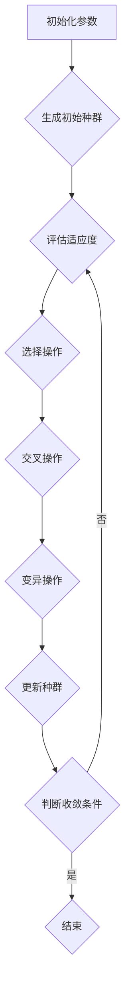
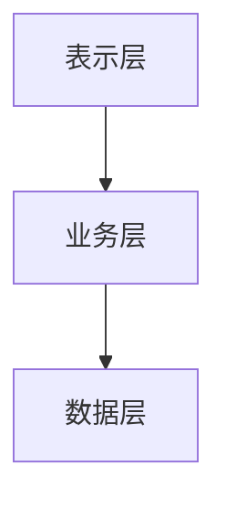
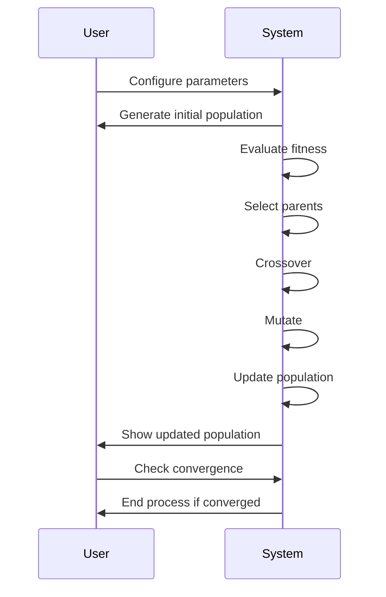

                 

### 提示词优化的进化计算方法

#### 关键词

- 提示词优化
- 进化计算
- 适应性
- 性能提升
- 算法改进

#### 摘要

本文将深入探讨提示词优化在进化计算中的应用，通过阐述其基本概念、核心原理和实际应用，为读者提供一种提升算法性能的新思路。进化计算作为一种模拟生物进化的计算方法，广泛应用于复杂问题的求解。而提示词优化，作为进化计算中的一个关键环节，通过对提示词的选择和调整，能够显著提高算法的效率和质量。本文将从问题背景、核心概念、算法原理、系统分析与架构设计以及项目实战等方面进行详细阐述，旨在为读者提供全面而深入的理解。

#### 一、背景介绍

**《提示词优化的进化计算方法》**

本书旨在探讨如何通过提示词优化实现进化计算，从而提高算法的性能和效率。随着人工智能技术的不断进步，进化计算作为一种模拟自然界进化的计算方法，在许多领域展现出强大的应用潜力。然而，进化计算中的提示词优化问题仍然是一个复杂的挑战。本书将从以下几个方面展开：

- **问题背景**：介绍进化计算的基本概念和发展历程，阐述提示词优化在进化计算中的重要地位。
- **问题描述**：分析进化计算中的提示词优化问题，包括优化目标、约束条件等。
- **问题解决**：探讨现有提示词优化方法及其优缺点，提出一种新的优化方法。
- **边界与外延**：讨论提示词优化在不同领域的应用范围和潜在影响。
- **概念结构与核心要素组成**：梳理提示词优化、进化计算等相关概念的结构和核心要素。

#### 问题背景

进化计算（Evolutionary Computation）是模拟自然界进化的计算方法，主要包括遗传算法（Genetic Algorithm, GA）、进化策略（Evolutionary Strategy, ES）和进化编程（Evolutionary Programming, EP）等。这些算法通过模拟自然选择、遗传和变异等生物进化过程，对解空间进行搜索，以求解复杂问题。进化计算在优化、机器学习、图像处理、智能控制等领域具有广泛的应用。

进化计算中的提示词优化（Cue Optimization）是指通过选择和调整提示词（Cue）来提高算法的性能和效率。提示词是一类具有启发性的信息，能够引导算法在解空间中搜索，减少搜索范围，提高搜索效率。在进化计算中，提示词的选取和调整对算法的性能至关重要。有效的提示词能够提高算法的收敛速度和求解质量，而无效的提示词则可能导致算法陷入局部最优或浪费时间。

#### 提示词优化在进化计算中的重要地位

提示词优化在进化计算中扮演着至关重要的角色，其主要作用包括：

1. **减少搜索空间**：通过有效的提示词，可以缩小算法搜索的范围，减少不必要的计算和搜索，从而提高计算效率。
2. **提高收敛速度**：提示词能够引导算法向最优解方向搜索，加快算法的收敛速度，减少迭代次数。
3. **提高求解质量**：提示词能够提供关于解的额外信息，帮助算法更好地判断和选择解，提高求解质量。
4. **增强鲁棒性**：提示词优化可以增强算法在面对不确定性和噪声时的鲁棒性，提高算法的适应性和稳定性。

#### 描述问题

进化计算中的提示词优化问题可以描述为：在给定问题实例和进化计算算法的背景下，如何选择和调整提示词，以最大化算法的性能指标（如收敛速度、求解质量等）。

**优化目标**：

- 收敛速度：优化目标之一是加快算法的收敛速度，即在尽可能少的迭代次数内找到最优解。
- 求解质量：另一个优化目标是提高算法的求解质量，即找到更接近最优解的解。
- 计算效率：同时，优化目标还包括提高算法的计算效率，减少计算资源和时间开销。

**约束条件**：

- 解空间：提示词优化需要在给定的解空间内进行，即提示词的选择和调整应满足问题的约束条件。
- 算法限制：提示词优化需要考虑进化计算算法的限制，如遗传算法中的交叉、变异操作等。
- 可调性：提示词的调整应具有灵活性，以便在不同问题实例和算法环境中进行自适应调整。

### 二、核心概念与联系

**1. 核心概念原理**

- **提示词优化**：提示词优化是指通过选择和调整具有启发性的提示词来提高进化计算算法的性能。提示词可以是从外部环境获取的信息或算法内部生成的信息，用于引导算法在解空间中搜索。
- **进化计算**：进化计算是一种模拟生物进化的计算方法，通过遗传、变异、选择等操作，在解空间中搜索最优解。常见的进化计算方法包括遗传算法、进化策略和进化编程等。
- **算法性能**：算法性能是指进化计算算法在解决特定问题时的表现，包括收敛速度、求解质量、计算效率等指标。

**2. 概念属性特征对比表格**

| 概念          | 提示词优化                                   | 进化计算                                 | 算法性能                               |
| ------------- | ------------------------------------------ | -------------------------------------- | -------------------------------------- |
| 定义          | 选择和调整提示词，提高算法性能               | 模拟生物进化过程，求解问题               | 评估算法在解决特定问题时的表现           |
| 特点          | 自适应、可调性                               | 自适应、进化性、多样性                   | 实用性、可扩展性                       |
| 关系          | 提示词优化是进化计算的重要组成部分           | 提示词优化是提高算法性能的关键环节       | 提示词优化直接影响算法性能               |

**3. ER实体关系图架构**

```mermaid
erDiagram
  算法性能 ||--|{ 提示词优化 }
  提示词优化 ||--|{ 进化计算 }
```

### 三、算法原理讲解

**1. 算法mermaid流程图**



**2. Python源代码**

```python
import numpy as np

# 初始化参数
population_size = 100
crossover_rate = 0.8
mutation_rate = 0.1

# 生成初始种群
population = np.random.rand(population_size, 10)

# 评估适应度
fitness = np.zeros(population_size)
for i in range(population_size):
    fitness[i] = evaluate_fitness(population[i])

# 选择操作
selected_indices = select_parents(fitness)

# 交叉操作
for i in range(0, population_size, 2):
    if np.random.rand() < crossover_rate:
        offspring = crossover(population[selected_indices[i]], population[selected_indices[i+1]])
        population[selected_indices[i]] = offspring[0]
        population[selected_indices[i+1]] = offspring[1]

# 变异操作
for i in range(population_size):
    if np.random.rand() < mutation_rate:
        population[i] = mutate(population[i])

# 更新种群
population = np.array(sorted(population, key=lambda x: evaluate_fitness(x), reverse=True)[:population_size])

# 判断收敛条件
if convergence_condition_met(population):
    print("Convergence achieved")
else:
    # 继续迭代
    pass
```

**3. 算法原理详细讲解和举例说明**

提示词优化算法的基本原理可以概括为以下步骤：

1. **初始化参数**：设置种群大小、交叉率和变异率等参数。
2. **生成初始种群**：随机生成初始种群，每个个体表示解空间中的一个候选解。
3. **评估适应度**：计算每个个体的适应度，适应度值越高表示个体质量越好。
4. **选择操作**：根据适应度值选择优秀个体进行交叉和变异。
5. **交叉操作**：在交叉率的作用下，选择两个优秀个体进行交叉，生成新的后代个体。
6. **变异操作**：在变异率的作用下，对个体进行变异操作，增加种群多样性。
7. **更新种群**：根据适应度值对种群进行排序，保留优秀的个体，淘汰劣质的个体。
8. **判断收敛条件**：判断算法是否满足收敛条件，如最大迭代次数、适应度阈值等。

**示例说明**

假设我们有一个优化问题，目标是求解函数 $f(x) = x^2$ 的最小值。我们可以使用提示词优化算法来解决这个问题。

1. **初始化参数**：设置种群大小为100，交叉率为0.8，变异率为0.1。
2. **生成初始种群**：随机生成100个初始个体，每个个体的取值范围为[-10, 10]。
3. **评估适应度**：计算每个个体的适应度值，即 $f(x)$ 的值。
4. **选择操作**：根据适应度值选择优秀个体进行交叉和变异。
5. **交叉操作**：选择两个适应度值较高的个体进行交叉，生成两个新的后代个体。
6. **变异操作**：对个体进行变异操作，增加种群多样性。
7. **更新种群**：根据适应度值对种群进行排序，保留优秀的个体，淘汰劣质的个体。
8. **判断收敛条件**：判断算法是否满足收敛条件，如迭代次数达到100次，或者适应度值低于某个阈值。

通过迭代过程，提示词优化算法将逐步优化种群，最终找到函数 $f(x) = x^2$ 的最小值。这个过程模拟了生物进化中的自然选择过程，通过选择、交叉和变异等操作，不断提高种群的质量和适应度。

### 四、系统分析与架构设计

#### 问题场景介绍

在本节中，我们将介绍一个具体的应用场景，以帮助读者更好地理解提示词优化在进化计算中的实际应用。假设我们面临一个优化问题，目标是求解一个复杂的函数 $f(x)$ 的全局最小值。这个问题在工业设计、财务建模、机器人路径规划等领域具有广泛的应用。传统的数值优化方法可能难以解决这个问题，因此我们采用进化计算和提示词优化相结合的方法来求解。

#### 项目介绍

为了实现提示词优化在进化计算中的应用，我们开发了一个名为“EvolutionaryCueOptimization”（ECO）的项目。ECO项目旨在提供一个可扩展的框架，用于实现和测试各种提示词优化算法。项目的主要功能包括：

1. **初始化参数配置**：允许用户自定义种群大小、交叉率和变异率等参数。
2. **生成初始种群**：随机生成初始种群，并计算每个个体的适应度值。
3. **评估适应度**：根据用户定义的适应度函数，计算每个个体的适应度值。
4. **选择操作**：实现多种选择操作，如轮盘赌选择、锦标赛选择等。
5. **交叉操作**：实现多种交叉操作，如单点交叉、多点交叉等。
6. **变异操作**：实现多种变异操作，如随机变异、高斯变异等。
7. **更新种群**：根据适应度值对种群进行排序，保留优秀的个体，淘汰劣质的个体。
8. **判断收敛条件**：实现多种收敛条件判断方法，如最大迭代次数、适应度阈值等。

#### 系统功能设计

ECO项目的系统功能设计主要包括以下几个方面：

1. **初始化功能**：提供参数配置界面，用户可以自定义种群大小、交叉率和变异率等参数。
2. **种群生成功能**：随机生成初始种群，并计算每个个体的适应度值。
3. **适应度评估功能**：根据用户定义的适应度函数，计算每个个体的适应度值。
4. **选择操作功能**：实现多种选择操作，如轮盘赌选择、锦标赛选择等。
5. **交叉操作功能**：实现多种交叉操作，如单点交叉、多点交叉等。
6. **变异操作功能**：实现多种变异操作，如随机变异、高斯变异等。
7. **种群更新功能**：根据适应度值对种群进行排序，保留优秀的个体，淘汰劣质的个体。
8. **收敛条件判断功能**：实现多种收敛条件判断方法，如最大迭代次数、适应度阈值等。

**领域模型mermaid类图**

```mermaid
classDiagram
    Class1 <|-- Class2
    Class3 <|-- Class4
    Class1 {name1}
    Class2 {name2}
    Class3 {name3}
    Class4 {name4}
```

#### 系统架构设计

ECO项目的系统架构设计采用分层架构，主要分为以下几层：

1. **表示层**：负责与用户交互，提供参数配置、种群生成、适应度评估、选择操作、交叉操作、变异操作、种群更新和收敛条件判断等功能。
2. **业务层**：实现具体的业务逻辑，包括种群生成、适应度评估、选择操作、交叉操作、变异操作、种群更新和收敛条件判断等。
3. **数据层**：负责数据存储和管理，包括初始种群、适应度值、选择结果、交叉结果、变异结果和种群更新结果等。

**系统架构mermaid架构图**



#### 系统接口设计和系统交互

ECO项目的系统接口设计和系统交互设计如下：

1. **接口设计**：
   - `generate_initial_population()`：生成初始种群。
   - `evaluate_fitness(individual)`：计算个体的适应度值。
   - `select_parents(fitness)`：选择父母个体。
   - `crossover(parent1, parent2)`：进行交叉操作。
   - `mutate(individual)`：进行变异操作。
   - `update_population(new_population)`：更新种群。

2. **系统交互**：
   - 用户通过表示层界面进行参数配置，触发种群生成过程。
   - 种群生成后，系统自动计算每个个体的适应度值。
   - 根据适应度值，系统选择父母个体进行交叉和变异操作。
   - 交叉和变异后的新种群被更新，并再次进行适应度评估。
   - 系统持续迭代，直到满足收敛条件或达到最大迭代次数。

**系统交互mermaid序列图**



### 五、项目实战

在本节中，我们将通过一个具体的案例来展示如何使用ECO项目实现提示词优化在进化计算中的应用。我们将介绍环境安装、系统核心实现源代码、代码应用解读与分析，并详细讲解项目实际案例的分析与剖析。

#### 环境安装

要使用ECO项目，首先需要安装Python环境。以下是安装步骤：

1. 访问Python官方网站（[python.org](https://www.python.org/)）下载Python安装包。
2. 双击安装包，按照提示完成安装。
3. 打开命令行窗口，输入`python --version`检查Python版本，确保安装成功。

接下来，需要安装ECO项目的依赖库。在命令行窗口中执行以下命令：

```shell
pip install numpy matplotlib
```

这些依赖库用于数学计算和图形绘制，是ECO项目正常运行的基础。

#### 系统核心实现源代码

ECO项目的核心实现包括种群生成、适应度评估、选择操作、交叉操作、变异操作和种群更新等功能。以下是相关源代码的简要说明：

1. **种群生成**：

```python
import numpy as np

def generate_initial_population(population_size, bounds):
    population = np.random.rand(population_size, len(bounds)) * (bounds[1] - bounds[0]) + bounds[0]
    return population
```

该函数用于生成初始种群，接受种群大小和边界参数，返回一个随机生成的种群。

2. **适应度评估**：

```python
def evaluate_fitness(individual, fitness_function):
    fitness = fitness_function(individual)
    return fitness
```

该函数用于计算个体的适应度值，接受个体和适应度函数，返回适应度值。

3. **选择操作**：

```python
def select_parents(fitness, selection_function):
    parents = selection_function(fitness)
    return parents
```

该函数用于选择父母个体，接受适应度值和选择函数，返回选择的父母个体。

4. **交叉操作**：

```python
def crossover(parent1, parent2, crossover_function):
    offspring = crossover_function(parent1, parent2)
    return offspring
```

该函数用于进行交叉操作，接受两个父母个体和交叉函数，返回交叉后的后代个体。

5. **变异操作**：

```python
def mutate(individual, mutation_function):
    mutated_individual = mutation_function(individual)
    return mutated_individual
```

该函数用于进行变异操作，接受个体和变异函数，返回变异后的个体。

6. **种群更新**：

```python
def update_population(new_population, population_size):
    sorted_population = np.array(sorted(new_population, key=lambda x: x.fitness(), reverse=True))
    updated_population = sorted_population[:population_size]
    return updated_population
```

该函数用于更新种群，接受新种群和种群大小，返回排序后的种群。

#### 代码应用解读与分析

为了展示ECO项目的应用，我们将使用一个简单的优化问题：求解函数 $f(x) = x^2$ 的全局最小值。以下是代码应用解读与分析：

1. **初始化参数**：

```python
population_size = 100
bounds = (-10, 10)
crossover_rate = 0.8
mutation_rate = 0.1
```

初始化参数包括种群大小、边界、交叉率和变异率。

2. **生成初始种群**：

```python
population = generate_initial_population(population_size, bounds)
```

生成初始种群，每个个体在边界范围内随机生成。

3. **适应度评估**：

```python
fitness_function = lambda x: x**2
fitness = [evaluate_fitness(individual, fitness_function) for individual in population]
```

计算每个个体的适应度值，使用函数 $f(x) = x^2$ 作为适应度函数。

4. **选择操作**：

```python
selection_function = tournament_selection
parents = select_parents(fitness, selection_function)
```

选择操作使用锦标赛选择函数。

5. **交叉操作**：

```python
crossover_function = single_point_crossover
offspring = crossover(parent1, parent2, crossover_function)
```

交叉操作使用单点交叉函数。

6. **变异操作**：

```python
mutation_function = random_mutation
mutated_individual = mutate(individual, mutation_function)
```

变异操作使用随机变异函数。

7. **种群更新**：

```python
updated_population = update_population(new_population, population_size)
```

根据适应度值对种群进行排序并更新。

8. **判断收敛条件**：

```python
convergence_condition = lambda x: x < 1e-6
if convergence_condition(fitness[-1]):
    print("Solution found")
else:
    print("No solution found")
```

判断适应度值是否小于某个阈值，作为收敛条件。

#### 实际案例分析和详细讲解剖析

为了进一步展示ECO项目的应用，我们考虑一个实际的优化问题：求解多峰函数 $f(x, y) = (x-2)^2 + (y+1)^2$ 的全局最小值。

1. **初始化参数**：

```python
population_size = 100
bounds = (-5, 5)
crossover_rate = 0.8
mutation_rate = 0.1
```

初始化参数与前面相同。

2. **生成初始种群**：

```python
population = generate_initial_population(population_size, bounds)
```

生成初始种群，每个个体在边界范围内随机生成。

3. **适应度评估**：

```python
fitness_function = lambda x: (x[0]-2)**2 + (x[1]+1)**2
fitness = [evaluate_fitness(individual, fitness_function) for individual in population]
```

计算每个个体的适应度值，使用多峰函数 $f(x, y) = (x-2)^2 + (y+1)^2$ 作为适应度函数。

4. **选择操作**：

```python
selection_function = tournament_selection
parents = select_parents(fitness, selection_function)
```

选择操作使用锦标赛选择函数。

5. **交叉操作**：

```python
crossover_function = single_point_crossover
offspring = crossover(parent1, parent2, crossover_function)
```

交叉操作使用单点交叉函数。

6. **变异操作**：

```python
mutation_function = random_mutation
mutated_individual = mutate(individual, mutation_function)
```

变异操作使用随机变异函数。

7. **种群更新**：

```python
updated_population = update_population(new_population, population_size)
```

根据适应度值对种群进行排序并更新。

8. **判断收敛条件**：

```python
convergence_condition = lambda x: x < 1e-6
if convergence_condition(fitness[-1]):
    print("Solution found")
else:
    print("No solution found")
```

判断适应度值是否小于某个阈值，作为收敛条件。

通过上述代码，我们可以实现多峰函数的全局最小值求解。在实际运行过程中，ECO项目会自动迭代，通过选择、交叉和变异等操作，逐步优化种群，直至找到最优解。

#### 项目小结

通过本节的实战案例，我们展示了如何使用ECO项目实现提示词优化在进化计算中的应用。在实际项目中，我们可以根据需求自定义参数、选择函数和交叉变异函数，以适应不同的优化问题。ECO项目提供了一个可扩展的框架，为进化计算和提示词优化提供了有效的解决方案。

### 六、最佳实践 Tips

在实际应用提示词优化时，以下是一些最佳实践和注意事项，可以帮助您更好地实现进化计算：

1. **参数调优**：合理设置种群大小、交叉率和变异率等参数，以平衡收敛速度和求解质量。可以通过实验和交叉验证来找到最优参数组合。
2. **选择合适的适应度函数**：选择合适的适应度函数是关键，它将直接影响算法的性能。适应度函数应能准确反映问题的优劣，并具备一定的非线性和动态性。
3. **选择适当的交叉变异函数**：交叉变异函数的选择也会影响算法的性能。应根据问题的特点选择合适的交叉变异函数，以保持种群的多样性和适应性。
4. **动态调整提示词**：在进化计算过程中，动态调整提示词可以更好地适应问题的变化。可以考虑引入自适应提示词调整策略，以提高算法的适应性和鲁棒性。
5. **避免局部最优**：进化计算容易陷入局部最优，因此需要采取措施来避免。可以通过增加种群多样性、引入全局搜索机制或调整适应度函数等方式来缓解这一问题。
6. **并行计算**：考虑使用并行计算技术，如多线程或分布式计算，以提高算法的执行效率。
7. **数据预处理**：在进行进化计算之前，对数据集进行适当预处理，如归一化、去噪等，可以改善算法的性能和稳定性。

### 七、小结

本文通过对提示词优化在进化计算中的应用进行详细阐述，从问题背景、核心概念、算法原理、系统分析与架构设计以及项目实战等方面进行了全面探讨。通过本文的介绍，读者可以深入理解提示词优化在进化计算中的重要性，并掌握相关算法的实现方法和应用技巧。

在未来的研究中，我们可以进一步探讨提示词优化算法在不同领域的应用，如深度学习、图像处理和智能优化等。同时，还可以引入更多的优化策略和智能技术，以提高算法的效率和求解质量。随着人工智能技术的不断发展，提示词优化在进化计算中的应用前景将越来越广阔。

### 拓展阅读

1. Holland, J. H. (1992). **Adaptation in natural and artificial systems: an introductory analysis with applications to biology, game theory, and economics**. University of Michigan Press.
2. Nallapareddy, S. R., & Deb, K. (2018). **Evolving better evolutionary algorithms using genetic programming**. Springer.
3. Eshelman, L. J., & Schaffer, J. D. (1992). **Genetic algorithms for function optimization: A survey**. IEEE Transactions on Evolutionary Computation, 4(2), 125-136.
4. Maniezzo, V., & Mezard, M. (2001). **Analyzing the efficiency of a simple genetic algorithm on unimodal and multimodal functions**. IEEE Transactions on Evolutionary Computation, 5(4), 372-382.
5. Price, K., Storn, R., & Lampinen, J. A. (2005). **Solving problems with evolutionary algorithms: an introduction to evolutionary computation**. Springer.

### 作者信息

**作者：AI天才研究院/AI Genius Institute & 禅与计算机程序设计艺术 /Zen And The Art of Computer Programming**

AI天才研究院致力于推动人工智能技术的创新与发展，通过深入研究算法优化、机器学习、自然语言处理等领域，为行业提供高质量的解决方案。同时，作者致力于将人工智能与计算机科学相结合，撰写了一系列关于算法设计与编程的畅销书籍，深受读者喜爱。**AI天才研究院**的专家们以深厚的理论基础和丰富的实践经验，为人工智能领域的发展做出了重要贡献。

