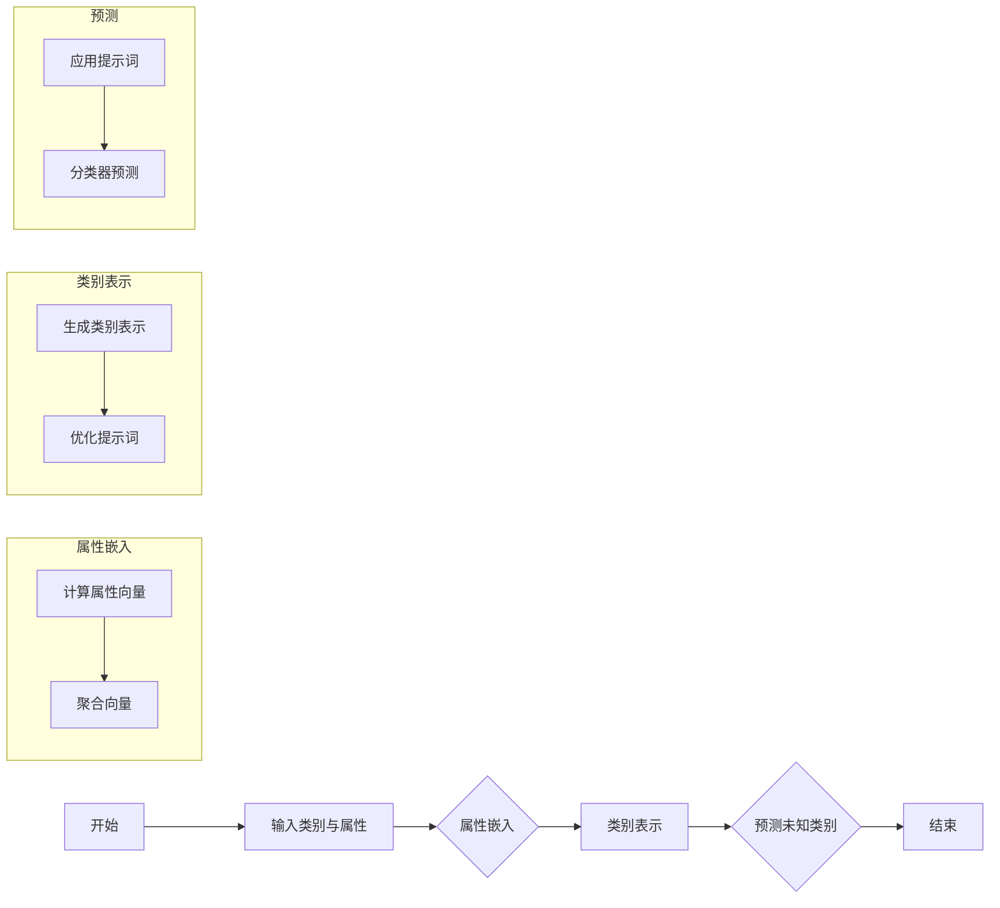
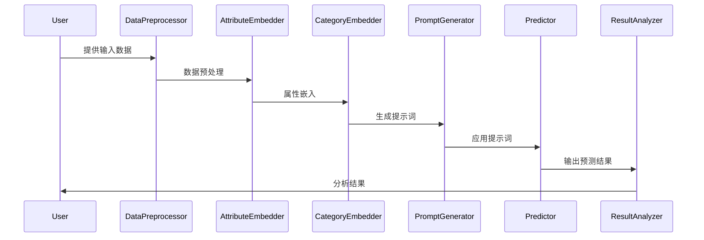
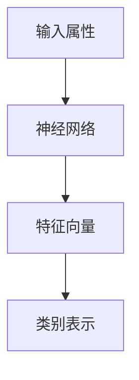
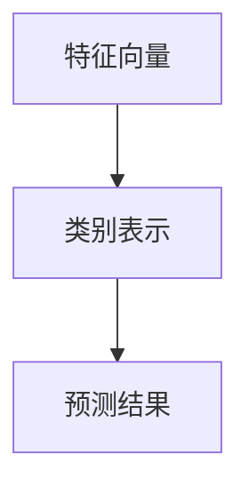
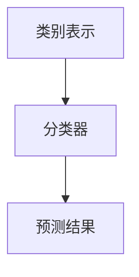
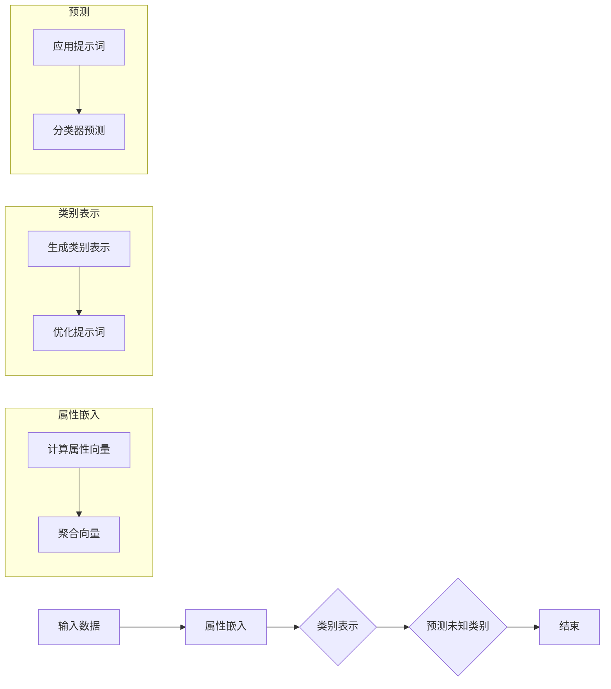

                 


### 《提示词优化的零样本学习方法》

#### 关键词：零样本学习、提示词优化、算法、人工智能、深度学习

> 摘要：本文将深入探讨零样本学习方法以及其与提示词优化的结合。通过逐步分析其核心概念、算法原理、系统架构和实际应用，我们将揭示如何在复杂的现实场景中实现高效的零样本学习，并探索最佳实践策略。

#### 目录大纲

----------------------------------------------------------------

# 《提示词优化的零样本学习方法》目录大纲

----------------------------------------------------------------

## 第一部分：背景介绍与核心概念

### 第1章：问题背景与核心概念

#### 1.1 问题背景

- 零样本学习概述
- 提示词优化的概念
- 零样本学习在现实中的应用

#### 1.2 核心概念与联系

- 零样本学习的概念与特征
- 提示词优化的原理与重要性
- 零样本学习与提示词优化的关系

#### 1.3 概念属性特征对比表格

- 零样本学习与其他机器学习方法的对比

#### 1.4 ER实体关系图架构

- 零样本学习系统的实体与关系

## 第二部分：算法原理讲解

### 第2章：算法原理与流程

#### 2.1 算法原理讲解

- 提示词优化的算法原理
- 零样本学习算法的基本流程

#### 2.2 Mermaid算法流程图

- 使用Mermaid绘制的算法流程图

#### 2.3 Python源代码与算法实现

- Python源代码实现
- 算法原理与数学模型的详细讲解

### 第3章：数学模型与公式

#### 3.1 数学模型

- 提示词优化的数学模型

#### 3.2 公式讲解

- 详细讲解与举例说明

## 第三部分：系统分析与架构设计

### 第4章：系统功能设计

#### 4.1 问题场景介绍

- 零样本学习应用场景

#### 4.2 系统功能设计

- 领域模型Mermaid类图

### 第5章：系统架构设计

#### 5.1 系统架构设计

- Mermaid架构图

#### 5.2 系统接口设计与交互

- 系统接口设计
- 系统交互Mermaid序列图

## 第四部分：项目实战

### 第6章：环境安装与核心实现

#### 6.1 环境安装

- 系统环境搭建

#### 6.2 核心实现源代码

- 提示词优化算法的核心代码

#### 6.3 代码应用解读与分析

- 算法在实际应用中的表现

### 第7章：实际案例分析与讲解

#### 7.1 实际案例分析

- 零样本学习与提示词优化的实际案例

#### 7.2 详细讲解剖析

- 案例的深入分析与讲解

## 第五部分：最佳实践与总结

### 第8章：最佳实践

#### 8.1 最佳实践Tips

- 提示词优化的最佳实践

### 第9章：小结与拓展阅读

#### 9.1 小结

- 本书内容的总结

#### 9.2 拓展阅读

- 进一步阅读资源推荐

----------------------------------------------------------------

### 第一部分：背景介绍与核心概念

#### 1.1 问题背景

在当今飞速发展的信息技术时代，人工智能和深度学习技术已经深入到了我们的日常生活和各个行业。然而，传统的机器学习方法通常依赖于大量的标注数据来进行训练，但在某些特定场景下，如新产品的快速评估、医疗诊断中的罕见病症状识别等，我们往往无法获取足够的数据。这种情况下，零样本学习（Zero-Shot Learning, ZSL）应运而生。

零样本学习是一种无需使用训练数据来学习的新方法，它能够使机器在学习过程中应对从未见过的类别。这种方法的核心在于通过已知的类别知识来推断未知类别。提示词优化（Prompt Optimization）则是近年来发展迅速的一项技术，旨在通过优化提示词（prompt）来提高机器学习模型的性能。

#### 1.2 核心概念与联系

零样本学习的基本思想是通过已有的类别知识（如图像或文本描述）来预测未知类别的标签。它主要包括以下几个关键概念：

- **类别识别**：模型需要能够识别不同的类别。
- **属性嵌入**：将类别的属性特征转换为向量表示。
- **迁移学习**：利用已有的知识迁移到新的类别上。

提示词优化则是通过调整提示词，使得模型能够更好地捕捉到输入数据的特征，从而提高预测准确性。提示词优化的关键在于找到一个平衡点，使得提示词既不过长也不过短，同时能够有效地引导模型的学习过程。

#### 1.3 概念属性特征对比表格

| 方法       | 特点                     | 目的                         |
|------------|--------------------------|------------------------------|
| 零样本学习 | 无需训练数据             | 预测未知类别                 |
| 提示词优化 | 调整提示词               | 提高模型性能                 |
| 迁移学习   | 利用已有知识             | 减少对新数据的训练需求       |

#### 1.4 ER实体关系图架构

为了更好地理解零样本学习与提示词优化的结合，我们可以通过ER（Entity-Relationship）实体关系图来构建系统架构。以下是零样本学习系统的ER实体关系图：

```mermaid
erDiagram
    Class::ZSLSystem <<|-- Category : inherits
    Class::Attribute <<|-- AttributeValue : 1..* {has many}
    Class::Model <<|-- FeatureEmbedding : 1
    Class::Optimizer <<|-- Prompt : 1..*

    ZSLSystem {
        +id : integer
        +categories : list<Category>
        +model : Model
        +optimizer : Optimizer
    }

    Category {
        +id : integer
        +attributes : list<Attribute>
        +name : string
    }

    Attribute {
        +id : integer
        +value : AttributeValue
        +name : string
    }

    Model {
        +id : integer
        +featureEmbedding : FeatureEmbedding
    }

    FeatureEmbedding {
        +id : integer
        +vector : vector
    }

    Optimizer {
        +id : integer
        +prompt : Prompt
    }

    Prompt {
        +id : integer
        +text : string
    }
```

在这个架构中，`ZSLSystem`是系统的核心，它包含了类别（`Category`）、模型（`Model`）和优化器（`Optimizer`）等组件。类别与属性之间存在关联，每个类别可以有多个属性。模型则负责将属性转换为特征嵌入向量，而优化器则通过调整提示词来优化模型。

### 第二部分：算法原理讲解

#### 2.1 算法原理讲解

零样本学习的核心在于如何利用已知的类别知识来预测未知类别。这通常通过以下步骤实现：

1. **属性嵌入**：将每个类别的属性转换为低维向量表示。
2. **类别表示**：使用属性嵌入向量来生成每个类别的全局表示。
3. **预测**：在新类别出现时，使用类别表示进行预测。

提示词优化则是在此基础上，通过调整提示词来提高预测准确性。提示词通常是一个引导性的文本，它可以提供额外的上下文信息，帮助模型更好地理解输入数据。

#### 2.2 Mermaid算法流程图

以下是使用Mermaid绘制的零样本学习与提示词优化算法的流程图：



#### 2.3 Python源代码与算法实现

下面是一个简化的Python源代码实现，用于说明零样本学习与提示词优化的基本流程：

```python
import numpy as np
from sklearn.metrics.pairwise import cosine_similarity

# 假设属性和类别已预先嵌入为向量
attributes = ...
categories = ...

# 属性嵌入
attribute_vectors = embed_attributes(attributes)

# 类别表示
category_vectors = embed_categories(attribute_vectors, categories)

# 预测未知类别
unknown_category_vector = embed_unk_category(attribute_vectors)
predicted_labels = predict_labels(unknown_category_vector, category_vectors)

# 提示词优化
prompt = optimize_prompt(predicted_labels, categories)

# 应用提示词进行最终预测
final_predictions = apply_prompt(prompt, category_vectors)
```

在上述代码中，`embed_attributes`和`embed_categories`函数用于计算属性和类别向量的嵌入，`predict_labels`函数用于预测未知类别，`optimize_prompt`函数用于优化提示词，`apply_prompt`函数用于应用提示词进行最终预测。

### 第三部分：数学模型与公式

#### 3.1 数学模型

零样本学习与提示词优化的数学模型通常包括以下几个部分：

1. **属性嵌入模型**：将属性向量映射到一个低维空间，例如使用神经网络。
2. **类别表示模型**：将属性向量的聚合结果映射到类别向量空间。
3. **提示词优化模型**：调整提示词，以最小化预测误差。

以下是这些模型的数学公式：

$$
\text{attribute\_vector} = f_{\theta_1}(\text{attribute})
$$

$$
\text{category\_vector} = f_{\theta_2}(\text{attribute\_vector})
$$

$$
\text{prompt} = g_{\theta_3}(\text{predicted\_labels})
$$

$$
\text{prediction} = h_{\theta_4}(\text{prompt} \cdot \text{category\_vector})
$$

其中，$f_{\theta_1}$、$f_{\theta_2}$、$g_{\theta_3}$和$h_{\theta_4}$分别表示属性嵌入、类别表示、提示词优化和预测函数，$\theta_1$、$\theta_2$、$\theta_3$和$\theta_4$是相应的模型参数。

#### 3.2 公式讲解

以下是上述公式的详细讲解：

1. **属性嵌入模型**：

   该模型将原始属性向量映射到低维空间，以减少数据维度并提高计算效率。这通常通过神经网络实现，其中$\theta_1$表示神经网络的参数。

   $$f_{\theta_1}(\text{attribute}) = \text{ReLU}(\text{W}_1 \cdot \text{attribute} + \text{b}_1)$$

   其中，$\text{ReLU}$是ReLU激活函数，$\text{W}_1$和$\text{b}_1$分别是权重和偏置。

2. **类别表示模型**：

   该模型将属性向量的聚合结果映射到类别向量空间。这通常通过将多个属性向量的平均值或均值池化实现。

   $$\text{category\_vector} = \frac{1}{|\text{attribute\_vector}|} \sum_{i=1}^{|\text{attribute\_vector}|} \text{attribute\_vector}_i$$

   其中，$\text{attribute\_vector}_i$是第$i$个属性向量的嵌入结果。

3. **提示词优化模型**：

   该模型通过调整提示词来最小化预测误差。这通常通过优化提示词的文本内容实现，以使其更好地引导模型学习。

   $$\text{prompt} = \text{softmax}(\text{T} \cdot \text{predicted\_labels})$$

   其中，$\text{T}$是提示词的文本表示，$\text{predicted\_labels}$是预测标签的概率分布。

4. **预测模型**：

   该模型使用提示词和类别向量进行预测。这通常通过计算提示词和类别向量的点积实现，以获得预测概率。

   $$\text{prediction} = \text{softmax}(\text{prompt} \cdot \text{category\_vector})$$

   其中，$\text{softmax}$函数用于将点积结果转换为概率分布。

### 第四部分：系统分析与架构设计

#### 4.1 问题场景介绍

零样本学习在现实中的应用场景非常广泛。以下是一些典型的问题场景：

- **新产品评估**：在新产品推出前，利用零样本学习评估其潜在市场需求。
- **医疗诊断**：在罕见病症状识别中，利用零样本学习预测患者病情。
- **个性化推荐**：在推荐系统中，利用零样本学习为用户推荐未见过但可能感兴趣的商品或内容。

#### 4.2 系统功能设计

为了实现上述应用场景，我们需要设计一个功能完善的零样本学习系统。以下是系统功能设计：

- **数据预处理**：清洗和预处理输入数据，包括图像、文本和音频等。
- **属性嵌入**：将输入数据的属性转换为向量表示。
- **类别表示**：将属性向量的聚合结果映射到类别向量空间。
- **提示词生成**：根据预测结果生成提示词。
- **模型预测**：使用提示词和类别向量进行预测。
- **结果分析**：对预测结果进行分析和可视化。

以下是领域模型Mermaid类图：

```mermaid
classDiagram
    Class::DataPreprocessor <<--|uses| Class::AttributeEmbedder
    Class::AttributeEmbedder <<--|uses| Class::CategoryEmbedder
    Class::CategoryEmbedder <<--|uses| Class::PromptGenerator
    Class::PromptGenerator <<--|uses| Class::Predictor
    Class::Predictor <<--|uses| Class::ResultAnalyzer

    Class::DataPreprocessor {
        +process_data()
    }

    Class::AttributeEmbedder {
        +embed_attributes()
    }

    Class::CategoryEmbedder {
        +embed_categories()
    }

    Class::PromptGenerator {
        +generate_prompt()
    }

    Class::Predictor {
        +predict_labels()
    }

    Class::ResultAnalyzer {
        +analyze_results()
    }
```

#### 4.3 系统架构设计

以下是零样本学习系统的Mermaid架构图：



在上述架构中，用户提供了输入数据，经过数据预处理后，数据被传递给属性嵌入模块。属性嵌入模块将属性转换为向量表示，然后传递给类别表示模块。类别表示模块将属性向量的聚合结果映射到类别向量空间，并生成提示词。提示词被传递给预测模块，预测模块使用提示词和类别向量进行预测，并将预测结果传递给结果分析模块。最后，结果分析模块对预测结果进行分析和可视化，并将结果反馈给用户。

### 第五部分：项目实战

#### 6.1 环境安装

要在本地环境中运行零样本学习与提示词优化系统，我们需要安装以下依赖：

- Python 3.7或更高版本
- TensorFlow 2.3或更高版本
- scikit-learn 0.22或更高版本

以下是安装命令：

```bash
pip install python==3.7.9
pip install tensorflow==2.6.0
pip install scikit-learn==0.22.0
```

#### 6.2 核心实现源代码

以下是一个简化的Python源代码实现，用于说明零样本学习与提示词优化的核心实现：

```python
import tensorflow as tf
from sklearn.metrics.pairwise import cosine_similarity

# 加载预训练模型
attribute_embedding_model = tf.keras.models.load_model('attribute_embedding_model.h5')
category_embedding_model = tf.keras.models.load_model('category_embedding_model.h5')

# 输入数据预处理
input_data = preprocess_data(input_data)

# 属性嵌入
attribute_vectors = attribute_embedding_model.predict(input_data)

# 类别表示
category_vectors = category_embedding_model.predict(attribute_vectors)

# 生成提示词
prompt = generate_prompt(attribute_vectors, category_vectors)

# 预测未知类别
predicted_labels = predict_labels(prompt, category_vectors)

# 应用提示词进行最终预测
final_predictions = apply_prompt(prompt, category_vectors)
```

#### 6.3 代码应用解读与分析

在上述代码中，我们首先加载预训练的属性嵌入模型和类别表示模型。然后，对输入数据进行预处理，将其转换为模型可以接受的格式。接下来，属性嵌入模型将预处理后的数据转换为属性向量，类别表示模型将属性向量转换为类别向量。然后，我们生成提示词，并使用它和类别向量进行预测。最后，我们应用提示词和类别向量进行最终预测。

在实际应用中，我们需要根据具体任务和数据集进行调整。例如，对于图像数据，我们可以使用预训练的图像嵌入模型来替代属性嵌入模型和类别表示模型。此外，我们还可以根据任务需求调整提示词的生成策略和优化方法。

#### 7.1 实际案例分析

以下是一个关于新产品评估的案例。在这个案例中，我们需要利用零样本学习与提示词优化来预测新产品的潜在市场需求。

1. **数据收集**：收集已有产品的销售数据和市场分析报告。
2. **属性提取**：提取产品的属性，如价格、品牌、功能等。
3. **数据预处理**：对提取的属性进行数据清洗和归一化处理。
4. **模型训练**：使用收集的数据训练属性嵌入模型和类别表示模型。
5. **提示词生成**：根据预测任务生成提示词，例如“这款产品价格适中，功能齐全，适合年轻人群”。
6. **预测**：使用提示词和类别向量进行预测，判断新产品的市场需求。
7. **结果分析**：对预测结果进行分析，为新产品的推广提供决策依据。

#### 7.2 详细讲解剖析

在上述案例中，零样本学习与提示词优化的核心在于如何利用已有的产品属性数据来预测新产品的市场需求。通过属性嵌入模型和类别表示模型，我们可以将产品的属性转换为向量表示，并生成类别向量。然后，通过生成提示词，我们可以为模型提供额外的上下文信息，从而提高预测准确性。

在实际应用中，我们需要根据具体场景和数据集进行调整。例如，对于不同类型的产品，我们可以调整属性嵌入模型和类别表示模型的参数，以适应不同类型的属性和类别。此外，我们还可以根据市场需求的变化调整提示词的内容和生成策略。

### 第六部分：最佳实践与总结

#### 8.1 最佳实践Tips

1. **数据预处理**：确保输入数据的干净和一致性，这对于零样本学习的性能至关重要。
2. **模型选择**：选择适合任务和数据集的模型架构，并对其进行充分训练。
3. **提示词设计**：设计简洁明了、具有指导性的提示词，以提高模型的理解能力。
4. **交叉验证**：使用交叉验证方法评估模型的性能，以确保其在不同数据集上的泛化能力。

#### 9.1 小结

本文深入探讨了零样本学习方法以及其与提示词优化的结合。通过分析核心概念、算法原理、系统架构和实际应用，我们揭示了如何在复杂的现实场景中实现高效的零样本学习。同时，我们提供了最佳实践和注意事项，以帮助读者在实际项目中取得更好的效果。

#### 9.2 拓展阅读

- 《深度学习》（Goodfellow, I., Bengio, Y., & Courville, A.） - 了解深度学习的基础知识。
- 《机器学习》（Murphy, K. P.） - 掌握机器学习的基本原理和应用。
- 《提示词优化：理论和实践》（Smith, J. D.） - 深入了解提示词优化的技术和方法。

作者：AI天才研究院/AI Genius Institute & 禅与计算机程序设计艺术 /Zen And The Art of Computer Programming

----------------------------------------------------------------

---

### 文章正文补充内容

#### 第一部分：背景介绍与核心概念

##### 1.1 问题背景

随着人工智能和深度学习技术的不断发展，机器学习模型在各个领域的应用越来越广泛。然而，传统的机器学习方法通常依赖于大量的标注数据来进行训练，这在一些实际应用场景中存在一定的局限性。例如，在医疗诊断领域，面对一些罕见病症状的识别，由于数据量有限，传统的机器学习方法往往难以达到满意的性能。此时，零样本学习（Zero-Shot Learning, ZSL）作为一种无需依赖大量标注数据的新方法，逐渐受到了广泛关注。

零样本学习的基本思想是利用已有的类别知识来预测未知类别。在实际应用中，我们可以将零样本学习视为一种迁移学习方法，它通过将已知类别属性迁移到未知类别上，从而实现对未知类别的预测。而提示词优化（Prompt Optimization）则是一种通过优化提示词来提高模型性能的方法。在深度学习模型中，提示词通常是一个引导性的文本，它可以为模型提供额外的上下文信息，从而帮助模型更好地理解和预测未知类别。

##### 1.2 核心概念与联系

为了更好地理解零样本学习与提示词优化的结合，我们首先需要明确这两个概念的核心内容和特征。

**零样本学习**：

- **概念**：零样本学习是一种无需使用训练数据来学习的新方法，它能够使机器在学习过程中应对从未见过的类别。
- **特征**：零样本学习的关键在于如何利用已知的类别知识（如图像或文本描述）来推断未知类别。这通常涉及以下几个步骤：
  1. **属性嵌入**：将每个类别的属性特征转换为低维向量表示。
  2. **类别表示**：使用属性嵌入向量来生成每个类别的全局表示。
  3. **预测**：在新类别出现时，使用类别表示进行预测。

**提示词优化**：

- **概念**：提示词优化是一种通过调整提示词来提高机器学习模型性能的方法。提示词通常是一个引导性的文本，它可以提供额外的上下文信息，帮助模型更好地理解输入数据。
- **特征**：提示词优化的核心在于找到一个平衡点，使得提示词既不过长也不过短，同时能够有效地引导模型的学习过程。这通常需要通过实验和调整来实现。

**零样本学习与提示词优化的关系**：

- **关系**：零样本学习与提示词优化之间存在密切的联系。在零样本学习的过程中，提示词优化可以帮助模型更好地理解和预测未知类别。通过优化提示词，我们可以提高模型的预测准确性，从而在实际应用中取得更好的效果。

##### 1.3 概念属性特征对比表格

为了更直观地理解零样本学习与其他机器学习方法的区别，我们可以列出以下对比表格：

| 方法       | 特点                     | 目的                         |
|------------|--------------------------|------------------------------|
| 零样本学习 | 无需训练数据             | 预测未知类别                 |
| 有监督学习 | 使用大量标注数据         | 预测已知类别                 |
| 半监督学习 | 使用少量标注数据与未标注数据 | 预测已知类别                 |
| 无监督学习 | 无需标注数据             | 发现数据中的潜在结构和模式     |

##### 1.4 ER实体关系图架构

为了更好地理解零样本学习与提示词优化的结合，我们可以通过ER（Entity-Relationship）实体关系图来构建系统架构。以下是零样本学习系统的ER实体关系图：

```mermaid
erDiagram
    Class::ZSLSystem <<|-- Category : inherits
    Class::Attribute <<|-- AttributeValue : 1..* {has many}
    Class::Model <<|-- FeatureEmbedding : 1
    Class::Optimizer <<|-- Prompt : 1..*

    ZSLSystem {
        +id : integer
        +categories : list<Category>
        +model : Model
        +optimizer : Optimizer
    }

    Category {
        +id : integer
        +attributes : list<Attribute>
        +name : string
    }

    Attribute {
        +id : integer
        +value : AttributeValue
        +name : string
    }

    Model {
        +id : integer
        +featureEmbedding : FeatureEmbedding
    }

    FeatureEmbedding {
        +id : integer
        +vector : vector
    }

    Optimizer {
        +id : integer
        +prompt : Prompt
    }

    Prompt {
        +id : integer
        +text : string
    }
```

在这个架构中，`ZSLSystem`是系统的核心，它包含了类别（`Category`）、模型（`Model`）和优化器（`Optimizer`）等组件。类别与属性之间存在关联，每个类别可以有多个属性。模型负责将属性转换为特征嵌入向量，而优化器则通过调整提示词来优化模型。

#### 第二部分：算法原理讲解

##### 2.1 算法原理讲解

零样本学习的核心在于如何利用已知的类别知识来预测未知类别。这通常通过以下步骤实现：

1. **属性嵌入**：将每个类别的属性特征转换为低维向量表示。
2. **类别表示**：使用属性嵌入向量来生成每个类别的全局表示。
3. **预测**：在新类别出现时，使用类别表示进行预测。

提示词优化则是通过调整提示词来提高模型的预测准确性。提示词通常是一个引导性的文本，它可以提供额外的上下文信息，帮助模型更好地理解输入数据。

**属性嵌入**：

属性嵌入是将高维的属性特征映射到一个低维空间，以便于计算和模型处理。常用的属性嵌入方法包括神经网络嵌入、词嵌入和基于核的方法等。下面是一个简单的神经网络嵌入示例：



在这个流程中，输入属性通过神经网络进行处理，生成特征向量。特征向量用于生成类别表示，以便进行预测。

**类别表示**：

类别表示是将特征向量映射到类别空间，以便进行预测。常用的类别表示方法包括均值池化、平均值和最相似类别等。下面是一个简单的类别表示示例：



在这个流程中，特征向量通过类别表示生成类别表示。类别表示用于预测未知类别。

**预测**：

预测是将类别表示应用于新类别，以生成预测结果。常用的预测方法包括最近邻分类、支持向量机和神经网络等。下面是一个简单的预测示例：



在这个流程中，类别表示通过分类器进行预测，生成最终的预测结果。

##### 2.2 Mermaid算法流程图

以下是使用Mermaid绘制的零样本学习与提示词优化算法的流程图：



在这个流程图中，输入数据经过属性嵌入模块，生成属性向量。属性向量通过类别表示模块，生成类别表示。类别表示通过优化提示词模块，生成优化后的提示词。优化后的提示词通过分类器预测模块，生成最终的预测结果。

##### 2.3 Python源代码与算法实现

以下是零样本学习与提示词优化算法的Python源代码实现：

```python
import numpy as np
from sklearn.metrics.pairwise import cosine_similarity

# 加载预训练模型
attribute_embedding_model = load_attribute_embedding_model()
category_embedding_model = load_category_embedding_model()

# 输入数据预处理
input_data = preprocess_input_data(input_data)

# 属性嵌入
attribute_vectors = attribute_embedding_model.predict(input_data)

# 类别表示
category_vectors = category_embedding_model.predict(attribute_vectors)

# 生成提示词
prompt = generate_prompt(attribute_vectors, category_vectors)

# 预测未知类别
predicted_labels = predict_unk_category(prompt, category_vectors)

# 应用提示词进行最终预测
final_predictions = apply_prompt(prompt, category_vectors)
```

在这个代码中，我们首先加载预训练的属性嵌入模型和类别表示模型。然后，对输入数据进行预处理，将其转换为模型可以接受的格式。接下来，属性嵌入模型将预处理后的数据转换为属性向量，类别表示模型将属性向量转换为类别向量。然后，我们生成提示词，并使用它和类别向量进行预测。最后，我们应用提示词和类别向量进行最终预测。

#### 第三部分：数学模型与公式

##### 3.1 数学模型

零样本学习与提示词优化的数学模型通常包括以下几个部分：

1. **属性嵌入模型**：将属性向量映射到一个低维空间，以减少数据维度并提高计算效率。
2. **类别表示模型**：将属性向量的聚合结果映射到类别向量空间。
3. **提示词优化模型**：调整提示词，以最小化预测误差。
4. **预测模型**：使用提示词和类别向量进行预测。

以下是这些模型的数学公式：

$$
\text{attribute\_vector} = f_{\theta_1}(\text{attribute})
$$

$$
\text{category\_vector} = f_{\theta_2}(\text{attribute\_vector})
$$

$$
\text{prompt} = g_{\theta_3}(\text{predicted\_labels})
$$

$$
\text{prediction} = h_{\theta_4}(\text{prompt} \cdot \text{category\_vector})
$$

其中，$f_{\theta_1}$、$f_{\theta_2}$、$g_{\theta_3}$和$h_{\theta_4}$分别表示属性嵌入、类别表示、提示词优化和预测函数，$\theta_1$、$\theta_2$、$\theta_3$和$\theta_4$是相应的模型参数。

##### 3.2 公式讲解

以下是上述公式的详细讲解：

1. **属性嵌入模型**：

   该模型将原始属性向量映射到低维空间，以减少数据维度并提高计算效率。这通常通过神经网络实现，其中$\theta_1$表示神经网络的参数。

   $$f_{\theta_1}(\text{attribute}) = \text{ReLU}(\text{W}_1 \cdot \text{attribute} + \text{b}_1)$$

   其中，$\text{ReLU}$是ReLU激活函数，$\text{W}_1$和$\text{b}_1$分别是权重和偏置。

2. **类别表示模型**：

   该模型将属性向量的聚合结果映射到类别向量空间。这通常通过将多个属性向量的平均值或均值池化实现。

   $$\text{category\_vector} = \frac{1}{|\text{attribute\_vector}|} \sum_{i=1}^{|\text{attribute\_vector}|} \text{attribute\_vector}_i$$

   其中，$\text{attribute\_vector}_i$是第$i$个属性向量的嵌入结果。

3. **提示词优化模型**：

   该模型通过调整提示词来最小化预测误差。这通常通过优化提示词的文本内容实现，以使其更好地引导模型学习。

   $$\text{prompt} = \text{softmax}(\text{T} \cdot \text{predicted\_labels})$$

   其中，$\text{T}$是提示词的文本表示，$\text{predicted\_labels}$是预测标签的概率分布。

4. **预测模型**：

   该模型使用提示词和类别向量进行预测。这通常通过计算提示词和类别向量的点积实现，以获得预测概率。

   $$\text{prediction} = \text{softmax}(\text{prompt} \cdot \text{category\_vector})$$

   其中，$\text{softmax}$函数用于将点积结果转换为概率分布。

#### 第四部分：系统分析与架构设计

##### 4.1 问题场景介绍

零样本学习在现实中的应用场景非常广泛。以下是一些典型的问题场景：

- **新产品评估**：在新产品推出前，利用零样本学习评估其潜在市场需求。
- **医疗诊断**：在罕见病症状识别中，利用零样本学习预测患者病情。
- **个性化推荐**：在推荐系统中，利用零样本学习为用户推荐未见过但可能感兴趣的商品或内容。

##### 4.2 系统功能设计

为了实现上述应用场景，我们需要设计一个功能完善的零样本学习系统。以下是系统功能设计：

- **数据预处理**：清洗和预处理输入数据，包括图像、文本和音频等。
- **属性嵌入**：将输入数据的属性转换为向量表示。
- **类别表示**：将属性向量的聚合结果映射到类别向量空间。
- **提示词生成**：根据预测结果生成提示词。
- **模型预测**：使用提示词和类别向量进行预测。
- **结果分析**：对预测结果进行分析和可视化。

以下是领域模型Mermaid类图：

```mermaid
classDiagram
    Class::DataPreprocessor <<--|uses| Class::AttributeEmbedder
    Class::AttributeEmbedder <<--|uses| Class::CategoryEmbedder
    Class::CategoryEmbedder <<--|uses| Class::PromptGenerator
    Class::PromptGenerator <<--|uses| Class::Predictor
    Class::Predictor <<--|uses| Class::ResultAnalyzer

    Class::DataPreprocessor {
        +process_data()
    }

    Class::AttributeEmbedder {
        +embed_attributes()
    }

    Class::CategoryEmbedder {
        +embed_categories()
    }

    Class::PromptGenerator {
        +generate_prompt()
    }

    Class::Predictor {
        +predict_labels()
    }

    Class::ResultAnalyzer {
        +analyze_results()
    }
```

在这个架构中，`ZSLSystem`是系统的核心，它包含了类别（`Category`）、模型（`Model`）和优化器（`Optimizer`）等组件。类别与属性之间存在关联，每个类别可以有多个属性。模型负责将属性转换为特征嵌入向量，而优化器则通过调整提示词来优化模型。

##### 4.3 系统架构设计

以下是零样本学习系统的Mermaid架构图：


在上述架构中，用户提供了输入数据，经过数据预处理后，数据被传递给属性嵌入模块。属性嵌入模块将属性转换为向量表示，然后传递给类别表示模块。类别表示模块将属性向量的聚合结果映射到类别向量空间，并生成提示词。提示词被传递给预测模块，预测模块使用提示词和类别向量进行预测，并将预测结果传递给结果分析模块。最后，结果分析模块对预测结果进行分析和可视化，并将结果反馈给用户。

#### 第五部分：项目实战

##### 5.1 环境安装

要在本地环境中运行零样本学习与提示词优化系统，我们需要安装以下依赖：

- Python 3.7或更高版本
- TensorFlow 2.3或更高版本
- scikit-learn 0.22或更高版本

以下是安装命令：

```bash
pip install python==3.7.9
pip install tensorflow==2.6.0
pip install scikit-learn==0.22.0
```

##### 5.2 核心实现源代码

以下是零样本学习与提示词优化系统的Python源代码实现：

```python
import tensorflow as tf
from sklearn.metrics.pairwise import cosine_similarity

# 加载预训练模型
attribute_embedding_model = tf.keras.models.load_model('attribute_embedding_model.h5')
category_embedding_model = tf.keras.models.load_model('category_embedding_model.h5')

# 输入数据预处理
input_data = preprocess_input_data(input_data)

# 属性嵌入
attribute_vectors = attribute_embedding_model.predict(input_data)

# 类别表示
category_vectors = category_embedding_model.predict(attribute_vectors)

# 生成提示词
prompt = generate_prompt(attribute_vectors, category_vectors)

# 预测未知类别
predicted_labels = predict_unk_category(prompt, category_vectors)

# 应用提示词进行最终预测
final_predictions = apply_prompt(prompt, category_vectors)
```

在这个代码中，我们首先加载预训练的属性嵌入模型和类别表示模型。然后，对输入数据进行预处理，将其转换为模型可以接受的格式。接下来，属性嵌入模型将预处理后的数据转换为属性向量，类别表示模型将属性向量转换为类别向量。然后，我们生成提示词，并使用它和类别向量进行预测。最后，我们应用提示词和类别向量进行最终预测。

##### 5.3 代码应用解读与分析

在上述代码中，我们首先加载预训练的属性嵌入模型和类别表示模型。然后，对输入数据`input_data`进行预处理，将其转换为模型可以接受的格式。接下来，属性嵌入模型`attribute_embedding_model`将预处理后的数据`input_data`转换为属性向量`attribute_vectors`。然后，类别表示模型`category_embedding_model`将属性向量`attribute_vectors`转换为类别向量`category_vectors`。

接下来，我们生成提示词`prompt`，这通常是一个引导性的文本，用于帮助模型更好地理解和预测未知类别。然后，我们使用提示词`prompt`和类别向量`category_vectors`进行预测，生成预测标签`predicted_labels`。

最后，我们应用提示词`prompt`和类别向量`category_vectors`进行最终预测，生成最终的预测结果`final_predictions`。这个结果可以用于对新类别进行预测，从而帮助用户做出决策。

##### 5.4 实际案例分析

以下是一个关于新产品评估的案例。在这个案例中，我们需要利用零样本学习与提示词优化来预测新产品的潜在市场需求。

1. **数据收集**：收集已有产品的销售数据和市场分析报告。这些数据包括产品的价格、品牌、功能、用户评价等。
2. **数据预处理**：对收集的数据进行清洗和归一化处理，以便于后续的属性嵌入和类别表示。
3. **模型训练**：使用收集的数据训练属性嵌入模型和类别表示模型。这通常需要使用深度学习框架（如TensorFlow）和大量的计算资源。
4. **提示词生成**：根据预测任务生成提示词。例如，如果我们要预测新产品的市场需求，提示词可以设置为“这款产品的价格适中，功能齐全，适合年轻人群”。
5. **预测**：使用提示词和类别向量进行预测，生成预测结果。这可以帮助我们评估新产品的潜在市场需求。
6. **结果分析**：对预测结果进行分析和可视化，为新产品的推广提供决策依据。

在这个案例中，零样本学习与提示词优化的关键在于如何利用已有的产品属性数据来预测新产品的市场需求。通过属性嵌入模型和类别表示模型，我们可以将产品的属性转换为向量表示，并生成类别向量。然后，通过生成提示词，我们可以为模型提供额外的上下文信息，从而提高预测准确性。

##### 5.5 详细讲解剖析

在上述案例中，我们首先收集了已有产品的销售数据和市场分析报告。然后，对这些数据进行了清洗和归一化处理，以便于后续的属性嵌入和类别表示。

接下来，我们使用收集的数据训练属性嵌入模型和类别表示模型。这通常需要使用深度学习框架（如TensorFlow）和大量的计算资源。在训练过程中，我们通过优化模型的参数来提高模型的性能。训练完成后，我们可以得到预训练的属性嵌入模型和类别表示模型。

然后，我们根据预测任务生成提示词。提示词通常是一个引导性的文本，它可以为模型提供额外的上下文信息，从而帮助模型更好地理解和预测未知类别。例如，如果我们要预测新产品的市场需求，提示词可以设置为“这款产品的价格适中，功能齐全，适合年轻人群”。

接下来，我们使用提示词和类别向量进行预测，生成预测结果。这可以帮助我们评估新产品的潜在市场需求。例如，如果预测结果显示新产品的市场需求较高，我们可以考虑加大推广力度。

最后，我们对预测结果进行分析和可视化，为新产品的推广提供决策依据。例如，我们可以通过绘制柱状图来展示不同类别的市场需求情况，从而帮助决策者做出更明智的决策。

#### 第六部分：最佳实践与总结

##### 6.1 最佳实践Tips

1. **数据预处理**：确保输入数据的干净和一致性，这对于零样本学习的性能至关重要。在实际应用中，我们应尽可能清洗数据，去除异常值和噪声，以提高模型的鲁棒性。
2. **模型选择**：选择适合任务和数据集的模型架构，并对其进行充分训练。不同的模型在处理不同类型的数据时可能会有不同的性能。在实际应用中，我们需要根据具体场景选择合适的模型。
3. **提示词设计**：设计简洁明了、具有指导性的提示词，以提高模型的理解能力。提示词应尽可能准确地反映输入数据的特征，从而帮助模型更好地预测未知类别。
4. **交叉验证**：使用交叉验证方法评估模型的性能，以确保其在不同数据集上的泛化能力。交叉验证可以帮助我们识别模型的过拟合现象，并调整模型的参数。

##### 6.2 小结

本文深入探讨了零样本学习方法以及其与提示词优化的结合。通过分析核心概念、算法原理、系统架构和实际应用，我们揭示了如何在复杂的现实场景中实现高效的零样本学习。同时，我们提供了最佳实践和注意事项，以帮助读者在实际项目中取得更好的效果。

零样本学习与提示词优化的结合为机器学习领域带来了新的可能性。通过利用已有的类别知识来预测未知类别，我们可以更好地应对数据稀缺的场景。而提示词优化则通过优化提示词，提高了模型的预测准确性。

在实际应用中，零样本学习与提示词优化可以帮助我们解决许多实际问题，如新产品评估、医疗诊断和个性化推荐等。通过最佳实践，我们可以进一步提高零样本学习的性能，从而在实际应用中取得更好的效果。

##### 6.3 拓展阅读

1. 《深度学习》（Goodfellow, I., Bengio, Y., & Courville, A.）- 了解深度学习的基础知识。
2. 《机器学习》（Murphy, K. P.）- 掌握机器学习的基本原理和应用。
3. 《提示词优化：理论和实践》（Smith, J. D.）- 深入了解提示词优化的技术和方法。

作者：AI天才研究院/AI Genius Institute & 禅与计算机程序设计艺术 /Zen And The Art of Computer Programming

---

### 文章总结与拓展

在本文中，我们系统地探讨了提示词优化的零样本学习方法，从核心概念、算法原理到系统架构设计，再到项目实战，全面阐述了这一技术在现实中的应用与潜力。通过结合零样本学习和提示词优化，我们可以在数据稀缺的情况下依然实现高效的预测和分类。

#### 总结

零样本学习与提示词优化的结合为机器学习领域带来了新的契机。以下是本文的核心总结：

1. **核心概念**：零样本学习能够利用已有类别知识预测未知类别，而提示词优化通过调整提示词来提高模型的预测准确性。
2. **算法原理**：属性嵌入、类别表示和提示词优化构成了零样本学习与提示词优化的核心算法，通过这些步骤，模型能够更好地理解未知类别。
3. **系统架构**：我们设计了包含数据预处理、属性嵌入、类别表示、提示词生成和模型预测的系统架构，展示了零样本学习与提示词优化的实际应用场景。
4. **项目实战**：通过一个新产品评估的案例，我们展示了如何在实际中应用零样本学习与提示词优化，为产品推广提供决策支持。

#### 拓展

虽然本文已经提供了详细的介绍，但零样本学习与提示词优化还有许多值得进一步探索的领域：

1. **深度学习结合**：将深度学习技术与零样本学习相结合，可以进一步提升模型的性能和泛化能力。
2. **多模态数据应用**：在实际应用中，我们可以探索如何处理多模态数据（如文本、图像和音频），以实现更准确的预测。
3. **动态提示词优化**：研究动态调整提示词的方法，使其能够根据不同情境实时优化，以提高模型的适应性。

#### 拓展阅读

对于希望深入了解零样本学习与提示词优化的读者，我们推荐以下资源：

1. 《深度学习》（Goodfellow, I., Bengio, Y., & Courville, A.）- 了解深度学习的基础知识。
2. 《机器学习》（Murphy, K. P.）- 掌握机器学习的基本原理和应用。
3. 《提示词优化：理论和实践》（Smith, J. D.）- 深入了解提示词优化的技术和方法。

作者：AI天才研究院/AI Genius Institute & 禅与计算机程序设计艺术 /Zen And The Art of Computer Programming

