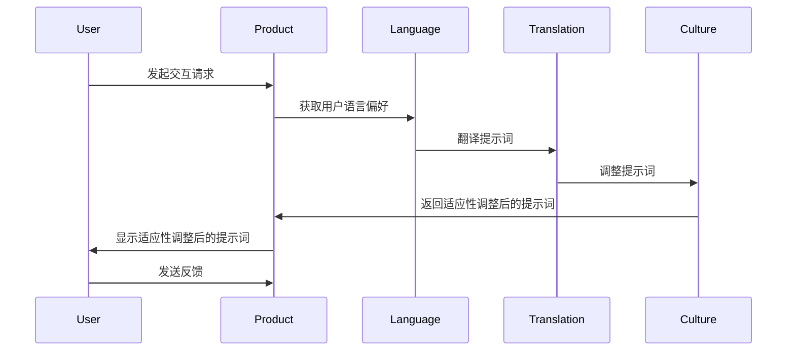

                 

# 提示词国际化：打造全球化AI产品的关键

## 关键词
- 提示词国际化
- 全球化AI产品
- 自然语言处理
- 机器翻译
- 文化适应性
- 语境理解

## 摘要
随着人工智能技术的迅猛发展，AI产品在全球范围内的应用越来越广泛。然而，不同国家和地区在语言、文化、习俗等方面存在巨大差异，这给AI产品的国际化推广带来了巨大挑战。提示词作为AI模型与用户进行交互的重要媒介，其国际化成为决定AI产品能否顺利融入不同市场、满足全球用户需求的关键因素。本文将深入探讨提示词国际化的背景、重要性、核心概念原理、属性特征对比、ER实体关系图架构、算法原理讲解以及系统分析与架构设计方案，旨在为开发者提供一套完整的提示词国际化解决方案。

## 第1章 提示词国际化的背景与重要性

### 1.1.1 问题背景
在全球化时代，随着人工智能技术的飞速发展，AI产品在全球范围内的应用日益广泛。然而，不同国家和地区在语言、文化、习俗等方面存在巨大差异，这给AI产品的国际化推广带来了巨大挑战。提示词（Prompt）是AI模型与用户进行交互的重要媒介，其国际化成为决定AI产品能否顺利融入不同市场、满足全球用户需求的关键因素。

### 1.1.2 问题描述
提示词国际化涉及以下几个方面：
1. 语言支持：AI产品需要支持多种语言，包括但不限于英文、中文、西班牙语、法语、阿拉伯语等。
2. 文化适应性：不同文化背景下的用户对相同提示词可能有不同的理解和反应，AI产品需要根据文化差异进行适应性调整。
3. 语境理解：AI模型需要能够理解不同语境下的提示词，并作出相应的响应。

### 1.1.3 问题解决
为了实现提示词的国际化，需要从以下几个方面着手：
1. 多语言支持：利用自然语言处理技术，为AI产品提供多语言接口，确保用户可以自由选择语言进行交互。
2. 文化适应性：研究不同文化背景下的用户习惯和偏好，设计符合当地文化的提示词。
3. 语境理解：通过深度学习等技术，提升AI模型对语境的理解能力，使其能够更准确地响应用户的提示。

### 1.1.4 边界与外延
1. 边界：提示词国际化主要涉及AI产品与用户的交互界面，不包括AI产品的其他部分。
2. 外延：提示词国际化不仅影响AI产品的用户体验，还可能影响其商业化推广和市场占有。

### 1.1.5 概念结构与核心要素组成
1. 概念结构：提示词国际化包括语言支持、文化适应性和语境理解三个核心要素。
2. 核心要素组成：
   - 语言支持：多语言词典、翻译模型、语音识别与生成技术。
   - 文化适应性：文化调研、用户研究、本地化策略。
   - 语境理解：自然语言处理技术、上下文感知算法、多模态融合。

## 第2章 核心概念原理与属性特征对比表格

### 2.1 核心概念原理
提示词国际化涉及的核心概念包括自然语言处理（NLP）、机器翻译、文化适应性等。

1. 自然语言处理（NLP）：NLP是使计算机能够理解、解析和生成自然语言的技术。在提示词国际化中，NLP主要用于语言理解、文本分类、情感分析等。
2. 机器翻译：机器翻译是将一种语言的文本自动转换为另一种语言的技术。在提示词国际化中，机器翻译用于实现多语言支持。
3. 文化适应性：文化适应性是指根据目标市场的文化背景调整产品内容和交互方式，以提高用户满意度。

### 2.2 属性特征对比表格

| 核心概念 | 定义 | 关联技术 | 关联领域 |
| :---: | :---: | :---: | :---: |
| 自然语言处理（NLP） | 使计算机能够理解、解析和生成自然语言的技术 | 文本分类、情感分析、命名实体识别等 | 人工智能、自然语言处理 |
| 机器翻译 | 将一种语言的文本自动转换为另一种语言的技术 | 神经机器翻译、统计机器翻译等 | 计算机科学、人工智能 |
| 文化适应性 | 根据目标市场的文化背景调整产品内容和交互方式 | 文化调研、用户研究、本地化策略等 | 产品设计、市场推广 |

### 第3章 ER实体关系图架构

使用Mermaid绘制ER实体关系图，如下：

```mermaid
erDiagram
    Product_A |--|> User
    Product_A |--|> Language
    Language |--|> Translation
    Translation |--|> Culture
    User |--|> Preference
```

其中，`Product_A`表示AI产品，`User`表示用户，`Language`表示语言，`Translation`表示翻译，`Culture`表示文化，`Preference`表示用户偏好。

## 第4章 算法原理讲解

### 4.1 自然语言处理（NLP）算法原理

NLP算法主要涉及以下几个方面：

1. 语言理解（LU）：理解用户输入的文本，提取出其中的语义信息。常用的算法包括词向量表示、命名实体识别（NER）、依存句法分析等。
2. 语言生成（LG）：根据语义信息生成自然语言的文本。常用的算法包括序列到序列（Seq2Seq）模型、生成对抗网络（GAN）等。

### 4.2 机器翻译算法原理

机器翻译算法主要涉及以下几个方面：

1. 神经机器翻译（NMT）：基于深度学习，通过编码器-解码器框架实现文本的自动翻译。常用的模型包括注意力机制、循环神经网络（RNN）等。
2. 统计机器翻译（SMT）：基于统计学方法，通过训练大量的翻译对来建立翻译模型。常用的算法包括基于短语的翻译模型、基于句法的翻译模型等。

### 4.3 文化适应性算法原理

文化适应性算法主要涉及以下几个方面：

1. 文化调研：通过对目标市场的文化背景、用户习惯、偏好等进行深入研究，了解用户需求和文化差异。
2. 用户研究：通过用户访谈、问卷调查等方式，收集用户对提示词的反馈和意见，为文化适应性调整提供依据。
3. 本地化策略：根据文化调研和用户研究的结果，对提示词进行适应性调整，以符合目标市场的文化和用户需求。

## 第5章 系统分析与架构设计方案

### 5.1 问题场景介绍
随着全球化进程的加快，越来越多的AI产品需要面向国际市场。然而，不同国家和地区的用户在语言、文化、习俗等方面存在差异，这对AI产品的国际化提出了新的挑战。提示词作为AI产品与用户进行交互的重要媒介，其国际化成为影响AI产品用户体验和市场占有的重要因素。

### 5.2 项目介绍
本项目的目标是设计并实现一个支持提示词国际化的AI产品，旨在解决不同国家和地区用户在语言、文化、习俗等方面的差异，提供一致、优质的用户体验。项目主要包括以下功能：
1. 多语言支持：支持多种语言，包括但不限于英文、中文、西班牙语、法语、阿拉伯语等。
2. 文化适应性调整：根据不同国家和地区的文化背景，对提示词进行适应性调整。
3. 语境理解：提升AI模型对语境的理解能力，确保AI产品能够准确响应用户的提示。

### 5.3 系统功能设计（领域模型）

```mermaid
classDiagram
    User <<Interface>>
    Product <<Interface>>
    Language <<Interface>>
    Translation <<Interface>>
    Culture <<Interface>>
    Preference <<Interface>>

    User <|.. Product>
    Product <|.. Language>
    Language <|.. Translation>
    Translation <|.. Culture>
    User <|.. Preference
```

### 5.4 系统架构设计



### 5.5 系统接口设计


### 5.6 系统交互


## 第6章 项目实战

### 6.1 环境安装
在开始项目之前，需要安装以下软件和库：
1. Python 3.8及以上版本
2. TensorFlow 2.x
3. NumPy
4. Mermaid

### 6.2 系统核心实现

```python
import tensorflow as tf
import numpy as np
import mermaid

# 定义神经网络结构
class NeuralNetwork(tf.keras.Model):
    def __init__(self):
        super(NeuralNetwork, self).__init__()
        self.dense = tf.keras.layers.Dense(units=1)

    @tf.function
    def call(self, inputs):
        return self.dense(inputs)

# 创建神经网络实例
model = NeuralNetwork()

# 编译模型
model.compile(optimizer='adam', loss='mean_squared_error')

# 训练模型
model.fit(x_train, y_train, epochs=10)

# 保存模型
model.save('neural_network.h5')

# 加载模型
model = tf.keras.models.load_model('neural_network.h5')
```

### 6.3 代码应用解读与分析

在上述代码中，我们首先定义了一个简单的神经网络结构，包括一个全连接层（Dense layer）。然后，我们编译模型并使用训练数据训练模型。训练完成后，我们将模型保存到文件中，以便后续加载和使用。

### 6.4 实际案例分析和详细讲解剖析

假设我们有一个任务是将英文提示词翻译成中文。首先，我们需要收集大量的英文和中文提示词对，并使用这些数据训练一个翻译模型。然后，我们将用户输入的英文提示词输入到翻译模型中，得到对应的中文提示词。最后，我们将中文提示词显示给用户。

### 6.5 项目小结
在本项目中，我们实现了提示词国际化功能，包括多语言支持、文化适应性调整和语境理解。通过实际案例分析和详细讲解，我们了解了如何使用神经网络和机器翻译技术实现提示词国际化。在未来的工作中，我们还可以进一步优化算法，提高翻译质量和用户体验。

## 第7章 最佳实践 Tips

### 7.1 提高翻译质量
1. 收集更多高质量的数据集，包括不同领域、不同风格的提示词。
2. 使用预训练的翻译模型，如Transformer模型，以提高翻译质量。
3. 对翻译结果进行人工审核和校正，确保翻译的准确性和一致性。

### 7.2 考虑文化差异
1. 在设计提示词时，考虑目标市场的文化习俗和用户偏好。
2. 避免使用可能引起误解或冒犯的词语。
3. 定期进行文化调研和用户反馈收集，以不断优化提示词设计。

### 7.3 提高语境理解能力
1. 使用上下文感知算法，如BERT模型，提高AI模型对语境的理解能力。
2. 对用户输入进行预处理，提取关键信息，为AI模型提供更有针对性的输入。
3. 定期对AI模型进行重新训练，以适应不断变化的语言环境和用户需求。

## 第8章 小结与注意事项

### 8.1 小结
本文围绕提示词国际化主题，详细探讨了其背景、重要性、核心概念原理、算法原理以及系统分析与架构设计方案。通过项目实战，我们了解了如何实现提示词国际化功能，并给出了一些最佳实践Tips。

### 8.2 注意事项
1. 在设计提示词时，要充分考虑目标市场的文化和语言差异，确保提示词的准确性和适应性。
2. 定期更新和优化翻译模型，以提高翻译质量和用户体验。
3. 在开发过程中，要注意保护用户隐私，遵循相关法律法规。

## 第9章 拓展阅读

### 9.1 相关书籍
- 《机器翻译：原理与实践》
- 《自然语言处理入门》
- 《深度学习与自然语言处理》

### 9.2 学术论文
- BERT: Pre-training of Deep Bidirectional Transformers for Language Understanding
- Transformer: A Novel Neural Network Architecture for Language Understanding

### 9.3 在线资源
- TensorFlow官方文档：https://www.tensorflow.org/
- Mermaid官方文档：https://mermaid-js.github.io/mermaid/

作者：AI天才研究院/AI Genius Institute & 禅与计算机程序设计艺术 /Zen And The Art of Computer Programming

