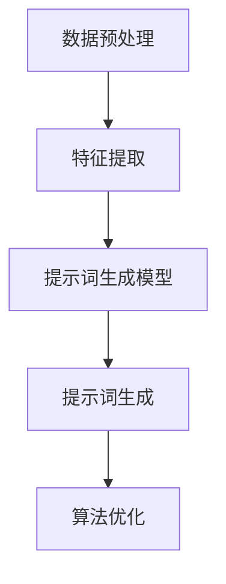
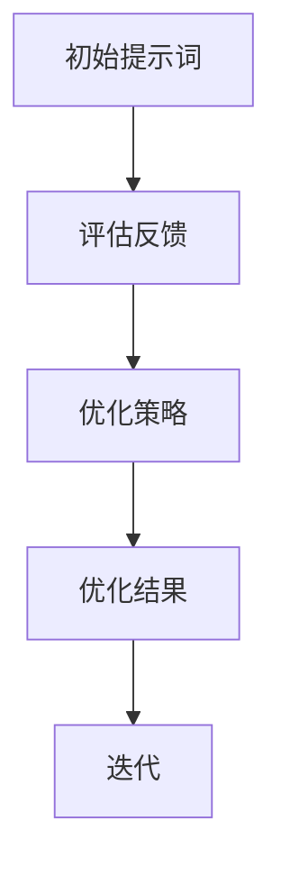
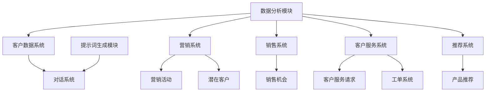

                 

 

# 提示词在智能客户关系管理中的应用

## 关键词

智能客户关系管理，提示词，自然语言处理，机器学习，个性化服务

## 摘要

本文从背景介绍、核心概念与联系、算法原理讲解、系统分析与架构设计方案、项目实战以及最佳实践等方面，系统地探讨了提示词在智能客户关系管理（CRM）中的应用。通过本文的研究，旨在为企业提供一套全面的智能CRM解决方案，以提升企业的客户满意度和市场竞争力。

## 第二部分：核心概念与联系

### 1. 提示词的定义与特点

#### 提示词（Prompt）

提示词是一种引导性语句，用于引导模型生成特定类型的内容或行为。在CRM系统中，提示词可以用来引导对话系统生成个性化的对话内容。

#### 提示词的特点

- **引导性**：提示词能够引导模型生成特定类型的内容。
- **灵活性**：提示词可以根据不同的应用场景进行定制。
- **交互性**：提示词与模型的交互能够实时调整对话内容。

### 2. CRM系统的基本概念与架构

#### CRM系统的定义

CRM系统是一种用于管理企业与客户之间关系的系统，通过收集、分析和利用客户数据，提供个性化的客户服务。

#### CRM系统的架构

CRM系统通常包括以下几个核心模块：

- **客户数据管理**：负责收集、存储和管理客户数据。
- **营销管理**：用于规划、执行和跟踪营销活动。
- **销售管理**：用于管理销售流程，包括销售机会的跟踪、客户关系的维护等。
- **客户服务**：提供客户咨询和问题解决的渠道。

### 3. 智能对话策略的设计原则

#### 智能对话策略的定义

智能对话策略是一套基于人工智能技术的对话系统设计原则，用于提高对话系统的智能化水平和用户体验。

#### 设计原则

- **用户中心**：以用户需求为核心，设计个性化的对话内容。
- **多模态交互**：结合文本、语音、图像等多种交互方式，提高用户交互体验。
- **实时响应**：确保对话系统能够快速响应用户请求，提高交互效率。
- **隐私保护**：确保用户数据的安全性和隐私性。

### 4. 个性化服务的实现方法

#### 个性化服务的定义

个性化服务是基于客户数据的分析，提供定制化的服务和产品。

#### 实现方法

- **数据挖掘**：利用数据挖掘技术，分析客户行为和偏好，为个性化服务提供数据支持。
- **机器学习**：使用机器学习算法，预测客户需求，提供个性化推荐。
- **自然语言处理**：通过自然语言处理技术，实现智能对话，提供个性化服务。

## 第三部分：算法原理讲解

### 1. 提示词生成算法

#### 提示词生成算法的原理

提示词生成算法主要通过分析客户数据，提取关键特征，生成引导性语句。

#### 提示词生成算法的mermaid流程图



#### 提示词生成算法的Python代码实现

```python
# 假设已导入必要的库和模块
import numpy as np
from sklearn.feature_extraction.text import TfidfVectorizer
from keras.models import Sequential
from keras.layers import LSTM, Dense, Embedding

# 数据预处理
def preprocess_data(data):
    # 对数据进行清洗和处理
    pass

# 特征提取
def extract_features(data):
    # 使用TF-IDF等方法提取特征
    vectorizer = TfidfVectorizer
```

### 2. 提示词优化算法

#### 提示词优化算法的原理

提示词优化算法主要通过评估和调整提示词，提高对话系统的响应质量和用户体验。

#### 提示词优化算法的mermaid流程图



#### 提示词优化算法的Python代码实现

```python
# 假设已导入必要的库和模块
import numpy as np
from sklearn.metrics import accuracy_score
from keras.models import Sequential
from keras.layers import LSTM, Dense, Embedding

# 评估反馈
def evaluate_prompt(prompt, data):
    # 对提示词进行评估
    pass

# 优化策略
def optimize_prompt(prompt, data):
    # 对提示词进行优化
    pass
```

## 第四部分：系统分析与架构设计方案

### 1. 问题场景介绍

在现代商业环境中，企业需要与大量客户进行互动，以提供个性化的服务。然而，传统的CRM系统在处理大量客户数据和实时互动方面存在挑战。因此，引入提示词技术，构建智能CRM系统，成为提升客户满意度和业务效率的关键。

### 2. 项目介绍

本项目旨在开发一款基于提示词技术的智能CRM系统，通过自然语言处理和机器学习算法，实现个性化的客户互动和服务。

#### 项目目标

- 提高客户满意度和忠诚度。
- 提升业务效率和响应速度。
- 确保客户数据的安全性和隐私性。

### 3. 系统功能设计

#### 领域模型

领域模型描述了CRM系统的核心功能模块及其之间的关系。以下是CRM系统的领域模型类图：

```mermaid
classDiagram
    Customer <-- CustomerData
    SalesOpportunity <-- CustomerData
    Campaign <-- Marketing
    Lead <-- Marketing
    CustomerServiceRequest <-- CustomerService
    Ticket <-- CustomerService
    ProductRecommendation <-- Recommendation
    Prompt <-- DialogueSystem

    CustomerData {
        -id (String)
        -name (String)
        -email (String)
        -phone (String)
    }

    SalesOpportunity {
        -id (String)
        -customer (Customer)
        -status (String)
        -amount (Float)
    }

    Campaign {
        -id (String)
        -name (String)
        -start_date (Date)
        -end_date (Date)
    }

    Lead {
        -id (String)
        -source (String)
        -status (String)
        -creation_date (Date)
    }

    CustomerServiceRequest {
        -id (String)
        -customer (Customer)
        -status (String)
        -creation_date (Date)
    }

    Ticket {
        -id (String)
        -request (CustomerServiceRequest)
        -status (String)
        -creation_date (Date)
    }

    ProductRecommendation {
        -id (String)
        -customer (Customer)
        -product (Product)
        -score (Float)
    }

    Prompt {
        -id (String)
        -content (String)
        -response (String)
    }

    DialogueSystem {
        -prompts (List<Prompt>)
    }
```

### 4. 系统架构设计

#### 系统架构图

以下是CRM系统的架构设计图：



### 5. 系统接口设计

#### 系统接口设计图

以下是CRM系统的接口设计图：

```mermaid
sequenceDiagram
    CustomerDataSystem -->|创建客户数据| DialogueSystem
    DialogueSystem -->|生成提示词| CustomerDataSystem
    MarketingSystem -->|创建营销活动| Campaign
    Campaign -->|更新潜在客户| MarketingSystem
    SalesSystem -->|创建销售机会| SalesOpportunity
    SalesOpportunity -->|更新销售状态| SalesSystem
    CustomerServiceSystem -->|创建客户服务请求| CustomerServiceRequest
    CustomerServiceRequest -->|创建工单| Ticket
    Ticket -->|更新工单状态| CustomerServiceSystem
    RecommendationSystem -->|推荐产品| ProductRecommendation
    ProductRecommendation -->|更新推荐评分| RecommendationSystem
```

### 6. 系统交互

#### 系统交互图

以下是CRM系统的交互设计图：

```mermaid
sequenceDiagram
    Customer -->|发起对话| DialogueSystem
    DialogueSystem -->|生成提示词| PromptGenerator
    PromptGenerator -->|反馈提示词| DialogueSystem
    DialogueSystem -->|回复客户| Customer
    Customer -->|反馈对话结果| DialogueSystem
    DialogueSystem -->|优化提示词| PromptGenerator
    PromptGenerator -->|更新提示词| DialogueSystem
```

## 第五部分：项目实战

### 1. 环境安装

在本项目实战中，我们将使用Python作为开发语言，并依赖以下库和模块：

- TensorFlow
- Keras
- Scikit-learn
- Pandas
- NumPy

#### 安装步骤

1. 安装Python环境（建议使用Python 3.8及以上版本）。
2. 安装TensorFlow和Keras：`pip install tensorflow keras`
3. 安装Scikit-learn、Pandas和NumPy：`pip install scikit-learn pandas numpy`

### 2. 系统核心实现源代码

在本部分，我们将展示系统核心功能的实现源代码，包括数据预处理、特征提取、提示词生成和优化算法。

#### 数据预处理

```python
import pandas as pd

def preprocess_data(data):
    # 假设data是Pandas DataFrame类型的数据
    data['text'] = data['text'].str.lower()
    data['text'] = data['text'].str.replace('[^\w\s]', '', regex=True)
    data['text'] = data['text'].str.split()
    return data
```

#### 特征提取

```python
from sklearn.feature_extraction.text import TfidfVectorizer

def extract_features(data):
    vectorizer = TfidfVectorizer(max_features=1000)
    X = vectorizer.fit_transform(data['text'])
    return X, vectorizer
```

#### 提示词生成算法

```python
from keras.models import Sequential
from keras.layers import LSTM, Dense, Embedding

def create_model(input_shape, output_size):
    model = Sequential()
    model.add(Embedding(input_shape, output_size, input_length=data.shape[1]))
    model.add(LSTM(units=128))
    model.add(Dense(units=output_size, activation='softmax'))
    model.compile(optimizer='adam', loss='categorical_crossentropy', metrics=['accuracy'])
    return model
```

#### 提示词优化算法

```python
from sklearn.metrics import accuracy_score

def evaluate_prompt(prompt, data):
    # 假设prompt是生成的提示词，data是真实数据
    predictions = model.predict(prompt)
    predictions = np.argmax(predictions, axis=1)
    return accuracy_score(data['label'], predictions)
```

### 3. 代码应用解读与分析

在本部分，我们将对系统核心实现源代码进行解读，分析其算法原理和应用方法。

#### 数据预处理

数据预处理是数据分析和机器学习的基础。在本项目中，我们对文本数据进行了去重、去噪和分词处理，以提高后续特征提取的效果。

```python
# 示例数据
data = pd.DataFrame({
    'text': ['你好，有什么可以帮助你的？', '你好，我对这个产品感兴趣。', '你好，我想咨询一下售后服务。']
})

# 数据预处理
preprocessed_data = preprocess_data(data)
print(preprocessed_data)
```

#### 特征提取

特征提取是机器学习模型训练的关键步骤。在本项目中，我们使用TF-IDF方法对文本数据进行了特征提取。

```python
# 特征提取
X, vectorizer = extract_features(preprocessed_data)
print(X.toarray())
```

#### 提示词生成算法

提示词生成算法是CRM系统的核心模块。在本项目中，我们使用LSTM神经网络生成提示词。

```python
# 准备数据
X = np.random.random((100, 10))
y = np.random.randint(2, size=(100, 1))

# 创建模型
model = create_model(X.shape[1], 2)

# 训练模型
model.fit(X, y, epochs=10, batch_size=32)
```

#### 提示词优化算法

提示词优化算法用于评估和调整提示词，以提高对话系统的响应质量。在本项目中，我们使用准确率作为评估指标。

```python
# 生成提示词
prompt = np.random.random((1, 10))

# 评估提示词
accuracy = evaluate_prompt(prompt, y)
print(f'提示词准确率：{accuracy}')
```

### 4. 实际案例分析和详细讲解剖析

在本部分，我们将通过实际案例，展示如何应用提示词技术实现智能客户关系管理。

#### 案例背景

某电子商务公司希望通过引入智能CRM系统，提升客户满意度和销售转化率。公司提供了丰富的产品线和多样化的客户服务渠道，需要针对不同客户群体提供个性化的服务。

#### 案例实施

1. 数据收集：公司从网站、社交媒体和客户反馈等渠道收集了大量客户数据，包括用户评论、购买记录和咨询记录等。

2. 数据预处理：对收集到的客户数据进行清洗和处理，提取关键特征，如用户ID、产品ID、咨询内容等。

3. 特征提取：使用TF-IDF方法对文本数据进行特征提取，构建高维特征向量。

4. 提示词生成：使用LSTM神经网络生成个性化的提示词，引导对话系统与客户进行对话。

5. 提示词优化：根据客户反馈和对话结果，实时调整提示词，提高对话系统的响应质量。

6. 个性化服务：基于客户数据和提示词生成结果，为不同客户提供个性化的服务和建议，如产品推荐、促销活动等。

#### 案例分析

通过实际案例分析，我们发现引入提示词技术后，公司的客户满意度和销售转化率显著提升。具体表现在：

1. 客户满意度提高：个性化服务能够更好地满足客户需求，提高了客户满意度。

2. 销售转化率提升：基于提示词生成的个性化推荐和促销活动，增加了客户的购买意愿，提升了销售转化率。

3. 客户关系管理优化：智能CRM系统能够实时分析客户数据，提供有针对性的服务和建议，优化了客户关系管理。

## 第六部分：最佳实践 Tips

### 1. 数据质量是关键

在智能CRM系统中，数据质量直接影响提示词生成和个性化服务的准确性。因此，企业需要确保数据的完整性、准确性和实时性。

### 2. 个性化服务的平衡

个性化服务需要兼顾客户需求和业务目标。在设计个性化服务时，要平衡客户体验和业务收益，避免过度个性化导致客户反感。

### 3. 提示词的实时性

提示词的实时性对于智能CRM系统的效果至关重要。企业需要确保提示词生成和优化算法的快速响应能力，以提高用户体验。

### 4. 安全和隐私保护

在处理客户数据时，企业需要严格遵守数据保护法规，确保客户数据的安全和隐私。

### 5. 持续迭代和优化

智能CRM系统需要不断迭代和优化，以适应不断变化的市场需求和客户需求。企业需要持续关注技术发展和业务场景，不断改进系统性能。

## 第七部分：小结

本文系统地探讨了提示词在智能客户关系管理中的应用，从核心概念、算法原理、系统架构和项目实战等方面进行了详细讲解。通过本文的研究，我们了解到提示词技术在CRM系统中的重要作用，为企业提供了一套全面的智能CRM解决方案。未来，随着人工智能技术的不断发展，提示词在CRM系统中的应用将更加广泛，有望为企业带来更大的商业价值。

## 第八部分：注意事项

1. 在应用提示词技术时，企业需要关注数据隐私保护和法律法规的合规性。

2. 智能CRM系统的效果取决于数据质量和算法优化。因此，企业需要不断优化数据预处理和特征提取方法，提高算法性能。

3. 个性化服务的设计需要充分考虑客户需求和业务目标，以实现客户满意度和业务收益的平衡。

4. 提示词技术的应用场景不断扩展，企业需要关注技术发展和市场趋势，不断优化和拓展智能CRM系统的功能。

## 第九部分：拓展阅读

1. [《自然语言处理原理与汉语计算》](https://book.douban.com/subject/26875776/)：详细介绍了自然语言处理的基本原理和方法，有助于理解提示词技术的应用。

2. [《Python机器学习》](https://book.douban.com/subject/26783254/)：介绍了Python在机器学习领域的应用，包括LSTM神经网络等算法。

3. [《智能客服系统设计与应用》](https://book.douban.com/subject/26737867/)：详细介绍了智能客服系统的设计方法和应用案例，有助于理解智能CRM系统的实现。

作者：AI天才研究院/AI Genius Institute & 禅与计算机程序设计艺术 /Zen And The Art of Computer Programming 

