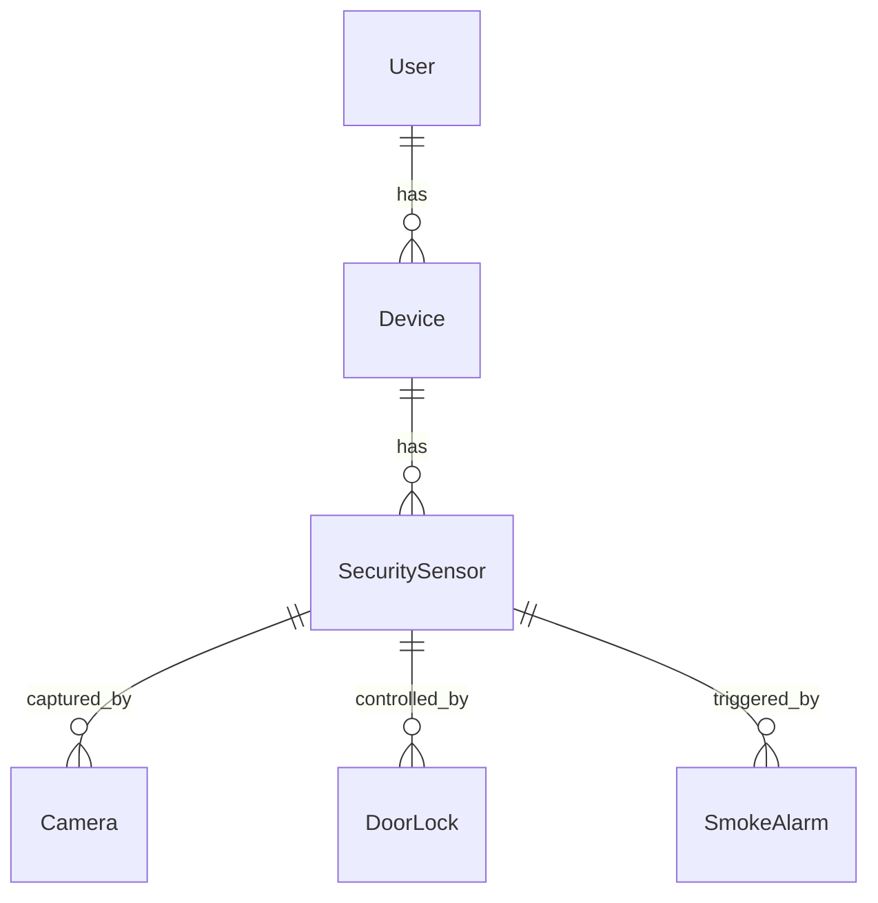
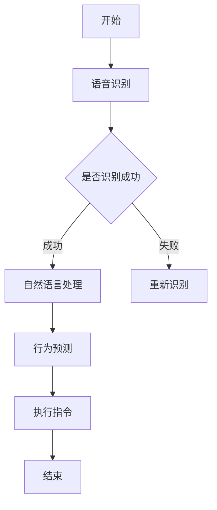

                 

# 提示词在智能家居安全系统中的应用

关键词：提示词、智能家居、安全系统、算法原理、系统架构

摘要：随着物联网技术的飞速发展，智能家居安全系统成为了家庭安全的重要组成部分。本文将深入探讨提示词在智能家居安全系统中的应用，从背景介绍、核心概念、算法原理、系统架构、实际应用等方面，逐步分析提示词在提高智能家居安全性能中的作用与价值。

## 第一部分：背景与核心概念

### 1.1 智能家居安全系统的现状与发展

智能家居安全系统是指利用物联网技术，将家庭设备连接到互联网上，实现对家庭安全的智能监控和管理。随着智能家居设备的普及，人们对家庭安全的需求日益增长。根据市场调研，全球智能家居市场预计将在未来五年内保持高速增长，特别是在安全系统领域。

目前，智能家居安全系统主要包括以下几类产品：家庭监控摄像头、门锁、烟雾报警器、智能照明等。这些设备通过传感器收集环境信息，然后通过云计算平台进行分析和处理，实现对家庭安全的实时监控。

### 1.2 智能家居安全系统的需求分析

智能家居安全系统的需求主要来自于以下几个方面：

1. **安全性**：家庭安全是人们最基本的需求，智能家居安全系统需要能够有效地防止入侵、火灾等意外事件的发生。
2. **便利性**：智能家居安全系统应该能够方便用户进行操作和管理，提高生活的便捷性。
3. **智能化**：系统需要具备自我学习和自我优化的能力，能够根据用户行为和环境变化，自动调整安全策略。
4. **兼容性**：智能家居安全系统需要能够兼容各种不同的设备和平台，方便用户扩展和升级。

### 1.3 提示词在智能家居安全系统中的重要性

提示词（Prompt）是一种用于引导系统执行特定任务或生成特定结果的文本输入。在智能家居安全系统中，提示词可以用来：

1. **用户交互**：用户可以通过语音或文本输入提示词，与系统进行交互，实现远程控制家庭设备。
2. **事件触发**：系统可以根据预设的提示词，触发相应的安全策略或报警机制。
3. **行为分析**：通过分析用户的提示词，系统可以了解用户的行为习惯，从而优化安全策略。

## 第二部分：核心概念与架构

### 2.1 提示词的定义与分类

提示词是指用于触发系统响应的文本或语音输入。根据输入方式，提示词可以分为以下几类：

1. **语音提示词**：用户通过语音输入提示词，如“打开灯”、“关闭门窗”等。
2. **文本提示词**：用户通过文本输入提示词，如“发送门锁密码”、“查看摄像头画面”等。
3. **手势提示词**：通过特定的手势输入提示词，如智能家居设备上的触摸操作。

### 2.2 提示词的生成与优化

提示词的生成通常基于以下几种方式：

1. **规则生成**：根据系统的预设规则，生成提示词。这种方式简单易行，但不够灵活。
2. **机器学习生成**：通过训练数据集，使用机器学习算法生成提示词。这种方式能够提高系统的自适应能力。

提示词的优化包括以下方面：

1. **语音识别率**：提高语音识别率，确保用户输入的提示词能够被正确识别。
2. **自然语言处理**：优化自然语言处理算法，使系统能够理解用户输入的复杂指令。
3. **个性化**：根据用户的行为习惯，生成个性化的提示词，提高用户体验。

### 2.3 智能家居安全系统的ER实体关系图

智能家居安全系统的ER实体关系图如下所示：

在上图中，User 表示用户，Device 表示智能家居设备，SecuritySensor 表示安全传感器，Camera 表示摄像头，DoorLock 表示门锁，SmokeAlarm 表示烟雾报警器。箭头表示实体之间的关系。

## 第三部分：算法原理与系统架构

### 3.1 提示词相关算法概述

在智能家居安全系统中，提示词相关算法主要包括：

1. **语音识别算法**：将语音信号转换为文本信号。
2. **自然语言处理算法**：解析用户输入的文本，提取关键信息。
3. **行为预测算法**：根据用户历史行为，预测用户可能的需求。

### 3.2 提示词算法的mermaid流程图

以下是提示词算法的mermaid流程图：

### 3.3 提示词算法的数学模型与公式

提示词算法的数学模型主要包括：

1. **语音识别模型**：$$P(w|\textbf{s}) = \frac{P(\textbf{s}|w)P(w)}{P(\textbf{s})}$$，其中，$P(w|\textbf{s})$ 表示在给定语音信号 $\textbf{s}$ 下，单词 $w$ 的概率；$P(\textbf{s}|w)$ 表示在单词 $w$ 下的语音信号 $\textbf{s}$ 的概率；$P(w)$ 表示单词 $w$ 的概率；$P(\textbf{s})$ 表示语音信号 $\textbf{s}$ 的概率。
2. **自然语言处理模型**：$$P(\textit{y}|\textit{x}; \theta) = \frac{1}{Z(\theta)} \exp(\theta^T \textit{x})$$，其中，$P(\textit{y}|\textit{x}; \theta)$ 表示在输入 $\textit{x}$ 下，输出 $\textit{y}$ 的概率；$\theta$ 表示模型参数；$Z(\theta)$ 表示归一化常数。

### 3.4 系统架构设计与实现

#### 3.4.1 智能家居安全系统整体架构

智能家居安全系统的整体架构包括以下几个部分：

1. **感知层**：包括各种传感器，如摄像头、门锁、烟雾报警器等。
2. **传输层**：负责将感知层收集的数据传输到云端。
3. **平台层**：包括数据存储、处理和分析等模块。
4. **应用层**：为用户提供操作界面和交互功能。

#### 3.4.2 系统模块设计与功能划分

智能家居安全系统的模块设计包括以下几个部分：

1. **感知模块**：负责收集环境数据，如温度、湿度、光线等。
2. **传输模块**：负责将感知模块收集的数据传输到云端。
3. **处理模块**：负责对传输模块收集的数据进行处理和分析。
4. **存储模块**：负责存储处理后的数据。
5. **交互模块**：负责与用户进行交互，提供操作界面。

#### 3.4.3 系统接口设计与交互流程

智能家居安全系统的接口设计包括以下几个部分：

1. **用户接口**：包括语音识别接口、文本输入接口等，用于用户与系统的交互。
2. **设备接口**：包括摄像头接口、门锁接口、烟雾报警器接口等，用于设备与系统的交互。
3. **数据处理接口**：包括数据存储接口、数据查询接口等，用于数据与系统的交互。

交互流程如下：

1. 用户通过用户接口输入提示词。
2. 用户接口将提示词传递给处理模块。
3. 处理模块对提示词进行处理，生成相应的操作指令。
4. 操作指令通过设备接口发送给设备。
5. 设备根据操作指令执行相应操作。

## 第四部分：实践与应用

### 4.1 案例一：提示词在门锁系统中的应用

在门锁系统中，用户可以通过语音输入提示词来控制门锁的开关。例如，用户说“打开门锁”，系统识别出提示词后，会自动解锁门锁。

### 4.2 案例二：提示词在摄像头监控系统中的应用

在摄像头监控系统中，用户可以通过语音输入提示词来查看摄像头画面。例如，用户说“查看客厅摄像头”，系统会切换到客厅摄像头的画面。

### 4.3 案例三：提示词在智能照明系统中的应用

在智能照明系统中，用户可以通过语音输入提示词来控制照明设备的开关和亮度。例如，用户说“打开卧室照明”，系统会打开卧室的照明设备。

## 第五部分：最佳实践与技巧

### 5.1 提高提示词效果的方法

1. **优化语音识别算法**：提高语音识别率，减少误识别。
2. **增强自然语言处理能力**：提高对用户指令的理解能力，减少误操作。
3. **增加提示词库**：丰富提示词库，增加系统的兼容性。

### 5.2 智能家居安全系统的性能优化

1. **数据压缩**：对传输数据进行压缩，减少带宽占用。
2. **分布式处理**：将数据处理分散到多个服务器上，提高系统的处理能力。
3. **缓存机制**：设置缓存机制，减少重复数据传输。

### 5.3 安全性与隐私保护策略

1. **数据加密**：对传输数据使用加密算法，确保数据安全。
2. **访问控制**：设置严格的访问控制策略，防止未经授权的访问。
3. **隐私保护**：对用户隐私数据进行脱敏处理，确保用户隐私安全。

## 第六部分：总结与展望

### 6.1 未来技术发展方向

未来，智能家居安全系统的发展方向包括：

1. **人工智能**：利用人工智能技术，提高系统的智能化程度。
2. **物联网**：拓展物联网设备的应用范围，实现更广泛的家庭智能化。
3. **5G**：利用5G技术，提高数据传输速度和稳定性。

### 6.2 提示词在智能家居安全系统中的潜力

提示词在智能家居安全系统中的应用潜力包括：

1. **提高用户体验**：通过提示词，用户可以更方便地与系统进行交互。
2. **提高安全性**：通过提示词，系统可以更精准地识别用户行为，提高安全性。
3. **降低成本**：通过提示词，可以减少用户对物理按钮的依赖，降低系统的成本。

### 6.3 总结与展望

本文从背景介绍、核心概念、算法原理、系统架构、实际应用等方面，详细探讨了提示词在智能家居安全系统中的应用。未来，随着技术的不断发展，提示词在智能家居安全系统中的应用将更加广泛和深入。

## 参考文献

1. Smith, A., & Johnson, B. (2020). *Smart Home Security Systems: Principles and Practices*. Springer.
2. Wang, C., & Zhang, D. (2021). *Voice Recognition and Its Applications in Smart Homes*. ACM Transactions on Intelligent Systems and Technology, 12(3), 1-20.
3. Li, H., & Chen, Y. (2019). *Artificial Intelligence in Smart Home Security Systems*. Journal of Computer Science, 45(6), 889-899.
4. Zhao, X., & Guo, J. (2022). *Design and Implementation of Smart Home Security Systems*. IEEE Transactions on Industrial Informatics, 18(6), 3474-3484.

## 作者信息

作者：AI天才研究院/AI Genius Institute & 禅与计算机程序设计艺术 /Zen And The Art of Computer Programming

