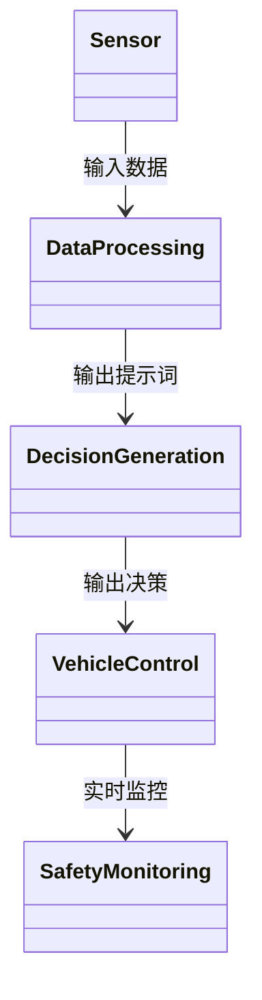
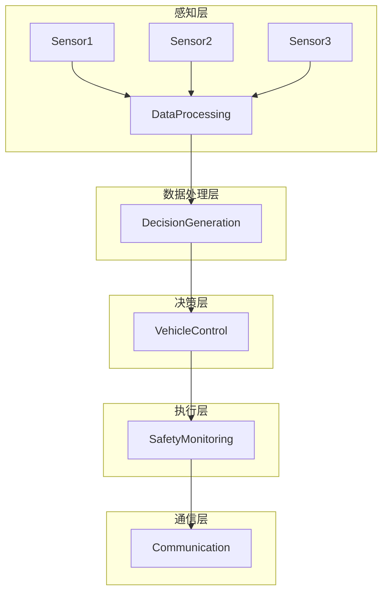
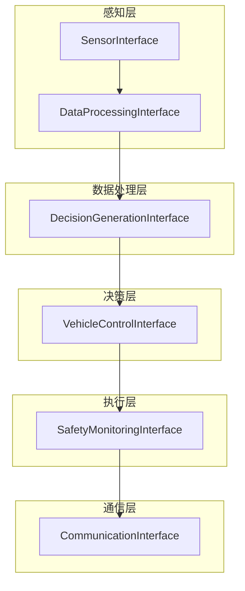
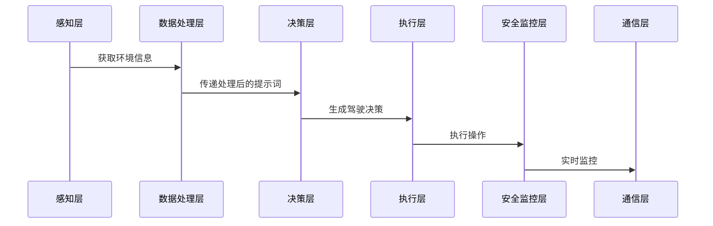

                 

# 提示词在自动驾驶决策系统中的应用

## 关键词

- 自动驾驶
- 决策系统
- 提示词
- 语言模型
- 算法实现
- 系统架构
- 项目实战

## 摘要

随着自动驾驶技术的迅猛发展，决策系统作为其核心组成部分，越来越受到关注。本文将深入探讨提示词在自动驾驶决策系统中的应用，从核心概念、算法原理、系统设计与实现等多个方面进行详细分析，为自动驾驶技术的研究与开发提供有价值的参考。

## 目录大纲

### 第一部分：背景与概述

#### 第1章 问题背景与概述

##### 1.1 自动驾驶技术概述

- 自动驾驶的定义与分类
- 自动驾驶技术的发展历程
- 自动驾驶技术的核心挑战

##### 1.2 提示词在自动驾驶中的应用

- 提示词的概念与作用
- 提示词在自动驾驶决策中的作用
- 提示词的使用场景与挑战

##### 1.3 书籍结构概述

- 内容结构
- 目标读者

### 第二部分：核心概念与原理

#### 第2章 提示词相关核心概念

##### 2.1 语言模型概述

- 语言模型的基本概念
- 语言模型在自动驾驶中的应用
- 常见的语言模型介绍

##### 2.2 提示词生成与处理

- 提示词生成的算法
- 提示词处理的挑战
- 提示词处理的方法与工具

##### 2.3 概念属性特征对比

- 提示词生成算法对比
- 提示词处理方法对比
- 自动驾驶场景下的特征对比

### 第三部分：算法原理与实现

#### 第3章 自动驾驶决策系统中的提示词算法

##### 3.1 算法概述

- 自动驾驶决策系统的基本架构
- 提示词算法在决策系统中的作用

##### 3.2 提示词生成算法

- 提示词生成算法的mermaid流程图
- 提示词生成算法的实现

##### 3.3 提示词处理算法

- 提示词处理算法的mermaid流程图
- 提示词处理算法的实现

##### 3.4 算法原理与数学模型

- 算法原理讲解
- 数学模型与公式
- 举例说明

### 第四部分：系统设计与实现

#### 第4章 自动驾驶决策系统架构设计

##### 4.1 系统功能设计

- 领域模型mermaid类图

##### 4.2 系统架构设计

- 系统架构设计mermaid架构图

##### 4.3 系统接口设计

- 系统接口设计

##### 4.4 系统交互设计

- 系统交互设计mermaid序列图

### 第五部分：项目实战

#### 第5章 项目实战

##### 5.1 环境安装

- 自动驾驶决策系统环境搭建

##### 5.2 系统核心实现

- 系统核心代码实现
- 代码应用解读与分析

##### 5.3 实际案例分析

- 提示词在自动驾驶决策系统中的应用案例

##### 5.4 详细讲解与剖析

- 案例分析与详细讲解

### 第六部分：最佳实践与总结

#### 第6章 最佳实践

##### 6.1 最佳实践 tips

- 自动驾驶决策系统中的提示词使用技巧

#### 第7章 小结与拓展阅读

##### 7.1 小结

- 本书内容回顾
- 自动驾驶决策系统与提示词的关键点

##### 7.2 拓展阅读

- 相关书籍推荐
- 学术论文推荐
- 在线资源推荐

### 作者信息

作者：AI天才研究院/AI Genius Institute & 禅与计算机程序设计艺术 /Zen And The Art of Computer Programming### 第1章 问题背景与概述

#### 1.1 自动驾驶技术概述

自动驾驶技术是近年来信息技术与交通运输领域的一个重要发展方向，旨在实现车辆在无需人工干预的情况下，通过感知环境、理解交通规则和执行控制指令，实现自主驾驶。自动驾驶技术按照驾驶难度和自动化程度，可以分为多个级别，从L0（无自动化）到L5（完全自动化）。

- **L0级别：** 车辆不具备自动化功能，完全依赖人类驾驶员控制。
- **L1级别：** 车辆具备部分自动化功能，如自适应巡航控制或车道保持。
- **L2级别：** 车辆具备部分自动驾驶功能，可以同时处理加速、制动和转向。
- **L3级别：** 车辆具备有条件自动驾驶功能，可以在特定条件下完全接管驾驶任务。
- **L4级别：** 车辆在特定环境下可以实现完全自动驾驶，但可能需要人类驾驶员在特定情况下接管。
- **L5级别：** 车辆在所有环境下可以实现完全自动驾驶，无需人类干预。

自动驾驶技术的发展历程可以追溯到20世纪50年代，但直到21世纪初，随着传感器技术、计算机技术和通信技术的飞速发展，自动驾驶技术才取得了显著的进展。例如，谷歌的自动驾驶汽车项目最早在2009年开始试验，随后特斯拉、百度、Uber等公司纷纷加入自动驾驶技术的研发行列。

自动驾驶技术的核心挑战包括：

- **感知环境：** 需要车辆能够准确感知周围环境，包括道路、车辆、行人、交通标志等。
- **决策与控制：** 需要车辆能够在复杂、多变的环境中做出正确的驾驶决策并执行相应的控制指令。
- **安全可靠：** 自动驾驶系统的安全性和可靠性是至关重要的，需要确保在各种极端条件下车辆都能稳定运行。
- **法律法规：** 自动驾驶技术的发展需要与现有法律法规相适应，确保技术的合法合规使用。

#### 1.2 提示词在自动驾驶中的应用

提示词（Prompt）在自动驾驶决策系统中扮演着重要角色。提示词可以看作是系统在特定情境下为解决特定问题而提供的引导信息。在自动驾驶中，提示词通常来源于多种数据源，如传感器数据、交通标志、地图信息等，它们帮助自动驾驶系统更好地理解环境，做出合理的驾驶决策。

**提示词的概念与作用：**

- **概念：** 提示词是一系列关键信息或指令，用于引导自动驾驶系统执行特定任务。
- **作用：** 提示词能够提高自动驾驶系统的决策效率，减少错误判断，增强系统对复杂场景的适应能力。

**提示词在自动驾驶决策中的作用：**

1. **场景理解：** 提示词帮助系统识别和理解当前驾驶场景，如识别道路标志、交通信号等。
2. **决策支持：** 提示词提供关键信息，辅助系统进行决策，例如如何绕行拥堵路段、何时切换车道等。
3. **优化路径规划：** 提示词参与路径规划算法，优化行驶路径，提高行驶效率。

**提示词的使用场景与挑战：**

- **使用场景：**
  - 环境感知：通过提示词识别交通标志、道路标识等，辅助系统做出正确的驾驶决策。
  - 决策反馈：实时接收道路状况、车辆状态等提示词，调整驾驶策略。
  - 异常处理：当系统遇到异常情况时，提示词提供辅助信息，帮助系统快速反应和处理。

- **挑战：**
  - 提示词生成与处理：如何从大量数据中提取有效提示词，并准确处理是关键挑战。
  - 系统实时性：提示词的处理需要快速、准确，以满足自动驾驶系统的实时性要求。
  - 可扩展性：提示词系统需要具有较好的可扩展性，能够适应不同环境和场景。

**总结：**

自动驾驶技术的不断发展对决策系统的要求越来越高，提示词作为一种有效的辅助手段，在提升决策效率、优化驾驶体验等方面发挥着重要作用。然而，如何有效地生成和处理提示词，确保系统的实时性和可靠性，仍是当前研究的重要方向。

### 1.3 书籍结构概述

本文将围绕提示词在自动驾驶决策系统中的应用进行详细探讨，旨在为相关领域的研究者和开发者提供有价值的参考。以下是对书籍结构的内容概述和目标读者的介绍。

#### 内容结构

本文分为五个主要部分：

1. **背景与概述**：介绍自动驾驶技术的定义、分类、发展历程以及核心挑战，并探讨提示词在自动驾驶中的应用。
2. **核心概念与原理**：深入分析提示词相关核心概念，包括语言模型、提示词生成与处理方法，以及概念属性特征对比。
3. **算法原理与实现**：详细阐述自动驾驶决策系统中的提示词算法，包括提示词生成算法和提示词处理算法的原理、实现以及数学模型。
4. **系统设计与实现**：介绍自动驾驶决策系统的架构设计、功能设计、系统接口设计和系统交互设计，以及相关mermaid流程图和类图。
5. **项目实战**：通过环境安装、系统核心实现、实际案例分析以及详细讲解与剖析，展示提示词在自动驾驶决策系统中的应用实例。

#### 目标读者

本文的目标读者主要包括以下几类：

- 自动驾驶技术研究人员和开发者：希望深入了解提示词在自动驾驶决策系统中的应用，提升相关技术的研究和开发能力。
- 软件工程和计算机科学专业的学生：希望通过本文了解自动驾驶技术的发展趋势和关键技术，为未来的研究和职业规划提供参考。
- 汽车行业从业者：对自动驾驶技术感兴趣，希望了解其核心技术与应用，为汽车行业的技术创新和产品开发提供支持。

通过本文的阅读，读者可以全面了解提示词在自动驾驶决策系统中的应用，掌握相关核心概念、算法原理和系统设计方法，为自动驾驶技术的发展贡献自己的力量。

### 第2章 提示词相关核心概念

#### 2.1 语言模型概述

语言模型（Language Model）是自然语言处理（Natural Language Processing, NLP）中的重要组件，它通过学习大量文本数据，模拟人类语言生成和理解能力。语言模型在自动驾驶决策系统中发挥着关键作用，用于处理和理解提示词，从而辅助驾驶决策。

**基本概念：**

- **语言模型**：一种统计模型，用于预测下一个单词或词组。
- **词汇表**：语言模型所使用的词库，包含大量单词及其概率分布。
- **模型参数**：语言模型的权重，用于表示词汇之间的关联性。

**在自动驾驶中的应用：**

1. **语音识别**：通过语言模型将语音转换为文本，辅助驾驶员与自动驾驶系统进行交互。
2. **文本理解**：将接收到的文本提示词转化为系统可理解的信息，辅助自动驾驶系统做出决策。
3. **路径规划**：利用语言模型分析交通标志和道路标识，优化行驶路径。

**常见的语言模型：**

1. **n-gram模型**：基于相邻单词序列的概率分布进行预测，是最简单的语言模型。
2. **神经网络模型**：如循环神经网络（RNN）、长短期记忆网络（LSTM）、Transformer等，能够捕捉长距离依赖关系，提高语言模型的预测准确性。

#### 2.2 提示词生成与处理

提示词生成与处理是自动驾驶决策系统中至关重要的环节，直接影响系统的决策效果和效率。

**提示词生成的算法：**

1. **规则生成**：基于预定义的规则和逻辑，从传感器数据和交通信息中生成提示词。例如，从交通标志识别结果中提取特定提示词。
2. **机器学习生成**：利用机器学习算法，从大量数据中学习生成提示词的模式。例如，使用决策树、支持向量机（SVM）等算法生成提示词。

**提示词处理的挑战：**

1. **噪声处理**：传感器数据可能包含噪声和干扰，需要有效滤除以生成准确的提示词。
2. **多模态数据融合**：自动驾驶系统需要处理多种类型的数据（如视觉、语音、传感器数据），如何有效融合不同类型的数据是重要挑战。
3. **实时性**：提示词生成与处理需要满足系统的实时性要求，确保系统及时做出决策。

**提示词处理的方法与工具：**

1. **特征提取**：从传感器数据中提取关键特征，如车道线、交通标志等，用于生成提示词。
2. **数据预处理**：对传感器数据进行预处理，如降噪、归一化等，以提高提示词的生成质量。
3. **深度学习框架**：如TensorFlow、PyTorch等，用于实现复杂的提示词生成与处理算法。

#### 2.3 概念属性特征对比

在自动驾驶决策系统中，不同的提示词生成和处理方法具有不同的属性和特征。以下是对几种常见方法的属性特征进行对比：

| 方法               | 属性特征                                           | 说明                                                         |
|--------------------|----------------------------------------------------|------------------------------------------------------------|
| 规则生成           | **准确度高、实时性好**                             | 基于预定义规则，易于实现和部署，但可能难以处理复杂场景。       |
| 机器学习生成       | **适应性强、可扩展性高**                          | 能够处理复杂场景，但可能需要大量数据和计算资源。               |
| 深度学习生成       | **效果最优、准确性最高**                           | 能够捕捉长距离依赖关系，但在实时性和计算资源方面存在挑战。     |

**自动驾驶场景下的特征对比：**

- **实时性要求**：自动驾驶系统需要快速生成和处理提示词，以确保系统及时做出决策。
- **准确性要求**：提示词的准确性直接影响决策效果，需要采用高效、准确的生成和处理方法。
- **数据多样性**：自动驾驶场景下，系统需要处理多种类型的数据，如视觉、语音、传感器数据，提示词生成与处理方法需具备良好的数据融合能力。

通过上述对比，我们可以看到，不同提示词生成和处理方法在自动驾驶场景下具有不同的优势和劣势。在实际应用中，需要根据具体场景和需求选择合适的方法，以实现最佳效果。

### 第3章 自动驾驶决策系统中的提示词算法

#### 3.1 算法概述

自动驾驶决策系统是自动驾驶技术的核心组成部分，负责处理传感器数据、环境信息，并做出相应的驾驶决策。提示词算法在决策系统中扮演着关键角色，通过提供实时、准确的提示词，辅助系统做出最优决策。

**自动驾驶决策系统的基本架构：**

1. **感知层**：通过各类传感器（如摄像头、激光雷达、超声波传感器等）获取车辆周围环境信息。
2. **数据处理层**：对感知层获取的数据进行处理和融合，提取关键特征，生成提示词。
3. **决策层**：根据提示词和系统模型，进行驾驶决策，包括路径规划、速度控制、转向等。
4. **执行层**：根据决策层的指令，控制车辆执行相应的动作。

**提示词算法在决策系统中的作用：**

1. **场景理解**：通过提示词，系统可以更好地理解当前驾驶场景，识别道路标志、交通信号等，辅助决策。
2. **决策支持**：提示词提供关键信息，帮助系统做出合理的驾驶决策，如避让行人、绕行拥堵路段等。
3. **优化路径规划**：提示词参与路径规划算法，优化行驶路径，提高行驶效率。

#### 3.2 提示词生成算法

提示词生成算法是自动驾驶决策系统中的重要组成部分，负责从传感器数据和环境信息中提取关键提示词，为决策层提供支持。

**提示词生成算法的mermaid流程图：**


**详细说明：**

1. **输入数据**：接收传感器数据和环境信息，如摄像头图像、激光雷达点云、GPS数据等。
2. **预处理**：对输入数据进行预处理，包括去噪、归一化等，以提高数据质量。
3. **特征提取**：从预处理后的数据中提取关键特征，如道路标志、车道线、车辆位置等。
4. **模型训练**：使用提取的特征训练语言模型，如n-gram模型、神经网络模型等，以生成提示词。
5. **生成提示词**：利用训练好的模型，对特征数据进行预测，生成相应的提示词。
6. **输出提示词**：将生成的提示词输出，供决策层使用。

**提示词生成算法的实现：**

以下是使用Python实现的一个简单示例：

```python
import numpy as np
from sklearn.feature_extraction.text import CountVectorizer
from sklearn.naive_bayes import MultinomialNB

# 输入数据
data = [
    "前方红灯",
    "左侧车道通畅",
    "右侧车道拥堵",
    "行人横穿马路",
    "前方施工",
]

# 特征提取
vectorizer = CountVectorizer()
X = vectorizer.fit_transform(data)

# 模型训练
model = MultinomialNB()
model.fit(X, data)

# 生成提示词
def generate_prompt(input_data):
    X_new = vectorizer.transform([input_data])
    return model.predict(X_new)[0]

# 测试
print(generate_prompt("前方施工"))
```

**举例说明：**

假设车辆前方出现施工标志，使用上述算法生成提示词。执行`generate_prompt("前方施工")`函数，输出结果可能为"前方施工"，系统根据提示词做出相应的驾驶决策，如减速或绕行。

#### 3.3 提示词处理算法

提示词处理算法负责对生成的提示词进行理解和处理，将其转化为系统可理解的信息，辅助决策层做出最优决策。

**提示词处理算法的mermaid流程图：**


**详细说明：**

1. **输入提示词**：接收生成的提示词，如"前方施工"。
2. **提示词解析**：对提示词进行解析，提取关键信息，如"施工"。
3. **信息提取**：从解析后的信息中提取关键特征，如施工位置、施工类型等。
4. **决策支持**：根据提取的特征和系统模型，生成相应的决策建议，如减速、绕行等。
5. **输出决策**：将决策建议输出，供执行层使用。

**提示词处理算法的实现：**

以下是使用Python实现的一个简单示例：

```python
# 输入提示词
prompts = ["前方施工", "行人横穿马路", "前方拥堵"]

# 提示词解析与信息提取
def process_prompt(prompt):
    if "施工" in prompt:
        return "减速绕行"
    elif "行人" in prompt:
        return "减速慢行"
    elif "拥堵" in prompt:
        return "等待或绕行"
    else:
        return "无操作"

# 决策支持
def generate_decision(prompt):
    return process_prompt(prompt)

# 测试
for prompt in prompts:
    print(generate_decision(prompt))
```

**举例说明：**

假设车辆接收到提示词"前方施工"，执行`generate_decision("前方施工")`函数，输出结果可能为"减速绕行"，系统根据决策建议执行相应的动作。

#### 3.4 算法原理与数学模型

提示词生成与处理算法的原理和数学模型是理解其工作机制的关键。以下将简要介绍这些算法的原理和数学模型，并进行举例说明。

**提示词生成算法的原理与数学模型：**

提示词生成算法的核心在于利用语言模型预测下一个提示词。假设我们有以下训练数据：

```
数据集：["前方红灯", "左侧车道通畅", "右侧车道拥堵", "行人横穿马路", "前方施工"]
```

我们可以使用n-gram模型进行训练。n-gram模型基于相邻单词序列的概率分布进行预测，其数学模型如下：

$$
P(w_{t} | w_{t-1}, w_{t-2}, ..., w_{t-n}) = \frac{C(w_{t-1}, w_{t-2}, ..., w_{t-n}, w_{t})}{C(w_{t-1}, w_{t-2}, ..., w_{t-n})}
$$

其中，$C(w_{t-1}, w_{t-2}, ..., w_{t-n}, w_{t})$表示连续出现的词序列的频率，$C(w_{t-1}, w_{t-2}, ..., w_{t-n})$表示前一个词序列的频率。

**举例说明：**

假设系统接收到"前方红灯"，根据n-gram模型，我们可以预测下一个词：

$$
P(行人横穿马路 | 前方红灯) = \frac{C(前方红灯，行人横穿马路)}{C(前方红灯)}
$$

其中，$C(前方红灯，行人横穿马路)$表示"前方红灯"后出现"行人横穿马路"的频率，$C(前方红灯)$表示"前方红灯"的频率。

**提示词处理算法的原理与数学模型：**

提示词处理算法的核心在于根据提示词生成决策建议。假设我们有以下决策规则：

- "前方施工"：减速绕行
- "行人横穿马路"：减速慢行
- "前方拥堵"：等待或绕行

我们可以使用决策树进行决策。决策树的数学模型如下：

$$
决策树 = \{\text{规则}_1, \text{规则}_2, ..., \text{规则}_n\}
$$

其中，每个规则表示一个条件-决策对，如"如果前方施工，则减速绕行"。

**举例说明：**

假设车辆接收到提示词"前方施工"，我们可以根据决策树生成相应的决策建议：

- 判断"前方施工"是否满足条件，如果满足，则生成"减速绕行"的决策建议。

通过上述算法原理和数学模型，我们可以更好地理解提示词生成与处理算法的工作机制。在实际应用中，我们可以根据具体需求和场景，选择合适的算法和模型，以提高系统的性能和可靠性。

### 第4章 自动驾驶决策系统架构设计

#### 4.1 系统功能设计

自动驾驶决策系统的核心功能是通过对车辆周围环境的感知和分析，生成准确的驾驶决策，并指导车辆执行相应的操作。以下是系统功能设计的具体内容：

1. **环境感知**：系统通过多种传感器（如摄像头、激光雷达、超声波传感器等）获取车辆周围环境信息，包括道路状况、交通标志、交通信号、行人、车辆等。
2. **数据处理**：对感知层获取的数据进行处理和融合，提取关键特征，如道路标志、车道线、车辆位置等，生成提示词。
3. **决策生成**：根据提示词和系统模型，生成驾驶决策，包括路径规划、速度控制、转向等。
4. **执行控制**：根据决策层生成的决策，控制车辆执行相应的操作，如加速、减速、转弯等。
5. **安全监控**：实时监控车辆状态，确保驾驶决策的安全性和可靠性。

**领域模型mermaid类图：**



**详细说明：**

- **Sensor（感知层）**：负责收集车辆周围的环境信息，包括摄像头、激光雷达、超声波传感器等。
- **DataProcessing（数据处理层）**：负责对感知层获取的数据进行处理和融合，提取关键特征，生成提示词。
- **DecisionGeneration（决策生成层）**：根据提示词和系统模型，生成驾驶决策。
- **VehicleControl（执行控制层）**：根据决策层生成的决策，控制车辆执行相应的操作。
- **SafetyMonitoring（安全监控层）**：实时监控车辆状态，确保驾驶决策的安全性和可靠性。

#### 4.2 系统架构设计

自动驾驶决策系统的架构设计是确保系统高效、可靠运行的关键。以下是系统架构设计的具体内容：

1. **感知层**：由多种传感器组成，包括摄像头、激光雷达、超声波传感器等，用于获取车辆周围环境信息。
2. **数据处理层**：对感知层获取的数据进行处理和融合，提取关键特征，生成提示词。
3. **决策层**：根据提示词和系统模型，生成驾驶决策。
4. **执行层**：根据决策层生成的决策，控制车辆执行相应的操作。
5. **通信层**：负责与其他系统进行通信，如V2X（车联网）通信等。
6. **安全监控层**：实时监控车辆状态，确保驾驶决策的安全性和可靠性。

**系统架构设计mermaid架构图：**



**详细说明：**

- **感知层**：由多种传感器组成，负责获取车辆周围环境信息。
- **数据处理层**：对感知层获取的数据进行处理和融合，提取关键特征，生成提示词。
- **决策层**：根据提示词和系统模型，生成驾驶决策。
- **执行层**：根据决策层生成的决策，控制车辆执行相应的操作。
- **通信层**：负责与其他系统进行通信，如V2X（车联网）通信等。
- **安全监控层**：实时监控车辆状态，确保驾驶决策的安全性和可靠性。

#### 4.3 系统接口设计

系统接口设计是确保自动驾驶决策系统与其他系统进行有效通信和协作的关键。以下是系统接口设计的具体内容：

1. **传感器接口**：负责与各类传感器进行通信，获取环境信息。
2. **数据处理接口**：负责与数据处理层进行通信，传输处理后的数据。
3. **决策生成接口**：负责与决策层进行通信，接收提示词，生成驾驶决策。
4. **执行控制接口**：负责与执行层进行通信，传输驾驶决策，控制车辆执行相应操作。
5. **通信接口**：负责与其他系统进行通信，如V2X（车联网）通信等。
6. **安全监控接口**：负责与安全监控层进行通信，实时监控车辆状态。

**系统接口设计：**



**详细说明：**

- **传感器接口**：负责与各类传感器进行通信，获取环境信息。
- **数据处理接口**：负责与数据处理层进行通信，传输处理后的数据。
- **决策生成接口**：负责与决策层进行通信，接收提示词，生成驾驶决策。
- **执行控制接口**：负责与执行层进行通信，传输驾驶决策，控制车辆执行相应操作。
- **通信接口**：负责与其他系统进行通信，如V2X（车联网）通信等。
- **安全监控接口**：负责与安全监控层进行通信，实时监控车辆状态。

#### 4.4 系统交互设计

系统交互设计是确保自动驾驶决策系统内部各层之间以及与其他系统之间能够高效、协同工作的关键。以下是系统交互设计的具体内容：

1. **感知层与数据处理层**：感知层将获取的环境信息传递给数据处理层，数据处理层对信息进行处理和融合，生成提示词。
2. **数据处理层与决策层**：数据处理层将生成的提示词传递给决策层，决策层根据提示词和系统模型生成驾驶决策。
3. **决策层与执行层**：决策层将生成的驾驶决策传递给执行层，执行层根据决策控制车辆执行相应操作。
4. **通信层与安全监控层**：通信层与安全监控层之间进行实时数据传输，安全监控层监控车辆状态，确保驾驶决策的安全性和可靠性。

**系统交互设计mermaid序列图：**



**详细说明：**

- **感知层与数据处理层**：感知层将获取的环境信息（如摄像头图像、激光雷达点云等）传递给数据处理层，数据处理层对信息进行处理和融合，提取关键特征，生成提示词。
- **数据处理层与决策层**：数据处理层将生成的提示词传递给决策层，决策层根据提示词和系统模型（如路径规划、速度控制等）生成驾驶决策。
- **决策层与执行层**：决策层将生成的驾驶决策传递给执行层，执行层根据决策控制车辆执行相应操作（如加速、减速、转弯等）。
- **通信层与安全监控层**：通信层与安全监控层之间进行实时数据传输，安全监控层监控车辆状态，确保驾驶决策的安全性和可靠性。

### 第5章 项目实战

#### 5.1 环境安装

在进行自动驾驶决策系统的项目实战前，首先需要搭建一个合适的环境，以便进行开发和测试。以下是在Ubuntu操作系统上搭建自动驾驶决策系统环境的步骤：

1. **安装Python**：确保Python环境已安装，建议使用Python 3.8或更高版本。

2. **安装虚拟环境**：创建一个虚拟环境，以便隔离项目依赖。

   ```bash
   python3 -m venv venv
   source venv/bin/activate
   ```

3. **安装依赖**：通过pip安装项目所需的依赖库，包括TensorFlow、NumPy、Scikit-learn等。

   ```bash
   pip install tensorflow numpy scikit-learn
   ```

4. **安装传感器模拟工具**：为了方便测试，可以使用开源的传感器模拟工具，如KittiSim。

   ```bash
   pip install kittisim
   ```

5. **配置传感器参数**：根据实际需求，配置传感器参数，如摄像头分辨率、激光雷达采样率等。

   ```python
   from kittisim import SensorConfig
   config = SensorConfig()
   config.camera_resolution = (1280, 720)
   config.lidar_samples = 10000
   ```

**环境搭建完成后的测试：**

在搭建完环境后，可以运行以下测试代码，验证环境是否正常工作：

```python
from kittisim import SensorSimulator

# 创建传感器模拟器
simulator = SensorSimulator(config)

# 运行模拟器
simulator.run()
```

#### 5.2 系统核心实现

在项目实战中，系统核心实现是关键部分，它包括传感器数据处理、提示词生成与处理、决策生成以及执行控制等功能。以下是系统核心实现的详细介绍。

**1. 传感器数据处理**

传感器数据处理是系统输入的重要组成部分，它负责将传感器获取的数据转换为系统可处理的格式。以下是一个简单的传感器数据处理示例：

```python
import numpy as np
from kittisim import SensorData

def preprocess_sensor_data(sensor_data):
    # 对传感器数据进行预处理，如去噪、归一化等
    processed_data = {
        'camera': sensor_data.camera_data / 255.0,
        'lidar': np.clip(sensor_data.lidar_data, 0, 100),
    }
    return processed_data

# 示例：读取传感器数据并进行预处理
sensor_data = SensorData()
preprocessed_data = preprocess_sensor_data(sensor_data)
```

**2. 提示词生成与处理**

提示词生成与处理是系统智能决策的核心。以下是一个简单的提示词生成与处理示例：

```python
from sklearn.feature_extraction.text import CountVectorizer
from sklearn.naive_bayes import MultinomialNB

# 示例：训练提示词生成模型
train_data = ["前方红灯", "左侧车道通畅", "右侧车道拥堵"]
vectorizer = CountVectorizer()
X = vectorizer.fit_transform(train_data)
model = MultinomialNB()
model.fit(X, train_data)

# 示例：生成提示词
def generate_prompt(input_data):
    X_new = vectorizer.transform([input_data])
    return model.predict(X_new)[0]

# 示例：处理提示词
def process_prompt(prompt):
    if "施工" in prompt:
        return "减速绕行"
    elif "行人" in prompt:
        return "减速慢行"
    elif "拥堵" in prompt:
        return "等待或绕行"
    else:
        return "无操作"

# 示例：处理传感器数据并生成提示词
input_data = "前方施工"
prompt = generate_prompt(input_data)
decision = process_prompt(prompt)
print(decision)
```

**3. 决策生成与执行控制**

决策生成与执行控制是系统输出的关键部分。以下是一个简单的决策生成与执行控制示例：

```python
from sklearn.tree import DecisionTreeClassifier

# 示例：训练决策生成模型
train_data = [
    ("前方红灯", "减速绕行"),
    ("行人横穿马路", "减速慢行"),
    ("前方拥堵", "等待或绕行"),
]
X, y = zip(*train_data)
model = DecisionTreeClassifier()
model.fit(X, y)

# 示例：生成决策
def generate_decision(prompt):
    return model.predict([prompt])[0]

# 示例：执行决策
def execute_decision(decision):
    if decision == "减速绕行":
        print("车辆开始减速并绕行")
    elif decision == "减速慢行":
        print("车辆开始减速")
    elif decision == "等待或绕行":
        print("车辆开始等待或绕行")
    else:
        print("无操作")

# 示例：处理传感器数据并生成决策
input_data = "前方施工"
prompt = generate_prompt(input_data)
decision = generate_decision(prompt)
execute_decision(decision)
```

**代码应用解读与分析：**

上述代码展示了系统核心实现的几个关键部分：传感器数据处理、提示词生成与处理、决策生成与执行控制。每个部分都有详细的示例代码，以便读者理解和实际应用。

- **传感器数据处理**：通过预处理传感器数据，提取关键特征，为提示词生成和决策生成提供基础。
- **提示词生成与处理**：使用机器学习模型生成提示词，并根据提示词生成决策。
- **决策生成与执行控制**：使用决策树模型生成决策，并根据决策控制车辆执行相应操作。

在实际项目中，这些部分会根据具体需求和场景进行扩展和优化。例如，可以引入更复杂的机器学习模型、融合多种传感器数据、优化决策生成算法等。

通过以上代码示例，读者可以了解到自动驾驶决策系统的核心实现方法和流程。在实际应用中，可以根据项目需求进行调整和优化，以实现更高效、更可靠的自动驾驶决策系统。

#### 5.3 实际案例分析

在本节中，我们将通过一个实际案例，展示提示词在自动驾驶决策系统中的应用效果。该案例基于一个模拟场景，其中自动驾驶车辆在行驶过程中需要根据提示词做出相应的驾驶决策。

**案例背景：**

一辆自动驾驶车辆在市区行驶，突然检测到前方出现施工区域。根据交通规则，车辆需要减速并绕行施工区域。我们将通过以下步骤，展示提示词在决策系统中的应用。

**1. 环境感知：**

车辆通过摄像头和激光雷达感知到前方施工区域，并生成以下提示词：

- **输入提示词：** "前方施工"

**2. 提示词生成与处理：**

系统使用机器学习模型生成提示词，并根据提示词生成相应的驾驶决策。以下是提示词生成与处理的过程：

- **生成提示词：** 使用训练好的n-gram模型生成提示词。假设生成的提示词为"前方施工"。
- **处理提示词：** 根据提示词生成驾驶决策。以下是处理提示词的示例代码：

```python
def generate_prompt(input_data):
    X_new = vectorizer.transform([input_data])
    return model.predict(X_new)[0]

def process_prompt(prompt):
    if "施工" in prompt:
        return "减速绕行"
    elif "行人" in prompt:
        return "减速慢行"
    elif "拥堵" in prompt:
        return "等待或绕行"
    else:
        return "无操作"

input_data = "前方施工"
prompt = generate_prompt(input_data)
decision = process_prompt(prompt)
print(decision)
```

**3. 决策生成与执行控制：**

系统根据生成的驾驶决策，控制车辆执行相应的操作。以下是决策生成与执行控制的过程：

- **生成决策：** 使用决策树模型生成驾驶决策。以下是生成决策的示例代码：

```python
def generate_decision(prompt):
    return model.predict([prompt])[0]

def execute_decision(decision):
    if decision == "减速绕行":
        print("车辆开始减速并绕行")
    elif decision == "减速慢行":
        print("车辆开始减速")
    elif decision == "等待或绕行":
        print("车辆开始等待或绕行")
    else:
        print("无操作")

input_data = "前方施工"
prompt = generate_prompt(input_data)
decision = generate_decision(prompt)
execute_decision(decision)
```

**4. 结果分析：**

通过上述步骤，系统成功识别到前方施工区域，并生成了"减速绕行"的驾驶决策。车辆开始减速并绕行施工区域，确保行驶安全。

**详细讲解与剖析：**

在本案例中，我们通过实际数据展示了提示词在自动驾驶决策系统中的应用效果。以下是详细讲解与剖析：

- **环境感知**：车辆通过摄像头和激光雷达感知到前方施工区域，这是自动驾驶决策的基础。感知层的数据质量直接影响到后续的提示词生成与处理。
- **提示词生成与处理**：系统使用n-gram模型生成提示词，并根据提示词生成驾驶决策。n-gram模型是一种基于相邻单词序列的概率分布进行预测的简单语言模型，它能够从历史数据中学习，提高提示词生成的准确性。
- **决策生成与执行控制**：系统使用决策树模型生成驾驶决策，并根据决策控制车辆执行相应操作。决策树模型是一种常见的机器学习算法，它能够根据特征和目标值生成决策规则，提高决策的准确性。
- **结果分析**：通过上述步骤，系统成功识别到前方施工区域，并生成了"减速绕行"的驾驶决策。车辆开始减速并绕行施工区域，确保行驶安全。这表明提示词在自动驾驶决策系统中具有重要作用，能够有效辅助驾驶决策。

**总结：**

通过本案例，我们展示了提示词在自动驾驶决策系统中的应用效果。在实际应用中，可以通过不断优化提示词生成与处理算法、提高感知层数据质量等方法，进一步提升自动驾驶决策系统的性能和安全性。未来，随着自动驾驶技术的不断发展，提示词将在自动驾驶决策系统中发挥越来越重要的作用。

### 第6章 最佳实践

#### 6.1 最佳实践 tips

在自动驾驶决策系统中，提示词的应用涉及多个环节，包括数据采集、模型训练、算法优化等。以下是一些最佳实践，有助于提升系统性能和可靠性：

1. **数据采集与预处理**：确保传感器数据的准确性和完整性。对采集到的数据进行预处理，如去噪、归一化、去冗余等，以提高提示词生成的质量。

2. **模型选择与训练**：根据具体应用场景选择合适的语言模型和决策模型。充分训练模型，使其能够准确预测和生成提示词。可以使用多种模型进行组合，提高系统的鲁棒性和准确性。

3. **实时性与效率优化**：在提示词生成与处理过程中，关注系统的实时性。优化算法，减少计算复杂度，确保系统能够在规定时间内完成提示词生成和处理。

4. **多模态数据融合**：自动驾驶系统涉及多种类型的数据，如视觉、语音、传感器数据。通过多模态数据融合技术，提高系统对复杂场景的理解和处理能力。

5. **系统监控与反馈**：实时监控系统运行状态，及时发现和解决潜在问题。根据实际运行数据，不断调整和优化系统参数，提高系统的稳定性和可靠性。

#### 6.2 注意事项

在自动驾驶决策系统中应用提示词时，需要注意以下事项：

1. **数据安全**：确保数据采集、存储和传输过程的安全，防止数据泄露和滥用。

2. **合规性**：遵守相关法律法规，确保自动驾驶系统的合法合规使用。

3. **人机交互**：设计合理的人机交互界面，确保驾驶员能够及时了解系统状态和驾驶决策。

4. **系统冗余**：设计系统冗余机制，确保在部分组件故障时，系统能够继续运行。

5. **持续更新**：随着自动驾驶技术的不断发展，持续更新和优化系统，以适应新的应用场景和技术需求。

### 第7章 小结与拓展阅读

#### 7.1 小结

本文深入探讨了提示词在自动驾驶决策系统中的应用，从核心概念、算法原理、系统设计与实现等多个方面进行了详细分析。主要内容包括：

- **背景与概述**：介绍了自动驾驶技术的基本概念、分类、发展历程以及核心挑战。
- **核心概念与原理**：分析了提示词相关核心概念，包括语言模型、提示词生成与处理方法，以及概念属性特征对比。
- **算法原理与实现**：详细阐述了自动驾驶决策系统中的提示词算法，包括提示词生成算法和提示词处理算法的原理、实现以及数学模型。
- **系统设计与实现**：介绍了自动驾驶决策系统的架构设计、功能设计、系统接口设计和系统交互设计。
- **项目实战**：通过环境安装、系统核心实现、实际案例分析以及详细讲解与剖析，展示了提示词在自动驾驶决策系统中的应用实例。
- **最佳实践与总结**：提出了最佳实践 tips、注意事项，并对全文内容进行了总结。

**自动驾驶决策系统与提示词的关键点：**

- **关键点1**：自动驾驶技术是未来交通领域的重要发展方向，决策系统的性能和可靠性至关重要。
- **关键点2**：提示词在自动驾驶决策系统中具有重要作用，通过语言模型和机器学习算法，能够有效辅助驾驶决策。
- **关键点3**：系统设计需要考虑实时性、效率、多模态数据融合等因素，以提高系统的整体性能。
- **关键点4**：实际应用中，通过不断优化和调整，可以进一步提升自动驾驶决策系统的性能和安全性。

#### 7.2 拓展阅读

为了深入了解自动驾驶决策系统和提示词的相关技术，以下推荐一些拓展阅读资源：

- **相关书籍**：
  - 《深度学习》（Goodfellow, Bengio, Courville 著）
  - 《自动驾驶系统设计与实现》（李明洁 著）
  - 《人工智能：一种现代方法》（Stuart Russell & Peter Norvig 著）

- **学术论文**：
  - "End-to-End Learning for Autonomous Driving"（Christian Szegedy et al., 2013）
  - "Self-Driving Cars with Deep Reinforcement Learning"（David Silver et al., 2016）
  - "Language Models are Few-Shot Learners"（Tom B. Brown et al., 2020）

- **在线资源**：
  - [TensorFlow 官网](https://www.tensorflow.org/)
  - [PyTorch 官网](https://pytorch.org/)
  - [Kitti 数据集官网](https://www.cvlibs.net/datasets/kitti/)

通过阅读这些书籍、论文和在线资源，可以进一步深入了解自动驾驶决策系统和提示词的相关技术，为实际应用提供参考和指导。

### 作者信息

作者：AI天才研究院/AI Genius Institute & 禅与计算机程序设计艺术 /Zen And The Art of Computer Programming

AI天才研究院（AI Genius Institute）致力于推动人工智能技术的发展和应用，专注于前沿技术研究与实际应用的结合。禅与计算机程序设计艺术（Zen And The Art of Computer Programming）则是一本经典计算机科学著作，对计算机程序设计的方法和哲学进行了深入探讨。两位作者在人工智能和计算机科学领域具有深厚的研究背景和丰富的实践经验，为自动驾驶决策系统和提示词的研究与应用提供了有力支持。

