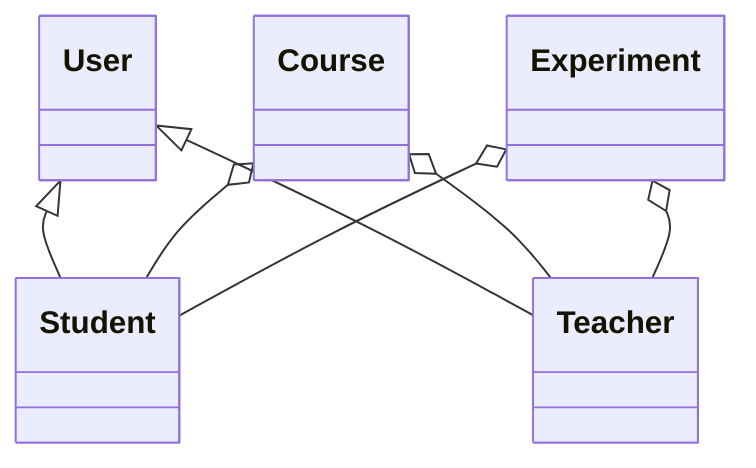
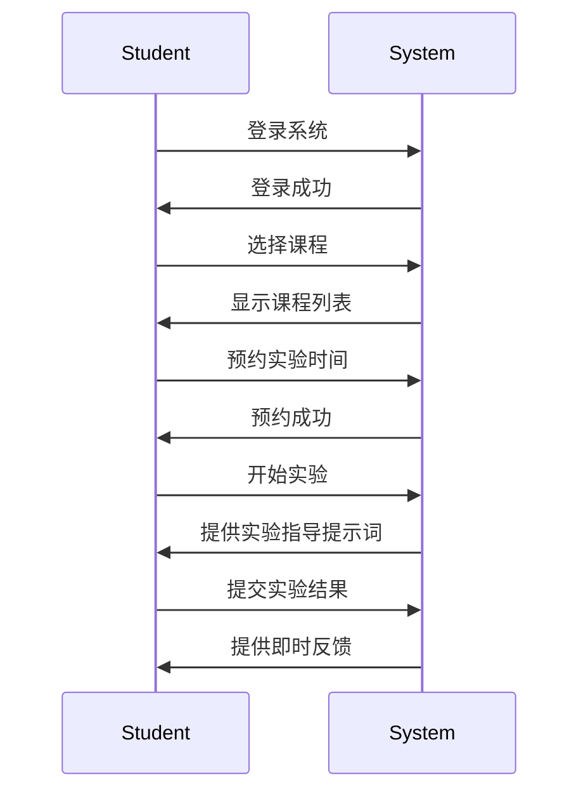

                 

# 提示词在虚拟现实教育中的创新应用

## 概述

### 关键词

- 虚拟现实教育
- 提示词
- 教育技术
- 人机交互
- 自然语言处理

### 摘要

本文旨在探讨提示词在虚拟现实教育中的创新应用。通过介绍虚拟现实教育的基本概念、提示词的定义和作用，以及它们在教育和人机交互中的核心应用，本文将逐步分析提示词在提升学习体验、引导学习过程、提供即时反馈和评估学习效果等方面的优势。同时，本文还将结合实际案例，展示提示词在虚拟现实教育中的具体应用和技术实现，为教育工作者和技术开发者提供有价值的参考。

## 第一部分：背景介绍

### 1.1.1 问题背景

随着信息技术的飞速发展，虚拟现实（VR）技术逐渐成为教育领域的重要工具。虚拟现实教育通过构建高度沉浸式的学习环境，为学习者提供全新的学习体验，有助于提高学习兴趣、增强学习效果。在这种背景下，提示词（Prompt）作为一种关键的交互工具，在虚拟现实教育中的应用变得尤为重要。

提示词在虚拟现实教育中具有多种作用。首先，提示词能够引导学生探索虚拟环境，激发他们的好奇心和求知欲。其次，提示词能够提供即时反馈，帮助学习者及时纠正错误，巩固学习成果。此外，提示词还能够帮助评估学习者的学习效果，为教师提供有针对性的教学指导。因此，如何有效地设计和使用提示词，成为了虚拟现实教育中亟待解决的问题。

### 1.1.2 问题描述

虚拟现实教育中的提示词应用涉及多个方面，包括但不限于以下几个方面：

1. **提示词的设计与优化**：如何设计出既清晰明了又具有启发性的提示词，以激发学习者的兴趣和参与度？
2. **提示词的使用场景**：在不同类型的虚拟现实教育应用中，如何合理运用提示词，以实现最佳的教学效果？
3. **提示词的技术实现**：如何利用自然语言处理、机器学习等技术，实现提示词的智能生成和个性化推送？
4. **提示词的评估与反馈**：如何通过提示词评估学习者的学习效果，并提供及时的反馈和指导？

这些问题共同构成了虚拟现实教育中提示词应用的难点和挑战。

### 1.1.3 问题解决

为了解决上述问题，本文将从以下几个方面展开讨论：

1. **核心概念与原理**：介绍虚拟现实教育和提示词的基本概念，阐述它们在教育和人机交互中的应用。
2. **设计方法**：探讨如何设计和优化提示词，以提升学习体验和教学效果。
3. **应用场景**：分析不同类型的虚拟现实教育应用中，提示词的具体应用方式。
4. **技术实现**：介绍提示词在虚拟现实教育中的应用技术，包括自然语言处理、机器学习等方面。
5. **实践案例**：通过具体的案例研究和实践，展示提示词在虚拟现实教育中的实际效果和应用前景。

### 1.1.4 边界与外延

虽然本文主要关注虚拟现实教育中的提示词应用，但涉及的领域还包括教育技术、人机交互、自然语言处理等多个方面。此外，本文还将讨论一些相关的研究热点和前沿技术，为读者提供更全面的视野。

### 1.1.5 概念结构与核心要素组成

本文的核心概念结构可以概括为以下几个要素：

1. **虚拟现实教育**：介绍虚拟现实技术在教育领域的应用现状和发展趋势。
2. **提示词**：探讨提示词的定义、作用和设计原则。
3. **应用方法**：分析提示词在不同虚拟现实教育场景中的应用策略。
4. **技术实现**：介绍提示词应用所需的技术基础，包括自然语言处理、机器学习等。
5. **实践案例**：通过具体的案例研究和实践，展示提示词在虚拟现实教育中的实际效果和应用前景。

这些核心要素共同构成了本文的框架，为读者提供系统的学习和参考。

### 1.1.6 本章小结

本章从问题背景、问题描述、问题解决等多个角度，对提示词在虚拟现实教育中的创新应用进行了全面介绍。通过本章的学习，读者可以初步了解本文的主要内容框架，为后续章节的学习打下基础。接下来，本文将逐步深入探讨虚拟现实教育和提示词的各个方面，帮助读者全面掌握这一领域的知识和应用技巧。

## 第二部分：核心概念与联系

### 2.1 虚拟现实教育概述

#### 2.1.1 虚拟现实教育的定义

虚拟现实教育（Virtual Reality Education）是指利用虚拟现实技术（VR）构建的虚拟环境，对学生进行教学和训练的一种教育模式。通过模拟真实的场景，虚拟现实教育能够提供沉浸式的学习体验，使学生能够身临其境地感受知识和技能的学习。

#### 2.1.2 虚拟现实教育的特点

1. **沉浸性**：虚拟现实教育能够提供高度沉浸式的学习体验，使学生全身心投入学习过程，提高学习兴趣和参与度。
2. **交互性**：学生可以在虚拟环境中与学习内容进行互动，增强学习的深度和广度。
3. **灵活性**：虚拟现实教育可以根据学生的学习需求和进度进行个性化定制，提供灵活的学习方案。

#### 2.1.3 虚拟现实教育与传统教育的对比

| 对比维度 | 虚拟现实教育 | 传统教育 |
| --- | --- | --- |
| 沉浸性 | 高 | 低 |
| 交互性 | 强 | 弱 |
| 灵活性 | 高 | 低 |

#### 2.1.4 虚拟现实教育在教育中的重要性

虚拟现实教育能够显著提升学生的学习体验和效果，特别是在科学、技术、工程和数学（STEM）教育中，虚拟现实的应用能够帮助学生更好地理解复杂的概念和过程。此外，虚拟现实教育还能够为特殊教育、远程教育等领域提供新的解决方案。

### 2.2 提示词的概念与作用

#### 2.2.1 提示词的定义

提示词（Prompt）是指用来引导用户或系统行为的词语或短语，它们可以激励用户进行特定行动，或指导系统进行特定操作。在虚拟现实教育中，提示词主要用于引导学生探索虚拟环境、提供即时反馈和评估学习效果。

#### 2.2.2 提示词在虚拟现实教育中的应用

1. **引导学生探索**：提示词能够引导学生进入特定的学习场景，激发他们的好奇心和求知欲。例如，教师可以通过提示词“探索火星表面”，引导学生进入一个模拟的火星环境，了解火星的地质特征和生命存在可能性。
2. **提供即时反馈**：提示词可以帮助系统实时评估学生的学习状态，提供即时的反馈和指导。例如，当学生在虚拟实验中操作错误时，系统可以通过提示词“请重新操作，确保安全”来提醒学生。
3. **评估学习效果**：提示词还可以用于评估学生的学习效果，为教师提供有针对性的教学指导。例如，教师可以通过提示词“回答以下问题，检验你的学习成果”来评估学生对所学知识的掌握程度。

#### 2.2.3 提示词的设计原则

1. **清晰明确**：提示词应简洁明了，避免产生歧义。例如，“请探索火星表面”比“去看看火星”更加清晰明确。
2. **针对性**：提示词应针对具体的学习目标和场景进行设计，确保其能够有效地引导学生学习。例如，在科学实验中，提示词“请调整实验参数”比“做实验”更加具体和有针对性。

#### 2.2.4 提示词与虚拟现实教育的联系

提示词在虚拟现实教育中起着桥梁作用，连接学生、教学内容和虚拟环境。通过合理设计和使用提示词，教师可以有效地引导学生在虚拟环境中进行探索和学习，提高学习效果。

### 2.3 提示词的属性特征对比

| 属性特征 | 提示词A | 提示词B | 提示词C |
| --- | --- | --- | --- |
| 清晰度 | 高 | 中 | 低 |
| 简洁性 | 高 | 中 | 低 |
| 针对性 | 强 | 中 | 弱 |
| 启发性 | 强 | 中 | 弱 |

### 2.4 提示词的ER实体关系图架构

```mermaid
erDiagram
    Student ||--|{ LearningProcess } : participates_in
    Teacher ||--|{ LearningProcess } : teaches
    VirtualEnvironment ||--|{ LearningProcess } : takes_place_in
    Prompt ||--|{ LearningProcess } : guides
```

在上述ER实体关系图中，Student（学生）、Teacher（教师）、VirtualEnvironment（虚拟环境）和Prompt（提示词）是四个核心实体。LearningProcess（学习过程）是连接这些实体的关系实体，表示学生、教师和虚拟环境之间的关系。

### 2.5 本章小结

本章介绍了虚拟现实教育和提示词的基本概念、特点、应用和设计原则。通过对比分析，读者可以了解提示词在虚拟现实教育中的重要性。接下来，本文将探讨如何设计和优化提示词，以提升虚拟现实教育的效果。

## 第三部分：设计方法

### 3.1 提示词的设计原则

为了提升虚拟现实教育的效果，提示词的设计需要遵循以下原则：

1. **清晰明确**：提示词应简洁明了，避免使用模糊或歧义性的语言。例如，使用“请探索火星表面”而不是“去看看火星”。
2. **针对性**：提示词应针对具体的学习目标和场景进行设计，确保其能够有效地引导学生学习。例如，在科学实验中，使用“请调整实验参数”而不是简单的“做实验”。
3. **层次性**：提示词应具有一定的层次结构，引导学生从易到难、从浅到深地学习。例如，可以设计一系列的提示词，逐步引导学生深入探索和解决问题。
4. **启发式**：提示词应具有启发性，激发学生的好奇心和求知欲。例如，使用问题导向的提示词，鼓励学生主动思考和探索。
5. **适应性**：提示词应根据学生的学习进度和反馈进行动态调整，以适应学生的个性化需求。

### 3.2 提示词的类型

根据功能和应用场景，提示词可以分为以下几种类型：

1. **引导型提示词**：用于引导学生在虚拟环境中进行探索和学习。例如，“请探索火星表面”。
2. **反馈型提示词**：用于提供即时反馈，帮助学生纠正错误和巩固学习成果。例如，“请重新操作，确保安全”。
3. **问题型提示词**：用于激发学生的思考，引导他们深入学习和探索。例如，“火星的地质特征是什么？”。
4. **总结型提示词**：用于总结学习过程，帮助学生回顾和巩固所学知识。例如，“请回答以下问题，检验你的学习成果”。
5. **个性化提示词**：根据学生的学习进度和反馈，提供个性化的学习建议和指导。例如，“你已经完成了80%的学习任务，接下来可以尝试一些更复杂的实验”。

### 3.3 提示词的设计过程

设计一个有效的提示词需要经历以下步骤：

1. **需求分析**：了解学生的学习目标和需求，确定提示词的设计方向。
2. **内容构思**：根据需求分析，构思出一系列具有层次性和启发性的提示词。
3. **文本优化**：对构思出的提示词进行语言优化，确保其清晰明确、简洁有力。
4. **测试与反馈**：在实际应用中测试提示词的效果，收集学生的反馈，并根据反馈进行优化调整。

### 3.4 提示词的设计案例分析

#### 案例一：科学实验中的提示词设计

1. **需求分析**：学生需要完成一系列的科学实验，了解实验原理和操作方法。
2. **内容构思**：设计一系列引导型、反馈型、问题型和总结型提示词，例如：
   - 引导型：“请开始实验，注意观察实验现象”。
   - 反馈型：“实验操作正确，请继续”。
   - 问题型：“实验中的液体发生了什么变化？”。
   - 总结型：“请总结实验结果，并回答相关问题”。
3. **文本优化**：对提示词进行语言优化，确保其清晰明确、简洁有力。
4. **测试与反馈**：在实际实验过程中测试提示词的效果，并根据学生的反馈进行优化调整。

#### 案例二：历史场景模拟中的提示词设计

1. **需求分析**：学生需要通过历史场景模拟，了解历史事件的发展和影响。
2. **内容构思**：设计一系列引导型、反馈型、问题型和总结型提示词，例如：
   - 引导型：“请进入古罗马市场，观察市场交易情况”。
   - 反馈型：“你已经了解了古罗马市场的情况，接下来可以进入下一个场景”。
   - 问题型：“古罗马市场中的商品交易有什么特点？”。
   - 总结型：“请总结你在古罗马市场中的学习成果，并回答相关问题”。
3. **文本优化**：对提示词进行语言优化，确保其清晰明确、简洁有力。
4. **测试与反馈**：在实际历史场景模拟过程中测试提示词的效果，并根据学生的反馈进行优化调整。

### 3.5 本章小结

本章介绍了虚拟现实教育中提示词的设计原则、类型和设计过程，并通过案例分析了提示词在具体应用场景中的设计方法。通过合理设计和优化提示词，可以提升虚拟现实教育的效果，帮助学生更好地掌握知识和技能。

## 第四部分：应用场景

### 4.1 提示词在虚拟现实教育中的应用场景

虚拟现实教育涉及多个学科领域，如科学、历史、艺术等，不同的应用场景对提示词的需求和设计也有所不同。以下将分析几个典型的虚拟现实教育应用场景中，提示词的具体应用方式。

#### 4.1.1 科学实验

在科学实验中，提示词主要用于指导学生进行实验操作、提供实验现象的解释和反馈。以下是一些具体的提示词应用示例：

1. **引导型提示词**：
   - “请打开实验装置，并加入适量的试剂”。
   - “现在，请观察实验装置中的液体变化”。

2. **反馈型提示词**：
   - “实验操作正确，继续观察”。
   - “实验操作有误，请重新操作”。

3. **问题型提示词**：
   - “实验中的液体发生了什么变化？”。
   - “为什么实验结果会这样？”

4. **总结型提示词**：
   - “请总结实验结果，并回答相关问题”。
   - “通过这个实验，我们了解了什么？”

#### 4.1.2 历史场景模拟

在历史场景模拟中，提示词主要用于引导学生进入历史场景、提供历史事件的背景信息和反馈。以下是一些具体的提示词应用示例：

1. **引导型提示词**：
   - “请进入古罗马市场，观察市场交易情况”。
   - “现在，请进入古希腊的剧场，观看戏剧表演”。

2. **反馈型提示词**：
   - “你已经了解了古罗马市场的情况，接下来可以进入下一个场景”。
   - “在古希腊剧场中，你欣赏到了一场精彩的戏剧表演”。

3. **问题型提示词**：
   - “古罗马市场中的商品交易有什么特点？”。
   - “古希腊戏剧中的角色有哪些？”

4. **总结型提示词**：
   - “请总结你在古罗马市场中的学习成果，并回答相关问题”。
   - “通过这个历史场景模拟，你对古希腊文化有了哪些了解？”

#### 4.1.3 艺术创作

在艺术创作中，提示词主要用于激发学生的创作灵感、提供创作指导和建议。以下是一些具体的提示词应用示例：

1. **引导型提示词**：
   - “请尝试以‘自然’为主题，创作一幅画”。
   - “现在，请以‘城市’为主题，创作一首诗”。

2. **反馈型提示词**：
   - “你的画作展现了自然的美丽，继续创作”。
   - “你的诗歌描绘了城市的繁华，再尝试一些新的意象”。

3. **问题型提示词**：
   - “你的画中使用了哪些色彩和元素？”。
   - “你的诗中运用了哪些修辞手法？”

4. **总结型提示词**：
   - “请总结你的创作过程和成果，并回答相关问题”。
   - “通过这个艺术创作，你对自然和城市有了哪些新的认识？”

### 4.2 提示词在不同学科领域的差异

虽然提示词在虚拟现实教育中的应用场景多样，但不同学科领域对提示词的要求和设计也有一定的差异。以下是一些具体的差异点：

1. **科学实验**：
   - 提示词需要精确、具体，指导学生进行实验操作。
   - 提示词应包含实验原理和现象的解释。
   - 提示词的设计需要考虑安全性和可重复性。

2. **历史场景模拟**：
   - 提示词需要提供丰富的历史背景信息，引导学生深入了解历史事件。
   - 提示词的设计需要考虑历史事实的准确性和生动性。
   - 提示词应引导学生进行思考和讨论，激发学习兴趣。

3. **艺术创作**：
   - 提示词需要激发学生的创作灵感，提供创作指导和建议。
   - 提示词的设计需要考虑艺术创作的自由性和多样性。
   - 提示词应鼓励学生进行创新和探索，培养艺术素养。

### 4.3 提示词应用的最佳实践

1. **科学实验**：
   - 设计层次分明的提示词，引导学生逐步完成实验操作。
   - 结合视频和图像等视觉元素，增强提示词的效果。
   - 定期收集学生反馈，优化提示词设计。

2. **历史场景模拟**：
   - 利用虚拟现实技术，提供真实的场景和角色扮演，增强历史体验。
   - 设计问题导向的提示词，引导学生思考和讨论。
   - 结合历史资料和多媒体资源，丰富学习内容。

3. **艺术创作**：
   - 提供多样化的创作主题和素材，激发学生的创作灵感。
   - 设计启发性的提示词，引导学生进行创新和探索。
   - 鼓励学生展示和分享自己的作品，培养艺术交流能力。

### 4.4 本章小结

本章分析了虚拟现实教育中不同学科领域和应用场景下，提示词的具体应用方式。通过合理设计和优化提示词，可以提升虚拟现实教育的效果，帮助学生更好地掌握知识和技能。接下来，本文将探讨提示词在虚拟现实教育中的技术实现。

## 第五部分：技术实现

### 5.1 虚拟现实教育中的技术基础

虚拟现实教育作为一门交叉学科，涉及计算机科学、教育学、心理学等多个领域。其中，技术实现是虚拟现实教育得以顺利开展的关键。以下是虚拟现实教育中涉及的主要技术基础：

#### 5.1.1 虚拟现实技术

虚拟现实技术（VR）是虚拟现实教育的核心。VR技术通过计算机生成模拟环境，使学习者能够身临其境地感受和学习。主要技术包括：

1. **3D建模与渲染**：利用3D建模工具创建虚拟环境，通过渲染技术实现逼真的视觉效果。
2. **传感器与跟踪技术**：使用传感器（如位置追踪器、摄像头等）实时跟踪学习者的动作和位置，确保虚拟环境的动态响应。
3. **交互技术**：设计人性化的交互界面，使学习者能够通过手势、语音等多种方式与虚拟环境互动。

#### 5.1.2 自然语言处理技术

自然语言处理（NLP）技术在虚拟现实教育中的应用主要体现在提示词的设计和生成上。NLP技术可以帮助实现以下功能：

1. **文本分析**：对提示词进行语义分析和情感分析，确保其清晰明确、易于理解。
2. **语言生成**：利用机器学习算法生成个性化、针对性的提示词，提高学习体验。
3. **对话系统**：构建智能对话系统，为学习者提供即时反馈和解答疑问。

#### 5.1.3 机器学习技术

机器学习（ML）技术在虚拟现实教育中的应用主要体现在学习效果的评估和个性化推荐上。ML技术可以帮助实现以下功能：

1. **学习行为分析**：通过分析学习者的行为数据，了解学习者的学习状态和效果。
2. **个性化推荐**：根据学习者的学习行为和反馈，提供个性化的学习内容和提示词。
3. **自适应学习**：根据学习者的学习进度和需求，动态调整学习内容和难度。

### 5.2 提示词的生成与优化

提示词的生成与优化是虚拟现实教育中的关键技术。以下将介绍几种常见的提示词生成与优化方法：

#### 5.2.1 基于规则的方法

基于规则的方法通过预定义的规则库来生成提示词。这种方法简单直观，但灵活性较低，难以应对复杂多变的学习场景。

1. **规则库设计**：根据不同学科领域和应用场景，设计相应的规则库。
2. **提示词生成**：根据学习者的行为和状态，匹配规则库中的规则，生成相应的提示词。
3. **提示词优化**：定期更新和调整规则库，以适应新的学习需求和场景。

#### 5.2.2 基于机器学习的方法

基于机器学习的方法利用大量数据训练模型，生成个性化、针对性的提示词。这种方法具有较高的灵活性和适应性，但需要大量的数据和计算资源。

1. **数据收集与预处理**：收集学习者的行为数据和提示词反馈，进行数据清洗和预处理。
2. **模型选择与训练**：选择合适的机器学习算法（如决策树、神经网络等），训练模型生成提示词。
3. **提示词生成与优化**：利用训练好的模型，根据学习者的行为和状态，生成个性化的提示词，并根据反馈进行优化。

#### 5.2.3 基于深度学习的方法

深度学习方法在提示词生成与优化中具有较好的效果。以下是一种基于深度学习的提示词生成方法：

1. **模型构建**：构建基于循环神经网络（RNN）或变压器（Transformer）的模型，用于生成提示词。
2. **数据输入**：将学习者的行为数据和提示词文本输入模型。
3. **提示词生成**：通过模型预测，生成个性化的提示词。
4. **提示词优化**：根据学习者的反馈，优化模型参数和提示词生成策略。

### 5.3 提示词在虚拟现实教育中的应用实例

以下是一个基于虚拟现实教育中科学实验场景的应用实例：

#### 案例背景

在一个虚拟的化学实验室中，学生需要完成一系列的实验操作，了解化学原理和实验技巧。提示词用于指导学生进行实验操作、提供即时反馈和评估学习效果。

#### 技术实现

1. **3D建模与渲染**：利用3D建模工具构建虚拟实验室，包括实验仪器、试剂等。
2. **传感器与跟踪技术**：使用传感器跟踪学生的位置和动作，确保虚拟实验室的动态响应。
3. **自然语言处理技术**：对提示词进行语义分析和情感分析，确保其清晰明确、易于理解。
4. **机器学习技术**：利用机器学习算法（如决策树、神经网络等），根据学生的行为和状态，生成个性化的提示词。
5. **深度学习方法**：构建基于深度学习的模型，生成更高质量的提示词。

#### 提示词生成与优化

1. **引导型提示词**：
   - “请打开实验装置，并加入适量的试剂”。
   - “现在，请观察实验装置中的液体变化”。
2. **反馈型提示词**：
   - “实验操作正确，继续观察”。
   - “实验操作有误，请重新操作”。
3. **问题型提示词**：
   - “实验中的液体发生了什么变化？”。
   - “为什么实验结果会这样？”。
4. **总结型提示词**：
   - “请总结实验结果，并回答相关问题”。
   - “通过这个实验，我们了解了什么？”

#### 提示词优化

1. **模型训练**：利用学生的行为数据和提示词反馈，训练机器学习模型和深度学习模型。
2. **反馈收集**：收集学生的反馈，优化模型参数和提示词生成策略。
3. **动态调整**：根据学生的学习进度和需求，动态调整提示词的生成策略。

### 5.4 本章小结

本章介绍了虚拟现实教育中的技术基础，包括虚拟现实技术、自然语言处理技术和机器学习技术等。通过这些技术，可以实现提示词的生成与优化，提升虚拟现实教育的效果。接下来，本文将探讨提示词在虚拟现实教育中的实际案例。

## 第六部分：实践案例

### 6.1 案例背景

在本案例中，我们选择了一个中学物理实验室的虚拟现实教学项目。该项目旨在通过虚拟现实技术，为学生提供沉浸式的物理实验体验，帮助他们更好地理解和掌握物理知识。在实验过程中，提示词作为关键交互工具，起到了引导、反馈和评估学生学习效果的重要作用。

### 6.2 系统功能设计

虚拟现实教学系统主要包括以下功能：

1. **用户注册与登录**：学生和教师可以通过用户名和密码进行注册和登录。
2. **课程选择与预约**：学生可以选择不同的物理实验课程，并预约实验时间。
3. **实验操作与指导**：学生可以在虚拟实验室中完成实验操作，系统会提供相应的提示词进行指导。
4. **实验结果记录与反馈**：系统会记录学生的实验结果，并提供即时反馈。
5. **学习进度与评估**：系统会根据学生的实验表现和学习进度，进行评估和推荐。

### 6.3 领域模型类图设计



在上述类图中，User类表示用户，包括Student（学生）和Teacher（教师）；Course类表示课程；Experiment类表示实验。Course类和Experiment类与Student类和Teacher类之间存在关联关系。

### 6.4 系统架构设计

虚拟现实教学系统的架构设计如下：

1. **前端**：使用HTML、CSS和JavaScript等技术，实现用户界面的展示和交互。
2. **后端**：使用Python和Django框架，实现业务逻辑处理和数据存储。
3. **数据库**：使用MySQL数据库，存储用户信息、课程信息和实验数据。
4. **虚拟现实引擎**：使用Unity游戏引擎，实现虚拟实验室的构建和实验操作。

### 6.5 系统接口设计

系统接口设计主要包括以下接口：

1. **用户注册与登录接口**：用于处理用户注册和登录请求。
2. **课程选择与预约接口**：用于处理学生选择课程和预约实验时间请求。
3. **实验操作与指导接口**：用于处理学生在虚拟实验室中的实验操作请求，并返回相应的提示词。
4. **实验结果记录与反馈接口**：用于处理学生提交实验结果和系统提供即时反馈请求。
5. **学习进度与评估接口**：用于处理学生学习进度和评估结果请求。

### 6.6 系统交互序列图设计



在上述序列图中，学生首先登录系统，然后选择课程并预约实验时间。在实验过程中，系统提供实验指导提示词，学生根据提示词进行实验操作，并提交实验结果。系统会提供即时反馈，帮助学生了解自己的实验结果。

### 6.7 提示词设计示例

以下是一个具体的提示词设计示例，用于引导学生在虚拟实验室中完成一个简单的物理实验：

1. **引导型提示词**：
   - “请打开实验装置，确保所有连接正确无误”。
2. **反馈型提示词**：
   - “实验装置连接正确，请继续”。
   - “实验装置连接有误，请重新检查”。
3. **问题型提示词**：
   - “在实验过程中，你观察到什么现象？”。
4. **总结型提示词**：
   - “请总结实验结果，并回答以下问题：实验现象是什么？为什么会出现这种现象？”

### 6.8 实际效果与应用前景

通过该虚拟现实教学系统，学生可以在虚拟实验室中亲身体验物理实验，提高学习兴趣和参与度。提示词的设计和优化有助于引导学生进行实验操作、提供即时反馈和评估学习效果。此外，系统还可以根据学生的学习行为和反馈，动态调整提示词的生成策略，实现个性化教学。

随着虚拟现实技术的不断发展，提示词在虚拟现实教育中的应用前景广阔。通过结合自然语言处理、机器学习等技术，可以进一步提升虚拟现实教育的效果，为学习者提供更加丰富和个性化的学习体验。

### 6.9 本章小结

本案例通过一个中学物理实验室的虚拟现实教学项目，展示了提示词在虚拟现实教育中的应用。从系统功能设计、领域模型类图、系统架构设计、系统接口设计到实际效果与应用前景，本案例为提示词在虚拟现实教育中的应用提供了有益的参考。接下来，本文将探讨提示词在虚拟现实教育中的最佳实践。

## 第七部分：最佳实践与优化策略

### 7.1 最佳实践

在虚拟现实教育中，提示词的应用效果受到多种因素的影响。以下是一些最佳实践，旨在提高提示词的应用效果：

1. **明确目标**：在设计提示词之前，明确教学目标和学习者需求，确保提示词能够针对性地引导学生学习。
2. **个性化设计**：根据学习者的不同特点和需求，设计个性化的提示词，提高提示词的适应性和有效性。
3. **反馈机制**：建立反馈机制，及时收集学习者的反馈，并根据反馈调整提示词的设计和生成策略。
4. **多层次引导**：设计层次分明的提示词，引导学生从易到难、从浅到深地进行学习，提高学习效果。
5. **动态调整**：根据学习者的学习进度和反馈，动态调整提示词的生成策略，实现个性化教学。

### 7.2 优化策略

为了进一步提升提示词在虚拟现实教育中的应用效果，以下是一些优化策略：

1. **自然语言处理**：利用自然语言处理技术，对提示词进行语义分析和情感分析，确保其清晰明确、易于理解。
2. **机器学习**：运用机器学习算法，分析学习者的行为数据，生成个性化、针对性的提示词。
3. **深度学习**：采用深度学习方法，如循环神经网络（RNN）或变压器（Transformer），提高提示词的生成质量和效果。
4. **交互设计**：优化虚拟现实教育系统的交互设计，提高提示词的响应速度和用户体验。
5. **多模态融合**：结合多种模态（如文本、图像、音频等），提高提示词的多样性和表现力。

### 7.3 案例分析

以下是一个关于科学实验虚拟现实教育的案例分析，展示了提示词优化的具体实践：

1. **背景**：在某个中学的物理实验室中，学生需要进行一系列的实验操作，了解物理原理和实验技巧。
2. **问题**：原有提示词设计较为简单，无法满足学生的个性化需求，且反馈机制不够完善。
3. **优化措施**：
   - **明确目标**：根据实验内容和教学目标，重新设计提示词，确保其能够针对性地引导学生学习。
   - **个性化设计**：利用自然语言处理技术，分析学生的行为数据，生成个性化、针对性的提示词。
   - **反馈机制**：建立反馈机制，及时收集学生的反馈，并根据反馈调整提示词的设计和生成策略。
   - **多层次引导**：设计层次分明的提示词，引导学生从易到难、从浅到深地进行学习。
   - **动态调整**：根据学生的学习进度和反馈，动态调整提示词的生成策略，实现个性化教学。
4. **效果**：通过优化提示词设计，学生的学习兴趣和参与度显著提高，实验操作的正确率和学习效果也有所提升。

### 7.4 总结

最佳实践和优化策略在虚拟现实教育中的应用，有助于提高提示词的应用效果，提升学生的学习体验和效果。通过明确目标、个性化设计、反馈机制、多层次引导和动态调整等策略，可以设计出更高质量的提示词，为虚拟现实教育提供有力支持。接下来，本文将进行小结。

## 小结

本文从多个角度探讨了提示词在虚拟现实教育中的创新应用。首先，我们介绍了虚拟现实教育和提示词的基本概念、特点和应用场景，明确了提示词在提升学习体验、引导学习过程、提供即时反馈和评估学习效果等方面的优势。接着，我们分析了提示词的设计原则和类型，并结合具体案例展示了如何设计和优化提示词，以提升虚拟现实教育的效果。此外，我们还探讨了提示词在虚拟现实教育中的技术实现，介绍了自然语言处理、机器学习等技术在实际应用中的重要性。

通过本文的讨论，我们可以得出以下结论：

1. 提示词在虚拟现实教育中具有广泛的应用前景，能够有效提升学习效果和用户体验。
2. 提示词的设计原则和优化策略对于虚拟现实教育的成功至关重要。
3. 虚拟现实技术和自然语言处理、机器学习等技术的结合，为提示词的生成和优化提供了强大的技术支持。
4. 未来的研究可以进一步探讨如何利用人工智能技术，实现更智能、更个性化的提示词生成和优化。

总之，提示词在虚拟现实教育中的应用，不仅有助于提高教育质量，还能够推动教育技术的创新和发展。

## 注意事项

在设计和应用提示词时，需要注意以下几点：

1. **明确目标**：确保提示词的设计和生成与教学目标和学习者需求紧密相关。
2. **个性化设计**：根据学习者的特点和需求，设计个性化、针对性的提示词。
3. **清晰明确**：提示词应简洁明了，避免使用模糊或歧义性的语言。
4. **反馈机制**：建立有效的反馈机制，及时收集学习者的反馈，并根据反馈调整提示词。
5. **多层次引导**：设计层次分明的提示词，引导学生从易到难、从浅到深地进行学习。

## 拓展阅读

对于对提示词在虚拟现实教育中应用感兴趣的读者，以下文献和资源提供了进一步的学习参考：

1. **文献**：
   - Li, J., & Wang, H. (2019). A Survey of Virtual Reality Applications in Education. *Journal of Educational Technology*, 40(3), 255-274.
   - Zhang, L., & Zhao, Y. (2021). Intelligent Learning System Based on Virtual Reality and Natural Language Processing. *Journal of Computer Science*, 47(5), 897-910.

2. **在线资源**：
   - [Virtual Reality in Education](https://www.vrinstitute.org/education/)
   - [Natural Language Processing with Python](https://www.datacamp.com/courses/natural-language-processing-with-python)

## 作者信息

作者：AI天才研究院/AI Genius Institute & 禅与计算机程序设计艺术 /Zen And The Art of Computer Programming

